# Artificial Intelligence in Health Care: An Interprofessional Introduction

***Assistant Prof. Dr. Shereen Elsaid Elkholy***

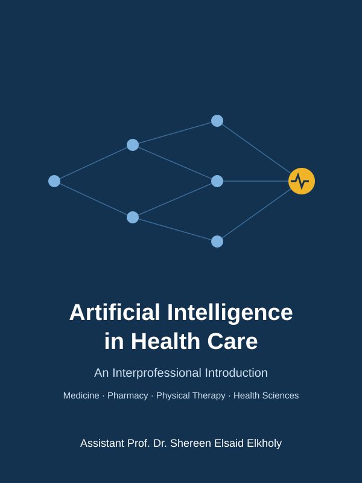

## Contents

- [Chapter 1: What AI Is — and Isn't](#chapter-1-what-ai-is--and-isnt)
- [Chapter 2: Health Data — What AI Learns From](#chapter-2-health-data--what-ai-learns-from)
- [Chapter 3: How Models Learn — and How They Fail](#chapter-3-how-models-learn--and-how-they-fail)
- [Chapter 4: Reading an AI Performance Claim](#chapter-4-reading-an-ai-performance-claim)
- [Chapter 5: Generative AI and Large Language Models](#chapter-5-generative-ai-and-large-language-models)
- [Chapter 6: Seeing Disease — Imaging, Laboratory and Pathology](#chapter-6-seeing-disease--imaging-laboratory-and-pathology)
- [Chapter 7: Medicines — Discovery, Dosing and Safety](#chapter-7-medicines--discovery-dosing-and-safety)
- [Chapter 8: AI in Motion — Rehabilitation, Wearables and Robotics](#chapter-8-ai-in-motion--rehabilitation-wearables-and-robotics)
- [Chapter 9: Monitoring, Prediction and Population Health](#chapter-9-monitoring-prediction-and-population-health)
- [Chapter 10: Bias, Fairness and Privacy](#chapter-10-bias-fairness-and-privacy)
- [Chapter 11: Regulation, Liability and the Human in the Loop](#chapter-11-regulation-liability-and-the-human-in-the-loop)
- [Glossary](#glossary)

## How to Use This Book

This book is for students of medicine, pharmacy, physical therapy and the health sciences. You do not need clinical experience. You do not need to write code. You need curiosity and a willingness to ask, "How do we know this works?"

The book has three parts.

- **Part I — Foundations (Chapters 1–5)** explains what AI is, how it learns from health data, how it fails, and how to judge a performance claim. Every student should read all of Part I.
- **Part II — AI Across the Care Pathway (Chapters 6–9)** shows AI at work: seeing disease, managing medicines, supporting movement and rehabilitation, and predicting deterioration.
- **Part III — Responsible AI (Chapters 10–11)** covers bias, privacy, regulation, liability and the human in the loop.

Every chapter is for every profession. Some chapters sit closer to your future work:

| Profession | Chapters to read most closely |
|---|---|
| Medicine | 6, 9, 11 |
| Pharmacy | 7, 9, 5 |
| Physical Therapy | 8, 6, 10 |
| Health Sciences (laboratory, imaging, nutrition, public health) | 2, 6, 9 |

## Boxes You Will Meet

- **Opening Case** — a patient story that raises the chapter's question.
- **Medical Background in 60 Seconds** — the clinical idea you need, in plain words.
- **Through Four Lenses** — what the chapter means for each of the four professions.
- **Myth vs Evidence** — a common belief, checked against research.
- **Safety Alert** — one point that protects patients.
- **Deeper Dive** — optional detail. You can skip it and still follow the chapter.

Numbers in square brackets, such as [3], point to the numbered references at the end of each chapter. Words in **bold** are defined in the Glossary.

## Meet the Patients

Three patients return throughout the book. Their details stay the same in every chapter.

**Mrs. Amal Hassan, 61.** Amal is a retired schoolteacher. She has type 2 diabetes and high blood pressure. She takes seven medicines every day. Her kidney function is mildly reduced (eGFR 52). She worries about losing her sight, like her mother did. She meets a family physician, a community pharmacist, a laboratory technologist and, later, a hospital team.

**Mr. Karim Adel, 34.** Karim is a construction worker and the main earner for his family. He twisted his left knee on site and tore a ligament. He needs to return to heavy physical work. He is worried about time off and about pain medicines. He meets an emergency physician, a radiographer, a pharmacist and a physiotherapist.

**Ms. Lina Osei, 20.** Lina is a biology student. She has dark skin (Fitzpatrick type V). A mole on her forearm has changed shape. She feels anxious about health and often searches online before she sees anyone. She meets a chatbot first, then a pharmacist, a dermatologist and a public-health team running a skin-cancer awareness campaign.

## Who Is in the Care Team

Each chapter's case shows a different professional making the key decision: a physician, a pharmacist, a physiotherapist, a laboratory or imaging technologist, or a public-health officer. AI supports each of them. It does not replace any of them.

---

# Chapter 1: What AI Is — and Isn't

## Opening Case
It is 11 p.m. Lina Osei, a 20-year-old biology student, notices that the mole on her forearm looks larger. One edge seems darker than before. She does not want to wait for a clinic. She opens a chatbot on her phone and types, "Is this mole cancer?" She uploads a photo.

The reply arrives in two seconds. It is calm, fluent and kind. It lists the warning signs of melanoma. It says her mole "shows some features of concern" and advises her to see a doctor. Lina feels both reassured and frightened.

The next morning she shows the reply to a community pharmacist. The pharmacist asks a simple question: "What exactly looked at your photo, and how does it know?" This chapter answers that question.

## Learning Objectives
By the end of this chapter you will be able to:
1. [LO1] Distinguish artificial intelligence, machine learning, deep learning and generative AI.
2. [LO2] Contrast a rule-based system with a learned model using a health example.
3. [LO3] Describe four milestones in the history of AI in health care.
4. [LO4] Identify one realistic benefit and one realistic risk of AI for each health profession.

## 1.1 Four Words You Will Hear Every Day
**Artificial intelligence** (AI) is the broad goal of building computer systems that perform tasks we link with human thinking. Examples are recognising images, understanding language and making predictions.

**Machine learning** (ML) is one way to reach that goal. Instead of following rules written by a person, the computer learns patterns from examples. The examples are called **training data**. The result of learning is a **model**: a mathematical function that turns an input into an output.

**Deep learning** is a type of machine learning that uses a **neural network** with many layers. Each layer transforms the data a little. Together, the layers can learn very complex patterns. Deep learning is good with images, sound and text, because it finds useful features by itself.

**Generative AI** produces new content, such as text, images or computer code. A **large language model** (LLM) is a generative model trained on huge amounts of text. The chatbot that answered Lina is an LLM.

*Figure 1.1 — Artificial intelligence contains machine learning, which contains deep learning. Generative AI and large language models are built with deep learning. Illustrative.*

These terms nest inside each other, as Figure 1.1 shows. Every LLM is a deep-learning model. Not every AI system is a deep-learning model.

## 1.2 Rules Versus Learning
Older computer programs in health care were **rule-based system**s. A person writes each rule. For example: "If the patient takes warfarin and a new prescription contains aspirin, show a bleeding-risk warning." The logic is transparent. Anyone can read the rule and check it. But rules break when reality is messier than the rule writer imagined.

A learned model works differently. It sees thousands of past prescriptions and outcomes. It learns which combinations of drugs, doses, ages and kidney function were followed by bleeding. It then gives a risk score for a new prescription. It can capture patterns no person wrote down. It can also learn patterns that are wrong, biased or accidental. You cannot read its logic line by line.

Neither approach is always better. In many clinical prediction tasks, simple statistical models perform as well as complex machine learning [7]. Chapter 3 returns to this point.

> **Medical Background in 60 Seconds:** A **clinical decision support** system is software that gives a health professional advice at the moment of a decision. Examples are drug-interaction warnings in a pharmacy system, reminders for overdue vaccines and alerts for abnormal laboratory results. Some use rules. Some use machine learning.

## 1.3 A Short History
**1956 — the name.** A summer workshop at Dartmouth College in the United States gave the field its name. The 1955 proposal claimed that "every aspect of learning" could in principle be simulated by a machine [1]. Early optimism was high. Progress was slower than promised.

**1970s — expert systems.** At Stanford, MYCIN used about 600 hand-written rules to recommend antibiotics for blood infections [2]. In tests, its advice compared well with that of specialists. It was never used in routine care. Computers were not at the bedside, and no one had settled who would be responsible for its advice. This lesson still matters: good performance in a study does not guarantee use in practice.

**2012 — deep learning takes off.** A deep neural network won a large image-recognition competition by a wide margin [3]. Better computer chips and large image collections made this possible. Medicine soon followed. In 2016 a deep-learning model graded diabetic eye disease from retinal photographs with high accuracy in a retrospective study [4].

**2018 — the first autonomous diagnostic device.** The US Food and Drug Administration authorised an AI system that screens retinal photos for diabetic eye disease without a specialist reading them [5]. It was tested prospectively in primary-care clinics. This was a turning point: AI made the screening decision itself.

**2020s — generative AI.** In 2021 AlphaFold predicted protein structures with near-experimental accuracy [9]. From 2022, LLMs such as ChatGPT reached the public. Health professionals now use them to draft notes, summarise papers and explain conditions to patients [10].

## 1.4 What AI Can and Cannot Do Today
AI is strong at narrow, well-defined tasks with lots of examples. It can sort, detect, measure and predict. A large Swedish randomised trial of breast screening is a good example [8]. When AI helped read mammograms, the screen-reading workload fell by 44%. About 20% more cancers were detected, and false-positive recalls did not rise.

AI is weak at tasks it has never seen. It has no common sense and no understanding of a patient's life. A model trained in one hospital may fail in another. An LLM can write a confident answer that is false. It cannot examine a patient, notice fear in a voice or take responsibility for a decision.

The honest summary is this: AI is a powerful tool with a narrow field of vision [6]. It works best as part of a team.

> **Through Four Lenses**
> - **Medicine:** Physicians meet AI in image reading, risk scores and note writing. The benefit is faster, more consistent detection. The risk is trusting a score without checking the patient.
> - **Pharmacy:** Pharmacists meet AI in interaction checks, dosing tools and drug-information chatbots. The benefit is catching dangerous combinations. The risk is alert fatigue and fluent but wrong answers.
> - **Physical Therapy:** Physiotherapists meet AI in video movement analysis, wearables and home exercise apps. The benefit is objective progress measures. The risk is a model trained on athletes misjudging older or injured bodies.
> - **Health Sciences:** Laboratory and imaging technologists meet AI in automated analysers, slide scanners and image quality checks. The benefit is speed and consistency. The risk is silent failure after equipment changes.

## 1.5 Three Risks to Watch
This book returns to three risks again and again.

First, **bias**. A model learns from past data. If the data under-represent some groups, the model may perform worse for them. Chapter 10 covers this.

Second, **hallucination**. An LLM predicts plausible words. It does not check facts. It can invent a drug dose or a journal article. Chapter 5 covers this.

Third, **automation bias**. People tend to accept a computer's answer, even when their own judgment disagrees. Chapter 11 covers this.

Lina's chatbot illustrates all three. It may not have learned from many photos of dark skin. It wrote fluent text, not a checked diagnosis. And its calm tone made her trust it. The pharmacist was right to ask how it knew.

> **Myth vs Evidence:** Myth: "AI will soon replace clinicians." Evidence: AI performs well on narrow tasks, such as screening images, but it has not replaced professional judgment. Even in the largest screening trial, AI changed the reading workflow; radiologists still made the final decisions [8].

> **Safety Alert:** A chatbot's answer is not a diagnosis. Any changing mole, new symptom or medicine question needs a qualified health professional. Tell patients this clearly and kindly.

## Key Takeaways
- AI is the broad goal; machine learning learns from data; deep learning uses many-layered neural networks; generative AI creates new content.
- Rule-based systems are transparent but brittle. Learned models are flexible but harder to inspect.
- History shows that good test results do not guarantee safe, real-world use.
- AI is strong at narrow, data-rich tasks and weak outside the conditions it learned.
- Bias, hallucination and automation bias affect every profession.

## Self-Assessment
**Q1.** A pharmacy system shows a warning whenever warfarin and aspirin appear on the same prescription. A programmer wrote this condition by hand. What kind of system is this? [LO2]
A) A deep-learning model
B) A rule-based system
C) A large language model
D) An unsupervised clustering model

**Q2.** Which statement about the relationship between these terms is correct? [LO1]
A) Machine learning includes artificial intelligence as a subtype.
B) Every AI system uses a neural network.
C) Generative AI is unrelated to deep learning.
D) Deep learning is a type of machine learning.

**Q3.** MYCIN performed well in tests in the 1970s but was never used in routine care. What is the main lesson for today's AI tools? [LO3]
A) Good study performance does not guarantee real-world adoption and safe use.
B) Rule-based systems are always less accurate than learned models.
C) Antibiotic prescribing cannot be supported by computers.
D) Expert systems were banned by regulators.

**Q4.** A physiotherapy clinic buys an app that scores knee movement from phone videos. It was trained only on young athletes. Karim is 34 and a manual worker with an injured knee. Which risk is most important? [LO4]
A) Hallucination of a drug dose
B) Loss of patient privacy through the pharmacy system
C) Poor performance on people unlike those in the training data
D) The app will refuse to work on videos

**Q5.** A student says, "The chatbot is an LLM, so it checks medical facts before answering." What is wrong with this statement? [LO1]
A) LLMs cannot produce text.
B) LLMs predict plausible text and do not check facts by design.
C) LLMs only work with images.
D) LLMs always refuse medical questions.

**Q6.** What happened in 2018 that marked a turning point for AI in health care? [LO3]
A) An autonomous AI system for diabetic eye screening was authorised in the United States.
B) The term "artificial intelligence" was first used.
C) AlphaFold solved protein structures.
D) MYCIN entered routine hospital use.

**Q7.** In the MASAI breast-screening trial, what did AI support achieve? [LO4]
A) It replaced radiologists entirely.
B) It reduced cancer detection but saved time.
C) It halved the number of women screened.
D) It reduced screen-reading workload by 44% while detecting more cancers.

**Q8.** Which feature best describes an advantage of a learned model over a rule-based system? [LO2]
A) Its logic can be read line by line.
B) It never makes errors.
C) It can capture patterns that no person wrote down.
D) It needs no data.

**Q9.** A laboratory analyser's AI works well for months. Then the reagent supplier changes, and error rates rise without any warning. Which risk from this chapter does this show? [LO4]
A) Silent failure when conditions change from those the model learned
B) Hallucination of references
C) Automation bias in patients
D) A rule written incorrectly by a programmer

**Q10.** What was a key enabler of the deep-learning breakthrough around 2012? [LO3]
A) New laws requiring AI in hospitals
B) Faster computer chips and large collections of labelled images
C) The invention of rule-based systems
D) The end of the Dartmouth workshop

**Case Question.** Lina shows you the chatbot's answer about her mole. In four or five sentences, explain to her what kind of system produced the answer, one reason it might be wrong for her, and what she should do next.

## Answers and Rationales
**Q1. B** — A condition written by a person is a rule. A and D learn from data. C generates text.

**Q2. D** — Deep learning is a subtype of machine learning. A reverses the nesting. B is false because rule-based AI exists. C is false because generative AI is built with deep learning.

**Q3. A** — MYCIN was never adopted because of practical and responsibility barriers, not poor accuracy. B overgeneralises. C is false. D did not happen.

**Q4. C** — A model trained on one group may fail on people who differ from it. A concerns LLMs. B is unrelated. D is not the main risk.

**Q5. B** — LLMs generate the most plausible next words; fact-checking is not built in. A, C and D are false.

**Q6. A** — In 2018 the FDA authorised an autonomous diabetic-retinopathy screening system [5]. B happened in 1956. C happened in 2021. D never happened.

**Q7. D** — Workload fell by 44% and detection rose by about 20% [8]. A and C are false. B reverses the finding.

**Q8. C** — Learned models find patterns from examples. A describes rule-based systems. B and D are false.

**Q9. A** — A change in inputs caused a silent drop in performance. B and C are unrelated. D is wrong because the system learned, not followed a written rule.

**Q10. B** — Better hardware and large labelled image sets made deep learning practical [3]. A, C and D are wrong.

**Case Question — model answer.** The answer came from a large language model, which writes plausible text but does not check facts or examine skin. It may have learned mostly from images of light skin, so it may misjudge a mole on dark skin. Its fluent tone can make it sound more certain than it is. A changing mole should be examined by a clinician, ideally a dermatologist, soon. The chatbot's advice to see a doctor is the part to follow.

## References
1. McCarthy J, Minsky ML, Rochester N, Shannon CE. A proposal for the Dartmouth summer research project on artificial intelligence. 1955. http://jmc.stanford.edu/articles/dartmouth/dartmouth.pdf
2. Shortliffe EH. Design considerations for MYCIN. In: Computer-Based Medical Consultations: MYCIN. Elsevier; 1976:63-78. DOI: 10.1016/b978-0-444-00179-5.50008-1
3. Krizhevsky A, Sutskever I, Hinton GE. ImageNet classification with deep convolutional neural networks. Commun ACM. 2017;60(6):84-90. DOI: 10.1145/3065386
4. Gulshan V, Peng L, Coram M, et al. Development and validation of a deep learning algorithm for detection of diabetic retinopathy in retinal fundus photographs. JAMA. 2016;316(22):2402-2410. DOI: 10.1001/jama.2016.17216
5. Abràmoff MD, Lavin PT, Birch M, et al. Pivotal trial of an autonomous AI-based diagnostic system for detection of diabetic retinopathy in primary care offices. NPJ Digit Med. 2018;1:39. DOI: 10.1038/s41746-018-0040-6
6. Topol EJ. High-performance medicine: the convergence of human and artificial intelligence. Nat Med. 2019;25(1):44-56. DOI: 10.1038/s41591-018-0300-7
7. Christodoulou E, Ma J, Collins GS, et al. A systematic review shows no performance benefit of machine learning over logistic regression for clinical prediction models. J Clin Epidemiol. 2019;110:12-22. DOI: 10.1016/j.jclinepi.2019.02.004
8. Lång K, Josefsson V, Larsson AM, et al. Artificial intelligence-supported screen reading versus standard double reading in the Mammography Screening with Artificial Intelligence trial (MASAI): a clinical safety analysis of a randomised, controlled, non-inferiority, single-blinded, screening accuracy study. Lancet Oncol. 2023;24(8):936-944. DOI: 10.1016/s1470-2045(23)00298-x
9. Jumper J, Evans R, Pritzel A, et al. Highly accurate protein structure prediction with AlphaFold. Nature. 2021;596(7873):583-589. DOI: 10.1038/s41586-021-03819-2
10. Thirunavukarasu AJ, Ting DSJ, Elangovan K, et al. Large language models in medicine. Nat Med. 2023;29(8):1930-1940. DOI: 10.1038/s41591-023-02448-8

---

# Chapter 2: Health Data — What AI Learns From

## Opening Case
Amal Hassan, 61, has lived with type 2 diabetes for twelve years. Her story is spread across many computers. The family clinic holds her blood-pressure readings and diagnoses. The laboratory holds ten years of glucose and kidney results. The pharmacy holds every refill of her seven medicines. The eye clinic holds three retinal photographs.

A laboratory technologist is asked to help build a model that predicts which patients like Amal will lose kidney function in the next two years. She opens the data. Some results are missing. Some diagnoses are coded differently in the two clinics. The pharmacy data use a different patient number. What does a model actually learn from, and what can go wrong before learning even starts?

## Learning Objectives
By the end of this chapter you will be able to:
1. [LO1] Classify health data into structured data, images, signals, text and omics.
2. [LO2] Explain what a label is and why labelling is costly and error-prone.
3. [LO3] Identify common data-quality problems, including missing data and bias in who gets tested.
4. [LO4] Recognise the main health-data standards and famous public datasets, and who they leave out.

## 2.1 Five Kinds of Health Data
Health data come in five broad kinds.

**Structured data** fit neatly into rows and columns. Examples are age, blood pressure, laboratory values, diagnosis codes, prescriptions and dispensing records. Amal's creatinine results and refill dates are structured data.

Images are grids of numbers. X-rays, CT and MRI scans, retinal photographs, skin photos and scanned pathology slides are all images. So is a video of a patient walking.

Signals are measurements over time. An electrocardiogram (ECG), a continuous glucose monitor and a wrist accelerometer all produce signals.

Text is written language: clinic notes, discharge letters, radiology reports and pharmacy counselling notes. Text is rich but messy.

**Omics** data describe molecules. Genomics reads DNA. Pharmacogenomics looks at genes that change how a person handles a drug.

Images, signals and text are often called **unstructured data**. They need more processing before a model can use them.

> **Medical Background in 60 Seconds:** An **electronic health record** (EHR) is the digital version of a patient's chart. It holds diagnoses, medicines, results, notes and appointments. Creatinine is a waste product filtered by the kidneys. A rising blood creatinine suggests falling kidney function. Doctors use it to estimate the glomerular filtration rate (eGFR). Amal's eGFR is 52, which is mildly reduced.

> **Deeper Dive:** To a computer, a grey-scale CT slice is a 512 × 512 grid of numbers. Each number records how strongly that point absorbed X-rays. A colour photo has three such grids: red, green and blue. Medical images are stored in the **DICOM** format. A DICOM file also carries **metadata**: the patient's age, the scanner model, the hospital and the date. Metadata help clinicians. They can also let a model "cheat" by learning which scanner was used instead of what disease is present. Chapter 3 calls this shortcut learning.

## 2.2 Labels: The Answers a Model Learns From
Most medical AI uses supervised learning. The model sees an input and the correct answer, then learns to link them. The correct answer is called a **label**. For Amal's kidney model, the label might be "eGFR fell by 30% or more within two years: yes or no."

Labels come from four main sources:

- **Expert annotation.** A specialist marks each image or case. This is accurate but slow and expensive.
- **Codes.** Diagnosis codes entered for billing or records. Cheap, but often incomplete or wrong.
- **Outcomes.** Something that happened later, such as death, admission or a laboratory value crossing a threshold.
- **Text mining.** Software reads reports and extracts a label. Several famous chest X-ray datasets were labelled this way [3, 4].

Every source has errors. Wrong labels are called **label noise**. A model trained on noisy labels learns the noise too. If the codes miss half of the patients with kidney disease, the model learns an incomplete picture of kidney disease.

The choice of label also carries values. Chapter 10 describes a model that used health-care cost as its label for health need. Because less money had been spent on some groups, the model under-rated their need.

## 2.3 Data Quality: Problems Before Learning Starts
Health data are collected for care and billing, not for training AI. This creates predictable problems.

**Missing data.** Many values are empty. Data can be missing for random reasons, such as a lost sample. More often they are missing for meaningful reasons. A test is ordered because a clinician is worried. So the mere presence of a test carries information. One large study found that whether and when a laboratory test was ordered was strongly linked to survival, often more than the result itself [7]. A model can learn the ordering habits of clinicians, not the biology of disease.

**Bias in who gets tested.** People who cannot reach a clinic produce fewer records. Their disease may look rarer in the data than it really is.

**Inconsistent coding.** The same condition may be coded in different ways in different clinics. The same drug may have a brand name in one system and a generic name in another.

**Linkage errors.** Amal's pharmacy record uses a different patient number. Joining the records wrongly could attach someone else's medicines to her.

**Changes over time.** Laboratory methods, coding systems and clinical guidelines change. Data from ten years ago may mean something different from data collected today.

## 2.4 Speaking the Same Language: Standards
Data from different systems can only be combined if they use shared rules. This ability to exchange and use data is called **interoperability**.

| Standard | What it covers | Example |
|---|---|---|
| DICOM | Medical images and their metadata | A CT scan moving from scanner to viewing station |
| HL7 FHIR | Exchange of health records between systems | A clinic app requesting Amal's latest results |
| ICD | Diagnosis codes | E11 for type 2 diabetes |
| SNOMED CT | Detailed clinical terms | Specific findings, procedures and body sites |
| LOINC | Laboratory and clinical observations | A code for serum creatinine |
| ATC | Drug classification | A10BA02 for metformin |

You need not memorise these codes. When an AI tool fails at a new site, a coding mismatch is a common reason.

## 2.5 Famous Datasets and Who They Leave Out
A few large public datasets trained a large share of published medical AI.

- MIMIC-IV contains records of intensive-care and emergency patients from one hospital in Boston, USA [1]. MIMIC-CXR adds over 370,000 chest X-rays with reports from the same hospital [2].
- CheXpert holds 224,316 chest X-rays from 65,240 patients at Stanford, labelled by software reading the reports [3].
- ChestX-ray8 from the US National Institutes of Health holds 108,948 X-rays labelled the same way [4].
- The Cancer Genome Atlas (TCGA) links tumour genetics, pathology slides and outcomes for thousands of patients [5].
- UK Biobank follows about half a million adults aged 40 to 69 from the United Kingdom [6]. Its volunteers are healthier and less ethnically diverse than the general population [8].

These open datasets are valuable. But they come mostly from a few wealthy countries and large academic hospitals. A model built on them may not fit a clinic in Cairo, Lagos or a rural district anywhere.

> **Through Four Lenses**
> - **Medicine:** Physicians create much of the record. Clear diagnoses and complete problem lists become labels. Vague or copied notes become label noise that future models will learn from.
> - **Pharmacy:** Pharmacists hold dispensing data that show what patients actually collect. Refill gaps reveal non-adherence that prescriptions alone hide. This makes pharmacy data valuable for prediction models.
> - **Physical Therapy:** Physiotherapists record range of motion, pain scores and exercise progress. When these are free text, models cannot use them. Structured outcome measures make rehabilitation visible in the data.
> - **Health Sciences:** Laboratory and imaging technologists control how samples and images are produced. Calibration logs, analyser changes and scanner settings explain many shifts that later confuse AI models.

> **Myth vs Evidence:** Myth: "More data always means a better model." Evidence: Large datasets can still be biased or noisy. Test-ordering patterns alone predict outcomes, so a big dataset may teach clinician behaviour rather than disease [7]. Quality and representativeness matter as much as size.

> **Safety Alert:** Never copy patient data to a personal device or a public website to "try out" an AI tool. Health data are sensitive, and re-identification is easier than most people think (Chapter 10).

## Key Takeaways
- Health data include structured data, images, signals, text and omics.
- Supervised models learn from labels, and every label source contains errors.
- Missing data are rarely random; the pattern of testing itself carries information.
- Standards such as DICOM, HL7 FHIR, ICD and SNOMED CT make data exchange possible.
- Famous public datasets come from a few settings, so models built on them may not fit yours.

## Self-Assessment
**Q1.** Amal's continuous glucose monitor records a value every five minutes. Which data type is this? [LO1]
A) Omics
B) Free text
C) Signal
D) Image

**Q2.** A model is trained to detect pneumonia on chest X-rays. Its labels were extracted by software reading radiology reports. What is the main weakness of this label source? [LO2]
A) Some labels will be wrong because reports can be ambiguous or misread.
B) The labels will be perfect because software does not tire.
C) The labels cannot be stored in a computer.
D) The labels contain the patients' genomes.

**Q3.** A dataset shows that patients with a blood-culture result are more likely to die than those without one. What is the best explanation? [LO3]
A) Blood cultures cause death.
B) The laboratory made errors.
C) The dataset is too small.
D) Blood cultures are ordered when clinicians already suspect serious illness.

**Q4.** Which standard is designed mainly for storing and moving medical images with their metadata? [LO4]
A) SNOMED CT
B) DICOM
C) ATC
D) LOINC

**Q5.** A pharmacist notices that Amal collects her metformin every 60 days, although each pack lasts 30 days. Which data source revealed this, and what does it suggest? [LO1]
A) Dispensing data; possible non-adherence
B) Genomic data; a gene variant
C) Imaging data; kidney damage
D) Laboratory data; a calibration error

**Q6.** A research team wants to train a model on UK Biobank and use it in a clinic in Egypt. What is the most important concern? [LO4]
A) UK Biobank data cannot be read by computers.
B) UK Biobank contains only children.
C) The participants differ in health, ethnicity and setting from the Egyptian clinic's patients.
D) UK Biobank has no outcome data.

**Q7.** A model is trained on diagnosis codes. Half of the patients who truly have chronic kidney disease were never coded. What will the model most likely learn? [LO2]
A) A perfect definition of kidney disease
B) An incomplete picture, because the labels contain systematic noise
C) Nothing, because codes cannot be labels
D) Only the genomics of kidney disease

**Q8.** A physiotherapy department records knee range of motion only in free-text notes. Why does this limit AI? [LO3]
A) Free text is illegal to store.
B) Range of motion cannot be measured.
C) Physiotherapy data are never useful for models.
D) Unstructured notes are hard for models to use unless the measures are also recorded in structured form.

**Q9.** A chest X-ray model learns to recognise which hospital's scanner produced each image, not the disease. Which part of the DICOM file might have made this easy? [LO1]
A) The metadata, such as scanner model and hospital
B) The patient's prescription history
C) The ICD diagnosis code
D) The ATC drug class

**Q10.** What does interoperability mean in health data? [LO4]
A) Keeping data on paper only
B) Deleting old records
C) The ability of different systems to exchange and use data
D) Training AI without labels

**Case Question.** You are the laboratory technologist in the opening case. List three data problems you would check before Amal's kidney-risk model is trained, and explain in one sentence each why they matter.

## Answers and Rationales
**Q1. C** — Values recorded over time form a signal. A describes molecules. B is written language. D is a pixel grid.

**Q2. A** — Report-mining software makes mistakes, and reports themselves can be uncertain [3]. B is false. C and D are irrelevant.

**Q3. D** — Tests are ordered for sicker patients, so their presence carries information [7]. A confuses association with cause. B and C do not explain the pattern.

**Q4. B** — DICOM stores images and metadata. A covers clinical terms. C classifies drugs. D covers laboratory observations.

**Q5. A** — Refill timing in dispensing data suggests doses are being missed. B, C and D are unrelated to refill patterns.

**Q6. C** — UK Biobank volunteers are healthier and less diverse than many populations [8]. A, B and D are false.

**Q7. B** — Systematically missing labels make the model learn an incomplete version of the disease. A is false. C is false because codes are often used as labels. D is unrelated.

**Q8. D** — Structured measures make rehabilitation data usable. A is false. B is false. C overgeneralises.

**Q9. A** — Metadata can reveal the scanner and site, which a model can exploit. B, C and D are not in the image file.

**Q10. C** — Interoperability is the ability of systems to exchange and use data. A, B and D are unrelated.

**Case Question — model answer.** First, check missing values and why they are missing, because tests ordered only for worried cases can bias the model. Second, check that the clinic, laboratory and pharmacy records are correctly linked, because a linkage error could attach another patient's data to Amal. Third, check whether laboratory methods or coding changed over the ten years, because a change in the creatinine assay could look like a change in kidney function.

## References
1. Johnson AEW, Bulgarelli L, Shen L, et al. MIMIC-IV, a freely accessible electronic health record dataset. Sci Data. 2023;10:1. DOI: 10.1038/s41597-022-01899-x
2. Johnson AEW, Pollard TJ, Berkowitz SJ, et al. MIMIC-CXR, a de-identified publicly available database of chest radiographs with free-text reports. Sci Data. 2019;6:317. DOI: 10.1038/s41597-019-0322-0
3. Irvin J, Rajpurkar P, Ko M, et al. CheXpert: a large chest radiograph dataset with uncertainty labels and expert comparison. Proc AAAI Conf Artif Intell. 2019;33(01):590-597. DOI: 10.1609/aaai.v33i01.3301590
4. Wang X, Peng Y, Lu L, et al. ChestX-ray8: hospital-scale chest X-ray database and benchmarks on weakly-supervised classification and localization of common thorax diseases. In: 2017 IEEE Conference on Computer Vision and Pattern Recognition (CVPR). 2017:3462-3471. DOI: 10.1109/cvpr.2017.369
5. Cancer Genome Atlas Research Network, Weinstein JN, Collisson EA, et al. The Cancer Genome Atlas Pan-Cancer analysis project. Nat Genet. 2013;45(10):1113-1120. DOI: 10.1038/ng.2764
6. Bycroft C, Freeman C, Petkova D, et al. The UK Biobank resource with deep phenotyping and genomic data. Nature. 2018;562(7726):203-209. DOI: 10.1038/s41586-018-0579-z
7. Agniel D, Kohane IS, Weber GM. Biases in electronic health record data due to processes within the healthcare system: retrospective observational study. BMJ. 2018;361:k1479. DOI: 10.1136/bmj.k1479
8. Fry A, Littlejohns TJ, Sudlow C, et al. Comparison of sociodemographic and health-related characteristics of UK Biobank participants with those of the general population. Am J Epidemiol. 2017;186(9):1026-1034. DOI: 10.1093/aje/kwx246

---

# Chapter 3: How Models Learn — and How They Fail

## Opening Case
Karim Adel, 34, is a construction worker. He twisted his left knee on site and felt a pop. At the physiotherapy clinic, a new app analyses a video of him doing a single-leg squat. It gives a "knee stability score" of 82 out of 100 and labels his movement "low risk".

The physiotherapist is surprised. Karim's knee gives way when he turns. She reads the app's documentation. The model was trained on 4,000 videos of university athletes, filmed in a bright sports laboratory. Its reported accuracy was 94%.

Karim is older, heavier and filmed in a small clinic room with poor light. He is also in pain, so he moves differently. Why would a model that scored 94% fail for him? This chapter explains how models learn, and the main ways they fail.

## Learning Objectives
By the end of this chapter you will be able to:
1. [LO1] Distinguish supervised, unsupervised and reinforcement learning with health examples.
2. [LO2] Explain in plain words how a model is trained by reducing its errors.
3. [LO3] Describe the purpose of training, validation and test sets.
4. [LO4] Distinguish overfitting, data leakage, shortcut learning and distribution shift.
5. [LO5] Explain class imbalance and why complex models are not always better.

## 3.1 Three Ways to Learn
**Supervised learning** uses labelled examples (Chapter 2). The model sees an input and the correct answer, many times. Examples: X-rays labelled "fracture" or "no fracture", or knee videos labelled "stable" or "unstable".

**Unsupervised learning** has no labels. The model looks for structure by itself, such as groups of similar patients. A clinic might find three patterns of recovery after knee surgery that nobody had named before.

**Reinforcement learning** learns by trial and feedback. The system takes actions and receives rewards. Researchers have used it to suggest fluid and drug doses in intensive care, based on past records [10]. It is still experimental in health care.

## 3.2 How Training Works
A model contains millions of adjustable numbers called **parameter**s. At the start, the parameters are random, so the model guesses badly.

Training repeats three steps:

1. The model makes a prediction for a training example.
2. A **loss function** measures how wrong the prediction was.
3. The parameters are nudged a tiny amount to make the loss smaller.

After millions of nudges, the model's predictions fit the training data well. This process is called **gradient descent**. You can picture a walker in fog, feeling the slope with each step and always moving downhill.

A **convolutional neural network** (CNN) is the classic deep-learning model for images. Its early layers detect edges and textures. Later layers combine them into shapes, such as a bone outline or a mole's border. A **U-Net** is a CNN that outlines structures pixel by pixel, for example a tumour on a scan [8].

> **Deeper Dive:** Imagine a one-parameter model that predicts knee angle as w × (marker distance). The true angle is 60°. With w = 2 and a distance of 20, the model predicts 40°. The squared error is (60 − 40)² = 400. Increasing w a little, to 2.5, gives 50° and an error of 100. Training keeps moving w in the direction that lowers the error. Real models do this for millions of parameters at once.

## 3.3 Splitting the Data
A model always looks good on the data it was trained on. The real question is how it performs on new patients. So developers split their data into three sets (Figure 3.1).

- The **training set** is used to adjust the parameters.
- The **validation set** is used to tune design choices and decide when to stop training.
- The **test set** is locked away and used once, at the end, to estimate real performance.

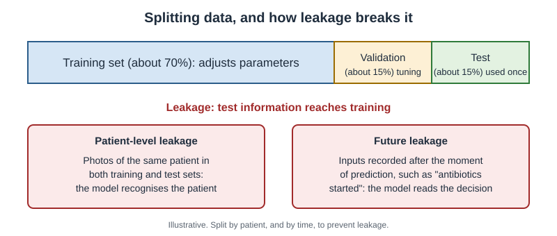
*Figure 3.1 — Data are split so that the test set stays unseen. Leakage happens when information from the test set reaches training. Illustrative.*

Testing on a separate portion of the same dataset is called **internal validation**. Testing on data from a different hospital, time or population is called **external validation**. External validation is much more informative. Chapter 4 returns to this.

## 3.4 Four Ways Models Fail
**Overfitting.** The model memorises the training data, including its noise and quirks, instead of learning general patterns. It scores very well in training and poorly on new data. It is like a student who memorises last year's exam answers without understanding them.

**Data leakage.** Information that would not be available in real use slips into training or testing [5]. Leakage makes a model look better than it is. Two common forms are:

- *Patient-level leakage.* Several images from the same patient appear in both training and test sets. The model recognises the patient, not the disease.
- *Future leakage.* The model uses information recorded after the moment of prediction. A sepsis model that uses "antibiotics started" as an input is partly reading the clinician's decision.

A review of machine-learning research across many fields found leakage in hundreds of published papers [5]. Leakage is a problem of study design. It is not a privacy problem.

**Shortcut learning.** The model finds an easy cue that happens to predict the label in the training data but has nothing to do with the disease [3]. In one study, a pneumonia model learned features of the hospital and the X-ray machine. Its performance fell when tested at other hospitals [1]. Many COVID-19 X-ray models learned text markers and patient position instead of lung changes [2]. A review of 62 COVID-19 imaging models found none ready for clinical use, largely because of such flaws [4].

**Distribution shift.** The world changes after training. New scanners, new patient groups, new laboratory methods or new clinical habits make today's data differ from training data [6]. Karim's case shows shift: older age, a different body type, pain and poor lighting.

A related threat is an **adversarial attack**: a tiny, deliberate change to an input, invisible to people, that is crafted to fool a specific model [9]. Ordinary image compression or blur is not an attack. It is a form of distribution shift, and it needs different defences.

> **Medical Background in 60 Seconds:** The **anterior cruciate ligament** (ACL) is a strong band inside the knee. It stops the shin bone sliding forward and helps the knee resist twisting. An ACL tear often happens during a sudden turn. Patients describe a "pop" and a knee that later "gives way". Physiotherapists test knee stability and retrain movement before a return to work or sport.

## 3.5 Class Imbalance and the Limits of Complexity
In health care, the condition of interest is often rare. Only a few mammograms in a thousand show cancer. This is called **class imbalance**. A model can reach 99% accuracy by always saying "no cancer". That model is useless. Chapter 4 shows better ways to measure performance when a condition is rare.

More complex is not always better. A review of 71 clinical prediction studies compared machine learning with logistic regression, a traditional statistical method [7]. In well-designed studies, machine learning showed no average advantage. For tabular data, such as vital signs and laboratory values, simple models are often as good and easier to check. Deep learning shows its strength mainly with images, signals and text.

> **Through Four Lenses**
> - **Medicine:** Physicians should ask where a diagnostic model was trained and tested. A model validated only in one teaching hospital may fail in a district clinic with different patients and machines.
> - **Pharmacy:** Pharmacists should watch for future leakage in medication-risk models. A model that uses "drug stopped" or "antidote given" is reading the clinical response, not predicting the event.
> - **Physical Therapy:** Physiotherapists should compare a movement model's training population with their patients. Age, body size, pain, walking aids and room lighting can all create distribution shift.
> - **Health Sciences:** Technologists should report changes in analysers, reagents and scanners. These changes shift the data silently, and a model may keep producing confident but wrong outputs.

> **Myth vs Evidence:** Myth: "Machine learning always beats traditional statistics." Evidence: Across 71 clinical prediction studies, machine learning showed no average performance benefit over logistic regression once study quality was considered [7].

> **Safety Alert:** When an AI output does not match what you see in the patient, trust the patient. Record the mismatch and report it. These reports are how silent failures are discovered.

## Key Takeaways
- Supervised learning uses labels; unsupervised learning finds structure; reinforcement learning learns from rewards.
- Training adjusts parameters to reduce a loss function, step by step.
- Only an untouched test set, ideally from another site, shows real performance.
- Overfitting, leakage, shortcut learning and distribution shift make good-looking models fail.
- With rare conditions, accuracy misleads, and simple models are often as good as complex ones.

## Self-Assessment
**Q1.** A hospital groups its diabetes patients into clusters by their glucose patterns, without any labels. Which type of learning is this? [LO1]
A) Supervised learning
B) Reinforcement learning
C) Transfer learning
D) Unsupervised learning

**Q2.** During training, what does the loss function do? [LO2]
A) It deletes patient records.
B) It measures how far the model's predictions are from the correct answers.
C) It chooses which patients enter the test set.
D) It explains the model's reasoning to clinicians.

**Q3.** A team uses its test set many times to choose between model designs. What is the main problem? [LO3]
A) The test set stops being an unbiased estimate of performance on new data.
B) The model will train faster.
C) The validation set will become too large.
D) There is no problem; this is standard practice.

**Q4.** Karim's knee app scored 94% on videos of athletes filmed in a sports laboratory but fails in a small clinic. Which failure mode best explains this? [LO4]
A) Future leakage
B) Adversarial attack
C) Distribution shift
D) Reinforcement learning

**Q5.** A skin-lesion dataset contains several photos of each patient. The team splits photos randomly, so some patients appear in both training and test sets. What is the likely effect? [LO4]
A) Performance will be underestimated.
B) The model will become unsupervised.
C) Class imbalance will disappear.
D) Performance will be overestimated because of patient-level leakage.

**Q6.** A pneumonia model performs well at the hospital where it was built but poorly elsewhere. Investigators find that it learned features of the X-ray machine. What is this called? [LO4]
A) Shortcut learning
B) Overfitting to the loss function
C) Gradient descent
D) Calibration

**Q7.** A cancer is present in 3 of every 1,000 screening images. A model labels every image "no cancer". What is its accuracy, and is it useful? [LO5]
A) 3%; useful
B) 50%; not useful
C) 99.7%; not useful
D) 100%; useful

**Q8.** A model predicting sepsis uses "IV antibiotics started" as one of its inputs. Why is this a concern? [LO4]
A) Antibiotics are not recorded in health records.
B) It is future leakage: the input reflects a clinician's decision that already suspects sepsis.
C) It makes the model unsupervised.
D) It is an adversarial attack.

**Q9.** A team compares logistic regression and a complex machine-learning model for predicting readmission from 20 laboratory values. Based on current evidence, what is the most likely result? [LO5]
A) Similar performance, with the simpler model easier to check
B) Machine learning always wins by a large margin
C) Logistic regression cannot use laboratory values
D) Neither model can be validated

**Q10.** What is the purpose of the validation set? [LO3]
A) To replace the test set
B) To tune design choices and decide when to stop training
C) To store the model's parameters
D) To collect new patients after deployment

**Case Question.** Karim's physiotherapist wants to report her concerns about the knee app to the clinic manager. Write four sentences explaining what went wrong, using at least two terms from this chapter, and suggest one test the clinic should run before using the app again.

## Answers and Rationales
**Q1. D** — Finding groups without labels is unsupervised learning. A needs labels. B needs rewards. C reuses a model from another task.

**Q2. B** — The loss function measures prediction error, which training reduces. A, C and D are not its role.

**Q3. A** — Repeated use of the test set lets design choices fit it, so its estimate becomes optimistic. B and C are irrelevant. D is wrong.

**Q4. C** — The patients and filming conditions differ from the training data. A concerns inputs from the future. B is deliberate manipulation. D is a learning type.

**Q5. D** — The model can recognise the same patient across sets, inflating performance [5]. A reverses the effect. B and C are unrelated.

**Q6. A** — The model used an irrelevant cue linked to the site [1]. B is not a standard term. C is the training method. D concerns probability accuracy.

**Q7. C** — The model is right 997 times in 1,000 but misses every cancer. A and B are wrong numbers. D is impossible.

**Q8. B** — Starting antibiotics reflects existing clinical suspicion and happens after the moment of prediction. A is false. C and D are unrelated.

**Q9. A** — For tabular data, machine learning shows no average advantage over logistic regression [7]. B overstates. C and D are false.

**Q10. B** — The validation set guides tuning; the test set stays untouched. A, C and D are wrong.

**Case Question — model answer.** The app was trained on young athletes in a bright laboratory, but Karim is older, injured and filmed in a small room. This is distribution shift, so the 94% accuracy does not apply to him. The high score may also reflect shortcut learning, such as lighting or background cues. The app's result conflicted with the clinical finding that his knee gives way. Before using it again, the clinic should test it on a sample of its own patients, with physiotherapist assessment as the reference.

## References
1. Zech JR, Badgeley MA, Liu M, et al. Variable generalization performance of a deep learning model to detect pneumonia in chest radiographs: a cross-sectional study. PLoS Med. 2018;15(11):e1002683. DOI: 10.1371/journal.pmed.1002683
2. DeGrave AJ, Janizek JD, Lee SI. AI for radiographic COVID-19 detection selects shortcuts over signal. Nat Mach Intell. 2021;3(7):610-619. DOI: 10.1038/s42256-021-00338-7
3. Geirhos R, Jacobsen JH, Michaelis C, et al. Shortcut learning in deep neural networks. Nat Mach Intell. 2020;2(11):665-673. DOI: 10.1038/s42256-020-00257-z
4. Roberts M, Driggs D, Thorpe M, et al. Common pitfalls and recommendations for using machine learning to detect and prognosticate for COVID-19 using chest radiographs and CT scans. Nat Mach Intell. 2021;3(3):199-217. DOI: 10.1038/s42256-021-00307-0
5. Kapoor S, Narayanan A. Leakage and the reproducibility crisis in machine-learning-based science. Patterns. 2023;4(9):100804. DOI: 10.1016/j.patter.2023.100804
6. Finlayson SG, Subbaswamy A, Singh K, et al. The clinician and dataset shift in artificial intelligence. N Engl J Med. 2021;385(3):283-286. DOI: 10.1056/nejmc2104626
7. Christodoulou E, Ma J, Collins GS, et al. A systematic review shows no performance benefit of machine learning over logistic regression for clinical prediction models. J Clin Epidemiol. 2019;110:12-22. DOI: 10.1016/j.jclinepi.2019.02.004
8. Ronneberger O, Fischer P, Brox T. U-Net: convolutional networks for biomedical image segmentation. In: Medical Image Computing and Computer-Assisted Intervention – MICCAI 2015. Lecture Notes in Computer Science. Springer; 2015:234-241. DOI: 10.1007/978-3-319-24574-4_28
9. Finlayson SG, Bowers JD, Ito J, et al. Adversarial attacks on medical machine learning. Science. 2019;363(6433):1287-1289. DOI: 10.1126/science.aaw4399
10. Komorowski M, Celi LA, Badawi O, et al. The Artificial Intelligence Clinician learns optimal treatment strategies for sepsis in intensive care. Nat Med. 2018;24(11):1716-1720. DOI: 10.1038/s41591-018-0213-5

---

# Chapter 4: Reading an AI Performance Claim

## Opening Case
Lina is still worried about her mole. A friend sends her a skin-check app. Its website says, "Our AI detects melanoma with 95% accuracy." Lina takes a photo. The app says "High risk — see a doctor urgently." She cannot sleep.

The next day, a public-health officer running a skin-cancer campaign at her university explains that the number on the website does not mean what Lina thinks. She asks three questions. Ninety-five percent of what? Tested on whom? And how common is melanoma in people like Lina? By the end of this chapter, you will be able to ask these questions yourself and answer them.

## Learning Objectives
By the end of this chapter you will be able to:
1. [LO1] Calculate sensitivity, specificity, positive and negative predictive value from a 2 × 2 table.
2. [LO2] Explain why positive predictive value depends on how common a condition is.
3. [LO3] Interpret a ROC curve and AUROC, and explain when AUPRC is more informative.
4. [LO4] Distinguish discrimination from calibration.
5. [LO5] Rank study designs from retrospective testing to randomised trials and use reporting guidelines to judge a study.

## 4.1 The 2 × 2 Table
Most performance numbers come from one simple table, the **confusion matrix**. It compares the model's answer with the truth for every case.

|  | Truly has disease | Truly healthy |
|---|---|---|
| Model says positive | True positive (TP) | False positive (FP) |
| Model says negative | False negative (FN) | True negative (TN) |

From this table come four key measures:

- **Sensitivity** = TP ÷ (TP + FN). Of the people who have the disease, what share does the model catch?
- **Specificity** = TN ÷ (TN + FP). Of the healthy people, what share does the model correctly clear?
- **Positive predictive value** (PPV) = TP ÷ (TP + FP). If the model says positive, how likely is disease?
- **Negative predictive value** (NPV) = TN ÷ (TN + FN). If the model says negative, how likely is health?

Sensitivity and specificity describe the test. PPV and NPV describe what a result means for the person in front of you. Lina needs PPV.

**Accuracy** is (TP + TN) ÷ all cases. It sounds useful but hides a trap. When a disease is rare, a model that always says "healthy" has high accuracy and catches nobody (Chapter 3).

## 4.2 Why a "95%" Test Can Be Wrong Most of the Time
Suppose the skin app truly has 95% sensitivity and 95% specificity. Suppose melanoma is present in 5 of every 1,000 moles checked by young people. What does a positive result mean?

Picture 100,000 moles (Figure 4.1).

- 500 are melanoma (5 per 1,000). The app catches 95%: 475 true positives and 25 false negatives.
- 99,500 are harmless. The app clears 95%: 94,525 true negatives. The other 5%, or 4,975, are false positives.
- In total, 475 + 4,975 = 5,450 moles are flagged.

PPV = 475 ÷ 5,450 = 8.7%.

So when the app says "high risk", the mole is melanoma less than 1 time in 10. The other 9 alarms are false. This is not because the app is bad. It is because melanoma is rare in this group. NPV, by contrast, is 94,525 ÷ 94,550 = 99.97%. A negative result is very reassuring.

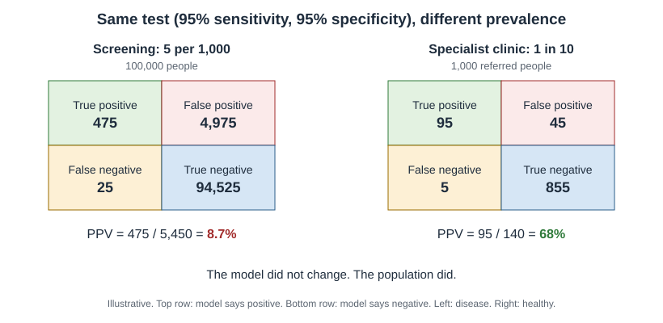
*Figure 4.1 — The same test (95% sensitivity, 95% specificity) gives a PPV of 8.7% at 5 per 1,000 prevalence, and a much higher PPV when the condition is common. Illustrative.*

How common a condition is in the tested group is called **prevalence**. PPV rises with prevalence. If the same app were used in a dermatology clinic where 1 in 10 referred moles is melanoma, its PPV would be about 68%. The model did not change. The population did.

> **Deeper Dive:** This is Bayes' theorem. PPV = (sensitivity × prevalence) ÷ [(sensitivity × prevalence) + (1 − specificity) × (1 − prevalence)]. With 0.95, 0.005 and 0.95: 0.00475 ÷ (0.00475 + 0.04975) = 0.087. Try prevalence 0.10: 0.095 ÷ (0.095 + 0.045) = 0.68.

> **Medical Background in 60 Seconds:** **Screening** tests people without symptoms to find disease early, such as mammography or retinal photos in diabetes. In screening, prevalence is low, so false positives are common. A **diagnostic test** is used when symptoms already raise suspicion, so prevalence is higher. The same AI can perform very differently in these two settings.

## 4.3 Thresholds, ROC Curves and AUROC
Most models give a score, not a yes or no. Someone chooses a **threshold**. Scores above it count as positive. A low threshold catches more disease (higher sensitivity) but raises more false alarms (lower specificity). A high threshold does the opposite.

A **ROC curve** plots sensitivity against 1 − specificity for every possible threshold. The **area under the ROC curve** (AUROC, also called the C-statistic) summarises the curve in one number between 0.5 and 1.0. An AUROC of 0.5 is a coin toss. An AUROC of 1.0 is perfect.

AUROC has a simple meaning. It is the probability that the model gives a randomly chosen patient with the disease a higher score than a randomly chosen patient without it.

AUROC has two limits. First, it says nothing about any single threshold, and clinicians use one threshold. Second, when a condition is rare, AUROC can look excellent while PPV is poor. For rare conditions, the **area under the precision–recall curve** (AUPRC) is more informative [2]. Precision is another name for PPV, and recall is another name for sensitivity. AUPRC shows directly how many alarms will be real.

## 4.4 Discrimination Versus Calibration
**Discrimination** is the ability to rank patients: do sicker patients get higher scores? AUROC measures discrimination.

**Calibration** asks a different question: do the numbers mean what they say? If a model gives 100 patients a 20% risk, about 20 of them should have the event. A model can rank well but be badly calibrated. It might say 60% when the true risk is 20%. Poor calibration misleads decisions about treatment [3].

Many deep-learning models output a number between 0 and 1 from a final "softmax" step. This number is often presented as a probability or a "confidence". It is neither, unless the model has been calibrated and checked. Modern neural networks tend to be overconfident [12]. When an app shows "Malignant: 92%", ask whether that number has been calibrated in patients like yours.

## 4.5 Measuring Outlines: Dice and IoU
Some models draw outlines, for example around a tumour or a joint. Two overlap measures are common. The **Dice coefficient** is twice the overlap divided by the total size of both outlines. **Intersection over union** (IoU) is the overlap divided by the combined area. Both range from 0 (no overlap) to 1 (perfect). They can hide clinically important errors, such as missing a small lesion completely, so experts recommend choosing metrics to fit the clinical question [4].

## 4.6 How Strong Is the Evidence?
A performance number is only as good as the study that produced it. From weakest to strongest:

1. **Retrospective internal testing.** The model is tested on old data from the same source. Often optimistic.
2. **Retrospective external validation.** Old data from other hospitals or populations. Shows generalisation.
3. **Prospective silent testing.** The model runs on new patients, but clinicians do not see its output.
4. **Prospective clinical studies.** Clinicians use the output; outcomes and workflow are measured.
5. **Randomised controlled trial**s (RCTs). Patients or sites are randomly assigned to care with or without AI.

Real examples show why this ladder matters. A widely used sepsis prediction model was reported by its developer to perform well. Independent external validation in 27,697 patients found an AUROC of 0.63. The model missed two-thirds of sepsis cases and alerted on 18% of all admitted patients [5]. In contrast, a blinded RCT of AI for measuring heart pumping function on ultrasound found that cardiologists changed the AI's initial assessment less often than sonographers' assessments [6]. The MASAI breast-screening trial is another RCT with clear results [1].

A review of studies comparing deep learning with clinicians found few randomised trials. Many non-randomised studies claimed that AI matched or beat experts despite a high risk of bias [7].

**Reporting guideline**s help readers judge a study. TRIPOD+AI covers prediction models [8]. CONSORT-AI covers trials of AI interventions [9], and SPIRIT-AI covers their protocols [10]. DECIDE-AI covers early clinical evaluation [11]. If a study does not report the items these guidelines list, be cautious.

## 4.7 Ten Questions to Ask About Any AI Claim
1. What exactly was measured: sensitivity, specificity, PPV, AUROC or "accuracy"?
2. What was the reference standard, and who decided the truth?
3. What was the prevalence in the test group, and is it like my setting?
4. Was the test set external, from other sites or times?
5. Was the study prospective or retrospective?
6. Which threshold will be used in practice, and what are sensitivity and PPV at that threshold?
7. Is the model calibrated, and was calibration checked in a population like mine?
8. How did performance vary across age, sex, skin tone and other groups?
9. How many false alarms per true alarm should staff expect?
10. Did any trial show better patient outcomes, not just better scores?

> **Through Four Lenses**
> - **Medicine:** Physicians must translate sensitivity and specificity into PPV for the patient in front of them. A screening-level PPV of 9% means a positive result needs confirmation, not immediate treatment.
> - **Pharmacy:** Pharmacists receive drug-safety alerts with their own PPV. If only 1 in 20 interaction alerts matters, staff learn to ignore them. Measuring alert PPV is as important as measuring sensitivity.
> - **Physical Therapy:** Physiotherapists using fall-risk or re-injury scores should ask about calibration. A score of "30% risk" should mean roughly 30 of 100 similar patients fall, or goals will be set wrongly.
> - **Health Sciences:** Public-health officers plan screening programmes and must model prevalence. The same AI can overload clinics with false positives in a low-risk population and work well in a high-risk one.

> **Myth vs Evidence:** Myth: "A high AUROC means the model is ready for the clinic." Evidence: A sepsis model deployed in hundreds of hospitals had an AUROC of only 0.63 on independent testing and generated many false alerts [5]. Discrimination, calibration, PPV at the chosen threshold and external validation all matter.

> **Safety Alert:** A positive AI result in a low-prevalence group is more likely to be false than true. Confirm before acting, and explain this to anxious patients like Lina.

## Key Takeaways
- Sensitivity and specificity describe a test; PPV and NPV describe what a result means for a patient.
- PPV depends on prevalence: a "95% accurate" test can have a PPV below 10% in screening.
- AUROC measures ranking, not usefulness at a threshold; AUPRC is better for rare conditions.
- Discrimination and calibration are different; a model's "92%" is not a probability unless calibrated.
- Evidence strength rises from retrospective internal tests to external, prospective and randomised studies.

## Self-Assessment
**Q1.** A model is tested on 200 patients with pneumonia and 800 without. It flags 160 of the patients with pneumonia and 80 of those without. What is its sensitivity? [LO1]
A) 80%
B) 67%
C) 90%
D) 20%

**Q2.** Using the same data as Q1, what is the PPV? [LO1]
A) 80%
B) 90%
C) 67%
D) 33%

**Q3.** An AI test for a rare eye disease has 90% sensitivity and 90% specificity. It is moved from a specialist clinic, where prevalence is 20%, to community screening, where prevalence is 1%. What happens to its PPV? [LO2]
A) It stays the same because sensitivity and specificity are unchanged.
B) It falls sharply because the disease is much rarer.
C) It rises because more people are tested.
D) It becomes equal to the NPV.

**Q4.** What does an AUROC of 0.85 mean? [LO3]
A) The model is correct in 85% of cases.
B) 85% of positive results are true.
C) The model is calibrated.
D) There is an 85% chance that a random patient with the condition scores higher than a random patient without it.

**Q5.** A hospital compares two sepsis models for a condition present in 2% of admissions. Which measure best shows how many alerts will be real across thresholds? [LO3]
A) AUPRC
B) Accuracy
C) AUROC alone
D) Specificity alone

**Q6.** A fall-risk model ranks patients well (AUROC 0.82). But among patients given "40% risk", only 10% fall. What is the problem? [LO4]
A) Poor discrimination
B) Data leakage
C) Poor calibration
D) Class imbalance in the training set only

**Q7.** Lina's app shows "Malignant: 92%". What is the most accurate interpretation? [LO4]
A) There is a 92% chance the mole is melanoma.
B) The app is 92% accurate.
C) 92% of dermatologists agree.
D) It is a model score that is not a reliable probability unless the model was calibrated for people like her.

**Q8.** Which study design gives the strongest evidence that an AI tool improves patient care? [LO5]
A) Retrospective internal testing
B) A randomised controlled trial
C) A developer's press release
D) Retrospective external validation

**Q9.** A screening test has 95% sensitivity and 95% specificity. Prevalence is 5 per 1,000. Out of 100,000 people, how many false positives are there? [LO2]
A) 25
B) 475
C) 4,975
D) 94,525

**Q10.** A research team reports a new AI prediction model. Which reporting guideline should they follow? [LO5]
A) TRIPOD+AI
B) CONSORT-AI
C) SPIRIT-AI
D) DECIDE-AI

**Case Question.** Lina asks you, "The app said high risk and it is 95% accurate, so I probably have cancer, right?" Using the numbers from Section 4.2, write a short, kind explanation she can understand, and tell her what to do next.

## Answers and Rationales
**Q1. A** — Sensitivity = 160 ÷ 200 = 80%. B is the PPV. C and D are wrong calculations.

**Q2. C** — PPV = 160 ÷ (160 + 80) = 67%. A is sensitivity. B is specificity (720 ÷ 800). D is the false share of positive results.

**Q3. B** — PPV falls with prevalence: about 69% at 20% prevalence and about 8% at 1%. A ignores prevalence. C and D are false.

**Q4. D** — This is the ranking meaning of AUROC. A describes accuracy. B describes PPV. C concerns calibration.

**Q5. A** — AUPRC shows precision (PPV) across recall levels and suits rare outcomes [2]. B is misleading under imbalance. C can look good while PPV is poor. D ignores missed cases.

**Q6. C** — Ranking is good but the stated risks are too high, which is miscalibration [3]. A is contradicted by the AUROC. B and D do not explain the mismatch.

**Q7. D** — Softmax scores are often overconfident and are not probabilities without calibration [12]. A, B and C misread the number.

**Q8. B** — Randomisation best isolates the effect of the AI on care. A and D are weaker. C is not evidence.

**Q9. C** — 5% of 99,500 healthy people = 4,975 false positives. A is the false negatives. B is the true positives. D is the true negatives.

**Q10. A** — TRIPOD+AI covers prediction models [8]. B and C cover trials and trial protocols. D covers early clinical evaluation.

**Case Question — model answer.** "I understand why you are scared. The 95% describes how the app performs overall, not your personal chance. Melanoma is rare in young people, so most 'high risk' results are false alarms. With these numbers, fewer than 1 in 10 flagged moles is actually melanoma. That still means your mole should be checked, because it has changed, so please book a dermatology appointment this week. The app cannot give you a diagnosis; a skin examination can."

## References
1. Lång K, Josefsson V, Larsson AM, et al. Artificial intelligence-supported screen reading versus standard double reading in the Mammography Screening with Artificial Intelligence trial (MASAI): a clinical safety analysis of a randomised, controlled, non-inferiority, single-blinded, screening accuracy study. Lancet Oncol. 2023;24(8):936-944. DOI: 10.1016/s1470-2045(23)00298-x
2. Saito T, Rehmsmeier M. The precision-recall plot is more informative than the ROC plot when evaluating binary classifiers on imbalanced datasets. PLoS One. 2015;10(3):e0118432. DOI: 10.1371/journal.pone.0118432
3. Van Calster B, McLernon DJ, van Smeden M, et al. Calibration: the Achilles heel of predictive analytics. BMC Med. 2019;17:230. DOI: 10.1186/s12916-019-1466-7
4. Maier-Hein L, Reinke A, Godau P, et al. Metrics reloaded: recommendations for image analysis validation. Nat Methods. 2024;21(2):195-212. DOI: 10.1038/s41592-023-02151-z
5. Wong A, Otles E, Donnelly JP, et al. External validation of a widely implemented proprietary sepsis prediction model in hospitalized patients. JAMA Intern Med. 2021;181(8):1065-1070. DOI: 10.1001/jamainternmed.2021.2626
6. He B, Kwan AC, Cho JH, et al. Blinded, randomized trial of sonographer versus AI cardiac function assessment. Nature. 2023;616(7957):520-524. DOI: 10.1038/s41586-023-05947-3
7. Nagendran M, Chen Y, Lovejoy CA, et al. Artificial intelligence versus clinicians: systematic review of design, reporting standards, and claims of deep learning studies. BMJ. 2020;368:m689. DOI: 10.1136/bmj.m689
8. Collins GS, Moons KGM, Dhiman P, et al. TRIPOD+AI statement: updated guidance for reporting clinical prediction models that use regression or machine learning methods. BMJ. 2024;385:e078378. DOI: 10.1136/bmj-2023-078378
9. Liu X, Cruz Rivera S, Moher D, et al. Reporting guidelines for clinical trial reports for interventions involving artificial intelligence: the CONSORT-AI extension. BMJ. 2020;370:m3164. DOI: 10.1136/bmj.m3164
10. Cruz Rivera S, Liu X, Chan AW, et al. Guidelines for clinical trial protocols for interventions involving artificial intelligence: the SPIRIT-AI extension. BMJ. 2020;370:m3210. DOI: 10.1136/bmj.m3210
11. Vasey B, Nagendran M, Campbell B, et al. Reporting guideline for the early stage clinical evaluation of decision support systems driven by artificial intelligence: DECIDE-AI. BMJ. 2022;377:e070904. DOI: 10.1136/bmj-2022-070904
12. Guo C, Pleiss G, Sun Y, Weinberger KQ. On calibration of modern neural networks. In: Proceedings of the 34th International Conference on Machine Learning. PMLR 70; 2017:1321-1330. https://proceedings.mlr.press/v70/guo17a.html

---

# Chapter 5: Generative AI and Large Language Models

## Opening Case
Lina is waiting for her dermatology appointment. She is anxious, so she types into a free chatbot: "I'm 20, I have a mole that changed shape, I've had headaches this week and I feel tired. Do I have cancer that has spread?" The chatbot replies with a long, warm answer. It lists possible causes of headache. It mentions that melanoma "can spread to the brain". It suggests two supplements and cites a journal article.

Lina shows the answer to the community pharmacist. The pharmacist checks the article. It does not exist. One supplement interacts with the contraceptive pill Lina takes.

The same afternoon, the pharmacist uses an approved hospital chatbot to draft a leaflet on sun protection. It saves her an hour. She checks every sentence before printing. Why was the tool dangerous in one case and helpful in the other? This chapter explains.

## Learning Objectives
By the end of this chapter you will be able to:
1. [LO1] Explain next-token prediction and why it produces hallucinations.
2. [LO2] Identify safe and unsafe uses of LLMs for students and health professionals.
3. [LO3] Apply a safe-use checklist, including protection of patient data and checking against primary sources.
4. [LO4] Describe retrieval-augmented generation and ambient clinical documentation.
5. [LO5] Evaluate an LLM answer for accuracy, completeness and bias.

## 5.1 How a Large Language Model Works
A **large language model** is trained to do one thing: predict the next piece of text. Text is split into small pieces called **token**s. A token is a word or part of a word. During training, the model reads billions of sentences. Again and again, it guesses the next token and adjusts its parameters when it is wrong (Chapter 3).

The design behind modern LLMs is the **transformer** [5]. Its key feature, called attention, lets the model weigh every earlier word when choosing the next one. This is how it keeps track of meaning across long passages.

After this first stage, the model is often fine-tuned. People rate its answers, and the model is adjusted to give answers people prefer. This makes it more helpful and polite. It does not make it more truthful.

When you ask a question, the model writes an answer one token at a time (Figure 5.1). Each token is the one that seems most likely to follow, given your question and the words already written.

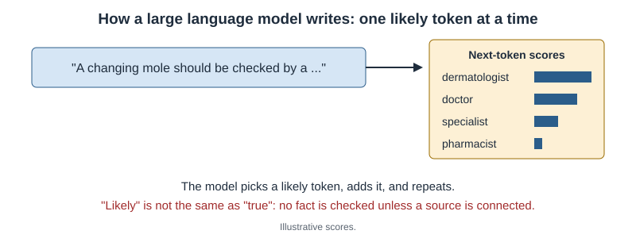
*Figure 5.1 — An LLM writes by repeatedly choosing a likely next token. It predicts plausible text; it does not look up facts unless connected to a source. Illustrative.*

## 5.2 Why LLMs Hallucinate
An LLM predicts what text usually looks like. It has no built-in check of whether the text is true. When it lacks knowledge, it still produces fluent, confident text. This is a **hallucination** [4].

Hallucinations are dangerous in health care because they look exactly like correct answers. When researchers asked a chatbot to write medical articles with references, almost half of the references were invented. Most of the rest contained errors. Only 7% were both real and accurate [2]. The article cited to Lina was one of these inventions.

LLMs also inherit problems from their training text. A study asked four major LLMs questions based on debunked, race-based medical ideas, such as race-based kidney-function formulas. All four repeated some of these harmful claims [9].

## 5.3 Exam Scores Are Not Clinical Safety
LLMs have passed medical licensing-style exams. ChatGPT reached near the passing level of the US licensing exam [3]. Google's Flan-PaLM model reached 67.6% on a set of exam-style questions, and its successor Med-PaLM 2 reached 86.5% [1, 6].

These results show strong medical knowledge. They do not show safety in care. Exam questions are tidy, complete and have one right answer. Real patients bring missing information, mixed symptoms, fear and competing priorities. An exam does not test whether a model notices what is missing, admits uncertainty or recognises an emergency.

> **Medical Background in 60 Seconds:** A **drug interaction** happens when one medicine, food or supplement changes the effect of another. Some supplements, such as St John's wort, speed up the liver's breakdown of hormonal contraceptives. This can make the pill less effective and lead to pregnancy. Pharmacists check for interactions whenever a new product is added.

## 5.4 Useful Applications
**Documentation.** An **ambient scribe** listens, with consent, to a consultation and drafts the clinical note. In one large health system, thousands of physicians used ambient scribes across hundreds of thousands of visits. Users reported less time on documentation and more attention to patients [11]. The clinician must still review and sign every note.

**Patient communication.** In one study, health professionals compared chatbot and physician replies to patient questions posted online. They preferred the chatbot's replies in 79% of ratings, for both quality and empathy [8]. The questions came from a public forum, not real clinical care, and the evaluators judged writing, not patient outcomes.

**Drug information and education.** LLMs can explain a mechanism, summarise a guideline or generate practice questions. They are good tutors for concepts. They are poor sources for doses, interactions and recent evidence unless connected to a trusted source.

**Retrieval-augmented generation.** In **retrieval-augmented generation** (RAG), the system first searches a trusted collection of documents, such as a hospital formulary or national guideline. It then gives those passages to the LLM and asks it to answer from them [10]. RAG reduces hallucination and allows the answer to show its sources. It does not remove errors completely, because the model can still misread or ignore the passages.

## 5.5 Using LLMs Safely: A Checklist
1. **Protect patient data.** Never paste names, record numbers, dates of birth, photos or other identifiable details into a public chatbot. Use only tools approved by your institution.
2. **Use LLMs for drafts, not decisions.** A draft note, leaflet or summary is a starting point that you check.
3. **Verify every clinical fact.** Check it against a primary source: the product information, a guideline or the original paper.
4. **Check every reference.** Search for it. If you cannot find it, it may not exist.
5. **Watch for missing information.** Ask what the answer did not consider, such as pregnancy, kidney function or other medicines.
6. **Be alert to bias.** Question answers that use race, sex or age in ways that current guidelines do not.
7. **Stay within your scope.** An LLM does not change who is responsible for advice. You are.

For students, the same tools raise questions of **academic integrity**. Follow your faculty's policy. Using an LLM to explain a concept is usually allowed. Submitting its text as your own work is usually not.

The World Health Organization has published guidance on the ethics and governance of these models in health, covering transparency, data protection and accountability [7].

> **Through Four Lenses**
> - **Medicine:** Physicians can use approved scribes to save documentation time. They must read every draft note, because an invented examination finding becomes part of the legal record once it is signed.
> - **Pharmacy:** Pharmacists will see patients arrive with chatbot advice. They should check doses and interactions against product information, and explain calmly why a fluent answer can still be wrong.
> - **Physical Therapy:** Physiotherapists can use LLMs to draft home-exercise sheets in plain language. They must check each exercise for safety and fit, because the model does not know the patient's injury.
> - **Health Sciences:** Public-health officers can use LLMs to draft campaign messages in several languages. They should test messages with the community, because models may miss cultural meaning.

> **Myth vs Evidence:** Myth: "If an LLM passes a medical exam, it is safe to advise patients." Evidence: Exam performance reflects knowledge on tidy questions [1, 3]. The same models can invent references [2] and repeat harmful race-based claims [9]. Safety in care needs different testing.

> **Safety Alert:** Never enter identifiable patient information into a public chatbot, and never act on a chatbot's dose or interaction advice without checking an authoritative source.

## Key Takeaways
- LLMs predict the next token; they generate plausible text, not verified facts.
- Hallucinations are fluent and confident, including invented references.
- High exam scores do not prove safety in real care.
- Ambient scribes, patient messages and RAG are useful when a professional checks the output.
- Protect patient data, verify facts and references, and keep responsibility for every decision.

## Self-Assessment
**Q1.** What is a large language model fundamentally trained to do? [LO1]
A) Look up facts in a medical database
B) Predict the next token in a sequence of text
C) Examine patients through a camera
D) Calculate drug doses from blood tests

**Q2.** An LLM gives a student a reference to a paper that does not exist. What is the best explanation? [LO1]
A) The paper was withdrawn from the journal.
B) The student's internet connection failed.
C) The model was attacked by hackers.
D) The model generated plausible text without checking that the paper exists.

**Q3.** A nurse wants to paste a patient's full name, record number and discharge letter into a free public chatbot to get a summary. What should a colleague advise? [LO3]
A) Do not paste identifiable data into a public tool; use an approved system or remove identifiers.
B) It is fine if the summary is checked afterwards.
C) It is fine because chatbots delete everything.
D) It is fine if the patient is discharged.

**Q4.** A hospital connects an LLM to its own drug formulary so that answers quote the formulary. What is this approach called? [LO4]
A) Reinforcement learning
B) Adversarial training
C) Retrieval-augmented generation
D) Unsupervised clustering

**Q5.** Med-PaLM 2 scored 86.5% on exam-style medical questions. What is the most accurate conclusion? [LO2]
A) It is safe to replace clinicians in primary care.
B) It shows strong medical knowledge, but not safety in real clinical care.
C) It is 86.5% likely to be right for any patient.
D) It no longer hallucinates.

**Q6.** Lina asks a chatbot whether a herbal supplement is safe with her contraceptive pill. The chatbot says yes. What should the pharmacist do? [LO5]
A) Accept the answer because chatbots are trained on medical text
B) Tell Lina to stop the pill
C) Ask the chatbot again until it says no
D) Check the interaction against an authoritative source and advise Lina

**Q7.** An ambient scribe drafts a note that includes "normal abdominal examination", but the physician did not examine the abdomen. What is the key lesson? [LO2]
A) The clinician must review and correct every draft before signing it.
B) Ambient scribes should record without consent.
C) Scribes are always accurate for examinations.
D) The note can be signed because the scribe is approved.

**Q8.** Researchers asked several LLMs about kidney-function formulas and lung capacity in different races. What did they find? [LO5]
A) All models refused to answer.
B) All models gave current, bias-free answers.
C) The models repeated some debunked race-based medical claims.
D) The models asked for patient consent.

**Q9.** Which use of an LLM by a physiotherapy student best fits the safe-use checklist? [LO3]
A) Asking it to explain how a muscle contracts, then checking the explanation against a textbook
B) Submitting its essay as the student's own work
C) Asking it to choose a patient's exercise dose without an assessment
D) Uploading a patient's video to a public chatbot

**Q10.** Health professionals preferred chatbot replies to physician replies in 79% of ratings in one study. Which limitation matters most when applying this result? [LO5]
A) The chatbot was not a transformer.
B) The ratings were done by patients only.
C) The questions came from an online forum, and the study measured writing quality, not patient outcomes.
D) The study included only pharmacists.

**Case Question.** Rewrite the chatbot's reply to Lina, in five sentences or fewer, as a safe answer should look. It should acknowledge her worry, avoid a diagnosis, flag any urgent symptom, and direct her to the right professional.

## Answers and Rationales
**Q1. B** — LLMs are trained on next-token prediction. A describes retrieval, which is an added component. C and D are not what LLMs do.

**Q2. D** — A fabricated reference is a hallucination: plausible text without verification [2]. A, B and C are unlikely explanations.

**Q3. A** — Identifiable data must not go into public tools. B, C and D all expose patient data.

**Q4. C** — Retrieving trusted documents and answering from them is RAG [10]. A, B and D are different methods.

**Q5. B** — Exam scores show knowledge, not clinical safety [1]. A overreaches. C misreads the number. D is false.

**Q6. D** — Interactions must be checked against authoritative information. A trusts fluent output. B is unsafe. C is repeated prompting, not verification.

**Q7. A** — The clinician remains responsible for the signed note [11]. B is unethical. C and D are false.

**Q8. C** — All four models repeated some harmful race-based claims [9]. A, B and D do not describe the findings.

**Q9. A** — Using an LLM to explain a concept, then checking it, is safe. B breaches academic integrity. C and D are unsafe.

**Q10. C** — The setting and outcome measured limit how far the result applies [8]. A is irrelevant. B and D are wrong about the study.

**Case Question — model answer.** "I can hear that you are worried, and it makes sense to check a changing mole. I cannot tell you whether you have cancer; only an examination can do that. Headaches and tiredness have many common causes, but if you have a sudden severe headache, weakness, confusion or vomiting, seek emergency care now. Please keep your dermatology appointment, and bring a list of everything you take, including supplements. Before starting any supplement, ask a pharmacist, because some reduce the effect of the contraceptive pill."

## References
1. Singhal K, Azizi S, Tu T, et al. Large language models encode clinical knowledge. Nature. 2023;620(7972):172-180. DOI: 10.1038/s41586-023-06291-2
2. Bhattacharyya M, Miller VM, Bhattacharyya D, Miller LE. High rates of fabricated and inaccurate references in ChatGPT-generated medical content. Cureus. 2023;15(5):e39238. DOI: 10.7759/cureus.39238
3. Kung TH, Cheatham M, Medenilla A, et al. Performance of ChatGPT on USMLE: potential for AI-assisted medical education using large language models. PLOS Digit Health. 2023;2(2):e0000198. DOI: 10.1371/journal.pdig.0000198
4. Ji Z, Lee N, Frieske R, et al. Survey of hallucination in natural language generation. ACM Comput Surv. 2023;55(12):1-38. DOI: 10.1145/3571730
5. Vaswani A, Shazeer N, Parmar N, et al. Attention is all you need. In: Advances in Neural Information Processing Systems 30. 2017. https://arxiv.org/abs/1706.03762
6. Singhal K, Tu T, Gottweis J, et al. Toward expert-level medical question answering with large language models. Nat Med. 2025;31(3):943-950. DOI: 10.1038/s41591-024-03423-7
7. World Health Organization. Ethics and governance of artificial intelligence for health: guidance on large multi-modal models. Geneva: WHO; 2024. https://www.who.int/publications/i/item/9789240084759
8. Ayers JW, Poliak A, Dredze M, et al. Comparing physician and artificial intelligence chatbot responses to patient questions posted to a public social media forum. JAMA Intern Med. 2023;183(6):589-596. DOI: 10.1001/jamainternmed.2023.1838
9. Omiye JA, Lester JC, Spichak S, Rotemberg V, Daneshjou R. Large language models propagate race-based medicine. NPJ Digit Med. 2023;6:195. DOI: 10.1038/s41746-023-00939-z
10. Lewis P, Perez E, Piktus A, et al. Retrieval-augmented generation for knowledge-intensive NLP tasks. In: Advances in Neural Information Processing Systems 33. 2020. https://arxiv.org/abs/2005.11401
11. Tierney AA, Gayre G, Hoberman B, et al. Ambient artificial intelligence scribes to alleviate the burden of clinical documentation. NEJM Catal Innov Care Deliv. 2024;5(3). DOI: 10.1056/cat.23.0404

---

# Chapter 6: Seeing Disease — Imaging, Laboratory and Pathology

## Opening Case
Amal Hassan visits her family clinic for her yearly diabetes review. A healthcare assistant takes two photographs of the back of each eye with a small camera. There is no eye specialist in the clinic. Within a minute, an AI system reports: "More-than-mild diabetic retinopathy detected. Refer to an eye specialist." Amal's hands shake. Her mother went blind from diabetes.

That same week, Karim has an MRI of his injured knee, and an AI tool flags a likely ligament tear before the radiologist reads the scan. Lina's dermatologist photographs her mole with a dermatoscope and sees a risk score from a skin-lesion model.

Three patients, three images, three AI tools. What are these tools actually doing, how good is the evidence, and where do they fail? And what happens to the samples and slides that never reach a camera?

## Learning Objectives
By the end of this chapter you will be able to:
1. [LO1] Distinguish computer-aided detection, diagnosis and triage (CADe, CADx, CADt).
2. [LO2] Describe AI in screening programmes and judge the strength of their evidence.
3. [LO3] Explain why AI-accelerated MRI can create features that are not really there.
4. [LO4] Describe the digital-pathology pipeline and the main uses of AI in the clinical laboratory.
5. [LO5] Identify how imaging and laboratory AI fail across patient groups and settings.

> **Medical Background in 60 Seconds:** An **X-ray** passes radiation through the body; dense tissue such as bone looks white. **CT** combines many X-rays into cross-sectional slices. **MRI** uses a strong magnet and radio waves, with no radiation, and shows soft tissues such as ligaments well. A **retinal photograph** shows the blood vessels at the back of the eye, where diabetes causes damage called diabetic retinopathy. A **biopsy** is a small tissue sample examined under a microscope by a pathologist.

## 6.1 What Imaging AI Does: Detect, Diagnose, Triage
Imaging AI tools fall into three groups.

- **Computer-aided detection** (CADe) marks where something may be, such as a box around a possible lung nodule. The reader decides what it is.
- **Computer-aided diagnosis** (CADx) characterises a finding, such as "likely malignant" or "likely benign".
- **Computer-aided triage** (CADt) reorders the reading list so that urgent cases are read first, such as a suspected brain bleed on CT.

The difference matters for safety. A CADt tool that misses a bleed does not delay the case beyond normal practice, because a human still reads every scan. A CADx tool that labels a cancer "benign" can directly mislead a decision.

A model reading a chest X-ray has no more information than the human looking at the same image. It does not "see through" overlapping structures. It learns statistical patterns in the pixels. Those patterns can include shortcuts, such as the hospital's scanner type, instead of disease (Chapter 3) [17].

## 6.2 Screening: Eyes and Breasts
**Diabetic eye screening.** Diabetic retinopathy is a leading cause of preventable blindness, and screening all patients needs more specialists than many countries have. In a retrospective study, a deep-learning model graded retinal photos with high sensitivity and specificity [1]. The stronger evidence came later. An autonomous system was tested prospectively in 900 patients in primary-care clinics. It found more-than-mild retinopathy with 87.2% sensitivity and 90.7% specificity [2]. This supported its authorisation as the first autonomous AI diagnostic device in the United States.

Amal's result is a referral, not a diagnosis. With a specificity near 91%, some referred patients will not have significant disease. The eye specialist will confirm.

**Breast screening.** In many countries, two radiologists read every screening mammogram. In the MASAI randomised trial in Sweden, AI sorted mammograms by risk and helped decide which needed one or two readers [3]. Screen-reading workload fell by 44%. About 20% more cancers were detected, and false-positive rates did not rise. A prospective Swedish study also found that AI plus one radiologist was non-inferior to two radiologists [6].

Earlier, a widely publicised retrospective study reported that AI outperformed radiologists [4]. Other scientists pointed out that the code and data were not shared, so the result could not be reproduced [5]. Reproducibility is part of evidence.

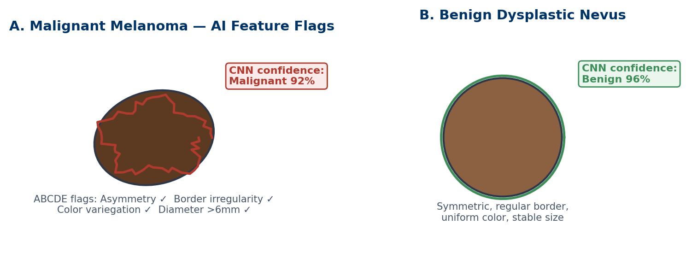
*Figure 6.1 — A model's output for a suspicious and a benign lesion. The "confidence" values are uncalibrated scores, not probabilities (Chapter 4). Both lesions are shown on light skin, which reflects the bias of many training sets. Illustrative.*

## 6.3 Skin, Knees and Fast MRI
**Dermatology.** A 2017 study trained a CNN on about 129,000 skin images and matched dermatologists on test images [9]. Public datasets such as HAM10000 later made research easier [10]. But most images in these collections show light skin. When researchers built a test set balanced across skin tones, several published models performed markedly worse on darker skin [11]. For Lina, who has Fitzpatrick type V skin, this matters directly (Chapter 10).

**Knee MRI.** A model called MRNet detected ligament and meniscus tears on knee MRI and was tested on data from another hospital [8]. Tools like this can prioritise scans such as Karim's. The radiologist still reads the whole study, because the model looks only for the findings it was trained on.

**Fast MRI.** MRI is slow because the scanner collects its data point by point in a frequency space called k-space. Collecting fewer points saves time. But skipping points in a regular pattern always creates artefacts, called aliasing. Modern methods skip points in an irregular pattern, which spreads the artefact like noise. A trained network then removes that noise, using what it has learned about how anatomy usually looks [7]. The missing data are not recovered. They are inferred.

This has two consequences. First, scans become much faster: cutting a 25-minute scan to 5 minutes, or 40 minutes to 10, is a 75–80% reduction. Second, the network can "fill in" typical anatomy where the patient's anatomy is unusual. A small lesion could be smoothed away, or a realistic-looking structure added. This is the imaging version of hallucination (Chapter 5).

## 6.4 Pathology: From Glass Slide to Heatmap
In **digital pathology**, a scanner turns a glass slide into a **whole-slide image** (WSI). A single slide scanned at high magnification can reach 100,000 × 100,000 pixels. Uncompressed, that is about 30 gigabytes. After standard compression, it is usually 1–3 gigabytes.

No model can read such an image in one piece. So the image is cut into thousands of small tiles. A CNN scores each tile. The scores are combined into a slide-level result and a colour **heatmap** that shows where the model found suspicious tissue (Figure 6.2).

*Figure 6.2 — A whole-slide image is tiled, each tile is analysed by a CNN, and results are combined into a heatmap. Illustrative.*

Two studies show what is possible. One trained models on 44,732 slides using only the diagnosis from the pathology report as the label, without drawing outlines [12]. The authors estimated that it could spare pathologists from reviewing 65–75% of prostate slides while still catching every cancer in the test set. An international competition on prostate biopsies found that the best algorithms graded cancer in agreement with expert pathologists, including on slides from other countries [13].

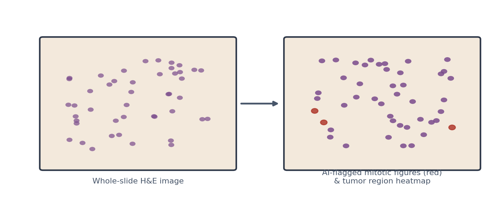
*Figure 6.3 — A digital slide before and after AI analysis, with flagged regions highlighted for the pathologist. Illustrative.*

Pathology AI has its own shift problems. Stain colour varies between laboratories and batches. Scanners differ. A model trained on one laboratory's slides may fail on another's.

## 6.5 The Clinical Laboratory
Laboratory results guide many decisions. A popular claim says they drive "70% of medical decisions". Researchers traced this figure and found no primary evidence for it [15]. It is better to say that laboratory results are central to diagnosis and monitoring, and to cite real studies.

Most laboratory errors happen before analysis: wrong patient, wrong tube, poor sample handling [14]. AI and automation help at several points.

- **Sample quality checks.** Analysers measure the colour of serum to detect **haemolysis** (burst red cells), **icterus** (high bilirubin) and **lipaemia** (high fat). These are called the HIL indices. Each can distort certain results, and the analyser flags or withholds them.
- **Delta checks.** Software compares a new result with the same patient's previous one. A sudden large change may be real, or it may mean the wrong patient's sample. For example, blood drawn from an arm with an intravenous drip is diluted, so most values fall falsely. A sudden false rise in creatinine suggests a mislabelled sample from another patient, or an interfering substance. The flag goes to the technologist and the requesting clinician to decide.
- **Image-based microscopy.** Digital systems pre-classify blood cells on a smear, and camera systems read bacterial culture plates. A technologist reviews what the system flags.

Machine-learning versions of these checks can combine many results at once. They still depend on stable analysers and good sample labelling.

> **Deeper Dive:** AI can find signals that people do not know how to see. A model trained on retinal photographs predicted age, sex, smoking status and blood pressure [16]. This field is called **oculomics**. These are research findings. They are not yet validated tests for individual patients.

> **Through Four Lenses**
> - **Medicine:** Physicians receiving AI-assisted reports should know whether a tool detects, diagnoses or triages. A triage flag speeds reading; it does not replace a full report or clinical correlation.
> - **Pharmacy:** Pharmacists rely on laboratory values for dosing, such as creatinine for kidney-cleared drugs. A delta-check flag or HIL warning means the value may be wrong. Confirm before adjusting a dose.
> - **Physical Therapy:** Physiotherapists read imaging reports to plan rehabilitation. An AI-flagged ligament tear still needs clinical tests of stability. Imaging findings and function do not always match.
> - **Health Sciences:** Imaging and laboratory technologists produce the inputs AI reads. Positioning, image quality, stain batches and analyser calibration all shift model performance. Document changes and report unusual outputs.

> **Myth vs Evidence:** Myth: "Imaging AI works equally well for everyone." Evidence: Dermatology models tested on a set balanced by skin tone performed worse on darker skin than on lighter skin [11]. Performance must be checked in each population.

> **Safety Alert:** An AI "normal" is not a guarantee. If the patient's symptoms or examination do not fit the report, ask for a human review.

## Key Takeaways
- CADe marks findings, CADx characterises them, and CADt reorders the worklist; each carries different risks.
- Diabetic eye screening and breast screening have prospective and randomised evidence; many other tools do not.
- Fast-MRI networks infer missing data, which saves time but can add or remove features.
- Digital pathology tiles huge images, scores each tile and builds a heatmap; stain and scanner shift are key risks.
- Laboratory AI supports sample-quality checks, delta checks and microscopy, and every flag needs human review.

## Self-Assessment
**Q1.** An AI tool moves CT scans with a suspected brain bleed to the top of the radiologist's list. It does not mark or describe the bleed. What type of tool is this? [LO1]
A) CADe
B) CADx
C) CADt
D) An ambient scribe

**Q2.** In a prospective primary-care study, an autonomous retinal system had 87.2% sensitivity and 90.7% specificity. Amal's result is "refer". What is the best interpretation? [LO2]
A) She needs specialist confirmation; some referred patients will not have significant disease.
B) She definitely has sight-threatening disease.
C) The result can be ignored because AI is not reliable.
D) She should start laser treatment today.

**Q3.** A radiology department wants to use an AI model for mammography. Which evidence would most strongly support its use in screening? [LO2]
A) A developer's report of high accuracy on its own data
B) A study with unpublished code and data
C) A single retrospective study from one hospital
D) A randomised screening trial showing more cancers found without more false positives

**Q4.** A fast-MRI knee scan shows a small cartilage defect that is absent on the standard slow scan. What is a plausible explanation? [LO3]
A) The fast scan used more radiation.
B) The reconstruction network inferred anatomy and added a feature that is not really there.
C) The patient's knee changed in five minutes.
D) Fast MRI recovers all missing data exactly.

**Q5.** A scan time falls from 40 minutes to 10 minutes. What is the percentage reduction? [LO3]
A) 25%
B) 40%
C) 75%
D) 400%

**Q6.** Why are whole-slide images cut into tiles before analysis? [LO4]
A) They are far too large for a model to process in one piece.
B) Tiling removes patient identifiers.
C) Pathologists prefer to see small squares.
D) Tiling corrects stain colour automatically.

**Q7.** A patient's creatinine was 85 µmol/L yesterday and is 300 µmol/L today. She is well, and her other results match another patient on the ward. What is the most likely explanation? [LO4]
A) Contamination from an intravenous drip, which raises creatinine
B) Normal daily variation
C) A haemolysed sample
D) A mislabelled sample from another patient

**Q8.** A pathology model trained in one laboratory performs poorly in a second laboratory. Which cause is most likely? [LO5]
A) The second laboratory's patients have no cancer.
B) Differences in stain colour and scanners between laboratories
C) The model was too simple.
D) The second laboratory used MRI instead of slides.

**Q9.** A skin-lesion model performs well on HAM10000 but worse on a test set balanced by skin tone. What is the most important lesson for Lina's care? [LO5]
A) Models cannot be used on skin.
B) Only dermatologists can read HAM10000.
C) Performance must be checked in people like her, including darker skin tones.
D) The balanced test set was wrong.

**Q10.** A retinal model predicts a patient's blood pressure from a photograph. How should this be described today? [LO5]
A) An interesting research finding, not yet a validated clinical test for individuals
B) A replacement for blood-pressure measurement
C) Proof that retinal photos contain no useful information
D) A regulated diagnostic test in all countries

**Case Question.** Amal is frightened by her "refer" result. As the healthcare assistant or nurse, write four sentences that explain what the result means, why she needs an eye specialist, and why she should not assume the worst.

## Answers and Rationales
**Q1. C** — Reordering the worklist is triage. A marks findings. B characterises them. D writes notes.

**Q2. A** — A referral from a screening tool needs confirmation; with 90.7% specificity, false positives occur [2]. B overstates. C dismisses good evidence. D skips diagnosis.

**Q3. D** — A randomised trial measuring detection and false positives is the strongest evidence [3]. A, B and C are weaker.

**Q4. B** — Reconstruction networks infer missing data from learned anatomy and can add or remove features [7]. A is false; MRI has no radiation. C is implausible. D is false.

**Q5. C** — (40 − 10) ÷ 40 = 75%. A is the remaining share. B and D are wrong calculations.

**Q6. A** — Gigapixel images exceed what models can process at once. B, C and D are not the reason.

**Q7. D** — A sudden large rise in a well patient, matching another patient's results, suggests a labelling error. A is wrong because drip contamination dilutes and lowers most values. B cannot explain this size of change. C affects some tests, such as potassium, more than creatinine.

**Q8. B** — Stain and scanner differences create distribution shift. A, C and D are unsupported.

**Q9. C** — Performance fell on darker skin in a balanced test set [11], so it must be checked in each group. A overgeneralises. B and D are wrong.

**Q10. A** — Oculomics findings are promising research [16], not validated individual tests. B, C and D are wrong.

**Case Question — model answer.** "The camera and computer found changes in the blood vessels at the back of your eyes that need a closer look. This test is designed to be careful, so it sometimes refers people whose eyes turn out to be fine. An eye specialist will examine you properly and decide whether you need treatment. If treatment is needed, catching it early like this is exactly what protects sight."

## References
1. Gulshan V, Peng L, Coram M, et al. Development and validation of a deep learning algorithm for detection of diabetic retinopathy in retinal fundus photographs. JAMA. 2016;316(22):2402-2410. DOI: 10.1001/jama.2016.17216
2. Abràmoff MD, Lavin PT, Birch M, et al. Pivotal trial of an autonomous AI-based diagnostic system for detection of diabetic retinopathy in primary care offices. NPJ Digit Med. 2018;1:39. DOI: 10.1038/s41746-018-0040-6
3. Lång K, Josefsson V, Larsson AM, et al. Artificial intelligence-supported screen reading versus standard double reading in the Mammography Screening with Artificial Intelligence trial (MASAI): a clinical safety analysis of a randomised, controlled, non-inferiority, single-blinded, screening accuracy study. Lancet Oncol. 2023;24(8):936-944. DOI: 10.1016/s1470-2045(23)00298-x
4. McKinney SM, Sieniek M, Godbole V, et al. International evaluation of an AI system for breast cancer screening. Nature. 2020;577(7788):89-94. DOI: 10.1038/s41586-019-1799-6
5. Haibe-Kains B, Adam GA, Hosny A, et al. Transparency and reproducibility in artificial intelligence. Nature. 2020;586(7829):E14-E16. DOI: 10.1038/s41586-020-2766-y
6. Dembrower K, Crippa A, Colón E, Eklund M, Strand F. Artificial intelligence for breast cancer detection in screening mammography in Sweden: a prospective, population-based, paired-reader, non-inferiority study. Lancet Digit Health. 2023;5(10):e703-e711. DOI: 10.1016/S2589-7500(23)00153-X
7. Hammernik K, Klatzer T, Kobler E, et al. Learning a variational network for reconstruction of accelerated MRI data. Magn Reson Med. 2018;79(6):3055-3071. DOI: 10.1002/mrm.26977
8. Bien N, Rajpurkar P, Ball RL, et al. Deep-learning-assisted diagnosis for knee magnetic resonance imaging: development and retrospective validation of MRNet. PLoS Med. 2018;15(11):e1002699. DOI: 10.1371/journal.pmed.1002699
9. Esteva A, Kuprel B, Novoa RA, et al. Dermatologist-level classification of skin cancer with deep neural networks. Nature. 2017;542(7639):115-118. DOI: 10.1038/nature21056
10. Tschandl P, Rosendahl C, Kittler H. The HAM10000 dataset, a large collection of multi-source dermatoscopic images of common pigmented skin lesions. Sci Data. 2018;5:180161. DOI: 10.1038/sdata.2018.161
11. Daneshjou R, Vodrahalli K, Novoa RA, et al. Disparities in dermatology AI performance on a diverse, curated clinical image set. Sci Adv. 2022;8(32):eabq6147. DOI: 10.1126/sciadv.abq6147
12. Campanella G, Hanna MG, Geneslaw L, et al. Clinical-grade computational pathology using weakly supervised deep learning on whole slide images. Nat Med. 2019;25(8):1301-1309. DOI: 10.1038/s41591-019-0508-1
13. Bulten W, Kartasalo K, Chen PHC, et al. Artificial intelligence for diagnosis and Gleason grading of prostate cancer: the PANDA challenge. Nat Med. 2022;28(1):154-163. DOI: 10.1038/s41591-021-01620-2
14. Plebani M. Errors in clinical laboratories or errors in laboratory medicine? Clin Chem Lab Med. 2006;44(6):750-759. DOI: 10.1515/cclm.2006.123
15. Hallworth MJ. The '70% claim': what is the evidence base? Ann Clin Biochem. 2011;48(6):487-488. DOI: 10.1258/acb.2011.011177
16. Poplin R, Varadarajan AV, Blumer K, et al. Prediction of cardiovascular risk factors from retinal fundus photographs via deep learning. Nat Biomed Eng. 2018;2(3):158-164. DOI: 10.1038/s41551-018-0195-0
17. Zech JR, Badgeley MA, Liu M, et al. Variable generalization performance of a deep learning model to detect pneumonia in chest radiographs: a cross-sectional study. PLoS Med. 2018;15(11):e1002683. DOI: 10.1371/journal.pmed.1002683

---

# Chapter 7: Medicines — Discovery, Dosing and Safety

## Opening Case
Amal's knee has been painful for weeks. Her family physician prescribes ibuprofen, an anti-inflammatory painkiller. At the community pharmacy, the dispensing system shows four alerts on her screen at once. One says "Ibuprofen + lisinopril + furosemide: risk of acute kidney injury". The others warn about minor issues the pharmacist sees dozens of times a day.

The pharmacist knows that most alerts are overridden. She also knows Amal's kidney function is already reduced, with an eGFR of 52. She stops, reads the kidney alert carefully and calls the physician. They agree on paracetamol and a physiotherapy referral instead.

A single alert among many prevented harm. Why do so many alerts get ignored, how could AI make them better, and where else is AI changing how medicines are discovered, dosed and monitored?

## Learning Objectives
By the end of this chapter you will be able to:
1. [LO1] Describe how AI contributes at different stages of drug discovery, and its limits.
2. [LO2] Explain alert fatigue and how machine learning could make medication alerts more useful.
3. [LO3] Describe model-informed precision dosing using the example of vancomycin.
4. [LO4] Explain how AI supports pharmacovigilance and pharmacogenomics.
5. [LO5] Identify risks of using AI tools for drug information.

> **Medical Background in 60 Seconds:** A new medicine usually takes 10 to 15 years to develop. Scientists first find a **drug target**, usually a protein involved in disease. They then search for molecules that act on it. Promising molecules are tested in cells and animals, then in human trials: phase I for safety, phase II for dose and early effect, and phase III for effectiveness in large groups. After approval, safety monitoring continues for as long as the drug is used. This last step is **pharmacovigilance**.

## 7.1 Discovery: Finding Targets and Molecules
**Protein structure.** A protein's shape decides how drugs can bind to it. For decades, finding a shape took months of laboratory work. AlphaFold predicts protein structures from their amino-acid sequence, often with accuracy close to experimental methods [1]. It has made structures available for almost every known protein.

A structure is not a drug. It shows where a molecule might bind. It does not show whether a molecule will be safe, reach the right tissue or help patients.

**Searching for molecules.** Deep-learning models can screen huge libraries of molecules on a computer. One team trained a model to predict antibacterial activity and screened more than 100 million molecules [2]. It found halicin, a compound that killed resistant bacteria in laboratory tests and in mice.

**Designing new molecules.** Generative models can propose molecules that have never been made. In one study, a generative model designed candidate inhibitors of a kinase target. The team synthesised and tested them in cells and mice within weeks [3].

These are real advances in speed. But all three examples stopped at laboratory or animal stages when they were published. Most drug candidates fail in human trials. AI can shorten the early search; it cannot skip clinical testing.

## 7.2 Medication Alerts and Alert Fatigue
**Clinical decision support** (Chapter 1) is built into most prescribing and dispensing systems. It checks for interactions, allergies, duplicate therapy and doses that do not suit kidney function.

The problem is volume. A systematic review found that clinicians overrode between 49% and 96% of drug-safety alerts [4]. Many alerts are about minor or theoretical risks. When people see the same alert again and again, they stop reading it. This is **alert fatigue**. A study in primary care found that clinicians were less likely to accept an alert the more often they had seen it before [5].

In Chapter 4 terms, most rule-based alerts have a low PPV. Only a small share lead to a change that matters. Experts have long advised that alerts should be fewer, faster and more specific [6].

Machine learning offers one route. Instead of firing on every drug pair, a model can learn which prescriptions, in which patients, are truly high-risk. In a French hospital, a machine-learning system trained on past pharmacist reviews identified prescriptions at high risk of medication error. Its alerts were more often relevant than those of the hospital's existing rule-based system [7].

Amal's case shows what matters. Ibuprofen with an ACE inhibitor (lisinopril) and a diuretic (furosemide) can reduce blood flow to the kidneys. With her existing kidney impairment, the risk is real. A good system would show that alert prominently and hide the trivial ones.

## 7.3 Precision Dosing
Many drugs have a narrow range between an effective and a toxic level. Vancomycin, an antibiotic for serious infections, is one. Its effect depends on the total drug exposure over 24 hours, measured as the **area under the concentration–time curve** (AUC).

Traditional dosing uses fixed doses and a single trough level. **Model-informed precision dosing** (MIPD) uses a pharmacokinetic model of how the drug moves through the body. The model starts with average patient values. As each blood level arrives, it updates its estimate for that patient, using Bayesian methods (Chapter 4). It then recommends the dose most likely to reach the target.

Current guidelines for serious MRSA infections recommend AUC-guided vancomycin dosing, preferably with Bayesian software [9]. MIPD is not new, but it is still used less than it could be. Barriers include software integration, staff training and validation of models in local patients [8].

Some newer dosing tools add machine learning to the pharmacokinetic model. They still need the same checks: tested in patients like yours, calibrated and supervised by a pharmacist.

## 7.4 Pharmacogenomics and Pharmacovigilance
**Pharmacogenomics** studies how genes affect drug response. Some variants change how quickly the liver breaks down a drug. Others raise the risk of severe reactions. For example, people carrying HLA-B*57:01 have a high risk of a dangerous reaction to the HIV drug abacavir, so testing is done before prescribing [10]. AI helps by linking genetic results to prescribing systems, so that a warning appears at the right moment.

**Pharmacovigilance** looks for harms that trials missed. Trials involve thousands of people; after approval, millions take the drug. Rare reactions appear only then. Sources include spontaneous reports from clinicians and patients, health records and even social media. Data-mining and natural language processing can scan these sources and flag possible signals, such as a drug reported with liver injury more often than expected [11].

A signal is a question, not an answer. Many signals are caused by chance, by confounding or by the disease the drug treats. Experts must review each one.

> **Deeper Dive:** A common signal method compares proportions. Suppose 2% of all reports in a database mention liver injury, but 10% of reports for Drug X do. The reporting ratio is 10 ÷ 2 = 5. A high ratio flags Drug X for review. It does not prove the drug causes liver injury. For example, Drug X might be used mainly by patients who already have liver disease.

## 7.5 Dispensing, Supply and Drug Information
Hospitals and pharmacies use automation for dispensing cabinets, robot packing and stock control. Forecasting models predict demand, which helps prevent shortages of critical medicines.

LLMs are increasingly used to answer drug questions (Chapter 5). They can explain mechanisms well. But they can state wrong doses, miss interactions or ignore kidney function, all in fluent language. Amal's case would have gone wrong if a chatbot had simply said "ibuprofen is a safe painkiller". Doses and interactions must always be checked against official product information or a trusted drug database.

> **Through Four Lenses**
> - **Medicine:** Physicians should not override kidney or bleeding alerts by habit. Reading the one alert that matters, as Amal's physician did after the pharmacist's call, is a core safety skill.
> - **Pharmacy:** Pharmacists sit at the final check before a medicine reaches the patient. They can help tune alerts, lead precision-dosing services and report adverse reactions that feed pharmacovigilance.
> - **Physical Therapy:** Physiotherapists see how medicines affect movement and pain. Dizziness, falls or muscle pain after a new drug should be reported. Non-drug pain options, such as exercise, reduce reliance on risky analgesics.
> - **Health Sciences:** Laboratory scientists provide the drug levels, kidney results and genetic tests that dosing models use. Timing of samples, units and assay changes affect every Bayesian dose calculation.

> **Myth vs Evidence:** Myth: "AI can now design drugs without the need for long trials." Evidence: AI has sped up target structure prediction and molecule screening [1, 2, 3]. Candidates still need animal studies and phased human trials, where most fail.

> **Safety Alert:** Never dismiss a kidney, bleeding or allergy alert without reading it, even when you see many alerts a day. Check doses and interactions against authoritative sources, not chatbots.

## Key Takeaways
- AI speeds up protein structure prediction, molecule screening and design, but clinical trials remain essential.
- Most rule-based medication alerts are overridden; low PPV causes alert fatigue.
- Machine learning can make alerts more specific by learning which prescriptions are truly high-risk.
- Model-informed precision dosing uses Bayesian updating with each drug level, as recommended for vancomycin.
- Pharmacovigilance signals from AI are questions for experts, not proof of harm.

## Self-Assessment
**Q1.** AlphaFold predicts a protein's structure with high accuracy. What does this achieve for drug development? [LO1]
A) It proves a drug will be safe.
B) It replaces phase III trials.
C) It shows which patients will respond.
D) It helps identify where a molecule might bind to the target.

**Q2.** A study reports that clinicians override 90% of drug-interaction alerts. What is the most likely underlying problem? [LO2]
A) Clinicians do not care about safety.
B) Many alerts are low-value, so their PPV is low and fatigue develops.
C) The alerts use machine learning.
D) The alerts are too rare.

**Q3.** Amal takes lisinopril and furosemide and has an eGFR of 52. She is prescribed ibuprofen. What is the main risk the pharmacist identifies? [LO2]
A) Acute kidney injury
B) Low blood sugar
C) Liver failure
D) Loss of vision

**Q4.** How does model-informed precision dosing for vancomycin work? [LO3]
A) It gives every patient the same fixed dose.
B) It uses a chatbot to choose the dose.
C) It combines a pharmacokinetic model with the patient's drug levels to update and recommend doses.
D) It measures vancomycin in urine only.

**Q5.** Why is Bayesian updating useful in precision dosing? [LO3]
A) It refines the estimate for the individual patient as each new blood level arrives.
B) It removes the need for blood levels.
C) It guarantees no side effects.
D) It works only for children.

**Q6.** A pharmacovigilance system finds that liver injury is reported five times more often for Drug X than for other drugs. What is the correct next step? [LO4]
A) Withdraw Drug X immediately from all markets.
B) Ignore the signal because reports are unreliable.
C) Conclude that Drug X causes liver injury.
D) Have experts review the signal, looking for chance, confounding and biological plausibility.

**Q7.** Before prescribing abacavir, a clinician orders an HLA-B*57:01 test. Which field does this belong to? [LO4]
A) Radiomics
B) Pharmacogenomics
C) Oculomics
D) Reinforcement learning

**Q8.** A patient's relative says, "The chatbot told me the dose is fine." What should the pharmacist do? [LO5]
A) Accept it, because chatbots are trained on medical texts
B) Double the dose to be safe
C) Check the dose against the product information or a trusted drug database
D) Ask the chatbot again

**Q9.** A machine-learning alert system learns from past pharmacist reviews which prescriptions were truly risky. Compared with a rule-based system, what is its main aim? [LO2]
A) To raise the proportion of alerts that are clinically relevant
B) To show every possible interaction
C) To remove pharmacists from review
D) To make alerts appear more often

**Q10.** A generative model designs a molecule that works in mice. What can be concluded? [LO1]
A) It is ready for approval.
B) It will be safe in humans.
C) It is a candidate that still needs human trials, where many candidates fail.
D) It does not need pharmacovigilance.

**Case Question.** You are the pharmacist in the opening case. Write a short message to the physician explaining the risk of the ibuprofen prescription for Amal and proposing an alternative plan.

## Answers and Rationales
**Q1. D** — A structure shows possible binding sites [1]. A, B and C need other evidence.

**Q2. B** — Frequent low-value alerts lower PPV and drive overrides [4, 5]. A blames people for a design problem. C and D are not the cause.

**Q3. A** — An NSAID with an ACE inhibitor and a diuretic reduces kidney blood flow, and her kidney function is already reduced. B, C and D are not the main risk.

**Q4. C** — MIPD combines a pharmacokinetic model with measured levels [8, 9]. A is traditional fixed dosing. B and D are wrong.

**Q5. A** — Each new level updates the patient-specific estimate. B, C and D are false.

**Q6. D** — A signal needs expert review before conclusions [11]. A and C act too early. B ignores a possible harm.

**Q7. B** — Genetic testing to guide drug choice is pharmacogenomics [10]. A, C and D are unrelated.

**Q8. C** — Dose advice must be checked against authoritative sources. A trusts fluent output. B is dangerous. D is not verification.

**Q9. A** — The aim is fewer, more relevant alerts [7]. B worsens fatigue. C is not the aim. D reverses the aim.

**Q10. C** — Animal results do not predict human safety or benefit. A, B and D are wrong.

**Case Question — model answer.** "Dear Doctor, Amal Hassan has been prescribed ibuprofen while taking lisinopril and furosemide, and her eGFR is 52. This combination can reduce kidney blood flow and cause acute kidney injury. I suggest paracetamol at a standard dose for her knee pain instead, with a physiotherapy referral for exercise-based management. If an anti-inflammatory is essential, a topical form for a short period with a kidney check would be safer. Please let me know if you agree, and I will explain the change to her."

## References
1. Jumper J, Evans R, Pritzel A, et al. Highly accurate protein structure prediction with AlphaFold. Nature. 2021;596(7873):583-589. DOI: 10.1038/s41586-021-03819-2
2. Stokes JM, Yang K, Swanson K, et al. A deep learning approach to antibiotic discovery. Cell. 2020;180(4):688-702. DOI: 10.1016/j.cell.2020.01.021
3. Zhavoronkov A, Ivanenkov YA, Aliper A, et al. Deep learning enables rapid identification of potent DDR1 kinase inhibitors. Nat Biotechnol. 2019;37(9):1038-1040. DOI: 10.1038/s41587-019-0224-x
4. van der Sijs H, Aarts J, Vulto A, Berg M. Overriding of drug safety alerts in computerized physician order entry. J Am Med Inform Assoc. 2006;13(2):138-147. DOI: 10.1197/jamia.M1809
5. Ancker JS, Edwards A, Nosal S, et al. Effects of workload, work complexity, and repeated alerts on alert fatigue in a clinical decision support system. BMC Med Inform Decis Mak. 2017;17:36. DOI: 10.1186/s12911-017-0430-8
6. Bates DW, Kuperman GJ, Wang S, et al. Ten commandments for effective clinical decision support: making the practice of evidence-based medicine a reality. J Am Med Inform Assoc. 2003;10(6):523-530. DOI: 10.1197/jamia.M1370
7. Corny J, Rajkumar A, Martin O, et al. A machine learning-based clinical decision support system to identify prescriptions with a high risk of medication error. J Am Med Inform Assoc. 2020;27(11):1688-1694. DOI: 10.1093/jamia/ocaa154
8. Darwich AS, Ogungbenro K, Vinks AA, et al. Why has model-informed precision dosing not yet become common clinical reality? Lessons from the past and a roadmap for the future. Clin Pharmacol Ther. 2017;101(5):646-656. DOI: 10.1002/cpt.659
9. Rybak MJ, Le J, Lodise TP, et al. Therapeutic monitoring of vancomycin for serious methicillin-resistant Staphylococcus aureus infections: a revised consensus guideline and review. Am J Health Syst Pharm. 2020;77(11):835-864. DOI: 10.1093/ajhp/zxaa036
10. Relling MV, Evans WE. Pharmacogenomics in the clinic. Nature. 2015;526(7573):343-350. DOI: 10.1038/nature15817
11. Harpaz R, DuMouchel W, Shah NH, et al. Novel data-mining methodologies for adverse drug event discovery and analysis. Clin Pharmacol Ther. 2012;91(6):1010-1021. DOI: 10.1038/clpt.2012.50

---

# Chapter 8: AI in Motion — Rehabilitation, Wearables and Robotics

## Opening Case
Six weeks after his knee injury, Karim is doing rehabilitation. He cannot afford to travel to the clinic three times a week, so his physiotherapist sets up a home programme. Twice a week, Karim films himself walking and squatting with his phone. An app tracks the position of his hips, knees and ankles in the video and reports his knee bending angle. A wrist band counts his daily steps.

At the video review, the physiotherapist notices that the app reports 95° of knee bend, but Karim's squat clearly looks shallower. His trousers are baggy, and the room is dark. She measures his knee with a goniometer during the video call: 80°. She adjusts his programme.

Motion is data too. How do cameras and sensors turn movement into numbers? How far can we trust them? And what about robots that move instruments inside the body?

## Learning Objectives
By the end of this chapter you will be able to:
1. [LO1] Describe how pose estimation turns video into joint positions and angles.
2. [LO2] Explain how wearable sensors measure movement, and the limits of their validity.
3. [LO3] Evaluate the evidence for telerehabilitation and AI-supported home programmes.
4. [LO4] Distinguish the levels of autonomy in medical robotics.
5. [LO5] Describe how AI assesses surgical skill and where autonomous systems stand today.

> **Medical Background in 60 Seconds:** The **gait cycle** is the sequence of one step, from one heel strike to the next heel strike of the same foot. It has a stance phase, when the foot is on the ground, and a swing phase. **Range of motion** is how far a joint can move, measured in degrees with a goniometer. After a knee injury, physiotherapists track range of motion, strength and gait to guide recovery.

## 8.1 Pose Estimation: From Video to Joints
**Pose estimation** is a computer-vision task. A model finds key points on the body, such as shoulders, hips, knees and ankles, in each video frame. Joining the points gives a stick figure. From it, software calculates joint angles, step length and walking speed (Figure 8.1).

OpenPose is a widely used system that finds body key points for several people at once [1]. Researchers have applied such tools to ordinary two-dimensional videos of walking and obtained useful gait measures [2]. In children with cerebral palsy, a deep-learning model predicted clinical gait parameters from a single camera, which could make assessment possible outside specialised laboratories [3].

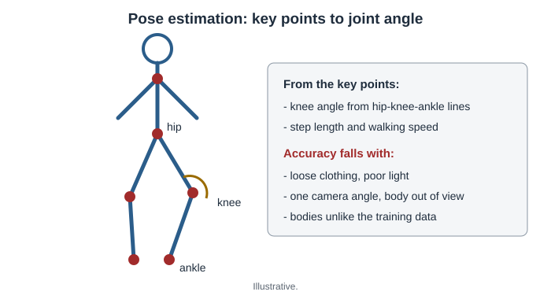
*Figure 8.1 — A pose-estimation model finds body key points in each video frame; joint angles are calculated from the lines between them. Illustrative.*

The traditional reference method is marker-based motion capture. Reflective markers are placed on the skin, and several cameras track them in a laboratory. When markerless and marker-based systems were compared in the same walkers, differences were a few degrees for most joint angles, but larger for some rotations [4].

Performance depends on conditions. Baggy clothing hides joints. Poor light, a single camera angle and people partly out of view all add error. Most models were trained on people standing and walking normally. Walking aids, amputations, obesity and unusual movement patterns may not be well represented. Karim's case shows these limits.

## 8.2 Wearables: Sensors on the Body
**Wearable** devices include wrist bands, smartwatches and sensors clipped to the body. Most contain an **inertial measurement unit** (IMU), which combines an accelerometer and a gyroscope. The IMU records acceleration and rotation many times per second. Algorithms then turn these signals into steps, activity type, sleep or joint angles.

Consumer devices count steps reasonably well in controlled tests, but they are less accurate for energy expenditure [5]. They are also less accurate at slow walking speeds and in people who use walking aids. These are exactly the people many physiotherapists treat. A device validated in healthy young adults may undercount steps in an older patient with a limp.

Wearables become clinically useful when they are validated for the patient group and the measure that matters. Examples include step counts after surgery, time spent upright in hospital and fall detection in older adults.

## 8.3 Telerehabilitation and Home Programmes
**Telerehabilitation** delivers physiotherapy remotely, often by video. A systematic review of real-time telerehabilitation for musculoskeletal conditions found improvements in physical function that were comparable to standard in-person care [6].

AI adds automated feedback. Apps can count repetitions, check movement quality and remind patients to exercise. This may help adherence, which is a major problem in rehabilitation. The evidence for AI-feedback apps is still developing, and each app should be judged by the questions in Chapter 4. Does it measure what it claims? In whom was it tested? Does it improve outcomes?

A **robotic exoskeleton** is a powered frame worn on the legs. It supports stepping practice after stroke or spinal cord injury. A review found that exoskeletons are promising but that trials are small and methods vary [7]. They support therapists; they do not replace them.

> **Deeper Dive:** An accelerometer measures acceleration in three directions. When a person walks, each heel strike produces a spike in the signal. A step-counting algorithm finds these spikes. It must ignore spikes from other movements, such as waving a hand. A slow, shuffling walk produces smaller spikes that may fall below the algorithm's threshold, so steps are missed.

## 8.4 Robots in the Operating Room
In robot-assisted surgery, the surgeon sits at a console and controls instruments inside the patient. This arrangement is called **leader–follower telemanipulation**: the surgeon's hand movements lead, and the robot's arms follow.

The robot adds several features.

- **Motion scaling** turns a large hand movement into a small instrument movement, for precision.
- **Tremor filtering** removes the natural small shake of human hands. Physiological tremor occurs at about 8–12 Hz, so the system filters movements at those frequencies.
- Wristed instruments bend like a wrist inside the body. The instrument system has seven degrees of freedom, compared with four for a rigid laparoscopic instrument.

In orthopaedic surgery, some robots use a **haptic boundary**. The system allows the cutting tool to move only within a planned zone, which protects surrounding tissue during joint replacement.

## 8.5 Levels of Autonomy
Most surgical robots today have no autonomy: every movement comes from the surgeon. A widely used framework describes six levels [8]:

| Level | Description | Example |
|---|---|---|
| 0 | No autonomy | Standard leader–follower robot |
| 1 | Robot assistance | Tremor filtering, haptic boundaries |
| 2 | Task autonomy | Robot performs a specific task, such as suturing, under supervision |
| 3 | Conditional autonomy | Robot plans and performs a task; human approves and monitors |
| 4 | High autonomy | Robot makes decisions; human can intervene |
| 5 | Full autonomy | No human involved |

The Smart Tissue Autonomous Robot (STAR) sewed together two ends of pig bowel with little human help. Its stitches were more consistent than those of surgeons in the same experiment [9]. This was a preclinical study in a small number of animals in one laboratory. It shows feasibility, not readiness for patients.

## 8.6 Measuring Skill
Motion data can also assess people. The **Objective Structured Assessment of Technical Skills** (OSATS) is a rating scale for surgical skill, developed at the University of Toronto [10]. AI systems now analyse instrument movements and surgical video to estimate skill automatically, for example by measuring economy of motion. **Surgical data science** is the wider field that collects and analyses such data to improve care [11].

The same idea applies in rehabilitation. Movement quality can be measured, tracked over time and fed back to the patient.

> **Through Four Lenses**
> - **Medicine:** Physicians should know that robotic systems today are mostly level 0 or 1. Consent discussions should explain who controls the instrument and what the robot does automatically.
> - **Pharmacy:** Pharmacists can combine activity data with medicine reviews. A drop in daily steps after starting a sedating drug, or dizziness after a blood-pressure change, can signal a problem worth acting on.
> - **Physical Therapy:** Physiotherapists should validate pose and wearable measures against clinical tests in their own patients. Clothing, light, walking aids and slow gait all reduce accuracy.
> - **Health Sciences:** Biomedical and technical staff maintain sensors, cameras and robots. Calibration, software updates and device changes can shift measurements, and should be logged and checked.

> **Myth vs Evidence:** Myth: "Autonomous surgical robots already outperform surgeons." Evidence: The best-known autonomous result, STAR, was a small preclinical study in pigs [9]. Robots in clinical use today are controlled by surgeons.

> **Safety Alert:** When an app's movement measure disagrees with what you see, measure it yourself. Do not progress exercises, clear a patient to return to work or record a result based on an unchecked app number.

## Key Takeaways
- Pose estimation turns video into joint positions and angles; accuracy depends on clothing, light and body type.
- Wearables use IMUs; step counts are reasonable in healthy walkers but less accurate in slow or assisted walking.
- Real-time telerehabilitation for musculoskeletal conditions gives results comparable to in-person care.
- Surgical robots today are mostly leader–follower systems with assistance features, not autonomous surgeons.
- AI can measure skill and movement quality, but each measure must be validated in the people who use it.

## Self-Assessment
**Q1.** An app finds the positions of Karim's hips, knees and ankles in each frame of a video. What is this task called? [LO1]
A) Pose estimation
B) Retrieval-augmented generation
C) Pharmacovigilance
D) Computer-aided triage

**Q2.** Karim's app reports 95° of knee bend, but a goniometer shows 80°. He wore baggy trousers in a dark room. What is the most likely cause? [LO1]
A) The goniometer is always wrong.
B) The app is adversarially attacked.
C) Clothing and poor light reduced pose-estimation accuracy.
D) Karim's knee changed during the call.

**Q3.** An 80-year-old patient using a walking frame wears a consumer step counter. What should the physiotherapist expect? [LO2]
A) Perfect step counts
B) Possible undercounting because slow, assisted walking reduces accuracy
C) Overcounting of energy expenditure only
D) No data at all

**Q4.** What does an inertial measurement unit contain? [LO2]
A) A camera and a microphone
B) A thermometer and a pulse oximeter
C) A magnet and radio coils
D) An accelerometer and a gyroscope

**Q5.** What does a systematic review report about real-time telerehabilitation for musculoskeletal conditions? [LO3]
A) It is harmful.
B) It works only for children.
C) It improves physical function comparably to in-person care.
D) It has never been studied.

**Q6.** A robot filters the surgeon's hand tremor. Which frequency range does it target? [LO4]
A) About 8–12 Hz
B) About 0.1–0.5 Hz
C) About 50–60 Hz
D) About 200–300 Hz

**Q7.** A robot performs a specific suturing task by itself while the surgeon supervises. Which autonomy level is this? [LO4]
A) Level 0
B) Level 1
C) Level 5
D) Level 2

**Q8.** What is the correct interpretation of the STAR robot's bowel-suturing results? [LO5]
A) STAR is approved for routine human surgery.
B) It is a preclinical proof of feasibility in a small number of animals.
C) It proves robots are safer than surgeons.
D) It shows full (level 5) autonomy in patients.

**Q9.** What is OSATS? [LO5]
A) A robot model
B) A drug-safety database
C) A rating scale for surgical technical skill
D) A wearable sensor

**Q10.** A clinic plans to use an AI home-exercise app for older patients after hip surgery. What should it check first? [LO3]
A) Whether the app was validated in patients like theirs and improves outcomes
B) Whether the app has a pleasant colour scheme
C) Whether the app uses the newest neural network
D) Whether the app can replace all clinic visits

**Case Question.** Write a short note for Karim's record explaining the difference between the app's knee angle and your goniometer measurement, what caused it, and how you will use the app safely in future sessions.

## Answers and Rationales
**Q1. A** — Finding body key points in video is pose estimation [1]. B, C and D are unrelated tasks.

**Q2. C** — Loose clothing and poor light hide joint landmarks and add error. A is false. B is deliberate manipulation, not present here. D is implausible.

**Q3. B** — Step counters are less accurate at slow speeds and with walking aids [5]. A overstates. C and D are wrong.

**Q4. D** — An IMU combines an accelerometer and a gyroscope. A, B and C describe other devices.

**Q5. C** — Function improved comparably to standard care [6]. A, B and D are false.

**Q6. A** — Physiological tremor is about 8–12 Hz. B, C and D are wrong ranges.

**Q7. D** — Performing a specific task under supervision is task autonomy, level 2 [8]. A has no autonomy. B is assistance only. C involves no human.

**Q8. B** — STAR was tested in a small number of pigs in one laboratory [9]. A, C and D overstate the evidence.

**Q9. C** — OSATS is a surgical skill rating scale [10]. A, B and D are wrong.

**Q10. A** — Validation in the target group and evidence of benefit come first. B and C do not show safety. D overreaches.

**Case Question — model answer.** "App-reported knee flexion 95°; goniometer measurement 80° in the same session. The difference is likely due to loose clothing and low light, which reduce pose-estimation accuracy. The goniometer value is recorded as the reference. For future sessions, Karim will film in good light, wear shorts and keep his whole body in view. I will check the app against a goniometer measurement at each review until the two agree consistently."

## References
1. Cao Z, Hidalgo G, Simon T, Wei SE, Sheikh Y. OpenPose: realtime multi-person 2D pose estimation using part affinity fields. IEEE Trans Pattern Anal Mach Intell. 2021;43(1):172-186. DOI: 10.1109/TPAMI.2019.2929257
2. Stenum J, Rossi C, Roemmich RT. Two-dimensional video-based analysis of human gait using pose estimation. PLoS Comput Biol. 2021;17(4):e1008935. DOI: 10.1371/journal.pcbi.1008935
3. Kidziński Ł, Yang B, Hicks JL, et al. Deep neural networks enable quantitative movement analysis using single-camera videos. Nat Commun. 2020;11:4054. DOI: 10.1038/s41467-020-17807-z
4. Kanko RM, Laende EK, Davis EM, Selbie WS, Deluzio KJ. Concurrent assessment of gait kinematics using marker-based and markerless motion capture. J Biomech. 2021;127:110665. DOI: 10.1016/j.jbiomech.2021.110665
5. Fuller D, Colwell E, Low J, et al. Reliability and validity of commercially available wearable devices for measuring steps, energy expenditure, and heart rate: systematic review. JMIR Mhealth Uhealth. 2020;8(9):e18694. DOI: 10.2196/18694
6. Cottrell MA, Galea OA, O'Leary SP, Hill AJ, Russell TG. Real-time telerehabilitation for the treatment of musculoskeletal conditions is effective and comparable to standard practice: a systematic review and meta-analysis. Clin Rehabil. 2017;31(5):625-638. DOI: 10.1177/0269215516645148
7. Louie DR, Eng JJ. Powered robotic exoskeletons in post-stroke rehabilitation of gait: a scoping review. J Neuroeng Rehabil. 2016;13:53. DOI: 10.1186/s12984-016-0162-5
8. Yang GZ, Cambias J, Cleary K, et al. Medical robotics—regulatory, ethical, and legal considerations for increasing levels of autonomy. Sci Robot. 2017;2(4):eaam8638. DOI: 10.1126/scirobotics.aam8638
9. Saeidi H, Opfermann JD, Kam M, et al. Autonomous robotic laparoscopic surgery for intestinal anastomosis. Sci Robot. 2022;7(62):eabj2908. DOI: 10.1126/scirobotics.abj2908
10. Martin JA, Regehr G, Reznick R, et al. Objective structured assessment of technical skill (OSATS) for surgical residents. Br J Surg. 1997;84(2):273-278. DOI: 10.1046/j.1365-2168.1997.02502.x
11. Maier-Hein L, Vedula SS, Speidel S, et al. Surgical data science for next-generation interventions. Nat Biomed Eng. 2017;1(9):691-696. DOI: 10.1038/s41551-017-0132-7

---

# Chapter 9: Monitoring, Prediction and Population Health

## Opening Case
Amal has been admitted to hospital with a urine infection. At 3 a.m., the ward computer shows an alert: "High risk of deterioration in the next 12 hours." Her heart rate has crept up and her blood pressure has drifted down. Her latest creatinine is higher than on admission.

The night nurse has seen three such alerts already tonight. Two were false alarms. She checks Amal herself. Amal is confused and her skin is cool. The nurse calls the doctor, who starts fluids and reviews her antibiotics. By morning, Amal is improving.

Prediction models promise earlier warning. But every alert takes time and attention. When does a warning help, and when does it become noise? This chapter looks at AI that watches patients over time, in hospital, at home and across whole populations.

## Learning Objectives
By the end of this chapter you will be able to:
1. [LO1] Explain how early-warning and prediction models work and why they create alarm burden.
2. [LO2] Interpret a prediction model's lead time against its false-alert rate.
3. [LO3] Describe AI applied to the electrocardiogram and the evidence from randomised trials.
4. [LO4] Describe closed-loop insulin delivery and who it is for.
5. [LO5] Evaluate a population-health AI claim using the lesson of Google Flu Trends.

> **Medical Background in 60 Seconds:** **Sepsis** is a life-threatening reaction to infection in which the body's response damages its own organs. Early signs include fast breathing, fast heart rate, low blood pressure and confusion. **Acute kidney injury** (AKI) is a rapid fall in kidney function over hours or days, often seen as a rising creatinine. Both are common in hospital, and both are easier to treat when caught early.

## 9.1 Early Warning: From Scores to Models
Hospitals have long used **early warning score**s. Nurses record vital signs, and each value earns points. The National Early Warning Score (NEWS2), used widely in the UK and elsewhere, adds points for breathing rate, oxygen level, blood pressure, pulse, consciousness and temperature [10]. A high total triggers a review. These are simple, transparent rule-based systems.

Machine-learning models go further. They use many more inputs, such as laboratory results, medicines and trends over time. They update continuously and aim to predict problems earlier.

The TREWS sepsis system was studied prospectively across five hospitals [1]. When clinicians confirmed its alert within three hours, patients had lower death rates than when alerts were not confirmed promptly. This was an observational study, not a randomised trial. Still, it is one of the stronger pieces of evidence for a hospital prediction tool.

Not all tools perform as claimed. A widely used commercial sepsis model, tested independently, missed two-thirds of sepsis cases and alerted on 18% of all patients admitted (Chapter 4) [2].

## 9.2 The Trade-Off: Lead Time Versus False Alerts
A prediction model can warn early or warn accurately. It is hard to do both. Warning earlier means predicting from weaker signals, which produces more false alarms.

A widely cited example is a model that predicted AKI in hospital patients [3]. It detected over half of all AKI episodes up to 48 hours before they happened, and 90% of the most severe episodes needing dialysis. But for every true alert, it produced about two false ones. The data came from US veterans' hospitals, and 93.6% of patients were men. The model's performance in women, and in other health systems, was uncertain.

These details matter in practice. On a 30-bed ward, a model with two false alerts per true alert might add many alerts a day. Each needs a nurse or doctor to check the patient. If staff lose trust, they begin to ignore alerts, just as with medication alerts (Chapter 7). This is **alarm fatigue**.

Good deployment asks practical questions. How many alerts per shift will this produce? Who responds, and with what action? What happens to other work while they respond?

## 9.3 AI and the Electrocardiogram
The **electrocardiogram** (ECG) records the heart's electrical activity. It is cheap, fast and available almost everywhere. Deep-learning models can find patterns in the ECG that people cannot see.

One model identified patients who had atrial fibrillation, an irregular heart rhythm linked to stroke, from an ECG recorded while their rhythm was normal [4]. Another model detects a weak heart pump, called low ejection fraction, from a standard ECG.

That second model was tested in a pragmatic randomised trial involving 120 primary-care teams and over 22,000 patients [5]. Teams that received the AI result diagnosed more cases of low ejection fraction than teams that did not. The absolute increase was modest: from 1.6% to 2.1% of patients. This is a realistic picture of benefit. An AI tool can help, but the effect in real care is often smaller than accuracy figures suggest.

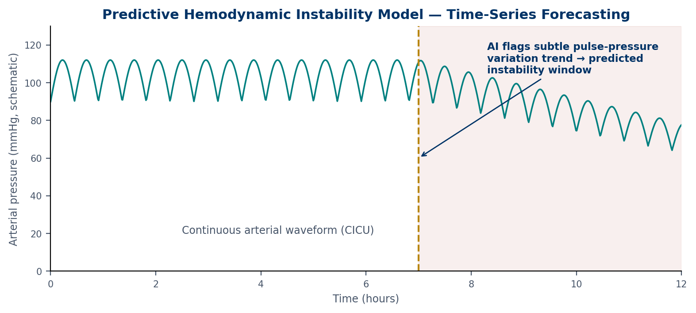
*Figure 9.1 — A schematic arterial pressure trace. A prediction model flags a subtle trend before blood pressure falls clearly. Illustrative, not real patient data.*

## 9.4 Closed-Loop Insulin Delivery
People with **type 1 diabetes** make no insulin and must replace it every day. A **closed-loop system**, sometimes called an artificial pancreas, links three parts: a continuous glucose monitor, a control algorithm and an insulin pump (Figure 9.2). The monitor measures glucose every few minutes. The algorithm predicts where glucose is heading and adjusts insulin delivery automatically. Users still announce meals.

In a six-month randomised trial in people with type 1 diabetes, closed-loop control increased the time spent in the target glucose range from 59% to 71% of the day, compared with a pump and sensor without automation [6].

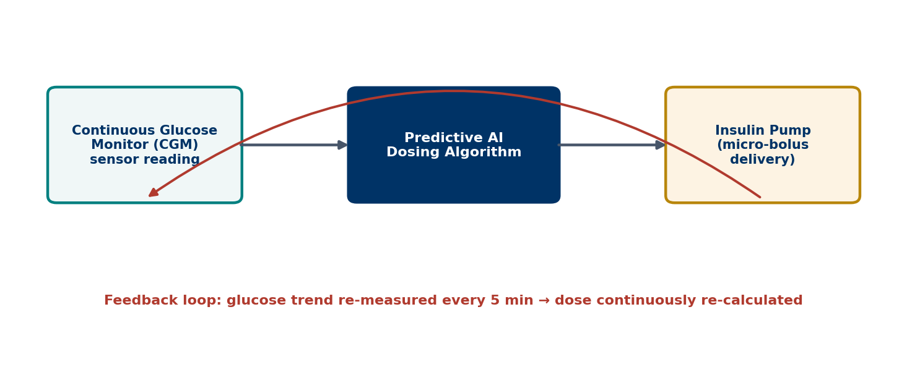
*Figure 9.2 — A continuous glucose monitor feeds a dosing algorithm, which adjusts an insulin pump in a feedback loop. Illustrative.*

Amal has type 2 diabetes and does not use insulin. This tool is not designed for her current treatment. Recognising who a tool is for is part of using it safely.

## 9.5 Population Health
Public health watches whole communities rather than individual patients. AI supports surveillance by scanning news reports, social media and health records for signs of outbreaks. HealthMap, for example, automatically collects and maps online reports of infectious disease from around the world [7].

Google Flu Trends offers an important lesson. In 2009, researchers showed that the number of flu-related web searches tracked official influenza reports closely [8]. For a few years, it seemed a fast, cheap way to track flu. Then it failed. In the 2012–2013 season, it predicted more than double the proportion of flu-like doctor visits reported by the national disease agency [9].

Why? The model had learned from search terms that happened to rise in winter. People's search behaviour and the search engine itself changed over time. Media coverage of flu also drove searches from healthy people. The model had no link to the biology of influenza. This is distribution shift and shortcut learning at a population scale (Chapter 3).

> **Deeper Dive:** Suppose a ward sees 3 true deteriorations per day and a model catches 2 of them. If it produces 2 false alerts per true alert, staff receive 2 + 4 = 6 alerts per day. Only 1 in 3 is real: a PPV of 33%. Doubling the model's sensitivity by lowering the threshold might catch all 3 events, but could triple the false alerts. Whether that is worth it depends on staffing and what each alert costs in time.

> **Through Four Lenses**
> - **Medicine:** Physicians should know each alert's PPV and lead time. A deterioration alert should prompt a bedside review, not an automatic treatment, and the review should be documented.
> - **Pharmacy:** Pharmacists can act on kidney-injury alerts by reviewing doses of kidney-cleared drugs and stopping harmful combinations. Early medicine review can prevent the injury the model predicts.
> - **Physical Therapy:** Physiotherapists can use monitoring data to time mobilisation safely. Falling blood pressure or rising oxygen needs may mean delaying exercise, while stable trends support earlier movement.
> - **Health Sciences:** Public-health officers should compare digital signals with laboratory-confirmed data. Nutrition and laboratory staff contribute the measurements that give surveillance models real biological meaning.

> **Myth vs Evidence:** Myth: "Big data can replace traditional disease surveillance." Evidence: Google Flu Trends at first tracked influenza well [8], but later more than doubled the true rate [9]. Digital signals help most when combined with laboratory-confirmed surveillance.

> **Safety Alert:** An alert is a prompt to look at the patient, not a diagnosis. And no alert does not mean no problem. If a patient looks unwell, act, whatever the screen says.

## Key Takeaways
- Early-warning scores are rule-based; machine-learning models use more inputs and update continuously.
- Earlier warnings come with more false alerts; alarm burden decides whether a model helps.
- AI-ECG has randomised-trial evidence of modest real-world benefit.
- Closed-loop insulin delivery improves glucose control in type 1 diabetes.
- Population-level AI can fail through distribution shift, as Google Flu Trends showed.

## Self-Assessment
**Q1.** NEWS2 adds points for vital signs such as breathing rate and pulse. What kind of system is it? [LO1]
A) A deep-learning model
B) A rule-based early warning score
C) A large language model
D) A closed-loop controller

**Q2.** A kidney-injury model predicts events up to 48 hours early but produces two false alerts for every true one. What is the main practical concern? [LO2]
A) The model cannot detect severe cases.
B) Its training data were too large.
C) It uses creatinine.
D) Staff workload and alarm fatigue from frequent false alerts

**Q3.** The AKI model in Q2 was trained on a cohort that was 93.6% male. What should a hospital do before using it for all patients? [LO2]
A) Check its performance in women and in its own patient population
B) Use it only at night
C) Use it without changes because the cohort was large
D) Remove creatinine from the inputs

**Q4.** In a pragmatic randomised trial, AI-ECG results given to primary-care teams increased the diagnosis of low ejection fraction from 1.6% to 2.1%. What is the best interpretation? [LO3]
A) The AI replaced echocardiography.
B) The AI had no effect.
C) The AI produced a real but modest benefit in routine care.
D) The AI caused heart failure.

**Q5.** An AI model finds atrial fibrillation risk from an ECG recorded during normal rhythm. What does this show? [LO3]
A) The ECG was faulty.
B) Deep learning can find ECG patterns that people cannot see.
C) Atrial fibrillation is not linked to stroke.
D) The model uses the patient's age only.

**Q6.** Which patient is the intended user of a closed-loop insulin system? [LO4]
A) A person with type 1 diabetes who uses insulin
B) Amal, who has type 2 diabetes treated with tablets
C) A person with high blood pressure only
D) A patient with a knee injury

**Q7.** In a six-month randomised trial, what did closed-loop insulin delivery improve? [LO4]
A) Blood pressure
B) Kidney function
C) Weight loss only
D) Time spent in the target glucose range

**Q8.** Why did Google Flu Trends eventually fail? [LO5]
A) Nobody searched for flu any more.
B) Laboratory tests stopped.
C) Search behaviour and media coverage changed, so the search–flu link shifted.
D) The model was too small.

**Q9.** A new app claims to track an outbreak from social-media posts. What is the best way to evaluate it? [LO5]
A) Compare its signal over time with laboratory-confirmed surveillance data
B) Count the number of posts it reads
C) Trust it if it uses deep learning
D) Check whether it has a colourful map

**Q10.** A ward receives 6 deterioration alerts per day, of which 2 are true. What is the PPV of these alerts? [LO1]
A) 12%
B) 66%
C) 50%
D) 33%

**Case Question.** The ward manager wants to switch off the deterioration alerts because "most are false". Write a short reply that explains the trade-off and proposes one change that could keep the benefit while reducing the burden.

## Answers and Rationales
**Q1. B** — NEWS2 adds points using fixed rules [10]. A, C and D are different technologies.

**Q2. D** — Frequent false alerts create workload and fatigue [3]. A is false; it detected most severe cases. B and C are not concerns.

**Q3. A** — A model trained mostly on men must be checked in women and in the local population. B, C and D do not address the problem.

**Q4. C** — The trial showed a real but modest increase in diagnosis [5]. A, B and D misread the result.

**Q5. B** — The model detects subtle patterns invisible to readers [4]. A, C and D are false.

**Q6. A** — Closed-loop systems are designed for insulin users with type 1 diabetes [6]. B, C and D are not the intended users.

**Q7. D** — Time in range rose from 59% to 71% [6]. A, B and C were not the main outcome.

**Q8. C** — Changing behaviour and media shifted the relationship the model relied on [9]. A, B and D are wrong.

**Q9. A** — Digital signals should be validated against confirmed surveillance data. B, C and D do not test accuracy.

**Q10. D** — 2 ÷ 6 = 33%. A, B and C are wrong calculations.

**Case Question — model answer.** "I understand the frustration, because false alerts take time from other patients. But the alerts also catch real deterioration early, as with Amal last week. Switching them off loses that benefit. Instead, we could review the threshold with the informatics team, so that fewer low-value alerts fire. We could also agree a quick two-minute bedside check for each alert, and track how many alerts per shift we receive and how many are real."

## References
1. Adams R, Henry KE, Sridharan A, et al. Prospective, multi-site study of patient outcomes after implementation of the TREWS machine learning-based early warning system for sepsis. Nat Med. 2022;28(7):1455-1460. DOI: 10.1038/s41591-022-01894-0
2. Wong A, Otles E, Donnelly JP, et al. External validation of a widely implemented proprietary sepsis prediction model in hospitalized patients. JAMA Intern Med. 2021;181(8):1065-1070. DOI: 10.1001/jamainternmed.2021.2626
3. Tomašev N, Glorot X, Rae JW, et al. A clinically applicable approach to continuous prediction of future acute kidney injury. Nature. 2019;572(7767):116-119. DOI: 10.1038/s41586-019-1390-1
4. Attia ZI, Noseworthy PA, Lopez-Jimenez F, et al. An artificial intelligence-enabled ECG algorithm for the identification of patients with atrial fibrillation during sinus rhythm: a retrospective analysis of outcome prediction. Lancet. 2019;394(10201):861-867. DOI: 10.1016/S0140-6736(19)31721-0
5. Yao X, Rushlow DR, Inselman JW, et al. Artificial intelligence-enabled electrocardiograms for identification of patients with low ejection fraction: a pragmatic, randomized clinical trial. Nat Med. 2021;27(5):815-819. DOI: 10.1038/s41591-021-01335-4
6. Brown SA, Kovatchev BP, Raghinaru D, et al. Six-month randomized, multicenter trial of closed-loop control in type 1 diabetes. N Engl J Med. 2019;381(18):1707-1717. DOI: 10.1056/NEJMoa1907863
7. Freifeld CC, Mandl KD, Reis BY, Brownstein JS. HealthMap: global infectious disease monitoring through automated classification and visualization of Internet media reports. J Am Med Inform Assoc. 2008;15(2):150-157. DOI: 10.1197/jamia.M2544
8. Ginsberg J, Mohebbi MH, Patel RS, et al. Detecting influenza epidemics using search engine query data. Nature. 2009;457(7232):1012-1014. DOI: 10.1038/nature07634
9. Lazer D, Kennedy R, King G, Vespignani A. The parable of Google Flu: traps in big data analysis. Science. 2014;343(6176):1203-1205. DOI: 10.1126/science.1248506
10. Royal College of Physicians. National Early Warning Score (NEWS) 2: standardising the assessment of acute-illness severity in the NHS. London: RCP; 2017. https://www.rcp.ac.uk/improving-care/resources/national-early-warning-score-news-2/

---

# Chapter 10: Bias, Fairness and Privacy

## Opening Case
The university's public-health team is planning a skin-cancer awareness campaign. The team leader proposes recommending a free skin-check app to all students. A team member mentions Lina's experience. The app flagged her mole, but its website shows almost no photos of dark skin. Would it work as well for her as for her lighter-skinned classmates?

Across town, Karim's employer offers workers a free fitness wristband "to support wellbeing". Karim's physiotherapist reads the terms. Step counts, heart rate and sleep data will be shared with the employer's insurance partner. Karim worries that his slower recovery could affect his job.

Both stories raise one question: who is protected by health AI, and who might be harmed by it? This chapter looks at bias, fairness and privacy.

## Learning Objectives
By the end of this chapter you will be able to:
1. [LO1] Identify where bias can enter the AI pipeline, from problem choice to deployment.
2. [LO2] Analyse the Obermeyer case and explain why the choice of label caused the bias.
3. [LO3] Distinguish anonymisation, pseudonymisation and de-identification, and explain re-identification risk.
4. [LO4] Describe privacy-preserving methods, including differential privacy and federated learning, and their limits.
5. [LO5] Compare the core principles of major data-protection laws, including Egypt's.

## 10.1 Where Bias Comes From
**Algorithmic bias** means that a model performs systematically worse, or makes systematically worse recommendations, for some groups. Bias can enter at every step.

- **Problem choice.** Which conditions get AI tools, and which communities are they designed for?
- **Data collection.** Who is in the dataset? Chapter 2 showed that famous datasets come from a few wealthy settings.
- **Labels.** What counts as the "right answer"? A proxy label can carry past inequality.
- **Model development.** Is performance reported for each group, or only on average?
- **Deployment.** Is the tool used in a population like the one it was tested in?
- **Feedback.** Do the tool's decisions shape the data used to train its next version?

Skin tone is a clear example. Dermatology datasets contain mostly light skin [4]. When models were tested on images balanced across skin tones, performance fell on darker skin [5]. For Lina, this is not abstract.

Bias can also hide inside images. A study of chest X-rays found that AI models underdiagnosed disease more often in female, Black, Hispanic and younger patients, and in patients with public insurance for low income [3]. Patients who already face barriers in care were more likely to be told they were healthy when they were not.

## 10.2 The Obermeyer Case: When the Label Is the Problem
A widely used US commercial algorithm selected patients for an extra-care programme [1]. It predicted which patients would need the most care. The developers used health-care cost as the label for health need. The algorithm did not use race as an input.

The researchers found that at the same risk score, Black patients were considerably sicker than white patients. The reason was the label. Because of unequal access to care, less money had been spent on Black patients with the same level of illness. The model learned correctly that they would cost less, and wrongly treated that as meaning they needed less.

When the researchers changed the label to direct measures of health, such as the number of active chronic conditions, the share of Black patients selected for extra help rose from 17.7% to 46.5% [1].

The lesson is often stated wrongly. Removing race from the inputs did not prevent bias here, because the model was already race-blind. The bias came from a label that reflected unequal access. The fix was to change what the model predicted.

Removing sensitive variables also fails for another reason. AI models can detect a patient's self-reported race from chest X-rays with high accuracy, even when images are blurred or cropped, and even though experts cannot see how [2]. A model can use information that no one intended it to use. "Fairness through blindness" is not a reliable strategy. Fairness needs measurement: report performance for each group, choose labels carefully and monitor after deployment.

> **Medical Background in 60 Seconds:** The **Fitzpatrick scale** classifies skin by how it reacts to sun, from type I (always burns, never tans) to type VI (deeply pigmented, rarely burns). Melanoma is less common in darker skin but is often diagnosed later, when outcomes are worse. It may also appear in less expected places, such as the palms, soles or nails.

## 10.3 Privacy: Identifiers and Re-Identification
Health data are among the most sensitive personal data. Removing names is not enough to protect them.

Three terms are often confused:

- **De-identification** removes or changes details that could identify a person. In the United States, the HIPAA "Safe Harbor" method lists 18 identifiers to remove, such as names, full dates and record numbers [11].
- **Pseudonymisation** replaces identifiers with a code. Someone who holds the key can re-link the data. Under European law, pseudonymised data are still personal data [10].
- **Anonymisation** makes re-identification impossible by reasonable means. True anonymisation is hard to achieve for rich health data.

The problem is **re-identification**. Combining a few ordinary facts can single a person out. Early work showed that ZIP code, birth date and sex together identify most US residents [8]. A later study estimated that 99.98% of Americans could be correctly re-identified in any dataset using 15 demographic attributes [6]. Wearable data are especially risky, because movement and sleep patterns are almost unique to each person.

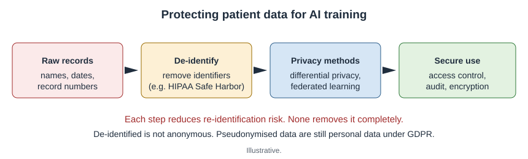
*Figure 10.1 — Raw records are de-identified, protected with privacy methods and stored securely. Each step reduces, but does not remove, re-identification risk. Illustrative.*

## 10.4 Privacy-Preserving Methods
**Differential privacy** adds carefully measured random noise to data or results. It gives a mathematical limit on how much anyone can learn about one individual [7]. The limit is controlled by a setting called epsilon (ε). A smaller ε means stronger privacy but less accurate results. Differential privacy is a tunable, bounded guarantee. It is not absolute protection.

**Federated learning** trains a model across several hospitals without moving patient data. Each hospital trains on its own data and shares only model updates. A central server combines the updates [9]. This reduces data transfer. But model updates can still leak some information, so federated learning is often combined with other protections.

## 10.5 The Law: Principles Across Countries
Laws differ, but share core principles: a lawful basis for processing, purpose limitation, data minimisation, security and rights for individuals.

- **GDPR** in the European Union treats health data as a special category needing extra protection [10]. It gives rights about automated decisions. Whether it creates a full "right to explanation" of AI decisions is debated among legal scholars [12].
- **HIPAA** in the United States sets rules for health providers and insurers, including the Safe Harbor de-identification standard [11].

> **Local Context:** Egypt's **Personal Data Protection Law** (Law No. 151 of 2020) treats health data as sensitive personal data. Processing it generally requires explicit written consent and stronger security. Executive regulations issued in 2025 set out detailed technical and procedural requirements [13].

For Karim, these principles matter directly. Wellness-programme data shared with an insurer may fall outside health-privacy rules that cover clinicians. He has the right to know how his data will be used before he agrees.

> **Through Four Lenses**
> - **Medicine:** Physicians should ask vendors for performance by sex, age, ethnicity and skin tone. An average accuracy figure can hide poor performance in exactly the patients who already face worse care.
> - **Pharmacy:** Pharmacists handle prescription and dispensing data that reveal diagnoses. Sharing them with apps or loyalty schemes needs clear consent, because a medicine list can identify a condition.
> - **Physical Therapy:** Physiotherapists should explain to patients like Karim what wearables record and who sees it. Movement and sleep data are highly personal and are hard to anonymise.
> - **Health Sciences:** Public-health officers should test tools in the community they serve before recommending them. A campaign app that fails on darker skin would widen, not narrow, health gaps.

> **Myth vs Evidence:** Myth: "If a model does not use race as an input, it cannot be racially biased." Evidence: The Obermeyer algorithm did not use race, yet it under-selected Black patients because its cost label reflected unequal access [1]. Models can also infer race from images [2].

> **Safety Alert:** Before recommending any AI tool to a group of patients, check whether it was tested in people like them. If there is no evidence, say so.

## Key Takeaways
- Bias can enter at problem choice, data, labels, development, deployment and feedback.
- In the Obermeyer case, a cost label carried unequal access into the model; changing the label fixed much of the bias.
- Removing sensitive variables does not guarantee fairness; measuring performance by group does.
- Re-identification is easy with combined details; pseudonymised data remain personal data.
- Differential privacy and federated learning reduce, but do not remove, privacy risk.

## Self-Assessment
**Q1.** A skin-check app was trained mostly on images of light skin. At which step did bias most likely enter? [LO1]
A) Deployment feedback
B) Legal review
C) Data collection
D) Model compression

**Q2.** In the Obermeyer case, why did Black patients with the same risk score have more illness than white patients? [LO2]
A) The label was health-care cost, which reflected unequal access to care.
B) Race was used as an input variable.
C) The dataset was too small.
D) The algorithm was a large language model.

**Q3.** A developer says, "We removed race from the inputs, so our imaging model is fair." What is the best reply? [LO2]
A) Correct; removing race guarantees fairness.
B) Fairness is not relevant in imaging.
C) Images cannot contain information about race.
D) Models can infer race from images, so fairness must be measured by group.

**Q4.** A research team replaces patient names with codes but keeps a key file linking codes to names. What is this called? [LO3]
A) Anonymisation
B) Pseudonymisation
C) Differential privacy
D) Federated learning

**Q5.** Why is wearable movement data difficult to anonymise? [LO3]
A) It is always stored on paper.
B) It contains no personal information.
C) Movement and sleep patterns are almost unique to each person.
D) It is protected by default.

**Q6.** A hospital adds random noise to a dataset release, with a setting ε that controls privacy strength. What is true of this method? [LO4]
A) It gives a bounded, tunable guarantee; smaller ε gives stronger privacy but less accuracy.
B) It guarantees that no information about anyone can ever be learned.
C) It removes the need for consent.
D) It is the same as pseudonymisation.

**Q7.** Five hospitals train a shared model, each on its own data, sending only model updates to a central server. What is this approach? [LO4]
A) Retrieval-augmented generation
B) Pseudonymisation
C) Reinforcement learning
D) Federated learning

**Q8.** Under Egypt's Personal Data Protection Law, how is health data treated? [LO5]
A) As public data that anyone may use
B) As sensitive data, generally requiring explicit written consent and stronger security
C) As exempt from any protection
D) As data only employers can process

**Q9.** Under GDPR, what is the status of pseudonymised health data? [LO5]
A) It is still personal data.
B) It is fully anonymous.
C) It is not covered by the law.
D) It can be sold freely.

**Q10.** In a chest X-ray study, AI underdiagnosed disease more often in which patients? [LO1]
A) Only in older white men
B) Equally in all groups
C) In female, Black, Hispanic and younger patients, and those with low-income public insurance
D) Only in patients with rare diseases

**Case Question.** Karim asks you whether he should accept the employer's free wristband. Write a short, balanced answer that explains the privacy risks, the questions he should ask, and what he can do if he is unsure.

## Answers and Rationales
**Q1. C** — The training images under-represented dark skin, so bias entered during data collection [4, 5]. A, B and D are not where this bias began.

**Q2. A** — Cost reflected unequal access, so equally sick Black patients looked less needy [1]. B is false; race was not an input. C and D are wrong.

**Q3. D** — Race can be detected from images [2], so removing it does not prevent bias. A, B and C are false.

**Q4. B** — Codes with a linking key are pseudonymisation. A makes re-linking impossible. C adds noise. D trains across sites.

**Q5. C** — Unique behavioural patterns allow re-identification [6]. A, B and D are false.

**Q6. A** — Differential privacy is a tunable, bounded guarantee [7]. B overstates it. C and D are wrong.

**Q7. D** — Training locally and sharing updates is federated learning [9]. A, B and C are different methods.

**Q8. B** — Health data are sensitive under Law No. 151 of 2020, generally requiring explicit written consent [13]. A, C and D are wrong.

**Q9. A** — Pseudonymised data remain personal data under GDPR [10]. B, C and D are wrong.

**Q10. C** — Underdiagnosis was greater in these groups [3]. A, B and D do not match the findings.

**Case Question — model answer.** "A free wristband can help you track your activity, but the terms say your steps, heart rate and sleep will be shared with an insurance partner. That data can reveal a lot about your health and recovery, and it is hard to make anonymous. Before agreeing, ask who will see the data, what it will be used for, how long it is kept and whether you can withdraw. You can also ask whether saying no affects your job or benefits. If the answers are unclear, you can decline, or use a device that keeps data only on your own phone."

## References
1. Obermeyer Z, Powers B, Vogeli C, Mullainathan S. Dissecting racial bias in an algorithm used to manage the health of populations. Science. 2019;366(6464):447-453. DOI: 10.1126/science.aax2342
2. Gichoya JW, Banerjee I, Bhimireddy AR, et al. AI recognition of patient race in medical imaging: a modelling study. Lancet Digit Health. 2022;4(6):e406-e414. DOI: 10.1016/s2589-7500(22)00063-2
3. Seyyed-Kalantari L, Zhang H, McDermott MBA, Chen IY, Ghassemi M. Underdiagnosis bias of artificial intelligence algorithms applied to chest radiographs in under-served patient populations. Nat Med. 2021;27(12):2176-2182. DOI: 10.1038/s41591-021-01595-0
4. Adamson AS, Smith A. Machine learning and health care disparities in dermatology. JAMA Dermatol. 2018;154(11):1247-1248. DOI: 10.1001/jamadermatol.2018.2348
5. Daneshjou R, Vodrahalli K, Novoa RA, et al. Disparities in dermatology AI performance on a diverse, curated clinical image set. Sci Adv. 2022;8(32):eabq6147. DOI: 10.1126/sciadv.abq6147
6. Rocher L, Hendrickx JM, de Montjoye YA. Estimating the success of re-identifications in incomplete datasets using generative models. Nat Commun. 2019;10:3069. DOI: 10.1038/s41467-019-10933-3
7. Dwork C, McSherry F, Nissim K, Smith A. Calibrating noise to sensitivity in private data analysis. In: Theory of Cryptography. Lecture Notes in Computer Science. Springer; 2006:265-284. DOI: 10.1007/11681878_14
8. Sweeney L. k-anonymity: a model for protecting privacy. Int J Uncertain Fuzziness Knowl Based Syst. 2002;10(05):557-570. DOI: 10.1142/s0218488502001648
9. Rieke N, Hancox J, Li W, et al. The future of digital health with federated learning. NPJ Digit Med. 2020;3:119. DOI: 10.1038/s41746-020-00323-1
10. European Parliament and Council. Regulation (EU) 2016/679 (General Data Protection Regulation). Off J Eur Union. 2016;L119:1-88. https://eur-lex.europa.eu/eli/reg/2016/679/oj
11. US Department of Health and Human Services. Guidance regarding methods for de-identification of protected health information in accordance with the HIPAA Privacy Rule (45 CFR 164.514). 2012. https://www.hhs.gov/hipaa/for-professionals/special-topics/de-identification/index.html
12. Wachter S, Mittelstadt B, Floridi L. Why a right to explanation of automated decision-making does not exist in the General Data Protection Regulation. Int Data Priv Law. 2017;7(2):76-99. DOI: 10.1093/idpl/ipx005
13. Arab Republic of Egypt. Law No. 151 of 2020 promulgating the Personal Data Protection Law. Official Gazette; 2020. https://mcit.gov.eg/Upcont/Documents/Reports%20and%20Documents_1232021000_Law_No_151_2020_Personal_Data_Protection.pdf

---

# Chapter 11: Regulation, Liability and the Human in the Loop

## Opening Case
Two weeks after her hospital stay, Amal is readmitted with a fever. The hospital's sepsis model gives her a "low risk" score. It is a busy night. A junior doctor sees the score, notes that her vital signs are "borderline" and plans to review her in the morning. By morning, Amal has septic shock and needs intensive care. She survives.

Her family asks hard questions. The model was approved and bought by the hospital. The doctor followed its score. The vendor says the tool is "decision support only". Who is responsible when care guided by AI goes wrong? Who checked the tool before it reached the ward? And why did a trained doctor accept a number that did not fit what she saw? This chapter answers these questions.

## Learning Objectives
By the end of this chapter you will be able to:
1. [LO1] Explain software as a medical device and risk-based classification.
2. [LO2] Distinguish FDA 510(k), De Novo, premarket approval and predetermined change control plans.
3. [LO3] Describe the EU AI Act's obligations for high-risk medical AI and how they relate to the MDR and IVDR.
4. [LO4] Apply the elements of negligence to an AI-assisted case and explain the learned intermediary doctrine correctly.
5. [LO5] Explain automation bias, de-skilling and the limits of explainable AI, and propose countermeasures.

## 11.1 When Software Is a Medical Device
Software that is intended to diagnose, prevent, monitor or treat disease can be a medical device, even without any hardware. This is called **software as a medical device** (SaMD). A retinal screening system, a sepsis prediction model and a dosing calculator can all be SaMD. A hospital rota app is not.

Regulators classify SaMD by risk. An international framework considers two questions [1]. How important is the software's information: does it treat or diagnose, drive clinical management, or only inform it? And how serious is the patient's condition: critical, serious or non-serious? Software that diagnoses a critical condition carries the highest risk and faces the strictest review.

> **Medical Background in 60 Seconds:** A **medical device** is any instrument, machine, implant or software used for a medical purpose, from a thermometer to an MRI scanner. Regulators check that its benefits outweigh its risks before it is sold, and keep monitoring it afterwards. **Septic shock** is the most severe stage of sepsis, when blood pressure stays dangerously low despite fluids, and drugs are needed to support it.

## 11.2 The United States: FDA Pathways
The US Food and Drug Administration (FDA) uses three main routes to market.

- **510(k) clearance.** The maker shows that the device is "substantially equivalent" to one already on the market, called a predicate. Most AI devices reach the market this way.
- **De Novo classification.** For new, low-to-moderate-risk devices with no predicate. The autonomous retinal screening system took this route (Chapter 6).
- **Premarket approval** (PMA). For high-risk devices. It requires the strongest evidence, usually clinical studies.

Clearance does not always mean strong evidence. An analysis of FDA-cleared AI devices found that most were evaluated only on retrospective data, and many at only one or two sites [15]. Approvals in the USA and Europe rose sharply between 2015 and 2020, often with limited public detail on the evidence [14].

AI models can be updated. A traditional approval covers one fixed version. The FDA now allows a **predetermined change control plan** (PCCP). The maker states in advance what changes it plans, how it will develop and test them, and how it will assess their impact. Changes made within an authorised plan do not need a new submission. The FDA issued final guidance on PCCPs for AI-enabled devices in December 2024 [2]. Earlier, the FDA and the UK and Canadian regulators agreed ten principles of **good machine learning practice**, covering data quality, testing, human factors and monitoring [3].

## 11.3 Europe: The MDR, IVDR and the AI Act
In the European Union, medical devices are regulated by the **Medical Device Regulation** (MDR) [5]. Laboratory tests, including software that analyses samples, fall under the **In Vitro Diagnostic Regulation** (IVDR) [6]. Most diagnostic or monitoring software is classed at least as moderate risk and needs review by an independent **notified body** before it can carry the CE mark.

The **EU AI Act** (Regulation 2024/1689) is the first broad law on AI [4]. It entered into force in August 2024 and applies in stages. AI systems that are medical devices needing notified-body review count as **high-risk AI**. Obligations for these systems are scheduled to apply from August 2027. They include:

- a risk-management system across the product's life;
- data governance, including checks for bias in training data;
- technical documentation and automatic logging of use;
- transparency and clear instructions for users;
- human oversight built into the design;
- accuracy, robustness and cybersecurity.

The AI Act adds to the MDR and IVDR; it does not replace them. Makers can cover both in one assessment.

The World Health Organization's guidance sets six principles for AI in health: protect autonomy, promote well-being and safety, ensure transparency, foster responsibility and accountability, ensure inclusiveness and equity, and promote AI that is responsive and sustainable [7].

> **Local Context:** In Egypt, medical devices are regulated by the **Egyptian Drug Authority**, established by Law No. 151 of 2019. The law's definition of a medical device includes software intended for diagnosis, prevention, monitoring or treatment [16]. AI tools used in Egyptian care therefore fall within device regulation, alongside the data-protection rules in Chapter 10.

*Figure 11.1 — AI medical software moves from development and validation, through regulatory review, to deployment and post-market monitoring. Planned updates can be managed through a predetermined change control plan. Illustrative.*

## 11.4 Liability: Who Is Responsible?
**Negligence** is the legal basis of most malpractice claims. A patient must show four elements:

1. **Duty.** The professional owed the patient care.
2. **Breach.** The care fell below the accepted **standard of care**.
3. **Causation.** The breach caused the harm.
4. **Damages.** Real harm occurred.

AI complicates the second element. What is the standard of care when an AI tool is available? Legal scholars suggest that, today, clinicians are generally safest when they follow standard care [8]. Risk rises when a clinician follows an AI recommendation that departs from standard care and harm results. As AI becomes standard, the reverse may also become true: ignoring a well-validated tool could one day be a breach.

Responsibility is usually shared (Figure 11.2). The clinician is responsible for clinical judgment. The hospital is responsible for choosing, validating, training staff on and monitoring the tool. The maker is responsible for the product's design, testing and warnings.

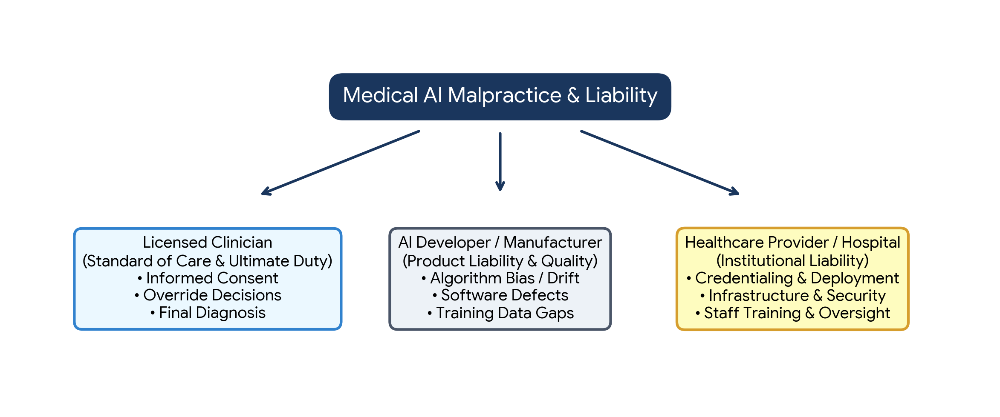
*Figure 11.2 — Responsibility for AI-assisted care is shared between the licensed clinician, the developer or manufacturer, and the healthcare institution. Illustrative.*

The **learned intermediary doctrine** is often misunderstood. It comes from product-liability law for medicines and devices. A manufacturer usually meets its duty to warn about risks by warning the prescribing clinician, rather than each patient. The clinician, as a trained intermediary, then advises the patient. The doctrine limits the manufacturer's duty to warn patients directly. It is not a shield for clinicians, and it does not make the clinician automatically liable for every product defect.

## 11.5 The Human in the Loop
Amal's doctor was not careless by nature. She showed **automation bias** (Chapter 1). A systematic review found that automation bias is common, and that errors happen both when people follow a wrong suggestion and when they miss a problem because the system did not flag it [9]. Busy shifts, high trust in the system and low experience make it worse.

**De-skilling** is a longer-term risk. In a multicentre study of colonoscopy, doctors who had become used to AI support detected fewer precancerous growths when they later worked without it [10]. Skills that are not practised can fade.

Many people hope that **explainable AI** (XAI) will solve these problems. XAI methods, such as heatmaps, show which parts of an input influenced a model's output. But a heatmap shows where the model looked, not whether its reasoning was sound. Tests have shown that some heatmap methods produce similar maps even from models with random parameters [11]. Explanations can make people trust a wrong answer more [12]. For high-stakes decisions, some experts argue for models that are interpretable by design [13].

Countermeasures work at several levels:

- **Design.** Show uncertainty, not just a single score. Avoid labels like "low risk" that invite people to stop thinking.
- **Workflow.** Make the clinician record their own assessment before seeing the AI output, where possible.
- **Training.** Teach staff each tool's known failure modes and its PPV at the local threshold.
- **Culture.** Make it normal to override AI when the patient does not fit, and to report every mismatch.
- **Monitoring.** Track performance after deployment, because models drift as data change (Chapter 3).

## 11.6 Looking Ahead: Roles Change, Professions Remain
AI will change the daily work of every health profession. Physicians will spend less time on documentation and more on judgment. Pharmacists will manage smarter alerts and lead precision dosing. Physiotherapists will supervise home programmes with objective movement data. Laboratory, imaging and public-health professionals will run the quality systems that keep AI honest.

What AI cannot do is sit with a frightened patient, weigh values that data do not capture, or take responsibility. These remain human tasks, and they are the core of every health profession.

> **Through Four Lenses**
> - **Medicine:** Physicians remain responsible for clinical judgment. When a score conflicts with the examination, document the conflict, act on the patient's condition and report the case for review.
> - **Pharmacy:** Pharmacists should check whether a dosing or interaction tool is a regulated device, and whether it has been validated locally. Unregulated calculators used for patient decisions carry extra risk.
> - **Physical Therapy:** Physiotherapists using movement apps should know whether the app is a medical device or a wellness product. Wellness apps may not meet clinical standards for assessment.
> - **Health Sciences:** Laboratory and imaging professionals often run post-market monitoring in practice. Logging errors, drift and equipment changes provides the evidence regulators and institutions need.

> **Myth vs Evidence:** Myth: "If a tool is FDA-cleared, it has been proven in clinical trials." Evidence: Most AI devices are cleared through 510(k), and most cleared AI devices were evaluated on retrospective data only, often at few sites [15].

> **Safety Alert:** A "low risk" score never overrides your assessment of a patient who looks unwell. Act on the patient, record your reasoning and report the mismatch.

## Key Takeaways
- Software that diagnoses, monitors or treats can be a medical device, classified by risk.
- FDA routes include 510(k), De Novo and PMA; PCCPs allow planned updates to AI devices.
- The EU AI Act adds high-risk AI obligations to the MDR and IVDR, including human oversight and data governance.
- Liability is usually shared; the learned intermediary doctrine limits manufacturers' duty to warn patients directly and is not a clinician shield.
- Automation bias, de-skilling and over-trust in explanations are human risks that need design, training and culture to manage.

## Self-Assessment
**Q1.** Which of these is most likely to be software as a medical device? [LO1]
A) A hospital staff-rota app
B) Software that analyses ECGs to detect atrial fibrillation
C) A spreadsheet of canteen menus
D) A library catalogue

**Q2.** A company develops a new AI tool with no similar device on the US market. It carries low-to-moderate risk. Which FDA route fits best? [LO2]
A) 510(k) clearance
B) Premarket approval only
C) No review is needed
D) De Novo classification

**Q3.** What does a predetermined change control plan allow? [LO2]
A) Planned, pre-specified model updates without a new submission for each change
B) Unlimited changes without any testing
C) Skipping clinical validation for the first version
D) Selling the device without a label

**Q4.** Under the EU AI Act, how is an AI system that is a medical device needing notified-body review classified? [LO3]
A) Minimal-risk AI
B) Banned AI
C) High-risk AI
D) General-purpose AI only

**Q5.** Which is an obligation for high-risk AI under the EU AI Act? [LO3]
A) Human oversight built into the design
B) Removing all documentation
C) Using only unsupervised learning
D) Avoiding logging of use

**Q6.** A clinician follows an AI recommendation that departs from standard care, and the patient is harmed. According to legal scholars, how does this compare with following standard care? [LO4]
A) It lowers the clinician's legal risk.
B) It raises the clinician's legal risk.
C) It has no legal effect.
D) It transfers all responsibility to the patient.

**Q7.** What does the learned intermediary doctrine say? [LO4]
A) Clinicians are always liable for product defects.
B) AI developers can never be sued.
C) Patients must read all device manuals themselves.
D) A manufacturer usually meets its duty to warn by warning the prescribing clinician.

**Q8.** Amal's doctor accepted a "low risk" sepsis score despite borderline vital signs. What is this an example of? [LO5]
A) De-skilling
B) Differential privacy
C) Automation bias
D) Federated learning

**Q9.** A saliency heatmap highlights part of a chest X-ray. What can it reliably tell the clinician? [LO5]
A) That the model's reasoning is correct
B) Which image regions influenced the output, not whether the reasoning was valid
C) The patient's diagnosis
D) That the model is calibrated

**Q10.** Doctors who became used to AI in colonoscopy later detected fewer precancerous growths without it. What does this show? [LO5]
A) De-skilling
B) Data leakage
C) Distribution shift in the model
D) Better training

**Case Question.** Using the four elements of negligence, analyse Amal's case in the opening. Then suggest two changes the hospital could make to reduce the chance of the same event happening again.

## Answers and Rationales
**Q1. B** — ECG analysis for diagnosis has a medical purpose [1]. A, C and D do not.

**Q2. D** — De Novo is for new low-to-moderate-risk devices without a predicate. A needs a predicate. B is for high risk. C is wrong.

**Q3. A** — A PCCP pre-specifies changes and their testing [2]. B, C and D are false.

**Q4. C** — Medical-device AI needing notified-body review is high-risk under the AI Act [4]. A, B and D are wrong.

**Q5. A** — Human oversight is a core high-risk obligation [4]. B, C and D contradict the Act.

**Q6. B** — Following AI away from standard care into harm raises risk [8]. A, C and D are wrong.

**Q7. D** — The doctrine concerns the manufacturer's duty to warn through the clinician. A and B misstate it. C is the opposite.

**Q8. C** — Accepting an automated output despite conflicting evidence is automation bias [9]. A is long-term skill loss. B and D are privacy methods.

**Q9. B** — Heatmaps show influence, not correctness [11, 12]. A, C and D overstate them.

**Q10. A** — Skill declined after reliance on AI [10]. B, C and D are unrelated.

**Case Question — model answer.** Duty: the doctor and hospital owed Amal care. Breach: accepting a "low risk" score despite borderline signs, and delaying review, may fall below the standard of care, which requires assessing the patient. Causation: the delay plausibly contributed to septic shock. Damages: she needed intensive care. Responsibility may be shared: the hospital chose and deployed the tool, and should have trained staff on its limits. Two changes: display the model's uncertainty and remove the reassuring "low risk" label, and require a bedside review for any patient with abnormal vital signs regardless of the score.

## References
1. International Medical Device Regulators Forum. "Software as a Medical Device": possible framework for risk categorization and corresponding considerations. IMDRF/SaMD WG/N12FINAL. 2014. https://www.imdrf.org/documents/software-medical-device-possible-framework-risk-categorization-and-corresponding-considerations
2. US Food and Drug Administration. Marketing submission recommendations for a predetermined change control plan for artificial intelligence-enabled device software functions: final guidance. December 2024. https://www.fda.gov/regulatory-information/search-fda-guidance-documents/marketing-submission-recommendations-predetermined-change-control-plan-artificial-intelligence
3. US Food and Drug Administration, Health Canada, UK Medicines and Healthcare products Regulatory Agency. Good machine learning practice for medical device development: guiding principles. 2021. https://www.fda.gov/medical-devices/software-medical-device-samd/good-machine-learning-practice-medical-device-development-guiding-principles
4. European Parliament and Council. Regulation (EU) 2024/1689 laying down harmonised rules on artificial intelligence (Artificial Intelligence Act). Off J Eur Union. 2024. https://eur-lex.europa.eu/eli/reg/2024/1689/oj
5. European Parliament and Council. Regulation (EU) 2017/745 on medical devices. Off J Eur Union. 2017;L117:1-175. https://eur-lex.europa.eu/eli/reg/2017/745/oj
6. European Parliament and Council. Regulation (EU) 2017/746 on in vitro diagnostic medical devices. Off J Eur Union. 2017;L117:176-332. https://eur-lex.europa.eu/eli/reg/2017/746/oj
7. World Health Organization. Ethics and governance of artificial intelligence for health: WHO guidance. Geneva: WHO; 2021. https://www.who.int/publications/i/item/9789240029200
8. Price WN, Gerke S, Cohen IG. Potential liability for physicians using artificial intelligence. JAMA. 2019;322(18):1765-1766. DOI: 10.1001/jama.2019.15064
9. Goddard K, Roudsari A, Wyatt JC. Automation bias: a systematic review of frequency, effect mediators, and mitigators. J Am Med Inform Assoc. 2012;19(1):121-127. DOI: 10.1136/amiajnl-2011-000089
10. Budzyń K, Romańczyk M, Kitala D, et al. Endoscopist deskilling risk after exposure to artificial intelligence in colonoscopy: a multicentre, observational study. Lancet Gastroenterol Hepatol. 2025;10(10):896-903. DOI: 10.1016/S2468-1253(25)00133-5
11. Adebayo J, Gilmer J, Muelly M, et al. Sanity checks for saliency maps. In: Advances in Neural Information Processing Systems 31. 2018. https://arxiv.org/abs/1810.03292
12. Ghassemi M, Oakden-Rayner L, Beam AL. The false hope of current approaches to explainable artificial intelligence in health care. Lancet Digit Health. 2021;3(11):e745-e750. DOI: 10.1016/S2589-7500(21)00208-9
13. Rudin C. Stop explaining black box machine learning models for high stakes decisions and use interpretable models instead. Nat Mach Intell. 2019;1(5):206-215. DOI: 10.1038/s42256-019-0048-x
14. Muehlematter UJ, Daniore P, Vokinger KN. Approval of artificial intelligence and machine learning-based medical devices in the USA and Europe (2015-20): a comparative analysis. Lancet Digit Health. 2021;3(3):e195-e203. DOI: 10.1016/S2589-7500(20)30292-2
15. Wu E, Wu K, Daneshjou R, et al. How medical AI devices are evaluated: limitations and recommendations from an analysis of FDA approvals. Nat Med. 2021;27(4):582-584. DOI: 10.1038/s41591-021-01312-x
16. Arab Republic of Egypt. Law No. 151 of 2019 on the establishment of the Egyptian Drug Authority. Official Gazette No. 34 bis (A); 2019. https://www.eastlaws.com/legislation-full-text/en/egypt/law/25-08-2019/no-151?type=1&id=4747464

---

# Glossary

**Academic integrity** — Honesty in study and assessment, including acknowledging when AI tools were used and not presenting their output as one's own work.

**Accuracy** — The share of all cases a model classifies correctly; misleading when a condition is rare.

**Acute kidney injury** — A rapid fall in kidney function over hours or days, usually detected by a rising creatinine (AKI).

**Adversarial attack** — A small, deliberate change to an input, often invisible to people, crafted to make a specific model give a wrong output.

**Alarm fatigue** — Reduced response to monitoring alarms and alerts after exposure to many false or low-value ones.

**Alert fatigue** — Declining attention to computer alerts after seeing many, often low-value, alerts; leads to important alerts being overridden.

**Algorithmic bias** — Systematically worse performance or recommendations from a model for some groups of people.

**Ambient scribe** — An AI system that listens, with consent, to a consultation and drafts the clinical note for the clinician to review.

**Anonymisation** — Processing data so that individuals can no longer be identified by any reasonable means; hard to achieve for rich health data.

**Anterior cruciate ligament** — A ligament inside the knee that stops the shin bone sliding forward and helps the knee resist twisting (ACL).

**Area under the concentration–time curve** — The total exposure of the body to a drug over a period, used to guide doses of drugs such as vancomycin (AUC).

**Area under the precision–recall curve** — A summary of how precision (PPV) and recall (sensitivity) trade off across thresholds; more informative than AUROC for rare conditions (AUPRC).

**Area under the ROC curve** — The probability that a model scores a random patient with the condition higher than a random patient without it; ranges from 0.5 (chance) to 1.0 (perfect) (AUROC, C-statistic).

**Artificial intelligence** — The broad goal of building computer systems that perform tasks linked with human thinking, such as recognising images, understanding language and predicting outcomes.

**Automation bias** — The tendency to accept a computer's output even when other evidence or one's own judgment disagrees.

**Bias** — A systematic error that makes a model perform better or worse for some groups, settings or cases than others.

**Biopsy** — A small sample of tissue removed for examination under a microscope.

**Calibration** — How closely a model's predicted risks match observed event rates; a calibrated "20% risk" means about 20 in 100 similar patients have the event.

**Class imbalance** — A situation in which one outcome is much rarer than another in the data, such as cancer in screening images.

**Clinical decision support** — Software that gives a health professional advice at the moment of a decision, such as drug-interaction warnings or abnormal-result alerts.

**Closed-loop system** — A system that measures a value, such as glucose, and automatically adjusts treatment, such as insulin, in a continuous feedback loop.

**Computer-aided detection** — Imaging AI that marks where a possible finding is, leaving interpretation to the reader (CADe).

**Computer-aided diagnosis** — Imaging AI that characterises a finding, for example as likely malignant or benign (CADx).

**Computer-aided triage** — Imaging AI that reorders the reading list so suspected urgent cases are read first (CADt).

**Confusion matrix** — A 2 × 2 table comparing a model's positive and negative outputs with the true condition.

**Convolutional neural network** — A neural network designed for images; early layers detect edges and textures, later layers detect shapes (CNN).

**CT** — Computed tomography: an imaging method that combines many X-ray views into cross-sectional slices.

**Data leakage** — Information that would not be available in real use reaching the training or testing of a model, making it look better than it is.

**De-identification** — Removing or altering details that could identify a person, such as the 18 identifiers of the US HIPAA Safe Harbor method.

**De-skilling** — Loss of a professional skill that is no longer practised because a tool performs it.

**Deep learning** — Machine learning with neural networks of many layers, able to learn complex features from images, sound and text.

**Diagnostic test** — A test used when symptoms or signs already raise suspicion of a condition.

**Dice coefficient** — An overlap measure between a model's outline and the true outline: twice the overlap divided by the total size of both; 0 to 1.

**DICOM** — The international standard for storing and exchanging medical images together with their metadata.

**Differential privacy** — A method that adds measured random noise to data or results, giving a mathematical, tunable limit (set by ε) on what can be learned about any one person.

**Digital pathology** — Scanning glass slides into digital images for viewing and analysis on a computer.

**Discrimination** — A model's ability to rank patients, giving higher scores to those with the condition.

**Distribution shift** — A difference between the data a model was trained on and the data it meets in use, such as new patients, machines or practices.

**Drug interaction** — A change in the effect of a medicine caused by another medicine, food or supplement.

**Drug target** — A molecule in the body, usually a protein, that a medicine is designed to act on.

**Early warning score** — A rule-based score that adds points for abnormal vital signs to flag patients at risk of deterioration, such as NEWS2.

**Egyptian Drug Authority** — The Egyptian regulator for medicines and medical devices, including medical software, established by Law No. 151 of 2019 (EDA).

**Electrocardiogram** — A recording of the heart's electrical activity (ECG).

**Electronic health record** — The digital version of a patient's chart, holding diagnoses, medicines, results, notes and appointments.

**EU AI Act** — Regulation (EU) 2024/1689, the European Union's law on artificial intelligence, which sets obligations for high-risk AI systems, including many medical devices.

**Explainable AI** — Methods that show which inputs influenced a model's output, such as heatmaps; they show where a model looked, not whether it reasoned correctly (XAI).

**External validation** — Testing a model on data from a different hospital, time period or population from the one used to develop it.

**Federated learning** — Training a shared model across several sites, each using its own data and sending only model updates, so raw patient data do not move.

**Fitzpatrick scale** — A classification of skin types from I (always burns) to VI (deeply pigmented, rarely burns).

**Gait cycle** — The sequence of movements from one heel strike to the next heel strike of the same foot, with stance and swing phases.

**GDPR** — The European Union's General Data Protection Regulation, which treats health data as a special category needing extra protection.

**Generative AI** — AI that produces new content such as text, images or code.

**Good machine learning practice** — Ten guiding principles agreed by US, Canadian and UK regulators for developing medical AI (GMLP).

**Gradient descent** — The training method that repeatedly nudges a model's parameters in the direction that reduces its loss.

**Haemolysis** — Breakdown of red blood cells in a sample, which releases their contents and can distort results such as potassium.

**Hallucination** — Fluent output from a generative model that is false or unsupported, such as an invented drug dose or reference.

**Haptic boundary** — A software limit that stops a robotic tool from moving outside a planned zone, used for example in joint-replacement surgery.

**Heatmap** — A colour overlay showing which regions of an image contributed most to a model's output.

**High-risk AI** — Under the EU AI Act, AI systems with significant potential to harm health, safety or rights, such as medical devices needing notified-body review.

**HIPAA** — The US Health Insurance Portability and Accountability Act, whose Privacy Rule governs health information held by providers and insurers.

**Icterus** — High bilirubin in a sample, giving it a yellow colour that can interfere with some tests.

**In Vitro Diagnostic Regulation** — The EU regulation for laboratory tests and related software (IVDR, Regulation 2017/746).

**Inertial measurement unit** — A sensor combining an accelerometer and a gyroscope that records acceleration and rotation; found in most wearables (IMU).

**Internal validation** — Testing a model on a held-out part of the same dataset used to develop it.

**Interoperability** — The ability of different health information systems to exchange data and use it correctly.

**Intersection over union** — An overlap measure: the shared area of two outlines divided by their combined area; 0 to 1 (IoU).

**Label** — The correct answer attached to a training example, such as "pneumonia present" for a chest X-ray.

**Label noise** — Errors in the labels a model is trained on; the model learns these errors too.

**Large language model** — A generative model trained on very large amounts of text to predict the next word; the engine behind chatbots.

**Leader–follower telemanipulation** — A robotic surgery set-up in which the surgeon's hand movements at a console lead and the robot's instruments follow.

**Learned intermediary doctrine** — A product-liability rule under which a manufacturer usually meets its duty to warn about risks by warning the prescribing clinician rather than each patient.

**Lipaemia** — High fat content in a sample, making it cloudy and able to interfere with some tests.

**Loss function** — A formula that measures how wrong a model's predictions are during training.

**Machine learning** — A way of building AI in which the computer learns patterns from example data instead of following hand-written rules.

**Medical device** — Any instrument, machine, implant or software intended for a medical purpose, such as diagnosis, monitoring or treatment.

**Medical Device Regulation** — The EU regulation for medical devices, including most medical software (MDR, Regulation 2017/745).

**Metadata** — Data about data, such as the scanner model, hospital and date stored with a medical image.

**Model** — The mathematical function produced by machine learning that turns an input (for example, an image) into an output (for example, a risk score).

**Model-informed precision dosing** — Dosing that combines a pharmacokinetic model with an individual patient's drug levels and characteristics to recommend a dose (MIPD).

**Motion scaling** — A robotic feature that turns a large hand movement into a smaller, more precise instrument movement.

**MRI** — Magnetic resonance imaging: an imaging method using a strong magnet and radio waves, good for soft tissues and free of ionising radiation.

**Negative predictive value** — The share of negative results that are truly negative (NPV).

**Negligence** — Failure to meet the expected standard of care, causing harm; requires duty, breach, causation and damages.

**Neural network** — A model made of layers of simple connected units whose connection strengths are adjusted during training.

**Notified body** — An independent organisation designated in the EU to assess whether a medical device meets legal requirements.

**Objective Structured Assessment of Technical Skills** — A validated rating scale for surgical technical skill (OSATS).

**Oculomics** — Research using eye images, such as retinal photographs, to detect signs of disease elsewhere in the body.

**Omics** — Data describing molecules in the body, such as genomics (DNA) and pharmacogenomics (genes affecting drug response).

**Overfitting** — When a model learns the quirks and noise of its training data so closely that it performs poorly on new data.

**Parameter** — One of the adjustable numbers inside a model that training changes.

**Personal Data Protection Law** — Egypt's Law No. 151 of 2020, which treats health data as sensitive personal data requiring explicit consent and stronger security.

**Pharmacogenomics** — The study of how a person's genes affect their response to medicines.

**Pharmacovigilance** — The monitoring of medicines after approval to detect, assess and prevent adverse effects.

**Pose estimation** — A computer-vision task that locates body key points, such as joints, in images or video.

**Positive predictive value** — The share of positive results that are truly positive; depends strongly on prevalence (PPV, precision).

**Predetermined change control plan** — A plan, authorised by the FDA in advance, describing the changes a maker may make to an AI device and how they will be tested (PCCP).

**Premarket approval** — The FDA's most demanding route to market, for high-risk devices, usually requiring clinical evidence (PMA).

**Prevalence** — How common a condition is in the group being tested.

**Pseudonymisation** — Replacing identifiers with codes while a key allows re-linking; pseudonymised data remain personal data under GDPR.

**Randomised controlled trial** — A study in which patients or sites are randomly assigned to different care, such as with or without AI, to measure its effect (RCT).

**Range of motion** — How far a joint can move, measured in degrees.

**Re-identification** — Working out who a person is from data that were meant to be de-identified, often by combining several ordinary details.

**Reinforcement learning** — Learning by taking actions and receiving rewards or penalties.

**Reporting guideline** — A checklist of what a research paper should report, such as TRIPOD+AI for prediction models or CONSORT-AI for AI trials.

**Retinal photograph** — A photograph of the back of the eye showing the retina and its blood vessels (fundus photograph).

**Retrieval-augmented generation** — A method in which an LLM first retrieves passages from trusted documents and then answers using them, so that sources can be shown (RAG).

**Robotic exoskeleton** — A powered wearable frame that supports or moves the limbs, used for example in gait rehabilitation.

**ROC curve** — A plot of sensitivity against 1 − specificity across all possible thresholds.

**Rule-based system** — Software that follows rules written by people, such as "if drug A and drug B, then warn".

**Screening** — Testing people without symptoms to find disease early.

**Sensitivity** — The share of people with a condition whom a test correctly identifies (recall).

**Sepsis** — A life-threatening reaction to infection in which the body's response damages its own organs.

**Septic shock** — The most severe stage of sepsis, with persistently low blood pressure needing drug support.

**Shortcut learning** — When a model relies on an easy cue that predicts the label in training data but is unrelated to the real task, such as a scanner marker.

**Software as a medical device** — Software intended for a medical purpose, such as diagnosis or monitoring, that is itself a medical device without being part of hardware (SaMD).

**Specificity** — The share of people without a condition whom a test correctly clears.

**Standard of care** — The level of care that a reasonably competent professional would provide in the same circumstances.

**Structured data** — Data that fit into rows and columns, such as laboratory values, codes and prescriptions.

**Supervised learning** — Learning from examples that come with correct answers (labels).

**Surgical data science** — The collection and analysis of data from surgery, such as video and instrument movements, to improve care.

**Telerehabilitation** — Rehabilitation delivered remotely, often by live video.

**Test set** — Data kept aside and used once, at the end, to estimate how a model will perform on new cases.

**Threshold** — The score above which a model's output is treated as positive.

**Token** — A small piece of text, such as a word or part of a word, that a language model reads and predicts.

**Training data** — The examples a machine-learning model learns from.

**Training set** — The data used to adjust a model's parameters.

**Transformer** — The neural-network design behind modern LLMs; its attention mechanism weighs all earlier words when predicting the next one.

**Tremor filtering** — A robotic feature that removes the small natural shake of the surgeon's hands (physiological tremor, about 8–12 Hz).

**Type 1 diabetes** — A form of diabetes in which the body makes no insulin, so insulin must be replaced every day.

**U-Net** — A convolutional neural network that outlines structures pixel by pixel in an image (segmentation).

**Unstructured data** — Data without a fixed table format, such as images, signals and free text.

**Unsupervised learning** — Learning that finds structure, such as groups, in data without labels.

**Validation set** — Data used during development to tune design choices and decide when to stop training.

**Wearable** — A device worn on the body, such as a wrist band or sensor, that records signals like movement or heart rate.

**Whole-slide image** — A very high-resolution digital scan of an entire pathology slide (WSI).

**X-ray** — An imaging method that passes ionising radiation through the body; dense tissues such as bone appear white.
