# ARTIFICIAL INTELLIGENCE IN MEDICINE

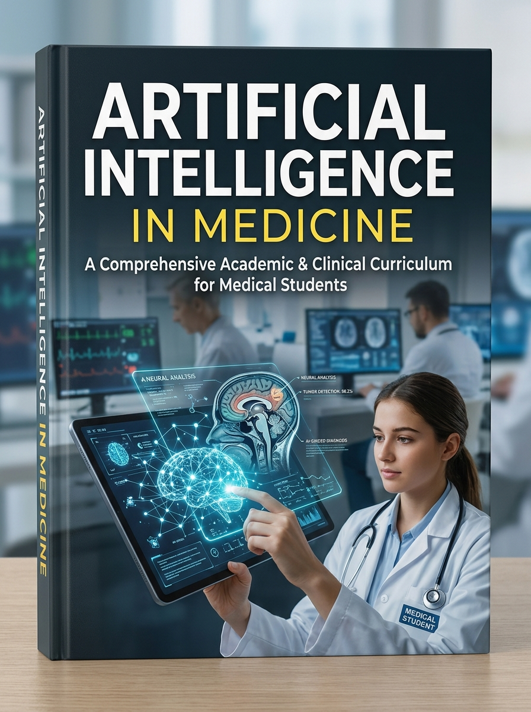

***Assistant. Prof. Shereen Elsaid Elkholy***

## Table of Contents

- [Chapter 1: Fundamentals of Artificial Intelligence in Healthcare](#chapter-1-fundamentals-of-artificial-intelligence-in-healthcare) *(p. 4)*

- [Chapter 2: AI in Diagnostic Radiology & Medical Imaging](#chapter-2-ai-in-diagnostic-radiology-medical-imaging) *(p. 9)*

- [Chapter 3: AI in Clinical Pathology & Automated Laboratory Diagnostics](#chapter-3-ai-in-clinical-pathology-automated-laboratory-diagnostics) *(p. 26)*

- [Chapter 4: AI in Surgery & Surgical Robotics](#chapter-4-ai-in-surgery-surgical-robotics) *(p. 40)*

- [Chapter 5: AI in Interventional Medicine & Cardiology](#chapter-5-ai-in-interventional-medicine-cardiology) *(p. 58)*

- [Chapter 6: AI Applications Across Clinical Medical Specialties](#chapter-6-ai-applications-across-clinical-medical-specialties) *(p. 80)*
- [Chapter 7: Ethics, Medicolegal Challenges & Future Horizons](#chapter-7-ethics-medicolegal-challenges--future-horizons)
- [References](#references)

# Chapter 1: Fundamentals of Artificial Intelligence in Healthcare

Artificial Intelligence (AI) represents a foundational technological paradigm shifting modern medicine from reactive intervention to predictive, personalized, and precision-driven healthcare. For medical trainees, understanding AI is no longer optional; it is an essential clinical competency comparable to understanding molecular biology or biostatistics.

## 1.1 Core Definitions & Technological Spectrum

Medical AI encompasses several distinct subfields that directly impact clinical decision-making:

- **Artificial Intelligence (AI):** The overarching domain of computer science dedicated to building systems capable of performing tasks that traditionally require human intelligence, such as visual perception, natural language translation, and complex diagnostic reasoning.

- **Machine Learning (ML):** A core subset of AI where algorithms parse vast datasets, learn underlying statistical patterns, and make automated predictions without being explicitly programmed with rigid clinical rules.

- **Deep Learning (DL):** An advanced subfield of ML utilizing multi-layered Artificial Neural Networks (ANNs). DL excels at handling unstructured biological data—such as radiological DICOM images, histopathological slides, and genomic sequences—automatically extracting complex diagnostic features without human feature engineering.

- **Generative AI & Large Language Models (LLMs):** Modern architectures (such as Transformer models) trained on massive textual and multimodal corpora capable of synthesizing medical discharge summaries, drafting clinical documentation, and answering complex patient queries.

> **🖼️ [MEDICAL ILLUSTRATION / DIAGRAM PLACEHOLDER]**
> *Figure 1.1: Hierarchical architecture of Medical AI, illustrating Machine Learning, Deep Learning, and Generative Transformers.*
> 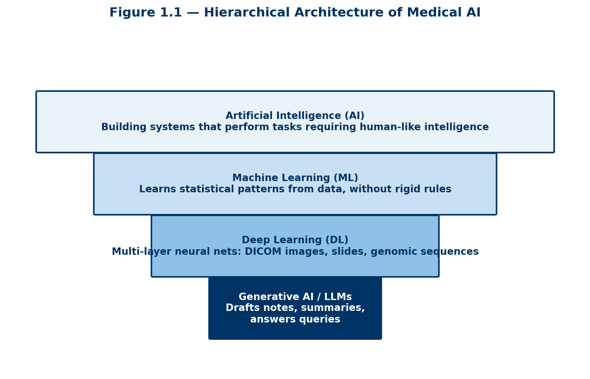

> **📌 CLINICAL CORRELATION: AI vs. Traditional Software**
> Traditional medical software follows rigid rule-based logic (If Blood Pressure > 140/90, then Flag Hypertension). In contrast, Machine Learning evaluates thousands of continuous non-linear variables simultaneously to predict 5-year cardiovascular mortality risk.

## 1.2 Primary Benefits of AI Integration in Medicine (Expanded Depth)

The integration of Artificial Intelligence (AI) into clinical practice represents a monumental paradigm shift in modern healthcare delivery. By transitioning medical practice from a historical, reactive model toward a proactive, precision-driven methodology, AI technologies enhance physician capabilities, streamline administrative burdens, and accelerate scientific discovery.

### 1.2.1 Enhanced Diagnostic Precision and Eradication of Cognitive Errors

Diagnostic errors account for a significant proportion of preventable adverse events in inpatient and outpatient settings. Human diagnostic performance is inherently subject to fatigue, cognitive biases (such as anchoring bias and availability heuristics), and variations in clinical subspecialty expertise. AI systems serve as continuous, non-fatiguing 'second readers' across diagnostic subspecialties:

- Radiologic and Histopathologic Pattern Recognition: Deep learning models analyze high-dimensional pixel data from CT scans, MRIs, mammograms, and digital pathology slides with consistent sensitivity. They detect subtle microcalcifications, sub-visual nodular shadows, or early ischemic changes that may escape human detection during long shifts.

- Multi-Omic and Multimodal Data Fusion: Unlike human clinicians who process clinical data sequentially, machine learning algorithms can simultaneously correlate patient electronic health records (EHR), genomic sequencing, real-time hemodynamic monitoring, and laboratory biomolecules to calculate exact probabilistic disease risks.

> **📌 CLINICAL INSIGHT: Dual-Reading Paradigm**
> In large-scale prospective clinical trials for breast cancer screening, incorporating deep learning algorithms as an autonomous preliminary second reader reduced radiologist reader workload by up to 44% while simultaneously reducing false-positive recall rates and increasing early-stage invasive carcinoma detection sensitivity by over 8%.

### 1.2.2 Clinical Workflow Optimization and Human-Centered Patient Care

Physician burnout has reached epidemic proportions globally, largely driven by administrative overhead and documentation requirements in Electronic Health Record (EHR) systems. Studies indicate that for every hour physicians spend in direct patient face-to-face interaction, they spend nearly two hours completing EHR documentation and clerical data entry.

- Ambient Clinical Intelligence (ACI): Generative AI and advanced Natural Language Processing (NLP) ambient ambient scribes listen to natural patient-physician dialogue, extract relevant clinical history, filter ambient noise, and draft structured SOAP notes (Subjective, Objective, Assessment, Plan) in real time.

- Triage and Order Automation: Machine learning algorithms prioritize critical diagnostic studies—such as alerting emergency teams to acute intracranial hemorrhage or pulmonary embolism within minutes of scan acquisition—thereby expediting life-saving interventions.

### 1.2.3 Quantum Leaps in Molecular Biology and Drug Discovery

Traditional pharmaceutical research and development is notoriously expensive and time-consuming, taking an average of 10 to 15 years and billions of dollars to bring a single novel compound from bench to bedside.

- Protein Structure Prediction: Deep learning platforms (such as DeepMind's AlphaFold) solved the 50-year-old biological grand challenge of predicting 3D protein structures from amino acid sequences with atomic accuracy. This enables precise structural target identification for complex diseases.

- De Novo Molecular Generation: Generative AI models synthesize entirely novel molecular entities optimized for target binding affinity, low toxicity, and oral bioavailability in a matter of weeks, transforming preclinical drug pipelines.

## 1.3 Complications, Pitfalls & Ethical Risks (Expanded Depth)

Despite the immense transformative potential of medical AI, its clinical deployment introduces unprecedented ethical, technical, and medicolegal challenges that require rigorous oversight.

### 1.3.1 Algorithmic Bias, Data Disparities, and Health Inequity

AI models reflect the statistical properties of their training datasets. If training data is predominantly gathered from tertiary academic centers in high-income countries, the model incorporates systemic demographic and socioeconomic disparities:

- Performance Degradation in Underrepresented Cohorts: Algorithms trained on light skin tones for dermatological lesion classification demonstrate significantly lower diagnostic accuracy when deployed on patients with darker skin phototypes (Fitzpatrick scale V-VI), risking delayed melanoma diagnosis.

- Perpetuation of Historical Systemic Biases: Algorithmically driving clinical triage based on historical healthcare expenditure data inadvertently flags lower priority for socioeconomically disadvantaged groups who historically received less healthcare spending due to access barriers rather than lower disease severity.

### 1.3.2 Generative Hallucinations, Automation Bias, and De-Skilling

The integration of generative language models and decision support tools brings psychological and cognitive risks to clinicians:

- Generative Hallucinations: Large Language Models (LLMs) optimize for linguistic plausibility rather than medical factual accuracy. They can confidently state incorrect drug dosages, fabrications of non-existent medical journal references, or contradictory diagnostic recommendations.

- Automation Bias vs. Automation Dismissal: Automation bias occurs when clinicians unthinkingly trust automated output, overriding their intuition and physical examination findings. Conversely, automation dismissal occurs when alarm fatigue causes clinicians to ignore critical AI warnings.

- Cognitive Atrophy and Trainee De-Skilling: Over-reliance on AI systems among medical trainees and junior residents risks eroding core diagnostic reasoning, bedside physical exam skills, and independent radiographic interpretation capabilities.

### 1.3.3 The 'Black Box' Problem, Lack of Explainability, and Medicolegal Liability

Deep neural networks learn non-linear relationships across millions or billions of parameters, operating as 'black boxes' where internal reasoning pathways remain unexplainable to clinicians:

- The Interpretability Dilemma: A clinician cannot verify whether a deep learning network diagnosed pneumonia from lung infiltrates or from an artifactual radiological marker (e.g., a portable X-ray machine symbol) present in the training set.

- Medicolegal Liability and Malpractice: If an AI system misinterprets an ECG or misdiagnoses a malignancy resulting in patient harm, legal responsibility currently rests firmly on the attending licensed physician. Until clear legal frameworks establish shared liability among software developers, healthcare organizations, and clinicians, black box models pose substantial liability risks.

**TEXTBOOK OF ARTIFICIAL INTELLIGENCE IN CLINICAL MEDICINE**

# Chapter 2: AI IN DIAGNOSTIC RADIOLOGY & MEDICAL IMAGING

*Comprehensive Architectural Analysis, Clinical Workflows, Subspecialty Applications, and Risk/Hazard Mitigation*

## Chapter Executive Overview & Mathematical Foundations

Diagnostic Radiology serves as the undisputed pioneer and primary sandbox for clinical Artificial Intelligence (AI) implementation. The intrinsically structured, highly standardized, and fully digital nature of Digital Imaging and Communications in Medicine (DICOM) data provides an ideal substrate for machine learning algorithms. Unlike unstructured clinical narrative notes, radiological images consist of spatially encoded, high-dimensional matrices of discrete pixel and voxel intensities that directly correspond to physical tissue density, proton attenuation, or magnetic resonance relaxation times.

The core technological driver behind modern radiological AI is Deep Learning (DL), specifically Convolutional Neural Networks (CNNs), Vision Transformers (ViTs), and hybrid deep architecture networks. These computational frameworks transition radiology from subjective visual inspection to objective, quantitative image analysis. By learning multi-layered spatial feature hierarchies—ranging from low-level edge detection and texture gradients to high-level semantic anatomic pattern recognition—AI systems can detect occult pathology, quantify temporal disease progression, and optimize radiology operational workflows.

## 2.1 Chest Radiography & Computed Tomography (CT) Deep Learning Integration

### 2.1.1 Plain Chest Radiography (CXR) Automated Screening

Chest radiography remains the most frequently performed diagnostic imaging modality worldwide, accounting for over 40% of all diagnostic imaging studies globally. Despite its ubiquity, two-dimensional chest radiograph interpretation is inherently challenging due to structural superimposition—where complex three-dimensional thoracic anatomy (ribs, clavicles, pulmonary vasculature, and mediastinum) overlaps onto a single planar image. This structural noise frequently conceals subtle early-stage pathologies.

**Pathology Screening Spectrum:** Deep CNN architectures—trained on multi-institutional repositories containing hundreds of thousands of annotated chest radiographs (such as NIH ChestX-ray14, Stanford CheXpert, and MIMIC-CXR)—have demonstrated clinician-level diagnostic sensitivity across a wide array of thoracic conditions. Key clinical focus areas include:

1. Pneumothorax Detection: Identifying subtle visceral pleural line displacement, particularly small apicolateral pneumothoraces or tension pneumothoraces in bedridden intensive care unit (ICU) patients.

2. Pulmonary Consolidations & Infiltrates: Differentiating lobar bacterial pneumonia, viral patchy opacities (e.g., COVID-19 or Influenza), and cardiogenic pulmonary edema.

3. Pleural Effusions & Masses: Quantifying blunting of the costophrenic angles and detecting subtle solitary pulmonary nodules (<1 cm) obscured by vascular structures or ribs.

### 2.1.2 Emergency Department & Critical Care AI Triage Systems

In emergency and trauma centers, time-to-treatment is the single critical determinant of patient survival. Conventional radiology workflows operate on a First-In, First-Out (FIFO) or physician-ordered manual STAT queue. AI clinical triage engines operate in parallel with the Picture Archiving and Communication System (PACS) to intercept DICOM images immediately upon acquisition at the scanner console.

The AI algorithm performs a instantaneous pre-read analysis (taking <30 seconds) and flags life-threatening emergent pathologies. If a critical abnormality is identified, the software automatically re-prioritizes the examination, pushing it to the absolute top of the radiologist's worklist with visual red-flag notifications. Key emergency triage applications include:

- Acute Intracranial Hemorrhage (ICH) on non-contrast head CT (subarachnoid, epidural, subdural, and intraparenchymal bleeding).

- Acute Pulmonary Embolism (PE) on CT Pulmonary Angiography (CTPA).

- Cervical Spine Fractures and Traumatic Aortic Dissections on pan-trauma CT scans.

> **🖼️ [VISUAL DIAGRAM & ILLUSTRATION PLACEHOLDER: Figure 2.1: Automated Deep Learning Triage Pipeline and Grad-CAM Heatmap Visualization for Pulmonary Embolism]**
> 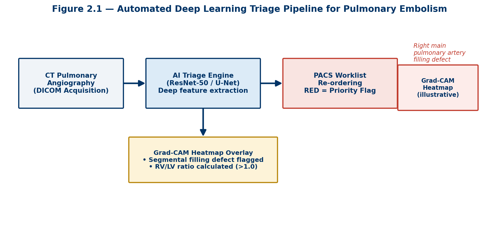
> **+-------------------+      +----------------------+      +----------------------+**
> **|  CT Scanner DICOM | ---> | AI Triage Engine     | ---> | PACS Worklist Top    |**
> **|  Acquisition      |      | (ResNet-50 / U-Net)  |      | Priority Flag (RED)  |**
> **+-------------------+      +----------------------+      +----------------------+**
> **|**
> **v**
> **[Heatmap Overlay Generation]**
> **- Segmental Embolus Detected**
> **- RV/LV Ratio Calculated (>1.0)**
> *Figure 2.1: Conceptual workflow diagram illustrating real-time DICOM interception by an AI triage engine. Panel A shows the ingestion of raw CTPA DICOM slices. Panel B displays the deep learning heat map (Grad-CAM) pinpointing a filling defect within the right main pulmonary artery, accompanied by automated RV/LV strain calculation.*

## 2.2 Magnetic Resonance Imaging (MRI) Acceleration & Reconstruction Physics

### 2.2.1 The Mathematics of k-Space Undersampling

Magnetic Resonance Imaging provides unprecedented soft-tissue contrast without ionizing radiation, making it the gold standard for neuroimaging, musculoskeletal evaluation, and abdominal soft-tissue characterization. However, physical MRI acquisition is intrinsically slow because data points must be filled sequentially in frequency-phase matrix spatial frequency space, known as k-space. Prolonged acquisition times lead to patient motion artifacts, elevated operational costs, patient claustrophobia, and severe bottlenecking in hospital radiology departments.

Deep learning-based image reconstruction leverages Physics-Informed Neural Networks (PINNs), Generative Adversarial Networks (GANs), and Unrolled Deep Architectures to solve the non-linear inverse problem of reconstructing full-fidelity diagnostic images from significantly undersampled k-space data. By sampling only 20% to 30% of standard k-space trajectories, AI models accurately synthesize the missing Fourier components without introducing sub-Nyquist aliasing artifacts.

### 2.2.2 Clinical and Operational Impact of Fast MRI

**Operational Transformations:** The clinical integration of AI MRI reconstruction yields profound operational and diagnostic advantages:

1. Direct Reduction in Scan Duration: Knee, spine, and brain MRI protocol durations are reduced from 25–40 minutes down to 5–10 minutes (a 50% to 70% reduction).

2. Pediatric Neuroimaging: Rapid scanning substantially minimizes or eliminates the requirement for general anesthesia or conscious sedation in pediatric and neonatal patient populations.

3. Artifact Elimination: Shortened acquisition windows eliminate respiratory and cardiac motion degradation in cardiac and dynamic contrast-enhanced abdominal MRI scans.

> **📌 RADIOLOGY ALERT: Computer-Aided Detection (CADe) vs. Computer-Aided Diagnosis (CADx)**
> In clinical radiology, AI algorithms are strictly categorized based on their intended regulatory and clinical functionality:
> - CADe (Computer-Aided Detection): Systems designed purely to highlight, localize, or outline suspicious regions of interest (e.g., placing a bounding box around a subtle solitary pulmonary nodule or microcalcification cluster). CADe does not classify the nature of the lesion.
> - CADx (Computer-Aided Diagnosis): Advanced diagnostic algorithms that evaluate internal tissue architecture, margin spiculation, attenuation coefficient variations, voxel intensity distribution, and volumetric growth kinetics to generate a statistical probability score of malignancy or disease characterization.

## 2.3 Expanded Subspecialty Imaging Applications

### 2.3.1 AI in Breast Imaging & Digital Breast Tomosynthesis (DBT)

Screening mammography is proven to reduce breast cancer mortality, but human readers experience notable false-positive rates and variable sensitivity, particularly in dense breast tissue. Digital Breast Tomosynthesis (DBT) generates quasi-3D reconstructed slice stacks, significantly improving cancer detection but increasing reading time per case by over 100%.

AI algorithms in breast imaging fulfill three vital roles: (1) Automated Breast Density Classification according to ACR BI-RADS standards (A: Fatty to D: Extremely Dense); (2) Concurrent Reading Support, prioritizing suspicious 3D tomosynthesis slices and highlighting subtle architectural distortions or pleomorphic microcalcifications; and (3) Risk Stratification, predicting a patient's short-term (1-to-3 year) risk of developing breast cancer directly from baseline normal mammograms.

### 2.3.2 AI in Quantitative Neuroradiology & Neurodegenerative Disease

In neuroimaging, AI expands radiology from qualitative visual assessment to precise, sub-millimeter anatomical quantification. Deep learning segmentation models (such as 3D-U-Net) automatically isolate and measure specific intracranial structures from volumetric T1-weighted MRI sequences.

- Alzheimer's Disease & Dementia: Automated measurement of hippocampal volume loss, entorhinal cortex thinning, and ventricular enlargement compared against normative age-matched databases.

- Multiple Sclerosis (MS): Precise segmentation and volumetric tracking of white matter demyelinating plaque burden across longitudinal FLAIR sequences, detecting new or expanding lesions invisible to the human eye.

- Acute Ischemic Stroke: Automated Alberta Stroke Program Early CT Score (ASPECTS) calculation on non-contrast CT, along with CT perfusion mismatch tissue segmentation (core infarct volume vs. ischemic penumbra) to select candidates for mechanical thrombectomy.

### 2.3.3 Musculoskeletal (MSK) Radiology & Bone Health Analysis

Musculoskeletal AI applications span automated fracture detection on plain radiography, automated osteoarthritis grading on joint space width, and opportunistic screening. Opportunistic screening utilizes routine CT scans (obtained for abdominal or chest indications) to automatically quantify vertebral bone mineral density (BMD) for osteoporosis detection and measure skeletal muscle cross-sectional area for sarcopenia evaluation.

### 2.3.4 Cardiovascular Imaging & AI Echocardiography

In cardiovascular radiology and cardiology, deep learning automates complex quantitative measurement pipelines on Coronary CT Angiography (CCTA) and Echocardiography. Key clinical modalities include:

- Coronary Artery Calcium (CAC) Scoring: Fully automated Agatston scoring on non-contrast cardiac CT.

- AI-driven CT-FFR (Fractional Flow Reserve): Simulating hemodynamic pressure drops across coronary arterial stenoses using computational fluid dynamics combined with deep learning, preventing invasive cardiac catheterization.

- Cardiac MRI & Echo Segmentation: Automated left ventricular ejection fraction (LVEF), myocardial strain quantification, and wall motion abnormality identification.

### 2.3.5 Radiomics, Quantitative Biomarkers & Radiogenomics

Radiomics refers to the automated extraction of vast numbers (hundreds to thousands) of advanced quantitative shape, intensity, and texture features from routine diagnostic medical images using high-throughput data algorithms. These sub-visual radiomic features reveal macroscopic tissue heterogeneity that correlates directly with microscopic tumor histology, cellular biology, and gene expression profiles.

Radiogenomics bridges radiological imaging and molecular biology. By mapping radiomic signatures to tumor genomic profiles, AI algorithms can non-invasively predict critical genetic mutations without requiring invasive surgical biopsies. Examples include predicting EGFR mutation and ALK translocation status in non-small cell lung cancer (NSCLC), IDH1 mutation and 1p/19q co-deletion in adult diffuse gliomas, and MGMT promoter methylation status in glioblastoma.

> **🖼️ [VISUAL DIAGRAM & ILLUSTRATION PLACEHOLDER: Figure 2.2: The Radiomics and Radiogenomics Extraction Pipeline]**
> 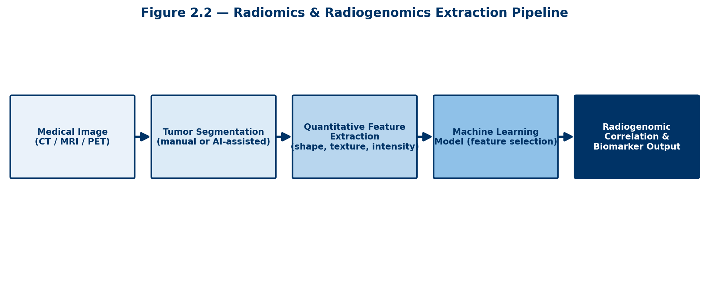
> **+-------------------+      +----------------------+      +----------------------+**
> **|  DICOM Image      | ---> | Automated 3D         | ---> | High-Throughput      |**
> **|  (CT / MRI Scan)  |      | Lesion Segmentation  |      | Feature Extraction   |**
> **+-------------------+      +----------------------+      +----------------------+**
> **|**
> **v**
> **[Radiogenomic Mapping]**
> **- EGFR / IDH1 Status**
> **- Treatment Response**
> *Figure 2.2: Schematic depiction of the radiomic processing pipeline. Diagnostic DICOM volumes undergo automated 3D U-Net lesion segmentation. Thousands of first-order, second-order, and high-order texture matrices (GLCM, GLRLM) are extracted and fed into machine learning classifiers to predict tumor histology, driver gene mutations, and overall survival.*

## 2.4 Comprehensive Hazards, Risks, & Failure Modes of AI in Radiology

While Artificial Intelligence offers transformative potential, its deployment in diagnostic radiology introduces novel, highly complex clinical, technical, ethical, and legal hazards. Understanding these failure modes is mandatory for medical educators, clinical radiologists, and health system administrators to prevent severe diagnostic errors and patient harm.

### 2.4.1 Algorithmic Bias, Data Shift, & Out-of-Distribution (OOD) Failures

**Mechanisms of Technical Failure:** AI models are inherently bound to the statistical distribution of their training datasets. When deployed in real-world clinical environments that differ from the training environment—a phenomenon known as domain shift or distribution shift—algorithmic performance can plummet precipitously.

1. Scanner Vendor & Acquisition Differences: A model trained exclusively on Siemens 3T MRI scanners may experience catastrophic performance degradation when deployed on GE 1.5T scanners or portable bedside machines due to subtle differences in signal-to-noise ratio and spatial frequency profiles.

2. Demographic & Epidemiologic Bias: Models trained predominantly on urban academic populations frequently underperform when applied to rural, pediatric, or ethnically diverse patient cohorts, leading to health disparities and misdiagnoses.

3. Out-of-Distribution Pathology: If a deep learning model trained for pneumothorax detection encounters an unlearned rare pathology (such as severe surgical emphysema, extensive bullous disease, or novel metallic implants), it may misclassify the artifact or produce highly confident erroneous outputs.

### 2.4.2 The 'Black Box' Problem, Explainability, & Automation Bias

Deep neural networks operate as highly opaque mathematical systems containing tens of millions of non-linear parameters. The inability of radiologists to inspect the logical reasoning behind an AI diagnostic output creates profound clinical vulnerabilities.

- Automation Bias: Radiologists, particularly junior residents or overworked clinicians facing severe fatigue, tend to over-rely on AI recommendations. When the AI outputs a false negative (e.g., missing a subtle lung cancer), the radiologist may dismiss their own clinical intuition and accept the AI error.

- Saliency Map Misdirection: Popular explainability tools like Grad-CAM heatmaps can be dangerously misleading. Heatmaps frequently highlight non-pathological background artifacts (such as ECG leads, chest tube markers, or scanner border edges) rather than actual tissue lesions, deceiving clinicians into trusting flawed model inferences.

### 2.4.3 Adversarial Vulnerabilities & Image Artifact Exploitation

Convolutional neural networks are susceptible to adversarial perturbations—imperceptible pixel-level noise modifications engineered intentionally or introduced accidentally by PACS image compression algorithms. An adversarial perturbation invisible to the human eye can cause a state-of-the-art CNN to flip its diagnosis from 'Normal Chest Radiograph' to 'Severe Pneumothorax' with 99% statistical confidence, posing severe cybersecurity and clinical safety risks.

### 2.4.4 Regulatory, Medicolegal, and Liability Ambiguities

The integration of autonomous and semi-autonomous AI tools creates a complex liability vacuum in medical malpractice law. Current legal frameworks in most global jurisdictions hold the licensed attending radiologist solely liable for diagnostic errors, regardless of whether the error was induced by a faulty AI recommendation.

Key unresolved medicolegal challenges include:

- Informed Consent: Lack of clear requirements regarding whether patients must be informed that their diagnostic images were read or pre-screened by an AI algorithm.

- Algorithm Drift: Post-market algorithmic modifications or continuous-learning models that alter performance profiles over time without formal re-validation.

- Commercial Black-Box Proprietary Software: Intellectual property protections preventing independent academic auditing of commercial radiology AI algorithms.

> **⚠️ CLINICAL HAZARD SUMMARY: Taxonomy of AI Risks in Diagnostic Imaging**
> 1. Distribution Shift / Domain Drift: Model failure due to new scanner hardware, protocol changes, or demographic variations.
> 2. Over-reliance & Automation Bias: Human reader complacency leading to accepted false-negative AI errors.
> 3. Hallucination in Deep Reconstruction: GAN-based fast MRI creating non-existent anatomical structures or smoothing out subtle early lesions.
> 4. Adversarial Noise Sensitivity: Misclassification triggered by pixel-level noise or PACS compression artifacts.
> 5. Medicolegal Liability: Indeterminate legal fault distribution between software developer, health enterprise, and interpreting radiologist.

## 2.5 Strategic Frameworks for Safe Clinical Deployment & Governance

To safely harness the immense diagnostic benefits of AI while mitigating its systemic hazards, academic medical institutions and health systems must implement rigorous clinical AI governance frameworks.

**Governance Pillars:** Essential institutional governance pillars include:

1. Local Multi-Site Validation: Health systems must perform local validation studies using their own historical PACS data prior to purchasing or deploying any FDA-cleared or CE-marked AI software. Off-the-shelf accuracy metrics rarely hold true across local scanner fleets.

2. Continuous Algorithmic Monitoring (Quality Assurance): Implementation of real-time dashboard monitoring to track AI diagnostic concordance rates, false-positive frequencies, and turnaround time shifts over time to detect software drift.

3. Human-in-the-Loop (HITL) Workflow Enforcement: AI tools must strictly serve as secondary readers or workflow triage engines. Fully autonomous radiological reporting without certified radiologist review must be prohibited in clinical practice.

4. AI Literacy Education in Medical Curricula: Integrating AI physics, statistics, limitation evaluation, and ethics directly into undergraduate medical education (UME) and radiology residency training programs.

## Self-Assessment Quiz: AI in Diagnostic Radiology

Part 1: Foundations & Chest/CT Imaging

Question 1

Which neural network architecture is primarily responsible for the "breakthrough" in spatial feature extraction from DICOM images?

A) Recurrent Neural Networks (RNN)

B) Convolutional Neural Networks (CNN)

C) Long Short-Term Memory (LSTM)

D) Natural Language Processing (NLP)

Question 2

In an Emergency Department, how does AI "Triage Software" change the traditional FIFO (First-In, First-Out) workflow?

A) It deletes normal scans to save space.

B) It automatically writes the final report for the doctor.

C) It reprioritizes scans with critical findings (e.g., ICH) to the top of the queue.

D) It replaces the need for a radiologist's review.

Question 3

What is the primary limitation of 2D Chest Radiography that AI helps overcome through pattern recognition?

A) High radiation dose.

B) Structural superimposition (overlapping anatomy).

C) Long acquisition time.

D) High cost of the procedure.

Question 4

A "Grad-CAM" heatmap in a CT Pulmonary Angiogram (CTPA) is used to:

A) Measure the patient's heart rate.

B) Visualize the specific pixels the AI focused on to detect a clot.

C) Reconstruct k-space data.

D) Predict the cost of the scan.

Part 2: MRI Physics & CAD Systems

Question 5

In MRI AI reconstruction, what is "k-space"?

A) A storage room for MRI machines.

B) The raw spatial frequency data before it is converted into an image.

C) The physical tunnel where the patient lies.

D) The contrast agent injected into the patient.

Question 6

How does AI reconstruction (e.g., using GANs) benefit pediatric neuroimaging?

A) It makes the MRI machine look like a toy.

B) It reduces scan time, minimizing the need for general anesthesia.

C) It increases the radiation dose to get clearer images.

D) It only works on bone imaging.

Question 7

Which of the following best describes a CADe (Computer-Aided Detection) system?

A) A system that predicts if a tumor is malignant.

B) A system that automatically calculates the probability of a gene mutation.

C) A system that highlights or circles a suspicious lesion for the doctor to see.

D) A system that suggests the surgical approach for a tumor.

Question 8

CADx (Computer-Aided Diagnosis) systems differ from CADe because they:

A) Are faster but less accurate.

B) Provide a statistical probability of disease (e.g., Benign vs. Malignant).

C) Only work on X-rays.

D) Require no human oversight.

Part 3: Subspecialty Applications & Radiomics

Question 9

In Breast Imaging, what is the role of AI in Digital Breast Tomosynthesis (DBT)?

A) It converts 3D images into 2D to save time.

B) It prioritizes suspicious 3D slices in a large stack for faster review.

C) It replaces the need for biopsy in all patients.

D) It measures the patient's blood pressure during the mammogram.

Question 10

"Radiomics" refers to:

A) The study of radioactive isotopes in medicine.

B) Automated extraction of high-dimensional quantitative features from images.

C) The use of robots to perform X-rays.

D) A type of contrast medium used in CT scans.

Question 11

Which application of AI in Neuroradiology is used to track Alzheimer's disease progression?

A) Automated bone age assessment.

B) Automated volumetric measurement of the hippocampus.

C) Detection of rib fractures.

D) Calculation of coronary calcium scores.

Question 12

"Radiogenomics" allows clinicians to:

A) Predict genetic mutations (like EGFR) non-invasively from imaging features.

B) Modify a patient's DNA using X-rays.

C) Predict the patient's height based on their genes.

D) Diagnose broken bones more accurately.

Part 4: Hazards, Risks, & Ethics

Question 13

What does "Automation Bias" refer to in clinical practice?

A) The robot becoming self-aware.

B) The tendency of doctors to over-rely on AI results and ignore their own judgment.

C) The AI becoming slower over time.

D) The high electricity consumption of AI servers.

Question 14

A "Distribution Shift" (or Domain Shift) occurs when:

A) The AI software is updated to a newer version.

B) The model performs poorly because the testing data (e.g., a different scanner) differs from the training data.

C) The radiologist moves to a different hospital.

D) The patient moves during the scan.

Question 15

Why is the "Black Box" problem a concern in medical AI?

A) Because the AI hardware is literally painted black.

B) Because it is difficult for humans to understand the logical steps the AI took to reach a diagnosis.

C) Because it makes the images too dark to read.

D) Because it causes the computer to crash frequently.

Question 16

An "Adversarial Attack" in medical imaging involves:

A) A physical attack on the hospital.

B) Subtle, invisible pixel noise that tricks the AI into giving a wrong diagnosis.

C) A patient refusing to take the scan.

D) A virus that deletes all patient records.

Question 17

Who currently carries the legal liability if an AI system makes a diagnostic error that harms a patient?

A) The software developer.

B) The computer manufacturer.

C) The interpreting licensed radiologist.

D) The hospital IT technician.

Part 5: Governance & Best Practices

Question 18

What is "Human-in-the-Loop" (HITL)?

A) A type of cable used to connect MRI machines.

B) A workflow where an AI output must be reviewed and confirmed by a human doctor.

C) A physical exercise for radiologists.

D) A method to make AI work without any human intervention.

Question 19

Why is "Local Validation" necessary before a hospital buys AI software?

A) To make sure the software has a nice user interface.

B) To ensure the AI works accurately on the specific scanners and patient types at that hospital.

C) To get a discount from the vendor.

D) To check if the software works in different languages.

Question 20

Which of the following is a risk of GAN-based "Deep Reconstruction" in MRI?

A) The MRI machine might overheat.

B) The model might "hallucinate" anatomical details that do not exist.

C) It makes the scan take longer.

D) It makes the image look like a cartoon.

Answer Key & Explanations

**1. B.** CNNs are designed specifically to process pixel data and recognize patterns like edges and shapes.

**2. C.** Triage AI moves critical "positive" cases to the top so doctors see them first.

**3. B.** AI can "see" through overlapping structures better than the tired human eye.

**4. B.** Grad-CAM is an explainability tool showing the "attention" of the model.

**5. B.** MRI captures data in k-space before converting it into the anatomical image.

**6. B.** Shorter scans mean less movement and less need for sedation in children.

**7. C.** Detection (CADe) only "finds" the spot; it doesn't diagnose it.

**8. B.** Diagnosis (CADx) provides a risk score (e.g., 85% chance of cancer).

**9. B.** 3D mammograms have hundreds of slices; AI helps the doctor find the "needle in the haystack."

**10. B.** Radiomics turns images into data (texture, shape, density).

**11. B.** Atrophy (shrinking) of the hippocampus is a hallmark of Alzheimer's.

**12. A.** Radiogenomics links "Imaging" (Radio) with "Genetics" (Genomics).

**13. B.** Doctors might stop double-checking the AI if it is usually right.

**14. B.** AI is sensitive to changes in hardware or protocols it wasn't trained on.

**15. B.** We see the input and output, but the "middle" (reasoning) is hidden.

**16. B.** Even a few "wrong" pixels can flip an AI's decision.

**17. C.** Legally, the human doctor signs the report and is responsible.

**18. B.** AI should assist, not replace, the physician.

**19. B.** A tool that works in New York might fail in Cairo due to different equipment/patients.

**20. B.** Generative models (GANs) can sometimes "create" data that isn't really there to fill gaps.

# Chapter 3: AI in Clinical Pathology & Automated Laboratory Diagnostics

Modern clinical laboratories process millions of biological specimens daily, forming the core decision-making foundation for over 70% of clinical medical decisions. The comprehensive integration of high-throughput automated laboratory hardware with deep learning computer vision algorithms, real-time quality control neural networks, and multi-modal genomic models is fundamentally revolutionizing pathology workflows — from the precise moment a blood tube arrives on an automated track line to the final sign-out of a gigapixel whole slide image by a consultant pathologist.

―――――――――――――――――――――――――――――――――――――――――――――――――――――――

## 3.1 Fully Automated Laboratory Systems & Real-Time Quality Control

In modern tertiary medical centers, core laboratories handle tens of thousands of diagnostic tests every hour. Pre-analytical errors — including inappropriate specimen collection, incorrect volume draw, specimen hemolysis, tube mislabeling, and sample clotting — account for 60% to 70% of all laboratory testing errors. Fully automated laboratory automation systems (LAS) integrated with embedded AI computer vision and real-time analytical monitoring have dramatically transformed quality assurance in laboratory medicine.

### 3.1.1 Optical Sensors & Automated HIL Indices Detection

Automated track lines utilize high-resolution multi-spectral cameras and deep convolutional neural networks (CNNs) to evaluate specimen integrity prior to chemical analysis. As a specimen tube moves along the track, camera systems capture multi-angle images to analyze serum and plasma characteristics:

**Hemolysis (H Index):**

**Icterus (I Index):**

**Lipemia (L Index):**

**Tube & Cap Inspection:**

### 3.1.2 Real-Time Quality Control & Advanced Delta-Checks

Traditional laboratory quality control relies on static, population-wide reference ranges and periodic control run evaluations (Westgard rules). However, AI-driven laboratories implement intelligent dynamic delta-checks. A delta-check compares a patient's current test result against their previous historical results within a defined time window.

Machine learning models (such as gradient-boosted decision trees and recurrent neural networks) dynamically calculate patient-specific expected variation thresholds based on biological variation, clinical history, diagnosis codes, and elapsed time between draws. If a patient's serum creatinine jumps from 0.9 mg/dL to 3.2 mg/dL within 12 hours, the AI system immediately flags this rapid delta change, halts auto-verification, requests automatic reflex re-testing, and notifies the laboratory director of potential acute kidney injury or IV line fluid contamination.

> **📌 LABORATORY BENCHNOTE: Reflex Testing & Auto-Verification**
> *AI middleware engines establish complex rules-based and machine learning auto-verification workflows. Over 80% of routine chemistry and hematology results can be safely auto-verified within seconds of instrument analysis without manual technologist intervention, allowing laboratory staff to focus entirely on critical delta-check flags and abnormal specimens.*

## 3.2 Digital Pathology & Whole Slide Imaging (WSI)

Digital pathology represents the complete transition from light microscopy examination of physical tissue glass slides to the digital review, analysis, and management of high-resolution digital images. Whole Slide Scanners scan entire microscopic glass slides at 20x or 40x optical magnification, generating uncompressed gigapixel images often exceeding 100,000 × 100,000 pixels (1–3 gigabytes per slide).

### 3.2.1 Deep Learning Tiling Architecture & Heatmap Aggregation

Because feedforward deep neural networks cannot directly process a multi-gigabyte image into memory due to GPU hardware limitations, whole slide analysis utilizes a computational strategy known as 'Tiling' (Patch-based analysis) combined with Multiple Instance Learning (MIL):

**Image Tiling:**

**Patch Feature Extraction:**

**Spatial Aggregation & Heatmaps:**

### 3.2.2 Diagnostic Applications in Histopathology

Digital AI assistants provide quantitative objective metrics that drastically reduce inter-observer variability among pathologists:

**Mitotic Figure Quantification:**

**Immunohistochemistry (IHC) Scoring:**

**Tumor Margin & Lymph Node Metastasis Detection:**

> **🖼️ [MEDICAL ILLUSTRATION / DIAGRAM PLACEHOLDER]**
> **Figure 3.1: Whole Slide Imaging (WSI) Deep Learning Pipeline.**
> *(A) Gigapixel slide acquisition → (B) Automated tiling into 256x256 patches → (C) CNN feature extraction → (D) Heatmap overlay identifying neoplastic glands and mitotic figures in prostate biopsy (Gleason grading).*
> 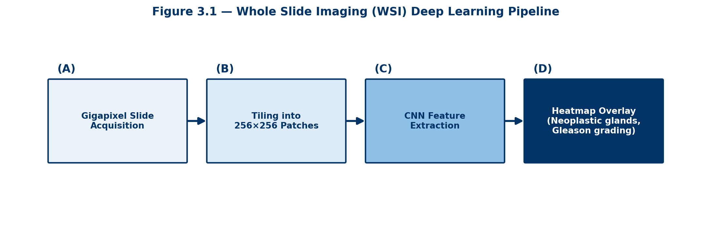

## 3.3 AI in Hematopathology and Cytology

Microscopic examination of peripheral blood, bone marrow aspirates, and exfoliative cytology samples requires extensive expert manual review. AI deep vision models act as digital screeners that pre-analyze cell morphometry and streamline clinical interpretation.

### 3.3.1 Automated Peripheral Blood Smear & Differential

Automated digital microscopy instruments scan stained peripheral blood smears under oil immersion optics. CNN models segment individual nucleated cells and pre-classify white blood cells into 5 normal differential categories (neutrophils, lymphocytes, monocytes, eosinophils, basophils) and critical pathological categories (myeloblasts, lymphoblasts, atypical lymphocytes, band neutrophils, metamyelocytes, and dysplastic granulocytes).

Rather than spending minutes counting 100 individual cells under a microscope, the medical technologist views a pre-grouped image gallery on a workstation monitor, rapidly validating or reclassifying cells in seconds. Furthermore, red blood cell morphology (e.g., schistocytes, sickle cells, spherocytes, target cells) and platelet clumping/morphology are automatically quantified.

### 3.3.2 Exfoliative Cytology & Pap Smear Screening

In cervical cancer screening, Papanicolaou (Pap) smears contain hundreds of thousands of overlapping squamous and glandular cells. AI cytology screening engines analyze thousands of field-of-view (FOV) locations per slide, ranking FOVs based on atypical nuclear-to-cytoplasmic (N/C) ratio, hyperchromasia, nuclear membrane irregularity, and chromatin clumping.

The system presents the top 10 to 22 most suspicious FOVs to the cytotechnologist. If all presented FOVs are completely benign, the slide can be safely verified; if dysplastic or malignant cells are present (e.g., ASC-US, LSIL, HSIL), the full slide is routed for senior cytopathologist evaluation.

### 3.3.3 Bone Marrow Examination & Leukemia Workup

Bone marrow aspirate and trephine biopsy evaluation is vital for diagnosing acute leukemias, myelodysplastic syndromes (MDS), and myeloproliferative neoplasms. AI diagnostic tools perform crucial quantitative computations:

**Cellularity Estimation:**

**Myeloid-to-Erythroid (M:E) Ratio:**

**Blast Cell Percentage:**

> **📌 LABORATORY BENCHNOTE: Hematology Automation**
> *Automated cell analyzers use deep neural networks trained on hundreds of thousands of peripheral blood smears to classify atypical lymphocytes, blast cells, and dysplastic granulocytes, drastically reducing manual microscopic differential counts and improving detection of rare malignant circulating blasts.*

## 3.4 AI in Clinical Microbiology

Clinical microbiology relies heavily on culture interpretation and phenotypic pathogen identification. The integration of digital plate imaging, automated incubators, and computer vision has ushered in an era of rapid diagnostic microbiology.

### 3.4.1 Computer Vision Plate Reading & Colony Morphology

Automated incubation and imaging systems capture high-definition telecentric images of agar plates at scheduled incubation timepoints (e.g., 6, 12, 18, 24 hours). Computer vision algorithms assess plate culture growth:

**Colony Quantification & Growth Detection:**

**Chromogenic Agar & Pigment Classification:**

**Hemolysis Pattern Recognition:**

### 3.4.2 Gram Stain Computer Vision Pre-Classification

Gram stain evaluation of blood cultures, cerebrospinal fluid (CSF), and sputum remains a high-urgency test. Deep learning models trained on oil-immersion Gram stain images pre-classify organisms into Gram-positive vs. Gram-negative and morphological subtypes (Gram-positive cocci in pairs/chains [e.g., S. pneumoniae], Gram-positive cocci in clusters [e.g., S. aureus], Gram-negative bacilli [e.g., E. coli, P. aeruginosa]). This rapid preliminary AI report accelerates empirical antibiotic selection hours before final culture confirmation.

### 3.4.3 Rapid Antimicrobial Susceptibility Testing (AST)

Traditional culture-based AST requires 18–24 hours of incubator growth to measure zones of inhibition or minimal inhibitory concentrations (MICs). Machine learning models revolutionize AST by:

**Early Zone-of-Inhibition Analysis:**

**Growth-Curve Kinetics Models:**

## 3.5 AI in Molecular Diagnostics & Genomic Pathology

Next-Generation Sequencing (NGS) and molecular assays generate terabytes of raw bioinformatic data. AI algorithms are embedded across entire molecular pipelines, transforming raw nucleotide reads into actionable clinical insights.

### 3.5.1 Bioinformatic Pipelines & Variant Calling

Deep learning tools (such as Google DeepVariant) utilize convolutional neural networks to replace traditional statistical variant callers. DeepVariant transforms aligned DNA sequence reads into image-like pileup matrices, accurately identifying single nucleotide variants (SNVs), insertions, and deletions (indels) even in low-coverage or highly repetitive genomic regions.

Machine learning classifiers analyze variant frequency, strand bias, and structural genomic contexts to distinguish true somatic oncogenic mutations from sequencing artifacts, PCR duplications, and benign germline polymorphisms.

### 3.5.2 Multi-Modal Precision Oncology & Pathogenomics

In modern oncology, single-modality data is insufficient. AI systems integrate genomic mutation profiles, transcriptomic expression levels, histological whole slide features, and radiologic imaging (radiogenomics/pathogenomics). Multi-modal transformers predict:

**Therapeutic Target Response:**

**Clinical Trial Matching:**

## 3.6 Validation, Regulation, and Quality Assurance

The clinical implementation of laboratory AI models is subject to strict regulatory oversight and rigorous quality assurance protocols to guarantee patient safety and diagnostic accuracy.

### 3.6.1 Analytical vs. Clinical Validation

Before an AI diagnostic algorithm can be deployed in clinical practice, it must complete two distinct validation phases:

**Analytical Validation:**

**Clinical Validation:**

### 3.6.2 Regulatory Frameworks & Accreditation Standards

In the United States, the Food and Drug Administration (FDA) regulates standalone clinical AI software as Software as a Medical Device (SaMD). Regulatory frameworks require risk-based classification, rigorous clinical trial evidence, and Good Machine Learning Practice (GMLP) adherence.

Laboratory accreditation organizations, including the College of American Pathologists (CAP) and Clinical Laboratory Improvement Amendments (CLIA), enforce stringent operational standards. Laboratories using AI models must maintain strict version control, document model updates, perform periodic re-verification, and monitor continuous post-market drift. Because subtle shifts in staining protocols, scanner hardware, or population demographics can cause algorithmic performance drift, continuous quality monitoring is mandatory.

―――――――――――――――――――――――――――――――――――――――――――――――――――――――

# Chapter 3 Review & Self-Assessment Question Bank

The following 18 multiple-choice questions review core concepts, clinical mechanisms, diagnostic applications, and regulatory requirements covered in Chapter 3.

**Question 1: What are 'HIL indices' used for in an automated clinical chemistry track line?**

A) Measuring patient blood pressure prior to venipuncture

B) Detecting hemolysis, icterus, and lipemia that could interfere with biochemical test results

C) Counting total white blood cells and nucleated red blood cells

D) Scheduling automated specimen transport times across clinical departments

**✓ Correct Answer: B) Detecting hemolysis, icterus, and lipemia that could interfere with biochemical test results**

***Explanation:*** *HIL indices evaluate specimen integrity by optically measuring hemoglobin (hemolysis), bilirubin (icterus), and turbidity (lipemia) to prevent pre-analytical testing interference.*

**Question 2: A dynamic 'delta check' in laboratory quality control compares a new test result to:**

A) A fixed population reference range standard only

B) The patient's own recent historical test results

C) Another patient's test results processed in the same analytical batch

D) The instrument manufacturer's default factory baseline calibration

**✓ Correct Answer: B) The patient's own recent historical test results**

***Explanation:*** *Delta checks flag rapid, unexpected changes in a specific patient's sequential results, detecting acute physiological changes or specimen collection errors.*

**Question 3: Why is 'tiling' (patch-based analysis) necessary when analyzing Whole Slide Images (WSI) with deep learning?**

A) To permanently reduce the image optical resolution to save storage space

B) Because gigapixel images exceed GPU memory limits, so they are split into smaller patches for independent analysis

C) To convert full-color histological stains into grayscale binary images

D) To compress tissue images for routine email attachments

**✓ Correct Answer: B) Because gigapixel images exceed GPU memory limits, so they are split into smaller patches for independent analysis**

***Explanation:*** *Whole-slide images routinely exceed 100,000x100,000 pixels. Tiling breaks the image into smaller patches (e.g., 256x256 pixels) for neural network feature extraction.*

**Question 4: In automated peripheral blood smear analysis, the primary role of the AI system is to:**

A) Render the final clinical diagnosis without human oversight

B) Pre-classify cell images into normal and abnormal categories for rapid technologist confirmation

C) Physically perform the venipuncture on the patient

D) Completely eliminate the need for complete blood count (CBC) analyzers

**✓ Correct Answer: B) Pre-classify cell images into normal and abnormal categories for rapid technologist confirmation**

***Explanation:*** *AI vision systems pre-sort white blood cells into visual image galleries, allowing technologists to rapidly review and validate differentials efficiently.*

**Question 5: AI-assisted Papanicolaou (Pap) smear screening primarily improves diagnostic efficiency by:**

A) Eliminating the need for cytotechnologists and pathologists

B) Highlighting fields of view most likely to contain dysplastic or malignant cervical cells

C) Automatically performing surgical cervical biopsies

D) Diagnosing metabolic and endocrine disorders

**✓ Correct Answer: B) Highlighting fields of view most likely to contain dysplastic or malignant cervical cells**

***Explanation:*** *AI engines scan thousands of microscopic fields and present the top suspicious fields of view to cytotechnologists, maintaining high sensitivity for cervical intraepithelial lesions.*

**Question 6: Which quantitative measurement is central to AI-assisted bone marrow evaluation for leukemia classification per WHO criteria?**

A) Systolic blood pressure measurement

B) Blast cell percentage calculation

C) Urine specific gravity

D) Respiratory rate tracking

**✓ Correct Answer: B) Blast cell percentage calculation**

***Explanation:*** *A blast cell count ≥20% in bone marrow or blood is a definitive cutoff for diagnosing acute leukemias according to WHO and ICC guidelines.*

**Question 7: AI-based automated reading of Gram stains primarily supports clinical care by:**

A) Confirming the patient's ABO/Rh blood type

B) Accelerating empiric antibiotic selection while full culture and sensitivity results are pending

C) Measuring quantitative viral antibody titers

D) Calculating renal glomerular filtration rates

**✓ Correct Answer: B) Accelerating empiric antibiotic selection while full culture and sensitivity results are pending**

***Explanation:*** *Rapid AI pre-classification of Gram-positive vs. Gram-negative organisms and cell morphology allows clinicians to tailor life-saving targeted empirical antibiotics hours earlier.*

**Question 8: In Next-Generation Sequencing (NGS) bioinformatic pipelines, machine learning classifiers (such as DeepVariant) are primarily used to:**

A) Extract DNA physically from tissue specimens

B) Distinguish true pathogenic variants from sequencing artifacts and benign polymorphisms

C) Print final physical pathology reports

D) Sterilize DNA extraction instruments

**✓ Correct Answer: B) Distinguish true pathogenic variants from sequencing artifacts and benign polymorphisms**

***Explanation:*** *Deep learning variant callers analyze pileup matrices to accurately differentiate true genetic variants from technical sequencing artifacts.*

**Question 9: Under United States FDA regulatory frameworks, standalone laboratory AI algorithms are classified as:**

A) Over-the-counter wellness products

B) Software as a Medical Device (SaMD)

C) General dietary supplements

D) Class I exempt office hardware

**✓ Correct Answer: B) Software as a Medical Device (SaMD)**

***Explanation:*** *Clinical decision support software and AI diagnostic algorithms used for patient diagnosis are regulated by the FDA as Software as a Medical Device (SaMD).*

**Question 10: Why must a clinical laboratory AI model undergo formal re-verification after being retrained or updated?**

A) Because regulatory rules mandate a change in software logo

B) Because algorithmic retraining or code changes can alter performance characteristics and diagnostic safety thresholds

C) To increase the software commercial licensing cost

D) Re-verification is optional and rarely performed

**✓ Correct Answer: B) Because algorithmic retraining or code changes can alter performance characteristics and diagnostic safety thresholds**

***Explanation:*** *Any update or retraining of an AI model can alter its underlying weights and performance characteristics, requiring formal laboratory re-verification under CLIA/CAP guidelines.*

**Question 11: Pre-analytical errors account for what percentage of overall clinical laboratory mistakes?**

A) Less than 10%

B) Approximately 25%

C) Between 60% and 70%

D) Exactly 100%

**✓ Correct Answer: C) Between 60% and 70%**

***Explanation:*** *Pre-analytical steps (collection, labeling, transport, HIL interference) account for 60-70% of total laboratory errors, making automated track pre-screening critical.*

**Question 12: What is the primary diagnostic application of scoring HER2/neu, ER/PR, and Ki-67 in digital histopathology?**

A) Distinguishing bacterial from viral pneumonia

B) Standardizing immunohistochemistry (IHC) quantification in breast cancer prognosis and therapy selection

C) Diagnosing iron deficiency anemia

D) Monitoring patient lipid profiles

**✓ Correct Answer: B) Standardizing immunohistochemistry (IHC) quantification in breast cancer prognosis and therapy selection**

***Explanation:*** *AI quantitative IHC scoring precise nuclear and membrane staining for HER2/neu, ER/PR, and Ki-67, eliminating subjective pathologist scoring variability.*

**Question 13: In automated microbiology, how do time-lapse computer vision algorithms accelerate Antimicrobial Susceptibility Testing (AST)?**

A) By measuring micro-growth kinetics and sub-visual zones of inhibition at 4 to 6 hours

B) By killing all bacteria immediately using laser irradiation

C) By bypassing the growth phase and guessing resistance profiles based on patient age

D) By replacing culture plates with routine blood glucose meters

**✓ Correct Answer: A) By measuring micro-growth kinetics and sub-visual zones of inhibition at 4 to 6 hours**

***Explanation:*** *Machine learning vision models detect minute early growth inhibition patterns hours before they become visible to the naked human eye.*

**Question 14: In digital pathology, 'Multiple Instance Learning' (MIL) is specifically used to address:**

A) Slide scanning hardware breakdown

B) Weakly supervised slide-level classification where only a global slide diagnosis is known without patch-level annotations

C) Automated printing of glass slide labels

D) Measuring physical glass slide thickness

**✓ Correct Answer: B) Weakly supervised slide-level classification where only a global slide diagnosis is known without patch-level annotations**

***Explanation:*** *MIL allows neural networks to learn slide-level diagnoses (e.g., malignant vs. benign) by aggregating feature representations across thousands of unannotated image tiles.*

**Question 15: What type of sample interference is caused by elevated serum lipids resulting in sample turbidity?**

A) Hemolysis

B) Icterus

C) Lipemia

D) Ischemia

**✓ Correct Answer: C) Lipemia**

***Explanation:*** *Lipemia refers to high lipid concentration causing specimen cloudiness/turbidity, which interferes with spectrophotometric measurements.*

**Question 16: The M:E ratio evaluated in bone marrow pathology represents the ratio between:**

A) Monocytes and Endothelial cells

B) Myeloid precursors and Erythroid precursors

C) Megakaryocytes and Eosinophils

D) Mature granulocytes and Epithelial cells

**✓ Correct Answer: B) Myeloid precursors and Erythroid precursors**

***Explanation:*** *The Myeloid-to-Erythroid (M:E) ratio measures the balance between granulocytic and erythroid precursor cells in bone marrow (normally 2:1 to 4:1).*

**Question 17: Analytical validation of a clinical AI algorithm specifically evaluates:**

A) The commercial market price of the software

B) Algorithmic accuracy, precision, and performance reproducibility against a reference gold standard

C) Patient satisfaction surveys

D) Hospital billing speed

**✓ Correct Answer: B) Algorithmic accuracy, precision, and performance reproducibility against a reference gold standard**

***Explanation:*** *Analytical validation assesses the technical accuracy and precision of the AI model, whereas clinical validation tests performance on actual clinical patient cohorts.*

**Question 18: The integration of genomic variant analysis with histopathological digital imaging is known as:**

A) Tele-epidemiology

B) Pathogenomics / Radiogenomics

C) Spectrophotometry

D) Flow cytometry

**✓ Correct Answer: B) Pathogenomics / Radiogenomics**

***Explanation:*** *Pathogenomics combines molecular genomic variant profiles with quantitative histopathological image features to guide precision cancer management.*

# Chapter 4: AI in Surgery & Surgical Robotics

# AI in Surgery & Surgical Robotics

Surgical discipline is undergoing a technological renaissance, transitioning rapidly from open surgery and conventional minimally invasive laparoscopic techniques to robotic-assisted, AI-guided intraoperative navigation. The integration of high-precision mechatronics, real-time computer vision, deep reinforcement learning, and augmented reality (AR) is reshaping operating rooms worldwide — empowering surgeons with unprecedented visualization, sub-millimeter dexterity, dynamic hazard detection, and predictive clinical analytics.

―――――――――――――――――――――――――――――――――――――――――――――――――――――――

## 4.1 Robotic Surgical Systems & Master-Slave Telemanipulation

Modern robotic surgery relies fundamentally on master-slave telemanipulation architectures. Rather than replacing the human surgeon, master-slave platforms act as hyper-precise mechanical extenders. The surgeon sits at an ergonomically designed master console, operating multi-directional hand controllers and foot pedals while viewing a stereoscopic 3D high-definition optical field. The robotic patient-side cart, equipped with multi-jointed articulated arms and specialized Endowrist instruments, mimics the surgeon's movements inside the patient's body in real time.

### 4.1.1 Motion Scaling, Tremor Filtration, and Articulation

Robotic telemanipulators solve classic physical limitations of human physiology and standard laparoscopic instruments through advanced mechatronic and software integration:

**Physiological Tremor Filtration:** Integrated real-time digital filtering algorithms identify and eliminate natural human hand tremors (typically 6–10 Hz oscillations), ensuring absolute stability during delicate microsurgical dissections.

**Dynamic Motion Scaling:** Systems allow customizable motion ratios (e.g., 5:1 or 3:1). A 5-centimeter physical motion by the surgeon at the console is translated into a precise 1-centimeter micro-dissection at the surgical site, enabling precise vascular and neural suturing.

**Wristed Endoscopic Articulation:** Standard laparoscopic tools possess rigid shafts with limited degrees of freedom (DOF). Robotic instruments feature wrist joints offering 7 degrees of freedom and 90 degrees of articulation, surpassing the range of motion of the human wrist inside narrow operative spaces such as the pelvis or mediastinum.

### 4.1.2 AI-Enhanced Force Feedback and Haptic Simulation

A historical limitation of master-slave robotic platforms has been the absence of true tactile sense (haptic feedback), forcing surgeons to rely entirely on visual cues like tissue deformation. AI models trained on multi-modal sensor streams are overcoming this barrier through AI-driven visual haptics and neural force estimation:

**Sensor-based Force Transducers:** Micro-strain gauges mounted on instrument tips transmit tissue resistance data back to the master console, applying proportional physical resistance to the surgeon's fingers.

**Vision-Based Force Estimation:** Deep learning networks analyze video frames in real time to model tissue elasticity and tension. By detecting minute visual stretching or compression, the AI projects dynamic color-coded force overlays (e.g., green for safe tension, red for tear risk) onto the surgeon's display, preventing accidental suture breakage or tissue shearing.

> **📌 SURGICAL PEARL: Haptic Virtual Fixtures**
> *AI algorithms establish dynamic 'Virtual Fixtures' — software-defined virtual boundaries in 3D space. If a surgeon's hand accidentally strays toward a delicate structure (such as the internal carotid artery or optic nerve), the robotic arms apply increasing mechanical resistance or active repulsion to prevent inadvertent injury.*

## 4.2 Intraoperative Computer Vision & Computer-Assisted Surgery (CAS)

Intraoperative computer vision transforms raw endoscopic video feeds into rich, annotated clinical intelligence map streams. During complex minimally invasive procedures, optical obstructions, bleeding, and anatomical distortions create significant intraoperative disorientation.

### 4.2.1 Real-Time Anatomical Structure Segmentation

Convolutional neural networks (CNNs) and semantic segmentation architectures (such as U-Net and Vision Transformers) process live laparoscopic video at high frame rates (30–60 FPS) to automatically label critical anatomy:

**Vascular Pathways:** Delineates deep arterial and venous networks hidden under retroperitoneal fat or inflammation, reducing the risk of catastrophic intraoperative hemorrhage.

**Ureteral and Neural Identification:** In pelvic surgeries (e.g., radical prostatectomy or hysterectomy), deep learning models continuously track ureters and autonomic nerve plexuses, preserving urinary and sexual function.

**Tumor Boundary & Resection Margins:** Integrates real-time fluorescence imaging (such as Indocyanine Green - ICG near-infrared fluorescence) to clearly distinguish cancerous tissue from healthy organ parenchyma.

### 4.2.2 Phase Recognition and Workflow Analysis

Surgical workflow AI models utilize recurrent neural networks (RNNs/LSTMs) and spatio-temporal transformers to automatically detect surgical steps in real time (e.g., cholecystectomy phases: hepatocystic triangle dissection, cystic duct clipping, cystic artery division, gallbladder detachment).

By recognizing the active surgical phase, the system can automatically adjust robotic camera zoom, configure energy device settings, alert operating room staff to prepare upcoming instruments, and flag deviations from standardized clinical protocols.

> **🖼️ [SURGICAL ILLUSTRATION / DIAGRAM PLACEHOLDER]**
> **Figure 4.1: Real-Time Computer Vision Segmentation & Critical Safety Zone Identification.**
> *(A) Live endoscopic view of hepatocystic triangle during laparoscopic cholecystectomy → (B) Deep learning real-time semantic segmentation highlighting the Critical View of Safety (CVS): cystic duct (yellow), cystic artery (red), and hazardous common bile duct boundary (red hatched zone).*
> 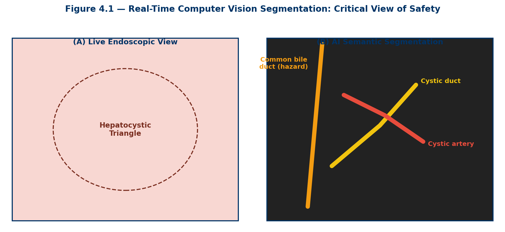

## 4.3 Autonomous and Semi-Autonomous Surgical Robotics

While human telemanipulation remains the standard of care, surgical robotics is progressing along a defined spectrum of autonomy, moving from fully manual teleoperation to task-autonomous execution under direct surgeon supervision.

### 4.3.1 Levels of Autonomy in Surgical Robotics

Analogous to autonomous driving, surgical autonomy is classified into distinct hierarchical levels:

**Level 0 (No Autonomy):** The robot strictly executes human manual commands without assistance.

**Level 1 (Robot Assistance):** The robot provides continuous tremor filtration, motion scaling, or mechanical guidance while the surgeon maintains total physical control.

**Level 2 (Task Autonomy):** The robot independently executes discrete, highly repetitive surgical tasks (e.g., automated tissue suturing, bone milling, or knot tying) under continuous human observation.

**Level 3 (Conditional Autonomy):** The robot generates surgical plans and executes surgical steps independently, relying on a human surgeon to approve plans or intervene in complex scenarios.

**Level 4 & 5 (High/Full Autonomy):** Fully autonomous surgical execution without human intervention; currently experimental and restricted to controlled laboratory settings.

### 4.3.2 Smart Tissue Autonomous Robot (STAR) & Task Execution

A landmark breakthrough in surgical robotics was the development of the Smart Tissue Autonomous Robot (STAR). Utilizing 3D structural light imaging, near-infrared fluorescent tracking, and dynamic force-sensing control, STAR demonstrated the ability to perform autonomous intestinal anastomosis (suturing tubular bowel segments together) in living animal models.

In experimental comparative trials, autonomous robotic suturing produced more consistent suture spacing, superior burst pressure resistance, and fewer luminal leakages compared to manual suturing by experienced expert surgeons.

## 4.4 Augmented Reality (AR) & Intraoperative Surgical Navigation

Intraoperative navigation bridges the gap between preoperative diagnostic imaging (CT, MRI, PET) and live intraoperative surgical anatomy. Augmented Reality (AR) overlays patient-specific 3D anatomical models directly onto the surgeon's optical field of view.

### 4.4.1 Rigid vs. Non-Rigid Deformable Registration

The primary computational challenge in surgical AR is image registration — aligning preoperative 3D volumes with live intraoperative anatomy:

**Rigid Image Registration:** Applied in neurosurgery and orthopedic procedures where bone structures remain stationary relative to rigid landmark reference frames.

**Non-Rigid Deformable Registration:** Required in soft-tissue abdominal and thoracic surgery (e.g., liver, lung, kidney). Soft organs deform continuously due to patient respiration, cardiac motion, tissue retraction, and surgical resection. Deep learning physics-informed neural networks (PINNs) predict dynamic tissue deformation in real time, continually updating the 3D overlay.

### 4.4.2 Head-Mounted Displays and Holographic Navigation

Surgeons equipped with augmented reality smart headsets (e.g., Microsoft HoloLens) or integrated robotic stereoscopic consoles can 'see through' opaque tissue surfaces. In neuro-oncology, AR displays project the exact 3D volume, fiber tract pathways, and deep margins of a brain tumor directly onto the patient's cranium, guiding precise skin incisions and bone flaps while preserving eloquent cortex.

> **🖼️ [SURGICAL ILLUSTRATION / DIAGRAM PLACEHOLDER]**
> **Figure 4.2: Augmented Reality (AR) Guided Intraoperative Navigation in Neurosurgery.**
> *(A) Preoperative 3D MRI reconstruction showing glioblastoma tumor (red) and corticospinal motor tract fibers (blue) → (B) Real-time AR overlay projection onto the live operative field through the surgical microscope, enabling sub-millimeter precision margin resection.*
> 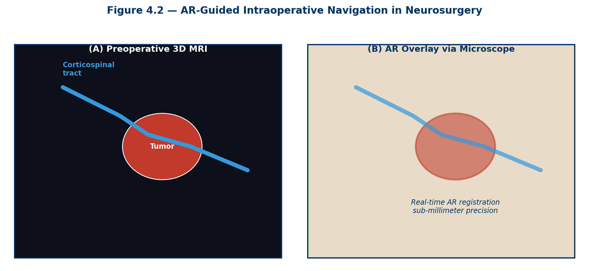

## 4.5 AI in Preoperative Planning & Dynamic Surgical Risk Prediction

Surgical outcomes are heavily dictated by preoperative preparation and patient-specific risk stratification. Machine learning predictive models process electronic health record (EHR) data, laboratory biomarkers, and high-resolution imaging to optimize clinical decision-making prior to entering the operating room.

### 4.5.1 Patient-Specific 3D Anatomical Reconstruction

Automated AI image segmentation tools transform thin-slice abdominal CT scans into interactive 3D digital patient twins. Surgeons can perform virtual surgery — simulating patient positioning, testing alternative resection planes, evaluating organ volume remnants (e.g., post-hepatectomy liver remnant volume), and selecting optimal trocar port placements before making a single physical incision.

### 4.5.2 Predictive Risk Analytics & Intraoperative Mortality Models

Machine learning algorithms (such as XGBoost, random forests, and deep neural networks) outperform traditional manual risk scoring systems (e.g., ASA physical status, NSQIP calculator) by dynamically evaluating complex multi-variable interactions:

**Postoperative Complication Prediction:** Predicts individual risk for postoperative acute kidney injury, pulmonary complications, surgical site infection (SSI), and 30-day mortality.

**ICU Bed Allocation Optimization:** Forecasts operative duration and immediate postoperative care requirements, optimizing intensive care unit resource management across tertiary surgical networks.

## 4.6 Postoperative Assessment, Video Analytics & Skill Evaluation

Evaluating surgical performance has historically relied on subjective peer observation or self-reporting. AI video analytics platformize surgical assessment, establishing objective metrics for surgical quality improvement, credentialing, and resident education.

### 4.6.1 Kinematic and Video-Based Skill Metrics

Robotic systems continuously capture telemetry data (instrument position, velocity, grip force, path length) and high-definition video feeds. Computer vision models evaluate surgical proficiency across standardized domains:

**Economical Motion Analysis:** Measures total instrument tip path length, trajectory smoothness, and excessive idle movements, distinguishing novice trainees from seasoned expert surgeons.

**Tissue Handling & Force Application:** Quantifies sudden jerky movements, excessive tissue compression, or unintended instrument collisions, correlating high force peaks with increased postoperative tissue edema and complication rates.

**Objective Structured Assessment of Technical Skills (OSATS):** AI models automatically score OSATS parameters (e.g., suture accuracy, respect for tissue, time and motion) with high correlation to expert human reviewer panels.

> **📌 SURGICAL PEARL: The Black Box in the Operating Room**
> *Surgical 'Black Box' systems continuously record synchronized intraoperative video, ambient audio, robotic telemetry, physiological patient vitals, and team communication dynamics. Machine learning analytics identify systemic safety threats, near-miss events, and workflow disruptions to enhance operating room team safety culture.*

## 4.7 Ethical, Legal, and Safety Considerations in Surgical AI

The introduction of high levels of automation and autonomous decision-making in surgical care introduces unprecedented ethical, regulatory, and medicolegal challenges that must be addressed alongside technological development.

### 4.7.1 Legal Liability and Malpractice in Automated Surgery

When a surgical adverse event occurs during an AI-assisted or semi-autonomous procedure (e.g., an accidental arterial transection during autonomous suturing), assigning legal liability becomes complex. Liability may be distributed among:

**The Attending Surgeon:** For failure to supervise the autonomous system, failure to override an algorithmic error, or improper patient selection.

**The Robotic Device Manufacturer:** For mechanical failure, software bugs, or algorithmic design flaws under product liability law.

**The Hospital System:** For inadequate staff training, improper equipment maintenance, or failure to enforce safety protocols.

### 4.7.2 Algorithmic Bias, Cybersecurity, and Data Privacy

Surgical AI algorithms trained predominantly on specific patient demographics or high-volume academic hospital video databases may underperform in diverse clinical settings or rare anatomical variants. Furthermore, connected robotic systems operating in networked surgical suites are vulnerable to cybersecurity threats, requiring robust encryption, real-time intrusion detection, and fail-safe mechanical manual overrides to protect patient life and privacy.

―――――――――――――――――――――――――――――――――――――――――――――――――――――――

# Chapter 4 Review & Self-Assessment Question Bank

The following 22 multiple-choice questions review core concepts, clinical mechanisms, robotic platforms, augmented reality systems, and safety frameworks covered in Chapter 4.

**Question 1: What is the primary function of master-slave telemanipulation in surgical robotics?**

A) To perform fully autonomous operations without human intervention

B) To translate the surgeon's console hand movements into micro-movements inside the patient with tremor filtration

C) To eliminate the need for an operating room surgical team

D) To deliver targeted radiation therapy automatically

**✓ Correct Answer: B) To translate the surgeon's console hand movements into micro-movements inside the patient with tremor filtration**

***Explanation:*** *Master-slave platforms allow human surgeons to manipulate robotic arms at a remote console, applying motion scaling and tremor filtration to improve physical precision.*

**Question 2: How many degrees of freedom (DOF) do typical articulated robotic EndoWrist instruments offer?**

A) 2 degrees of freedom

B) 4 degrees of freedom

C) 7 degrees of freedom

D) 12 degrees of freedom

**✓ Correct Answer: C) 7 degrees of freedom**

***Explanation:*** *Robotic wrist instruments provide 7 degrees of freedom plus 90 degrees of articulation, surpassing the natural dexterity of human wrists within restricted anatomical cavities.*

**Question 3: What surgical hazard is mitigated by dynamic motion scaling (e.g., 5:1 ratio) in robotic consoles?**

A) Operating room lighting glare

B) Gross manual hand oversights during delicate vascular or neural dissections

C) Bacterial contamination of instrument shafts

D) Excessive electrical energy power surges

**✓ Correct Answer: B) Gross manual hand oversights during delicate vascular or neural dissections**

***Explanation:*** *Motion scaling converts larger hand motions into micro-dissections, reducing accidental overshoot and enabling delicate vessel handling.*

**Question 4: Vision-based AI force estimation systems project color-coded force overlays to prevent:**

A) Anesthetic medication overdoses

B) Inadvertent tissue tearing or suture breakage caused by excessive tension

C) Excessive surgical video frame rates

D) Disconnection of optical camera cables

**✓ Correct Answer: B) Inadvertent tissue tearing or suture breakage caused by excessive tension**

***Explanation:*** *By tracking visual tissue deformation, AI models estimate applied force and alert surgeons when tension exceeds safe biomechanical limits.*

**Question 5: What are 'Haptic Virtual Fixtures' in AI-guided surgical robotics?**

A) Physical metal clamps attached to the operating table

B) Software-defined active boundaries that resist or prevent instrument movement toward critical anatomical hazards

C) Sterilization trays for robotic instrument arms

D) Automated lighting fixtures in the surgical suite

**✓ Correct Answer: B) Software-defined active boundaries that resist or prevent instrument movement toward critical anatomical hazards**

***Explanation:*** *Virtual fixtures create active force barriers in robotic control systems to stop instruments from entering protected anatomical zones (e.g., major arteries).*

**Question 6: Real-time intraoperative computer vision models during laparoscopic cholecystectomy primarily aim to identify the:**

A) Patient's peripheral IV insertion site

B) Critical View of Safety (CVS) including cystic duct and cystic artery

C) Femoral arterial pulse rate

D) Depth of general anesthesia

**✓ Correct Answer: B) Critical View of Safety (CVS) including cystic duct and cystic artery**

***Explanation:*** *Computer vision models highlight the Critical View of Safety to prevent accidental transection of the common bile duct during gallbladder removal.*

**Question 7: In surgical robotics autonomy classification, 'Level 2 Autonomy' corresponds to:**

A) Total human operational control with zero robotic assistance

B) Task autonomy where the robot performs discrete tasks (e.g., suturing) under continuous human observation

C) Fully autonomous operation without human presence

D) Voice-activated hospital bed adjustment

**✓ Correct Answer: B) Task autonomy where the robot performs discrete tasks (e.g., suturing) under continuous human observation**

***Explanation:*** *Level 2 autonomy allows a robotic platform to autonomously execute specific, repetitive tasks (like suturing or bone cutting) while supervised by a surgeon.*

**Question 8: The Smart Tissue Autonomous Robot (STAR) achieved a landmark milestone by performing autonomous:**

A) Total knee arthroplasty bone milling

B) Intestinal anastomosis suturing in living swine models with superior consistency

C) Cataract phacoemulsification surgery

D) Emergency open heart bypass surgery

**✓ Correct Answer: B) Intestinal anastomosis suturing in living swine models with superior consistency**

***Explanation:*** *STAR demonstrated that autonomous robotic systems could perform delicate soft-tissue intestinal suturing with higher accuracy and fewer leaks than human surgeons.*

**Question 9: Why is 'non-rigid deformable registration' required for Augmented Reality (AR) in soft-tissue abdominal surgery?**

A) Because soft organs change shape dynamically due to respiration, tissue traction, and surgical dissection

B) Because abdominal bones move unpredictably during anesthesia

C) To decrease CT scan spatial resolution

D) To change the color of the endoscopic camera monitor

**✓ Correct Answer: A) Because soft organs change shape dynamically due to respiration, tissue traction, and surgical dissection**

***Explanation:*** *Unlike rigid bone structures, soft organs deform during surgery; non-rigid registration algorithms dynamically adjust 3D AR overlays to match changing organ shapes.*

**Question 10: In neuro-oncology, intraoperative Augmented Reality (AR) headsets assist neurosurgeons by:**

A) Replacing the need for pre-operative MRI imaging

B) Projecting 3D tumor boundaries and critical fiber tracts directly onto the operative view

C) Automatically cauterizing tumor blood vessels

D) Measuring ambient operating room temperature

**✓ Correct Answer: B) Projecting 3D tumor boundaries and critical fiber tracts directly onto the operative view**

***Explanation:*** *AR overlays show surgeons deep tumor margins and functional neural pathways directly in their field of view, maximizing resection while protecting brain function.*

**Question 11: Indocyanine Green (ICG) fluorescence imaging combined with computer vision is commonly used to assess:**

A) Bone mineral density

B) Real-time tissue perfusion, vascular anatomy, and tumor margins

C) Pulmonary tidal volume

D) Patient core body temperature

**✓ Correct Answer: B) Real-time tissue perfusion, vascular anatomy, and tumor margins**

***Explanation:*** *ICG near-infrared fluorescence fluoresces under specific light wavelengths, helping AI vision tools highlight blood supply, ureters, and tumor edges.*

**Question 12: AI surgical workflow phase recognition models utilize spatio-temporal deep networks primarily to:**

A) Automatically calculate patient hospital billing codes

B) Track active surgical steps in real time and optimize camera zoom, energy settings, and staff prep

C) Lock operating room access doors

D) Turn off surgical lighting between procedures

**✓ Correct Answer: B) Track active surgical steps in real time and optimize camera zoom, energy settings, and staff prep**

***Explanation:*** *Workflow phase recognition detects current surgical steps, allowing smart operating rooms to anticipate instrument needs and automate room adjustments.*

**Question 13: Preoperative AI 'digital twins' constructed from thin-slice CT scans allow surgeons to:**

A) Avoid physical clinical examinations entirely

B) Simulate positioning, port placements, and organ resection remnants virtually before surgery

C) Guarantee 100% surgical cure rates

D) Shorten general anesthesia induction times

**✓ Correct Answer: B) Simulate positioning, port placements, and organ resection remnants virtually before surgery**

***Explanation:*** *Interactive 3D digital twins enable patient-specific preoperative planning, allowing surgeons to rehearse complex resections and optimize surgical entry points.*

**Question 14: Which kinematic metric captured by robotic consoles is strongly associated with expert surgical skill?**

A) Maximum possible instrument movement speed

B) Shorter overall instrument path length, trajectory smoothness, and minimal idle motions

C) Frequent instrument collisions during dissection

D) Maximum physical pressure applied to patient skin

**✓ Correct Answer: B) Shorter overall instrument path length, trajectory smoothness, and minimal idle motions**

***Explanation:*** *Expert surgeons exhibit economy of motion — characterized by smooth, direct instrument trajectories, minimal path length, and controlled force application.*

**Question 15: Surgical 'Black Box' systems in the operating room record multi-modal intraoperative data to:**

A) Punish individual OR nurses for minor delays

B) Identify systemic safety threats, workflow disruptions, and near-miss events for continuous quality improvement

C) Broadcast live surgeries onto social media platforms

D) Replace hospital legal compliance departments

**✓ Correct Answer: B) Identify systemic safety threats, workflow disruptions, and near-miss events for continuous quality improvement**

***Explanation:*** *Operating room Black Box systems capture synchronized video, audio, and physiology data to analyze team safety dynamics and prevent adverse events.*

**Question 16: If an adverse event occurs during a semi-autonomous surgical step, legal malpractice liability is typically evaluated across:**

A) The software code writer exclusively

B) The attending surgeon, robotic device manufacturer, and hospital administration depending on supervision and system integrity

C) The patient's primary insurance company only

D) No legal liability can ever be assigned for robotic errors

**✓ Correct Answer: B) The attending surgeon, robotic device manufacturer, and hospital administration depending on supervision and system integrity**

***Explanation:*** *Legal liability in automated surgery involves shared accountability across the supervisory clinician, equipment manufacturer, and health facility.*

**Question 17: What frequency range characterizes natural human physiological hand tremors filtered out by robotic consoles?**

A) 0.1 to 0.5 Hz

B) 1 to 2 Hz

C) 6 to 10 Hz

D) 50 to 60 Hz

**✓ Correct Answer: C) 6 to 10 Hz**

***Explanation:*** *Involuntary resting and action hand tremors naturally occur at frequencies around 6–10 Hz, which digital robotic filters effectively suppress.*

**Question 18: Physics-Informed Neural Networks (PINNs) in soft-tissue AR navigation are specifically used to model:**

A) Optical lens reflections

B) Real-time mechanical deformation and elasticity of biological soft tissues

C) Ambient air temperature changes in the OR

D) Anesthetic gas flow rates

**✓ Correct Answer: B) Real-time mechanical deformation and elasticity of biological soft tissues**

***Explanation:*** *PINNs incorporate physical laws of elasticity and biomechanics to predict how soft tissues shift and deform during surgical manipulation.*

**Question 19: Machine learning risk predictive models (such as XGBoost) outperform traditional risk scores by:**

A) Ignoring preoperative laboratory blood values

B) Evaluating non-linear multi-variable interactions across massive patient EHR records

C) Eliminating the need for postoperative ICU care

D) Replacing surgeon clinical judgment entirely

**✓ Correct Answer: B) Evaluating non-linear multi-variable interactions across massive patient EHR records**

***Explanation:*** *Advanced ML models evaluate complex, non-linear interactions across thousands of patient variables, producing superior risk predictions compared to static manual scoring.*

**Question 20: Which organization standardizes Objective Structured Assessment of Technical Skills (OSATS) automatically analyzed by surgical AI?**

A) FIFA Safety Committee

B) Global Surgical Education and Quality Accreditation Bodies

C) Federal Communications Commission (FCC)

D) International Maritime Organization

**✓ Correct Answer: B) Global Surgical Education and Quality Accreditation Bodies**

***Explanation:*** *OSATS is a globally recognized surgical assessment framework used by surgical education bodies to evaluate technical suturing, dissection, and tissue handling skills.*

**Question 21: What risk arises when surgical AI algorithms are trained exclusively on data from high-volume academic tertiary hospitals?**

A) The software file size becomes too small

B) Algorithmic bias and poor performance generalization when applied to diverse patient populations or community hospital settings

C) Robotic arms move too quickly

D) Complete loss of electrical battery power

**✓ Correct Answer: B) Algorithmic bias and poor performance generalization when applied to diverse patient populations or community hospital settings**

***Explanation:*** *Training data bias can cause AI models to fail when encountering varied patient demographics, rare pathologies, or different surgical equipment in community settings.*

**Question 22: In robotic pelvic surgery, real-time AI tracking of autonomic nerve plexuses is vital to preserve:**

A) Upper extremity motor strength

B) Urinary, bowel, and sexual functional outcomes

C) Visual acuity

D) Hearing thresholds

**✓ Correct Answer: B) Urinary, bowel, and sexual functional outcomes**

***Explanation:*** *Preserving delicate autonomic nerve plexuses during radical pelvic resections (e.g., prostatectomy) is essential to protect urinary continence and sexual function.*

> **🖼️ [MEDICAL ILLUSTRATION / DIAGRAM PLACEHOLDER]**
> *Figure 4.1: Real-time intraoperative computer vision overlay highlighting hepatic arterial branches during laparoscopic resection.*
> 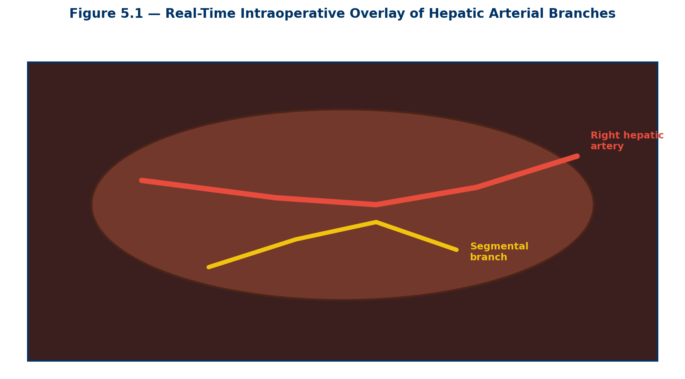

> **📌 SURGICAL PEARL: Autonomous Surgical Tasks**
> While fully autonomous surgery remains experimental, sub-tasks such as continuous tissue suturing, knot tying, and organ tracking are already achieved autonomously in preclinical robotic models.

# Chapter 5: AI in Interventional Medicine & Cardiology

# AI in Interventional Medicine & Cardiology

Interventional subspecialties rely heavily on dynamic, real-time fluoroscopic, intravascular, and cross-sectional imaging guidance. Because time-critical clinical decisions must be executed rapidly in cath labs, angiography suites, and hybrid operating rooms, interventional cardiology, electrophysiology, neuro-interventional radiology, and endovascular surgery are among the primary clinical beneficiaries of AI-assisted multi-modal image fusion, continuous hemodynamic monitoring, automated lumen and organ segmentation, and predictive risk analytics. This chapter walks through how these systems work at a mechanistic level, why they matter for patient outcomes, and where their current limitations lie — framed for the trainee who will eventually supervise, rather than blindly trust, these tools.

―――――――――――――――――――――――――――――――――――――――――――――――――――――――

## 5.1 Interventional Cardiology & Electrophysiology

In modern cardiac catheterization laboratories (cath labs), interventional cardiologists navigate complex coronary arteries and structural heart anomalies under X-ray fluoroscopy, working with sub-millimeter precision on a moving target — the beating heart — while wearing lead aprons and interpreting several monitors simultaneously. This cognitive and procedural load is exactly the kind of high-volume, pattern-recognition-heavy environment in which deep learning systems excel, because they can pre-process, quantify, and flag abnormalities faster and more consistently than a human operator glancing between screens under time pressure. Three broad categories of AI tool now assist the interventional cardiologist: (1) intraprocedural image interpretation, (2) non-invasive physiological assessment, and (3) predictive arrhythmia and outcome modeling.

### 5.1.1 Intravascular Ultrasound (IVUS) & Optical Coherence Tomography (OCT)

Intravascular imaging techniques offer high-resolution cross-sectional views of the coronary arterial wall from inside the vessel lumen. IVUS uses a miniaturized ultrasound transducer mounted on a catheter tip to generate images based on acoustic backscatter, giving good penetration through blood and plaque at the cost of lower resolution (~100–150 micrometers). OCT instead uses near-infrared light interferometry, achieving roughly ten times higher axial resolution (~10–15 micrometers) but requiring a brief contrast flush to clear blood from the field of view, since red blood cells scatter light strongly. A single pullback sequence can generate several hundred cross-sectional frames, and manual interpretation of each frame is labor-intensive, time-consuming during a live procedure, and subject to meaningful inter-observer variability — two experienced readers may disagree on plaque burden or minimal lumen area by a clinically significant margin. AI models automate this analysis in real time:

**Coronary Plaque Characterization:** Deep convolutional neural networks (CNNs), most commonly U-Net-style encoder-decoder architectures, automatically segment the lumen border, the external elastic membrane, and the plaque burden in between, classifying tissue as fibrous, fibro-fatty, lipid-rich necrotic core, or dense calcium. This produces a quantitative plaque volume and composition profile in seconds rather than the many minutes a manual pullback analysis would take.

**Calcium Scoring & Arc Measurement:** AI identifies the circumferential extent (arc, in degrees) and thickness of calcium deposits, which directly informs whether the lesion will resist balloon expansion. This assists operators in deciding whether rotational atherectomy (rotablation), intravascular lithotripsy (IVL), or a cutting/scoring balloon is required for adequate lesion preparation before stent deployment — calcium arcs greater than roughly 180 degrees are a classic trigger for calcium-modification strategies.

**Stent Apposition and Expansion Analysis:** Following drug-eluting stent (DES) placement, automated algorithms assess strut-by-strut apposition against the vessel wall, detect tissue or thrombus prolapse through stent struts, and quantify minimum stent area relative to the reference vessel. Under-expansion and malapposition are the two most consistently identified mechanical predictors of late stent thrombosis and in-stent restenosis, so flagging them intraprocedurally allows the operator to post-dilate before leaving the lab, rather than discovering the problem after a re-presentation months later.

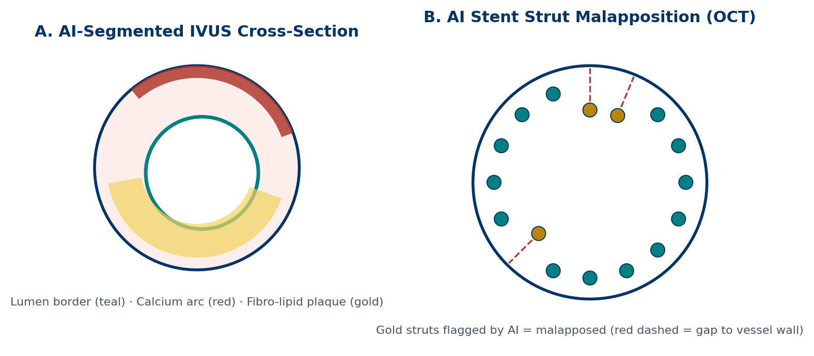

**Figure 5.1 — AI Segmentation of Intravascular Imaging.**

*(A) IVUS cross-section with AI-delineated lumen border (teal), calcium arc (red), and fibro-lipid plaque burden (gold). (B) OCT frame with automated strut-by-strut classification; gold-flagged struts show a measurable gap from the vessel wall (malapposition), each linked to a dashed distance vector.*

### 5.1.2 Fractional Flow Reserve (FFR) & AI-Computed FFR (FFR-CT)

Fractional Flow Reserve is the ratio of maximal blood flow achievable distal to a coronary stenosis compared with flow in a theoretically normal vessel, measured during maximal hyperemia (usually induced with intravenous or intracoronary adenosine). An FFR value of 0.80 or below is generally accepted as the threshold below which a lesion is causing significant ischemia and merits revascularization; values above this threshold support deferring intervention, since randomized trial data show that stenting hemodynamically insignificant lesions does not improve outcomes and adds procedural risk. Traditionally, measuring FFR requires threading a dedicated pressure wire across the lesion — an invasive step that adds procedure time, cost, and a small incremental risk of dissection. Deep learning combined with Computational Fluid Dynamics (CFD) now enables a non-invasive AI-derived FFR, known as FFR-CT, computed entirely from a standard coronary CT angiogram (CCTA) obtained before the patient ever enters the cath lab.

**Coronary CT Angiography (CCTA) Processing:** 3D neural networks reconstruct a patient-specific coronary artery tree from the CT dataset, segmenting the full epicardial vessel course down to sub-millimeter side branches.

**Hemodynamic Pressure Gradient Simulation:** Physics-informed neural networks — trained on and constrained by the Navier–Stokes equations governing fluid flow — simulate blood flow dynamics through the reconstructed anatomy, predicting the pressure drop across intermediate-severity stenoses (roughly 50–70% diameter stenosis on visual estimation) without any invasive hyperemic pressure wire measurement in the cath lab.

**Clinical Impact:** Because FFR-CT can be generated from imaging the patient may already have, it allows earlier, non-invasive triage of stable chest pain patients, reducing the number of purely diagnostic invasive angiograms that ultimately reveal no flow-limiting disease.

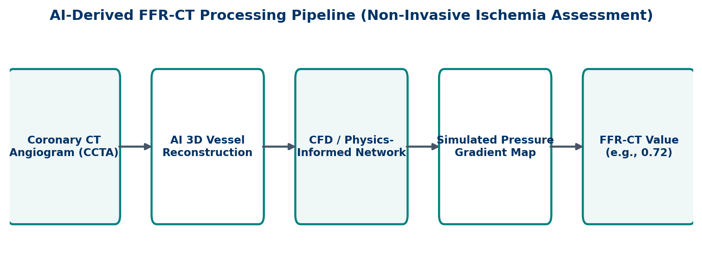

**Figure 5.2 — AI-Derived FFR-CT Processing Pipeline.**

*A standard coronary CT angiogram is converted into a patient-specific 3D vessel model, run through a physics-informed neural network simulating hyperemic flow, and returned as a per-lesion FFR-CT value — without an invasive pressure wire.*

### 5.1.3 AI in Cardiac Electrophysiology (EP) & Arrhythmia Prediction

Electrophysiology relies on complex electrical mapping and signal processing, both at the level of the surface ECG and, intraprocedurally, at the level of intracardiac electrograms recorded by mapping catheters. AI models process standard 12-lead surface ECGs as well as continuous ambulatory single-lead telemetry and wearable data, extracting features far more subtle than what a human reader would flag on visual inspection:

**Occult Atrial Fibrillation (AFib) Detection:** Deep neural networks identify subtle structural and electrical substrate signatures on ECGs recorded during normal sinus rhythm — changes in P-wave morphology, atrial conduction velocity, and other features imperceptible to the human eye — that predict a patient will later be found to have paroxysmal AFib, even before any arrhythmia has been clinically documented. This matters because AFib is a major preventable cause of cardioembolic stroke, and earlier detection allows earlier anticoagulation.

**Sudden Cardiac Death (SCD) Risk Stratification:** AI models analyze repolarization dynamics (T-wave alternans, subtle beat-to-beat QT dispersion) together with mechanical parameters such as left ventricular ejection fraction to identify heart failure patients at elevated risk for lethal ventricular tachycardia or fibrillation (VT/VF), refining the decision to proceed with a prophylactic implantable cardioverter-defibrillator (ICD) beyond ejection fraction alone.

**Intra-Cardiac Mapping & Ablation Target Identification:** During catheter ablation for AFib or ventricular tachycardia, AI integrates real-time electroanatomical voltage mapping with pre-procedural delayed-enhancement cardiac MRI to automatically locate re-entrant rotor centers, low-voltage scar zones, and ectopic focus origin sites — shortening mapping time and helping standardize ablation strategy across operators of varying experience levels.

> **🫀 CLINICAL PEARL — Fluoroscopy Dose Reduction**
> *AI-driven frame-rate throttling and spatial noise-reduction algorithms decrease radiation exposure (measured in mGy) to both patients and cath lab staff by roughly 50–70% during complex PCI and TAVR procedures, reconstructing crisp, diagnostic-quality images from a lower-dose raw signal rather than simply reducing dose and accepting a noisier image.*

## 5.2 Interventional Radiology & Endovascular Stroke Therapy

Endovascular interventionists operate in high-stakes, time-critical environments where minutes translate directly into irreversible tissue death — summarized by the aphorisms "time is brain" in acute ischemic stroke and "time is muscle" in ST-elevation myocardial infarction (STEMI). Any tool that compresses the time from imaging acquisition to treatment decision has an outsized effect on functional outcomes, because the volume of salvageable brain or myocardium shrinks continuously with every additional minute of occlusion.

### 5.2.1 Acute Ischemic Stroke & CT Perfusion Automated Analytics

During emergency evaluation for acute ischemic stroke, rapid decision-making about mechanical thrombectomy eligibility depends on distinguishing tissue that is already irreversibly infarcted (the "core") from tissue that is hypoperfused but still salvageable (the "penumbra"). This distinction, made in the past largely by visual gestalt on non-contrast CT, is now made quantitatively by automated software within roughly 60 seconds of image acquisition:

**Ischemic Core Quantification:** AI algorithms analyze non-contrast CT and CT perfusion scans, measuring regional cerebral blood volume (CBV) reductions to calculate the volume, in milliliters, of tissue considered irreversibly infarcted (conventionally, CBV reduced below roughly 30% of normal).

**Salvageable Penumbra Mapping:** The software calculates delayed cerebral blood flow (CBF) and time-to-maximum residue-function peak (Tmax greater than 6 seconds) to map hypoperfused tissue that can still be rescued if flow is restored via mechanical thrombectomy.

**Automated Mismatch Ratio Calculation:** The software automatically computes the penumbra-to-core mismatch ratio. A favorable mismatch profile (for example, penumbra volume greater than 15 mL relative to a core smaller than roughly 70 mL, with a mismatch ratio above 1.8) triggers immediate transfer to the neuro-interventional suite, in line with trial-derived eligibility criteria for late-window thrombectomy.

**Large Vessel Occlusion (LVO) Detection:** Convolutional neural networks automatically flag occlusions of the middle cerebral artery (M1/M2 segments) or internal carotid artery on CT angiograms, pushing an immediate alert to the on-call interventionist's mobile device — often before the treating emergency physician has finished reading the scan.

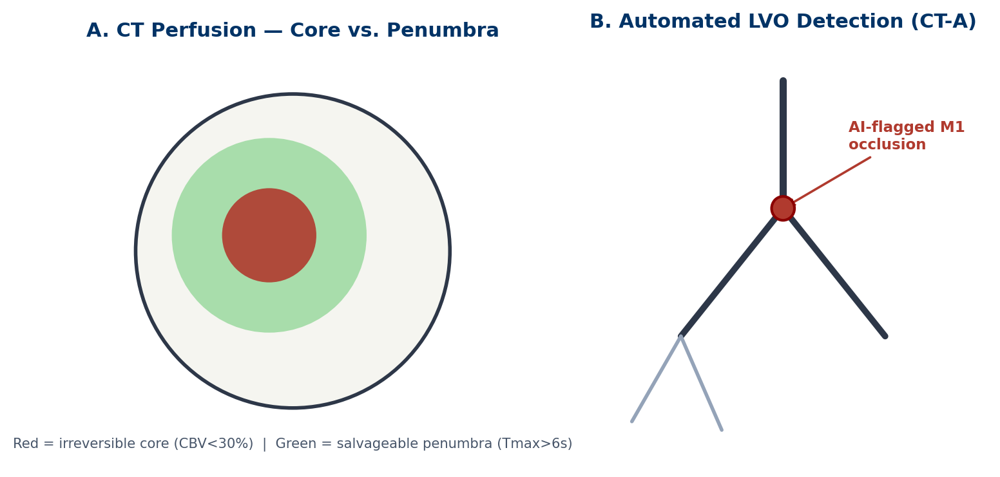

**Figure 5.3 — Automated Stroke Imaging Analytics.**

*(A) CT perfusion color map: non-viable ischemic core (red, CBV < 30%) versus salvageable penumbra (green, Tmax > 6 s). (B) Simplified cerebral vessel tree with an AI-flagged M1 segment occlusion triggering an automated mobile alert to the stroke team.*

***Mobile Stroke Triage and Workflow Compression***

Beyond image analysis itself, several platforms now integrate LVO detection directly with automated paging and secure image-sharing, so that a neuro-interventionalist at home can review the CT angiogram on a smartphone within minutes of acquisition and decide whether to mobilize the team — compressing the traditional "door-to-groin-puncture" time interval, which is one of the strongest modifiable predictors of good functional outcome after thrombectomy.

## 5.3 Structural Heart Disease & Valve Interventions

Transcatheter structural heart procedures — such as Transcatheter Aortic Valve Replacement (TAVR), Transcatheter Edge-to-Edge Repair (TEER) for mitral regurgitation, and left atrial appendage (LAA) occlusion — demand meticulous preoperative anatomic modeling, because these devices are deployed without direct surgical visualization of the target structure and are difficult or impossible to reposition once released.

### 5.3.1 Preoperative TAVR Planning & Annular Sizing

AI segmentation tools convert 3D multi-detector CT (MDCT) scans of the aortic root into precise anatomic models within seconds, a task that previously required a skilled operator to manually trace the annulus across multiple oblique planes.

**Aortic Annulus & LVOT Measurement:** The software calculates annular perimeter, cross-sectional area, minimum and maximum diameters, and the distance from the annular plane to each coronary ostium, eliminating manual measurement error and reducing the risk of paravalvular leak (PVL) from an under-sized or asymmetrically deployed valve, as well as the risk of coronary occlusion in patients with low-lying ostia.

**Optimal Fluoroscopic Angle Prediction:** The model predicts the exact C-arm gantry projection angles (the "cusp-overlap" or S-curve view) that align the three aortic sinuses of Valsalva in a single fluoroscopic line, minimizing both procedure time and the volume of iodinated contrast dye required — an important consideration in a population with a high burden of chronic kidney disease.

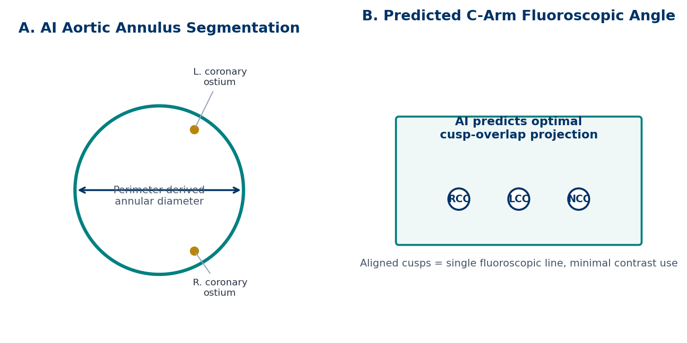

**Figure 5.4 — AI-Assisted TAVR Planning.**

*(A) Automated aortic annulus segmentation with perimeter-derived diameter and coronary ostium localization. (B) AI-predicted C-arm cusp-overlap angle aligning the right, left, and non-coronary cusps (RCC / LCC / NCC) in a single fluoroscopic projection.*

### 5.3.2 Real-Time 3D Transesophageal Echocardiography (TEE) Fusion

During TEER procedures (for example, with the MitraClip or PASCAL devices), AI merges live 3D TEE images with the fluoroscopic X-ray display in real time. The resulting blended, dynamic overlay guides catheter steering toward the exact origin of the regurgitant jet and the underlying leaflet pathology, helping the proceduralist correlate the echocardiographic and fluoroscopic "views" of the same moving valve without mentally reconciling two separate screens.

### 5.3.3 Left Atrial Appendage (LAA) Occlusion Planning

For patients with non-valvular AFib who cannot tolerate long-term anticoagulation, percutaneous LAA occlusion (for example, with a Watchman-type device) reduces stroke risk by mechanically excluding the appendage — the site of origin of most cardioembolic thrombi in AFib. Because the LAA has a highly variable, often multi-lobed morphology, 3D AI modeling of ostium diameter, landing-zone depth, and appendage angulation from CT or intracardiac echocardiography helps the operator pre-select an appropriately sized occluder device, reducing the incidence of peri-device leak discovered on post-implant imaging.

## 5.4 Peripheral Vascular Interventions & Endovascular Aneurysm Repair (EVAR)

Endovascular repair of abdominal and thoracic aortic aneurysms (AAA/TAA) requires exact sizing of stent-grafts to prevent endoleaks — persistent blood flow into the aneurysm sac outside the graft lumen — and to prevent graft migration over time as the aneurysm neck itself can continue to remodel.

### 5.4.1 Automated Aortic Morphology & Endoleak Detection

Deep learning models map aortic neck length, angulation, and iliac artery tortuosity from preoperative CT angiography to help select an appropriately customized stent-graft configuration. Post-procedurally, AI surveillance algorithms compare serial follow-up CT angiograms to detect subtle Type I through Type V endoleaks — classified by their source, whether at the proximal or distal graft attachment (Type I), retrograde flow from collateral branches such as the lumbar or inferior mesenteric arteries (Type II), graft fabric or junctional defects (Type III), graft porosity (Type IV), or unexplained sac expansion without a visible leak (Type V, or "endotension") — as well as any interval increase in aneurysm sac volume, which is itself an indirect marker of an undetected leak even when no contrast jet is visualized.

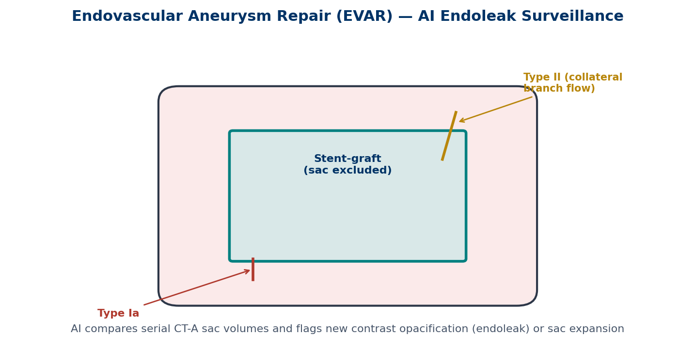

**Figure 5.5 — EVAR AI Endoleak Surveillance.**

*Simplified stent-graft schematic within an excluded aneurysm sac. Type Ia leak occurs at the proximal attachment site; Type II leak arises from retrograde collateral branch flow. AI software compares serial CT-A sac volumes and flags new contrast opacification over time.*

## 5.5 AI-Guided Hemodynamic Monitoring & Cardiac Care Unit (CCU) Analytics

Continuous physiological monitoring in cardiac intensive care units generates massive, high-frequency data streams — arterial line waveforms sampled at 100+ Hz, pulmonary artery catheter pressures, continuous oxygen saturation, and telemetry — that vastly exceed what a bedside nurse or physician can meaningfully scan by eye across an entire shift for an entire unit of patients.

### 5.5.1 Predictive Hemodynamic Instability & Cardiogenic Shock Models

Recurrent neural networks and time-series transformer models continuously analyze arterial pressure waveform morphology and beat-to-beat pulse pressure variation to predict hemodynamic collapse, post-infarction cardiogenic shock, and severe hypotension — often 1 to 4 hours before overt clinical decompensation is apparent to bedside staff. This lead time allows earlier initiation of inotropic support, earlier escalation of monitoring, or earlier deployment of mechanical circulatory support devices (such as an Impella percutaneous ventricular assist device or veno-arterial ECMO), rather than reacting only after a patient has already become frankly hypotensive.

**Figure 5.6 — Predictive Hemodynamic Instability Model.**

*Schematic continuous arterial pressure trace. The AI model detects a subtle trend change in pulse pressure variation (gold dashed line) well before the overt decline in mean pressure, defining a predicted instability window during which earlier intervention is possible.*

## 5.6 Ethical, Technical, and Safety Challenges in Interventional AI

Despite these advantages, deploying AI models in real-time interventional environments introduces distinct technical and ethical considerations that differ from those of static, offline diagnostic imaging AI.

**Real-Time Latency Requirements:** Interventional computer vision algorithms must process high-definition fluoroscopic or ultrasound video at well under 30 milliseconds per frame to stay imperceptible to the operator. Processing delays or frame lag during active guidewire or catheter manipulation can cause the displayed image to trail the true device position, with a real risk of arterial or myocardial perforation if the operator trusts a stale overlay.

**Artifact Resistance:** Metallic shadow artifacts from previously deployed stents, coils, surgical clips, and pacing leads can cause segmentation failure or frank hallucination of anatomy that is not there, requiring models to be explicitly trained on these edge cases rather than only on "clean" reference datasets.

**Dataset Bias and Generalizability:** Most large interventional AI datasets are drawn from a limited number of high-volume academic centers and specific device platforms; performance can degrade meaningfully when a model trained on one population, imaging vendor, or catheter system is deployed in a different clinical setting.

**Human Operator Oversight:** AI provides decision support and automated measurement, but final clinical accountability for device sizing, deployment, and thrombus extraction remains strictly with the attending interventionist — the algorithm's output is one input among several, not a replacement for procedural judgment.

## 5.7 Future Directions

Several trends are likely to shape the next generation of interventional AI. First, closed-loop systems that combine real-time image segmentation with robotic catheter or guidewire manipulation are moving from early feasibility studies toward more routine use in select high-volume centers, potentially reducing operator radiation exposure further by allowing remote or shielded control consoles. Second, federated learning approaches — in which models are trained across multiple institutions without any single center's raw patient data ever leaving its own servers — are being explored specifically to address the generalizability problem described above. Third, multi-modal foundation models that jointly reason over fluoroscopy, intravascular imaging, hemodynamic waveforms, and structured clinical data may eventually provide a single integrated risk assessment rather than the current landscape of separate, single-purpose tools for each imaging modality. Trainees entering interventional subspecialties over the next decade should expect these tools to become a standard part of the procedural workflow, and should develop the same critical fluency in evaluating an algorithm's output that they already apply to any other diagnostic test.

―――――――――――――――――――――――――――――――――――――――――――――――――――――――

# Chapter 5 Review & Self-Assessment Question Bank

The following 25 multiple-choice questions review core interventional concepts, intravascular modalities, stroke triage protocols, structural heart planning, and safety considerations covered in Chapter 5.

**Question 1: What is the primary diagnostic benefit of automated AI segmentation in Intravascular Ultrasound (IVUS)?**

A) It replaces the need for heparin anticoagulation

B) It accurately quantifies plaque volume, calcium arc, and vessel lumen boundaries in real time

C) It eliminates the necessity of cardiac catheter insertion

D) It measures peripheral venous pressure automatically

**✓ Correct Answer: B) It accurately quantifies plaque volume, calcium arc, and vessel lumen boundaries in real time**

***Explanation:*** *AI models automate IVUS pullback analysis, providing rapid quantification of coronary plaque composition, vessel wall dimensions, and calcification arcs.*

**Question 2: Following drug-eluting stent (DES) placement, AI analysis of Optical Coherence Tomography (OCT) is primarily used to evaluate:**

A) Myocardial oxygen extraction ratio

B) Stent strut malapposition, tissue prolapse, and under-expansion

C) Left ventricular ejection fraction

D) Pulmonary capillary wedge pressure

**✓ Correct Answer: B) Stent strut malapposition, tissue prolapse, and under-expansion**

***Explanation:*** *High-resolution OCT combined with AI detects unapposed or under-expanded stent struts, key risk factors for late stent thrombosis.*

**Question 3: How does AI-computed Fractional Flow Reserve (FFR-CT) assess coronary stenosis severity?**

A) By measuring blood glucose levels across the lesion

B) By combining 3D Coronary CT Angiography models with Computational Fluid Dynamics to simulate pressure drops non-invasively

C) By applying electrical shocks to the coronary ostium

D) By calculating serum troponin clearance rates

**✓ Correct Answer: B) By combining 3D Coronary CT Angiography models with Computational Fluid Dynamics to simulate pressure drops non-invasively**

***Explanation:*** *FFR-CT uses physics-informed deep learning models on CT angiography scans to calculate pressure drops without invasive pressure-wire catheterization.*

**Question 4: In emergency CT perfusion imaging for acute ischemic stroke, AI software calculates the salvageable penumbra by analyzing:**

A) Cerebral Blood Volume (CBV) reduction only

B) Delayed Cerebral Blood Flow (CBF) and Time-to-Maximum peak (Tmax > 6 seconds)

C) Skull fracture displacements

D) Cerebrospinal fluid protein concentrations

**✓ Correct Answer: B) Delayed Cerebral Blood Flow (CBF) and Time-to-Maximum peak (Tmax > 6 seconds)**

***Explanation:*** *Tmax > 6 seconds indicates hypoperfused, salvageable tissue (penumbra), while severely reduced CBV (<30%) defines the non-viable core.*

**Question 5: What Penumbra/Core mismatch finding on AI CT perfusion analysis favors proceeding with emergency mechanical thrombectomy?**

A) A large non-viable ischemic core (>100 mL) with no penumbra

B) A small core (<70 mL) with a large salvageable penumbra and high mismatch ratio

C) Total absence of arterial blood flow in all cerebral vessels

D) High intracranial bone density

**✓ Correct Answer: B) A small core (<70 mL) with a large salvageable penumbra and high mismatch ratio**

***Explanation:*** *A small core paired with a substantial penumbra indicates significant brain tissue at risk that can be saved by endovascular clot removal.*

**Question 6: How do deep learning ECG algorithms detect occult Atrial Fibrillation (AFib) in patients presenting in normal sinus rhythm?**

A) By analyzing blood pressure fluctuations

B) By identifying subtle sub-clinical structural and electrical atrial substrates on normal ECG waveforms

C) By measuring baseline skin resistance

D) By monitoring core body temperature

**✓ Correct Answer: B) By identifying subtle sub-clinical structural and electrical atrial substrates on normal ECG waveforms**

***Explanation:*** *AI models detect hidden micro-structural and electrophysiological patterns in sinus-rhythm ECGs that indicate underlying AFib susceptibility.*

**Question 7: In Transcatheter Aortic Valve Replacement (TAVR) preoperative planning, AI CT segmentation assists interventional cardiologists by:**

A) Calculating systemic vascular resistance

B) Providing automated aortic annular sizing, perimeter measurements, and optimal C-arm projection angles

C) Directly inflating the balloon catheter automatically

D) Measuring carotid arterial pulse wave velocity

**✓ Correct Answer: B) Providing automated aortic annular sizing, perimeter measurements, and optimal C-arm projection angles**

***Explanation:*** *Accurate AI sizing of the aortic root prevents paravalvular leaks and structural mismatch, while predicted fluoroscopic angles reduce procedure time.*

**Question 8: How does AI software reduce fluoroscopic radiation exposure (mGy) during complex catheterization procedures?**

A) By turning off the X-ray tube completely during the procedure

B) By utilizing real-time noise reduction and frame-rate throttling while maintaining clear visual resolution

C) By replacing X-rays with acoustic ultrasound waves

D) By increasing the lead lining thickness of operating room walls

**✓ Correct Answer: B) By utilizing real-time noise reduction and frame-rate throttling while maintaining clear visual resolution**

***Explanation:*** *AI image processing reconstructs high-quality sharp images from a lower-dose raw fluoroscopy feed, substantially lowering radiation doses.*

**Question 9: In electrophysiology catheter ablation procedures, AI image fusion combines live fluoroscopy with:**

A) Preoperative cardiac MRI/CT electroanatomical maps to locate rotor targets and scar tissue

B) Standard chest X-ray radiographs

C) Brain PET scans

D) Abdominal ultrasound sequences

**✓ Correct Answer: A) Preoperative cardiac MRI/CT electroanatomical maps to locate rotor targets and scar tissue**

***Explanation:*** *Image fusion overlays 3D anatomical scar models onto live catheter tracking displays, allowing accurate ablation of arrhythmogenic scar zones.*

**Question 10: What is the primary role of AI in Endovascular Aneurysm Repair (EVAR) follow-up surveillance?**

A) Measuring serum C-reactive protein levels

B) Detecting subtle Type I–V endoleaks and changes in aortic aneurysm sac volume on CT angiography

C) Predicting patient heart rate variability

D) Calculating renal glomerular filtration rate

**✓ Correct Answer: B) Detecting subtle Type I–V endoleaks and changes in aortic aneurysm sac volume on CT angiography**

***Explanation:*** *AI algorithms process post-EVAR CT scans to detect subtle blood leaks into the aneurysm sac and track volume expansion over time.*

**Question 11: Time-series transformer models in Cardiac Intensive Care Units (CICU) predict cardiogenic shock by continuously analyzing:**

A) Daily patient calorie intake

B) High-frequency arterial pressure waveform shapes and pulse pressure variations

C) Serum sodium concentrations exclusively

D) Patient body weight changes

**✓ Correct Answer: B) High-frequency arterial pressure waveform shapes and pulse pressure variations**

***Explanation:*** *Deep learning models analyze subtle changes in invasive arterial line pressure contours to forecast impending hemodynamic collapse hours in advance.*

**Question 12: Which cerebral artery branch is the most common site for Large Vessel Occlusion (LVO) stroke detected by AI software?**

A) Posterior inferior cerebellar artery (PICA)

B) Middle cerebral artery (MCA — M1/M2 segments)

C) Anterior spinal artery

D) Ophthalmic artery

**✓ Correct Answer: B) Middle cerebral artery (MCA — M1/M2 segments)**

***Explanation:*** *The M1 and M2 segments of the middle cerebral artery represent the majority of treatable large vessel occlusions targeted by thrombectomy.*

**Question 13: During Transcatheter Edge-to-Edge Repair (TEER) for mitral regurgitation, real-time AI image fusion overlays:**

A) 3D Transesophageal Echocardiography (TEE) onto live X-ray fluoroscopy

B) Brain MRI onto peripheral Doppler ultrasound

C) Continuous ECG traces onto invasive arterial lines

D) Retinal fundus scans onto fluoroscopy screens

**✓ Correct Answer: A) 3D Transesophageal Echocardiography (TEE) onto live X-ray fluoroscopy**

***Explanation:*** *Blending 3D TEE with live fluoroscopy guides catheter navigation to the precise mitral valve leaflet grasp site.*

**Question 14: What real-time technical constraint is critical for AI algorithms operating during fluoroscopic catheter manipulations?**

A) Processing latency must remain under 30 milliseconds per frame to avoid lag

B) File export format must be limited to PDF

C) Systems must operate entirely without electricity

D) Data storage must be limited to 1 megabyte

**✓ Correct Answer: A) Processing latency must remain under 30 milliseconds per frame to avoid lag**

***Explanation:*** *Interventional vision algorithms must operate at near-zero latency so that real-time wire and catheter tracking matches operator actions exactly.*

**Question 15: Which parameter defines non-viable, irreversibly damaged brain tissue on CT perfusion imaging?**

A) Cerebral Blood Volume (CBV) reduction below critical thresholds (<30%)

B) Increased cerebral arterial velocity

C) Normal Tmax timing (<2 seconds)

D) Hyper-intense skull calcification

**✓ Correct Answer: A) Cerebral Blood Volume (CBV) reduction below critical thresholds (<30%)**

***Explanation:*** *Severe depletion of cerebral blood volume (CBV <30%) indicates cellular membrane failure and irreversible ischemic core infarction.*

**Question 16: AI-guided coronary intravascular lithotripsy (IVL) decision-making relies primarily on assessing:**

A) Venous capillary refill time

B) Circumferential calcium thickness and arc on IVUS/OCT imaging

C) Right atrial pressure

D) Hemoglobin concentration

**✓ Correct Answer: B) Circumferential calcium thickness and arc on IVUS/OCT imaging**

***Explanation:*** *IVL uses acoustic shockwaves to break severe vascular calcium; AI quantifies calcium arc and depth to determine when IVL is required.*

**Question 17: What clinical risk is minimized by detecting stent strut under-expansion via AI-driven intravascular imaging?**

A) Systemic viral infection

B) In-stent restenosis and sub-acute stent thrombosis

C) Femoral artery aneurysm

D) Pneumothorax

**✓ Correct Answer: B) In-stent restenosis and sub-acute stent thrombosis**

***Explanation:*** *Incomplete stent expansion leads to turbulent blood flow and platelet aggregation, raising the risk of catastrophic stent thrombosis.*

**Question 18: In Sudden Cardiac Death (SCD) risk stratification, deep learning models analyze multi-lead ECGs for:**

A) Baseline P-wave height variations only

B) Subtle repolarization dynamics, T-wave alternans, and QT dispersion

C) Muscle movement artifacts

D) Electrode resistance changes

**✓ Correct Answer: B) Subtle repolarization dynamics, T-wave alternans, and QT dispersion**

***Explanation:*** *AI models detect micro-level ventricular repolarization abnormalities that predispose patients to fatal ventricular arrhythmias.*

**Question 19: What artifact commonly causes error or segmentation failure in interventional computer vision models?**

A) High optical light intensity in the OR

B) Metallic artifacts from previously deployed stents, coils, or pacing leads

C) Low ambient room humidity

D) Patient vocal noise

**✓ Correct Answer: B) Metallic artifacts from previously deployed stents, coils, or pacing leads**

***Explanation:*** *Dense metal structures produce streak artifacts and shadowing on X-ray and CT, which can mislead automated segmentation models.*

**Question 20: In mobile stroke care triage, AI automated notification platforms improve outcomes by:**

A) Automatically administering IV thrombolytics without a doctor

B) Instantly sending CT angiogram LVO alerts to the interventionist's mobile device to reduce door-to-reperfusion time

C) Canceling neuro-interventional team calls

D) Delaying patient transfer to tertiary centers

**✓ Correct Answer: B) Instantly sending CT angiogram LVO alerts to the interventionist's mobile device to reduce door-to-reperfusion time**

***Explanation:*** *Automated AI triage software flags large vessel occlusions within seconds of CT completion and alerts the stroke team, cutting treatment delays.*

**Question 21: What is the principal metric calculated by AI to determine if a coronary lesion causes significant ischemia non-invasively?**

A) FFR-CT pressure ratio across the stenosis

B) Left ventricular end-diastolic volume

C) Serum cholesterol concentration

D) Peripheral pulse pressure

**✓ Correct Answer: A) FFR-CT pressure ratio across the stenosis**

***Explanation:*** *An FFR-CT value ≤ 0.80 indicates a hemodynamically significant lesion causing ischemia, guiding revascularization decisions.*

**Question 22: Which deep learning network architecture is most commonly used for real-time 2D/3D medical image segmentation?**

A) Simple Linear Regression

B) Convolutional Neural Networks (CNNs) / U-Net architectures

C) Decision Trees

D) Naive Bayes Classifiers

**✓ Correct Answer: B) Convolutional Neural Networks (CNNs) / U-Net architectures**

***Explanation:*** *U-Net and modern CNN variants are designed for biomedical image segmentation, identifying pixel-level anatomical structures.*

**Question 23: In structural heart procedures, 'paravalvular leak' (PVL) post-TAVR is primarily caused by:**

A) Incorrect systemic antibiotic selection

B) Inaccurate aortic annular measurement or improper valve sizing

C) Excessive physical therapy post-op

D) Low serum calcium levels

**✓ Correct Answer: B) Inaccurate aortic annular measurement or improper valve sizing**

***Explanation:*** *Under-sizing or asymmetric deployment around heavy annular calcium leads to gaps between the prosthetic valve and host tissue.*

**Question 24: How does AI assist in guiding left atrial appendage (LAA) closure procedures?**

A) By measuring pulmonary vital capacity

B) By modeling LAA ostium dimensions and depth on 3D CT to choose proper occluder device sizing

C) By recording speech sounds in the cath lab

D) By controlling arterial line flushing pumps

**✓ Correct Answer: B) By modeling LAA ostium dimensions and depth on 3D CT to choose proper occluder device sizing**

***Explanation:*** *3D AI modeling of LAA anatomy helps interventionists select the correct occluder device size to prevent peri-device leak and stroke.*

**Question 25: Who retains final legal and clinical accountability when deploying AI diagnostic and sizing software during catheter procedures?**

A) The software engineering company

B) The attending interventional physician supervising the procedure

C) The medical equipment sales representative

D) The hospital IT helpdesk

**✓ Correct Answer: B) The attending interventional physician supervising the procedure**

***Explanation:*** *AI acts as a diagnostic aid; ultimate clinical responsibility for patient intervention and device selection rests with the treating physician.*

# Chapter 6: AI Applications Across Clinical Medical Specialties

# AI Applications Across Clinical Medical Specialties

Artificial intelligence technology now permeates virtually every medical domain, moving beyond the acute, image-heavy interventional settings covered in Chapter 5 into the everyday cognitive and diagnostic work of outpatient and inpatient specialty medicine. Rather than a single tool, "medical AI" in this broader sense is really a family of narrow, specialty-specific models — each trained on a different data type (dermoscopic images, genomic panels, continuous glucose traces, retinal photographs, digitized pathology slides) and each customized to the particular clinical decision it is meant to support. This chapter surveys how these tools are reshaping diagnosis, risk prediction, and treatment selection across dermatology, oncology, endocrinology, neurology, and several additional specialties, while highlighting the validation standards a clinician should expect before trusting any of them.

―――――――――――――――――――――――――――――――――――――――――――――――――――――――

## 6.1 Dermatology & Cutaneous Lesion Classification

Dermatology was among the first specialties to demonstrate that a deep learning model, trained purely on images, could match specialist-level performance on a well-defined diagnostic task. Dermatological AI models trained on large repositories of dermoscopic images — often several hundred thousand to several million labeled lesions — achieve diagnostic accuracy comparable to board-certified dermatologists in distinguishing malignant melanoma from benign pigmented nevi, and in several published reader studies have matched or slightly exceeded average dermatologist sensitivity for melanoma detection when tested on curated image sets.

### 6.1.1 How the Models Work: From Pixels to a Risk Score

Most clinically deployed dermatology AI tools are convolutional neural networks trained via supervised learning: each training image is paired with a ground-truth label, usually a histopathologically confirmed diagnosis. During training the network learns hierarchical visual features — first simple edges and color gradients, then more complex patterns such as pigment network structure, dot and globule distribution, and blue-white veil — that correlate with malignancy. At inference time, the model outputs a continuous probability (a confidence score) rather than a binary label, which the clinician then interprets alongside the physical examination, patient history, and lesion evolution over time. Many tools are explicitly framed as second-reader or triage systems rather than autonomous diagnostic devices, flagging high-risk lesions for expedited biopsy rather than issuing a final diagnosis.

**Feature-Based Risk Scoring:** Beyond a single output probability, several systems reproduce the classic dermatologic "ABCDE" criteria (Asymmetry, Border irregularity, Color variegation, Diameter greater than 6 mm, Evolution over time) as intermediate, human-interpretable outputs, which improves clinician trust and allows the dermatologist to check the model's reasoning against known diagnostic heuristics rather than treating the score as an opaque black box.

**Total-Body Photography & Lesion Tracking:** In patients with high nevus counts, automated total-body photography systems use computer vision to register the same lesion across serial imaging visits, flagging new or changing lesions — a task poorly suited to unaided human memory across hundreds of nevi but well suited to pixel-level image registration.

**Non-Melanoma Skin Cancer & Inflammatory Dermatoses:** Parallel models extend beyond pigmented lesions to classify basal cell carcinoma, squamous cell carcinoma, and common inflammatory conditions such as psoriasis and atopic dermatitis from clinical (non-dermoscopic) photographs, broadening the tool's utility into primary care and teledermatology triage.

**Figure 6.1 — Dermoscopic Image Classification.**

*(A) Malignant melanoma with AI-flagged ABCDE criteria and a high malignancy confidence score. (B) Benign dysplastic nevus with symmetric, regular features and a high benign confidence score, illustrating the contrast the CNN learns to distinguish.*

> **🔬 CLINICAL PEARL — Validation Caveats**
> *Reported dermatology AI accuracy figures are usually generated on curated, high-quality dermoscopic images from populations with lighter skin tones; performance can degrade on lower-quality clinical photographs and is known to be less well validated across the full range of Fitzpatrick skin types, which is an active area of ongoing model retraining and external validation.*

## 6.2 Oncology & Precision Medicine

Oncology generates an unusually data-rich clinical picture for any given patient: tumor genomic sequencing, transcriptomic expression profiles, cross-sectional imaging, digitized histopathology, and a longitudinal electronic health record documenting prior therapies and responses. AI integrates these genomic, transcriptomic, and clinical EHR data streams to recommend personalized chemotherapy or targeted-therapy regimens, predict therapeutic response rates before treatment is started, and monitor for early oncologic recurrence — tasks that, done manually, would require a multidisciplinary tumor board to synthesize by hand for every patient.

### 6.2.1 Multi-Omic Data Integration for Treatment Selection

Precision oncology platforms combine next-generation sequencing (NGS) results — identifying actionable driver mutations, gene fusions, and tumor mutational burden — with RNA expression signatures and structured clinical variables. Machine learning models trained on large clinical trial and real-world outcome datasets then match a given tumor's molecular profile against therapies most likely to produce response, effectively automating and scaling a task that molecular tumor boards currently perform manually for a small fraction of eligible patients.

**Response Prediction Modeling:** Models trained on historical treatment-outcome pairs estimate the probability that a specific regimen will produce an objective response in a given patient, informing shared decision-making about first-line therapy selection, particularly when multiple guideline-concordant options exist.

**Digital Pathology & Biomarker Quantification:** Deep learning models applied to whole-slide histopathology images automatically quantify biomarkers such as tumor-infiltrating lymphocyte density, mitotic count, and immunohistochemical stain intensity (for example, HER2 or PD-L1 expression), reducing inter-pathologist scoring variability on tasks that directly determine eligibility for targeted or immunotherapy agents.

**Recurrence Surveillance:** AI models analyze serial post-treatment imaging and, increasingly, circulating tumor DNA (ctDNA) trends from liquid biopsies to flag early molecular or radiographic signs of recurrence, often before it would be detectable by conventional surveillance imaging intervals alone.

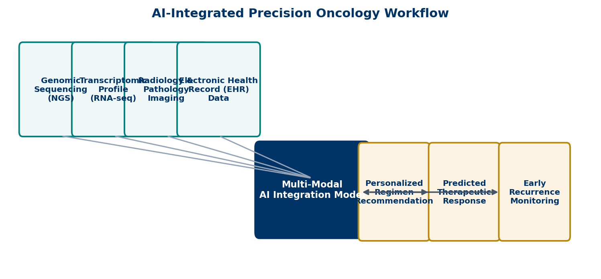

**Figure 6.2 — AI-Integrated Precision Oncology Workflow.**

*Genomic, transcriptomic, imaging, and EHR data streams feed a multi-modal integration model, which outputs a personalized regimen recommendation, a predicted therapeutic response probability, and an early recurrence-monitoring signal.*

### 6.2.2 Digital Pathology at Scale

Whole-slide imaging (WSI) — scanning an entire glass histopathology slide into a single very-high-resolution digital file — has enabled AI models to review tissue at a scale no pathologist could match manually, screening every field of a slide for mitotic figures, tumor margins, or lymph node micrometastases rather than the representative sampling a human reader relies on under time constraints.

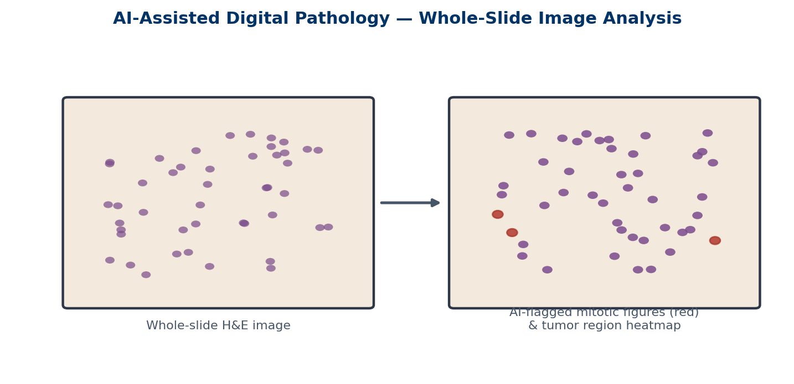

**Figure 6.3 — AI-Assisted Digital Pathology.**

*Left: a whole-slide hematoxylin and eosin (H&E) image. Right: the same field with AI-flagged mitotic figures (red) overlaid on an automatically generated tumor-region density map, supporting faster and more consistent grading.*

## 6.3 Internal Medicine, Endocrinology & Neurology

Chronic disease management in internal medicine and its subspecialties benefits from AI less through single dramatic diagnostic calls and more through continuous, longitudinal monitoring and dosing optimization — tasks that reward an algorithm's ability to process dense time-series data without fatigue.

### 6.3.1 Closed-Loop Automated Insulin Delivery

Continuous Glucose Monitors (CGMs) measure interstitial glucose every few minutes via a subcutaneous sensor, generating a far denser data stream than intermittent fingerstick testing ever could. Paired with predictive AI algorithms, this stream feeds a closed-loop Automated Insulin Delivery (AID) system — sometimes called an "artificial pancreas" — that calculates real-time insulin micro-dosing without requiring the patient to manually calculate and administer each dose.

**Predictive Dosing:** Rather than reacting only to the current glucose value, the algorithm forecasts glucose trajectory several minutes ahead using recent rate-of-change data, allowing it to pre-emptively suspend or reduce insulin delivery before a predicted hypoglycemic event, or to deliver a small correction bolus before a predicted post-prandial spike becomes established.

**Continuous Feedback Loop:** The system re-measures glucose approximately every five minutes and continuously re-calculates the insulin infusion rate, functioning as a true closed loop between sensor, algorithm, and pump rather than a series of discrete, clinician-timed dosing decisions.

**Clinical Impact:** Randomized trials of commercially available hybrid closed-loop systems consistently show increased time spent within the target glucose range and reduced hypoglycemia compared with sensor-augmented pump therapy without automation, translating directly into reduced long-term microvascular complication risk.

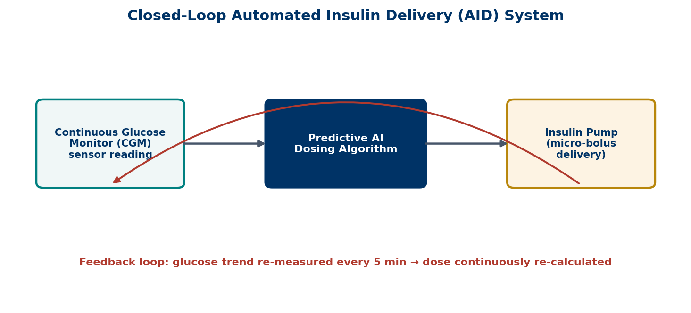

**Figure 6.4 — Closed-Loop Automated Insulin Delivery.**

*A continuous glucose monitor feeds real-time readings to a predictive AI dosing algorithm, which commands micro-bolus insulin delivery from the pump; the loop re-measures and re-calculates roughly every five minutes.*

### 6.3.2 Oculomics: Retinal Fundus Imaging as a Neurologic Biomarker

The retina is embryologically an extension of the central nervous system and is the only site in the body where small blood vessels and neural tissue can be directly visualized non-invasively. This has given rise to "oculomics" — the use of AI models trained on retinal fundus photographs to detect systemic and neurodegenerative disease signatures well beyond primary ophthalmic conditions. In neurology specifically, AI models analyze microvascular density, vessel caliber and tortuosity, and subtle patterns of retinal nerve fiber layer thinning to detect early changes associated with Alzheimer's disease and Parkinson's disease, sometimes years before clinically overt cognitive or motor symptoms emerge — reflecting shared underlying microvascular and neurodegenerative pathophysiology between the retina and the brain.

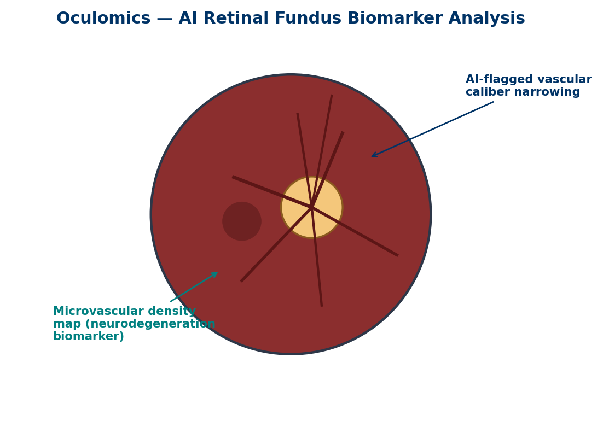

**Figure 6.5 — Oculomics: AI Retinal Fundus Biomarker Analysis.**

*AI-derived vascular caliber mapping and microvascular density quantification from a retinal fundus photograph, both explored as non-invasive early biomarkers for neurodegenerative disease.*

### 6.3.3 Additional Endocrine & Neurologic Applications

**Diabetic Retinopathy Screening:** The same fundus imaging pipeline underpins one of the most widely deployed autonomous AI diagnostic systems in medicine, which grades diabetic retinopathy severity from fundus photographs without requiring a specialist to review every image, enabling point-of-care screening in primary care and community settings.

**Seizure Prediction from EEG:** Deep learning models analyzing continuous scalp or intracranial EEG identify pre-ictal signatures that precede clinical seizure onset by minutes, supporting closed-loop neurostimulation devices and patient-facing seizure-warning systems.

**Thyroid Nodule Risk Stratification:** AI models applied to ultrasound images of thyroid nodules reproduce and standardize sonographic risk-stratification systems (such as TI-RADS-style scoring), reducing unnecessary fine-needle aspiration biopsies of low-risk nodules.

## 6.4 Additional Specialty Applications

The same underlying model families recur across nearly every remaining specialty, adapted to a domain-specific data type; a brief survey illustrates the breadth of current deployment.

### 6.4.1 Nephrology

AI models trained on longitudinal serum creatinine, urine output, and structured EHR data predict acute kidney injury (AKI) up to 24–48 hours before it would be identified by standard KDIGO creatinine criteria, allowing earlier nephrotoxin avoidance and fluid management. Separate models estimate long-term chronic kidney disease progression risk from a single set of baseline labs and demographics.

### 6.4.2 Pulmonology

Automated software quantifies emphysema extent, airway wall thickness, and pulmonary nodule characteristics on chest CT, while separate acoustic AI models classify cough sounds and analyze spirometry curves to support asthma and chronic obstructive pulmonary disease (COPD) monitoring between clinic visits, including via smartphone-based microphone recordings in some research deployments.

### 6.4.3 Psychiatry

Natural language processing models applied to clinical interview transcripts or patient-generated text, together with passive smartphone-derived behavioral markers (typing speed, mobility patterns, sleep timing), are being studied as objective adjuncts to depression and suicidality risk screening — an area that remains earlier in clinical validation and carries particular ethical weight given the sensitivity and consequences of a false result in either direction.

### 6.4.4 Ophthalmology

Beyond diabetic retinopathy, AI models grade age-related macular degeneration severity from optical coherence tomography (OCT) volumetric scans and predict which patients with intermediate disease are most likely to progress to the vision-threatening neovascular form, supporting personalized monitoring intervals rather than a uniform follow-up schedule for all patients.

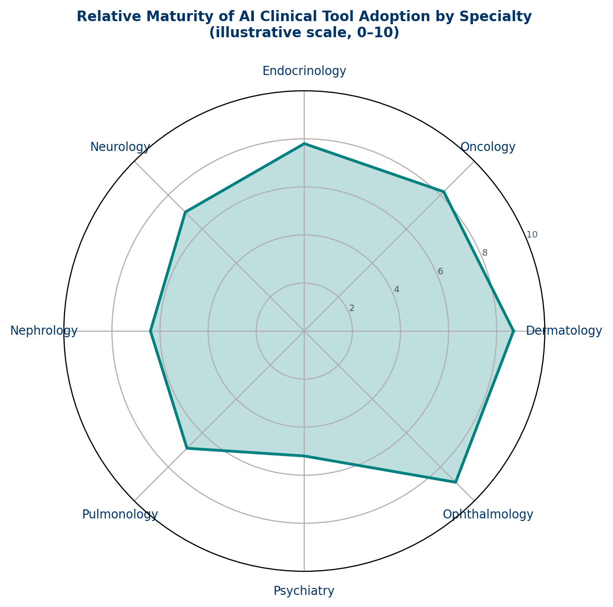

**Figure 6.6 — Relative Maturity of AI Clinical Tool Adoption by Specialty.**

*An illustrative comparison (0–10 scale) of how far AI clinical decision tools have progressed toward routine practice integration across specialties as of this writing; figures reflect general trends in regulatory clearance and adoption rather than a formal index.*

## 6.5 Validation, Bias, and Regulatory Considerations

As AI tools proliferate across specialties, the trainee should hold every model to the same basic evidentiary standard applied to any other diagnostic test: what population was it validated on, what is its sensitivity and specificity (and how do those trade off at the operating threshold actually used in practice), and how does performance change in a population that differs from the training data.

**Regulatory Pathway:** Most clinically deployed diagnostic AI tools in the United States are cleared by the FDA as Software as a Medical Device (SaMD), most commonly through the 510(k) pathway by demonstrating substantial equivalence to a predicate device, which is a lower evidentiary bar than a full premarket approval and worth knowing when evaluating a new tool's evidence base.

**Demographic Generalizability:** Because training datasets are frequently skewed toward the demographics of the health systems that generated them, external validation across age, sex, race, and skin-tone strata is essential before extending a tool's use to a population it was not primarily trained or tested on.

**Automation Bias:** Clinicians who work alongside a high-performing AI tool for an extended period can develop automation bias — an increasing tendency to defer to the algorithm's output even in cases where independent clinical judgment would flag a discrepancy — which is itself a recognized patient-safety risk requiring deliberate workflow design to counteract.

## 6.6 Future Directions

The trajectory across specialties is toward multi-modal foundation models capable of jointly reasoning over imaging, genomics, structured EHR data, and free-text clinical notes for a single patient, rather than today's landscape of narrow, single-input-single-output tools deployed piecemeal by specialty. Federated learning across health systems, standardized post-deployment performance monitoring, and clearer regulatory frameworks for continuously learning (rather than "locked") algorithms are all active areas of development that trainees entering practice over the next decade should expect to shape how these tools are validated, updated, and trusted at the bedside.

―――――――――――――――――――――――――――――――――――――――――――――――――――――――

# Chapter 6 Review & Self-Assessment Question Bank

The following 25 multiple-choice questions review core concepts in dermatologic image classification, precision oncology, endocrine closed-loop systems, neurologic oculomics, additional specialty applications, and validation/regulatory considerations covered in Chapter 6.

**Question 1: Dermatological AI models trained on dermoscopic images primarily distinguish malignant melanoma from benign nevi by learning:**

A) Patient blood type

B) Hierarchical visual features such as pigment network structure, border irregularity, and color variegation

C) Ambient room lighting conditions

D) The patient's stated family history alone

**✓ Correct Answer: B) Hierarchical visual features such as pigment network structure, border irregularity, and color variegation**

***Explanation:*** *CNNs learn progressively complex visual features from raw pixels, ultimately correlating patterns like border irregularity and pigment structure with malignancy risk.*

**Question 2: What is the primary clinical role of most currently deployed dermatology AI classification tools?**

A) Fully autonomous diagnosis without physician involvement

B) A second-reader or triage tool that flags high-risk lesions for expedited biopsy

C) Automatic prescription of topical chemotherapy

D) Replacing histopathologic confirmation entirely

**✓ Correct Answer: B) A second-reader or triage tool that flags high-risk lesions for expedited biopsy**

***Explanation:*** *Most dermatology AI systems are framed as clinical decision support, flagging concerning lesions rather than issuing autonomous final diagnoses.*

**Question 3: A known validation limitation of many dermoscopic AI models relates to:**

A) Excessive processing speed

B) Underrepresentation of darker Fitzpatrick skin types in training datasets

C) Inability to process any digital images

D) Requiring general anesthesia to operate

**✓ Correct Answer: B) Underrepresentation of darker Fitzpatrick skin types in training datasets**

***Explanation:*** *Many dermatology AI datasets are skewed toward lighter skin tones, and performance is less well validated across the full Fitzpatrick range.*

**Question 4: In precision oncology, AI models integrate which combination of data to recommend personalized treatment regimens?**

A) Genomic, transcriptomic, imaging, and EHR data

B) Only the patient's insurance billing codes

C) Weather patterns at the treatment center

D) Hospital cafeteria menu data

**✓ Correct Answer: A) Genomic, transcriptomic, imaging, and EHR data**

***Explanation:*** *Precision oncology AI platforms integrate multi-omic and clinical data streams to match tumor biology with the most likely effective therapy.*

**Question 5: What does an AI-predicted 'therapeutic response probability' in oncology primarily inform?**

A) The hospital's parking allocation

B) Shared decision-making about first-line regimen selection among guideline-concordant options

C) The patient's dietary restrictions

D) Nursing shift scheduling

**✓ Correct Answer: B) Shared decision-making about first-line regimen selection among guideline-concordant options**

***Explanation:*** *Response prediction models estimate the likelihood a given regimen will produce benefit, supporting informed treatment selection discussions.*

**Question 6: In digital pathology, AI applied to whole-slide imaging (WSI) is primarily used to:**

A) Print physical copies of glass slides

B) Automatically quantify biomarkers such as mitotic count and immunohistochemical stain intensity

C) Replace the need for tissue biopsy entirely

D) Sequence the patient's germline DNA

**✓ Correct Answer: B) Automatically quantify biomarkers such as mitotic count and immunohistochemical stain intensity**

***Explanation:*** *AI models scan entire digitized slides to quantify biomarkers like TILs, mitotic figures, and HER2/PD-L1 staining more consistently than manual sampling.*

**Question 7: What advantage does AI-assisted ctDNA (circulating tumor DNA) monitoring offer in oncologic surveillance?**

A) It eliminates the need for any follow-up visits

B) It can flag molecular signs of recurrence earlier than conventional surveillance imaging intervals

C) It replaces the need for a cancer diagnosis altogether

D) It measures blood pressure trends

**✓ Correct Answer: B) It can flag molecular signs of recurrence earlier than conventional surveillance imaging intervals**

***Explanation:*** *Liquid biopsy ctDNA trends analyzed by AI can detect recurrence signals before it would be visible on scheduled surveillance imaging.*

**Question 8: In a Closed-Loop Automated Insulin Delivery (AID) system, the predictive AI algorithm's main function is to:**

A) Replace the insulin pump hardware entirely

B) Forecast glucose trajectory and adjust insulin micro-dosing in a continuous feedback loop

C) Measure hemoglobin A1c directly from the skin

D) Administer oral hypoglycemic medications

**✓ Correct Answer: B) Forecast glucose trajectory and adjust insulin micro-dosing in a continuous feedback loop**

***Explanation:*** *AID systems use predictive algorithms to forecast glucose trends and continuously recalculate insulin delivery roughly every five minutes.*

**Question 9: How does predictive dosing in an AID system reduce hypoglycemia risk?**

A) By increasing basal insulin delivery at all times

B) By pre-emptively suspending or reducing insulin delivery before a predicted hypoglycemic event

C) By requiring the patient to fast continuously

D) By disabling the CGM sensor overnight

**✓ Correct Answer: B) By pre-emptively suspending or reducing insulin delivery before a predicted hypoglycemic event**

***Explanation:*** *Rather than reacting only to current glucose values, the algorithm forecasts trends and adjusts delivery proactively to avoid predicted lows.*

**Question 10: 'Oculomics' refers to the use of AI-analyzed retinal fundus photographs to:**

A) Correct refractive errors surgically

B) Detect systemic and neurodegenerative disease signatures beyond primary ophthalmic conditions

C) Measure intraocular pressure directly

D) Replace corrective eyeglasses

**✓ Correct Answer: B) Detect systemic and neurodegenerative disease signatures beyond primary ophthalmic conditions**

***Explanation:*** *Because the retina is a direct extension of the CNS, AI-analyzed fundus images can reveal microvascular and neurodegenerative biomarkers relevant well beyond ophthalmology.*

**Question 11: AI-based oculomic biomarkers explored for early Alzheimer's and Parkinson's disease detection include:**

A) Fingerprint ridge density

B) Retinal microvascular density, vessel caliber/tortuosity, and nerve fiber layer thinning

C) Voice pitch analysis exclusively

D) Bone mineral density on X-ray

**✓ Correct Answer: B) Retinal microvascular density, vessel caliber/tortuosity, and nerve fiber layer thinning**

***Explanation:*** *These retinal features reflect shared microvascular and neurodegenerative pathophysiology with the brain, allowing non-invasive early detection.*

**Question 12: One of the most widely deployed autonomous AI diagnostic systems in medicine performs which task?**

A) Autonomous grading of diabetic retinopathy severity from fundus photographs

B) Autonomous cardiac bypass surgery

C) Autonomous prescription of chemotherapy

D) Autonomous psychiatric diagnosis

**✓ Correct Answer: A) Autonomous grading of diabetic retinopathy severity from fundus photographs**

***Explanation:*** *Autonomous diabetic retinopathy screening systems are among the most established FDA-cleared autonomous AI diagnostic tools in routine use.*

**Question 13: AI-based seizure prediction models analyzing continuous EEG primarily aim to detect:**

A) Pre-ictal signatures that precede clinical seizure onset by minutes

B) The patient's baseline IQ

C) Sleep apnea severity

D) Retinal vessel caliber

**✓ Correct Answer: A) Pre-ictal signatures that precede clinical seizure onset by minutes**

***Explanation:*** *Deep learning EEG models identify subtle pre-ictal patterns, supporting closed-loop neurostimulation and patient warning systems.*

**Question 14: In nephrology, AI models trained on longitudinal creatinine and EHR data are primarily used to:**

A) Predict acute kidney injury (AKI) 24–48 hours before standard criteria would identify it

B) Perform dialysis catheter placement

C) Replace renal biopsy pathology

D) Calculate dietary potassium content

**✓ Correct Answer: A) Predict acute kidney injury (AKI) 24–48 hours before standard criteria would identify it**

***Explanation:*** *Predictive AKI models allow earlier nephrotoxin avoidance and fluid management before creatinine-based KDIGO criteria are met.*

**Question 15: In pulmonology, AI applied to chest CT is used to automatically quantify:**

A) Emphysema extent, airway wall thickness, and pulmonary nodule characteristics

B) Serum electrolyte concentrations

C) Cardiac ejection fraction

D) Bone marrow cellularity

**✓ Correct Answer: A) Emphysema extent, airway wall thickness, and pulmonary nodule characteristics**

***Explanation:*** *Automated CT quantification software measures structural lung changes relevant to COPD and nodule risk stratification.*

**Question 16: AI applications explored in psychiatry for depression and suicidality risk screening include:**

A) NLP analysis of clinical text and passive smartphone-derived behavioral markers

B) Direct genetic editing of the patient

C) Retinal fundus photography exclusively

D) Whole-slide pathology imaging

**✓ Correct Answer: A) NLP analysis of clinical text and passive smartphone-derived behavioral markers**

***Explanation:*** *NLP and passive digital phenotyping (typing speed, mobility, sleep timing) are being studied as objective adjuncts to psychiatric risk screening.*

**Question 17: In ophthalmology, beyond diabetic retinopathy, AI models applied to OCT scans help predict:**

A) Which intermediate age-related macular degeneration patients are most likely to progress to neovascular disease

B) The patient's blood glucose level directly

C) Cardiac arrhythmia risk

D) Renal function decline

**✓ Correct Answer: A) Which intermediate age-related macular degeneration patients are most likely to progress to neovascular disease**

***Explanation:*** *AI-based OCT analysis supports personalized monitoring intervals by predicting progression risk to vision-threatening neovascular AMD.*

**Question 18: Under what regulatory pathway are most diagnostic AI tools cleared by the FDA in the United States?**

A) Full premarket approval (PMA) exclusively

B) 510(k) clearance based on substantial equivalence to a predicate device

C) No regulatory oversight is required

D) State medical board licensing

**✓ Correct Answer: B) 510(k) clearance based on substantial equivalence to a predicate device**

***Explanation:*** *Most Software as a Medical Device (SaMD) diagnostic AI tools are cleared via the 510(k) pathway, a lower evidentiary bar than full PMA.*

**Question 19: Why is demographic generalizability testing important before deploying an AI diagnostic tool broadly?**

A) Training datasets are often skewed toward the demographics of the health systems that generated them

B) All AI models perform identically across every population by default

C) Regulatory clearance guarantees demographic generalizability

D) Demographic factors never affect model performance

**✓ Correct Answer: A) Training datasets are often skewed toward the demographics of the health systems that generated them**

***Explanation:*** *Because training data is frequently non-representative, external validation across age, sex, race, and skin-tone strata is essential before broader deployment.*

**Question 20: 'Automation bias' in clinical AI use refers to:**

A) A software bug causing random errors

B) Clinicians increasingly deferring to an algorithm's output even when independent judgment would flag a discrepancy

C) Bias introduced only during initial FDA testing

D) A form of hardware malfunction in imaging scanners

**✓ Correct Answer: B) Clinicians increasingly deferring to an algorithm's output even when independent judgment would flag a discrepancy**

***Explanation:*** *Extended reliance on a well-performing AI tool can erode independent clinical vigilance, a recognized patient-safety risk requiring deliberate workflow safeguards.*

**Question 21: What key advantage does AI-driven total-body photography offer in high-nevus-count patients?**

A) It performs biopsies automatically

B) It registers and tracks the same lesion across serial visits to flag new or changing lesions

C) It replaces dermoscopy entirely

D) It measures serum vitamin D levels

**✓ Correct Answer: B) It registers and tracks the same lesion across serial visits to flag new or changing lesions**

***Explanation:*** *Pixel-level image registration allows consistent lesion tracking across hundreds of nevi, a task poorly suited to unaided human memory.*

**Question 22: Why is thyroid nodule ultrasound AI risk-stratification clinically useful?**

A) It eliminates the need for any thyroid function testing

B) It standardizes sonographic risk scoring and reduces unnecessary fine-needle aspiration biopsies of low-risk nodules

C) It performs thyroidectomy directly

D) It measures TSH levels from an image

**✓ Correct Answer: B) It standardizes sonographic risk scoring and reduces unnecessary fine-needle aspiration biopsies of low-risk nodules**

***Explanation:*** *AI reproduces standardized sonographic risk-stratification criteria, reducing inter-observer variability and unnecessary biopsies.*

**Question 23: What is a key difference between narrow specialty-specific AI tools and emerging multi-modal foundation models?**

A) Foundation models jointly reason over imaging, genomics, EHR text, and other data types for a single patient, rather than one narrow input/output task

B) Narrow tools require no training data at all

C) Foundation models cannot process any medical images

D) There is no meaningful difference between the two

**✓ Correct Answer: A) Foundation models jointly reason over imaging, genomics, EHR text, and other data types for a single patient, rather than one narrow input/output task**

***Explanation:*** *Current tools are largely narrow and single-purpose; the field is trending toward multi-modal models that integrate diverse data types simultaneously.*

**Question 24: Why does the retina serve as a useful non-invasive proxy for central nervous system pathology?**

A) The retina is embryologically an extension of the central nervous system, allowing direct visualization of small vessels and neural tissue

B) The retina has no blood supply

C) The retina is unrelated to any neurologic structures

D) Retinal imaging requires invasive surgery

**✓ Correct Answer: A) The retina is embryologically an extension of the central nervous system, allowing direct visualization of small vessels and neural tissue**

***Explanation:*** *This embryologic relationship is why retinal imaging can reveal microvascular and neurodegenerative signals relevant to systemic and CNS disease.*

**Question 25: Before trusting any specialty AI diagnostic tool, a clinician should evaluate it primarily by:**

A) The tool's marketing materials alone

B) The population it was validated on and its sensitivity/specificity at the operating threshold used in practice

C) How visually appealing the software interface is

D) The number of unrelated awards the company has received

**✓ Correct Answer: B) The population it was validated on and its sensitivity/specificity at the operating threshold used in practice**

***Explanation:*** *AI tools should be held to the same evidentiary standard as any diagnostic test: known validation population and performance characteristics at the clinically used threshold.*

# Chapter 7: Ethics, Medicolegal Challenges & Future Horizons

> **📌 CHAPTER LEARNING OBJECTIVES & CORE OVERVIEW**
> The clinical translation of medical Artificial Intelligence (AI) necessitates rigorous ethical frameworks, transparent legal regulations, and a precise understanding of physician liability. As machine learning algorithms evolve from passive diagnostic aids to autonomous decision-support systems, medical professionals must navigate complex medicolegal landscapes, safeguard patient privacy, address algorithmic bias, and maintain ultimate clinical accountability.

## 7.1 Medicolegal Liability & Medical Malpractice in AI-Assisted Care

The integration of Artificial Intelligence into clinical practice alters the traditional physician-patient relationship and introduces unprecedented challenges to established legal doctrines of medical malpractice. When an AI algorithm contributes to a diagnostic delay, a missed malignant lesion on imaging, or an inappropriate surgical intervention, determining legal liability among attending physicians, health system administrators, and software developers represents a complex, rapidly evolving legal frontier.

### 7.1.1 The Legal Elements of Medical Malpractice

To establish medical malpractice under common law and international legal standards, a plaintiff (patient) must establish four essential legal elements by a preponderance of the evidence:

- **1. Duty of Care:** The physician owed a formal duty of care to the patient through an established clinical relationship.

- **2. Breach of Duty:** The physician failed to conform to the accepted standard of medical care expected of a reasonably prudent physician under similar clinical circumstances.

- **3. Causation:** The physician's breach of duty directly caused, or substantially contributed to, the patient's injury (proximate cause).

- **4. Quantifiable Damages:** The patient suffered quantifiable physical, financial, or emotional harm as a result of the breach.

In AI-assisted care, the primary legal battleground revolves around defining the 'Standard of Care'. Is the standard determined by traditional human expert consensus, or does failing to use an FDA-cleared AI tool that possesses superior diagnostic accuracy constitute a breach of standard care?

### 7.1.2 Liability Distribution: The Tripartite Model

When an AI system fails or generates an erroneous recommendation leading to patient harm, potential liability is evaluated across three primary stakeholder categories:

- **A. The Attending Physician & Clinical Team:** Under current legal consensus worldwide, AI systems are classified as auxiliary decision-support software rather than autonomous clinical practitioners. Consequently, final clinical authority and medical accountability reside with the licensed human clinician. The legal doctrine of the 'Learned Intermediary' holds that clinicians must exercise independent medical judgment and evaluate AI output prior to executing diagnostic or therapeutic plans. A physician cannot escape liability simply by claiming, 'The algorithm made the wrong diagnosis.'

- **B. Software Developers & AI Vendors:** Software vendors may face legal exposure under Product Liability law (e.g., strict liability, negligence, or breach of warranty) if an algorithm suffers from inherent design defects, coding errors, insufficient training data diversity, or algorithmic drift. However, demonstrating a product defect in complex deep learning models remains legally challenging due to the 'black-box' nature of neural networks.

- **C. Healthcare Institutions & Health Systems:** Hospitals, academic medical centers, and clinical networks can be held vicariously liable under the doctrine of 'Respondeat Superior' for the actions of employed physicians. Additionally, healthcare institutions face direct 'Corporate Negligence' claims if they deploy unvalidated AI software, fail to adequately train medical staff, maintain faulty IT hardware, or lack appropriate credentialing guidelines for AI technology.

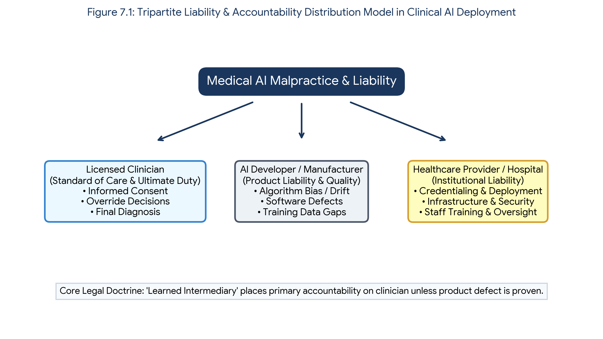

*Figure 7.1: Tripartite Liability & Accountability Distribution Model across Clinicians, Software Developers, and Healthcare Institutions.*

### 7.1.3 Clinical Scenarios: Automation Bias vs. Overreliance

Clinicians utilizing AI systems face two diametrically opposed cognitive and medicolegal risks:

- **1. Automation Bias (Uncritical Overreliance):** Occurs when a clinician uncritically accepts an incorrect AI recommendation, ignoring clinical intuition, patient history, or subtle physical signs. For example, if a chest radiograph AI fails to detect a subtle pneumothorax and the physician signs off on a normal report without inspecting the image, the physician is fully liable for negligent oversight.

- **2. Automation Dismissal / Override Negligence:** Occurs when a clinician dismisses a correct, high-confidence AI alert due to skepticism or alarm fatigue. If an AI triage system correctly flags an acute intracranial hemorrhage on a non-contrast CT head scan, but the radiologist overrides the alert without thorough review, delaying emergency neurosurgical intervention, the clinician faces severe malpractice liability for failing to respond to available diagnostic data.

> **📌 MEDICOLEGAL RISK MANAGEMENT PRINCIPLE**
> Clinical Pearl: The legal standard requires clinicians to treat AI output as a 'second opinion' or an auxiliary consulting tool. Clinicians must document their clinical reasoning when agreeing with or overriding an AI system's recommendation.

## 7.2 Patient Data Privacy, Confidentiality & Informed Consent

Developing, fine-tuning, and validating robust medical AI models requires vast datasets comprising millions of electronic health records (EHRs), high-resolution radiological images, genomic sequences, and histopathology slides. The extraction, aggregation, and secondary use of health data raise profound ethical concerns regarding patient autonomy, privacy rights, and potential commercial exploitation.

### 7.2.1 Regulatory Frameworks: HIPAA, GDPR, and Global Legislation

Medical AI training and deployment must strictly comply with regional and international data protection laws that govern Protected Health Information (PHI) and Personally Identifiable Information (PII):

- **A. Health Insurance Portability and Accountability Act (HIPAA - USA):** Enacted in the United States, HIPAA mandates the protection of PHI through the Privacy and Security Rules. Under the HIPAA Safe Harbor method, datasets are considered de-identified only after removing 18 specific personal identifiers, including names, geographic subdivisions smaller than a state, dates (birth, admission, discharge), telephone numbers, biometric identifiers, and full-face photographic images.

- **B. General Data Protection Regulation (GDPR - European Union):** Enforced in the European Union, GDPR establishes significantly stricter privacy protections than HIPAA. GDPR considers health data as a 'special category' requiring explicit patient consent or compelling public interest. Crucially, GDPR grants individual subjects the 'Right to Explanation' regarding automated decision-making and the 'Right to be Forgotten' (data erasure), creating technical challenges for un-learning data embedded in deep neural networks.

### 7.2.2 Data Anonymization, Pseudonymization & Re-Identification Risks

While data anonymization removes direct identifiers, advanced computational techniques have revealed that true anonymization of complex multi-modal medical data is nearly impossible. Modern re-identification attacks can cross-reference 'anonymized' datasets with public registries, voter databases, or commercial data brokers to re-identify patients.

- **• Pseudonymization:** Replacing direct patient identifiers with artificial codes or pseudonyms. Although useful for research workflow, pseudonymized data remains legally protected because the key linking the code to the patient identity still exists.

- **• Facial Reconstruction from Imaging (Radiomics Risk):** High-resolution 3D CT or MRI scans of the head can be rendered into 3D facial surface models using specialized reconstruction software. Facial recognition algorithms can then match these 3D meshes to public photos, completely violating patient anonymity unless facial defacing algorithms are applied before data sharing.

- **• Differential Privacy:** A mathematical framework that adds controlled Gaussian or Laplacian 'noise' to dataset queries, enabling AI training on aggregate statistical trends while guaranteeing that no individual patient's data can be uniquely extracted.

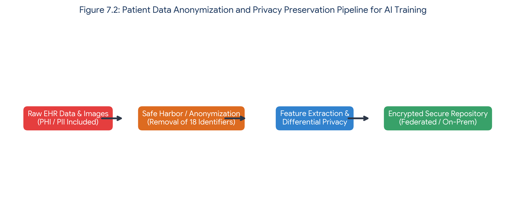

*Figure 7.2: End-to-End Patient Data Anonymization, De-Identification, and Privacy Preservation Pipeline.*

### 7.2.3 Informed Consent Models for AI Data Monetization & Research

Traditional informed consent models were designed for specific clinical trials where patients understood the exact physical risks and study boundaries. In contrast, AI dataset harvesting often involves secondary usage for commercial software development, potentially yielding substantial financial profit for academic institutions and tech corporations without rewarding patient contributors.

- **1. Broad Consent:** Patients grant broad approval for their de-identified data to be used in future un-specified medical research and AI development.

- **2. Dynamic Consent:** Patients manage digital consent preferences via patient portals, granularly selecting which medical domains (e.g., oncology, cardiology) or institutions can access their data.

- **3. Opt-Out Frameworks:** Jurisdictions automatically include patient data in research repositories unless the patient explicitly submits a formal opt-out request.

## 7.3 Explainable AI (XAI) & The 'Black Box' Problem

Deep learning architectures, particularly Deep Convolutional Neural Networks (CNNs) and Large Language Transformer Models, often consist of tens of millions to hundreds of billions of parameters. The intricate non-linear mathematical operations executed across hidden layers render these models inherently opaque—a phenomenon known as the 'Black-Box' problem.

### 7.3.1 The Imperative for Explainability in Clinical Practice

In clinical medicine, diagnostic and therapeutic recommendations require logical justification based on pathophysiological mechanisms. An opaque prediction of '98% probability of malignancy' without diagnostic rationale creates several major clinical and ethical hazards:

- **A. Inability to Audit Logic:** Clinicians cannot evaluate whether the AI is utilizing genuine pathological features or spurious background artifacts (e.g., patient positioning tags, hospital markers, or chest tube tubing).

- **B. Erosion of Patient Trust:** Patients are hesitant to undergo high-risk surgical procedures or aggressive chemotherapy based solely on an unexplainable algorithmic output.

- **C. Hidden Biases:** Opaque models obscure systemic algorithmic biases, making it difficult to detect when a model performs poorly on specific demographic sub-groups.

### 7.3.2 Methods in Explainable AI (XAI)

To bridge the interpretability gap, computer scientists and medical informaticians have developed Explainable AI (XAI) techniques tailored for healthcare applications:

- **1. Gradient-Weighted Class Activation Mapping (Grad-CAM):** Generates visual heatmaps highlighting the exact pixel regions in an image (e.g., x-ray or mammogram) that contributed most significantly to the neural network's final classification.

- **2. SHAP (Shapley Additive exPlanations) & LIME:** Calculates the relative weight and influence of each clinical feature (e.g., blood pressure, serum creatinine, age, troponin levels) on the model's overall predictive output.

- **3. Attention Mechanisms:** Used in Transformer-based architectures to dynamically highlight key clinical terms and phrases within unstructured medical notes that led to a specific diagnostic conclusion.

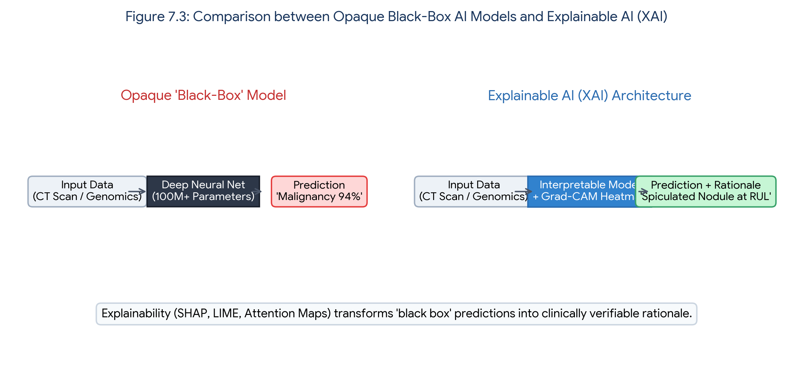

*Figure 7.3: Structural Comparison between Opaque Black-Box Models and Explainable AI (XAI) Frameworks.*

## 7.4 Algorithmic Bias, Fairness & Health Equity

Artificial Intelligence algorithms do not operate in a moral or social vacuum. AI models learn patterns from historical medical data. If historical data reflects disparities in healthcare access, under-representation of minority demographics, or institutional systemic bias, the AI model will inevitably encode, perpetuate, and amplify these inequities at scale.

### 7.4.1 Sources of Bias in Medical AI Datasets

- **1. Sampling & Demographic Bias:** Occurs when training data is predominantly collected from wealthy urban academic medical centers, under-representing rural populations, low-income communities, and racial minorities. For instance, skin cancer detection algorithms trained primarily on Light-skinned (Fitzpatrick Types I-III) individuals exhibit significantly lower diagnostic sensitivity when evaluated on darker skin tones (Fitzpatrick Types IV-VI).

- **2. Measurement & Practice Bias:** Occurs when clinical diagnostic protocols differ across resource-rich and resource-limited settings, leading the AI to associate health outcomes with resource utilization rather than actual disease severity.

### 7.4.2 Case Study: The Commercial Healthcare Algorithm Bias (Obermeyer et al.)

A landmark 2019 study published in Science revealed severe racial bias in a commercial algorithm used by major U.S. health systems to identify patients with complex health needs for high-risk care management programs. The algorithm used 'future health care costs' as a proxy for 'health need'. Because less financial investment was historically spent on Black patients relative to White patients with the same level of chronic disease, the algorithm incorrectly concluded that Black patients were healthier, reducing by over 50% the number of Black patients enrolled in specialized care management.

### 7.4.3 Strategies for Mitigating Algorithmic Bias

- **• Diverse Data Representation:** Mandating diverse, multi-institutional dataset collection encompassing varied ethnicities, genders, and socioeconomic backgrounds.

- **• Demographic Subgroup Disaggregation:** Continuously evaluating model performance (sensitivity, specificity, PPV) across demographic subgroups prior to clinical rollout.

- **• Fairness-Aware Machine Learning:** Utilizing algorithmic debiasing during model training to ensure predictions remain independent of protected attributes like race or gender.

## 7.5 Regulatory Frameworks & Software as a Medical Device (SaMD)

National and international regulatory bodies are tasked with verifying that clinical AI applications are safe, effective, and ethically sound prior to commercialization. AI software intended for medical diagnostic or therapeutic purposes is classified legally as 'Software as a Medical Device' (SaMD).

### 7.5.1 FDA Regulatory Pathways for AI/ML (United States)

The U.S. Food and Drug Administration (FDA) regulates AI SaMD primarily through three pathways:

- **1. 510(k) Clearance:** For low-to-moderate risk AI devices that demonstrate 'substantial equivalence' to an existing legally marketed predicate device.

- **2. De Novo Classification:** For novel AI technologies of low-to-moderate risk that have no pre-existing predicate device on the market.

- **3. Premarket Approval (PMA):** For high-risk AI applications (e.g., life-sustaining software or autonomous critical care tools) requiring rigorous prospective clinical trial evidence.

### 7.5.2 The Challenge of Locked vs. Adaptive / Continuous Learning Algorithms

Traditional medical devices are static; their code does not change after manufacture. In contrast, advanced AI algorithms thrive on continuous re-learning from new data. Regulatory agencies distinguish between:

- **• Locked Algorithms:** Algorithms that provide fixed outputs for a given input. The software code remains identical until a formal update is submitted for regulatory re-evaluation.

- **• Adaptive / Continuous Learning Algorithms:** Algorithms that continuously adapt and update their parameters in real-time based on new patient data. To govern adaptive algorithms, the FDA established the 'Predetermined Change Control Plan' (PCCP), requiring developers to outline expected algorithmic modifications and monitoring protocols in advance.

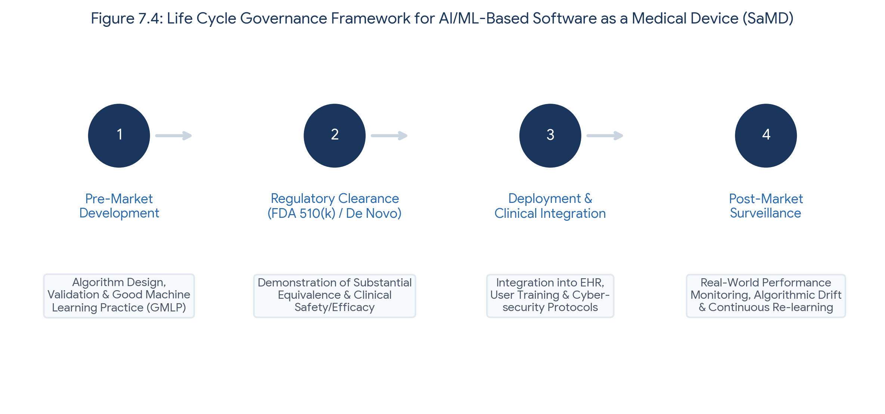

*Figure 7.4: Life Cycle Governance Framework for AI/ML-Based Software as a Medical Device (SaMD).*

## 7.6 Future Horizons: Generative AI, Robotics & Autonomous Care

The horizon of medical AI extends far beyond pattern recognition and retrospective risk stratification. The emergence of Generative AI, Large Language Models (LLMs), multimodality Foundation Models, and autonomous surgical robotics promises to revolutionize healthcare delivery while introducing novel ethical challenges.

### 7.6.1 Generative AI & Large Language Models in Medicine

LLMs (e.g., GPT-4, Med-PaLM) demonstrate impressive capabilities in clinical documentation, medical literature synthesis, and diagnostic reasoning. However, clinical implementation requires mitigating serious risks:

- **1. Hallucinations:** The generation of plausible-sounding but factually incorrect or fabricated medical information, which can lead to severe clinical errors if unverified.

- **2. Data Leakage:** Third-party commercial LLMs must not process unencrypted patient health data without strict enterprise data-use agreements.

- **3. Administrative Augmentation:** Automating discharge summaries and clinical notes saves hours of administrative burden, but requires mandatory human physician review.

### 7.6.2 Autonomous Surgical Robotics & Triage Systems

Current surgical robotics (e.g., da Vinci Surgical System) are fully human-controlled master-slave manipulators. Future horizons involve Level 3 and Level 4 autonomous robotics capable of executing specific surgical tasks (e.g., soft tissue suturing or intestinal anastomosis) independently under physician supervision.

- **• Autonomous Surgical Risk:** Defining liability when an autonomous surgical robot inflicts unintended tissue trauma due to sensor noise or anatomical variations.

- **• Ethical Resource Allocation:** AI systems prioritizing emergency department patients must ensure fairness across triage categories without biased scoring.

### 7.6.3 Preserving Human Empathy in High-Tech Medicine

As AI tools automate diagnostic interpretation and administrative workflows, the fundamental mission of medical education is to reinforce human empathy, active listening, compassionate communication, and ethical leadership. Technology must serve to enhance—not replace—the sacred therapeutic relationship between clinician and patient.

## 7.7 Chapter Summary & Core Medicolegal Matrix

| **Domain** | **Primary Medicolegal / Ethical Risk** | **Required Mitigation Strategy** |
| --- | --- | --- |
| Malpractice & Liability | Automation bias, clinical oversight failure, diagnostic delay | Clinician maintains final authority; document clinical rationale for AI adherence/override. |
| Data Privacy & Consent | Re-identification attacks, unauthorized PHI data harvesting | Strict HIPAA/GDPR compliance, Safe Harbor de-identification, differential privacy, dynamic consent. |
| Algorithm Transparency | 'Black-box' opacity leading to loss of clinician trust & unexplainable errors | Implement Explainable AI (XAI) tools: Grad-CAM heatmaps, SHAP feature importance, attention maps. |
| Algorithmic Equity | Bias perpetuation, health disparities in under-represented minority populations | Diverse multi-center training datasets, subgroup disaggregated performance testing, AI debiasing. |
| Regulatory Compliance | Algorithmic drift, unvalidated software deployment, patient harm | FDA SaMD pathways (510k, De Novo), Good Machine Learning Practice (GMLP), PCCP for adaptive models. |

## 7.8 Student Review & Self-Assessment Questions

- **Q1 (Short Answer):** Describe the four legal elements of medical malpractice. How does the 'Learned Intermediary' doctrine apply when a physician misdiagnoses a condition using an FDA-cleared AI diagnostic software?

- **Q2 (Comparative Analysis):** Differentiate between HIPAA Safe Harbor de-identification and GDPR consent requirements. Why does facial reconstruction from 3D head CT scans present a new privacy challenge?

- **Q3 (Clinical Reasoning):** Explain how 'Automation Bias' and 'Automation Dismissal' represent opposite sides of clinical cognitive errors in AI-assisted radiology.

- **Q4 (Regulatory Framework):** What is the difference between 'Locked' and 'Adaptive' machine learning algorithms, and how does the FDA's Predetermined Change Control Plan (PCCP) regulate continuous learning models?

**Complete Question Bank Overview (Questions 1–25)**

**Q1. A 54-year-old male undergoes a screening chest radiograph. An FDA-cleared AI tool flags the radiograph as 'Normal'. The radiologist accepts the finding without manual review and signs the report. Six months later, the patient presents with Stage III NSCLC from a 9 mm nodule visible on the initial image. Under current legal standards, who holds primary malpractice liability?**

(A) The AI software developer, under strict product liability.

(B) The attending radiologist, under the 'Learned Intermediary' doctrine.

(C) The hospital administration, for deploying an inaccurate AI algorithm.

(D) The FDA, for clearing software with a false-negative rate.

(E) The medical device distributor, under commercial warranty breach.

**Model Answer:** **(B) The attending radiologist, under the 'Learned Intermediary' doctrine.**

*Rationale:* Under the 'Learned Intermediary' doctrine, AI algorithms function as decision-support tools. Licensed physicians retain ultimate diagnostic responsibility and must independently review clinical data.

**Q2. Which legal doctrine establishes that a physician is liable if they blindly follow an AI algorithm's erroneous clinical recommendation without independent verification?**

(A) Res Ipsa Loquitur

(B) Automation Bias Negligence

(C) Learned Intermediary Doctrine

(D) Vicarious Liability

(E) Strict Product Liability

**Model Answer:** **(B) Automation Bias Negligence**

*Rationale:* Automation Bias Negligence occurs when a clinician uncritically accepts automated recommendations, overriding independent professional judgment and breaching the standard of care.

**Q3. A hospital system deploys an in-house diagnostic AI that was never submitted for commercial regulatory approval. If a patient is injured due to a software flaw, which legal theory primarily exposes the hospital system to direct corporate liability?**

(A) Strict Product Liability

(B) Corporate Negligence in System Design and Credentialing

(C) Vicarious Medical Malpractice

(D) Breach of Breach-Notification Rule

(E) Third-Party Contributory Negligence

**Model Answer:** **(B) Corporate Negligence in System Design and Credentialing**

*Rationale:* Hospitals deploying unvalidated or in-house non-cleared algorithms face direct corporate negligence for failing to ensure system safety and clinical governance.

**Q4. Under the HIPAA Safe Harbor standard for data de-identification, which of the following dataset elements MUST be completely removed or generalized?**

(A) Patient biological sex

(B) Geographic subdivisions smaller than a State (e.g., ZIP codes)

(C) ICD-10 diagnostic codes

(D) Primary language spoken

(E) Systolic blood pressure values

**Model Answer:** **(B) Geographic subdivisions smaller than a State (e.g., ZIP codes)**

*Rationale:* HIPAA Safe Harbor mandates the removal of 18 specific identifiers, including geographic units smaller than a state, dates (except year), and full-face photos.

**Q5. A 3D volumetric head CT dataset has all 18 HIPAA identifiers removed. Why might it still fail privacy standards under advanced algorithmic re-identification risks?**

(A) CT datasets retain hidden DICOM metadata that cannot be deleted.

(B) Specialized software can reconstruct 3D facial surface meshes for biometric matching.

(C) Hounsfield units inherently encode genetic markers.

(D) Radiological noise patterns function as unique patient signatures.

(E) Voxel intensity directly reveals social security numbers.

**Model Answer:** **(B) Specialized software can reconstruct 3D facial surface meshes for biometric matching.**

*Rationale:* High-resolution 3D CT/MRI scans allow accurate 3D facial mesh rendering, enabling facial recognition algorithms to match patients with public photograph databases.

**Q6. Which technical privacy framework guarantees mathematical privacy by injecting controlled noise into training data, ensuring an individual's presence cannot be inferred?**

(A) K-Anonymity

(B) L-Diversity

(C) Differential Privacy

(D) Homomorphic Encryption

(E) SHA-256 Hashing

**Model Answer:** **(C) Differential Privacy**

*Rationale:* Differential Privacy injects calibrated mathematical noise into dataset queries or model updates, providing a provable upper bound on privacy loss.

**Q7. Under the European Union General Data Protection Regulation (GDPR), which patient right poses a severe technical hurdle for deep learning models trained on patient data?**

(A) Right to Data Portability

(B) Right to be Forgotten (Data Erasure)

(C) Right to Emergency Treatment

(D) Right to Health Literacy

(E) Right to Multi-Center Data Access

**Model Answer:** **(B) Right to be Forgotten (Data Erasure)**

*Rationale:* The 'Right to be Forgotten' requires complete data erasure. Removing an individual's specific data points from billions of trained neural network parameters ('machine unlearning') is technically complex.

**Q8. Which Explainable AI (XAI) technique generates visual pixel-level heatmaps specifically for convolutional neural networks in medical imaging?**

(A) SHAP (Shapley Additive exPlanations)

(B) Grad-CAM (Gradient-Weighted Class Activation Mapping)

(C) LIME (Local Interpretable Model-agnostic Explanations)

(D) Decision Tree Extraction

(E) Linear Regression Coefficients

**Model Answer:** **(B) Grad-CAM (Gradient-Weighted Class Activation Mapping)**

*Rationale:* Grad-CAM calculates gradient signals entering the final convolutional layer to generate a coarse visual localization heatmap highlighting decisive image regions.

**Q9. A clinician uses an AI tool to predict sepsis mortality. The tool provides Shapley values for each clinical feature. What do Shapley values represent?**

(A) The probability that the model is hallucinating.

(B) The marginal contribution of each specific clinical feature to the final prediction outcome.

(C) The exact statistical p-value of the clinical dataset.

(D) The computational speed of model execution in milliseconds.

(E) The rate of algorithmic parameter drift over time.

**Model Answer:** **(B) The marginal contribution of each specific clinical feature to the final prediction outcome.**

*Rationale:* Derived from cooperative game theory, SHAP values quantify the exact positive or negative mathematical contribution of each individual feature toward a specific prediction.

**Q10. What is the primary clinical risk associated with using unexplainable 'Black-Box' deep learning models in critical intensive care decision-making?**

(A) High computational cost of running inference.

(B) Inability for clinicians to verify whether predictions are based on valid pathology or spurious artifacts.

(C) Failure of the model to generate quantitative outputs.

(D) Incompatibility with electronic health record user interfaces.

(E) Excessive generation of high-resolution graphic figures.

**Model Answer:** **(B) Inability for clinicians to verify whether predictions are based on valid pathology or spurious artifacts.**

*Rationale:* Black-box models may rely on spurious confounders (e.g., hospital mark tags or chest tube presence) rather than true underlying pathology, leading to catastrophic errors when deployed in new settings.

**Q11. In the landmark 2019 study by Obermeyer et al., a commercial healthcare algorithm under-selected Black patients for extra care management. What was the cause of this bias?**

(A) Race was explicitly programmed with a negative weighting coefficient.

(B) The model used historical healthcare expenditures (costs) as a proxy for health need.

(C) The dataset contained only male patient clinical records.

(D) The neural network contained insufficient hidden layers.

(E) Black patients had lower overall rates of chronic disease in the dataset.

**Model Answer:** **(B) The model used historical healthcare expenditures (costs) as a proxy for health need.**

*Rationale:* Because less money was historically spent on Black patients due to systemic access barriers, using historical cost as a proxy for health need severely underestimated the severity of illness in Black patients.

**Q12. A dermatology AI model trained exclusively on light skin tones (Fitzpatrick Types I–II) is deployed in a diverse population. What is the expected clinical consequence?**

(A) Uniform diagnostic accuracy across all skin tones.

(B) Significantly higher false-negative rates for malignant melanoma in darker skin tones (Fitzpatrick Types IV–VI).

(C) Automated self-correction of algorithmic weights upon encountering dark skin images.

(D) Improved diagnostic sensitivity for rare dermatological lesions.

(E) Complete failure of the image capture hardware.

**Model Answer:** **(B) Significantly higher false-negative rates for malignant melanoma in darker skin tones (Fitzpatrick Types IV–VI).**

*Rationale:* Sampling bias leads to poor out-of-distribution performance, causing elevated false-negative rates for dark skin types due to under-representation in training sets.

**Q13. Which statistical strategy ensures an AI algorithm maintains equal performance metrics across all demographic subgroups before clinical deployment?**

(A) Dataset Pooling

(B) Subgroup Performance Disaggregation and Stratified Auditing

(C) Global Metric Averaging

(D) Principal Component Reduction

(E) Unsupervised Feature Clustering

**Model Answer:** **(B) Subgroup Performance Disaggregation and Stratified Auditing**

*Rationale:* Evaluating models across disaggregated demographic subgroups prevents hidden performance disparities that are typically masked by aggregate population averages.

**Q14. Under FDA Software as a Medical Device (SaMD) classifications, an AI tool designed to automatically flag acute intracranial hemorrhage for immediate triage is classified under which risk tier?**

(A) Class I (Low Risk / General Controls)

(B) Class II (Moderate-to-High Risk / Special Controls)

(C) Class III (High Risk / Premarket Approval)

(D) Exempt Wellness Software

(E) Non-regulated Administrative Tool

**Model Answer:** **(B) Class II (Moderate-to-High Risk / Special Controls)**

*Rationale:* Radiological triage and diagnostic CAD software for critical conditions are typically classified as Class II devices requiring 510(k) clearance or De Novo classification.

**Q15. What is the primary operational difference between a 'Locked Algorithm' and an 'Adaptive / Continuous Learning Algorithm' in medical AI?**

(A) Locked algorithms require internet connectivity; adaptive algorithms run offline.

(B) Locked algorithms produce static outputs for identical inputs; adaptive algorithms continuously update parameters based on incoming patient data.

(C) Locked algorithms are governed by HIPAA; adaptive algorithms are governed by GDPR.

(D) Locked algorithms apply only to text; adaptive algorithms apply only to imaging.

(E) Locked algorithms never experience software bugs.

**Model Answer:** **(B) Locked algorithms produce static outputs for identical inputs; adaptive algorithms continuously update parameters based on incoming patient data.**

*Rationale:* Locked algorithms change only during discrete vendor software updates, whereas adaptive algorithms update their internal parameters in real time as new patient data is processed.

**Q16. Which FDA regulatory mechanism permits AI developers to establish pre-specified protocols for future model modifications without requiring a new clearance submission?**

(A) Real-World Evidence (RWE) Audit

(B) Predetermined Change Control Plan (PCCP)

(C) 510(k) Exemption Protocol

(D) Emergency Use Authorization (EUA)

(E) Post-Market Surveillance Waiver

**Model Answer:** **(B) Predetermined Change Control Plan (PCCP)**

*Rationale:* The FDA's PCCP framework allows manufacturers to outline planned algorithmic modifications and retraining boundaries in the original submission.

**Q17. What clinical phenomenon occurs when a Large Language Model (LLM) generates plausible-sounding but factually incorrect or fabricated medical information?**

(A) Algorithmic Drift

(B) Model Hallucination

(C) Overfitting

(D) Gradient Vanishing

(E) Data Leakage

**Model Answer:** **(B) Model Hallucination**

*Rationale:* Hallucination occurs when an LLM generates authoritative-sounding but completely fabricated assertions, poses, citations, or clinical guidelines.

**Q18. When deploying a Generative AI clinical documentation assistant, what primary data security risk occurs if patient encounters are processed via public unencrypted APIs?**

(A) Data Poisoning

(B) Unauthorized Patient PHI Interception and Model Training Retainment

(C) Catastrophic Forgetting

(D) Model Inversion Latency

(E) Prompt Injection Invisibility

**Model Answer:** **(B) Unauthorized Patient PHI Interception and Model Training Retainment**

*Rationale:* Transmitting PHI over non-secure commercial APIs risks unauthorized data logging, privacy breaches, and illegal usage of PHI for public model re-training.

**Q19. Which prompt engineering technique involves providing an LLM with several exemplar clinical cases and reasoning steps prior to generating a diagnostic response?**

(A) Zero-Shot Prompting

(B) Few-Shot Chain-of-Thought Prompting

(C) Recursive Hyperparameter Tuning

(D) Latent Space Embedding

(E) Temperature Maximization

**Model Answer:** **(B) Few-Shot Chain-of-Thought Prompting**

*Rationale:* Few-shot chain-of-thought prompting guides the model through sequential reasoning by providing concrete input-output examples prior to the target task.

**Q20. According to the standard classification for surgical robotics, what defines Level 3 Autonomy in surgical care?**

(A) The robot operates completely independently without a human surgeon present.

(B) The robot performs specific surgical sub-tasks (e.g., suturing or clamping) autonomously under continuous human surgeon supervision.

(C) The robot functions as a purely mechanical master-slave tele-manipulator.

(D) The robot provides post-operative physical therapy guidance.

(E) The robot manages operative scheduling and billing automatically.

**Model Answer:** **(B) The robot performs specific surgical sub-tasks (e.g., suturing or clamping) autonomously under continuous human surgeon supervision.**

*Rationale:* Level 3 autonomy involves conditional automation where the robotic system executes specific discrete task steps autonomously while under active human oversight.

**Q21. In an autonomous robotic drug delivery system, what critical failure mode describes an unexpected change in patient physiology causing the control algorithm to destabilize?**

(A) Cyber-Attacker Hijacking

(B) Distributional Shift / Out-of-Bound Sensor Drift

(C) Hardware Joint Dislocation

(D) Battery Depletion Failure

(E) Optical Camera Smudging

**Model Answer:** **(B) Distributional Shift / Out-of-Bound Sensor Drift**

*Rationale:* Distributional shift occurs when real-time physiological inputs fall outside the parametric bounds encountered during algorithm training, triggering destabilization.

**Q22. A physician routinely overrides accurate AI alerts due to an excessive volume of non-critical pop-up warnings. What clinical problem is this physician experiencing?**

(A) Automation Bias

(B) Alarm Fatigue leading to Automation Dismissal

(C) Confirmation Bias

(D) Technological Phobia

(E) Anchoring Heuristic

**Model Answer:** **(B) Alarm Fatigue leading to Automation Dismissal**

*Rationale:* Alarm fatigue occurs when frequent, low-priority notifications desensitize clinicians, leading to dangerous override and dismissal of high-priority critical alerts.

**Q23. Which ethical principle in medical education is compromised if trainees rely on AI assistants to generate clinical diagnoses without developing core diagnostic reasoning?**

(A) Non-Maleficence

(B) Epistemic Competence and Autonomy Development

(C) Distributive Justice

(D) Procedural Efficiency

(E) Beneficence

**Model Answer:** **(B) Epistemic Competence and Autonomy Development**

*Rationale:* Over-reliance on automated tools during formative training undermines epistemic autonomy and critical clinical reasoning skills necessary for independent practice.

**Q24. What is the recommended operational configuration for clinical deployment of AI diagnostic tools in high-stakes clinical scenarios?**

(A) Fully Autonomous Mode (No Human in the Loop)

(B) Human-in-the-Loop (Clinician-AI Teaming with Mandatory Review)

(C) AI as Primary Decision Maker with Physician as Backup

(D) Unsupervised Asynchronous Batch Processing

(E) Direct Patient Self-Triage without Clinical Verification

**Model Answer:** **(B) Human-in-the-Loop (Clinician-AI Teaming with Mandatory Review)**

*Rationale:* Human-in-the-loop ensures that AI functions exclusively as decision support, requiring qualified clinical verification prior to execution.

**Q25. Which foundational medical ethics principle is directly prioritized when implementing robust encryption, access controls, and de-identification for patient AI datasets?**

(A) Justice

(B) Autonomy and Non-Maleficence (Protecting Patient Privacy and Trust)

(C) Paternalism

(D) Utility Maximization

(E) Futility

**Model Answer:** **(B) Autonomy and Non-Maleficence (Protecting Patient Privacy and Trust)**

*Rationale:* Protecting data privacy honors patient autonomy (respect for personal data) and non-maleficence (preventing harm from data exposure or discrimination).

# References

# Chapter 1 — Fundamentals of AI in Healthcare

1. Topol EJ. High-performance medicine: the convergence of human and artificial intelligence. Nat Med. 2019;25(1):44-56.

2. Esteva A, Robicquet A, Ramsundar B, et al. A guide to deep learning in healthcare. Nat Med. 2019;25(1):24-29.

3. Rajpurkar P, Chen E, Banerjee O, Topol EJ. AI in health and medicine. Nat Med. 2022;28(1):31-38.

# Chapter 2 — AI in Diagnostic Radiology & Medical Imaging

4. Litjens G, Kooi T, Bejnordi BE, et al. A survey on deep learning in medical image analysis. Med Image Anal. 2017;42:60-88.

5. Rajpurkar P, Irvin J, Zhu K, et al. CheXNet: radiologist-level pneumonia detection on chest X-rays with deep learning. arXiv:1711.05225. 2017.

6. McKinney SM, Sieniek M, Godbole V, et al. International evaluation of an AI system for breast cancer screening. Nature. 2020;577(7788):89-94.

7. Aggarwal R, Sounderajah V, Martin G, et al. Diagnostic accuracy of deep learning in medical imaging: a systematic review and meta-analysis. NPJ Digit Med. 2021;4:65.

# Chapter 3 — AI in Clinical Pathology & Automated Laboratory Diagnostics

8. Campanella G, Hanna MG, Geneslaw L, et al. Clinical-grade computational pathology using weakly supervised deep learning on whole slide images. Nat Med. 2019;25(8):1301-1309.

9. Bera K, Schalper KA, Rimm DL, et al. Artificial intelligence in digital pathology - new tools for diagnosis and precision oncology. Nat Rev Clin Oncol. 2019;16(11):703-715.

10. Niazi MKK, Parwani AV, Gurcan MN. Digital pathology and artificial intelligence. Lancet Oncol. 2019;20(5):e253-e261.

# Chapter 4 — AI in Surgery & Surgical Robotics

11. Hashimoto DA, Rosman G, Rus D, Meireles OR. Artificial intelligence in surgery: promises and perils. Ann Surg. 2018;268(1):70-76.

12. Bhandari M, Zeffiro T, Reddiboina M. Artificial intelligence and robotic surgery: current perspective and future directions. Curr Opin Urol. 2020;30(1):48-54.

13. Maier-Hein L, Vedula SS, Speidel S, et al. Surgical data science for next-generation interventions. Nat Biomed Eng. 2017;1(9):691-696.

# Chapter 5 — AI in Interventional Medicine & Cardiology

14. Attia ZI, Kapa S, Lopez-Jimenez F, et al. Screening for cardiac contractile dysfunction using an artificial intelligence-enabled electrocardiogram. Nat Med. 2019;25(1):70-74.

15. Krittanawong C, Zhang H, Wang Z, Aydar M, Kitai T. Artificial intelligence in precision cardiovascular medicine. J Am Coll Cardiol. 2017;69(21):2657-2664.

16. Dey D, Slomka PJ, Leeson P, et al. Artificial intelligence in cardiovascular imaging: JACC state-of-the-art review. J Am Coll Cardiol. 2019;73(11):1317-1335.

# Chapter 6 — AI Applications Across Clinical Medical Specialties

17. Gulshan V, Peng L, Coram M, et al. Development and validation of a deep learning algorithm for detection of diabetic retinopathy in retinal fundus photographs. JAMA. 2016;316(22):2402-2410.

18. Esteva A, Kuprel B, Novoa RA, et al. Dermatologist-level classification of skin cancer with deep neural networks. Nature. 2017;542(7639):115-118.

19. Obermeyer Z, Powers B, Vogeli C, Mullainathan S. Dissecting racial bias in an algorithm used to manage the health of populations. Science. 2019;366(6464):447-453.

20. Haug CJ, Drazen JM. Artificial intelligence and machine learning in clinical medicine, 2023. N Engl J Med. 2023;388(13):1201-1208.

**Regulatory, Ethical & Governance References**

21. U.S. Food and Drug Administration. Artificial Intelligence/Machine Learning (AI/ML)-Based Software as a Medical Device (SaMD) Action Plan. 2021.

22. World Health Organization. Ethics and governance of artificial intelligence for health: WHO guidance. Geneva: WHO; 2021.

23. Char DS, Shah NH, Magnus D. Implementing machine learning in health care - addressing ethical challenges. N Engl J Med. 2018;378(11):981-983.