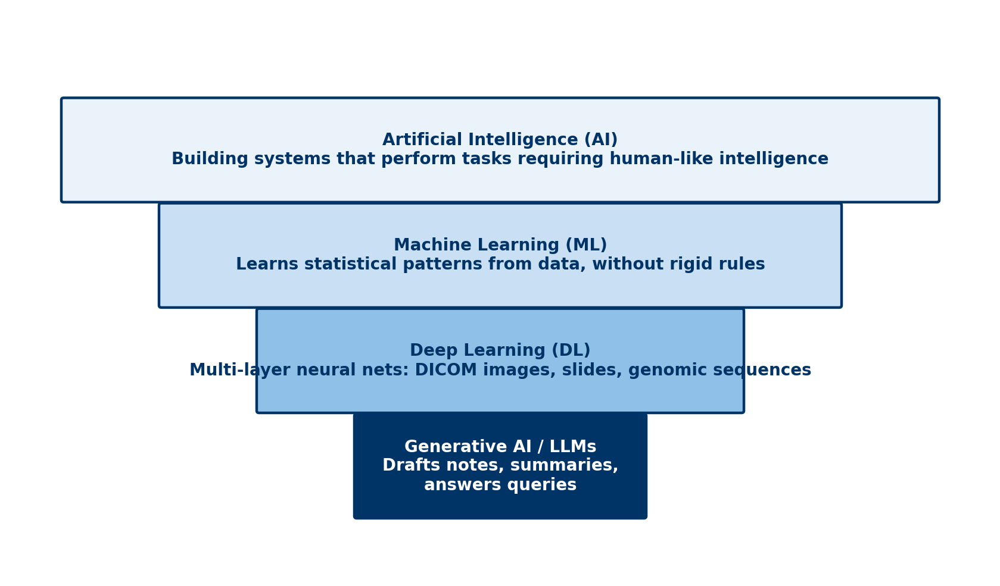

# Chapter 1: What AI Is — and Isn't

## Opening Case
It is late at night. Lina Osei, a 20-year-old student, sees that a mole on her arm looks bigger. She opens a chatbot on her phone. She uploads a photo and asks, "Is this cancer?"

The reply comes in two seconds. It is calm and kind. It says the mole "shows some features of concern" and tells her to see a doctor.

The next morning, Lina shows the reply to a pharmacist. The pharmacist asks: "What looked at your photo, and how does it know?" This chapter answers that question.

## Learning Objectives
By the end of this chapter you will be able to:
1. [LO1] Distinguish artificial intelligence, machine learning, deep learning and generative AI.
2. [LO2] Contrast a rule-based system with a learned model.
3. [LO3] Describe three milestones in the history of AI in health care.
4. [LO4] Name one benefit and one risk of AI for each health profession.

## 1.1 Four Words You Will Hear Every Day
**Artificial intelligence** (AI) means computer systems that do tasks we link with human thinking. Examples are reading images, understanding language and making predictions.

**Machine learning** (ML) is one way to build AI. The computer is not given rules. It learns patterns from examples. The examples are called **training data**. The result is a **model**: a tool that turns an input into an output.

**Deep learning** is a type of machine learning. It uses a **neural network** with many layers. It works well with images, sound and text.

**Generative AI** makes new content, such as text or images. A **large language model** (LLM) is generative AI trained on huge amounts of text. Lina's chatbot is an LLM.

*Figure 1.1 — AI contains machine learning, which contains deep learning. Generative AI is built with deep learning.*

Think of the terms as boxes inside boxes (Figure 1.1). Every LLM uses deep learning. Not every AI system does.

## 1.2 Rules Versus Learning
Older health software used a **rule-based system**. A person writes every rule. For example: "If a patient takes warfarin and aspirin is added, show a bleeding warning." You can read the logic. But rules break when real life is messier than the rule.

A learned model works differently. It studies thousands of past prescriptions and what happened next. Then it gives a risk score for a new prescription. It can find patterns no one wrote down. It can also learn wrong or unfair patterns. And you cannot read its logic line by line.

Neither is always better. For many clinical predictions, simple statistics work as well as complex machine learning [1].

> **Medical Background in 60 Seconds:** **Clinical decision support** is software that gives a health professional advice at the moment of a decision. Examples are drug-interaction warnings, vaccine reminders and alerts for abnormal laboratory results. Some use rules. Some use machine learning.

## 1.3 A Short History
**1956 — the name.** A workshop at Dartmouth College in the United States named the field "artificial intelligence" [2]. Hopes were high. Progress was slow.

**1970s — expert systems.** MYCIN, at Stanford, used about 600 written rules to suggest antibiotics [3]. In tests, it did well. But it was never used in routine care. The lesson still matters: doing well in a study does not mean a tool will be used safely in practice.

**2012 — deep learning takes off.** A deep neural network won a big image-recognition contest [4]. Soon it was used in medicine. In 2016, a model graded diabetic eye disease from retinal photos with high accuracy [5].

**2018 — AI makes a decision.** The US Food and Drug Administration authorised an AI system that screens eye photos for diabetic eye disease without a specialist [6].

**2020s — generative AI.** From 2022, chatbots such as ChatGPT reached the public. Health workers now use them to draft notes and explain conditions [7].

## 1.4 What AI Can and Cannot Do
AI is good at narrow tasks with many examples. It can sort, detect, measure and predict. In a large Swedish breast-screening trial, AI help cut the reading work by 44%. It also found about 20% more cancers [8].

AI is weak at new situations. It has no common sense. A model trained in one hospital may fail in another. A chatbot can write a confident answer that is false. It cannot examine a patient or take responsibility.

In short, AI is a strong tool with a narrow view [9]. It works best as part of a team.

> **Through Four Lenses**
> - **Medicine:** Doctors meet AI in image reading and risk scores. The benefit is faster detection. The risk is trusting a score without checking the patient.
> - **Pharmacy:** Pharmacists meet AI in interaction checks and drug chatbots. The benefit is catching dangerous combinations. The risk is too many alerts and fluent wrong answers.
> - **Physical Therapy:** Physiotherapists meet AI in movement videos and wearables. The benefit is objective progress. The risk is a model trained on athletes misjudging older bodies.
> - **Health Sciences:** Laboratory and imaging staff meet AI in analysers and scanners. The benefit is speed and consistency. The risk is silent failure after equipment changes.

## 1.5 Three Risks to Watch
Three risks appear again and again in this book.

**Bias.** A model learns from past data. If some groups are missing, it may work worse for them (Chapter 10).

**Hallucination.** A chatbot predicts likely words. It does not check facts. It can invent a dose or a reference (Chapter 5).

**Automation bias.** People tend to accept a computer's answer, even when their own judgment disagrees (Chapter 11).

Lina's chatbot shows all three. It may have seen few photos of dark skin. It wrote fluent text, not a checked diagnosis. And its calm tone made her trust it.

> **Myth vs Evidence:** Myth: "AI will soon replace clinicians." Evidence: AI does well on narrow tasks, but people still make the final decisions. Even in the largest screening trial, radiologists made the final calls [8].

> **Safety Alert:** A chatbot's answer is not a diagnosis. A changing mole, a new symptom or a medicine question needs a qualified health professional.

## Key Takeaways
- AI is the broad idea. Machine learning learns from data. Deep learning uses layered networks. Generative AI makes new content.
- Rules are easy to read but break easily. Learned models are flexible but hard to inspect.
- Good study results do not guarantee safe use in practice.
- AI is strong at narrow tasks and weak outside what it learned.
- Bias, hallucination and automation bias affect every profession.

## Self-Assessment
**Q1.** A pharmacy system warns whenever warfarin and aspirin are prescribed together. A programmer wrote this rule by hand. What kind of system is it? [LO2]
A) A deep-learning model
B) A rule-based system
C) A large language model
D) A clustering model

**Q2.** Which statement about AI terms is correct? [LO1]
A) Machine learning includes AI as a subtype.
B) Every AI system uses a neural network.
C) Generative AI is unrelated to deep learning.
D) Deep learning is a type of machine learning.

**Q3.** MYCIN did well in tests but was never used in routine care. What is the lesson for today? [LO3]
A) Good study results do not guarantee safe real-world use.
B) Rule-based systems are always less accurate.
C) Computers cannot support antibiotic choice.
D) Expert systems were banned.

**Q4.** A clinic's knee app was trained only on young athletes. Karim is a 34-year-old builder with an injured knee. What is the main risk? [LO4]
A) The app invents a drug dose.
B) The pharmacy system leaks his data.
C) The app works poorly for people unlike its training data.
D) The app refuses to open.

**Q5.** A student says, "The chatbot checks medical facts before it answers." What is wrong? [LO1]
A) Chatbots cannot write text.
B) Chatbots predict likely words and do not check facts.
C) Chatbots only work with images.
D) Chatbots always refuse medical questions.

**Q6.** Why is 2018 called a turning point? [LO3]
A) An AI system that screens eye photos without a specialist was authorised in the United States.
B) The term "artificial intelligence" was first used.
C) ChatGPT reached the public.
D) MYCIN entered routine use.

**Q7.** In the Swedish breast-screening trial, what did AI help achieve? [LO4]
A) It replaced radiologists.
B) It found fewer cancers but saved time.
C) It halved the number of women screened.
D) It cut reading work by 44% and found more cancers.

**Q8.** What is one advantage of a learned model over a rule-based system? [LO2]
A) Its logic can be read line by line.
B) It never makes errors.
C) It can find patterns no one wrote down.
D) It needs no data.

**Q9.** A laboratory analyser's AI works well for months. Then the reagent supplier changes and errors rise without warning. What does this show? [LO4]
A) Silent failure when conditions change
B) Invented references
C) Automation bias in patients
D) A badly written rule

**Q10.** What helped deep learning take off around 2012? [LO3]
A) New laws requiring AI
B) Faster computer chips and large sets of labelled images
C) The invention of rules
D) The end of the Dartmouth workshop

**Case Question.** Lina shows you the chatbot's answer. In four sentences, tell her what made the answer, why it might be wrong for her, and what to do next.

## Answers and Rationales
**Q1. B** — A rule written by a person makes a rule-based system. A, C and D learn from data.

**Q2. D** — Deep learning sits inside machine learning. A reverses the order. B and C are false.

**Q3. A** — MYCIN failed for practical reasons, not poor accuracy. B, C and D are false.

**Q4. C** — A model can fail for people who differ from its training data. A, B and D are not the main risk.

**Q5. B** — Chatbots predict likely words; they do not check facts. A, C and D are false.

**Q6. A** — In 2018 the FDA authorised an eye-screening AI that works without a specialist [6]. B was 1956. C was 2022. D never happened.

**Q7. D** — Reading work fell by 44% and more cancers were found [8]. A, B and C are false.

**Q8. C** — Learned models find patterns in examples. A describes rules. B and D are false.

**Q9. A** — A change in inputs caused a silent drop in performance. B, C and D do not fit.

**Q10. B** — Better chips and large labelled image sets made deep learning practical [4]. A, C and D are wrong.

**Case Question — model answer.** The answer came from a chatbot that predicts likely words; it did not examine your skin. It may have learned mostly from light skin, so it may misjudge a mole on dark skin. Its calm tone can sound more certain than it is. Please have the mole checked by a doctor soon.

## References
1. Christodoulou E, Ma J, Collins GS, et al. A systematic review shows no performance benefit of machine learning over logistic regression for clinical prediction models. J Clin Epidemiol. 2019;110:12-22. DOI: 10.1016/j.jclinepi.2019.02.004
2. McCarthy J, Minsky ML, Rochester N, Shannon CE. A proposal for the Dartmouth summer research project on artificial intelligence. 1955. http://jmc.stanford.edu/articles/dartmouth/dartmouth.pdf
3. Shortliffe EH. Design considerations for MYCIN. In: Computer-Based Medical Consultations: MYCIN. Elsevier; 1976:63-78. DOI: 10.1016/b978-0-444-00179-5.50008-1
4. Krizhevsky A, Sutskever I, Hinton GE. ImageNet classification with deep convolutional neural networks. Commun ACM. 2017;60(6):84-90. DOI: 10.1145/3065386
5. Gulshan V, Peng L, Coram M, et al. Development and validation of a deep learning algorithm for detection of diabetic retinopathy in retinal fundus photographs. JAMA. 2016;316(22):2402-2410. DOI: 10.1001/jama.2016.17216
6. Abràmoff MD, Lavin PT, Birch M, et al. Pivotal trial of an autonomous AI-based diagnostic system for detection of diabetic retinopathy in primary care offices. NPJ Digit Med. 2018;1:39. DOI: 10.1038/s41746-018-0040-6
7. Thirunavukarasu AJ, Ting DSJ, Elangovan K, et al. Large language models in medicine. Nat Med. 2023;29(8):1930-1940. DOI: 10.1038/s41591-023-02448-8
8. Lång K, Josefsson V, Larsson AM, et al. Artificial intelligence-supported screen reading versus standard double reading in the Mammography Screening with Artificial Intelligence trial (MASAI): a clinical safety analysis of a randomised, controlled, non-inferiority, single-blinded, screening accuracy study. Lancet Oncol. 2023;24(8):936-944. DOI: 10.1016/s1470-2045(23)00298-x
9. Topol EJ. High-performance medicine: the convergence of human and artificial intelligence. Nat Med. 2019;25(1):44-56. DOI: 10.1038/s41591-018-0300-7
