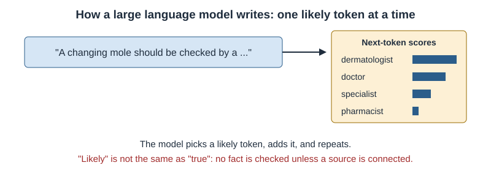

# Chapter 5: Generative AI and Large Language Models

## Opening Case
Lina is waiting for her skin appointment. She is anxious. She asks a free chatbot: "I'm 20, my mole changed, and I have headaches. Has my cancer spread?" The chatbot gives a long, warm answer. It says melanoma "can spread to the brain". It suggests two supplements and cites a journal article.

Lina shows the answer to a pharmacist. The pharmacist checks the article. It does not exist. One supplement weakens the contraceptive pill Lina takes.

That afternoon, the same pharmacist uses an approved hospital chatbot to draft a leaflet on sun protection. It saves her an hour. She checks every sentence before printing. Why was the tool harmful in one case and helpful in the other?

## Learning Objectives
By the end of this chapter you will be able to:
1. [LO1] Explain next-token prediction and why it causes hallucinations.
2. [LO2] Identify safe and unsafe uses of chatbots in health care.
3. [LO3] Apply a safe-use checklist, including protecting patient data.
4. [LO4] Describe retrieval-augmented generation and ambient scribes.
5. [LO5] Judge a chatbot answer for accuracy, gaps and bias.

## 5.1 How a Large Language Model Works
A **large language model** (LLM) has one basic job: predict the next piece of text. Text is split into small pieces called **token**s. A token is a word or part of a word.

During training, the model reads billions of sentences. Again and again, it guesses the next token and corrects itself (Chapter 3). The design behind modern LLMs is called the **transformer** [1].

When you ask a question, the model writes the answer one token at a time (Figure 5.1). Each token is the one that seems most likely to come next.

*Figure 5.1 — An LLM writes by choosing a likely next token, again and again. It predicts likely text; it does not look up facts.*

## 5.2 Why Chatbots Make Things Up
An LLM predicts what text usually looks like. It does not check whether the text is true. When it does not know, it still writes fluent, confident text. This is called a **hallucination** [2].

Hallucinations are dangerous because they look exactly like correct answers. In one study, a chatbot wrote medical articles with references. Only 7% of the references were both real and correct [3]. The article cited to Lina was one of the fake ones.

Chatbots also copy problems from their training text. In one study, four major chatbots repeated some old, disproved race-based medical ideas [4].

## 5.3 Exam Scores Are Not Patient Safety
Chatbots have passed medical exam questions. Google's Med-PaLM 2 scored 86.5% on exam-style questions [5].

This shows strong medical knowledge. It does not show safety with real patients. Exam questions are tidy and have one right answer. Real patients bring missing facts, mixed symptoms and fear. An exam does not test whether a chatbot notices what is missing or spots an emergency.

> **Medical Background in 60 Seconds:** A **drug interaction** happens when one medicine, food or supplement changes the effect of another. Some supplements, such as St John's wort, make hormonal contraceptives less effective. Pharmacists check for interactions whenever a new product is added.

## 5.4 Useful Applications
**Writing notes.** An **ambient scribe** listens, with consent, to a consultation and drafts the note. In one large health system, doctors using scribes reported less time on paperwork and more attention to patients [6]. The clinician must still check and sign every note.

**Answering patients.** In one study, health professionals preferred chatbot replies to doctors' replies to online questions [7]. But the questions came from a public forum, not real care.

**Teaching.** Chatbots can explain a concept or write practice questions. They are good tutors. They are poor sources for doses and interactions unless linked to a trusted source.

**Answering from trusted sources.** In **retrieval-augmented generation** (RAG), the system first searches trusted documents, such as a hospital drug list or national guideline. Then the chatbot answers from those pages and shows its sources [8]. This reduces mistakes but does not remove them.

## 5.5 Using Chatbots Safely: A Checklist
1. **Protect patient data.** Never paste names, record numbers, photos or other identifying details into a public chatbot.
2. **Use it for drafts, not decisions.** A draft is a starting point you check.
3. **Check every fact.** Use a trusted source, such as the product leaflet or a guideline.
4. **Check every reference.** If you cannot find it, it may not exist.
5. **Look for gaps.** Did it consider pregnancy, kidney function or other medicines?
6. **You stay responsible.** The chatbot does not take your responsibility away.

For students, **academic integrity** matters. Using a chatbot to explain an idea is usually allowed. Handing in its text as your own work is not. The World Health Organization has published guidance on safe use of these tools in health [9].

> **Through Four Lenses**
> - **Medicine:** Doctors can use approved scribes to save time. They must read every draft, because a wrong finding becomes part of the legal record once signed.
> - **Pharmacy:** Pharmacists will meet patients with chatbot advice. They should check doses and interactions, and explain calmly why a fluent answer can be wrong.
> - **Physical Therapy:** Physiotherapists can use chatbots to draft home-exercise sheets. They must check each exercise, because the chatbot does not know the patient's injury.
> - **Health Sciences:** Public-health officers can draft health messages in several languages. They should test messages with the community, because chatbots may miss local meaning.

> **Myth vs Evidence:** Myth: "If a chatbot passes a medical exam, it is safe to advise patients." Evidence: Exam scores show knowledge on tidy questions [5]. The same tools can invent references [3] and repeat harmful race-based ideas [4].

> **Safety Alert:** Never enter identifying patient details into a public chatbot. Never act on a chatbot's dose or interaction advice without checking a trusted source.

## Key Takeaways
- Chatbots predict the next token; they write likely text, not checked facts.
- Hallucinations are fluent and confident, including fake references.
- High exam scores do not prove safety with real patients.
- Scribes, patient replies and RAG are useful when a professional checks the output.
- Protect patient data, check facts, and keep responsibility.

## Self-Assessment
**Q1.** What is a large language model mainly trained to do? [LO1]
A) Look up facts in a medical database
B) Predict the next token of text
C) Examine patients through a camera
D) Calculate doses from blood tests

**Q2.** A chatbot gives a student a reference to a paper that does not exist. What is the best explanation? [LO1]
A) The paper was withdrawn.
B) The internet failed.
C) Hackers attacked the chatbot.
D) The chatbot wrote likely-looking text without checking the paper exists.

**Q3.** A nurse wants to paste a patient's name, record number and discharge letter into a free public chatbot. What should a colleague say? [LO3]
A) Do not paste identifying data into a public tool; use an approved system.
B) It is fine if the summary is checked.
C) It is fine because chatbots delete everything.
D) It is fine if the patient has gone home.

**Q4.** A hospital links a chatbot to its own drug list so answers quote the list. What is this called? [LO4]
A) Reinforcement learning
B) Adversarial training
C) Retrieval-augmented generation
D) Clustering

**Q5.** Med-PaLM 2 scored 86.5% on exam-style questions. What is the best conclusion? [LO2]
A) It can replace doctors.
B) It has strong medical knowledge, but safety with real patients is not proven.
C) It is right 86.5% of the time for any patient.
D) It no longer makes things up.

**Q6.** A chatbot tells Lina that a herbal supplement is safe with her pill. What should the pharmacist do? [LO5]
A) Accept the answer
B) Tell Lina to stop the pill
C) Ask the chatbot again until it says no
D) Check the interaction in a trusted source and advise Lina

**Q7.** A scribe's draft says "normal abdominal examination", but the doctor did not examine the abdomen. What is the lesson? [LO2]
A) The clinician must check and correct every draft before signing.
B) Scribes should record without consent.
C) Scribes are always right about examinations.
D) The note can be signed because the scribe is approved.

**Q8.** Researchers asked four chatbots about old race-based formulas. What did they find? [LO5]
A) All refused to answer.
B) All gave current, fair answers.
C) The chatbots repeated some disproved race-based claims.
D) The chatbots asked for consent.

**Q9.** Which use by a physiotherapy student fits the checklist? [LO3]
A) Asking it to explain how a muscle contracts, then checking a textbook
B) Handing in its essay as their own
C) Asking it to set a patient's exercise dose without an assessment
D) Uploading a patient's video to a public chatbot

**Q10.** Health professionals preferred chatbot replies to doctors' replies in one study. What limit matters most? [LO5]
A) The chatbot was not a transformer.
B) Only patients rated the replies.
C) The questions came from an online forum, and the study judged writing, not patient outcomes.
D) Only pharmacists took part.

**Case Question.** Rewrite the chatbot's reply to Lina in four or five sentences. It should respect her worry, avoid a diagnosis, name any emergency signs and send her to the right professional.

## Answers and Rationales
**Q1. B** — Chatbots are trained to predict the next token. A, C and D are not what they do.

**Q2. D** — A fake reference is a hallucination [3]. A, B and C are unlikely.

**Q3. A** — Identifying data must not go into public tools. B, C and D all expose patient data.

**Q4. C** — Answering from trusted documents is RAG [8]. A, B and D are different methods.

**Q5. B** — Exam scores show knowledge, not safety [5]. A overreaches. C misreads the number. D is false.

**Q6. D** — Interactions must be checked in a trusted source. A trusts fluent text. B is unsafe. C is not checking.

**Q7. A** — The clinician is responsible for the signed note [6]. B is unethical. C and D are false.

**Q8. C** — The chatbots repeated some harmful race-based claims [4]. A, B and D are wrong.

**Q9. A** — Explaining a concept and then checking it is safe. B breaks academic rules. C and D are unsafe.

**Q10. C** — The setting and what was measured limit the result [7]. A, B and D are wrong.

**Case Question — model answer.** "I can hear you are worried, and it is right to check a changing mole. I cannot tell you if you have cancer; only an examination can. Headaches have many common causes, but a sudden severe headache, weakness or confusion needs emergency care now. Please keep your skin appointment. Ask a pharmacist before taking any supplement, because some weaken the pill."

## References
1. Vaswani A, Shazeer N, Parmar N, et al. Attention is all you need. In: Advances in Neural Information Processing Systems 30. 2017. https://arxiv.org/abs/1706.03762
2. Ji Z, Lee N, Frieske R, et al. Survey of hallucination in natural language generation. ACM Comput Surv. 2023;55(12):1-38. DOI: 10.1145/3571730
3. Bhattacharyya M, Miller VM, Bhattacharyya D, Miller LE. High rates of fabricated and inaccurate references in ChatGPT-generated medical content. Cureus. 2023;15(5):e39238. DOI: 10.7759/cureus.39238
4. Omiye JA, Lester JC, Spichak S, Rotemberg V, Daneshjou R. Large language models propagate race-based medicine. NPJ Digit Med. 2023;6:195. DOI: 10.1038/s41746-023-00939-z
5. Singhal K, Tu T, Gottweis J, et al. Toward expert-level medical question answering with large language models. Nat Med. 2025;31(3):943-950. DOI: 10.1038/s41591-024-03423-7
6. Tierney AA, Gayre G, Hoberman B, et al. Ambient artificial intelligence scribes to alleviate the burden of clinical documentation. NEJM Catal Innov Care Deliv. 2024;5(3). DOI: 10.1056/cat.23.0404
7. Ayers JW, Poliak A, Dredze M, et al. Comparing physician and artificial intelligence chatbot responses to patient questions posted to a public social media forum. JAMA Intern Med. 2023;183(6):589-596. DOI: 10.1001/jamainternmed.2023.1838
8. Lewis P, Perez E, Piktus A, et al. Retrieval-augmented generation for knowledge-intensive NLP tasks. In: Advances in Neural Information Processing Systems 33. 2020. https://arxiv.org/abs/2005.11401
9. World Health Organization. Ethics and governance of artificial intelligence for health: guidance on large multi-modal models. Geneva: WHO; 2024. https://www.who.int/publications/i/item/9789240084759
