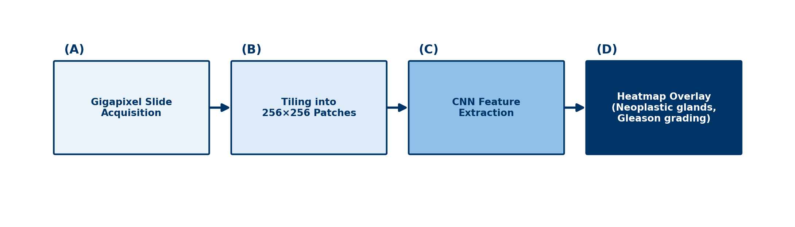

# Chapter 6: Seeing Disease — Imaging, Laboratory and Pathology

## Opening Case
Amal visits her family clinic for her yearly diabetes check. An assistant takes photos of the back of each eye. There is no eye specialist in the clinic. Within a minute, an AI system reports: "Diabetic eye disease detected. Refer to an eye specialist." Amal's hands shake. Her mother went blind from diabetes.

That week, an AI tool flags a likely ligament tear on Karim's knee MRI. Lina's dermatologist sees a risk score for her mole. Three patients, three images, three AI tools. What are these tools doing, and where do they fail?

## Learning Objectives
By the end of this chapter you will be able to:
1. [LO1] Distinguish AI tools that detect, diagnose and triage.
2. [LO2] Describe AI in eye and breast screening and judge the evidence.
3. [LO3] Explain why fast AI-made MRI scans can show features that are not there.
4. [LO4] Describe how AI helps in pathology and the clinical laboratory.
5. [LO5] Identify how imaging and laboratory AI fail in different groups and places.

> **Medical Background in 60 Seconds:** An **X-ray** passes radiation through the body; bone looks white. **CT** builds slices from many X-rays. **MRI** uses a magnet, not radiation, and shows soft tissue such as ligaments. A **retinal photograph** shows the vessels at the back of the eye, where diabetes causes damage. A **biopsy** is a small tissue sample checked under a microscope.

## 6.1 Detect, Diagnose, Triage
Imaging AI tools do three kinds of jobs.

- **Computer-aided detection** (CADe) marks where something may be, such as a box around a lung spot.
- **Computer-aided diagnosis** (CADx) describes a finding, such as "likely cancer".
- **Computer-aided triage** (CADt) moves urgent scans to the top of the list, such as a suspected brain bleed.

The difference matters. A triage tool that misses a bleed does not remove the human read. A diagnosis tool that calls a cancer "benign" can directly mislead a decision.

An AI model sees only the pixels a person sees. It learns patterns, and sometimes those patterns are shortcuts, such as the scanner type (Chapter 3) [1].

## 6.2 Screening Eyes and Breasts
**Eye screening.** Diabetic eye disease is a leading cause of preventable blindness. Many countries lack enough specialists to check every patient. In a study in 900 patients in primary-care clinics, an AI system found significant eye disease with 87% sensitivity and 91% specificity [2]. It became the first AI system in the United States allowed to make this decision without a specialist.

Amal's result is a referral, not a diagnosis. Some referred patients will turn out to be fine. The eye specialist will confirm.

**Breast screening.** In many countries, two radiologists read each mammogram. In a large Swedish randomised trial, AI helped sort the mammograms [3]. Reading work fell by 44%, and about 20% more cancers were found without more false alarms.

*Figure 6.1 — A model's scores for two skin lesions. The "confidence" values are not true probabilities (Chapter 4). Both lesions are on light skin, like most training images.*

## 6.3 Skin, Knees and Fast MRI
**Skin.** A 2017 model matched dermatologists on test photos of skin lesions [4]. But most training photos show light skin. On a test set balanced across skin tones, several models did worse on darker skin [5]. This matters for Lina, who has dark skin (Chapter 10).

**Knee MRI.** A model called MRNet detected knee ligament tears and was tested at another hospital [6]. Tools like this can put scans such as Karim's first in line. The radiologist still reads the whole scan.

**Fast MRI.** MRI is slow. To save time, the scanner can collect less data. An AI network then fills in the missing parts, based on what anatomy usually looks like [7]. A 40-minute scan can drop to 10 minutes, a 75% saving.

But the missing data are guessed, not recovered. If a patient's anatomy is unusual, the network may smooth away a small lesion or add a realistic-looking feature. This is the imaging version of a chatbot's hallucination (Chapter 5).

## 6.4 Pathology: From Glass Slide to Heatmap
In **digital pathology**, a scanner turns a glass slide into a **whole-slide image**. One image is huge, often several gigabytes.

A model cannot read it in one piece. So it is cut into thousands of small tiles. The model scores each tile. The scores are combined into a colour **heatmap** that shows where suspicious tissue is (Figure 6.2).

*Figure 6.2 — A slide is cut into tiles, each tile is scored, and the results form a heatmap.*

In one large study, a model could have spared pathologists from reviewing most prostate slides while still catching every cancer in the test set [8]. But stain colour and scanners differ between laboratories. A model from one laboratory may fail in another.

## 6.5 The Clinical Laboratory
Most laboratory errors happen before the test is run: wrong patient, wrong tube or poor handling [9]. AI and automation help at several points.

- **Sample checks.** Analysers detect **haemolysis** (burst red cells), **icterus** (high bilirubin) and **lipaemia** (high fat). Each can distort results.
- **Delta checks.** Software compares a new result with the patient's last one. A sudden big change may be real, or it may mean the sample came from the wrong patient.
- **Microscopy.** Digital systems pre-sort blood cells on a slide. A technologist reviews what is flagged.

AI can also find hidden signals. One model predicted blood pressure and smoking from eye photos [10]. This is exciting research, not yet a test for individual patients.

> **Through Four Lenses**
> - **Medicine:** Doctors should know if a tool detects, diagnoses or triages. A triage flag speeds reading; it does not replace a full report or examination.
> - **Pharmacy:** Pharmacists use laboratory values for dosing, such as creatinine. A delta-check or sample warning means the value may be wrong. Confirm before changing a dose.
> - **Physical Therapy:** Physiotherapists read imaging reports to plan rehabilitation. An AI-flagged tear still needs clinical stability tests. Scans and function do not always match.
> - **Health Sciences:** Imaging and laboratory staff make the inputs AI reads. Positioning, stains and analyser settings all change model performance. Record changes and report odd outputs.

> **Myth vs Evidence:** Myth: "Imaging AI works equally well for everyone." Evidence: Skin models tested on a set balanced by skin tone did worse on darker skin [5]. Performance must be checked in each group.

> **Safety Alert:** An AI "normal" is not a guarantee. If the patient's symptoms do not fit the report, ask for a human review.

## Key Takeaways
- Detection marks findings, diagnosis describes them, and triage reorders the list.
- Eye and breast screening have strong evidence; many other tools do not.
- Fast-MRI networks guess missing data, which saves time but can add or hide features.
- Pathology AI tiles huge images and builds heatmaps; stain and scanner changes are key risks.
- Laboratory AI checks sample quality and sudden changes, and every flag needs human review.

## Self-Assessment
**Q1.** An AI tool moves CT scans with a suspected brain bleed to the top of the list. It does not mark the bleed. What type of tool is this? [LO1]
A) Detection (CADe)
B) Diagnosis (CADx)
C) Triage (CADt)
D) A scribe

**Q2.** An eye-screening AI had 87% sensitivity and 91% specificity. Amal's result is "refer". What is the best interpretation? [LO2]
A) She needs a specialist to confirm; some referred patients will be fine.
B) She definitely has sight-threatening disease.
C) The result can be ignored.
D) She should start laser treatment today.

**Q3.** Which evidence would best support using an AI tool for mammography screening? [LO2]
A) The company's own accuracy report
B) A study with secret code and data
C) One study of old data from one hospital
D) A randomised screening trial showing more cancers found without more false alarms

**Q4.** A fast-MRI knee scan shows a small defect that is absent on the standard slow scan. What is a likely explanation? [LO3]
A) The fast scan used radiation.
B) The AI network guessed anatomy and added a feature that is not there.
C) The knee changed in five minutes.
D) Fast MRI recovers all data exactly.

**Q5.** A scan time falls from 40 to 10 minutes. What is the percentage saving? [LO3]
A) 25%
B) 40%
C) 75%
D) 400%

**Q6.** Why are whole-slide images cut into tiles? [LO4]
A) They are far too large for a model to read in one piece.
B) Tiling removes patient names.
C) Pathologists prefer small squares.
D) Tiling fixes stain colour.

**Q7.** A patient's creatinine was 85 yesterday and 300 today. She is well, and her other results match another patient on the ward. What is most likely? [LO4]
A) Contamination from a drip
B) Normal daily change
C) Burst red cells
D) A sample from the wrong patient

**Q8.** A pathology model from one laboratory does poorly in a second laboratory. What is the most likely cause? [LO5]
A) The second laboratory's patients have no cancer.
B) Differences in stain colour and scanners
C) The model was too simple.
D) The second laboratory used MRI.

**Q9.** A skin model does worse on a test set balanced by skin tone. What is the lesson for Lina's care? [LO5]
A) Models can never be used on skin.
B) Only dermatologists can use datasets.
C) Performance must be checked in people like her, including darker skin.
D) The balanced test set was wrong.

**Q10.** A model predicts blood pressure from an eye photo. How should this be described today? [LO5]
A) Exciting research, not yet a proven test for individual patients
B) A replacement for measuring blood pressure
C) Proof that eye photos are useless
D) An approved test everywhere

**Case Question.** Amal is frightened by her "refer" result. Write four sentences explaining what it means, why she needs an eye specialist and why she should not assume the worst.

## Answers and Rationales
**Q1. C** — Reordering the list is triage. A marks findings. B describes them. D writes notes.

**Q2. A** — A screening referral needs confirmation, and false alarms happen [2]. B overstates. C and D are unsafe.

**Q3. D** — A randomised trial is the strongest evidence [3]. A, B and C are weaker.

**Q4. B** — The network guesses missing data and can add or hide features [7]. A is false; MRI uses no radiation. C and D are false.

**Q5. C** — 30 ÷ 40 = 75%. A is the time left. B and D are wrong.

**Q6. A** — The images are too large to read at once. B, C and D are not the reason.

**Q7. D** — A sudden big rise in a well patient, matching another patient, suggests a labelling error. A is wrong because drip contamination dilutes and lowers most values. B and C do not fit.

**Q8. B** — Stain and scanner differences change the data. A, C and D are unsupported.

**Q9. C** — Performance fell on darker skin [5], so it must be checked in each group. A overgeneralises. B and D are wrong.

**Q10. A** — This is promising research [10], not a proven individual test. B, C and D are wrong.

**Case Question — model answer.** "The camera found changes at the back of your eyes that need a closer look. The test is designed to be careful, so it sometimes refers people whose eyes are fine. An eye specialist will examine you and decide if you need treatment. If you do, finding it early like this is exactly what protects your sight."

## References
1. Zech JR, Badgeley MA, Liu M, et al. Variable generalization performance of a deep learning model to detect pneumonia in chest radiographs: a cross-sectional study. PLoS Med. 2018;15(11):e1002683. DOI: 10.1371/journal.pmed.1002683
2. Abràmoff MD, Lavin PT, Birch M, et al. Pivotal trial of an autonomous AI-based diagnostic system for detection of diabetic retinopathy in primary care offices. NPJ Digit Med. 2018;1:39. DOI: 10.1038/s41746-018-0040-6
3. Lång K, Josefsson V, Larsson AM, et al. Artificial intelligence-supported screen reading versus standard double reading in the Mammography Screening with Artificial Intelligence trial (MASAI): a clinical safety analysis of a randomised, controlled, non-inferiority, single-blinded, screening accuracy study. Lancet Oncol. 2023;24(8):936-944. DOI: 10.1016/s1470-2045(23)00298-x
4. Esteva A, Kuprel B, Novoa RA, et al. Dermatologist-level classification of skin cancer with deep neural networks. Nature. 2017;542(7639):115-118. DOI: 10.1038/nature21056
5. Daneshjou R, Vodrahalli K, Novoa RA, et al. Disparities in dermatology AI performance on a diverse, curated clinical image set. Sci Adv. 2022;8(32):eabq6147. DOI: 10.1126/sciadv.abq6147
6. Bien N, Rajpurkar P, Ball RL, et al. Deep-learning-assisted diagnosis for knee magnetic resonance imaging: development and retrospective validation of MRNet. PLoS Med. 2018;15(11):e1002699. DOI: 10.1371/journal.pmed.1002699
7. Hammernik K, Klatzer T, Kobler E, et al. Learning a variational network for reconstruction of accelerated MRI data. Magn Reson Med. 2018;79(6):3055-3071. DOI: 10.1002/mrm.26977
8. Campanella G, Hanna MG, Geneslaw L, et al. Clinical-grade computational pathology using weakly supervised deep learning on whole slide images. Nat Med. 2019;25(8):1301-1309. DOI: 10.1038/s41591-019-0508-1
9. Plebani M. Errors in clinical laboratories or errors in laboratory medicine? Clin Chem Lab Med. 2006;44(6):750-759. DOI: 10.1515/cclm.2006.123
10. Poplin R, Varadarajan AV, Blumer K, et al. Prediction of cardiovascular risk factors from retinal fundus photographs via deep learning. Nat Biomed Eng. 2018;2(3):158-164. DOI: 10.1038/s41551-018-0195-0
