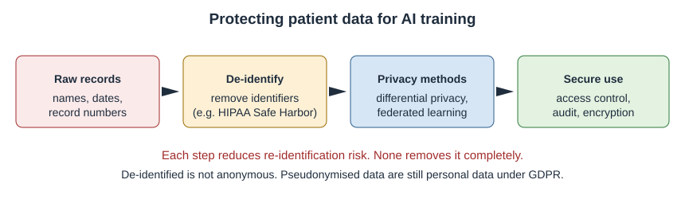

# Chapter 10: Bias, Fairness and Privacy

## Opening Case
A university public-health team is planning a skin-cancer campaign. The leader wants to recommend a free skin-check app to all students. A team member mentions Lina. The app flagged her mole, but its website shows almost no photos of dark skin. Would it work as well for her as for lighter-skinned classmates?

Across town, Karim's employer offers workers a free fitness wristband. Karim's physiotherapist reads the terms. Steps, heart rate and sleep data will be shared with an insurance company. Karim worries that his slow recovery could affect his job.

Both stories ask one question: who does health AI protect, and who might it harm?

## Learning Objectives
By the end of this chapter you will be able to:
1. [LO1] Identify where bias can enter an AI tool, from data to use.
2. [LO2] Explain the Obermeyer case and why the choice of label caused bias.
3. [LO3] Distinguish anonymisation, pseudonymisation and de-identification.
4. [LO4] Describe differential privacy and federated learning, and their limits.
5. [LO5] Compare the main ideas of data-protection laws, including Egypt's.

## 10.1 Where Bias Comes From
**Algorithmic bias** means a model works worse, or gives worse advice, for some groups. Bias can enter at every step:

- *Data.* Who is in the dataset? Famous datasets come from a few rich settings (Chapter 2).
- *Labels.* What counts as the "right answer"? A poor label can carry past unfairness.
- *Testing.* Is performance reported for each group, or only on average?
- *Use.* Is the tool used in people like those it was tested on?

Skin tone is a clear example. Skin datasets contain mostly light skin [1]. On a test set balanced across skin tones, models did worse on darker skin [2]. For Lina, this is real.

Bias can also hide in X-rays. One study found that AI missed disease more often in women, Black, Hispanic and younger patients, and in patients with low-income insurance [3]. People who already face barriers were more often told they were healthy when they were not.

## 10.2 The Obermeyer Case: When the Label Is the Problem
A widely used US algorithm chose patients for an extra-care programme [4]. It used health-care *cost* as the label for health *need*. It did not use race as an input.

Researchers found that, at the same score, Black patients were sicker than white patients. The reason was the label. Because of unequal access to care, less money had been spent on equally sick Black patients. The model learned that they would cost less, and wrongly treated that as needing less.

When the label was changed to direct health measures, the share of Black patients chosen for extra help rose from 17.7% to 46.5% [4].

The lesson is often told wrongly. The model was already "race-blind", yet it was biased. The fix was to change what the model predicted.

Also, AI can detect a patient's race from chest X-rays, even though experts cannot see how [5]. So removing race from the inputs does not guarantee fairness. Fairness needs measurement: check performance in each group, choose labels carefully and keep monitoring.

> **Medical Background in 60 Seconds:** The **Fitzpatrick scale** classifies skin from type I (always burns) to type VI (deeply pigmented, rarely burns). Melanoma is less common in darker skin but is often found later, when outcomes are worse. It may appear on the palms, soles or nails.

## 10.3 Privacy: Names Are Not Enough
Health data are among the most sensitive personal data. Removing names does not fully protect them.

Three terms are often confused:

- **De-identification** removes details that could identify a person. The US HIPAA "Safe Harbor" method lists 18 identifiers to remove, such as names and full dates [6].
- **Pseudonymisation** replaces names with a code. Whoever holds the key can re-link the data. Under European law, this is still personal data [7].
- **Anonymisation** makes re-linking impossible by any reasonable means. This is very hard for rich health data.

The danger is **re-identification**. A few ordinary facts together can point to one person. Postcode, birth date and sex together identify most US residents [8]. Wearable data are especially risky, because movement and sleep patterns are almost unique.

*Figure 10.1 — Each protection step reduces, but does not remove, the risk of re-identification.*

## 10.4 Privacy-Protecting Methods
**Differential privacy** adds carefully measured random noise to data or results [9]. This limits how much anyone can learn about one person. More noise means stronger privacy but less accurate results. It is a strong protection, but not an absolute one.

**Federated learning** trains a model across several hospitals without moving patient data. Each hospital trains on its own data and shares only model updates [10]. This reduces data sharing. But updates can still leak some information, so extra protections are often added.

## 10.5 The Law: Shared Principles
Laws differ between countries, but they share core ideas: a lawful reason to use data, using it only for its stated purpose, collecting only what is needed, keeping it secure and respecting people's rights.

- **GDPR** in the European Union gives health data extra protection [7].
- **HIPAA** in the United States sets rules for health providers and insurers [6].

> **Local Context:** Egypt's **Personal Data Protection Law** (Law No. 151 of 2020) treats health data as sensitive. Using it generally needs explicit written consent and stronger security. Detailed rules were issued in 2025 [11].

For Karim, this matters. Wristband data shared with an insurer may not be covered by the rules that apply to clinicians. He has the right to know how his data will be used before he agrees.

> **Through Four Lenses**
> - **Medicine:** Doctors should ask companies for results by sex, age, ethnicity and skin tone. An average can hide poor performance in patients who already get worse care.
> - **Pharmacy:** Pharmacists hold prescription data that reveal diagnoses. Sharing them with apps needs clear consent, because a medicine list can reveal a condition.
> - **Physical Therapy:** Physiotherapists should explain what wearables record and who sees it. Movement and sleep data are personal and hard to make anonymous.
> - **Health Sciences:** Public-health officers should test tools in their own community first. An app that fails on darker skin would widen health gaps, not close them.

> **Myth vs Evidence:** Myth: "If a model does not use race, it cannot be racially biased." Evidence: The Obermeyer algorithm did not use race, yet it under-selected Black patients because of its cost label [4]. Models can also detect race from images [5].

> **Safety Alert:** Before recommending an AI tool to a group, check if it was tested in people like them. If there is no evidence, say so.

## Key Takeaways
- Bias can enter through data, labels, testing and use.
- In the Obermeyer case, a cost label carried unequal access into the model.
- Removing race or sex does not guarantee fairness; measuring by group does.
- A few details together can identify a person; coded data are still personal data.
- Privacy methods reduce risk but do not remove it.

## Self-Assessment
**Q1.** A skin app was trained mostly on light skin. Where did the bias most likely enter? [LO1]
A) User feedback
B) Legal review
C) Data collection
D) File compression

**Q2.** In the Obermeyer case, why were Black patients sicker at the same score? [LO2]
A) The label was cost, which reflected unequal access to care.
B) Race was an input.
C) The dataset was too small.
D) It was a chatbot.

**Q3.** A developer says, "We removed race from the inputs, so our imaging model is fair." What is the best reply? [LO2]
A) Correct; that guarantees fairness.
B) Fairness does not matter in imaging.
C) Images contain no information about race.
D) Models can detect race from images, so fairness must be measured by group.

**Q4.** A team replaces names with codes but keeps a key linking codes to names. What is this? [LO3]
A) Anonymisation
B) Pseudonymisation
C) Differential privacy
D) Federated learning

**Q5.** Why is wearable movement data hard to anonymise? [LO3]
A) It is stored on paper.
B) It contains nothing personal.
C) Movement and sleep patterns are almost unique to each person.
D) It is protected by default.

**Q6.** A hospital adds measured random noise before releasing data. What is true of this method? [LO4]
A) More noise gives stronger privacy but less accurate results.
B) It makes it impossible to learn anything about anyone.
C) It removes the need for consent.
D) It is the same as pseudonymisation.

**Q7.** Five hospitals train a shared model, each on its own data, sending only updates. What is this? [LO4]
A) Retrieval-augmented generation
B) Pseudonymisation
C) Reinforcement learning
D) Federated learning

**Q8.** A Cairo clinic wants to share records with an app company. How does Egypt's law treat health data? [LO5]
A) As public data
B) As sensitive data, generally needing explicit written consent and stronger security
C) As free of any protection
D) As data only employers may use

**Q9.** Under GDPR, what is the status of coded data when a key still exists? [LO5]
A) It is still personal data.
B) It is fully anonymous.
C) The law does not cover it.
D) It can be sold freely.

**Q10.** In an X-ray study, AI missed disease more often in which patients? [LO1]
A) Only older white men
B) All groups equally
C) Women, Black, Hispanic and younger patients, and those with low-income insurance
D) Only patients with rare diseases

**Case Question.** Karim asks whether he should accept the free wristband. Write a short, balanced answer covering the privacy risks and the questions he should ask.

## Answers and Rationales
**Q1. C** — The training images lacked dark skin, so bias entered in data collection [1, 2]. A, B and D are not where it began.

**Q2. A** — Cost reflected unequal access, so equally sick Black patients looked less needy [4]. B is false. C and D are wrong.

**Q3. D** — Race can be detected from images [5]. A, B and C are false.

**Q4. B** — Codes with a key are pseudonymisation. A cannot be re-linked. C adds noise. D trains across sites.

**Q5. C** — Unique patterns allow re-identification. A, B and D are false.

**Q6. A** — Differential privacy trades accuracy for privacy [9]. B overstates it. C and D are wrong.

**Q7. D** — Training locally and sharing updates is federated learning [10]. A, B and C are other methods.

**Q8. B** — Egypt's Law No. 151 of 2020 treats health data as sensitive [11]. A, C and D are wrong.

**Q9. A** — Coded data are still personal data under GDPR [7]. B, C and D are wrong.

**Q10. C** — AI missed more disease in these groups [3]. A, B and D are wrong.

**Case Question — model answer.** "The wristband can help you track activity, but your steps, heart rate and sleep will go to an insurer. That data can reveal a lot about your health and is hard to make anonymous. Ask who will see it, what it is for, how long it is kept and whether you can withdraw. Also ask whether saying no affects your job. If the answers are unclear, you can say no."

## References
1. Adamson AS, Smith A. Machine learning and health care disparities in dermatology. JAMA Dermatol. 2018;154(11):1247-1248. DOI: 10.1001/jamadermatol.2018.2348
2. Daneshjou R, Vodrahalli K, Novoa RA, et al. Disparities in dermatology AI performance on a diverse, curated clinical image set. Sci Adv. 2022;8(32):eabq6147. DOI: 10.1126/sciadv.abq6147
3. Seyyed-Kalantari L, Zhang H, McDermott MBA, Chen IY, Ghassemi M. Underdiagnosis bias of artificial intelligence algorithms applied to chest radiographs in under-served patient populations. Nat Med. 2021;27(12):2176-2182. DOI: 10.1038/s41591-021-01595-0
4. Obermeyer Z, Powers B, Vogeli C, Mullainathan S. Dissecting racial bias in an algorithm used to manage the health of populations. Science. 2019;366(6464):447-453. DOI: 10.1126/science.aax2342
5. Gichoya JW, Banerjee I, Bhimireddy AR, et al. AI recognition of patient race in medical imaging: a modelling study. Lancet Digit Health. 2022;4(6):e406-e414. DOI: 10.1016/s2589-7500(22)00063-2
6. US Department of Health and Human Services. Guidance regarding methods for de-identification of protected health information in accordance with the HIPAA Privacy Rule (45 CFR 164.514). 2012. https://www.hhs.gov/hipaa/for-professionals/special-topics/de-identification/index.html
7. European Parliament and Council. Regulation (EU) 2016/679 (General Data Protection Regulation). Off J Eur Union. 2016;L119:1-88. https://eur-lex.europa.eu/eli/reg/2016/679/oj
8. Sweeney L. k-anonymity: a model for protecting privacy. Int J Uncertain Fuzziness Knowl Based Syst. 2002;10(05):557-570. DOI: 10.1142/s0218488502001648
9. Dwork C, McSherry F, Nissim K, Smith A. Calibrating noise to sensitivity in private data analysis. In: Theory of Cryptography. Lecture Notes in Computer Science. Springer; 2006:265-284. DOI: 10.1007/11681878_14
10. Rieke N, Hancox J, Li W, et al. The future of digital health with federated learning. NPJ Digit Med. 2020;3:119. DOI: 10.1038/s41746-020-00323-1
11. Arab Republic of Egypt. Law No. 151 of 2020 promulgating the Personal Data Protection Law. Official Gazette; 2020. https://mcit.gov.eg/Upcont/Documents/Reports%20and%20Documents_1232021000_Law_No_151_2020_Personal_Data_Protection.pdf
