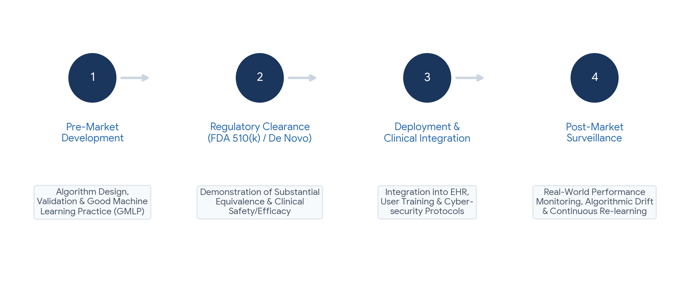

# Chapter 11: Regulation, Liability and the Human in the Loop

## Opening Case
Two weeks after leaving hospital, Amal is back with a fever. The hospital's sepsis model gives her a "low risk" score. It is a busy night. A junior doctor sees the score, notes her vital signs are "borderline" and plans to review her in the morning. By morning, Amal is in septic shock and needs intensive care. She survives.

Her family asks hard questions. The hospital bought the model. The doctor followed its score. The company says the tool is "decision support only". Who is responsible when AI-guided care goes wrong? And why did a trained doctor accept a number that did not fit what she saw?

## Learning Objectives
By the end of this chapter you will be able to:
1. [LO1] Explain when software counts as a medical device.
2. [LO2] Distinguish the main US approval routes for AI devices.
3. [LO3] Describe what the EU AI Act requires for high-risk medical AI.
4. [LO4] Apply the four elements of negligence to an AI case and explain the learned intermediary doctrine.
5. [LO5] Explain automation bias, de-skilling and the limits of AI explanations.

## 11.1 When Software Is a Medical Device
Software meant to diagnose, prevent, monitor or treat disease can be a medical device, even with no hardware. This is called **software as a medical device** (SaMD). An eye-screening system, a sepsis model and a dosing calculator can all be SaMD. A staff-rota app is not.

Regulators sort SaMD by risk [1]. Two questions matter. How much does the software drive care: does it diagnose, guide treatment or just inform? And how serious is the condition? Software that diagnoses a critical condition gets the strictest review.

> **Medical Background in 60 Seconds:** A **medical device** is any instrument, machine or software used for a medical purpose, from a thermometer to an MRI scanner. Regulators check that benefits outweigh risks before sale and keep watching afterwards. **Septic shock** is the most severe stage of sepsis, when blood pressure stays dangerously low despite fluids.

## 11.2 The United States: FDA Routes
The US Food and Drug Administration (FDA) has three main routes:

- **510(k) clearance.** The maker shows the device is similar to one already on the market. Most AI devices use this route.
- **De Novo classification.** For new, low-to-moderate-risk devices with nothing similar on the market. The eye-screening AI took this route (Chapter 6).
- **Premarket approval** (PMA). For high-risk devices, with the strongest evidence.

Clearance does not always mean strong evidence. Most cleared AI devices were tested only on old data, often at one or two sites [2].

AI models get updated. A **predetermined change control plan** (PCCP) lets a maker describe planned updates and their testing in advance. Changes within the plan do not need a new application. The FDA issued final guidance on this in 2024 [3].

## 11.3 Europe: The AI Act
In the European Union, medical devices follow the **Medical Device Regulation** (MDR) [4]. Laboratory tests follow the **In Vitro Diagnostic Regulation** (IVDR) [5].

The **EU AI Act** (2024) is the first broad law on AI [6]. Medical AI that needs independent review counts as **high-risk AI**. From August 2027, such tools must have:

- risk management across their whole life;
- checks for bias in training data;
- clear records and logging of use;
- clear instructions for users;
- human oversight built in;
- accuracy, robustness and security.

The AI Act adds to the MDR and IVDR; it does not replace them. The World Health Organization also sets principles for AI in health, including safety, transparency, accountability and fairness [7].

> **Local Context:** In Egypt, medical devices are regulated by the **Egyptian Drug Authority**, set up by Law No. 151 of 2019. Its definition of a medical device includes software for diagnosis, prevention, monitoring or treatment [8]. So AI tools used in Egyptian care fall under device rules, as well as the data rules in Chapter 10.

*Figure 11.1 — AI medical software moves from development and testing, through review, to use and ongoing monitoring.*

## 11.4 Liability: Who Is Responsible?
**Negligence** is the legal basis of most malpractice claims. A patient must show four things:

1. **Duty.** The professional owed the patient care.
2. **Breach.** The care fell below the accepted **standard of care**.
3. **Causation.** The breach caused the harm.
4. **Damages.** Real harm happened.

AI makes the second point harder. Legal experts suggest that, today, clinicians are safest when they follow standard care [9]. Risk rises when a clinician follows AI advice that departs from standard care and harm results.

Responsibility is usually shared (Figure 11.2). The clinician owns the clinical judgment. The hospital owns choosing, testing and monitoring the tool, and training staff. The maker owns the product's design, testing and warnings.

*Figure 11.2 — Responsibility is shared between the clinician, the maker and the hospital.*

The **learned intermediary doctrine** is often misunderstood. A maker of medicines or devices usually meets its duty to warn by warning the prescribing clinician, not each patient. The clinician then advises the patient. This rule limits the maker's duty to warn patients directly. It is not a shield for clinicians.

## 11.5 The Human in the Loop
Amal's doctor was not careless by nature. She showed **automation bias** (Chapter 1): trusting the computer over her own eyes. It is common, especially on busy shifts [10].

**De-skilling** is a longer-term risk. In one study, doctors used to AI support in colonoscopy found fewer precancerous growths when they later worked without it [11]. Skills not practised can fade.

Many hope **explainable AI** (XAI) will help. It often uses heatmaps to show which parts of an image influenced the result. But a heatmap shows where the model looked, not whether it was right [12]. Explanations can even make people trust a wrong answer more [13].

What helps:

- *Design.* Show uncertainty, not just "low risk".
- *Workflow.* Make your own assessment before looking at the AI result.
- *Training.* Learn each tool's known weaknesses.
- *Culture.* Make it normal to override AI when the patient does not fit, and report every mismatch.
- *Monitoring.* Keep checking performance after the tool goes live.

## 11.6 Looking Ahead
AI will change daily work in every health profession. Doctors will spend less time on paperwork. Pharmacists will manage smarter alerts. Physiotherapists will supervise home programmes with movement data. Laboratory, imaging and public-health staff will run the quality checks that keep AI honest.

What AI cannot do is sit with a frightened patient, weigh personal values or take responsibility. These remain human tasks, and they are the heart of every health profession.

> **Through Four Lenses**
> - **Medicine:** Doctors remain responsible for clinical judgment. When a score conflicts with the examination, record the conflict, act on the patient and report the case.
> - **Pharmacy:** Pharmacists should check whether a dosing tool is a regulated device and tested locally. Unregulated calculators used for patient decisions carry extra risk.
> - **Physical Therapy:** Physiotherapists should know if a movement app is a medical device or a wellness product. Wellness apps may not meet clinical standards.
> - **Health Sciences:** Laboratory and imaging staff often do the monitoring after a tool goes live. Logging errors and equipment changes gives regulators the evidence they need.

> **Myth vs Evidence:** Myth: "If a tool is FDA-cleared, it has been proven in clinical trials." Evidence: Most AI devices are cleared through 510(k), and most were tested only on old data at few sites [2].

> **Safety Alert:** A "low risk" score never outweighs your own assessment of a patient who looks unwell. Act on the patient, record your reasoning and report the mismatch.

## Key Takeaways
- Software that diagnoses, monitors or treats can be a medical device, sorted by risk.
- US routes include 510(k), De Novo and PMA; change plans allow planned AI updates.
- The EU AI Act adds duties for high-risk AI, including human oversight.
- Responsibility is usually shared; the learned intermediary doctrine is not a clinician shield.
- Automation bias, de-skilling and over-trust in explanations need design, training and culture to manage.

## Self-Assessment
**Q1.** Which is most likely software as a medical device? [LO1]
A) A staff-rota app
B) Software that reads ECGs to detect atrial fibrillation
C) A canteen menu spreadsheet
D) A library catalogue

**Q2.** A company builds a new, low-to-moderate-risk AI tool with nothing similar on the US market. Which FDA route fits best? [LO2]
A) 510(k) clearance
B) Premarket approval only
C) No review needed
D) De Novo classification

**Q3.** What does a predetermined change control plan allow? [LO2]
A) Planned, pre-described updates without a new application for each
B) Unlimited changes without testing
C) Skipping testing for the first version
D) Selling without a label

**Q4.** An AI sepsis tool in the EU is a medical device that needs independent review. How does the AI Act classify it? [LO3]
A) Minimal-risk AI
B) Banned AI
C) High-risk AI
D) General-purpose AI only

**Q5.** Which is a duty for high-risk AI under the EU AI Act? [LO3]
A) Human oversight built into the design
B) Removing all documents
C) Using only unsupervised learning
D) Not logging use

**Q6.** A clinician follows AI advice that departs from standard care, and the patient is harmed. How does this compare with following standard care? [LO4]
A) It lowers legal risk.
B) It raises legal risk.
C) It has no legal effect.
D) It moves all responsibility to the patient.

**Q7.** What does the learned intermediary doctrine say? [LO4]
A) Clinicians are always liable for product defects.
B) AI companies can never be sued.
C) Patients must read all device manuals.
D) A maker usually meets its duty to warn by warning the prescribing clinician.

**Q8.** Amal's doctor accepted a "low risk" score despite borderline vital signs. What is this? [LO5]
A) De-skilling
B) Differential privacy
C) Automation bias
D) Federated learning

**Q9.** A heatmap highlights part of an X-ray. What can it reliably tell the clinician? [LO5]
A) That the model's reasoning is right
B) Which areas influenced the result, not whether the reasoning was valid
C) The diagnosis
D) That the model is calibrated

**Q10.** Doctors used to AI in colonoscopy later found fewer growths without it. What does this show? [LO5]
A) De-skilling
B) Data leakage
C) Distribution shift
D) Better training

**Case Question.** Use the four elements of negligence to analyse Amal's case. Then suggest two changes the hospital could make.

## Answers and Rationales
**Q1. B** — Reading ECGs to diagnose has a medical purpose [1]. A, C and D do not.

**Q2. D** — De Novo is for new low-to-moderate-risk devices. A needs a similar device. B is for high risk. C is wrong.

**Q3. A** — A PCCP describes planned changes and testing in advance [3]. B, C and D are false.

**Q4. C** — Medical AI needing independent review is high-risk [6]. A, B and D are wrong.

**Q5. A** — Human oversight is a core duty [6]. B, C and D contradict the Act.

**Q6. B** — Following AI away from standard care into harm raises risk [9]. A, C and D are wrong.

**Q7. D** — The doctrine is about the maker warning through the clinician. A and B misstate it. C is the opposite.

**Q8. C** — Trusting a computer over conflicting evidence is automation bias [10]. A is long-term skill loss. B and D are privacy methods.

**Q9. B** — Heatmaps show influence, not correctness [12, 13]. A, C and D overstate them.

**Q10. A** — Skill fell after relying on AI [11]. B, C and D are unrelated.

**Case Question — model answer.** Duty: the doctor and hospital owed Amal care. Breach: accepting "low risk" despite borderline signs and delaying review may fall below the standard of care. Causation: the delay likely contributed to septic shock. Damages: she needed intensive care. The hospital shares responsibility for choosing the tool and training staff. Two changes: show the model's uncertainty instead of "low risk", and require a bedside review for any abnormal vital signs, whatever the score.

## References
1. International Medical Device Regulators Forum. "Software as a Medical Device": possible framework for risk categorization and corresponding considerations. IMDRF/SaMD WG/N12FINAL. 2014. https://www.imdrf.org/documents/software-medical-device-possible-framework-risk-categorization-and-corresponding-considerations
2. Wu E, Wu K, Daneshjou R, et al. How medical AI devices are evaluated: limitations and recommendations from an analysis of FDA approvals. Nat Med. 2021;27(4):582-584. DOI: 10.1038/s41591-021-01312-x
3. US Food and Drug Administration. Marketing submission recommendations for a predetermined change control plan for artificial intelligence-enabled device software functions: final guidance. December 2024. https://www.fda.gov/regulatory-information/search-fda-guidance-documents/marketing-submission-recommendations-predetermined-change-control-plan-artificial-intelligence
4. European Parliament and Council. Regulation (EU) 2017/745 on medical devices. Off J Eur Union. 2017;L117:1-175. https://eur-lex.europa.eu/eli/reg/2017/745/oj
5. European Parliament and Council. Regulation (EU) 2017/746 on in vitro diagnostic medical devices. Off J Eur Union. 2017;L117:176-332. https://eur-lex.europa.eu/eli/reg/2017/746/oj
6. European Parliament and Council. Regulation (EU) 2024/1689 laying down harmonised rules on artificial intelligence (Artificial Intelligence Act). Off J Eur Union. 2024. https://eur-lex.europa.eu/eli/reg/2024/1689/oj
7. World Health Organization. Ethics and governance of artificial intelligence for health: WHO guidance. Geneva: WHO; 2021. https://www.who.int/publications/i/item/9789240029200
8. Arab Republic of Egypt. Law No. 151 of 2019 on the establishment of the Egyptian Drug Authority. Official Gazette No. 34 bis (A); 2019. https://www.eastlaws.com/legislation-full-text/en/egypt/law/25-08-2019/no-151?type=1&id=4747464
9. Price WN, Gerke S, Cohen IG. Potential liability for physicians using artificial intelligence. JAMA. 2019;322(18):1765-1766. DOI: 10.1001/jama.2019.15064
10. Goddard K, Roudsari A, Wyatt JC. Automation bias: a systematic review of frequency, effect mediators, and mitigators. J Am Med Inform Assoc. 2012;19(1):121-127. DOI: 10.1136/amiajnl-2011-000089
11. Budzyń K, Romańczyk M, Kitala D, et al. Endoscopist deskilling risk after exposure to artificial intelligence in colonoscopy: a multicentre, observational study. Lancet Gastroenterol Hepatol. 2025;10(10):896-903. DOI: 10.1016/S2468-1253(25)00133-5
12. Adebayo J, Gilmer J, Muelly M, et al. Sanity checks for saliency maps. In: Advances in Neural Information Processing Systems 31. 2018. https://arxiv.org/abs/1810.03292
13. Ghassemi M, Oakden-Rayner L, Beam AL. The false hope of current approaches to explainable artificial intelligence in health care. Lancet Digit Health. 2021;3(11):e745-e750. DOI: 10.1016/S2589-7500(21)00208-9
