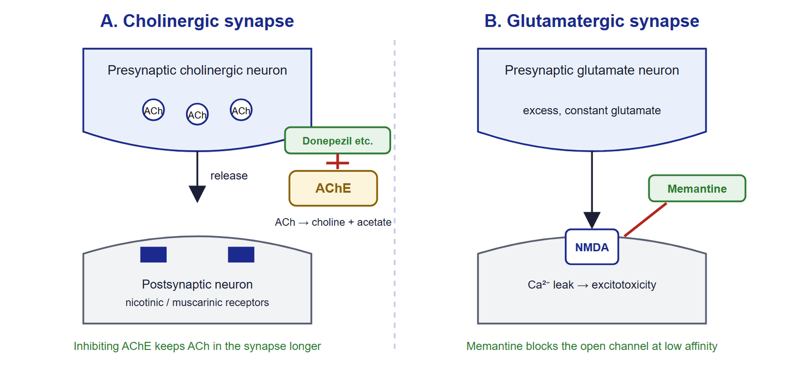
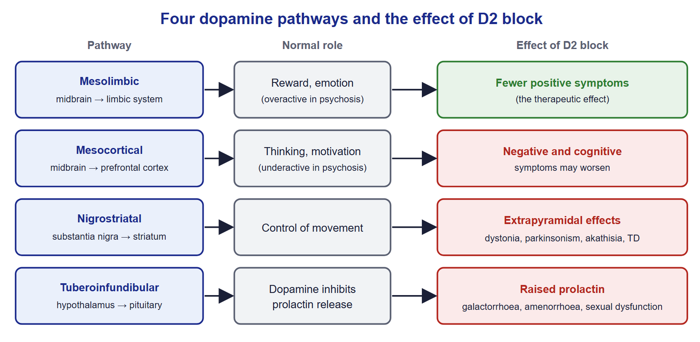
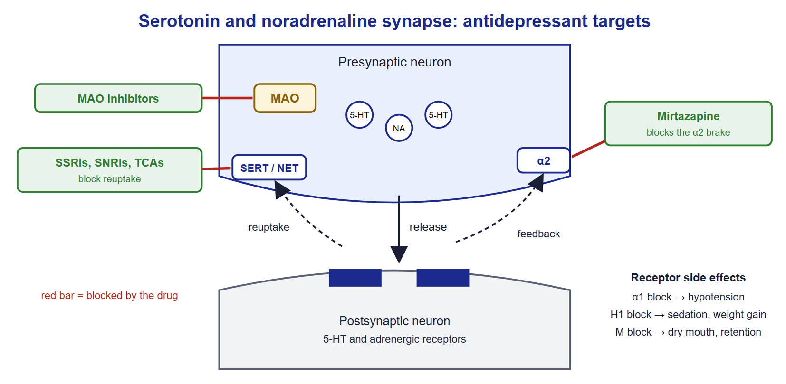
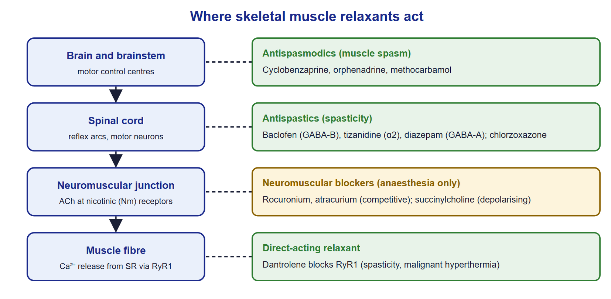
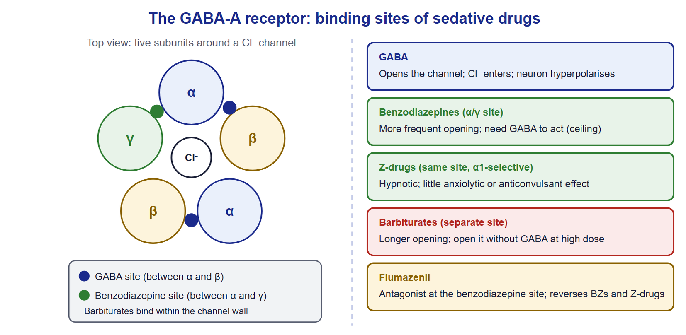
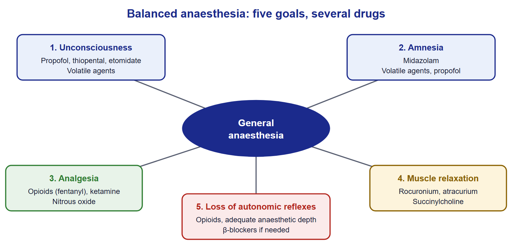
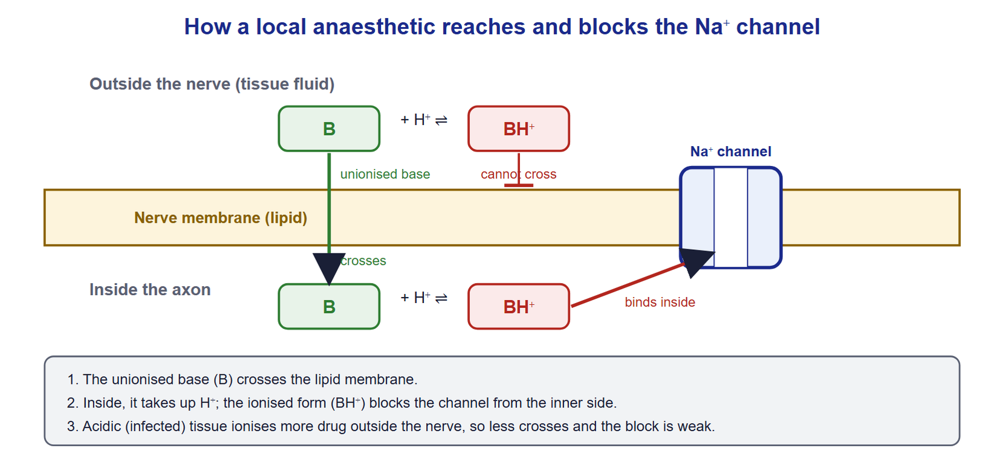

# Practical Pharmacology of the Central Nervous System

**A Laboratory and Section Guide**

Pharmacology 2 · Clinical Pharmacy Program (PharmD) · Level 3

Department of Pharmacology and Toxicology, Faculty of Pharmacy, Port Said University

**Authors**

Assoc. Prof. Dr. Ahmed Mourad

Assoc. Prof. Dr. Ahmed Gaafar

Assoc. Prof. Dr. Ahmed Saad

Dr. Riffat Ibrahim Riffat, Teaching Assistant

## Contents

- [Chapter 1: Alzheimer's Disease](#chapter-1-alzheimers-disease)
- [Chapter 2: Psychosis and Antipsychotic Drugs](#chapter-2-psychosis-and-antipsychotic-drugs)
- [Chapter 3: Parkinson's Disease](#chapter-3-parkinsons-disease)
- [Chapter 4: Depression and Antidepressant Drugs](#chapter-4-depression-and-antidepressant-drugs)
- [Chapter 5: Epilepsy and Antiseizure Drugs](#chapter-5-epilepsy-and-antiseizure-drugs)
- [Chapter 6: Skeletal Muscle Relaxants](#chapter-6-skeletal-muscle-relaxants)
- [Chapter 7: Anxiolytics, Sedatives and Hypnotics](#chapter-7-anxiolytics-sedatives-and-hypnotics)
- [Chapter 8: General Anaesthetics](#chapter-8-general-anaesthetics)
- [Chapter 9: Local Anaesthetics](#chapter-9-local-anaesthetics)

## How to Use This Book

This book goes with the CNS sections of Pharmacology 2. Each section lasts two hours. The book gives you what you need for that time: the key drugs, how they work, how to use them safely, and practice questions. It does not replace your lecture notes or your textbook. Some weeks cover two chapters together, so read both before the section.

You have finished Pharmacology 1. Each chapter therefore starts with a very short **Quick Recap** of the physiology or pharmacology you already know. Read it first. If it feels unfamiliar, go back to your Pharmacology 1 notes before the section.

### How each chapter is built

Every chapter follows the same order, so you always know where to look:

1. **Learning Objectives** tell you what you should be able to do at the end. Every question in the chapter is tagged with the objective it tests, for example [LO2].
2. **Quick Recap** reminds you of the background you need.
3. **Core sections** explain the disease in brief, then each drug class: mechanism, uses, adverse effects and interactions.
4. **One mechanism diagram** shows where the drugs act. Study it until you can draw it yourself.
5. **Comparison tables** set drug against drug. They are the fastest way to revise.
6. **Choosing a Drug** links the pharmacology to current guidelines and to patient factors.
7. **Brands in Egypt** lists brand examples from the section slides.
8. **For Discussion** gives questions we will talk about in the section.
9. **Key Takeaways** sum up the chapter in a few lines.
10. **Self-Assessment** has ten single-best-answer questions and two or three short clinical cases. **Answers and Rationales** follow, with a reason for every option.

### The boxes

> **Quick Recap:** Background from Pharmacology 1 and physiology.

> **Clinical Pearl:** A practical point that helps you use a drug well in real patients.

> **Caution:** A safety warning: serious toxicity, a dangerous interaction or a group of patients at risk.

> **Exam Tip:** A point that is often tested, or a common confusion to avoid.

### Using the self-assessment

Try the questions **before** you look at the answers. Mark the ones you got wrong, then read the rationale and the related section again. Work through the clinical cases in pairs during the section. Write short answers, as you would in a practical exam: name the problem, explain the pharmacology, and state what you would do.

### A note on brands and doses

Brand names are examples taken from the section slides, to help you link generic names to products in Egyptian pharmacies. Their listing is not a recommendation. Availability changes often; the current Egyptian Drug Authority list is the reference. Doses appear only where they matter for safety, such as maximum doses and toxic doses.

This book is for education. It is not a prescribing guide. Always check the current product information and local guidelines before you give advice to a patient.

### Errors and feedback

The slides this book is based on were reviewed, and the errors found were corrected. They are listed in the errata ledger at the end of the book. If you find a mistake or something unclear, tell your section teaching assistant.

---

# Chapter 1: Alzheimer's Disease

## Learning Objectives
By the end of this chapter you will be able to:
1. [LO1] Describe the brain and neurochemical changes of Alzheimer's disease that the drugs target.
2. [LO2] Explain the mechanisms of cholinesterase inhibitors and memantine.
3. [LO3] Compare donepezil, rivastigmine, galantamine and memantine in use, adverse effects and interactions.
4. [LO4] Select a drug for a patient by disease stage and comorbidity.
5. [LO5] Counsel a patient and caregiver on realistic benefit, titration and safety.

> **Quick Recap:** Acetylcholine (ACh) is made from choline and acetyl-CoA by choline acetyltransferase. It acts on nicotinic and muscarinic receptors. Acetylcholinesterase (AChE) breaks ACh down in the synaptic cleft within milliseconds. Glutamate is the main excitatory transmitter of the brain. Its NMDA receptor is a calcium channel blocked by magnesium at rest. Too much calcium entry through NMDA receptors damages neurons. This is called excitotoxicity.

## 1.1 The Disease in Brief

Alzheimer's disease is the most common cause of dementia. It is a progressive neurodegenerative disease. Lost neurons do not regenerate. The disease has three main features:

- **Memory loss** that gets worse over time, starting with recent events.
- **Cognitive decline**: problems with language, planning and recognising people and objects.
- **Behavioural and psychological symptoms**: depression, agitation, aggression and psychosis.

Two forms are recognised by age of onset.

| Feature | Early-onset | Late-onset |
|---|---|---|
| Age at onset | Below 65 years | 65 years or older |
| Share of cases | About 5% | About 95% |
| Genetics | Some families carry autosomal-dominant mutations (APP, PSEN1, PSEN2); under 1% of all cases | Sporadic; APOE ε4 raises risk |
| Progression | Often faster | Usually slower |

*Table 1.1 — Early-onset and late-onset Alzheimer's disease.*

### What happens in the brain

The brain shrinks (atrophy). The loss is greatest in the hippocampus, which forms new memories. Two lesions build up [1, 2]:

- **β-amyloid plaques** outside neurons. They disturb synapses between neurons.
- **Neurofibrillary tangles** of abnormal tau protein inside neurons. They kill the neuron from within.

Two chemical changes explain today's drugs:

- **Less acetylcholine.** Cholinergic neurons of the basal forebrain die early. Memory and attention depend on them.
- **Too much glutamate activity.** Constant NMDA receptor stimulation lets calcium leak into neurons. This adds to neuron damage.

### Risk factors and diagnosis

Age is the strongest risk factor. Others are family history, APOE ε4, head injury, low education, hearing loss, diabetes, hypertension, smoking and physical inactivity. Controlling blood pressure, diabetes and hearing loss may lower risk.

Diagnosis is clinical. The doctor takes a history from the patient and a relative, and tests memory with a short scale. Blood tests exclude reversible causes such as low vitamin B12, hypothyroidism and drug side effects. Brain imaging supports the diagnosis. Amyloid PET or cerebrospinal fluid tests confirm amyloid when antibody treatment is considered.

> **Clinical Pearl:** Before blaming dementia, review the medicines. Anticholinergics, benzodiazepines, opioids and sedating antihistamines can all cause confusion in older people.

*Figure 1.1 — Cholinergic and glutamatergic synapses: where cholinesterase inhibitors and memantine act.*  
Original diagram for this book (original)

## 1.2 Treatment Goals

No current drug cures Alzheimer's disease. The standard drugs are **symptomatic**. They may give a modest, temporary benefit in memory, thinking and daily function. They do not stop the underlying disease [3]. Many patients improve a little or stay stable for months. The disease still progresses.

The two standard drug groups are:

- **Cholinesterase inhibitors**: donepezil, rivastigmine and galantamine. They raise acetylcholine.
- **NMDA receptor antagonist**: memantine. It reduces harmful glutamate activity.

Alzheimer's disease affects the whole family. Caregivers need clear information, support and a plan for later stages.

> **Clinical Pearl:** Set expectations before the first dose. Tell the family that the drug may help memory and daily activities a little. It will not reverse the disease. Agree when you will review benefit, usually after 3 to 6 months.

## 1.3 Cholinesterase Inhibitors

**Members:** donepezil, rivastigmine and galantamine. They are first-line for mild to moderate disease [3].

**Mechanism.** These drugs inhibit AChE in the brain. Acetylcholine then stays longer in the synapse. Cholinergic transmission improves, and so do attention and memory. Rivastigmine also inhibits butyrylcholinesterase. Galantamine also enhances nicotinic receptor responses.

**Selectivity is not complete.** The drugs also raise acetylcholine outside the brain. This explains most adverse effects.

| Feature | Donepezil | Rivastigmine | Galantamine |
|---|---|---|---|
| Enzyme | AChE (reversible) | AChE and BuChE (pseudo-irreversible) | AChE (reversible) + nicotinic modulation |
| Dosing | Once daily | Twice daily with food, or daily patch | Twice daily or once-daily modified release |
| Metabolism | CYP2D6, CYP3A4 | Esterases (no CYP) | CYP2D6, CYP3A4 |
| Main advantage | Simple once-daily dose | Patch reduces GI effects; no CYP interactions | Two actions on cholinergic transmission |

*Table 1.2 — Comparison of cholinesterase inhibitors.*

### Adverse effects

Most adverse effects are cholinergic. Remember them with the muscarinic signs of excess ACh:

- **Gastrointestinal**: nausea, vomiting, diarrhoea, abdominal cramps, loss of appetite and weight.
- **Cardiac**: bradycardia, heart block and fainting (syncope).
- **Others**: salivation, urinary frequency, muscle cramps, insomnia and vivid dreams.

Start with a low dose and increase slowly, usually every 4 weeks. This reduces GI effects.

> **Caution:** Cholinesterase inhibitors slow the heart. Check the pulse before starting and at each review. Use caution in patients with conduction disease or a slow heart rate. Take extra care with other drugs that slow the heart, such as beta-blockers, digoxin and verapamil. A fall or faint may be the first sign.

### Drug interactions

- **CYP inhibitors** (for example fluoxetine, paroxetine, ketoconazole, clarithromycin) raise donepezil and galantamine levels. Rivastigmine is not metabolised by CYP, so this does not apply to it.
- **Anticholinergic drugs** oppose the benefit. Examples are tricyclic antidepressants, oxybutynin and first-generation antihistamines.
- **Bradycardic drugs** add to the heart rate effect.

> **Exam Tip:** Rivastigmine is the cholinesterase inhibitor that is **not** a CYP substrate. It is metabolised by the same esterases it inhibits.

## 1.4 NMDA Receptor Antagonist: Memantine

**Mechanism.** Memantine is a low-affinity, voltage-dependent blocker of the NMDA receptor channel. It blocks the constant, low-level leak of calcium caused by excess glutamate. It leaves the brief, strong signals needed for learning mostly intact [1]. This is why it is well tolerated.

**Use.** Memantine is used for moderate to severe Alzheimer's disease. It can be given alone or added to a cholinesterase inhibitor [3]. It is also an option when a cholinesterase inhibitor is not tolerated or is contraindicated.

**Adverse effects.** They are usually mild: dizziness, headache, confusion, agitation, constipation and sleepiness.

**Kinetics.** Memantine is excreted mainly unchanged by the kidney. Reduce the dose in severe renal impairment.

## 1.5 Newer Disease-Modifying Antibodies

Lecanemab and donanemab are monoclonal antibodies against β-amyloid. They remove amyloid plaques from the brain [4, 5]. In trials they slowed decline modestly in early Alzheimer's disease. They are given by intravenous infusion.

Their use is limited:

- Only for early disease (mild cognitive impairment or mild dementia) with proven amyloid.
- They can cause **amyloid-related imaging abnormalities (ARIA)**: brain swelling or small bleeds. Regular MRI monitoring is needed.
- The risk of ARIA is higher in people with two copies of APOE ε4 and in those taking anticoagulants.

These drugs are specialist treatments. They are not yet widely available in Egypt.

## 1.6 Choosing a Drug

| Situation | Preferred choice | Notes |
|---|---|---|
| Mild to moderate disease | Donepezil, rivastigmine or galantamine | Choose by dosing, cost and adverse effects |
| Nausea or poor adherence to tablets | Rivastigmine patch | Fewer GI effects |
| Moderate disease, AChE inhibitor not tolerated | Memantine | Also if AChE inhibitor contraindicated |
| Severe disease | Memantine | Can continue or add to an AChE inhibitor |
| Moderate to severe disease already on an AChE inhibitor | Consider adding memantine | Combination is common practice |
| Bradycardia or heart block | Avoid AChE inhibitors; consider memantine | Check ECG |

*Table 1.3 — Drug choice by stage and patient factor, based on NICE NG97 [3].*

### Depression and behaviour in Alzheimer's disease

Depression is common in Alzheimer's disease. Choose an antidepressant with few anticholinergic effects, because anticholinergic drugs worsen memory. An SSRI such as sertraline or citalopram is usually preferred [6]. Avoid tricyclic antidepressants.

Agitation and aggression are first managed without drugs. An antipsychotic is used only for severe, distressing symptoms or risk of harm. Risperidone is licensed for short-term use (up to 6 weeks) for persistent aggression. Antipsychotics raise the risk of stroke and death in people with dementia.

> **Caution:** Avoid anticholinergic drugs in people with dementia. Check the whole medication list, including over-the-counter sleep aids and bladder drugs.

## 1.7 Counselling the Patient and Caregiver

Good counselling improves adherence and catches problems early. Speak to the caregiver as well as the patient. The patient may not remember the advice.

**Starting treatment**

- Explain the aim: a modest, temporary help with memory and daily life.
- Give the starting dose and the date of the next dose increase.
- Take donepezil once daily. Some patients sleep badly or have vivid dreams; morning dosing helps.
- Take rivastigmine capsules with breakfast and the evening meal.
- Apply a new rivastigmine patch each day to clean, dry, hairless skin on the back, upper arm or chest. Remove the old patch first. Change the site each day.

**Warning signs to report**

- Fainting, dizziness or a very slow pulse.
- Vomiting that does not stop, black stools or weight loss.
- New confusion, agitation or hallucinations.

**Practical support**

- Use a weekly pill organiser or blister pack.
- Keep one written list of all medicines, including herbal and over-the-counter products.
- If doses are missed for several days, do not restart at the full dose. Ask the doctor or pharmacist, because GI effects return.

> **Exam Tip:** A patient who stops a cholinesterase inhibitor for more than a few days should restart at the lowest dose and titrate again.

## 1.8 Brands in Egypt

| Generic name | Brand examples | Dosage forms |
|---|---|---|
| Donepezil | Aricept | Tablets |
| Rivastigmine | Exelon | Capsules, transdermal patch |
| Memantine | Ebixa, Alzmenda, Memexa | Tablets |

*Table 1.4 — Brand examples from the section slides. Availability changes; check the current Egyptian Drug Authority list.*

## 1.9 For Discussion

1. A daughter asks why her father's memory is still getting worse after 6 months on donepezil. How do you explain what the drug can and cannot do?
2. An 80-year-old woman on donepezil starts bisoprolol and faints. What happened, and what would you recommend?
3. Why is an SSRI a better choice than amitriptyline for depression in a patient with Alzheimer's disease?

## Key Takeaways
- Alzheimer's disease causes loss of cholinergic neurons and harmful glutamate activity.
- Cholinesterase inhibitors raise brain acetylcholine; memantine blocks excessive NMDA receptor activity.
- Standard drugs give modest symptomatic benefit and do not stop the disease.
- Cholinesterase inhibitors cause GI and cardiac effects; start low, go slow and check the pulse.
- Rivastigmine has no CYP metabolism and comes as a patch.
- Memantine is for moderate to severe disease, alone or with a cholinesterase inhibitor.
- Avoid anticholinergic drugs; prefer an SSRI for depression.

## Self-Assessment
**Q1.** Modest improvement in memory in Alzheimer's disease can occur with drugs that increase transmission at which receptors? [LO2]
A) Adrenergic
B) Cholinergic
C) Dopaminergic
D) GABAergic

**Q2.** Which drug blocks glutamate NMDA receptors and can be combined with a cholinesterase inhibitor? [LO2]
A) Rivastigmine
B) Ropinirole
C) Fluoxetine
D) Memantine

**Q3.** Which statement about donepezil is correct? [LO1]
A) It removes amyloid plaques.
B) It gives modest symptomatic benefit.
C) It reverses neuron loss.
D) It stops disease progression.

**Q4.** A 78-year-old man starts donepezil. Two weeks later he has nausea and diarrhoea. What is the most likely cause? [LO3]
A) Muscarinic stimulation from raised acetylcholine
B) NMDA receptor block
C) Dopamine receptor stimulation
D) An allergic reaction

**Q5.** Which cholinesterase inhibitor is least likely to interact with CYP inhibitors? [LO3]
A) Donepezil
B) Galantamine
C) Rivastigmine
D) All interact equally

**Q6.** A woman with mild Alzheimer's disease has a resting heart rate of 48 beats per minute. Which is the best action? [LO4]
A) Start donepezil at full dose.
B) Start galantamine with a beta-blocker.
C) Start rivastigmine without monitoring.
D) Avoid a cholinesterase inhibitor and review the heart rate cause.

**Q7.** Which medicine is most likely to reduce the benefit of donepezil? [LO3]
A) Paracetamol
B) Amitriptyline
C) Sertraline
D) Omeprazole

**Q8.** A patient with Alzheimer's disease develops depression. Which drug is most suitable? [LO4]
A) Sertraline
B) Amitriptyline
C) Imipramine
D) Clomipramine

**Q9.** What is the main risk that requires MRI monitoring with lecanemab? [LO5]
A) Liver failure
B) Agranulocytosis
C) Amyloid-related imaging abnormalities
D) Hyperkalaemia

**Q10.** A caregiver asks when the benefit of rivastigmine should be judged. What is the best reply? [LO5]
A) After the first dose
B) Only after 5 years
C) Benefit cannot be judged
D) After 3 to 6 months at a tolerated dose

**Clinical Case.**

*Case 1.* The wife of Mr N, a 68-year-old man, asks the pharmacist for advice. Over the last few months his mood has become unstable. His memory and concentration are poor. He is impulsive and uses rude language, which is new for him. A neurologist diagnoses mild to moderate Alzheimer's disease. (a) Which drug group is first-line, and how does it work? (b) What would you tell his wife about the expected benefit? (c) Mr N later develops depression. How would you choose an antidepressant?

*Case 2.* Mrs S, 82, has moderate Alzheimer's disease. She takes donepezil 10 mg, bisoprolol 5 mg and oxybutynin 5 mg twice daily for bladder urgency. She has fallen twice this month. (a) Which drug-related causes of her falls do you suspect? (b) What changes would you suggest?

*Case 3.* Mr K, 74, has moderate Alzheimer's disease and takes rivastigmine capsules. He vomits after most doses and has lost 4 kg. His daughter says he often refuses tablets. What change would you suggest?

## Answers and Rationales
**Q1. B** — Cholinesterase inhibitors raise acetylcholine and improve memory modestly. A, C and D do not improve memory in Alzheimer's disease.

**Q2. D** — Memantine is an NMDA receptor antagonist and is often added to a cholinesterase inhibitor. A is a cholinesterase inhibitor. B is a dopamine agonist. C is an SSRI.

**Q3. B** — Donepezil is symptomatic. A describes anti-amyloid antibodies. C and D are false.

**Q4. A** — Raised acetylcholine stimulates gut muscarinic receptors. B, C and D do not explain these effects.

**Q5. C** — Rivastigmine is broken down by esterases, not CYP enzymes. A and B are CYP substrates, so D is wrong.

**Q6. D** — Bradycardia is a caution for all cholinesterase inhibitors; find the cause first. A, B and C risk further slowing of the heart.

**Q7. B** — Amitriptyline is strongly anticholinergic and opposes the drug. A, C and D have no relevant anticholinergic effect.

**Q8. A** — Sertraline has few anticholinergic effects. B, C and D are tricyclics that worsen memory.

**Q9. C** — ARIA (brain swelling or small bleeds) needs MRI monitoring. A, B and D are not typical of lecanemab.

**Q10. D** — Benefit is reviewed after a few months at a tolerated dose. A is too early. B and C are wrong.

**Clinical Case — model answer.**

*Case 1.* (a) Cholinesterase inhibitors, such as donepezil, rivastigmine or galantamine, are first-line. They inhibit AChE and raise brain acetylcholine. (b) The drug may help memory and daily function a little for a time. It will not cure the disease or stop it progressing. Review benefit after 3 to 6 months. (c) Choose an antidepressant with few anticholinergic effects, such as sertraline or citalopram. Avoid tricyclics, which worsen confusion and memory.

*Case 2.* (a) Donepezil and bisoprolol together can cause bradycardia and fainting. Oxybutynin is anticholinergic and worsens confusion; it also opposes donepezil. (b) Check her pulse and ECG. Discuss reducing or stopping bisoprolol or donepezil with the doctor. Stop oxybutynin and consider non-drug bladder measures or mirabegron. Review her other medicines for fall risk.

*Case 3.* Switch to the rivastigmine transdermal patch, starting at the lowest strength. The patch gives steadier blood levels and fewer GI effects than capsules. It also avoids swallowing problems. Teach the daughter to rotate the site and remove the old patch. If GI effects continue, memantine is an alternative for moderate disease.

## References
1. Vanderah TW, editor. Katzung's Basic and Clinical Pharmacology. 16th ed. New York: McGraw Hill; 2024.
2. Whalen K, editor. Lippincott Illustrated Reviews: Pharmacology. 8th ed. Philadelphia: Wolters Kluwer; 2023.
3. National Institute for Health and Care Excellence. Dementia: assessment, management and support for people living with dementia and their carers. NICE guideline NG97. London: NICE; 2018. https://www.nice.org.uk/guidance/ng97
4. van Dyck CH, Swanson CJ, Aisen P, et al. Lecanemab in early Alzheimer's disease. N Engl J Med. 2023;388(1):9-21. DOI: 10.1056/NEJMoa2212948
5. Sims JR, Zimmer JA, Evans CD, et al. Donanemab in early symptomatic Alzheimer disease: the TRAILBLAZER-ALZ 2 randomized clinical trial. JAMA. 2023;330(6):512-527. DOI: 10.1001/jama.2023.13239
6. Ritter JM, Flower RJ, Henderson G, et al. Rang and Dale's Pharmacology. 10th ed. Edinburgh: Elsevier; 2023.

---

# Chapter 2: Psychosis and Antipsychotic Drugs

## Learning Objectives
By the end of this chapter you will be able to:
1. [LO1] Relate the four dopamine pathways to the symptoms of schizophrenia and to antipsychotic adverse effects.
2. [LO2] Compare first-generation, second-generation and partial-agonist antipsychotics by mechanism and adverse-effect profile.
3. [LO3] Recognise extrapyramidal effects, neuroleptic malignant syndrome and metabolic effects, and outline their management.
4. [LO4] Describe clozapine's role and its monitoring.
5. [LO5] Select an antipsychotic and a maintenance plan for a patient.

> **Quick Recap:** Dopamine acts on D1-like (D1, D5) and D2-like (D2, D3, D4) receptors. D2 receptors are Gi-coupled and reduce cAMP. Dopamine is made from tyrosine through L-dopa. It is removed by reuptake and broken down by MAO and COMT. Serotonin 5-HT2A receptors on dopamine neurons reduce dopamine release. Blocking them therefore increases dopamine release in some pathways.

## 2.1 Dopamine Pathways in the Brain

Four dopamine pathways explain both the benefits and the adverse effects of antipsychotics [1].

| Pathway | Normal role | In schizophrenia | Effect of D2 block |
|---|---|---|---|
| Mesolimbic | Reward, emotion, motivation | Overactive → positive symptoms | Reduces positive symptoms (the aim) |
| Mesocortical | Cognition, attention, planning | Underactive → negative and cognitive symptoms | May worsen negative symptoms |
| Nigrostriatal | Control of movement (with ACh) | Normal | Extrapyramidal effects |
| Tuberoinfundibular | Inhibits prolactin release | Normal | Hyperprolactinaemia |

*Table 2.1 — Dopamine pathways and antipsychotic effects.*

Dopamine also acts on the chemoreceptor trigger zone (CTZ), where it causes vomiting. D2 block there explains the antiemetic effect.

*Figure 2.1 — The four dopamine pathways and the effect of D2-receptor block in each.*  
Original diagram for this book (original)

## 2.2 Schizophrenia in Brief

Schizophrenia affects about 1% of people. It usually starts in late adolescence or early adulthood. Genes play a large part. Symptoms fall into three groups [2]:

- **Positive symptoms** — things added to normal experience: delusions (fixed false beliefs), hallucinations (usually voices) and disorganised speech. They are linked to excess dopamine in the mesolimbic pathway.
- **Negative symptoms** — things lost: blunted emotion, apathy, poverty of speech and social withdrawal. Self-care and hygiene often suffer. They are linked to low dopamine in the mesocortical pathway.
- **Cognitive symptoms** — poor attention, memory and planning.

Antipsychotics do not cure schizophrenia. They reduce hallucinations and delusions and allow the person to live in the community. Treatment is a balance between benefit and a wide range of adverse effects.

## 2.3 First-Generation (Typical) Antipsychotics

**Members.**

- Phenothiazines: chlorpromazine (low potency), fluphenazine (high potency).
- Butyrophenones: haloperidol (high potency), droperidol.

**Mechanism.** They are competitive antagonists at D2 receptors. The block is not selective for the mesolimbic pathway, so all four pathways are affected. They also block other receptors, which explains many adverse effects.

**Potency matters.** High-potency drugs such as haloperidol bind D2 strongly. They cause more extrapyramidal effects. Low-potency drugs such as chlorpromazine block more muscarinic, histamine H1 and α1 receptors. They cause more sedation, hypotension and anticholinergic effects.

| Receptor blocked | Adverse effect |
|---|---|
| D2 (nigrostriatal) | Extrapyramidal effects |
| D2 (pituitary) | Raised prolactin: galactorrhoea, amenorrhoea, gynaecomastia, sexual dysfunction |
| Muscarinic M1 | Dry mouth, constipation, urinary retention, blurred vision, confusion |
| Histamine H1 | Sedation, weight gain |
| α1-adrenoceptor | Orthostatic hypotension, dizziness, sexual dysfunction |

*Table 2.2 — Receptor block and adverse effects of antipsychotics.*

**Therapeutic uses.**

- Schizophrenia and other psychoses (mainly positive symptoms).
- Acute mania and severe agitation.
- Severe nausea and vomiting (for example droperidol, prochlorperazine).
- Intractable hiccup (chlorpromazine).

## 2.4 Extrapyramidal Effects

Extrapyramidal effects (EPS) come from D2 block in the nigrostriatal pathway. Acetylcholine then becomes relatively dominant. Learn them by time of onset [3].

| Effect | Onset | Features | Management |
|---|---|---|---|
| Acute dystonia | Hours to days | Painful spasm of neck, jaw, tongue or eyes (oculogyric crisis) | IM or IV anticholinergic (procyclidine, biperiden); reversible |
| Akathisia | Days to weeks | Inner restlessness, cannot sit still | Reduce dose; propranolol; switch drug |
| Parkinsonism | Weeks | Tremor, rigidity, slow movement | Reduce dose or switch; oral anticholinergic short term |
| Tardive dyskinesia | Months to years | Involuntary movements of lips, tongue and face | Stop anticholinergics; reduce or switch (clozapine); VMAT2 inhibitor; may be irreversible |

*Table 2.3 — Extrapyramidal effects by time of onset.*

> **Caution:** Anticholinergic drugs treat dystonia and parkinsonism but can worsen tardive dyskinesia. Do not add them routinely. Review the need for them regularly.

> **Exam Tip:** Acute dystonia is the earliest EPS and is reversible. Tardive dyskinesia is the latest and may be permanent.

## 2.5 Neuroleptic Malignant Syndrome

Neuroleptic malignant syndrome (NMS) is rare but can be fatal. It can occur with any antipsychotic, usually early in treatment or after a dose increase [3].

**Features:**

- High fever.
- "Lead-pipe" muscle rigidity.
- Altered mental state: confusion, reduced consciousness.
- Autonomic instability: labile or raised blood pressure, tachycardia, sweating.
- Raised creatine kinase (CK) from muscle breakdown; risk of kidney injury.

**Management:** stop the antipsychotic at once. Give cooling, IV fluids and supportive care in hospital. Dantrolene or bromocriptine may be used in severe cases.

> **Caution:** A patient on an antipsychotic with fever and rigidity needs urgent medical review. Do not restart the drug until NMS has resolved and a specialist has advised.

## 2.6 Second-Generation (Atypical) Antipsychotics

**Members:** risperidone, olanzapine, quetiapine, clozapine, and the partial agonists aripiprazole, brexpiprazole and cariprazine.

**Mechanism.** Most second-generation antipsychotics (SGAs) block both D2 and 5-HT2A receptors. 5-HT2A block increases dopamine release in the nigrostriatal and mesocortical pathways. This has two results [1]:

- **Fewer EPS**, because dopamine is partly restored in the nigrostriatal pathway.
- **Some benefit for negative symptoms**, because dopamine rises in the mesocortical pathway.

Affinities differ between drugs. Risperidone at high doses acts much like a first-generation drug and causes EPS and raised prolactin.

### Full antagonists and partial agonists

**Full antagonists** (haloperidol, risperidone) occupy the D2 receptor without activating it. They block dopamine completely.

**Partial agonists** (aripiprazole, brexpiprazole, cariprazine) act like a "dimmer switch". They activate the receptor less than dopamine does:

- Where dopamine is high (mesolimbic), they compete with dopamine and act as antagonists.
- Where dopamine is low (mesocortical), they give some stimulation.

This gives a lower risk of raised prolactin, weight gain and EPS. Akathisia and restlessness are common early. Partial agonists may be less effective in severe or resistant illness.

**Cariprazine** is a D3-preferring D2/D3 partial agonist. Its D3 activity may help negative symptoms. It has a low risk of weight gain, metabolic change, raised prolactin and QT prolongation. It is licensed for schizophrenia and bipolar disorder.

### Adverse effects of SGAs

- **Metabolic syndrome**: weight gain, diabetes and raised lipids. These are due mainly to H1 and 5-HT2C block. The risk is highest with clozapine and olanzapine and lowest with aripiprazole and cariprazine.
- **EPS and NMS**: less common than with first-generation drugs, but they can occur.
- **Raised prolactin**: marked with risperidone and paliperidone.
- **Sedation and hypotension**: marked with quetiapine and clozapine.
- **QT prolongation**: with both generations, especially at high doses or with other QT-prolonging drugs.

| Drug | EPS | Prolactin | Weight / metabolic | Sedation |
|---|---|---|---|---|
| Haloperidol | +++ | +++ | + | + |
| Chlorpromazine | ++ | ++ | ++ | +++ |
| Risperidone | ++ (dose-related) | +++ | ++ | + |
| Olanzapine | + | + | +++ | ++ |
| Quetiapine | ± | ± | ++ | +++ |
| Clozapine | ± | ± | +++ | +++ |
| Aripiprazole | + (akathisia) | − | ± | ± |
| Cariprazine | + (akathisia) | − | ± | ± |

*Table 2.4 — Adverse-effect profiles of antipsychotics (+++ high, ± minimal, − none).*

> **Clinical Pearl:** Measure weight, waist, blood pressure, fasting glucose or HbA1c and lipids before starting an SGA. Repeat at 12 weeks and then at least yearly.

## 2.7 Clozapine

Clozapine is the most effective drug for **treatment-resistant schizophrenia**. This is defined as poor response to at least two antipsychotics, including one SGA, each given at an adequate dose for 6 weeks or more [4]. Clozapine also lowers suicide risk.

**Main risks:**

- **Agranulocytosis** in about 1% of patients, mostly in the first 18 weeks.
- Myocarditis and cardiomyopathy, mostly in the first 2 months.
- Seizures at high doses.
- Severe constipation, which can cause bowel obstruction.
- Hypersalivation, sedation, weight gain and metabolic syndrome.

**Blood monitoring:** check the absolute neutrophil count (ANC) before starting. Then check weekly for 18 weeks, every 2 weeks to 1 year, and monthly after that. Stop clozapine if neutrophils fall below the threshold.

> **Caution:** A patient on clozapine with fever, sore throat or flu-like symptoms needs an urgent blood count. Smoking changes clozapine levels: stopping smoking can raise levels quickly and cause toxicity.

## 2.8 Maintenance and Adherence

Most patients need long-term treatment. After two or more episodes, maintenance therapy is given for at least 5 years, and often indefinitely. Low doses are less effective than standard doses at preventing relapse [2].

Adherence is often poor, because of:

- Poor insight into the illness or denial of it.
- Cognitive problems.
- Adverse effects, which are clinically significant in most patients.

**Long-acting injections** help when adherence is poor. Examples are haloperidol decanoate, fluphenazine decanoate, paliperidone palmitate, risperidone and aripiprazole depot. They do not solve every cause of non-adherence. They do show clearly when a dose is missed.

## 2.9 Pharmacokinetics and Drug Interactions

Antipsychotics are lipophilic. They are well absorbed, cross the blood-brain barrier and are highly protein bound. Most are metabolised in the liver by CYP enzymes. Half-lives are usually 20 to 40 hours, so once-daily dosing is often possible [1, 3].

| Drug | Main enzyme | Practical point |
|---|---|---|
| Clozapine, olanzapine | CYP1A2 | Smoking induces CYP1A2 and lowers levels; stopping smoking raises levels; fluvoxamine and ciprofloxacin raise levels |
| Risperidone, aripiprazole, haloperidol | CYP2D6 (and CYP3A4) | Fluoxetine and paroxetine raise levels; halve aripiprazole with strong CYP2D6 inhibitors |
| Quetiapine, cariprazine | CYP3A4 | Ketoconazole and clarithromycin raise levels; carbamazepine and rifampicin lower them |
| Paliperidone | Mainly renal | Reduce dose in renal impairment |

*Table 2.5 — Metabolism of antipsychotics and key interactions.*

### Pharmacodynamic interactions

- **QT prolongation.** Avoid combining antipsychotics with other QT-prolonging drugs: macrolides, fluoroquinolones, methadone, citalopram, some antiarrhythmics. Low potassium or magnesium adds to the risk. Haloperidol IV, thioridazine and pimozide carry the highest risk.
- **CNS depression.** Alcohol, benzodiazepines, opioids and sedating antihistamines add to sedation and respiratory depression.
- **Anticholinergic load.** Tricyclics, antihistamines and bladder antimuscarinics add to constipation, urinary retention and confusion. Clozapine-induced constipation can become life-threatening.
- **Levodopa and dopamine agonists.** Antipsychotics block their effect, and they can worsen psychosis. In Parkinson's disease psychosis, use low-dose quetiapine or clozapine.
- **Antihypertensives.** α1 block adds to their effect and causes postural hypotension.

> **Exam Tip:** Clozapine and olanzapine are CYP1A2 substrates. Smoking lowers their levels; a patient who stops smoking in hospital may become toxic.

## 2.10 Special Populations

**Older people and dementia.** Older people are sensitive to sedation, postural hypotension, anticholinergic effects and EPS. Start low and go slow. In dementia, all antipsychotics raise the risk of stroke and death. Use them only for severe distress or risk of harm, for the shortest time, and review every few weeks.

**Pregnancy.** Untreated psychosis carries serious risks for mother and baby. Do not stop an effective antipsychotic suddenly when a woman becomes pregnant. Discuss options with a specialist. Watch for gestational diabetes with olanzapine and clozapine. Newborns may show transient EPS or withdrawal after exposure late in pregnancy. Avoid valproate if a mood stabiliser is needed.

**Children and adolescents.** Young people gain weight and develop metabolic changes faster than adults. Monitor closely.

**Epilepsy.** Clozapine, chlorpromazine and high doses of most antipsychotics lower the seizure threshold. Haloperidol and aripiprazole are lower-risk choices.

## 2.11 Counselling the Patient

Good counselling improves adherence. Speak simply and involve the family when the patient agrees.

- **Why the drug is needed.** It reduces voices and troubling thoughts. It works over days to weeks. Keep taking it even when well, because stopping often leads to relapse.
- **Common early effects.** Sleepiness and dizziness often settle. Stand up slowly. Do not drive until you know how the drug affects you.
- **Effects to report.** Stiffness, restlessness or shaking; fever with stiff muscles; breast changes or missed periods; rapid weight gain or constant thirst.
- **Lifestyle.** Eat regular, balanced meals and stay active to limit weight gain. Avoid alcohol and cannabis, which worsen psychosis.
- **Clozapine.** Never miss a blood test. Report fever, sore throat or chest pain at once. Tell the team if smoking habits change. Report constipation early.

> **Clinical Pearl:** If a patient misses clozapine for more than 48 hours, it must be restarted at a low dose and titrated again. A full dose after a break can cause severe hypotension and collapse.

## 2.12 Choosing a Drug

| Situation | Suggested choice | Reason |
|---|---|---|
| First episode | An SGA chosen with the patient (e.g. aripiprazole, risperidone, olanzapine) | Choose by adverse-effect profile |
| Obesity, diabetes or family history of diabetes | Aripiprazole, cariprazine | Low metabolic risk |
| History of EPS | Quetiapine, aripiprazole, clozapine | Low EPS risk |
| Raised prolactin or sexual dysfunction | Aripiprazole | Partial agonist lowers prolactin |
| Two adequate trials failed | Clozapine | Only drug proven in resistant illness |
| Poor adherence | Long-acting injection | Ensures delivery |
| Aggression in Alzheimer's disease | Risperidone, short term only | Licensed; raised stroke risk in dementia |

*Table 2.6 — Choosing an antipsychotic, based on APA and NICE guidance [2, 4].*

## 2.13 Brands in Egypt

| Generic name | Brand examples | Dosage forms |
|---|---|---|
| Chlorpromazine | Neurazine | Tablets |
| Haloperidol | Halonace | Tablets |
| Haloperidol decanoate | Haldol Decanoas | Depot injection |
| Olanzapine | Olapex | Tablets |
| Clozapine | Clozapex | Tablets |
| Cariprazine | Reagila | Capsules |

*Table 2.7 — Brand examples from the section slides. Availability changes; check the current Egyptian Drug Authority list.*

## 2.14 For Discussion

1. Blocking D2 receptors in the mesolimbic pathway treats positive symptoms. Why does the same action in the nigrostriatal pathway cause EPS? How would you explain muscle stiffness to a patient in simple words?
2. A patient's mother worries about switching from chlorpromazine to risperidone because of "metabolic side effects". How would you counsel her on the balance between EPS and weight gain?
3. A stable patient on risperidone has marked emotional blunting. Why might a partial agonist be considered? What early adverse effect would you warn about?
4. Why is clozapine the drug of choice in treatment-resistant schizophrenia, and what is the pharmacist's role in its monitoring?

## Key Takeaways
- Positive symptoms reflect mesolimbic dopamine excess; negative and cognitive symptoms reflect mesocortical dopamine deficit.
- First-generation drugs block D2 in all pathways and cause EPS and raised prolactin.
- SGAs add 5-HT2A block: fewer EPS, but more metabolic effects (H1 and 5-HT2C block).
- Partial agonists stabilise dopamine signalling and have low metabolic and prolactin risk.
- NMS is an emergency: stop the drug and give supportive care.
- Clozapine is for resistant illness and needs strict neutrophil monitoring.
- Long-acting injections help when adherence is poor.

## Self-Assessment
**Q1.** Hallucinations in schizophrenia are mainly linked to excess dopamine in which pathway? [LO1]
A) Mesolimbic
B) Nigrostriatal
C) Tuberoinfundibular
D) Mesocortical

**Q2.** Galactorrhoea in a woman taking haloperidol is due to D2 block in which pathway? [LO1]
A) Mesolimbic
B) Mesocortical
C) Tuberoinfundibular
D) Nigrostriatal

**Q3.** An adolescent is newly diagnosed with schizophrenia. Which drug is most likely to help his apathy and blunted affect? [LO2]
A) Chlorpromazine
B) Risperidone
C) Fluphenazine
D) Haloperidol

**Q4.** Which antipsychotic is a partial agonist at D2 receptors? [LO2]
A) Clozapine
B) Haloperidol
C) Risperidone
D) Aripiprazole

**Q5.** Two days after starting haloperidol, a young man has painful twisting of his neck and his eyes roll upward. What is the best treatment? [LO3]
A) Propranolol
B) IM procyclidine or biperiden
C) Dantrolene
D) Valbenazine

**Q6.** A patient on haloperidol has a temperature of 40 °C, rigid muscles, confusion and a very high CK. What is the first step? [LO3]
A) Add an anticholinergic
B) Increase the dose
C) Stop the antipsychotic and give supportive care
D) Switch to a depot injection

**Q7.** Weight gain with olanzapine is mainly due to block of which receptors? [LO3]
A) D2 and M1
B) α1 and D2
C) H1 and 5-HT2C
D) 5-HT1A only

**Q8.** Which test must be done regularly in a patient taking clozapine? [LO4]
A) Neutrophil count
B) Serum lithium
C) Thyroid function
D) Serum potassium only

**Q9.** A man with schizophrenia has type 2 diabetes and obesity. Which antipsychotic is the most suitable? [LO5]
A) Olanzapine
B) Aripiprazole
C) Clozapine
D) Quetiapine

**Q10.** A patient often stops his tablets and relapses. What is the best option? [LO5]
A) Stop all treatment
B) Add a benzodiazepine
C) Reduce the dose
D) A long-acting antipsychotic injection

**Clinical Case.**

*Case 1.* Mr S, a 25-year-old student, comes to the pharmacy in distress. He is unkempt and smells of body odour. His mood changes quickly. He says he feels insects crawling under his skin. He is sure that his neighbour put toxic gas into his flat, and brings his vomit to be analysed as proof. (a) What is the likely diagnosis? (b) He starts chlorpromazine. Three weeks later his mother notices a tremor, slow movements and a stiff face. What is happening and what would you recommend?

*Case 2.* Mr S is switched to risperidone. After 8 weeks at an adequate dose, and an earlier failed trial of olanzapine, his delusions persist. (a) What drug is now indicated? (b) What must be in place before and during treatment?

*Case 3.* Ms R, 30, takes risperidone 6 mg daily. She has stopped having periods and has breast discharge. (a) What is the cause? (b) What would you suggest?

## Answers and Rationales
**Q1. A** — Positive symptoms reflect mesolimbic excess. B and C are motor and hormonal pathways. D is underactive in schizophrenia.

**Q2. C** — Tuberoinfundibular dopamine inhibits prolactin; block raises it. A, B and D do not control prolactin.

**Q3. B** — Risperidone, an SGA, has some benefit for negative symptoms. A, C and D are first-generation drugs.

**Q4. D** — Aripiprazole is a D2 partial agonist. A, B and C are antagonists.

**Q5. B** — Acute dystonia responds quickly to a parenteral anticholinergic. A treats akathisia. C is for NMS. D is for tardive dyskinesia.

**Q6. C** — This is NMS; stop the antipsychotic and give supportive care. A, B and D continue the cause.

**Q7. C** — H1 and 5-HT2C block drive appetite and weight gain. A, B and D do not explain weight gain.

**Q8. A** — Clozapine can cause agranulocytosis. B, C and D are not required for clozapine.

**Q9. B** — Aripiprazole has the lowest metabolic risk. A and C have the highest; D also causes weight gain.

**Q10. D** — A long-acting injection ensures delivery. A, B and C increase relapse risk.

**Clinical Case — model answer.**

*Case 1.* (a) Schizophrenia with delusions and tactile hallucinations; a physical cause and drug misuse must be excluded. (b) He has drug-induced parkinsonism, an EPS from D2 block in the nigrostriatal pathway. Name the EPS type first, because treatment differs. Reduce the dose or switch to an antipsychotic with lower EPS risk, such as aripiprazole or quetiapine. A short course of an oral anticholinergic can help parkinsonism, but it is not given long term.

*Case 2.* (a) Clozapine, because two adequate trials have failed. (b) A baseline neutrophil count and registration with the monitoring scheme. Then weekly counts for 18 weeks, every 2 weeks to 1 year, and monthly after that. Monitor for myocarditis, constipation, seizures and metabolic effects. Teach the family to report fever or sore throat at once.

*Case 3.* (a) Raised prolactin from D2 block in the tuberoinfundibular pathway; risperidone causes this often. (b) Check prolactin and exclude pregnancy. Reduce the dose, or switch to aripiprazole, or add low-dose aripiprazole on specialist advice.

## References
1. Vanderah TW, editor. Katzung's Basic and Clinical Pharmacology. 16th ed. New York: McGraw Hill; 2024.
2. Keepers GA, Fochtmann LJ, Anzia JM, et al. The American Psychiatric Association practice guideline for the treatment of patients with schizophrenia. Am J Psychiatry. 2020;177(9):868-872. DOI: 10.1176/appi.ajp.2020.177901
3. Whalen K, editor. Lippincott Illustrated Reviews: Pharmacology. 8th ed. Philadelphia: Wolters Kluwer; 2023.
4. National Institute for Health and Care Excellence. Psychosis and schizophrenia in adults: prevention and management. Clinical guideline CG178. London: NICE; 2014. https://www.nice.org.uk/guidance/cg178

---

# Chapter 3: Parkinson's Disease

## Learning Objectives
By the end of this chapter you will be able to:
1. [LO1] Explain the dopamine–acetylcholine imbalance of Parkinson's disease.
2. [LO2] Describe how carbidopa, COMT inhibitors and MAO-B inhibitors improve levodopa therapy.
3. [LO3] Compare levodopa, dopamine agonists, MAO-B inhibitors, amantadine and anticholinergics.
4. [LO4] Identify key adverse effects and interactions of antiparkinsonian drugs.
5. [LO5] Choose a treatment plan for a patient.

> **Quick Recap:** Dopamine is made from tyrosine: tyrosine → L-dopa → dopamine. The enzyme that makes dopamine from L-dopa is aromatic L-amino acid decarboxylase (AADC, dopa decarboxylase). Dopamine is broken down by MAO-B in the brain and by COMT. Dopamine itself does not cross the blood-brain barrier; L-dopa does, using an amino-acid transporter. In the striatum, dopamine and acetylcholine balance each other to control movement.

## 3.1 The Disease in Brief

Parkinson's disease is a chronic neurodegenerative disease of unknown cause. Dopamine neurons of the substantia nigra die. They project to the striatum (the nigrostriatal pathway). Dopamine is inhibitory there, and acetylcholine is excitatory. With less dopamine, acetylcholine becomes relatively dominant [1].

**Motor features:**

- Resting tremor ("pill-rolling").
- Rigidity ("cogwheel").
- Bradykinesia: slow movement, small shuffling steps, reduced facial expression.
- Postural instability in later disease.

**Non-motor features:** depression, anxiety, sleep disturbance, constipation, loss of smell, postural hypotension and, later, dementia and psychosis.

Treatment aims to raise dopamine activity or lower acetylcholine activity. It improves symptoms but does not stop the disease.

## 3.2 Levodopa

Levodopa (L-dopa) is the most effective drug for Parkinson's disease. It is a precursor of dopamine.

**Kinetics.**

- Absorbed from the small intestine by an amino-acid transporter. Protein-rich meals compete with it and reduce absorption and brain entry.
- Short half-life (1 to 2 hours).
- Given alone, most of a dose is converted to dopamine **outside** the brain by peripheral AADC. Only about 1 to 5% reaches the brain. Peripheral dopamine causes nausea, vomiting, hypotension and arrhythmia.

**Carbidopa** (or benserazide) is a peripheral AADC inhibitor. It does not cross the blood-brain barrier. It is always given with levodopa [2]. Carbidopa:

- Raises the share of levodopa reaching the brain (to about 10%) and lowers the dose needed by about 75%.
- Reduces peripheral adverse effects.

**COMT inhibitors** (entacapone; opicapone; tolcapone) block the other peripheral breakdown route. Levodopa then lasts longer, and "wearing-off" is reduced. Tolcapone is rarely used because it can damage the liver.

**MAO-B inhibitors** (selegiline, rasagiline, safinamide) block dopamine breakdown in the brain.

*Figure 3.1 — Levodopa from gut to brain, with the sites of carbidopa, entacapone and MAO-B inhibitors.*  
Original diagram for this book (original)

### Motor fluctuations

After some years of levodopa, most patients develop fluctuations:

- **Wearing-off:** symptoms return before the next dose.
- **On–off phenomenon:** sudden swings between mobility ("on") and immobility ("off").
- **Dyskinesia:** involuntary writhing movements, often at peak dose.

They reflect disease progression and levodopa's short half-life. Options are smaller, more frequent doses; modified-release levodopa; adding a COMT inhibitor, an MAO-B inhibitor or a dopamine agonist; and amantadine for dyskinesia.

### Adverse effects of levodopa

| Group | Effect | Cause |
|---|---|---|
| Gastrointestinal | Nausea, vomiting | Dopamine at the CTZ (outside the blood-brain barrier) |
| Cardiovascular | Postural hypotension, arrhythmia | Peripheral dopamine and noradrenaline |
| Psychiatric | Hallucinations, confusion, vivid dreams | Dopamine in mesolimbic and mesocortical pathways |
| Motor | Dyskinesia, on–off | Long-term treatment and disease progression |
| Behaviour | Impulse-control disorders (gambling, shopping, hypersexuality) | More common with dopamine agonists |
| Other | Dark urine and sweat | Oxidation of catecholamine metabolites; harmless |

*Table 3.1 — Adverse effects of levodopa.*

> **Clinical Pearl:** For levodopa-induced nausea, use **domperidone**. It blocks D2 receptors in the CTZ but does not cross the blood-brain barrier, so it does not worsen parkinsonism. Metoclopramide and prochlorperazine cross it and must be avoided.

### Drug interactions

- **Non-selective MAO inhibitors** (phenelzine, tranylcypromine): hypertensive crisis. Stop them at least 2 weeks before levodopa.
- **Antipsychotics** block the effect of levodopa. If psychosis develops, use low-dose quetiapine or clozapine.
- **Pyridoxine (vitamin B6)** speeds peripheral decarboxylation of levodopa given alone. With carbidopa–levodopa this is not clinically important.
- **Iron** reduces levodopa absorption; separate the doses.
- **Protein-rich meals** reduce effect; take levodopa 30 minutes before meals if response is erratic.

> **Exam Tip:** The pyridoxine interaction applies to levodopa **alone**. Carbidopa removes it.

## 3.3 Dopamine Agonists

Dopamine agonists act directly on D2 and D3 receptors. They do not need conversion by neurons. They last longer than levodopa and cause fewer motor fluctuations. They cause more hallucinations, sleepiness and impulse-control disorders [1].

- **Non-ergot agonists** (first choice): pramipexole, ropinirole and rotigotine (a daily skin patch).
- **Ergot agonists**: bromocriptine and cabergoline. They are rarely used for Parkinson's disease now. They can cause pulmonary, retroperitoneal and heart-valve fibrosis.

**Adverse effects:** nausea, postural hypotension, hallucinations, confusion, sudden sleep attacks and impulse-control disorders.

> **Caution:** Ask every patient on a dopamine agonist, and the family, about gambling, shopping, eating or sexual behaviour. Warn about sudden sleep; patients should not drive if it occurs. Do not stop agonists suddenly.

## 3.4 MAO-B Inhibitors

**Members:** selegiline, rasagiline and safinamide.

**Mechanism:** selective inhibition of MAO-B, the main enzyme that breaks down dopamine in the striatum. Brain dopamine rises.

**Use:** alone in early disease (mild benefit) or added to levodopa to reduce wearing-off.

**Safety:** at normal doses they do not cause the "cheese reaction", because MAO-A in the gut still breaks down tyramine. Selectivity is lost at high doses. Combining them with pethidine, tramadol or serotonergic antidepressants can cause serotonin syndrome.

## 3.5 Amantadine and Anticholinergics

**Amantadine** is an antiviral found by chance to help Parkinson's disease. It increases dopamine release, reduces dopamine reuptake and blocks NMDA receptors. It is now used mainly for levodopa-induced dyskinesia. Adverse effects: nausea, dizziness, confusion, postural hypotension, ankle oedema and livedo reticularis (mottled skin).

**Anticholinergics** (trihexyphenidyl, biperiden, benztropine, orphenadrine) block central muscarinic receptors and restore the dopamine–acetylcholine balance. They help tremor more than slowness [3]. They cause dry mouth, constipation, urinary retention, blurred vision and confusion. They worsen memory, glaucoma and prostatic enlargement. Avoid them in older people. Large doses cause hallucinations and can be misused.

| Drug group | Main benefit | Main problems |
|---|---|---|
| Levodopa + carbidopa | Most effective for all motor symptoms | Fluctuations and dyskinesia over time |
| Non-ergot dopamine agonists | Longer action, fewer fluctuations | Hallucinations, sleepiness, impulse control |
| MAO-B inhibitors | Mild; reduce wearing-off | Interactions at high dose |
| COMT inhibitors | Prolong each levodopa dose | Dyskinesia; tolcapone liver toxicity |
| Amantadine | Reduces dyskinesia | Confusion, livedo reticularis |
| Anticholinergics | Tremor in young patients | Confusion, retention; avoid in elderly |

*Table 3.2 — Comparison of antiparkinsonian drug groups.*

## 3.6 Choosing a Drug

| Situation | Suggested choice |
|---|---|
| Early disease, motor symptoms affect quality of life | Levodopa + carbidopa |
| Early disease, mild symptoms | Dopamine agonist or MAO-B inhibitor (discuss impulse-control risk) |
| Wearing-off on levodopa | Add a COMT inhibitor, MAO-B inhibitor or dopamine agonist |
| Levodopa-induced dyskinesia | Adjust levodopa; add amantadine |
| Nausea from treatment | Domperidone |
| Psychosis in Parkinson's disease | Reduce anticholinergics and agonists first; then low-dose quetiapine or clozapine |

*Table 3.3 — Treatment choices, based on NICE NG71 [2].*

## 3.7 Brands in Egypt

| Generic name | Brand examples | Dosage forms |
|---|---|---|
| Carbidopa + levodopa | Sinemet, Shatoo (controlled release) | Tablets |
| Biperiden | Cogintol, Biperiden (Pharco) | Tablets |

*Table 3.4 — Brand examples from the section slides. Availability changes; check the current Egyptian Drug Authority list.*

## 3.8 For Discussion

1. Why is carbidopa always given with levodopa, and why does it not reduce levodopa's effect in the brain?
2. A patient on levodopa becomes nauseated. Why is domperidone chosen instead of metoclopramide?
3. A 60-year-old man on pramipexole has started spending his savings on gambling. What is happening, and what would you advise?

## Key Takeaways
- Parkinson's disease is a loss of nigrostriatal dopamine, leaving acetylcholine dominant.
- Levodopa is the most effective drug; carbidopa stops its peripheral conversion.
- COMT and MAO-B inhibitors prolong levodopa's effect.
- Non-ergot dopamine agonists are first-choice agonists; watch for impulse-control disorders and sleep attacks.
- Use domperidone for nausea; avoid antipsychotics and metoclopramide.
- Anticholinergics help tremor but cause confusion; avoid in older people.

## Self-Assessment
**Q1.** Parkinson's disease results mainly from loss of which neurons? [LO1]
A) Cholinergic neurons of the basal forebrain
B) Dopamine neurons of the substantia nigra
C) Serotonin neurons of the raphe nuclei
D) GABA neurons of the cortex

**Q2.** A 56-year-old man with Parkinson's disease starts carbidopa with levodopa. What does carbidopa reduce? [LO2]
A) The levodopa dose needed for a therapeutic effect
B) Levodopa-induced dyskinesia
C) The time to onset in the brain
D) Brain dopamine synthesis

**Q3.** Which combination is an appropriate treatment plan? [LO3]
A) Amantadine, carbidopa and entacapone
B) Ropinirole, carbidopa and selegiline
C) Levodopa, carbidopa and entacapone
D) Pramipexole, carbidopa and entacapone

**Q4.** Peripheral adverse effects of levodopa, such as nausea and hypotension, are reduced by adding which drug? [LO2]
A) Amantadine
B) Ropinirole
C) Tolcapone
D) Carbidopa

**Q5.** A patient on levodopa has nausea. Which antiemetic is the best choice? [LO4]
A) Domperidone
B) Metoclopramide
C) Prochlorperazine
D) Haloperidol

**Q6.** Which adverse effect is most typical of dopamine agonists? [LO4]
A) Gingival hyperplasia
B) Impulse-control disorders
C) Agranulocytosis
D) Hyperkalaemia

**Q7.** Which drug reduces levodopa-induced dyskinesia? [LO3]
A) Carbidopa
B) Entacapone
C) Amantadine
D) Selegiline

**Q8.** Why should trihexyphenidyl be avoided in a 78-year-old man with prostatic enlargement? [LO4]
A) It causes urinary retention and confusion.
B) It causes pulmonary fibrosis.
C) It causes a cheese reaction.
D) It raises blood pressure.

**Q9.** A patient takes carbidopa–levodopa. His doctor adds a vitamin B complex. What is the effect? [LO4]
A) Levodopa is fully inactivated.
B) Hypertensive crisis
C) Serotonin syndrome
D) No clinically important effect

**Q10.** A 68-year-old woman on levodopa finds that her symptoms return an hour before each dose. What is the best option? [LO5]
A) Stop levodopa
B) Add haloperidol
C) Add trihexyphenidyl
D) Add entacapone

**Clinical Case.**

*Case 1.* Mr H, 70, has had Parkinson's disease for 6 years. He takes carbidopa–levodopa 25/100 mg four times daily. He now has involuntary writhing movements an hour after each dose, and stiffness before the next dose. He also reports nausea. (a) Name the two motor problems. (b) Suggest two changes. (c) Which antiemetic is safe?

*Case 2.* Mrs A, 65, takes ropinirole. She has fallen asleep twice while cooking, and her husband says she has started buying things she does not need. (a) What adverse effects are these? (b) What would you advise?

## Answers and Rationales
**Q1. B** — Dopamine neurons of the substantia nigra die. A is Alzheimer's disease. C and D are not the cause.

**Q2. A** — Carbidopa blocks peripheral AADC, so a lower levodopa dose works. B, C and D are not reduced.

**Q3. C** — Carbidopa and entacapone both act on levodopa metabolism. A, B and D add carbidopa or entacapone without levodopa, where they do nothing.

**Q4. D** — Carbidopa prevents peripheral dopamine formation. A, B and C do not reduce these effects.

**Q5. A** — Domperidone does not cross the blood-brain barrier. B, C and D block central D2 receptors and worsen parkinsonism.

**Q6. B** — Agonists commonly cause impulse-control disorders. A is phenytoin. C is clozapine. D is not typical.

**Q7. C** — Amantadine's NMDA block reduces dyskinesia. A, B and D can increase dyskinesia.

**Q8. A** — Anticholinergics cause urinary retention and confusion. B is ergot agonists. C and D are wrong.

**Q9. D** — Carbidopa prevents the pyridoxine interaction. A is wrong with carbidopa. B and C are not caused by vitamins.

**Q10. D** — Entacapone prolongs each levodopa dose and treats wearing-off. A worsens symptoms. B blocks levodopa. C causes confusion.

**Clinical Case — model answer.**

*Case 1.* (a) Peak-dose dyskinesia and end-of-dose wearing-off. (b) Give smaller, more frequent levodopa doses or add entacapone for wearing-off; add amantadine for dyskinesia. (c) Domperidone, because it does not enter the brain; check the ECG in older patients because it can prolong the QT interval.

*Case 2.* (a) Sudden sleep attacks and an impulse-control disorder, both typical of dopamine agonists. (b) She must stop driving and avoid risky tasks. Refer her to the doctor to reduce and slowly withdraw ropinirole, and to adjust levodopa. Do not stop the agonist suddenly, because withdrawal symptoms can occur.

## References
1. Vanderah TW, editor. Katzung's Basic and Clinical Pharmacology. 16th ed. New York: McGraw Hill; 2024.
2. National Institute for Health and Care Excellence. Parkinson's disease in adults. NICE guideline NG71. London: NICE; 2017. https://www.nice.org.uk/guidance/ng71
3. Whalen K, editor. Lippincott Illustrated Reviews: Pharmacology. 8th ed. Philadelphia: Wolters Kluwer; 2023.

---

# Chapter 4: Depression and Antidepressant Drugs

## Learning Objectives
By the end of this chapter you will be able to:
1. [LO1] Explain the monoamine basis of depression and the delayed onset of antidepressants.
2. [LO2] Describe the mechanism of each antidepressant class.
3. [LO3] Link each common adverse effect to the receptor that causes it.
4. [LO4] Recognise serotonin syndrome, the cheese reaction and tricyclic overdose, and outline their management.
5. [LO5] Choose an antidepressant for a patient, and counsel on onset, adverse effects and stopping.

> **Quick Recap:** Serotonin (5-HT) and noradrenaline (NA) are released from nerve endings. Their action ends mainly by reuptake: SERT takes up 5-HT and NET takes up NA. Inside the neuron, monoamine oxidase (MAO) breaks them down. MAO-A prefers 5-HT, NA and tyramine; MAO-B prefers dopamine. Presynaptic α2 autoreceptors act as a brake: when stimulated, they reduce NA and 5-HT release.

## 4.1 The Disease in Brief

Major depression is a common mood disorder. Core symptoms are low mood and loss of interest or pleasure for at least 2 weeks. Other symptoms include poor sleep, change in appetite, fatigue, poor concentration, guilt and thoughts of death or suicide.

The **monoamine hypothesis** says that depression is linked to low 5-HT and NA activity in the brain [1]. All antidepressants raise monoamine activity within hours. Yet mood improves only after 2 to 4 weeks, and full benefit takes 6 to 12 weeks. This delay suggests that the real effect comes from slow adaptive changes. These include down-regulation of receptors and increased neurotrophic factors such as BDNF.

> **Exam Tip:** Monoamines rise within hours, but mood improves after weeks. Tell patients this, or they will stop the drug early.

## 4.2 Psychological Therapy and Antidepressants

Antidepressants are not the only treatment. NICE NG222 stratifies treatment by severity and patient choice [2]:

- **Less severe depression:** guided self-help, group CBT or other psychological therapy first. An antidepressant is offered only if the patient prefers it.
- **More severe depression:** CBT plus an antidepressant is the most effective choice. An antidepressant alone or psychological therapy alone are also options, according to need and preference.

Continue an antidepressant for at least 6 months after remission to reduce relapse.

## 4.3 Antidepressant Classes

*Figure 4.1 — Serotonin and noradrenaline synapse: targets of the antidepressant classes.*  
Original diagram for this book (original)

| Class | Members | Mechanism |
|---|---|---|
| SSRIs | Fluoxetine, sertraline, citalopram, escitalopram, paroxetine | Block SERT |
| SNRIs | Venlafaxine, duloxetine | Block SERT and NET |
| TCAs | Imipramine, amitriptyline, clomipramine, nortriptyline | Block SERT and NET; also block α1, H1 and muscarinic receptors |
| MAO inhibitors | Phenelzine, tranylcypromine (non-selective, irreversible); moclobemide (reversible MAO-A) | Block monoamine breakdown |
| α2 antagonist | Mirtazapine | Blocks α2 autoreceptors, so NA and 5-HT release rises; also blocks 5-HT2, 5-HT3 and H1 |
| 5-HT2A antagonist | Trazodone | Blocks 5-HT2A; weak SERT block; also blocks α1 and H1 |
| NDRI | Bupropion | Weak block of NA and dopamine reuptake |

*Table 4.1 — Antidepressant classes and mechanisms.*

### SSRIs

SSRIs are the usual first-choice antidepressants [2]. They are safer in overdose than TCAs and have fewer receptor side effects. Uses: depression, generalised anxiety disorder, panic disorder, obsessive–compulsive disorder (usually higher doses) and bulimia.

Adverse effects fall into two groups:

- **Early and often transient (first 1 to 2 weeks):** nausea, diarrhoea, headache, jitteriness or insomnia, and a short-term rise in anxiety. Take the dose with food and start low. A PPI is considered only if bleeding risk is added, for example with an NSAID or an anticoagulant.
- **Persistent:** sexual dysfunction (low libido, delayed orgasm or anorgasmia) often does **not** settle. Ask about it at each review. Options are waiting, a lower dose, or a switch to mirtazapine or bupropion.

Other effects: hyponatraemia (SIADH) in older people, bleeding risk with NSAIDs or anticoagulants, and dose-related QT prolongation with citalopram and escitalopram. Fluoxetine and paroxetine strongly inhibit CYP2D6.

### SNRIs

Venlafaxine and duloxetine block both SERT and NET. They are used for depression and anxiety. Duloxetine is also used for diabetic neuropathic pain and fibromyalgia. Their adverse effects are like those of SSRIs. Venlafaxine can raise blood pressure at higher doses, so check it. Duloxetine can cause liver injury; avoid it in heavy alcohol use.

### Tricyclic antidepressants

TCAs block SERT and NET. They also block several receptors, and these blocks explain most of their adverse effects. Uses: depression (now second line), neuropathic pain and migraine prevention (amitriptyline), obsessive–compulsive disorder (clomipramine) and nocturnal enuresis (imipramine). Nortriptyline, the active metabolite of amitriptyline, is less sedating and causes less hypotension.

| Receptor blocked | Effect | Drugs most involved |
|---|---|---|
| α1 | Postural hypotension, dizziness, falls | TCAs, trazodone |
| H1 | Sedation, weight gain | TCAs, mirtazapine, trazodone |
| Muscarinic | Dry mouth, constipation, urinary retention, blurred vision, confusion | TCAs (least with nortriptyline) |
| Cardiac Na⁺ channels | QRS widening, arrhythmia (in overdose) | TCAs |
| 5-HT (raised serotonin) | Nausea, sexual dysfunction, insomnia | SSRIs, SNRIs |

*Table 4.2 — Adverse effects explained by receptors.*

> **Clinical Pearl:** Postural hypotension and sedation are **not** effects of all antidepressants. They come from α1 and H1 block. They are common with TCAs, mirtazapine and trazodone, and uncommon with SSRIs.

### MAO inhibitors

MAO inhibitors block the enzyme that breaks down monoamines. They are effective but are used only in resistant depression, because of food and drug interactions.

MAO-A is found in the brain, gut and liver. MAO-B is found in the brain, platelets and liver. Phenelzine and tranylcypromine block both forms irreversibly; recovery needs new enzyme, which takes about 2 weeks. Selegiline and rasagiline are selective for MAO-B and are used for Parkinson's disease (Chapter 3).

**Cheese reaction.** Tyramine in food is normally destroyed by MAO-A in the gut wall and liver. With a non-selective MAO inhibitor, tyramine enters the blood and releases NA. The result is a hypertensive crisis: severe headache, palpitations, very high blood pressure and risk of stroke. High-tyramine foods include aged cheese, cured or fermented meats, soy sauce, yeast extracts and tap beer. Fresh dairy foods, such as yogurt, are low risk.

### Mirtazapine, trazodone and bupropion

- **Mirtazapine** blocks presynaptic α2 autoreceptors, so NA and 5-HT release rises. It also blocks 5-HT2 and 5-HT3 receptors, so it causes little nausea or sexual dysfunction. Its H1 block causes sedation and weight gain. It helps patients with insomnia and poor appetite.
- **Trazodone** blocks 5-HT2A receptors and weakly blocks SERT. It also blocks α1 and H1. It is sedating and is often used at night. Rarely, it causes priapism.
- **Bupropion** weakly blocks NA and dopamine reuptake. It has no sexual or weight-gain effects. It is also used to stop smoking. It lowers the seizure threshold; avoid it in epilepsy and eating disorders.

## 4.4 Serious Toxicity

### Serotonin syndrome

Serotonin syndrome is caused by too much serotonin, usually from two serotonergic drugs together. It has three groups of features [1]:

1. **Mental change:** agitation, confusion.
2. **Autonomic instability:** hyperthermia, sweating, tachycardia, diarrhoea.
3. **Neuromuscular excitation:** tremor, hyperreflexia, clonus (especially of the ankles).

Common causes are an MAO inhibitor with an SSRI, SNRI, TCA, tramadol, pethidine, linezolid or triptans. Management: stop the drugs, cool and sedate with a benzodiazepine, and give cyproheptadine (a 5-HT2A antagonist) in moderate cases. Severe cases need intensive care.

> **Caution:** Allow a washout before switching between an MAO inhibitor and another serotonergic antidepressant. Wait 2 weeks after stopping phenelzine or tranylcypromine. Wait 5 weeks after stopping fluoxetine, because its active metabolite lasts a long time.

### Tricyclic overdose

TCAs are dangerous in overdose; a week's supply can kill. Features are:

- Antimuscarinic toxicity: hot dry skin, dilated pupils, urinary retention, confusion.
- Seizures and coma.
- Cardiotoxicity from Na⁺ channel block: wide QRS, ventricular arrhythmia and hypotension.
- Metabolic acidosis, which worsens cardiotoxicity.

Treatment: airway support and an ECG. Give IV **sodium bicarbonate** if the QRS is wide, there is arrhythmia or hypotension, or acidosis is present. Treat seizures with a benzodiazepine. Avoid flumazenil and class Ia and Ic antiarrhythmics.

> **Caution:** Antidepressants carry a boxed warning for suicidal thoughts and behaviour in patients under 25 years. Monitor every patient closely during the first weeks and after each dose change. For patients at risk, give small supplies and avoid TCAs.

## 4.5 Stopping an Antidepressant

Stopping suddenly after more than 4 weeks can cause a **discontinuation syndrome**. It is not relapse of depression. Features are dizziness, "electric-shock" sensations, anxiety, irritability, flu-like symptoms and vivid dreams. It is most common with paroxetine and venlafaxine, which have short half-lives. It is least common with fluoxetine. Reduce the dose slowly over at least 4 weeks, and longer if symptoms appear.

## 4.6 Choosing a Drug

| Patient factor | Suitable choice | Avoid |
|---|---|---|
| Most adults (first choice) | An SSRI such as sertraline | — |
| Insomnia, poor appetite, weight loss | Mirtazapine | — |
| Sexual dysfunction on an SSRI | Mirtazapine or bupropion | Paroxetine |
| Diabetic neuropathic pain | Duloxetine | — |
| Heart disease | Sertraline | TCAs; high-dose citalopram |
| Older patient | Sertraline; check sodium | TCAs (falls, confusion) |
| Epilepsy | SSRI with care | Bupropion; high-dose TCAs |
| Wish to stop smoking | Bupropion | — |
| Suicide risk | SSRI in small supplies | TCAs |

*Table 4.3 — Choosing an antidepressant, based on NICE NG222 [2] and Lippincott [3].*

Before choosing, consider previous response, adverse-effect profile, other illnesses, other drugs and the patient's preference.

## 4.7 Brands in Egypt

| Generic name | Brand examples | Dosage forms |
|---|---|---|
| Venlafaxine | Efexor XR | Extended-release capsules |
| Duloxetine | Cymbalta | Capsules |
| Mirtazapine | Mirtimash | Tablets |

*Table 4.4 — Brand examples from the section slides. Availability changes; check the current Egyptian Drug Authority list.*

## 4.8 For Discussion

1. Why does an antidepressant take weeks to work if it raises monoamines within hours?
2. A patient on sertraline says the nausea has gone but sexual problems remain. What options would you discuss?
3. Why must a patient on phenelzine avoid aged cheese, and why is yogurt not the main concern?

## Key Takeaways
- Antidepressants raise monoamines within hours, but mood improves after 2 to 4 weeks.
- Treatment depends on severity; psychological therapy is central and is combined with drugs in more severe depression.
- SSRIs are first choice; sexual dysfunction often persists, while nausea usually settles.
- Most adverse effects follow receptor block: α1 (hypotension), H1 (sedation), muscarinic (anticholinergic effects).
- Serotonin syndrome is mental change, autonomic instability and clonus; respect MAO inhibitor washouts.
- TCA overdose is treated with sodium bicarbonate.
- Monitor for suicidal thoughts in young patients; taper slowly when stopping.

## Self-Assessment
**Q1.** Why does the antidepressant effect of an SSRI take 2 to 4 weeks? [LO1]
A) The drug takes weeks to be absorbed.
B) Slow adaptive changes in receptors and neurotrophic factors are needed.
C) SERT is blocked only after weeks.
D) The drug must first be converted to an active metabolite.

**Q2.** How does mirtazapine increase noradrenaline and serotonin release? [LO2]
A) By blocking SERT
B) By inhibiting MAO-A
C) By stimulating 5-HT1A receptors
D) By blocking presynaptic α2 autoreceptors

**Q3.** A 70-year-old woman on amitriptyline feels dizzy when she stands up. Which receptor block explains this? [LO3]
A) α1-adrenoceptor
B) H1 receptor
C) Muscarinic receptor
D) 5-HT3 receptor

**Q4.** A patient on phenelzine is started on tramadol. He becomes agitated and hot, with ankle clonus. What is the diagnosis? [LO4]
A) Cheese reaction
B) Neuroleptic malignant syndrome
C) Serotonin syndrome
D) Anticholinergic toxicity

**Q5.** A student takes an overdose of amitriptyline. The ECG shows a wide QRS. What is the first specific treatment? [LO4]
A) IV sodium bicarbonate
B) IV flumazenil
C) IV cyproheptadine
D) Oral activated charcoal only

**Q6.** A patient on sertraline for 2 months says the nausea has gone but he still has delayed ejaculation. What is correct? [LO3]
A) It will disappear after 2 more weeks.
B) It often persists; options include a lower dose or switching to mirtazapine.
C) It is caused by H1 block.
D) A PPI will treat it.

**Q7.** Which food is most dangerous for a patient taking tranylcypromine? [LO4]
A) Fresh yogurt
B) Boiled rice
C) Fresh milk
D) Aged cheese

**Q8.** Which antidepressant is the best choice for a 45-year-old woman with depression and painful diabetic neuropathy? [LO5]
A) Paroxetine
B) Bupropion
C) Duloxetine
D) Phenelzine

**Q9.** A 20-year-old starts fluoxetine. What must you tell him and his family? [LO5]
A) Report any suicidal thoughts or worsening, especially in the first weeks.
B) Stop the drug at once if there is no benefit after 3 days.
C) The drug causes weight gain in all patients.
D) Avoid all cheese.

**Q10.** Which drug lowers the seizure threshold and is also used for smoking cessation? [LO2]
A) Mirtazapine
B) Bupropion
C) Sertraline
D) Trazodone

**Clinical Case.**

*Case 1.* Mrs S, 68, has moderate depression, insomnia and weight loss. She has heart failure and takes furosemide. Her previous doctor started amitriptyline, and she fell twice. (a) Why did she fall? (b) Suggest a safer antidepressant and explain your choice. (c) Which blood test would you check on an SSRI, and why?

*Case 2.* Mr K, 35, took phenelzine for resistant depression. His psychiatrist wants to switch him to sertraline. (a) What is the danger of starting sertraline straight away? (b) How long must he wait? (c) List three features that would suggest this danger.

*Case 3.* A 24-year-old woman is brought in after swallowing 30 tablets of imipramine. She is drowsy, with dilated pupils and a heart rate of 130 per minute. (a) Which investigation is most urgent? (b) What treatment would you give if the QRS is wide?

## Answers and Rationales
**Q1. B** — Mood improves as receptors down-regulate and neurotrophic factors rise. A is wrong; absorption is fast. C is wrong; SERT is blocked within hours. D is not true of SSRIs as a class.

**Q2. D** — Blocking the α2 brake raises NA and 5-HT release. A is SSRIs. B is MAO inhibitors. C is not mirtazapine's action.

**Q3. A** — α1 block causes postural hypotension. B causes sedation. C causes anticholinergic effects. D blocks nausea.

**Q4. C** — Mental change, hyperthermia and clonus after an MAO inhibitor plus tramadol is serotonin syndrome. A is a hypertensive crisis from tyramine. B follows D2 block and causes rigidity, not clonus. D has no clonus.

**Q5. A** — Sodium bicarbonate treats the Na⁺ channel block and acidosis. B can cause seizures in TCA overdose. C is for serotonin syndrome. D alone is not enough.

**Q6. B** — SSRI sexual dysfunction often persists and must be managed. A is the old error. C is wrong; it is serotonergic. D does not treat it.

**Q7. D** — Aged cheese is rich in tyramine. A and C are fresh dairy foods, low in tyramine. B contains none.

**Q8. C** — Duloxetine treats both depression and diabetic neuropathic pain. A has strong withdrawal and interactions. B does not treat pain. D is reserved for resistant cases.

**Q9. A** — Antidepressants carry a warning for suicidal thoughts in patients under 25. B is wrong; the drug takes weeks. C is not true of fluoxetine. D applies to MAO inhibitors.

**Q10. B** — Bupropion lowers the seizure threshold and helps smoking cessation. A, C and D do not have both features.

**Clinical Case — model answer.**

*Case 1.* (a) Amitriptyline blocks α1 receptors (postural hypotension) and H1 and muscarinic receptors (sedation, confusion). Furosemide adds to the hypotension. (b) Mirtazapine suits insomnia and weight loss and has little cardiac effect; sertraline is also safe in heart disease. (c) Serum sodium, because SSRIs can cause hyponatraemia in older people, especially with a diuretic.

*Case 2.* (a) Serotonin syndrome, because MAO is still inhibited. (b) At least 2 weeks after stopping phenelzine, so that new enzyme can form. (c) Agitation or confusion; fever and sweating; tremor, hyperreflexia or clonus.

*Case 3.* (a) A 12-lead ECG to look for a wide QRS and arrhythmia. (b) IV sodium bicarbonate, airway support and monitoring. Treat seizures with a benzodiazepine. Avoid flumazenil.

## References
1. Vanderah TW, editor. Katzung's Basic and Clinical Pharmacology. 16th ed. New York: McGraw Hill; 2024.
2. National Institute for Health and Care Excellence. Depression in adults: treatment and management. NICE guideline NG222. London: NICE; 2022. https://www.nice.org.uk/guidance/ng222
3. Whalen K, editor. Lippincott Illustrated Reviews: Pharmacology. 8th ed. Philadelphia: Wolters Kluwer; 2023.

---

# Chapter 5: Epilepsy and Antiseizure Drugs

## Learning Objectives
By the end of this chapter you will be able to:
1. [LO1] Classify seizures as focal or generalised and describe awareness in each type.
2. [LO2] Classify antiseizure drugs by their mechanism of action.
3. [LO3] Compare the adverse effects, enzyme effects and interactions of the main antiseizure drugs.
4. [LO4] Select a drug for each seizure type and for women who could become pregnant.
5. [LO5] Outline the drug treatment of status epilepticus.

> **Quick Recap:** Neurons fire when Na⁺ enters through voltage-gated Na⁺ channels. Glutamate is the main excitatory transmitter; it acts on NMDA and AMPA/kainate receptors. GABA is the main inhibitory transmitter; GABA-A receptors are Cl⁻ channels, and more Cl⁻ entry makes the neuron harder to fire. T-type Ca²⁺ channels in the thalamus drive rhythmic thalamocortical firing. Liver CYP enzymes metabolise many drugs; inducers speed this up and inhibitors slow it down.

## 5.1 The Disease in Brief

A seizure is a burst of abnormal, excessive and synchronous firing of brain neurons. Epilepsy is a tendency to have repeated unprovoked seizures. It results from an imbalance: too much excitation (glutamate) or too little inhibition (GABA) [1].

Causes include genetic factors, head injury, stroke, brain tumours, infections and developmental problems. In many patients no cause is found. Seizures can also be **provoked** by fever in children, low glucose, low sodium, alcohol withdrawal or drugs; treat the cause, not with long-term antiseizure drugs.

### Seizure types

The ILAE classifies seizures by where they start [2].

| Seizure type | What happens | Awareness |
|---|---|---|
| Focal, aware | Starts in one area; twitching, sensory change or odd feeling | Preserved |
| Focal, impaired awareness | Staring, lip-smacking, fumbling | Impaired |
| Focal to bilateral tonic–clonic | Focal onset that spreads to both sides | Lost |
| Generalised tonic–clonic | Stiffening (tonic), then jerking (clonic); tongue biting, incontinence | Lost |
| Absence | Brief stare for 5–15 seconds, many times a day; mainly children | Lost briefly; no post-ictal confusion |
| Myoclonic | Sudden single jerks, often in the morning | Usually preserved |
| Atonic | Sudden loss of tone; falls | Brief loss |

*Table 5.1 — Main seizure types.*

Absence seizures come from rhythmic firing between the thalamus and cortex, driven by T-type Ca²⁺ channels. This is why ethosuximide, a T-type blocker, treats them.

> **Clinical Pearl:** Not every generalised seizure removes awareness. A patient with myoclonic jerks is usually aware of them. Ask about morning jerks when you take a history; they point to juvenile myoclonic epilepsy.

## 5.2 How Antiseizure Drugs Work

Antiseizure drugs reduce excitation or increase inhibition. Most drugs act in more than one way. The old rule that "first-generation drugs act on inhibition and second-generation drugs act on excitation" is false. Phenytoin and carbamazepine block Na⁺ channels, and several newer drugs enhance GABA.

*Figure 5.1 — Targets of antiseizure drugs at excitatory and inhibitory synapses.*  
Original diagram for this book (original)

| Mechanism | Drugs |
|---|---|
| Block voltage-gated Na⁺ channels | Phenytoin, carbamazepine, lamotrigine, topiramate, valproate (in part) |
| Block T-type Ca²⁺ channels | Ethosuximide, valproate |
| Bind the α2δ subunit of Ca²⁺ channels (less glutamate release) | Gabapentin, pregabalin |
| Enhance GABA-A receptors | Benzodiazepines, phenobarbital, topiramate |
| Raise GABA levels | Valproate (inhibits GABA transaminase) |
| Bind the vesicle protein SV2A (less transmitter release) | Levetiracetam |
| Block glutamate receptors (AMPA/kainate) | Topiramate, perampanel |

*Table 5.2 — Antiseizure drugs by mechanism [1].*

## 5.3 Older Drugs

### Phenytoin

Phenytoin blocks Na⁺ channels. It is used for focal and tonic–clonic seizures and, IV, in status epilepticus. It has **non-linear (saturable) kinetics**: a small dose increase can cause a large rise in blood level. Monitor plasma levels.

Adverse effects:

- Dose-related: nystagmus, diplopia, ataxia and confusion.
- Long-term: gingival hyperplasia, hirsutism, coarse facial features and acne.
- Folate deficiency (megaloblastic anaemia) and osteomalacia, from enzyme induction.
- Rash; rarely Stevens–Johnson syndrome.
- IV use: hypotension and arrhythmia if given too fast.
- Pregnancy: fetal hydantoin syndrome (face and limb defects).

### Carbamazepine

Carbamazepine blocks Na⁺ channels. It is used for focal seizures and is first choice for **trigeminal neuralgia**. It is also a mood stabiliser. It can worsen absence and myoclonic seizures.

It induces liver enzymes, including its own metabolism (**auto-induction**). So its half-life falls over the first weeks and the dose must be raised slowly.

Adverse effects: dizziness, diplopia, ataxia, hyponatraemia (an ADH-like effect), rash, and rarely aplastic anaemia or agranulocytosis. Serious skin reactions (SJS/TEN) are strongly linked to HLA-B*1502, which is common in people of Asian descent; test before starting in these patients. Oxcarbazepine is a related drug with fewer interactions, but more hyponatraemia.

### Valproate

Valproate is a broad-spectrum drug. It blocks Na⁺ channels and T-type Ca²⁺ channels and raises GABA by inhibiting GABA transaminase. It treats all seizure types: tonic–clonic, absence, myoclonic and focal. It is also a mood stabiliser and is used in migraine prevention.

Adverse effects:

- Common: nausea, tremor, weight gain and hair loss.
- Blood: thrombocytopenia.
- Rare but serious: liver failure (highest in children under 2 on several drugs) and pancreatitis.
- **Teratogenicity:** the highest of all antiseizure drugs. It causes neural tube defects and other malformations, and lowers IQ and raises autism risk in children exposed in the womb.

Valproate is an **enzyme inhibitor**. It raises the levels of lamotrigine and phenobarbital.

> **Caution:** Valproate must not be used in women and girls who could become pregnant unless no other drug works and a **pregnancy-prevention programme** is in place. This includes effective contraception and a yearly specialist review [3]. Check liver function and platelets before starting.

### Ethosuximide

Ethosuximide blocks T-type Ca²⁺ channels in the thalamus. It is used **only for absence seizures**, where it is first choice. It does not protect against tonic–clonic seizures. Adverse effects: nausea, abdominal pain, headache and drowsiness.

### Phenobarbital and benzodiazepines

Phenobarbital enhances GABA-A receptors. It is cheap and long-acting but sedating and a strong inducer. It is still used in neonatal seizures and in status epilepticus. Benzodiazepines (diazepam, lorazepam, midazolam, clonazepam) are used mainly for acute seizures and status epilepticus. Tolerance limits their long-term use.

## 5.4 Newer Drugs

Newer drugs cause fewer interactions and are often better tolerated. They are not free of serious adverse effects.

- **Lamotrigine** blocks Na⁺ channels and reduces glutamate release. It treats focal and generalised seizures and is a first-choice drug in women who could become pregnant. Its main risk is **rash**, including Stevens–Johnson syndrome. The risk is highest with fast titration and with valproate, which doubles lamotrigine levels. Increase the dose slowly. Oestrogen-containing pills lower lamotrigine levels.
- **Levetiracetam** binds SV2A and reduces transmitter release. It treats focal and generalised seizures. It has few interactions and is one of the safest options in pregnancy. It can cause irritability, low mood and, rarely, suicidal thoughts.
- **Topiramate** blocks Na⁺ channels, enhances GABA and blocks AMPA/kainate receptors. It is also used to prevent migraine. Adverse effects: weight loss, word-finding difficulty, kidney stones, paraesthesia and, rarely, acute angle-closure glaucoma. It is teratogenic (cleft lip and palate).
- **Gabapentin and pregabalin** bind the α2δ subunit of voltage-gated Ca²⁺ channels and reduce glutamate release. They are used mainly for neuropathic pain and as add-on drugs for focal seizures. They cause sedation and dizziness. They can be misused, pregabalin more than gabapentin. With opioids they increase the risk of breathing depression.

## 5.5 Comparing the Main Drugs

| Drug | Enzyme effect | Key adverse effects | Pregnancy |
|---|---|---|---|
| Phenytoin | Inducer | Gum hyperplasia, hirsutism, ataxia, non-linear kinetics | Fetal hydantoin syndrome |
| Carbamazepine | Inducer (and auto-induction) | Hyponatraemia, rash (HLA-B*1502), blood disorders | Neural tube defects |
| Phenobarbital | Inducer | Sedation, dependence | Malformations |
| Valproate | **Inhibitor** | Weight gain, tremor, hair loss, liver failure, pancreatitis | Highest risk; pregnancy-prevention programme |
| Ethosuximide | Neither (important) | GI upset | Limited data |
| Lamotrigine | Neither (important) | Rash, SJS | Among the safest |
| Levetiracetam | None | Irritability, low mood | Among the safest |
| Topiramate | Weak inducer at high dose | Weight loss, kidney stones, glaucoma | Cleft lip and palate |

*Table 5.3 — Comparison of main antiseizure drugs [1, 3].*

### Interactions to remember

- **Inducers** (phenytoin, carbamazepine, phenobarbital) lower the levels of combined oral contraceptives, warfarin, many antiretrovirals and other antiseizure drugs. Women need a copper IUD, a levonorgestrel IUD or medroxyprogesterone injection; the pill is unreliable.
- **Valproate** inhibits enzymes and raises lamotrigine levels. Halve the lamotrigine dose when adding valproate.
- Warfarin control must be rechecked when an inducer is started or stopped.

> **Exam Tip:** "Valproate is the odd one out." Phenytoin, carbamazepine and phenobarbital are inducers. Valproate is an inhibitor.

All antiseizure drugs carry a warning for suicidal thoughts. Ask about mood at each visit. Do not stop antiseizure drugs suddenly; this can trigger status epilepticus. Withdraw slowly under specialist advice.

## 5.6 Choosing a Drug

Start with **one drug** (monotherapy) at a low dose and increase slowly. Monotherapy means fewer adverse effects, fewer interactions and better adherence. If the first drug fails, try a second single drug before combining.

| Seizure type | First choice | Alternatives | Avoid |
|---|---|---|---|
| Focal | Lamotrigine or levetiracetam | Carbamazepine, oxcarbazepine, zonisamide | — |
| Generalised tonic–clonic | Valproate (males and women who cannot become pregnant); lamotrigine or levetiracetam in women who could become pregnant | — | — |
| Absence | Ethosuximide | Valproate; lamotrigine | Carbamazepine, phenytoin, gabapentin |
| Myoclonic | Valproate (males); levetiracetam in women who could become pregnant | Topiramate | Carbamazepine, phenytoin, lamotrigine (may worsen) |

*Table 5.4 — Drug choice by seizure type, based on NICE NG217 [3].*

## 5.7 Status Epilepticus

Status epilepticus is a seizure that lasts more than 5 minutes, or repeated seizures without recovery between them. It is an emergency. Brain damage becomes likely after about 30 minutes [4].

> **Caution:** Manage status epilepticus by time:
> - **0–5 minutes:** airway, oxygen, check glucose; give thiamine then glucose if needed.
> - **5–20 minutes:** a benzodiazepine: IV lorazepam, or IM midazolam, or rectal diazepam or buccal midazolam if there is no IV access. Repeat once if needed.
> - **20–40 minutes:** a second-line drug: IV levetiracetam, fosphenytoin or valproate.
> - **After 40 minutes:** refractory status; anaesthesia in intensive care (propofol, midazolam or thiopental infusion).

## 5.8 For Discussion

1. Why does ethosuximide treat absence seizures but not tonic–clonic seizures?
2. A woman on carbamazepine wants to use the combined pill. What would you advise, and why?
3. Why is valproate a first-choice drug in a young man but not in a young woman?

## Key Takeaways
- Seizures are focal or generalised; awareness is lost in tonic–clonic and absence seizures but usually kept in myoclonic seizures.
- Antiseizure drugs block Na⁺ or T-type Ca²⁺ channels, enhance GABA, bind SV2A or α2δ, or block glutamate.
- Phenytoin, carbamazepine and phenobarbital are inducers; valproate is an inhibitor.
- Valproate is broad-spectrum but most teratogenic; lamotrigine or levetiracetam are preferred in women who could become pregnant.
- Ethosuximide is first choice for absence seizures; carbamazepine and phenytoin worsen them.
- Status epilepticus: benzodiazepine first, then levetiracetam, fosphenytoin or valproate.

## Self-Assessment
**Q1.** A 9-year-old girl stares blankly for 10 seconds many times a day, then carries on as normal. What is the seizure type? [LO1]
A) Focal aware seizure
B) Myoclonic seizure
C) Absence seizure
D) Tonic–clonic seizure

**Q2.** Which drug is first choice for the girl in Q1? [LO4]
A) Ethosuximide
B) Carbamazepine
C) Phenytoin
D) Gabapentin

**Q3.** What is the mechanism of levetiracetam? [LO2]
A) Block of T-type Ca²⁺ channels
B) Inhibition of GABA transaminase
C) Binding to the α2δ subunit of Ca²⁺ channels
D) Binding to the synaptic vesicle protein SV2A

**Q4.** Which drug is a liver enzyme inhibitor? [LO3]
A) Phenytoin
B) Valproate
C) Carbamazepine
D) Phenobarbital

**Q5.** A 30-year-old man on phenytoin has swollen, overgrown gums. What is the cause? [LO3]
A) Vitamin C deficiency
B) Enzyme inhibition
C) A known adverse effect of phenytoin
D) Poor dental hygiene only

**Q6.** A 25-year-old woman with generalised tonic–clonic seizures is planning a pregnancy. Which drug is the best choice? [LO4]
A) Valproate
B) Phenytoin
C) Topiramate
D) Lamotrigine

**Q7.** A man has had a tonic–clonic seizure for 7 minutes. There is no IV access. What should be given first? [LO5]
A) Buccal midazolam
B) Oral levetiracetam
C) IV phenytoin
D) Oral carbamazepine

**Q8.** A woman on carbamazepine becomes pregnant while taking the combined oral contraceptive pill. What is the likely reason? [LO3]
A) Carbamazepine inhibits the metabolism of oestrogen.
B) Carbamazepine induces the metabolism of the pill hormones.
C) Carbamazepine blocks ovulation.
D) Carbamazepine binds the pill in the gut.

**Q9.** Lamotrigine is added to valproate. What must be done to reduce the risk of serious rash? [LO3]
A) Double the lamotrigine dose.
B) Stop valproate first.
C) Start lamotrigine at a lower dose and increase slowly.
D) Give an antihistamine.

**Q10.** Which drug is the first choice for trigeminal neuralgia? [LO4]
A) Carbamazepine
B) Ethosuximide
C) Valproate
D) Levetiracetam

**Clinical Case.**

*Case 1.* A 25-year-old woman with myoclonic seizures is well controlled on valproate. She plans to become pregnant in the next year. (a) Why is valproate a problem? (b) What should be considered? (c) Which vitamin should she take before and during pregnancy?

*Case 2.* A 40-year-old man is brought to the emergency department with continuous tonic–clonic seizures for 10 minutes. (a) Define status epilepticus. (b) Write the drug steps in order. (c) Which blood test is done at once, and why?

*Case 3.* A 35-year-old woman on phenytoin is started on warfarin for a deep-vein thrombosis. (a) What interaction is expected? (b) How would you manage it?

## Answers and Rationales
**Q1. C** — A brief stare many times a day without post-ictal confusion is an absence seizure. A keeps awareness. B is jerking. D is stiffening and jerking.

**Q2. A** — Ethosuximide blocks thalamic T-type Ca²⁺ channels. B and C can worsen absence seizures. D is not effective.

**Q3. D** — Levetiracetam binds SV2A. A is ethosuximide. B is valproate. C is gabapentin and pregabalin.

**Q4. B** — Valproate inhibits liver enzymes. A, C and D are inducers.

**Q5. C** — Gingival hyperplasia is a typical long-term effect of phenytoin. A causes bleeding gums. B is wrong; phenytoin is an inducer. D worsens it but is not the cause.

**Q6. D** — Lamotrigine is among the safest drugs in pregnancy. A has the highest risk. B causes fetal hydantoin syndrome. C causes cleft lip and palate.

**Q7. A** — A benzodiazepine is first; buccal midazolam works without IV access. B and D are too slow. C is second line and needs IV access.

**Q8. B** — Carbamazepine induces CYP enzymes and lowers oestrogen and progestogen levels. A, C and D are wrong.

**Q9. C** — Valproate raises lamotrigine levels; start lower and titrate slowly. A raises the risk. B is not needed. D does not prevent SJS.

**Q10. A** — Carbamazepine is first choice for trigeminal neuralgia. B, C and D are not first choice.

**Clinical Case — model answer.**

*Case 1.* (a) Valproate has the highest risk of malformations and of learning problems in the child. (b) A specialist should switch her before pregnancy, for example to levetiracetam, which also treats myoclonic seizures. Lamotrigine can worsen myoclonus. Do not stop valproate suddenly. (c) Folic acid, started before conception.

*Case 2.* (a) A seizure longer than 5 minutes, or repeated seizures without recovery between them. (b) Airway and oxygen; IV lorazepam, repeated once if needed; then IV levetiracetam, fosphenytoin or valproate; then anaesthesia in intensive care if seizures continue. (c) Blood glucose, because low glucose causes seizures and is quickly treated.

*Case 3.* (a) Phenytoin induces warfarin metabolism, so the INR falls and clot risk rises. (b) Check the INR often and raise the warfarin dose as needed. Recheck when phenytoin is stopped or changed. A direct oral anticoagulant also interacts with inducers; ask the doctor.

## References
1. Vanderah TW, editor. Katzung's Basic and Clinical Pharmacology. 16th ed. New York: McGraw Hill; 2024.
2. Fisher RS, Cross JH, French JA, et al. Operational classification of seizure types by the International League Against Epilepsy: Position Paper of the ILAE Commission for Classification and Terminology. Epilepsia. 2017;58(4):522-30. DOI: 10.1111/epi.13670
3. National Institute for Health and Care Excellence. Epilepsies in children, young people and adults. NICE guideline NG217. London: NICE; 2022. https://www.nice.org.uk/guidance/ng217
4. Glauser T, Shinnar S, Gloss D, et al. Evidence-based guideline: treatment of convulsive status epilepticus in children and adults: report of the Guideline Committee of the American Epilepsy Society. Epilepsy Curr. 2016;16(1):48-61. DOI: 10.5698/1535-7597-16.1.48

---

# Chapter 6: Skeletal Muscle Relaxants

## Learning Objectives
By the end of this chapter you will be able to:
1. [LO1] Distinguish spasticity from muscle spasm and match each to its drug group.
2. [LO2] Describe the site and mechanism of action of central, direct-acting and neuromuscular-blocking relaxants.
3. [LO3] Compare depolarising and non-depolarising neuromuscular blockers, including their reversal.
4. [LO4] Identify key adverse effects, interactions and withdrawal risks of muscle relaxants.
5. [LO5] Outline the recognition and treatment of malignant hyperthermia.

> **Quick Recap:** A motor nerve releases acetylcholine (ACh) at the neuromuscular junction. ACh acts on nicotinic (Nm) receptors on the muscle, which are ion channels; Na⁺ enters and the muscle fibre depolarises. The signal travels into the fibre and releases Ca²⁺ from the sarcoplasmic reticulum through the ryanodine receptor (RyR1). Ca²⁺ triggers contraction. Acetylcholinesterase ends the signal in milliseconds. In the spinal cord, GABA and α2 receptors on sensory nerve endings reduce reflex firing.

## 6.1 Two Groups, Two Aims

Muscle relaxants form two groups with different uses [1]:

- **Spasmolytics** act in the brain and spinal cord, or directly on muscle. They are used for spasticity and muscle spasm in conscious patients.
- **Neuromuscular blockers (NMBs)** act at the neuromuscular junction. They have no CNS effect, no analgesia and no sedation. They are used only during anaesthesia and in intensive care, with ventilation.

### Spasticity versus spasm

- **Spasticity** is increased muscle tone from damage to the brain or spinal cord. Examples are multiple sclerosis, spinal cord injury, stroke and cerebral palsy. Use **antispastic** drugs: baclofen, tizanidine, dantrolene or diazepam.
- **Muscle spasm** is a painful contraction from a local musculoskeletal problem, such as acute low back or neck pain. Use **antispasmodic** drugs such as cyclobenzaprine, orphenadrine, chlorzoxazone or methocarbamol, for a short time only.

*Figure 6.1 — Sites of action of skeletal muscle relaxants from brain to muscle fibre.*  
Original diagram for this book (original)

## 6.2 Antispastic Drugs

### Baclofen

Baclofen is a GABA derivative that is active by mouth. It is an agonist at **GABA-B** receptors in the spinal cord. GABA-B is a G-protein-coupled receptor, not a chloride channel. Its activation:

- Opens K⁺ channels, so the neuron hyperpolarises.
- Reduces Ca²⁺ entry into nerve endings, so less excitatory transmitter is released.

Reflex firing falls and tone improves [1]. Severe spasticity can be treated with intrathecal baclofen by pump.

Adverse effects: drowsiness, weakness, dizziness and confusion. It is cleared by the kidneys; reduce the dose in kidney disease.

> **Caution:** Never stop baclofen suddenly. Withdrawal causes hallucinations, seizures, high fever and rebound spasticity. With intrathecal pumps, pump failure can be life-threatening. Reduce the dose slowly.

### Tizanidine

Tizanidine is a central **α2 agonist**, related to clonidine. It reduces the release of excitatory transmitters in the spinal cord. It treats spasticity with less weakness than baclofen.

Adverse effects: drowsiness, dry mouth, hypotension and weakness; rarely liver injury. Stopping suddenly can cause rebound hypertension and tachycardia. Tizanidine is metabolised by **CYP1A2**. Ciprofloxacin and fluvoxamine block this enzyme and cause severe hypotension and sedation; this combination is contraindicated.

### Diazepam

Diazepam enhances GABA-A receptors in the spinal cord and brain. It relaxes muscle but sedates. Tolerance and dependence limit long-term use.

## 6.3 Antispasmodic Drugs for Muscle Spasm

These drugs are **not first-line** for back pain. First-line care is keeping active, heat, physiotherapy and, if needed, an NSAID [2]. An antispasmodic may be added for a short time, often 1 to 2 weeks. All of them cause drowsiness; warn patients about driving and alcohol.

| Drug | Mechanism | Key points |
|---|---|---|
| Cyclobenzaprine | Structurally related to TCAs; acts in the brainstem | Anticholinergic effects, sedation; serotonin syndrome with SSRIs or tramadol; do not use within 14 days of an MAO inhibitor; avoid in older people and heart disease |
| Orphenadrine | Anticholinergic, related to diphenhydramine | Dry mouth, urinary retention, confusion; avoid in glaucoma and prostatic enlargement; misused at high doses |
| Chlorzoxazone | Blocks polysynaptic spinal reflexes | Rare but serious liver injury; stop if jaundice occurs |
| Methocarbamol | Central depressant; exact mechanism unclear | Drowsiness, dizziness; low misuse potential; well tolerated |

*Table 6.1 — Antispasmodic drugs [1, 3].*

Many products in Egypt combine a relaxant with paracetamol or ibuprofen. Count every paracetamol-containing product the patient takes, because the maximum daily dose is easy to exceed.

## 6.4 Dantrolene: a Direct-Acting Relaxant

Dantrolene is a hydantoin derivative, related to phenytoin. It acts **inside the muscle**. It blocks the **RyR1** channel and so reduces Ca²⁺ release from the sarcoplasmic reticulum. Contraction becomes weaker. It has little effect on heart or smooth muscle.

Uses:

- Chronic spasticity (oral), for example in multiple sclerosis or spinal cord injury.
- **Malignant hyperthermia** (IV); it is the only specific treatment.
- Neuroleptic malignant syndrome (sometimes).

Adverse effects: muscle weakness, drowsiness, diarrhoea and **liver injury**, which carries a boxed warning with long-term oral use. Check liver function.

## 6.5 Neuromuscular Blockers

NMBs are given IV during anaesthesia to allow tracheal intubation and to relax muscles for surgery. They are highly polar: they are not absorbed orally and do not cross the blood-brain barrier or placenta well.

> **Caution:** NMBs cause paralysis but **no sedation and no analgesia**. A patient given an NMB without enough anaesthetic can be awake and in pain but unable to move. Always give an anaesthetic first, and always ventilate.

### Non-depolarising blockers

Members: rocuronium, vecuronium, atracurium, cisatracurium and pancuronium.

**Mechanism:** competitive antagonists at the Nm receptor. They block ACh without activating the receptor. More ACh can overcome the block.

| Drug | Onset and duration | Elimination and notes |
|---|---|---|
| Rocuronium | Fast onset; intermediate | Liver (bile); used for rapid intubation; reversed by sugammadex |
| Vecuronium | Intermediate | Liver; active metabolite (3-desacetyl) can build up in kidney failure and in intensive care |
| Atracurium | Intermediate | Hofmann elimination in plasma; releases histamine (flushing, hypotension) |
| Cisatracurium | Intermediate | Hofmann elimination; little histamine release; suitable in liver and kidney failure |
| Pancuronium | Long | Mainly renal, partly liver, with an active metabolite; causes tachycardia (vagal block) |

*Table 6.2 — Non-depolarising blockers [1].*

**Reversal:**

- **Neostigmine** inhibits acetylcholinesterase, so ACh rises and competes with the blocker. It also raises ACh at muscarinic receptors, causing bradycardia, salivation and bronchospasm. So it is always given with an antimuscarinic, **glycopyrrolate** (or atropine).
- **Sugammadex** binds rocuronium (and vecuronium) in the plasma and removes it from the junction. It reverses even a deep block quickly and has no muscarinic effects. It can reduce the effect of hormonal contraceptives; advise a back-up method for 7 days.

Residual paralysis after surgery is a real risk. It causes weak breathing and aspiration. Monitor with a nerve stimulator (train-of-four) before extubation.

### Depolarising blocker: succinylcholine

Succinylcholine (suxamethonium) is two ACh molecules joined together. It is not broken down by synaptic acetylcholinesterase. It is rapidly hydrolysed by **plasma cholinesterase** (pseudocholinesterase). It has the fastest onset (about 1 minute) and a short action (5 to 10 minutes). It is used for rapid intubation.

**Mechanism in two phases:**

- **Phase I (depolarising block):** succinylcholine activates Nm receptors and holds the end-plate in a state of **persistent depolarisation**. Brief muscle twitches (fasciculations) are seen, then flaccid paralysis. The Na⁺ channels near the end-plate stay inactivated. Neostigmine **worsens** this phase.
- **Phase II (desensitising block):** with long exposure or large doses, the membrane repolarises, but the receptors become desensitised. This block resembles a non-depolarising block.

**Adverse effects:**

| Effect | Cause and at-risk patients |
|---|---|
| Hyperkalaemia | K⁺ leaves depolarised muscle; dangerous after burns, crush injury, denervation or long immobility; can cause cardiac arrest |
| Bradycardia | Muscarinic stimulation, especially after a second dose and in children; treat with atropine |
| Postoperative muscle pain | Fasciculations |
| Raised intraocular, intragastric and intracranial pressure | Muscle contraction; care in open eye injury |
| Prolonged apnoea | Low or atypical plasma cholinesterase (genetic, liver disease); ventilate until recovery |
| Malignant hyperthermia | With volatile anaesthetics, in genetically susceptible patients |

*Table 6.3 — Adverse effects of succinylcholine [1].*

| Feature | Non-depolarising | Depolarising (succinylcholine) |
|---|---|---|
| Action at Nm receptor | Competitive antagonist | Agonist; persistent depolarisation |
| Fasciculations | No | Yes, at the start |
| Effect of neostigmine | Reverses the block | Worsens phase I |
| Metabolism | Liver, kidney or Hofmann | Plasma cholinesterase |
| Special reversal | Sugammadex (rocuronium) | None; wait |

*Table 6.4 — Comparing the two types of neuromuscular blocker.*

> **Exam Tip:** Neostigmine reverses a **non-depolarising** block. It makes a phase I depolarising block **worse**.

## 6.6 Malignant Hyperthermia

Malignant hyperthermia is a rare inherited disorder, usually linked to a mutation of **RyR1**. Volatile anaesthetics (halothane, sevoflurane, desflurane) or succinylcholine trigger uncontrolled Ca²⁺ release in muscle [4].

Features: a rise in end-tidal CO₂ that does not respond to ventilation, tachycardia, muscle rigidity (often the jaw), then fever, acidosis, hyperkalaemia and myoglobinuria.

> **Clinical Pearl:** Treat malignant hyperthermia at once:
> 1. Stop the trigger and call for help.
> 2. Give **IV dantrolene** 2.5 mg/kg, repeated until the signs settle.
> 3. Ventilate with 100% oxygen at high flow.
> 4. Cool the patient, and treat hyperkalaemia, acidosis and arrhythmia.
>
> Ask about family history before anaesthesia, and use non-trigger drugs such as propofol in susceptible patients.

## 6.7 Brands in Egypt

| Generic name | Brand examples | Dosage forms |
|---|---|---|
| Baclofen | Baclofen, Mylobac | Tablets |
| Tizanidine | Sirdalud | Tablets |
| Cyclobenzaprine | Multi-Relax | Tablets |
| Orphenadrine + paracetamol | Norgesic | Tablets |
| Orphenadrine | Norflex | Injection |
| Chlorzoxazone + paracetamol | Relaxon | Capsules |
| Chlorzoxazone + ibuprofen | Myofen | Capsules |
| Methocarbamol | Methorelax | Tablets |
| Dantrolene | Dantrelax | Capsules |
| Dantrolene + paracetamol | Dantrelax Compound | Capsules |

*Table 6.5 — Brand examples from the section slides. Availability changes; check the current Egyptian Drug Authority list.*

## 6.8 For Discussion

1. A patient with multiple sclerosis and a patient with acute back strain both ask for "a muscle relaxant". Which drug group suits each, and why?
2. Why must a patient on tizanidine avoid ciprofloxacin?
3. Why does neostigmine reverse rocuronium but prolong phase I block by succinylcholine?

## Key Takeaways
- Spasticity (brain or cord damage) is treated with baclofen, tizanidine, dantrolene or diazepam; spasm (local injury) with short courses of antispasmodics after NSAIDs and physiotherapy.
- Baclofen is a GABA-B agonist: more K⁺ conductance and less presynaptic Ca²⁺ entry; never stop it suddenly.
- Dantrolene blocks Ca²⁺ release through RyR1 and is the treatment of malignant hyperthermia.
- NMBs paralyse without sedation or analgesia.
- Non-depolarising blockers are competitive antagonists, reversed by neostigmine with glycopyrrolate, or rocuronium by sugammadex.
- Succinylcholine causes persistent depolarisation; watch for hyperkalaemia, bradycardia, prolonged apnoea and malignant hyperthermia.

## Self-Assessment
**Q1.** A 40-year-old woman with multiple sclerosis has stiff legs with increased tone. Which drug group is most suitable? [LO1]
A) An antispastic drug such as baclofen
B) A non-depolarising neuromuscular blocker
C) An antispasmodic such as methocarbamol
D) An anticholinesterase

**Q2.** How does baclofen reduce spasticity? [LO2]
A) It opens GABA-A chloride channels.
B) It blocks nicotinic receptors at the junction.
C) It activates GABA-B receptors, increasing K⁺ conductance and reducing Ca²⁺ entry.
D) It blocks Ca²⁺ release from the sarcoplasmic reticulum.

**Q3.** A patient on tizanidine is prescribed ciprofloxacin. What is the likely result? [LO4]
A) Loss of tizanidine effect
B) Severe hypotension and sedation
C) Serotonin syndrome
D) Hyperkalaemia

**Q4.** Which drug acts directly on skeletal muscle by blocking RyR1? [LO2]
A) Baclofen
B) Tizanidine
C) Cyclobenzaprine
D) Dantrolene

**Q5.** At the end of surgery, the anaesthetist gives neostigmine with glycopyrrolate. What is the role of glycopyrrolate? [LO3]
A) To block the muscarinic effects of neostigmine, such as bradycardia
B) To reverse the neuromuscular block directly
C) To provide analgesia
D) To speed the metabolism of the blocker

**Q6.** What does succinylcholine cause at the motor end-plate in phase I? [LO3]
A) Hyperpolarisation
B) Persistent depolarisation
C) Competitive block without receptor activation
D) Increased ACh breakdown

**Q7.** A man with severe burns 10 days ago needs urgent intubation. Why should succinylcholine be avoided? [LO4]
A) It causes histamine release.
B) It causes malignant hyperthermia in all burn patients.
C) It can cause dangerous hyperkalaemia.
D) It does not work in burns.

**Q8.** During anaesthesia with sevoflurane, a patient develops rising end-tidal CO₂, tachycardia, jaw rigidity and fever. Which drug is given? [LO5]
A) Sugammadex
B) Neostigmine
C) Paracetamol
D) IV dantrolene

**Q9.** After succinylcholine, a patient remains paralysed for 3 hours. What is the likely cause? [LO4]
A) Malignant hyperthermia
B) Atypical plasma cholinesterase
C) Too little anaesthetic
D) Hofmann elimination

**Q10.** Which non-depolarising blocker is the best choice in a patient with both liver and kidney failure? [LO3]
A) Cisatracurium
B) Pancuronium
C) Vecuronium
D) Rocuronium

**Clinical Case.**

*Case 1.* A healthy 25-year-old man has an inguinal hernia repair under general anaesthesia. Induction uses IV succinylcholine and inhaled halothane. During surgery he develops muscle rigidity and tachycardia, and his temperature rises fast. (a) What is the mechanism of succinylcholine? (b) What reaction is occurring? (c) Which drug should be given at once, and how does it act?

*Case 2.* A 30-year-old man with acute low back pain asks for a strong muscle relaxant. He takes sertraline and already takes paracetamol 1 g four times daily. (a) What should be tried first? (b) Why is cyclobenzaprine a poor choice for him? (c) What is the risk of adding Norgesic?

## Answers and Rationales
**Q1. A** — Spasticity from brain or cord damage needs an antispastic drug. B is for surgery. C is for local muscle spasm. D would increase tone.

**Q2. C** — Baclofen is a GABA-B agonist. A is benzodiazepines. B is NMBs. D is dantrolene.

**Q3. B** — Ciprofloxacin inhibits CYP1A2, so tizanidine levels rise sharply. A is the opposite. C and D are not caused.

**Q4. D** — Dantrolene blocks RyR1 in muscle. A, B and C act in the CNS.

**Q5. A** — Glycopyrrolate blocks muscarinic receptors and prevents bradycardia and secretions. B is neostigmine's role. C and D are wrong.

**Q6. B** — Succinylcholine is an agonist that holds the end-plate depolarised. A is a common error. C is non-depolarising blockers. D is wrong.

**Q7. C** — Burns increase extra-junctional receptors, so K⁺ release is large. A is atracurium. B is wrong; burns do not cause malignant hyperthermia. D is wrong.

**Q8. D** — This is malignant hyperthermia; dantrolene blocks Ca²⁺ release. A and B reverse NMBs. C does not treat it.

**Q9. B** — Low or atypical plasma cholinesterase slows succinylcholine breakdown. A causes fever and rigidity. C causes awareness. D applies to atracurium.

**Q10. A** — Cisatracurium is broken down in plasma by Hofmann elimination. B, C and D depend on the kidney or liver.

**Clinical Case — model answer.**

*Case 1.* (a) An Nm receptor agonist that causes persistent depolarisation at the end-plate, then flaccid paralysis. (b) Malignant hyperthermia, triggered by halothane and succinylcholine in a susceptible patient. (c) IV dantrolene. It blocks RyR1 and stops Ca²⁺ release from the sarcoplasmic reticulum. Also stop the triggers, give 100% oxygen and cool him. His family should be tested.

*Case 2.* (a) Keeping active, heat, physiotherapy and an NSAID such as ibuprofen if there is no contraindication. (b) It is TCA-like and can cause serotonin syndrome with sertraline; it also sedates. (c) Norgesic contains paracetamol. With 4 g daily already, he would exceed the maximum dose and risk liver injury. If a relaxant is needed, a short course of methocarbamol without paracetamol is safer.

## References
1. Vanderah TW, editor. Katzung's Basic and Clinical Pharmacology. 16th ed. New York: McGraw Hill; 2024.
2. Qaseem A, Wilt TJ, McLean RM, et al. Noninvasive treatments for acute, subacute, and chronic low back pain: a clinical practice guideline from the American College of Physicians. Ann Intern Med. 2017;166(7):514-30. DOI: 10.7326/M16-2367
3. Whalen K, editor. Lippincott Illustrated Reviews: Pharmacology. 8th ed. Philadelphia: Wolters Kluwer; 2023.
4. Rüffert H, Bastian B, Bendixen D, et al. Consensus guidelines on perioperative management of malignant hyperthermia suspected or susceptible patients from the European Malignant Hyperthermia Group. Br J Anaesth. 2021;126(1):120-30. DOI: 10.1016/j.bja.2020.09.029

---

# Chapter 7: Anxiolytics, Sedatives and Hypnotics

## Learning Objectives
By the end of this chapter you will be able to:
1. [LO1] Describe how benzodiazepines, barbiturates and Z-drugs act on the GABA-A receptor.
2. [LO2] Classify benzodiazepines by duration of action and link duration to clinical use.
3. [LO3] Identify the risks of benzodiazepines, Z-drugs and barbiturates, including overdose, dependence and interactions.
4. [LO4] Compare buspirone, antidepressants and benzodiazepines in the treatment of anxiety.
5. [LO5] Plan the drug and non-drug treatment of generalised anxiety disorder and insomnia.

> **Quick Recap:** GABA is the main inhibitory transmitter in the brain. The GABA-A receptor is a chloride channel made of five subunits (mostly two α, two β and one γ). When GABA binds, the channel opens, Cl⁻ enters and the neuron hyperpolarises, so it fires less. Drugs that enhance this effect produce, with rising dose, anxiety relief, sedation, sleep, anaesthesia, coma and finally breathing depression.

## 7.1 Anxiety, Insomnia and CNS Depression

Anxiety is an unpleasant state of tension and fear. Its physical signs, such as tachycardia, sweating and tremor, come from sympathetic activation. Mild anxiety is normal. Treatment is needed when anxiety is severe, lasts most days for months, and harms daily life. Examples are generalised anxiety disorder (GAD) and panic disorder.

Insomnia is difficulty falling asleep, staying asleep or waking too early, with poor daytime function.

Sedative–hypnotic drugs depress the CNS in a dose-related way:

| Dose | Effect | Examples |
|---|---|---|
| Low | Anxiety relief (anxiolysis) | Benzodiazepines; buspirone and antidepressants act differently |
| Moderate | Sedation | Benzodiazepines, barbiturates, sedating antihistamines |
| Higher | Sleep (hypnosis) | Benzodiazepines, Z-drugs, barbiturates |
| High | General anaesthesia | Midazolam, thiopental |
| Toxic | Coma, breathing depression, death | Barbiturates alone; benzodiazepines mainly with other depressants |

*Table 7.1 — Stages of CNS depression [1].*

## 7.2 Benzodiazepines

### Mechanism

Benzodiazepines bind to their own site on the GABA-A receptor, at the junction of the α and γ subunits. This site is separate from the GABA site. They are **positive allosteric modulators**: they do not open the channel alone. They make GABA more effective, so the channel **opens more often** when GABA binds [1]. More Cl⁻ enters, and the neuron is inhibited.

*Figure 7.1 — The GABA-A receptor and the binding sites of GABA, benzodiazepines, Z-drugs, barbiturates and flumazenil.*  
Original diagram for this book (original)

Because they need GABA to act, benzodiazepines have a ceiling effect. Alone, even in large overdose, they rarely stop breathing in healthy adults.

### Classes by duration

| Class | Examples | Notes |
|---|---|---|
| Short-acting | Midazolam, triazolam | Midazolam is used IV for procedures; triazolam for trouble falling asleep |
| Intermediate-acting | Alprazolam, lorazepam, oxazepam, temazepam | Lorazepam and oxazepam have no active metabolites; safer in older people and in liver disease |
| Long-acting | Diazepam, chlordiazepoxide, clonazepam, flurazepam | Diazepam lasts 20–80 hours plus its active metabolite nordiazepam; hangover and build-up in older people |

*Table 7.2 — Benzodiazepines by duration of action [1, 2].*

**Kinetics.** Benzodiazepines are lipophilic and well absorbed by mouth. Many are oxidised in the liver to active metabolites, which lengthen their action. Lorazepam, oxazepam and temazepam are only conjugated (glucuronidated). They are the preferred choice in older people and liver disease. CYP3A4 inhibitors, such as clarithromycin and ketoconazole, raise levels of midazolam, alprazolam and triazolam.

### Uses

**Short-term or maintenance use:**

- Short-term relief of severe anxiety or panic, for 2 to 4 weeks, often while an SSRI starts to work.
- Short-term insomnia.
- Alcohol withdrawal (chlordiazepoxide or diazepam; lorazepam in liver disease).
- Muscle spasm and spasticity (diazepam).
- Some seizure types (clonazepam, clobazam), as add-on treatment.

**Rescue and procedural use:**

- Status epilepticus and prolonged seizures. The drug depends on the route: IV lorazepam, IM or buccal midazolam, or rectal diazepam when there is no IV access (Chapter 5).
- Sedation and amnesia for endoscopy and other procedures (IV midazolam).
- Premedication before anaesthesia.

Benzodiazepines are **not** a treatment for obsessive–compulsive disorder or for depression.

### Adverse effects

- Drowsiness, impaired coordination and slow reactions, with next-day **hangover** from long-acting drugs.
- **Anterograde amnesia**: new events are not remembered.
- Falls, confusion and hip fracture in older people.
- Paradoxical agitation, sometimes in children and older people.
- **Tolerance and dependence** after a few weeks of regular use.
- **Withdrawal** on sudden stopping: anxiety, insomnia, tremor, confusion and, rarely, seizures. It is worse and quicker with short-acting drugs.
- **Rebound insomnia** after stopping hypnotic doses.
- Pregnancy: neonatal sedation and withdrawal ("floppy infant") near term. They pass into breast milk.

> **Caution:** Benzodiazepines have a wide margin of safety when taken **alone**. Combined with **alcohol, opioids or other CNS depressants**, they can cause deep sedation, breathing depression, coma and death. They carry a boxed warning for this combination, and for misuse, addiction, dependence and withdrawal [1]. In older people they cause falls and confusion. Prescribe the lowest dose for the shortest time, usually no more than 2 to 4 weeks. Warn patients not to drive if drowsy and not to drink alcohol. Taper slowly after regular use.

### Flumazenil

Flumazenil is a competitive **antagonist at the benzodiazepine site** of the GABA-A receptor. It is not a GABA antagonist. It is given IV and quickly reverses benzodiazepine sedation, for example after a procedure. Its action is shorter than that of most benzodiazepines, so sedation can return; watch the patient.

> **Clinical Pearl:** Do not give flumazenil routinely in an unknown overdose. It can cause seizures in patients dependent on benzodiazepines and in mixed overdoses with tricyclic antidepressants. Supportive care is usually enough.

## 7.3 Other Anxiolytics

### Antidepressants

SSRIs (for example sertraline or escitalopram) and SNRIs (venlafaxine, duloxetine) are the **first-choice drugs** for long-term anxiety disorders such as GAD and panic disorder [3]. They cause no dependence. They take 2 to 6 weeks to work, and anxiety can rise in the first days. So a benzodiazepine may be added for a short time at the start, then tapered.

### Buspirone

Buspirone is a **5-HT1A partial agonist** with some D2 affinity. It treats GAD with efficacy similar to benzodiazepines. Its onset is slow, 1 to 2 weeks or more, so it is **not** used "as needed" for acute anxiety.

Advantages: little sedation, no amnesia, no dependence and no interaction with alcohol. It has no anticonvulsant or muscle-relaxant effect. It does not treat benzodiazepine withdrawal. Adverse effects: headache, dizziness, nausea and nervousness.

| Feature | Benzodiazepines | Buspirone | SSRIs/SNRIs |
|---|---|---|---|
| Onset | Minutes to hours | 1–2 weeks or more | 2–6 weeks |
| Sedation | Yes | Minimal | Minimal |
| Dependence | Yes | No | No (but discontinuation symptoms) |
| Anticonvulsant, muscle relaxant | Yes | No | No |
| Alcohol interaction | Dangerous | Minimal | Minor |
| Role in GAD | Short term only | Alternative | First choice |

*Table 7.3 — Comparing anxiolytic drugs [1, 3].*

Other drugs used in anxiety: pregabalin (GAD), propranolol for physical symptoms of performance anxiety, and hydroxyzine for short-term relief.

## 7.4 Barbiturates

Barbiturates bind a different site on the GABA-A receptor. They make the channel **stay open longer**. At high doses they open the channel directly, without GABA, and they also block glutamate receptors. They have no ceiling effect, so overdose causes coma, breathing depression and death [1].

| Class | Example | Use |
|---|---|---|
| Ultra-short-acting | Thiopental | Induction of anaesthesia (now mostly replaced by propofol) |
| Short-acting | Pentobarbital | Barbiturate coma for raised intracranial pressure |
| Long-acting | Phenobarbital | Seizures, including neonatal seizures and status epilepticus |

*Table 7.4 — Barbiturates.*

Barbiturates are no longer used for anxiety or insomnia because of:

- A narrow margin of safety.
- Rapid tolerance and strong dependence.
- Severe withdrawal, which can cause seizures and delirium.
- Strong **CYP induction**, which lowers the levels of warfarin, oral contraceptives and many other drugs.
- Precipitation of acute intermittent porphyria.

Barbiturates are **anticonvulsants**; it is their withdrawal that causes seizures. Their enzyme induction was once used for neonatal jaundice, but phototherapy is the treatment of choice.

## 7.5 Other Hypnotics

### Z-drugs

Zolpidem, zaleplon and eszopiclone (and zopiclone) are not benzodiazepines in structure. They act at the benzodiazepine site, with selectivity for GABA-A receptors that contain the **α1 subunit**. So they are hypnotic, with little anxiolytic, anticonvulsant or muscle-relaxant effect. Flumazenil reverses them.

- **Zolpidem:** fast onset; half-life 2 to 3 hours. Women clear it more slowly; lower doses are advised.
- **Zaleplon:** half-life about 1 hour; for trouble falling asleep.
- **Eszopiclone:** half-life about 6 hours; helps staying asleep but can cause next-morning impairment and a bitter taste.

They cause less hangover and rebound than benzodiazepines, but tolerance, dependence and misuse still occur. They are controlled drugs.

> **Caution:** Z-drugs carry a boxed warning for **complex sleep behaviours**: sleep-walking, sleep-driving and other activities while not fully awake, sometimes with serious injury or death. Stop the drug if this happens. Warn patients about driving the next morning, and never to combine them with alcohol.

### Sedating antihistamines and antidepressants

- **H1 antihistamines** (diphenhydramine, doxylamine, hydroxyzine) are sold for occasional insomnia. Tolerance develops in days. Their antimuscarinic effects cause confusion and urinary retention in older people.
- **Low-dose doxepin**, a tricyclic antidepressant, helps people stay asleep. At this dose its effect comes from **H1 block**, not from reuptake inhibition.
- **Trazodone** and **mirtazapine** are used at night in depressed patients with insomnia.
- **Melatonin** (modified release) is used for short-term insomnia in people over 55.

## 7.6 Choosing a Drug

### Generalised anxiety disorder

NICE uses a stepped approach [3]:

1. Education and active monitoring.
2. Guided self-help or psychoeducation groups.
3. Cognitive behavioural therapy (CBT) or applied relaxation, **or** a drug. The first-choice drug is an SSRI, such as sertraline. If it fails, try another SSRI or an SNRI. Pregabalin is an alternative.
4. Specialist care for complex or resistant cases.

A benzodiazepine is for a short crisis only (2 to 4 weeks), not for long-term care. When starting an SSRI in severe anxiety, an intermediate-acting benzodiazepine such as lorazepam may be added in the first weeks, then tapered.

### Insomnia

- First, look for a cause: pain, depression, sleep apnoea, heart failure, caffeine, alcohol or drugs.
- **CBT for insomnia** (CBT-I) and sleep hygiene are first-line for chronic insomnia [4].
- A hypnotic is for short-term use only: a Z-drug or short-acting benzodiazepine, for no more than 2 to 4 weeks, at the lowest dose.
- Choose the drug by the problem: short-acting for falling asleep; longer-acting for staying asleep, accepting more hangover.
- Avoid benzodiazepines and sedating antihistamines in older people where possible.

> **Exam Tip:** For long-term anxiety, choose an **SSRI**. For an acute crisis, a **benzodiazepine** works fast but only for a short time. For chronic insomnia, **CBT-I** comes before any drug.

## 7.7 Brands in Egypt

| Generic name | Brand examples | Dosage forms |
|---|---|---|
| Alprazolam | Zolam | Tablets |
| Midazolam | Midathetic | Injection |
| Clonazepam | Rivotril | Tablets |
| Buspirone | Buspar | Tablets |
| Phenobarbitone | Sominaletta | Tablets |
| Eszopiclone | Night Calm | Tablets |
| Zolpidem | Zodium | Tablets |

*Table 7.5 — Brand examples from the section slides. Availability changes; check the current Egyptian Drug Authority list.*

## 7.8 For Discussion

1. Why is a benzodiazepine overdose alone rarely fatal, but dangerous with alcohol or an opioid?
2. A student asks for "something to sleep" before exams. What would you ask and advise?
3. Why is lorazepam preferred over diazepam in an 80-year-old woman with liver disease?

## Key Takeaways
- Benzodiazepines increase the frequency of GABA-A channel opening; barbiturates increase its duration and can open it without GABA.
- Benzodiazepines are fairly safe alone, but fatal breathing depression can occur with alcohol, opioids or other depressants.
- Limit benzodiazepines and Z-drugs to 2 to 4 weeks; warn about driving, falls and dependence, and taper slowly.
- Flumazenil blocks the benzodiazepine site; avoid it in dependent patients and mixed overdoses.
- SSRIs are first-choice drugs for GAD; buspirone is a slow-onset 5-HT1A partial agonist.
- Z-drugs are α1-selective hypnotics with a boxed warning for complex sleep behaviours.
- CBT-I is first-line for chronic insomnia.

## Self-Assessment
**Q1.** How do benzodiazepines enhance GABA action? [LO1]
A) They open the chloride channel without GABA.
B) They increase the frequency of channel opening when GABA binds.
C) They inhibit GABA transaminase.
D) They block GABA reuptake.

**Q2.** Which benzodiazepine is long-acting because of an active metabolite? [LO2]
A) Midazolam
B) Lorazepam
C) Oxazepam
D) Diazepam

**Q3.** A man takes diazepam for anxiety and drinks heavily at a party. What is the main danger? [LO3]
A) Breathing depression and coma
B) Serotonin syndrome
C) Hypertensive crisis
D) Seizures from enzyme induction

**Q4.** Which drug is a 5-HT1A partial agonist used for GAD? [LO4]
A) Zolpidem
B) Hydroxyzine
C) Buspirone
D) Alprazolam

**Q5.** A 35-year-old woman has had GAD for a year. Guided self-help has not helped, and she prefers medication. What is the first-choice drug? [LO5]
A) Alprazolam
B) Sertraline
C) Phenobarbital
D) Buspirone as needed

**Q6.** What is the mechanism of flumazenil? [LO1]
A) Antagonist at the benzodiazepine site of the GABA-A receptor
B) Antagonist at the GABA binding site
C) GABA-B agonist
D) Inhibitor of benzodiazepine metabolism

**Q7.** A patient on zolpidem is found driving at night with no memory of it. What is this? [LO3]
A) Paradoxical agitation
B) Rebound insomnia
C) Withdrawal seizure
D) A complex sleep behaviour

**Q8.** Why is lorazepam preferred to diazepam in an 82-year-old with liver cirrhosis? [LO2]
A) It is more potent.
B) It is a Z-drug.
C) It is only conjugated and has no active metabolites.
D) It does not cross the blood-brain barrier.

**Q9.** Why are barbiturates no longer used for insomnia? [LO3]
A) Narrow safety margin, strong dependence and enzyme induction
B) They do not cause sleep.
C) They are enzyme inhibitors.
D) They have no effect on the GABA-A receptor.

**Q10.** A 50-year-old man has had poor sleep for 6 months. No medical cause is found. What is first-line? [LO5]
A) Long-term zolpidem
B) CBT for insomnia and sleep hygiene
C) Diphenhydramine nightly
D) Phenobarbital

**Clinical Case.**

*Case 1.* An 18-year-old man cannot sleep since his grandfather died 2 weeks ago. He is given a benzodiazepine. (a) Which receptor does it act on, and how? (b) Which type of benzodiazepine suits trouble falling asleep? (c) Give three counselling points.

*Case 2.* A 45-year-old man is brought to the emergency department after a car accident. His blood alcohol is 275 mg/dL. He has had alcohol-withdrawal seizures before. (a) Which drug group treats alcohol withdrawal? (b) Name one suitable drug and explain the choice if he has liver disease. (c) Why is buspirone not useful here?

*Case 3.* A 70-year-old woman has taken diazepam 10 mg every night for 5 years. She had a fall last month. (a) Why did the fall happen? (b) Why must diazepam not be stopped suddenly? (c) What is the plan?

## Answers and Rationales
**Q1. B** — Benzodiazepines are positive allosteric modulators that increase opening frequency. A is high-dose barbiturates. C is valproate. D is tiagabine.

**Q2. D** — Diazepam and its metabolite nordiazepam act for a long time. A is short-acting. B and C are intermediate with no active metabolites.

**Q3. A** — Alcohol plus a benzodiazepine causes additive CNS and breathing depression. B, C and D are not caused.

**Q4. C** — Buspirone is a 5-HT1A partial agonist. A is a Z-drug. B is an H1 antihistamine. D is a benzodiazepine.

**Q5. B** — An SSRI such as sertraline is first choice for GAD. A is for short-term use only. C is not used. D is not used "as needed" because its onset is slow.

**Q6. A** — Flumazenil blocks the benzodiazepine site. B is wrong; it does not block GABA. C and D are wrong.

**Q7. D** — Sleep-driving is a complex sleep behaviour, the boxed warning of Z-drugs. A, B and C do not fit.

**Q8. C** — Lorazepam is only glucuronidated and has no active metabolites. A is irrelevant. B is wrong. D is wrong.

**Q9. A** — Barbiturates are dangerous in overdose, cause dependence and induce enzymes. B is wrong. C is wrong; they are inducers. D is wrong.

**Q10. B** — CBT-I is first-line for chronic insomnia. A and C are not for long-term use. D is not used.

**Clinical Case — model answer.**

*Case 1.* (a) The GABA-A receptor; it increases the frequency of Cl⁻ channel opening when GABA binds. (b) A short- or intermediate-acting drug, such as temazepam, or a Z-drug. (c) Use only for a few nights to 2 weeks; do not drink alcohol or drive if drowsy; expect some rebound insomnia on stopping.

*Case 2.* (a) Benzodiazepines. (b) Chlordiazepoxide or diazepam are standard. In liver disease, lorazepam is preferred, because it has no active metabolites. (c) Buspirone has no anticonvulsant action and does not act at the GABA-A receptor, so it does not prevent withdrawal seizures.

*Case 3.* (a) Long-acting diazepam builds up in older people and causes sedation, poor balance and confusion. (b) She is dependent; sudden stopping can cause severe anxiety, insomnia, confusion and seizures. (c) Explain the plan and taper slowly over weeks to months, for example by reducing the dose every 2 weeks. Support her with sleep hygiene and CBT-I.

## References
1. Vanderah TW, editor. Katzung's Basic and Clinical Pharmacology. 16th ed. New York: McGraw Hill; 2024.
2. Whalen K, editor. Lippincott Illustrated Reviews: Pharmacology. 8th ed. Philadelphia: Wolters Kluwer; 2023.
3. National Institute for Health and Care Excellence. Generalised anxiety disorder and panic disorder in adults: management. NICE guideline CG113. London: NICE; 2011 (updated 2020). https://www.nice.org.uk/guidance/cg113
4. Riemann D, Espie CA, Altena E, et al. The European Insomnia Guideline: an update on the diagnosis and treatment of insomnia 2023. J Sleep Res. 2023;32(6):e14035. DOI: 10.1111/jsr.14035

---

# Chapter 8: General Anaesthetics

## Learning Objectives
By the end of this chapter you will be able to:
1. [LO1] List the goals of general anaesthesia and explain balanced anaesthesia.
2. [LO2] Describe the mechanisms of inhaled and intravenous anaesthetics.
3. [LO3] Use MAC and blood:gas solubility to compare the potency and speed of inhaled anaesthetics.
4. [LO4] Compare the main intravenous anaesthetics and their adverse effects.
5. [LO5] Select an anaesthetic for a patient and recognise malignant hyperthermia.

> **Quick Recap:** GABA-A receptors are Cl⁻ channels that inhibit neurons (Chapter 7). NMDA receptors are glutamate-gated channels that excite them. Lipid-soluble drugs enter well-perfused organs such as the brain, heart and liver first, then move to muscle and fat. This **redistribution** ends the action of a single IV dose before the drug is metabolised.

## 8.1 Goals and Balanced Anaesthesia

General anaesthesia is a reversible, drug-induced loss of consciousness. It has five goals [1]:

1. Unconsciousness.
2. Amnesia.
3. Analgesia.
4. Muscle relaxation.
5. Loss of autonomic reflexes (heart rate and blood pressure responses to surgery).

No single drug can give all five safely; the dose needed would depress the heart and breathing. So anaesthetists use **balanced anaesthesia**: several drugs, each at a lower dose, each for one or two goals.

*Figure 8.1 — Balanced anaesthesia: the five goals and the drugs that provide each.*  
Original diagram for this book (original)

### Stages of care

- **Before surgery (premedication):** an anxiolytic such as midazolam if needed; an antacid or H2 blocker and an antiemetic to reduce aspiration risk.
- **Induction:** usually an IV anaesthetic (propofol), because it is fast and pleasant. An inhaled agent (sevoflurane) is used in children who fear needles.
- **Maintenance:** an inhaled agent or a propofol infusion, plus an opioid and, if needed, a neuromuscular blocker (Chapter 6).
- **Recovery:** stop the drugs, reverse the blocker, and watch breathing and airway. Treat pain and nausea.

## 8.2 How Anaesthetics Work

Anaesthetics act on ion channels that control neuron excitability [1]:

| Mechanism | Drugs |
|---|---|
| Enhance GABA-A receptors | Propofol, etomidate, thiopental, benzodiazepines, volatile agents |
| Block NMDA receptors | Ketamine, nitrous oxide, xenon |
| Open two-pore K⁺ (K2P) channels | Volatile agents |

*Table 8.1 — Main mechanisms of general anaesthetics.*

## 8.3 Inhaled Anaesthetics

**Volatile liquids:** sevoflurane, desflurane, isoflurane (halothane is now rarely used).
**Gas:** nitrous oxide (N₂O).

### Potency: MAC

The **minimum alveolar concentration (MAC)** is the alveolar concentration that stops movement in 50% of patients in response to a skin incision. A **low MAC means high potency**. MAC falls in older people, with opioids and sedatives, and in pregnancy. It rises in children and in chronic alcohol use.

### Speed: blood:gas solubility

The **blood:gas partition coefficient** shows how soluble the agent is in blood. A drug with **low** solubility saturates the blood quickly, so its brain level rises fast. Induction and recovery are **fast**. A highly soluble drug stays in the blood, and induction and recovery are slow.

| Agent | MAC (%) | Blood:gas coefficient | Speed | Key points |
|---|---|---|---|---|
| Nitrous oxide | 104 | 0.47 | Fast | Weak; cannot be used alone; good analgesia; expands air spaces; long use lowers B12 |
| Desflurane | 6 | 0.42 | Fastest | Irritates the airway (cough, bronchospasm); not for induction |
| Sevoflurane | 2 | 0.65 | Fast | Sweet smell; no airway irritation; best for inhaled induction in children |
| Isoflurane | 1.2 | 1.4 | Slower | Pungent; cheap maintenance agent |
| Halothane | 0.75 | 2.3 | Slowest | Arrhythmias with adrenaline; rare halothane hepatitis |

*Table 8.2 — Potency and speed of inhaled anaesthetics [1, 3].*

> **Exam Tip:** MAC measures **potency** (low MAC = potent). Blood:gas solubility measures **speed** (low solubility = fast). Halothane is the most potent but slowest; N₂O is the least potent.

### Adverse effects of volatile agents

- Dose-related fall in blood pressure (heart depression and vasodilation) and in breathing.
- Raised intracranial pressure from cerebral vasodilation.
- Uterine relaxation: helpful to remove a retained placenta, but it increases bleeding after delivery.
- Postoperative nausea and vomiting.
- **Malignant hyperthermia** in susceptible patients (Section 8.5).

## 8.4 Intravenous Anaesthetics

IV anaesthetics are very lipid-soluble. After a bolus they reach the brain within one arm-to-brain time, about 30 seconds. They wake the patient by redistribution to muscle and fat. After long infusions, fat becomes saturated and recovery is slower.

| Drug | Main features | Adverse effects | Best use |
|---|---|---|---|
| Propofol | Fast, clear-headed recovery; antiemetic | Pain on injection; hypotension; breathing depression; propofol infusion syndrome (acidosis, rhabdomyolysis, hyperkalaemia, heart failure) with long high-dose infusions | Most inductions; maintenance by infusion; ICU sedation |
| Thiopental | Barbiturate; acts in about 20 s, lasts 5–15 min | Hypotension; tissue necrosis if injected outside the vein; enzyme induction; porphyria | Rarely now; raised intracranial pressure |
| Etomidate | Keeps blood pressure stable | Adrenal suppression (blocks 11β-hydroxylase); myoclonus; nausea | Unstable heart patients |
| Ketamine | NMDA antagonist; "dissociative" state; strong analgesia | Raises BP and heart rate; hallucinations and vivid dreams on waking; more secretions; raised intracranial pressure | Shock, trauma, asthma, children; painful procedures |
| Midazolam | Benzodiazepine; sedation and amnesia; reversed by flumazenil | Breathing depression, especially with opioids | Premedication; procedural sedation |

*Table 8.3 — Intravenous anaesthetics [1, 2].*

**Ketamine in more detail.** Ketamine keeps the airway reflexes and causes only mild breathing depression. It is not free of respiratory effects: it increases secretions, and deep doses can still depress breathing. It stimulates the sympathetic system, so blood pressure rises. It relaxes bronchi. Emergence reactions are fewer in children and are reduced by a benzodiazepine.

> **Clinical Pearl:** Choose the IV agent for the patient. In a patient in **shock** or with **asthma**, ketamine keeps blood pressure and opens the airways. In a patient with **heart disease** who needs stable blood pressure, etomidate is useful. For most healthy patients, propofol gives the smoothest recovery. Midazolam alone gives sedation without analgesia, so it suits endoscopy but not painful procedures.

## 8.5 Malignant Hyperthermia

Malignant hyperthermia is a rare inherited disorder of the muscle ryanodine receptor (RyR1). Volatile agents **or** succinylcholine can trigger it; **either one alone** is enough. It is not triggered by N₂O, propofol, ketamine or local anaesthetics [4].

Features: rising end-tidal CO₂, tachycardia, muscle rigidity, fever, acidosis and hyperkalaemia. Treatment is **IV dantrolene**, 100% oxygen, cooling and support (Chapter 6).

> **Caution:** Always ask about personal or family history of problems with anaesthesia. For a susceptible patient, use a trigger-free technique: propofol infusion, opioids and a non-depolarising blocker, with a vapour-free machine.

## 8.6 For Discussion

1. Why do we use four or five drugs for one anaesthetic instead of one strong drug?
2. Sevoflurane and desflurane are both fast. Why is sevoflurane used for inhaled induction in children?
3. Why does a single dose of propofol wear off in minutes, while a 12-hour infusion wears off more slowly?

## Key Takeaways
- Anaesthesia aims for unconsciousness, amnesia, analgesia, muscle relaxation and loss of reflexes; balanced anaesthesia uses several drugs to achieve them.
- Most anaesthetics enhance GABA-A; ketamine and N₂O block NMDA.
- Low MAC means high potency; low blood:gas solubility means fast induction and recovery.
- Propofol is the usual induction agent; ketamine suits shock, asthma and painful procedures; etomidate keeps blood pressure stable.
- Volatile agents or succinylcholine, each alone, can trigger malignant hyperthermia; treat with dantrolene.

## Self-Assessment
**Q1.** Why is balanced anaesthesia used? [LO1]
A) One drug gives all goals at safe doses.
B) It avoids the need for an airway.
C) It removes the need for monitoring.
D) Several drugs at lower doses give all goals with fewer adverse effects.

**Q2.** Which anaesthetic acts mainly by blocking NMDA receptors? [LO2]
A) Propofol
B) Ketamine
C) Etomidate
D) Midazolam

**Q3.** Which inhaled agent is the most potent? [LO3]
A) Halothane (MAC 0.75%)
B) Sevoflurane (MAC 2%)
C) Desflurane (MAC 6%)
D) Nitrous oxide (MAC 104%)

**Q4.** Why does desflurane give faster induction and recovery than isoflurane? [LO3]
A) It has a lower MAC.
B) It is more lipid-soluble.
C) It has a lower blood:gas partition coefficient.
D) It is metabolised faster.

**Q5.** Why does a patient wake within minutes after a single dose of propofol? [LO4]
A) Redistribution from the brain to muscle and fat
B) Rapid renal excretion
C) Breakdown by plasma cholinesterase
D) Reversal by flumazenil

**Q6.** Which IV anaesthetic causes adrenal suppression? [LO4]
A) Propofol
B) Ketamine
C) Thiopental
D) Etomidate

**Q7.** A 6-year-old boy in shock after a road accident needs a painful procedure to set a fractured leg. Which agent is the best choice? [LO5]
A) Propofol
B) Ketamine
C) Thiopental
D) Midazolam alone

**Q8.** Which drug is the best sole agent for sedation during endoscopy? [LO5]
A) Ketamine
B) Sevoflurane
C) Midazolam
D) Nitrous oxide

**Q9.** Which statement about malignant hyperthermia is correct? [LO5]
A) It is triggered by dantrolene.
B) A volatile agent alone can trigger it.
C) It is mild and self-limiting.
D) It has no familial component.

**Q10.** A patient on a long propofol infusion in intensive care develops severe acidosis, muscle breakdown and heart failure. What is the likely cause? [LO4]
A) Propofol infusion syndrome
B) Malignant hyperthermia
C) Adrenal suppression
D) Emergence delirium

**Clinical Case.**

*Case 1.* A 5-year-old girl needs a tooth extraction under general anaesthesia. She is terrified of needles. (a) Which agent is used for inhaled induction, and why? (b) Why is desflurane not used for induction? (c) Give one IV agent for maintenance if a cannula is placed after induction.

*Case 2.* A 30-year-old man has an appendicectomy with sevoflurane anaesthesia. Thirty minutes later his end-tidal CO₂ rises sharply, his heart rate is 140 per minute and his jaw is stiff. (a) What is the diagnosis? (b) What is the specific treatment? (c) Would succinylcholine have been needed to trigger it?

## Answers and Rationales
**Q1. D** — Balanced anaesthesia uses several drugs, each at a lower dose. A is wrong; one drug would be toxic at the needed dose. B and C are wrong.

**Q2. B** — Ketamine blocks NMDA receptors. A, C and D enhance GABA-A.

**Q3. A** — Halothane has the lowest MAC. B, C and D have higher MAC values.

**Q4. C** — Low blood solubility means fast rise in brain level. A relates to potency; desflurane's MAC is higher. B and D are wrong.

**Q5. A** — Redistribution ends the effect of a single dose. B and C are wrong. D is for benzodiazepines.

**Q6. D** — Etomidate blocks 11β-hydroxylase. A, B and C do not.

**Q7. B** — Ketamine keeps blood pressure and gives strong analgesia. A and C lower blood pressure. D gives no analgesia.

**Q8. C** — Midazolam gives sedation and amnesia for procedures without much pain. A causes emergence reactions. B and D are inhaled agents used in theatre.

**Q9. B** — Either a volatile agent or succinylcholine alone can trigger it. A is the treatment. C is wrong; it is life-threatening. D is wrong; it is inherited.

**Q10. A** — Long high-dose propofol infusion can cause this syndrome. B occurs in theatre with triggers. C is etomidate. D is ketamine.

**Clinical Case — model answer.**

*Case 1.* (a) Sevoflurane: it has a pleasant smell, does not irritate the airway and has low blood solubility, so induction is fast. (b) Desflurane irritates the airway and causes coughing, breath-holding and laryngospasm. (c) Propofol, or continue sevoflurane.

*Case 2.* (a) Malignant hyperthermia. (b) Stop sevoflurane, give IV dantrolene 2.5 mg/kg and repeat as needed, ventilate with 100% oxygen, cool him and treat hyperkalaemia. (c) No. A volatile agent alone can trigger it in a susceptible patient.

## References
1. Vanderah TW, editor. Katzung's Basic and Clinical Pharmacology. 16th ed. New York: McGraw Hill; 2024.
2. Whalen K, editor. Lippincott Illustrated Reviews: Pharmacology. 8th ed. Philadelphia: Wolters Kluwer; 2023.
3. Ritter JM, Flower RJ, Henderson G, et al. Rang and Dale's Pharmacology. 10th ed. Edinburgh: Elsevier; 2023.
4. Rüffert H, Bastian B, Bendixen D, et al. Consensus guidelines on perioperative management of malignant hyperthermia suspected or susceptible patients from the European Malignant Hyperthermia Group. Br J Anaesth. 2021;126(1):120-30. DOI: 10.1016/j.bja.2020.09.029

---

# Chapter 9: Local Anaesthetics

## Learning Objectives
By the end of this chapter you will be able to:
1. [LO1] Explain how local anaesthetics block nerve conduction, including the role of pH and pKa.
2. [LO2] Compare ester and amide local anaesthetics.
3. [LO3] Explain why adrenaline is added and where it must be avoided.
4. [LO4] Recognise and manage local anaesthetic systemic toxicity (LAST).
5. [LO5] Choose a local anaesthetic for a patient.

> **Quick Recap:** A nerve impulse travels when voltage-gated Na⁺ channels open and Na⁺ enters. Weak bases exist in two forms: the uncharged (unionised) base, which crosses lipid membranes, and the charged (ionised) cation, which does not. The pKa is the pH at which half is in each form. The lower the pH, the more a weak base is ionised.

## 9.1 What Local Anaesthesia Does

Local anaesthetics cause a **reversible loss of sensation** in one part of the body without loss of consciousness. They are used in dentistry, minor surgery, spinal and epidural anaesthesia and nerve blocks.

Small fibres are blocked first: thin myelinated Aδ fibres and unmyelinated C fibres, which carry pain and temperature. Larger touch and motor fibres are blocked later. So pain goes first, then touch, then movement.

## 9.2 Mechanism

*Figure 9.1 — How a local anaesthetic crosses the nerve membrane and blocks the Na+ channel from inside.*  
Original diagram for this book (original)

1. Local anaesthetics are weak bases (pKa about 7.6 to 9).
2. The **unionised** base crosses the nerve membrane.
3. Inside the axon, part of it takes up a proton and becomes **ionised**.
4. The ionised form binds the inner side of the voltage-gated **Na⁺ channel** and blocks it. The nerve cannot fire [1].

Channels that open often are blocked more (use-dependent block). This is why lidocaine also treats fast ventricular arrhythmias.

> **Clinical Pearl:** Local anaesthetics work poorly in **infected tissue**. Pus is acidic, so more drug is ionised outside the nerve and less crosses the membrane. A drug with a pKa close to body pH, such as lidocaine, has a faster onset.

## 9.3 Esters and Amides

Every local anaesthetic has a lipophilic ring joined to a hydrophilic amine by an **ester** or an **amide** link.

| Feature | Esters | Amides |
|---|---|---|
| Examples | Procaine, chloroprocaine, tetracaine, benzocaine, cocaine | Lidocaine, prilocaine, mepivacaine, bupivacaine, ropivacaine, articaine |
| Metabolism | Plasma cholinesterase (fast) | Liver (slower) |
| Duration | Mostly short | Intermediate to long |
| Allergy | More common (from PABA metabolite) | Rare |
| Memory aid | One "i" in the name | Two "i"s in the name (li-do-ca-in-e) |

*Table 9.1 — Esters versus amides [1, 2].*

**Key drugs:**

- **Lidocaine:** the most used agent. Fast onset, intermediate duration. Used by injection, topically (gel, spray, patch) and IV as a class Ib antiarrhythmic.
- **Bupivacaine:** long-acting; used for spinal, epidural and nerve blocks. It is the most **cardiotoxic**; never give it IV.
- **Ropivacaine:** like bupivacaine but less cardiotoxic, with less motor block.
- **Benzocaine:** topical only (throat lozenges, mouth gels).
- **Tetracaine and proxymetacaine:** eye drops for eye procedures.
- **Cocaine:** topical, for the nose. It blocks noradrenaline reuptake, so it is the only local anaesthetic that causes **vasoconstriction**.
- **Prilocaine** (and high-dose benzocaine) can cause **methaemoglobinaemia**, especially in infants.

### Ways of giving local anaesthetics

| Route | How it is given | Example use |
|---|---|---|
| Topical (surface) | Gel, spray, cream or drops on skin or mucosa | Mouth ulcers, eye procedures, before a cannula |
| Infiltration | Injected into the tissue around the area | Suturing a cut, dental work |
| Nerve block | Injected around a nerve or plexus | Surgery on a hand or foot |
| Epidural | Injected into the epidural space | Labour pain, pain after surgery |
| Spinal | Injected into the CSF | Caesarean section, lower-limb surgery |
| IV regional (Bier's block) | Injected into a vein of a limb isolated by a tourniquet | Short procedures on the forearm |

*Table 9.2 — Routes of local anaesthesia [2].*

The closer the injection is to a large blood supply, the faster the drug is absorbed and the higher the risk of toxicity. Absorption is highest after intercostal blocks and lowest after subcutaneous infiltration.

## 9.4 Adding Adrenaline

Most local anaesthetics dilate blood vessels. Adrenaline (epinephrine), a vasoconstrictor, is often added. It:

- Slows absorption into the blood, so the block lasts longer.
- Lowers blood levels and the risk of toxicity, so a higher dose is allowed.
- Reduces bleeding in the surgical field.

> **Caution:** Avoid adrenaline-containing solutions in **end-arteries**: fingers, toes, penis, nose tip and ear lobes. Vasoconstriction can cause ischaemia and gangrene. Use them with care in severe heart disease, uncontrolled hypertension and hyperthyroidism.

## 9.5 Adverse Effects and LAST

Toxicity comes from **too high a dose** or from **accidental injection into a vein**. This is local anaesthetic systemic toxicity (LAST) [3].

| Stage | Features |
|---|---|
| Early warning | Numbness of tongue and lips, metallic taste, tinnitus, dizziness |
| CNS excitation | Restlessness, tremor, visual disturbance, then **seizures** |
| CNS depression | Coma, breathing arrest |
| Cardiovascular | Bradycardia, heart block, hypotension, ventricular arrhythmias, cardiac arrest (worst with bupivacaine) |

*Table 9.3 — Stages of local anaesthetic systemic toxicity.*

| Drug | Maximum dose, plain | Maximum dose, with adrenaline |
|---|---|---|
| Lidocaine | 4.5 mg/kg (max 300 mg) | 7 mg/kg (max 500 mg) |
| Bupivacaine | 2 mg/kg (max 150 mg) | 2.5 mg/kg (max 200 mg) |
| Ropivacaine | 3 mg/kg | — |

*Table 9.4 — Usual maximum doses in adults [1, 2]. Follow the product label and local protocol.*

To prevent LAST: calculate the dose by weight, aspirate before injecting, inject slowly in small amounts, use ultrasound for nerve blocks, and monitor the patient.

**Management of LAST [3]:**

1. **Stop injecting** and call for help.
2. Airway: 100% oxygen; ventilate if needed.
3. Treat seizures with a **benzodiazepine**.
4. Give **20% lipid emulsion** IV early: a bolus of 1.5 mL/kg (100 mL if over 70 kg) over 2–3 minutes, then an infusion of about 0.25 mL/kg/min.
5. If cardiac arrest occurs, start CPR and use **small doses** of adrenaline (≤1 microgram/kg). Avoid vasopressin, calcium-channel blockers, β-blockers and more local anaesthetic, such as lidocaine for arrhythmia.
6. Continue monitoring; the arrest may be long.

> **Exam Tip:** In LAST, the specific treatment is **20% lipid emulsion**. Bupivacaine is the most cardiotoxic local anaesthetic.

**Spinal anaesthesia** has its own problems: hypotension and bradycardia from sympathetic block, post-dural puncture headache (from CSF leak) and, rarely, infection or nerve injury.

**Allergy** is mostly to esters, through PABA. A patient allergic to one ester should receive an amide, not another ester.

## 9.6 Choosing a Drug

| Situation | Suitable choice |
|---|---|
| Suturing a small cut on the arm | Lidocaine with adrenaline |
| Ring block of a finger | Plain lidocaine (no adrenaline) |
| Long-lasting nerve block or epidural | Bupivacaine or ropivacaine (ropivacaine is safer for the heart) |
| Allergy to an ester (for example procaine) | An amide |
| Eye procedure | Tetracaine or proxymetacaine drops |
| Mouth ulcer, sore throat | Benzocaine or lidocaine topical |
| Needle procedures in children | Lidocaine–prilocaine cream (EMLA); watch methaemoglobinaemia in infants |

*Table 9.5 — Choosing a local anaesthetic [1, 2].*

## 9.7 For Discussion

1. Why is a dental block harder to achieve near an abscess?
2. Why can more lidocaine be given when adrenaline is added?
3. A patient says "I am allergic to all local anaesthetics". What would you ask?

## Key Takeaways
- The unionised base crosses the membrane; the ionised form blocks the Na⁺ channel from inside.
- Acidic (infected) tissue weakens the block.
- Esters are broken down by plasma cholinesterase and cause more allergy; amides are broken down by the liver.
- Adrenaline prolongs the block and lowers toxicity, but avoid it in end-arteries.
- LAST starts with CNS signs and can end in cardiac arrest; stop injecting, treat seizures and give 20% lipid emulsion.

## Self-Assessment
**Q1.** Which form of a local anaesthetic blocks the Na⁺ channel? [LO1]
A) The unionised form outside the nerve
B) The unionised form inside the nerve
C) The ionised form inside the nerve
D) The ionised form outside the nerve

**Q2.** Why does a local anaesthetic work poorly in an abscess? [LO1]
A) The acidic tissue ionises more drug outside the nerve.
B) Pus breaks down the drug.
C) The nerves are larger.
D) Blood flow is lower.

**Q3.** Which local anaesthetic is an amide? [LO2]
A) Procaine
B) Tetracaine
C) Benzocaine
D) Bupivacaine

**Q4.** A patient is allergic to procaine. What should be used for an epidural? [LO2]
A) Chloroprocaine
B) Ropivacaine
C) Tetracaine
D) Benzocaine

**Q5.** What is the main reason for adding adrenaline to lidocaine? [LO3]
A) To prolong the block and lower blood levels of lidocaine
B) To speed onset by raising pH
C) To treat allergy
D) To prevent seizures

**Q6.** In which site should adrenaline-containing local anaesthetic be avoided? [LO3]
A) The forearm
B) The scalp
C) A finger
D) The thigh

**Q7.** During a nerve block, a patient reports a metallic taste and numb lips, then has a seizure. What is the diagnosis? [LO4]
A) Anaphylaxis
B) Local anaesthetic systemic toxicity
C) Vasovagal attack
D) Malignant hyperthermia

**Q8.** Which drug is the specific treatment for the patient in Q7 if the heart becomes unstable? [LO4]
A) Dantrolene
B) Flumazenil
C) Naloxone
D) 20% lipid emulsion

**Q9.** Which local anaesthetic is the most cardiotoxic? [LO4]
A) Bupivacaine
B) Lidocaine
C) Ropivacaine
D) Benzocaine

**Q10.** Which agent is best for a long-lasting epidural in labour with the lowest cardiac risk? [LO5]
A) Cocaine
B) Benzocaine
C) Ropivacaine
D) Procaine

**Clinical Case.**

*Case 1.* A 32-year-old woman wants an epidural in labour. She says she had an allergic reaction to procaine at the dentist. (a) To which group does procaine belong? (b) Choose a suitable drug and explain why. (c) Which drugs should be avoided?

*Case 2.* A 70 kg man has a nerve block with bupivacaine. Two minutes later he becomes confused and has a seizure, then his heart rate falls to 40 per minute. (a) What is happening? (b) List the steps of management. (c) Which drug is avoided for his arrhythmia?

## Answers and Rationales
**Q1. C** — The ionised form binds inside the channel. A and B cross the membrane but do not block. D cannot reach the site.

**Q2. A** — Acidic pus ionises the drug outside the nerve, so less crosses the membrane. B, C and D are not the main reason.

**Q3. D** — Bupivacaine has two "i"s; it is an amide. A, B and C are esters.

**Q4. B** — Ropivacaine is an amide and does not cross-react with esters. A, C and D are esters.

**Q5. A** — Vasoconstriction slows absorption, prolonging the block and lowering toxicity. B, C and D are wrong.

**Q6. C** — Fingers are supplied by end-arteries; ischaemia can occur. A, B and D have good collateral supply.

**Q7. B** — Metallic taste, numb lips and seizure are early LAST. A causes rash and wheeze. C causes fainting. D occurs with volatile agents.

**Q8. D** — Lipid emulsion binds the drug and supports the heart. A treats malignant hyperthermia. B reverses benzodiazepines. C reverses opioids.

**Q9. A** — Bupivacaine is the most cardiotoxic. B and C are less toxic. D is topical only.

**Q10. C** — Ropivacaine is long-acting and less cardiotoxic than bupivacaine. A is topical. B is topical. D is short-acting and rarely used.

**Clinical Case — model answer.**

*Case 1.* (a) Procaine is an ester. (b) An amide such as ropivacaine or bupivacaine; ester allergy comes from the PABA metabolite, and amides do not cross-react. Ropivacaine has less cardiotoxicity and less motor block. (c) Other esters: chloroprocaine, tetracaine and benzocaine.

*Case 2.* (a) Local anaesthetic systemic toxicity from bupivacaine, probably from injection into a vessel. (b) Stop injecting and call for help; 100% oxygen; a benzodiazepine for seizures; 20% lipid emulsion 100 mL over 2–3 minutes, then an infusion; CPR with small-dose adrenaline if he arrests; monitor for hours. (c) Lidocaine, because it is another local anaesthetic and adds to toxicity.

## References
1. Vanderah TW, editor. Katzung's Basic and Clinical Pharmacology. 16th ed. New York: McGraw Hill; 2024.
2. Whalen K, editor. Lippincott Illustrated Reviews: Pharmacology. 8th ed. Philadelphia: Wolters Kluwer; 2023.
3. Neal JM, Neal EJ, Weinberg GL. American Society of Regional Anesthesia and Pain Medicine Local Anesthetic Systemic Toxicity checklist: 2020 version. Reg Anesth Pain Med. 2021;46(1):81-2. DOI: 10.1136/rapm-2020-101986
