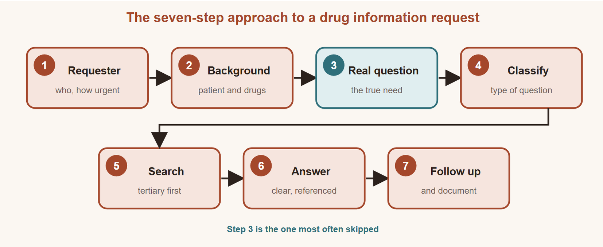
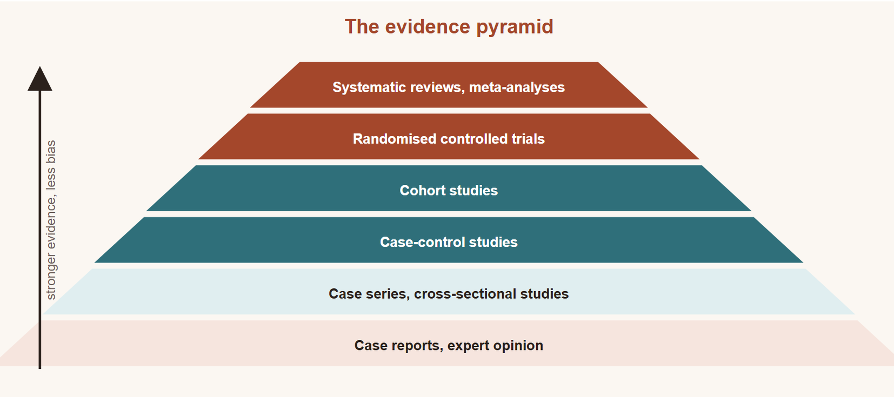
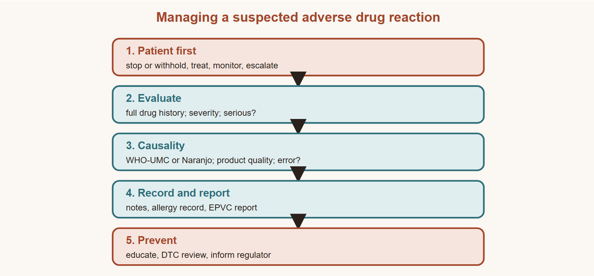

# Drug Information

**A Practical Section Guide**

Drug Information · Practical Sections

Faculty of Pharmacy, Port Said University

**Authors**

Assoc. Prof. Dr. Ahmed Mourad

Assoc. Prof. Dr. Ahmed Gaafar

Assoc. Prof. Dr. Ahmed Saad

Dr. Riffat Ibrahim Riffat, Teaching Assistant

## Contents

- [Chapter 1: The Drug Information Centre](#chapter-1-the-drug-information-centre)
- [Chapter 2: Drug Information Sources](#chapter-2-drug-information-sources)
- [Chapter 3: Study Designs and Levels of Evidence](#chapter-3-study-designs-and-levels-of-evidence)
- [Chapter 4: Randomisation and Blinding](#chapter-4-randomisation-and-blinding)
- [Chapter 5: The Research Protocol, Hypothesis Testing and Ethics](#chapter-5-the-research-protocol-hypothesis-testing-and-ethics)
- [Chapter 6: Critical Appraisal of a Clinical Trial](#chapter-6-critical-appraisal-of-a-clinical-trial)
- [Chapter 7: Adverse Drug Reactions](#chapter-7-adverse-drug-reactions)
- [Chapter 8: ADR Causality and Management](#chapter-8-adr-causality-and-management)
- [Chapter 9: Pharmacovigilance, ADR Reporting and Medication Errors](#chapter-9-pharmacovigilance-adr-reporting-and-medication-errors)
- [Chapter 10: Applied Case: Answering a Real Drug Question](#chapter-10-applied-case-answering-a-real-drug-question)

## How to Use This Book

This book goes with the Drug Information practical sections. Each chapter is one section of about 45 minutes. It gives you the skills a working pharmacist uses every day: answering a drug question, choosing a source, reading a trial, and recognising, assessing and reporting an adverse drug reaction.

Every chapter follows the same order:

1. **In This Section** lists what you will be able to do. Each question is tagged with its objective, for example [LO2].
2. **Short sections with tables.** Learn the tables; they are the fastest way to revise.
3. **At the Pharmacy** shows the idea in real practice.
4. **Caution** marks a safety point; **Exam Tip** marks a point to remember.
5. **Key Takeaways** sum up the chapter.
6. **Self-Assessment** has five questions and one practice case, with answers at the end of the chapter.

**Added content.** Chapter 3, most of Chapter 6, the reporting part of Chapter 9, the primary-literature part of Chapter 2 and the rebuilt case in Chapter 10 were written for this edition from standard references. The original slides for these parts were missing or incomplete.

### How to get the most from each section

Read the chapter before the section; it takes about twenty minutes. In the section, we work through the **At the Pharmacy** examples and the practice case together. Try the five questions on your own first, then check the answers and the reasons. If you get a question wrong, go back to the table it came from.

The chapters build on each other. Chapters 1 and 2 teach you to ask and search. Chapters 3 to 6 teach you to judge the evidence you find. Chapters 7 to 9 teach you to recognise, assess and report drug harm. Chapter 10 puts it all together in one real patient.

This book is for education. It is not clinical guidance; check current product information before relying on any dose.

---

# Chapter 1: The Drug Information Centre

## In This Section
By the end of this section you will be able to:
1. [LO1] Define drug information and a drug information service.
2. [LO2] Describe what a drug information centre (DIC) does and what it needs.
3. [LO3] Explain why pharmacists need reliable drug information.
4. [LO4] Apply the seven steps of the systematic approach to a drug information request.

## 1.1 What Is Drug Information?

**Drug information** is knowledge about medicines that helps people use them well. It covers doses, effects, adverse effects, interactions, and use in special groups.

A **drug information service** is the work pharmacists do to give accurate, unbiased and useful answers about medicines. The questions come from doctors, nurses, other pharmacists, patients and the public [1].

Every pharmacist gives drug information. You will do it in the community pharmacy, the hospital ward and the clinic. The skill is the same everywhere: understand the real question, find good evidence, and give a clear answer.

## 1.2 The Drug Information Centre

A **drug information centre (DIC)** is a unit run by trained pharmacists and other health professionals. Its job is to answer questions about medicines and to support safe use.

| Feature | Details |
|---|---|
| First centre | University of Kentucky Medical Center, USA, 1962 [1] |
| Today | Fewer stand-alone centres; most hospitals give drug information through their pharmacists |
| In Egypt | The Egyptian Drug Authority (EDA) runs drug information and pharmacovigilance services [3] |
| WHO view | Independent drug information is a core part of national medicines policy [2] |

*Table 1.1 — The DIC at a glance.*

### What a DIC does

| Activity | Example |
|---|---|
| Answers questions | "Can this patient take ibuprofen with warfarin?" |
| Supports committees | Evidence reviews for the Drug and Therapeutics Committee (DTC) |
| Teaches | Newsletters, bulletins, training for staff and students |
| Supports safety | Collects and reviews adverse drug reaction reports |
| Supports research | Literature searches and help with study design |

*Table 1.2 — Main activities of a DIC.*

### What a DIC needs

1. **Team:** trained pharmacists with good search and writing skills.
2. **Place and hardware:** a quiet room, computers and internet access.
3. **Communication:** phone, email and a way to document every request.
4. **Sources:** current references, kept up to date (Chapter 2).

## 1.3 Why Drug Information Matters

Health teams face three problems when they look for drug information:

- Textbooks take time to search, cost money and can be out of date.
- Many free websites are not reliable.
- Information from drug companies may be biased.

So the demand for **fast, reliable and accurate** drug information keeps growing. A pharmacist who answers well prevents errors and saves time for the whole team.

> **Caution:** It is tempting to use the easiest and most familiar source every time. Doing so can miss new evidence. Match the source to the question.

## 1.4 Answering a Request: The Systematic Approach

A good answer follows seven steps [1].

*Figure 1.1 — The seven-step systematic approach to a drug information request.*  
Original diagram for this book (original)

| Step | What you do | Ask yourself |
|---|---|---|
| 1. Requester | Note who is asking and how to reach them | Doctor, nurse, patient? How urgent? |
| 2. Background | Collect patient and drug details | Age, weight, kidney and liver function, other drugs |
| 3. Real question | Find the true need behind the question | What will the person do with my answer? |
| 4. Classify | Name the type of question | Dose, interaction, ADR, pregnancy, availability? |
| 5. Search | Look in the right sources, tertiary first | Is the evidence current and complete? |
| 6. Answer | Give a clear, specific, referenced reply | Is it right for this patient? |
| 7. Follow up and document | Check the outcome; record the request | Did it work? Can others learn from it? |

*Table 1.3 — The seven-step systematic approach.*

Step 3 is the one most often skipped. A person may ask "Is drug X available as a liquid?" when the real problem is that the patient cannot swallow tablets. The right answer may then be a different drug.

> **At the Pharmacy:** A mother asks whether she can give her 4-year-old child paracetamol and ibuprofen together. **Background:** the child weighs 16 kg, has a fever of 39 °C and takes no other drugs. **Real question:** how to control fever safely. **Answer:** use one drug at the correct weight-based dose first. Paracetamol is 15 mg/kg every 4-6 hours (maximum four doses a day). Switch or alternate only if the fever does not respond, and keep a written dose record. Advise a doctor's review if the fever lasts more than three days. **Document** the request.

> **Exam Tip:** Learn the seven steps in order: requester, background, real question, classify, search, answer, follow up.

## Key Takeaways
- Drug information is knowledge that helps people use medicines well; every pharmacist provides it.
- A DIC answers questions, supports committees, teaches and supports drug safety.
- A DIC needs a team, a place, communication tools and current sources.
- Use the seven-step approach for every request; do not skip the real question.
- Always document the request and follow up.

## Self-Assessment
**Q1.** Which is the best definition of a drug information service? [LO1]
A) Selling medicines with written leaflets
B) Giving accurate, unbiased answers about medicines to health professionals and the public
C) Advertising new medicines to doctors
D) Testing new medicines in patients

**Q2.** Which is NOT a usual activity of a drug information centre? [LO2]
A) Answering questions about interactions
B) Supporting the Drug and Therapeutics Committee
C) Manufacturing medicines
D) Collecting adverse drug reaction reports

**Q3.** Why is information from drug companies used with care? [LO3]
A) It may be biased
B) It is always out of date
C) It is never referenced
D) It is too expensive

**Q4.** A nurse asks, "Can I crush this tablet?" Which step helps you most to find the real need? [LO4]
A) Classifying the question as a formulation question
B) Searching the internet
C) Asking why the tablet needs to be crushed
D) Documenting the request

**Q5.** What is the last step of the systematic approach? [LO4]
A) Searching tertiary sources
B) Collecting background
C) Classifying the question
D) Follow up and documentation

**Practice Case.** A doctor phones the pharmacy: "Is metformin safe in my patient?" (a) Which background details do you need? (b) What might the real question be? (c) How do you finish the request?

## Answers and Rationales
**Q1. B** — This is the definition; it includes answers to the public. A, C and D are other activities.

**Q2. C** — A DIC gives information; it does not make medicines. A, B and D are core DIC work.

**Q3. A** — Companies promote their own products, so their information may be biased. B, C and D are not always true.

**Q4. C** — Asking why reveals the real problem, such as swallowing difficulty or a feeding tube. A, B and D come later.

**Q5. D** — The request ends with follow-up and documentation. A, B and C come earlier.

**Practice Case — model answer.** (a) Age, kidney function (eGFR), liver function, heart failure or other illness, planned contrast scans or surgery, and other drugs. (b) Often the real question is whether metformin is safe with reduced kidney function or before an iodinated contrast scan. (c) Give a clear answer with its source, check that the doctor received it, and record the request.

## References
1. Malone PM, Witt BA, Malone MJ, Peterson DM, editors. Drug Information: A Guide for Pharmacists. 7th ed. New York: McGraw Hill; 2022.
2. World Health Organization. How to develop and implement a national drug policy. 2nd ed. Geneva: WHO; 2001.
3. Egyptian Drug Authority. Egyptian Pharmaceutical Vigilance Center: guidance for reporting. Cairo: EDA; 2024.

---

# Chapter 2: Drug Information Sources

## In This Section
By the end of this section you will be able to:
1. [LO1] Classify a source as tertiary, secondary or primary.
2. [LO2] List the advantages and disadvantages of each type.
3. [LO3] Choose a named reference for a given type of question.
4. [LO4] Judge the quality of a tertiary source.

## 2.1 Three Types of Source

Drug information sources come in three layers [1].

| Type | What it is | Examples | Best for |
|---|---|---|---|
| **Tertiary** | Summaries written by experts from many studies | Textbooks, BNF, Martindale, Micromedex, Lexicomp, UpToDate, review articles | Fast, general answers |
| **Secondary** | Databases that index or abstract articles | PubMed/MEDLINE, Embase, Google Scholar | Finding the original studies |
| **Primary** | The original research itself | Clinical trials, cohort studies, case reports | The newest, most detailed evidence |

*Table 2.1 — The three types of drug information source.*

A simple way to remember: **tertiary tells you, secondary finds for you, primary proves it**.

### The usual search order

Most searches start with a tertiary source, move to a secondary database, and end with primary articles. This is a **usual strategy, not a fixed rule** [1]. Some questions are answered fully by a tertiary source, such as a standard adult dose. Others, such as a new drug or a rare interaction, need primary papers. Go further whenever the answer is incomplete, out of date or high-stakes.

## 2.2 Tertiary Sources

Tertiary sources summarise a topic in a short, easy form. The best ones are written by experts and peer reviewed.

| Advantages | Disadvantages |
|---|---|
| Complete, short overview | Lag time: print editions can be out of date |
| Convenient and easy to use | Author bias is possible |
| Familiar to most pharmacists | May be incomplete or wrong |
| Online versions are fast and updated often | Access to good databases usually costs money |

*Table 2.2 — Tertiary sources: pros and cons.*

### How to judge a tertiary source

1. Does the author have the right expertise?
2. Is it recent enough for the question?
3. Are statements supported by references?
4. Does it cover the question?
5. Is it free of obvious bias or errors?
6. Is it clear and easy to use?

### Which reference for which question?

| Question type | Good tertiary sources |
|---|---|
| General product information, doses | BNF [2], Martindale, AHFS Drug Information, Lexicomp |
| Adverse effects | Meyler's Side Effects of Drugs, Micromedex |
| Drug interactions | Stockley's Drug Interactions, Lexicomp Interactions |
| Pregnancy and breastfeeding | Briggs' Drugs in Pregnancy and Lactation, LactMed |
| Children | BNF for Children |
| Older adults | Beers Criteria (American Geriatrics Society) |
| Herbal and dietary supplements | Natural Medicines database |
| IV compatibility and formulations | Trissel's Handbook on Injectable Drugs |
| Pharmacokinetics, toxicology | Goodman & Gilman, Goldfrank's Toxicologic Emergencies |
| Official product labelling | DailyMed, Drugs@FDA, EDA product information |

*Table 2.3 — Match the source to the question.*

> **Caution:** Official labelling (the leaflet, DailyMed, Drugs@FDA) is not a summary of all evidence. It is the approved product information. Use it for licensed doses and warnings. TOXNET, found in older notes, was closed in 2019 [3].

## 2.3 Secondary Sources

Secondary sources are **indexing** or **abstracting** databases. Indexing gives the citation. Abstracting also gives the abstract. Many link to the full text.

| Advantages | Disadvantages |
|---|---|
| Very current | Need search skills |
| Point to a huge number of studies | Results must be filtered for quality |
| Simple searches are possible | An abstract is not enough; read the full article |

*Table 2.4 — Secondary sources: pros and cons.*

**PubMed** is the free search engine for MEDLINE, run by the US National Library of Medicine. **PubMed Central (PMC)** is different: it is a free **full-text archive** of more than ten million articles. You search in PubMed and often read the full paper in PMC [3].

**Google Scholar** searches scholarly papers, theses and books. It is broad but less precise than PubMed.

### Five tips for a better PubMed search

1. Write the question in parts: patient, drug, comparison, outcome.
2. Use the drug's generic name, not the brand name.
3. Join terms with AND; add synonyms with OR.
4. Use filters: article type (for example, randomised controlled trial or systematic review), date, humans, English.
5. Read the abstract to select papers, then read the full text before you answer.

A good search takes a few minutes. A search that returns thousands of papers needs more terms; a search that returns none needs fewer.

## 2.4 Primary Sources (added)

Primary sources report original research: clinical trials, cohort and case-control studies, and case reports. They appear in journals such as *The Lancet*, *BMJ* and *NEJM*.

| Advantages | Disadvantages |
|---|---|
| The newest evidence | You need skill to judge quality (Chapter 6) |
| Full detail on methods and results | One study may not be the whole truth |
| Lets you check what reviews say | Studies can conflict; some are never published |

*Table 2.5 — Primary sources: pros and cons.*

Chapter 3 explains the study designs you will meet in primary sources.

> **At the Pharmacy:** A breastfeeding mother is prescribed sertraline and asks if it is safe for her baby. Start with a tertiary source: **LactMed** or **Briggs**. Both say sertraline passes into milk in low amounts and is a preferred antidepressant in breastfeeding. If the baby were premature or unwell, you would search **PubMed** for recent case series and read them in full.

> **Exam Tip:** PubMed = secondary (search tool). PMC = full-text archive. Micromedex and Lexicomp = tertiary.

## Key Takeaways
- Tertiary sources summarise, secondary sources find studies, primary sources are the studies.
- Start with a tertiary source, but go further when the answer is incomplete or high-stakes.
- Match the reference to the question (Table 2.3).
- PubMed indexes articles; PMC stores full texts.
- Judge every source for expertise, date, references and bias.

## Self-Assessment
**Q1.** Micromedex is best described as a: [LO1]
A) Primary source
B) Secondary source
C) Tertiary source
D) Full-text archive

**Q2.** What is the main disadvantage of a printed textbook? [LO2]
A) It is hard to use
B) It may be out of date
C) It has no references
D) It contains only abstracts

**Q3.** A doctor asks about an interaction between clarithromycin and simvastatin. Which reference is most suitable? [LO3]
A) Stockley's Drug Interactions
B) Trissel's Handbook on Injectable Drugs
C) Briggs' Drugs in Pregnancy and Lactation
D) Beers Criteria

**Q4.** Which statement about PubMed Central (PMC) is correct? [LO1]
A) It is a tertiary textbook
B) It indexes only abstracts
C) It is the official drug label
D) It is a free full-text archive

**Q5.** When judging a tertiary source, which question matters MOST for a new drug? [LO4]
A) Is the book easy to carry?
B) Is it recent enough to include the new drug?
C) Is it printed in colour?
D) Is it written by one author?

**Practice Case.** A nurse asks whether ceftriaxone can be given through the same IV line as calcium gluconate. (a) Classify the question. (b) Which source do you open first? (c) What will you tell the nurse?

## Answers and Rationales
**Q1. C** — Micromedex summarises evidence, so it is tertiary. A, B and D are wrong.

**Q2. B** — Print editions lag behind new evidence. A, C and D are not typical.

**Q3. A** — Stockley's is the standard interaction reference. B covers IV compatibility, C pregnancy, D older adults.

**Q4. D** — PMC is a free full-text archive. A, B and C describe other sources.

**Q5. B** — A new drug may be missing from an older source. A, C and D do not affect quality.

**Practice Case — model answer.** (a) An IV compatibility question. (b) Trissel's Handbook on Injectable Drugs (or the product labelling). (c) Do not mix them: ceftriaxone and calcium can form a precipitate. In neonates, calcium-containing IV solutions must not be given with ceftriaxone at all. In older patients, flush the line well between them.

## References
1. Malone PM, Witt BA, Malone MJ, Peterson DM, editors. Drug Information: A Guide for Pharmacists. 7th ed. New York: McGraw Hill; 2022.
2. Joint Formulary Committee. British National Formulary. 88th edition. London: BMJ Group and Pharmaceutical Press; 2024.
3. National Library of Medicine. MEDLINE, PubMed and PMC: how are they different? Guidance for users. Bethesda: NLM; 2024.

---

# Chapter 3: Study Designs and Levels of Evidence

## In This Section
This chapter was added to this edition; the original Section 3 was not available.

By the end of this section you will be able to:
1. [LO1] Tell observational studies from experimental studies.
2. [LO2] Describe the main study designs and what each can show.
3. [LO3] Rank study designs by strength of evidence.
4. [LO4] Choose the right design for a research question.

## 3.1 Two Big Families

Every study either **watches** or **acts** [1]. Knowing the design tells you how much to trust the result, which is the first step in answering any evidence question.

- **Observational studies:** the researcher watches what happens. They do not give the treatment.
- **Experimental studies:** the researcher gives the treatment, usually at random. This is the clinical trial.

A quick test: did the researcher choose who got the drug? If yes, it is experimental.

## 3.2 The Main Designs

| Design | How it works | Good for | Main weakness | Example |
|---|---|---|---|---|
| **Case report / case series** | Describes one or a few patients | First signal of a new ADR | No comparison group | A patient develops a rash on a new drug |
| **Cross-sectional** | Measures exposure and outcome at one time | How common something is | Cannot show cause and effect | Survey of antibiotic use in pharmacies |
| **Case-control** | Starts with people who have the outcome and compares their past exposure with controls | Rare outcomes | Recall bias | Past aspirin use in children with Reye's syndrome |
| **Cohort** | Follows exposed and unexposed people forward in time | Common outcomes; several outcomes | Long and costly; confounding | Smokers vs non-smokers followed for lung cancer |
| **Randomised controlled trial (RCT)** | Randomly assigns patients to treatment or control | Proving that a treatment works | Costly; strict patients may not reflect real life | New drug vs placebo |
| **Systematic review / meta-analysis** | Combines all good studies on one question | The strongest summary of evidence | Only as good as the studies included | Pooled trials of statins |

*Table 3.1 — The main study designs [1, 2].*

**Confounding** means a third factor explains the link. For example, coffee drinkers get more lung cancer because more of them smoke. Randomisation (Chapter 4) is the best protection against confounding.

> **Exam Tip:** Case-control goes **backwards** from outcome to exposure. Cohort goes **forwards** from exposure to outcome.

## 3.3 Measures You Will Meet

| Measure | Used in | Meaning |
|---|---|---|
| Odds ratio (OR) | Case-control | Odds of exposure in cases vs controls |
| Relative risk (RR) | Cohort, RCT | Risk in treated ÷ risk in control |
| Absolute risk reduction (ARR) | RCT | Risk in control − risk in treated |
| Number needed to treat (NNT) | RCT | 1 ÷ ARR; patients to treat for one to benefit |

*Table 3.2 — Common measures of effect.*

A value of 1 for OR or RR means **no difference**. Values below 1 mean lower risk with the exposure.

Relative numbers can sound impressive when absolute numbers are small. A drug that cuts risk from 2% to 1% halves the risk (RR 0.5), but the ARR is only 1% and the NNT is 100. Always ask for the absolute numbers before you judge a benefit, and explain them to patients in the same plain way.

## 3.4 The Levels of Evidence

*Figure 3.1 — The evidence pyramid: stronger designs control bias better.*  
Original diagram for this book (original)

Stronger designs control bias better [2]. From weakest to strongest:

1. Expert opinion and case reports
2. Case series and cross-sectional studies
3. Case-control studies
4. Cohort studies
5. Randomised controlled trials
6. Systematic reviews and meta-analyses of good RCTs

### Bias in one line each

**Bias** is a systematic error that pushes results away from the truth [3]. Three types appear again and again:

- **Selection bias:** the groups differ before the study starts. Randomisation prevents it.
- **Recall bias:** people with a disease remember past exposures better than healthy people. It affects case-control studies.
- **Confounding:** a third factor explains the result. Matching, adjustment and randomisation reduce it.

When you read a study, ask which bias could explain the result. If one could, trust the result less.

The pyramid is a guide, not a law. A large, well-run cohort study can be more useful than a small, poor RCT. Quality matters as much as design [2].

## 3.5 Choosing the Design

| Question | Best design |
|---|---|
| Does drug X work better than placebo? | RCT |
| Does drug X cause a rare birth defect? | Case-control |
| What happens over ten years to patients on drug X? | Cohort |
| How many patients use drug X today? | Cross-sectional |
| Has anyone seen this strange reaction before? | Case report |

*Table 3.3 — Match the design to the question.*

> **At the Pharmacy:** A patient reads online that a blood-pressure tablet "causes cancer". The claim comes from **one case report**. You explain that a single case cannot prove cause. You check for **cohort studies or meta-analyses** on the drug before advising, and you tell the patient not to stop the tablet without seeing the doctor.

## Key Takeaways
- Observational studies watch; experimental studies act.
- Case-control looks backwards; cohort looks forwards; RCTs randomise.
- Systematic reviews of good RCTs are the top of the pyramid.
- NNT = 1 ÷ ARR tells you how many patients must be treated for one to benefit.
- Choose the design that fits the question.

## Self-Assessment
**Q1.** Researchers compare past drug use in 200 patients with liver failure and 400 without. What design is this? [LO2]
A) Cohort study
B) Case-control study
C) Randomised controlled trial
D) Cross-sectional study

**Q2.** Which study is experimental? [LO1]
A) A cohort study of smokers
B) A case report of a rash
C) A trial that randomly assigns patients to a new drug or placebo
D) A survey of antibiotic use

**Q3.** Which sits at the top of the evidence pyramid? [LO3]
A) Systematic review and meta-analysis of good RCTs
B) Expert opinion
C) Case series
D) Cohort study

**Q4.** In a trial, 10% of placebo patients and 5% of treated patients have a stroke. What is the NNT? [LO2]
A) 5
B) 10
C) 50
D) 20

**Q5.** Which design is best to study a very rare birth defect? [LO4]
A) Case-control study
B) Randomised controlled trial
C) Cross-sectional survey
D) Case report

**Practice Case.** A new antidiabetic drug is launched. Three questions arise: (a) Does it lower HbA1c more than metformin? (b) Does it cause a rare pancreatitis? (c) What happens to heart outcomes over five years? Choose a design for each and give one reason.

## Answers and Rationales
**Q1. B** — It starts from the outcome (liver failure) and looks back at exposure. A goes forward, C randomises, D measures one time point.

**Q2. C** — The researcher assigns the treatment. A, B and D only observe.

**Q3. A** — Pooled good RCTs give the strongest evidence. B, C and D are lower.

**Q4. D** — ARR = 10% − 5% = 5% = 0.05; NNT = 1 ÷ 0.05 = 20. A, B and C are miscalculations.

**Q5. A** — Case-control studies suit rare outcomes. B would need huge numbers, C shows prevalence, D cannot compare.

**Practice Case — model answer.** (a) An RCT against metformin: randomisation removes confounding. (b) A case-control study (or reports to pharmacovigilance first): pancreatitis is rare. (c) A cohort study or a long outcome trial: it follows patients forward in time.

## References
1. Grimes DA, Schulz KF. An overview of clinical research: the lay of the land. Lancet. 2002;359(9300):57-61. DOI: 10.1016/S0140-6736(02)07283-5
2. Murad MH, Asi N, Alsawas M, Alahdab F. New evidence pyramid. BMJ Evid Based Med. 2016;21(4):125-7. DOI: 10.1136/ebmed-2016-110401
3. Malone PM, Witt BA, Malone MJ, Peterson DM, editors. Drug Information: A Guide for Pharmacists. 7th ed. New York: McGraw Hill; 2022.

---

# Chapter 4: Randomisation and Blinding

## In This Section
By the end of this section you will be able to:
1. [LO1] Define randomisation and explain why trials use it.
2. [LO2] Compare simple, block, stratified and unequal randomisation.
3. [LO3] Explain allocation concealment and the levels of blinding.
4. [LO4] Tell efficacy trials from effectiveness trials.

## 4.1 What Is Randomisation?

**Randomisation** assigns trial participants to groups by chance. Each participant has a **known** chance of each group. The chance is equal in a 1:1 trial and unequal in a 2:1 trial. Nobody can **predict** the next assignment [1].

Think of it as tossing a fair coin for each patient. The doctor, the patient and the researcher cannot choose the group.

### Why randomise?

| Benefit | What it means |
|---|---|
| Removes selection bias | The doctor cannot put healthier patients in the new-drug group |
| Makes groups comparable | Age, sex and illness severity end up similar in each arm |
| Balances unknown factors | Even factors nobody measured are spread evenly |
| Allows valid statistics | Differences in outcome can be blamed on the treatment, not on chance or choice |

*Table 4.1 — Why trials use randomisation [1].*

The third row is the key. We can adjust for factors we know about, but only randomisation balances factors we do not know about. This is why the RCT is the best design to prove that a drug works (Chapter 3).

## 4.2 Methods of Randomisation

| Method | How it works | When to use | Weakness |
|---|---|---|---|
| **Simple** | Each patient is assigned by a random list or computer, like a coin toss | Large trials | Small trials may end up with unequal groups |
| **Block** | Patients are randomised in small blocks (for example 4), each with equal numbers per group | Small trials; keeps group sizes equal over time | If the block size is known, the last assignment in a block can be guessed |
| **Stratified** | Patients are first split into strata by a key factor (for example diabetes yes/no), then randomised within each stratum | When one factor strongly affects outcome | Too many strata make it complicated |
| **Unequal allocation** | More patients go to one arm, for example 2:1 | A costly drug, or to give more patients the new treatment | Loses some statistical power |

*Table 4.2 — The four methods of randomisation [2].*

### A closer look at unequal allocation

Most trials use a 1:1 ratio because it gives the most statistical power for a given number of patients. Sometimes a trial uses 2:1 or 3:1 instead [2]:

- **Cost:** if one treatment is very expensive, fewer patients can receive it.
- **Experience:** more patients on the new drug gives more safety data.
- **Recruitment:** patients may join more readily if they have a better chance of the new drug.

A 2:1 ratio loses only a little power. A 3:1 ratio loses much more, so the trial needs more patients to answer the same question.

> **Exam Tip:** Stratified randomisation balances a **known** important factor. Simple randomisation balances factors **on average**, which works well only in large trials.

## 4.3 Allocation Concealment

Randomisation fails if people can see the list in advance. **Allocation concealment** keeps the next assignment hidden until the patient is enrolled [3]. Common methods are central telephone or web randomisation and sealed, opaque, numbered envelopes.

Concealment is different from blinding. Concealment protects the moment of **assignment**. Blinding protects everything **after** assignment.

## 4.4 Blinding

**Blinding** (masking) means that people in the trial do not know which treatment a participant receives. It stops their knowledge from changing their behaviour or their judgement.

| Level | Who does not know |
|---|---|
| Open label | Nobody is blinded |
| Single blind | The participant |
| Double blind | The participant and the treating team |
| Triple blind | The participant, the treating team and the outcome assessors or statisticians |

*Table 4.3 — Levels of blinding.*

Blinding matters most when the outcome is **subjective**, such as pain or mood. It matters less for hard outcomes such as death. To blind a trial, the drug and placebo must look, taste and feel the same. When drugs differ in form, trials use a **double-dummy** design: each patient takes one active drug and one placebo that looks like the other drug.

> **At the Pharmacy:** In a hospital trial, the pharmacy prepares identical capsules of the study drug and placebo, labelled only with a code. The pharmacist keeps the code list locked and breaks the code for one patient only if a serious reaction needs it. This is how pharmacists protect both blinding and patient safety.

## 4.5 Efficacy and Effectiveness

Randomised trials have limits. These are limits of the trial setting, not of randomisation itself.

| | Efficacy trial | Effectiveness trial |
|---|---|---|
| Question | Can the drug work in ideal conditions? | Does the drug work in everyday practice? |
| Patients | Strict inclusion and exclusion criteria | Broad, real-life patients |
| Setting | Highly controlled | Normal clinics |
| Size and cost | Smaller | Larger and more expensive |
| Weakness | Results may not apply to your patient | More variation; harder to show a difference |

*Table 4.4 — Efficacy versus effectiveness.*

When you use a trial to answer a question, check whether its patients resemble yours. An elderly patient with kidney disease may have been excluded from the trial you are reading.

## Key Takeaways
- Randomisation assigns patients by chance and removes selection bias.
- It balances known and unknown factors, so outcome differences can be blamed on treatment.
- Simple, block, stratified and unequal allocation suit different trials.
- Allocation concealment hides the next assignment; blinding hides the treatment afterwards.
- Efficacy trials test ideal conditions; effectiveness trials test real practice.

## Self-Assessment
**Q1.** What is the main purpose of randomisation? [LO1]
A) To make the trial cheaper
B) To prevent selection bias and balance groups
C) To make the trial shorter
D) To make blinding unnecessary

**Q2.** A small trial wants equal group sizes throughout recruitment. Which method is best? [LO2]
A) Block randomisation
B) Simple randomisation
C) Unequal allocation
D) No randomisation

**Q3.** A trial first divides patients by smoking status, then randomises within each group. This is: [LO2]
A) Block randomisation
B) Unequal allocation
C) Stratified randomisation
D) Simple randomisation

**Q4.** In a double-blind trial, who does NOT know the treatment? [LO3]
A) Only the patient
B) Only the statistician
C) Nobody is blinded
D) The patient and the treating team

**Q5.** A trial includes only patients aged 18-65 with no other illness, in a research unit. It is best described as: [LO4]
A) An effectiveness trial
B) An efficacy trial
C) An open-label trial
D) A case-control study

**Practice Case.** A new pain gel is tested against placebo gel in 60 patients. (a) Which randomisation method keeps groups equal in this small trial? (b) Why is blinding important here? (c) The new gel smells of menthol. How can the trial stay blind?

## Answers and Rationales
**Q1. B** — Randomisation removes selection bias and balances groups. A, C and D are not its purpose.

**Q2. A** — Blocks keep numbers equal as patients join. B can drift in small trials; C and D do not.

**Q3. C** — Randomising within strata is stratified randomisation. A, B and D do not split by a factor first.

**Q4. D** — Double blind hides the treatment from the patient and the treating team. A is single blind, C open label, B not a standard level.

**Q5. B** — Strict patients in a controlled setting test efficacy. A uses real-life patients; C and D are other terms.

**Practice Case — model answer.** (a) Block randomisation (for example blocks of four) keeps the arms equal. (b) Pain is a subjective outcome; knowing the treatment could change what patients report. (c) Add the same menthol smell to the placebo gel so both look and smell alike.

## References
1. Hopewell S, Chan AW, Collins GS, et al. CONSORT 2025 statement: updated guideline for reporting randomised trials. BMJ. 2025;389:e081123. DOI: 10.1136/bmj-2024-081123
2. Schulz KF, Grimes DA. Generation of allocation sequences in randomised trials: chance, not choice. Lancet. 2002;359(9305):515-9. DOI: 10.1016/S0140-6736(02)07683-3
3. Schulz KF, Grimes DA. Allocation concealment in randomised trials: defending against deciphering. Lancet. 2002;359(9306):614-8. DOI: 10.1016/S0140-6736(02)07750-4

---

# Chapter 5: The Research Protocol, Hypothesis Testing and Ethics

## In This Section
By the end of this section you will be able to:
1. [LO1] List the main contents of a trial protocol.
2. [LO2] State the null hypothesis and explain type I and type II errors.
3. [LO3] Explain alpha, power, the p-value and the 95% confidence interval in plain words.
4. [LO4] Describe the role of the ethics committee and the elements of informed consent.
5. [LO5] Distinguish primary from secondary outcomes.

## 5.1 The Protocol

A **protocol** is the written plan of a trial. It is written and approved **before** the first patient joins [1]. Everyone follows it, and the **principal investigator** makes sure it is followed for every participant.

| Part of the protocol | What it states |
|---|---|
| Background and aim | Why the trial is needed; the question |
| Design | For example a randomised, double-blind, placebo-controlled trial |
| Participants | Inclusion and exclusion criteria |
| Treatments | Drugs, doses, routes, duration |
| Outcomes | Primary and secondary outcomes, and how they are measured |
| Sample size | How many patients, and why |
| Schedule | Visits, tests and procedures |
| Statistics | How the data will be analysed |
| Ethics and safety | Consent, ADR reporting, stopping rules |

*Table 5.1 — Main contents of a protocol.*

The protocol protects the trial from changing its question after seeing the data. It is also registered in a public trial registry before the trial starts. The SPIRIT 2025 checklist lists what a good protocol should contain [3].

## 5.2 The Null Hypothesis

Every trial tests a **hypothesis**:

- **Null hypothesis (H0):** there is **no difference** between the treatments.
- **Alternative hypothesis (H1):** there **is** a difference.

The trial never proves H0. It collects data and asks: are these results likely if H0 were true? If they are very unlikely, we **reject H0**. If not, we **fail to reject H0** [2]. Failing to reject H0 is not proof that the drugs are equal. The trial may simply have been too small.

## 5.3 Two Kinds of Error

| | Truth: no difference (H0 true) | Truth: real difference (H0 false) |
|---|---|---|
| **Decision: difference found** | **Type I error** (false positive), risk = alpha | Correct (power = 1 − beta) |
| **Decision: no difference found** | Correct | **Type II error** (false negative), risk = beta |

*Table 5.2 — Type I and type II errors.*

- **Alpha (α)** is the risk of a false positive that the investigators accept. It is usually set at **0.05 (5%)**. It is also called the significance level.
- **Beta (β)** is the risk of a false negative. It is usually set at **0.10-0.20**.
- **Power** = 1 − β, usually **80-90%**. It is the chance of finding a real difference if one exists.

These values are **choices** made in the protocol, not fixed facts. A trial with more patients has more power.

> **Exam Tip:** Type I = "I saw something that is not there" (false positive). Type II = "I missed something that is there" (false negative).

## 5.4 p-value and Confidence Interval

- The **p-value** is the probability of results at least this extreme if H0 were true. If p < alpha (usually 0.05), we call the result **statistically significant**.
- The **95% confidence interval (CI)** is the range that probably contains the true effect. A narrow CI means a precise result. If the CI for a difference crosses 0 (or crosses 1 for a ratio), the result is not significant.

A significant result is not always an important one. A drug may lower blood pressure by 1 mmHg with p < 0.001 in a huge trial. That is statistically significant but clinically useless. Always look at the size of the effect.

## 5.5 Ethics: The IRB and Informed Consent

An **Institutional Review Board (IRB)**, or research ethics committee, is an independent committee of doctors, pharmacists, scientists and lay members. It reviews and approves the protocol and the consent form before the trial starts. It then monitors the trial to protect the **rights, safety and well-being** of participants [1].

**Informed consent** is a person's voluntary, documented agreement to take part. It is given after the person has been told everything they need to decide [1].

| Element of consent | The participant is told |
|---|---|
| Description | The purpose of the research and what will happen |
| Procedures | Tests, visits and how long it lasts |
| Risks | Possible harms and discomforts |
| Benefits | Possible benefits to them or to others |
| Alternatives | Other treatments available |
| Confidentiality | How their data are protected |
| Contacts | Whom to call with questions or problems |
| Voluntary | They can refuse or withdraw at any time without penalty |

*Table 5.3 — Essential elements of informed consent.*

Participants must meet the protocol's eligibility criteria and give valid consent. If a person cannot consent, for example a child or an unconscious adult, a legal representative may consent, with extra safeguards.

## 5.6 Outcomes and Drop-outs

A **clinical outcome** is an event caused by the disease or the treatment, such as pain relief, cure of infection or death.

- The **primary outcome** is the main outcome, chosen before the trial starts. The sample size is based on it.
- **Secondary outcomes** are also chosen in advance but are less important.
- Outcomes chosen only after seeing the data are **exploratory**; treat them with caution.

Some participants leave early: **drop-outs** or **lost to follow-up**. Reasons include loss of interest, moving away, side effects, protocol violations and death. Some participants stay but do not take the treatment as directed (poor **compliance**). Many drop-outs weaken a trial, especially if they differ between groups.

**Positive** trials, which favour the new drug, are published more often than **negative** ones. This is **publication bias**. A well-designed negative trial is still valuable. Trial registration helps to make sure negative results are not hidden.

> **At the Pharmacy:** A patient in a hospital trial tells the ward pharmacist she wants to stop because the tablets upset her stomach. The pharmacist explains that she may withdraw at any time, reports the side effect to the trial team, and makes sure her usual treatment continues.

## Key Takeaways
- The protocol is the approved plan; the principal investigator makes sure it is followed.
- A trial tests H0; it rejects it or fails to reject it, never proves it.
- Type I = false positive (alpha, usually 5%); type II = false negative (beta); power = 1 − beta.
- The IRB protects participants; consent must be informed, voluntary and documented.
- The primary outcome is set before the trial and drives the sample size.

## Self-Assessment
**Q1.** A trial finds no significant difference between two drugs (p = 0.30). What is the correct conclusion? [LO2]
A) The drugs are proven equal
B) The null hypothesis is proven
C) We fail to reject the null hypothesis
D) The new drug is worse

**Q2.** Which must be fixed in the protocol before the first patient joins? [LO1]
A) The primary outcome and the sample size
B) The results of the trial
C) The journal that will publish it
D) The names of the patients

**Q3.** A trial has 80% power. What does this mean? [LO3]
A) 80% of patients benefit
B) The p-value is 0.80
C) The drug is 80% effective
D) There is an 80% chance of detecting a real difference if it exists

**Q4.** Which is NOT an essential element of informed consent? [LO4]
A) The risks of taking part
B) The right to withdraw at any time
C) A promise that the new drug will work
D) Whom to contact with questions

**Q5.** A secondary outcome is: [LO5]
A) Any finding noticed after the trial ends
B) A less important outcome chosen before the trial starts
C) The outcome used to calculate sample size
D) An adverse effect

**Practice Case.** A trial compares a new antihypertensive with amlodipine in 40 patients. It finds p = 0.20 and concludes: "The drugs are equally effective." (a) What is wrong with this conclusion? (b) What is the likely problem with the trial? (c) What should the investigators have done in the protocol?

## Answers and Rationales
**Q1. C** — A non-significant result means we fail to reject H0. A and B claim proof; D is not shown.

**Q2. A** — The outcome and sample size are set in advance so the question cannot change after the data are seen. B, C and D are not protocol items.

**Q3. D** — Power is the chance of finding a real difference. A, B and C misread the term.

**Q4. C** — Consent must never promise benefit. A, B and D are required elements.

**Q5. B** — Secondary outcomes are pre-specified but less important. A is exploratory, C is primary, D is a safety outcome.

**Practice Case — model answer.** (a) Failing to reject H0 does not prove the drugs are equal. (b) With only 40 patients the trial probably had low power (high risk of type II error). (c) Calculate the sample size in advance for enough power (80-90%); an equivalence or non-inferiority design would be needed to show that the drugs are equal.

## References
1. International Council for Harmonisation. ICH E6(R3) Guideline for good clinical practice. Geneva: ICH; 2025.
2. Malone PM, Witt BA, Malone MJ, Peterson DM, editors. Drug Information: A Guide for Pharmacists. 7th ed. New York: McGraw Hill; 2022.
3. Chan AW, Boutron I, Hopewell S, et al. SPIRIT 2025 statement: updated guideline for protocols of randomised trials. BMJ. 2025;389:e081477. DOI: 10.1136/bmj-2024-081477

---

# Chapter 6: Critical Appraisal of a Clinical Trial

## In This Section
Part of this chapter was added to this edition; it completes the trial-evaluation slides of Section 5.

By the end of this section you will be able to:
1. [LO1] Judge the title, abstract and introduction of a trial report.
2. [LO2] Check the methods of a trial for bias.
3. [LO3] Read the results using intention-to-treat, effect size and NNT.
4. [LO4] Decide whether a trial's conclusion applies to your patient.

## 6.1 Why Appraise?

A trial report is a claim, not a fact. **Critical appraisal** means reading it carefully to decide whether it is true, important and useful for your patient [1]. Pharmacists do this when they answer drug information questions from primary sources (Chapter 2) and when they prepare evidence for the Drug and Therapeutics Committee.

The **CONSORT 2025** statement lists what a trial report should contain [2]. Use it as your checklist.

## 6.2 The Ten-Question Checklist

| Part | Question to ask | Warning sign |
|---|---|---|
| 1. Title | Is it specific, neutral and does it say "randomised trial"? | A title that announces the result |
| 2. Abstract | Is it structured (objective, methods, results, conclusions) and within the journal's word limit? | Conclusions not supported by the results |
| 3. Introduction | Does it explain why the trial is needed and state the aim? | No clear question |
| 4. Patients | Who was included and excluded? | Patients very unlike yours |
| 5. Randomisation and concealment | How was the sequence made and hidden? | Alternate days, open lists |
| 6. Blinding | Who was blinded? | Open label with a subjective outcome |
| 7. Comparator and outcomes | Was the comparator fair? Was the primary outcome set in advance? | Placebo when a standard drug exists; outcome changed later |
| 8. Results | Were all patients analysed in their groups (intention-to-treat)? How big was the effect? | Many drop-outs; only relative numbers |
| 9. Discussion | Do the authors discuss limitations? | Conclusions go beyond the data |
| 10. Funding and conflicts | Who paid? Do the authors have links to the company? | Hidden funding |

*Table 6.1 — A ten-question checklist for a trial report [2].*

### The title

A title should reflect the work, be specific and unbiased, and identify the study as a randomised trial. It should not be phrased as a question, and it is usually short (about ten words or fewer).

- **Biased:** "Improved bronchodilation with levalbuterol compared with racemic albuterol in patients with asthma."
- **Neutral:** "Comparison of levalbuterol and racemic albuterol bronchodilation in patients with asthma: a randomised clinical trial."

The first title tells you the answer before you read the data.

### The abstract

Most journals use a **structured abstract** with headings. It is more informative, easier to read and preferred by readers. The word limit is set by each journal, often 250-300 words [3]. An abstract is only a summary. Never answer a question from the abstract alone; read the full paper.

### The investigators and the site

The investigators should be trained and experienced in the area. The site must have the resources to carry out the methods. Everyone involved must protect the patients enrolled (Chapter 5).

## 6.3 Reading the Results

### Intention-to-treat

In an **intention-to-treat (ITT)** analysis, every randomised patient is analysed in the group they were assigned to, even if they stopped the drug. ITT keeps the benefit of randomisation. A **per-protocol** analysis includes only patients who completed the treatment. It can make a drug look better than it really is, because patients who stopped due to side effects are left out.

### The size of the effect

| Measure | Example: stroke in 10% on placebo, 7% on drug |
|---|---|
| Relative risk (RR) | 7 ÷ 10 = 0.7 |
| Relative risk reduction (RRR) | 30% |
| Absolute risk reduction (ARR) | 10% − 7% = 3% |
| Number needed to treat (NNT) | 1 ÷ 0.03 ≈ 33 |

*Table 6.2 — Four ways to show the same result.*

Companies often quote the RRR ("30% fewer strokes") because it sounds larger. The ARR and NNT tell you the real benefit for patients. Also look at the 95% confidence interval: a wide interval means the result is uncertain.

> **Caution:** A statistically significant result is not always clinically important. Check the effect size, the confidence interval and the adverse effects before you recommend a drug.

## 6.4 Does It Apply to My Patient?

After judging validity and results, ask:

1. Is my patient like the trial patients (age, kidney function, other illnesses)?
2. Were the outcomes important to patients (death, stroke, quality of life), or only laboratory values?
3. Do the benefits outweigh the harms and the cost?
4. Is the drug available and affordable in Egypt?

**Surrogate outcomes**, such as a lower cholesterol or HbA1c, are useful but do not always mean fewer heart attacks or deaths. Prefer trials with hard, patient-important outcomes.

> **At the Pharmacy:** A company representative gives you a leaflet: "New drug cuts heart attacks by 50%!" You find the trial. Heart attacks fell from 2% to 1% over three years. The ARR is 1% and the NNT is 100. The trial excluded patients over 75. You explain to the prescriber that the benefit is real but small, and uncertain for the older patients on your ward.

> **Exam Tip:** ITT keeps randomisation; per-protocol can exaggerate benefit.

## Key Takeaways
- Appraise every trial before you use it; CONSORT 2025 is the checklist.
- A neutral title, a structured abstract and a clear question are good first signs.
- Check randomisation, concealment, blinding, the comparator and pre-set outcomes.
- Prefer ITT results, absolute numbers (ARR, NNT) and confidence intervals.
- Decide whether the result applies to your patient, including cost and availability.

## Self-Assessment
**Q1.** Which trial title is best? [LO1]
A) "Drug X is superior to drug Y in hypertension"
B) "Does drug X work?"
C) "Drug X versus drug Y in hypertension: a randomised controlled trial"
D) "A new hope for patients with high blood pressure"

**Q2.** A trial assigned patients by day of admission (odd days drug, even days placebo). What is the problem? [LO2]
A) The groups will be too large
B) The allocation can be predicted, so selection bias is possible
C) The trial cannot be blinded
D) The outcome is subjective

**Q3.** Which analysis keeps the benefit of randomisation? [LO3]
A) Intention-to-treat
B) Per-protocol
C) Subgroup analysis
D) Analysis of completers only

**Q4.** Deaths fell from 20% on placebo to 15% on a new drug. What is the NNT? [LO3]
A) 5
B) 25
C) 15
D) 20

**Q5.** A trial shows a new drug lowers HbA1c. Your patient asks if it prevents heart attacks. What is the best reply? [LO4]
A) Yes, lower HbA1c always means fewer heart attacks
B) The trial proves it
C) Heart attacks are not important
D) HbA1c is a surrogate outcome; we need trials that measure heart attacks

**Practice Case.** A trial of a new painkiller reports: "Randomised, open-label, 120 patients, per-protocol analysis, primary outcome changed from pain at 12 weeks to pain at 4 weeks. Funded by the manufacturer." (a) List three weaknesses. (b) How does each one bias the result? (c) Would you recommend the drug on this evidence?

## Answers and Rationales
**Q1. C** — It is neutral and names the design. A announces the result, B is a question, D is promotional.

**Q2. B** — Staff can predict the group and choose which patients to enrol. A, C and D are not the main problem.

**Q3. A** — ITT analyses every patient as randomised. B, C and D lose that protection.

**Q4. D** — ARR = 20% − 15% = 5%; NNT = 1 ÷ 0.05 = 20. A, B and C are miscalculations.

**Q5. D** — HbA1c is a surrogate outcome; heart attacks need their own evidence. A, B and C are wrong.

**Practice Case — model answer.** (a) Open label with a subjective outcome; per-protocol analysis; the primary outcome was changed. Company funding is a further concern. (b) Open label lets expectations raise reported relief; per-protocol drops patients who stopped because of side effects; changing the outcome lets authors pick the best-looking result. (c) No; the evidence is weak. Look for blinded, ITT trials with a pre-set outcome.

## References
1. Malone PM, Witt BA, Malone MJ, Peterson DM, editors. Drug Information: A Guide for Pharmacists. 7th ed. New York: McGraw Hill; 2022.
2. Hopewell S, Chan AW, Collins GS, et al. CONSORT 2025 statement: updated guideline for reporting randomised trials. BMJ. 2025;389:e081123. DOI: 10.1136/bmj-2024-081123
3. Hopewell S, Clarke M, Moher D, et al. CONSORT for reporting randomised trials in journal and conference abstracts. Lancet. 2008;371(9609):281-3. DOI: 10.1016/S0140-6736(07)61835-2

---

# Chapter 7: Adverse Drug Reactions

## In This Section
By the end of this section you will be able to:
1. [LO1] Define an adverse drug reaction (ADR) and a side effect.
2. [LO2] Describe the burden of ADRs on patients and health services.
3. [LO3] Classify ADRs into types A to F, with an example of each.
4. [LO4] List patient and drug factors that increase ADR risk.

## 7.1 Definitions

The World Health Organization defines an **adverse drug reaction** as a response to a drug that is **noxious and unintended**, and that occurs at doses normally used in humans for prevention, diagnosis or treatment of disease, or for changing a body function [1].

A **side effect** is an effect of the drug's normal pharmacology that is not the aim of treatment. It happens because the drug's receptors are found in many tissues, or because the drug is not selective.

| Drug | Side effect | Why |
|---|---|---|
| Older antihistamines (chlorphenamine) | Drowsiness | H1 block in the brain |
| Opioids | Constipation | Opioid receptors in the gut |
| Atropine-like drugs | Dry mouth | Muscarinic block in salivary glands |

*Table 7.1 — Side effects follow from the drug's pharmacology.*

A side effect can be useful in another setting. Sedating antihistamines help sleep, and the constipating effect of loperamide (an opioid) treats diarrhoea.

Related terms help you describe events precisely [2]:

- **Adverse event:** any harm during treatment, whether or not the drug caused it.
- **Adverse drug reaction:** harm that the drug probably caused.
- **Medication error:** a preventable mistake in using a drug (Chapter 9).

## 7.2 The Burden of ADRs

ADRs are common and costly. A large UK study found that ADRs caused about **1 in 16 hospital admissions (6.5%)** and took up about **4% of hospital bed capacity** [3]. Many of these reactions were preventable. ADRs increase illness, death and health-care costs worldwide.

Because trials before marketing are small and short, many ADRs are found only after a drug is in wide use. This is why every pharmacist must recognise and report ADRs (Chapter 9).

## 7.3 Types of ADR: A to F

| Type | Name | Key features | Example |
|---|---|---|---|
| **A** | **Augmented** | Predictable from pharmacology; dose-related; common; rarely fatal | Bleeding with warfarin; bradycardia with beta-blockers; headache with nitrates; postural hypotension with prazosin |
| **B** | **Bizarre** | Not predictable; not dose-related; uncommon; can be serious; depends on the patient (allergy, genetics) | Anaphylaxis with penicillin; hypersensitivity with carbamazepine |
| **C** | **Chronic** | Related to dose **and** time; appears with long use | Adrenal suppression with long-term corticosteroids |
| **D** | **Delayed** | Appears long after the drug is started, or even after it is stopped | Birth defects with isotretinoin; tardive dyskinesia with antipsychotics; cancers after some cytotoxics |
| **E** | **End of use** | Appears when the drug is stopped, especially suddenly | Seizures after sudden phenytoin withdrawal; adrenal crisis after stopping steroids; rebound tachycardia after stopping beta-blockers |
| **F** | **Failure** | Unexpected failure of therapy, often from an interaction | Failure of oral contraceptives with enzyme inducers such as rifampicin; antimicrobial resistance |

*Table 7.2 — The A-F classification of ADRs [2].*

Types A and B account for most reactions. Type A reactions are about 80% of all ADRs; they are usually managed by lowering the dose. Type B reactions usually require stopping the drug and avoiding it in future.

Paracetamol liver damage after an overdose is a **Type A** (dose-related) reaction, not a separate "chemical" type.

> **Exam Tip:** A = Augmented, B = Bizarre, C = Chronic, D = Delayed, E = End of use, F = Failure.

## 7.4 Who Is at Risk?

An ADR is not a medication error. It can happen even when the right drug is given in the right dose. Some patients and some drug situations carry more risk [2].

| Patient factors | Drug and use factors |
|---|---|
| Very young or old age | Narrow therapeutic index (warfarin, digoxin, lithium) |
| Female sex | Many drugs together (polypharmacy) and interactions |
| Kidney or liver disease | High doses or long courses (Type C) |
| Serious illness | Use at a critical time in pregnancy (Type D) |
| HIV infection | Sudden stopping (Type E) |
| Alcohol misuse | Poor monitoring (for example no INR checks) |
| Genetic factors (for example HLA-B*1502 and carbamazepine) | Previous reaction to the same drug class |

*Table 7.3 — Risk factors for ADRs.*

Preventable harm caused by the wrong drug, dose or monitoring is a **medication error**, even if it causes an ADR. Chapter 9 covers errors and how to prevent them.

> **At the Pharmacy:** A 78-year-old man on warfarin buys ibuprofen for knee pain. You recognise a high-risk situation: older age, a narrow-therapeutic-index drug and an NSAID that raises bleeding risk (a predictable Type A interaction). You advise paracetamol instead, tell him which bleeding signs to watch for, and suggest an INR check if he has already taken ibuprofen.

> **Caution:** Stopping some drugs suddenly is dangerous (Type E). Advise patients never to stop steroids, antiepileptics or beta-blockers without medical advice.

## Key Takeaways
- An ADR is a noxious, unintended response at normal doses; a side effect follows from the drug's pharmacology.
- ADRs cause about 1 in 16 hospital admissions.
- Types: A Augmented, B Bizarre, C Chronic, D Delayed, E End of use, F Failure.
- Type A is common and dose-related; Type B is unpredictable and needs the drug stopped.
- Age, organ disease, polypharmacy, genetics and narrow-index drugs raise the risk.

## Self-Assessment
**Q1.** Which best fits the WHO definition of an ADR? [LO1]
A) Liver damage after a deliberate overdose
B) A noxious, unintended response at a normal dose
C) Any event during treatment
D) Giving the wrong drug by mistake

**Q2.** About what share of hospital admissions are caused by ADRs? [LO2]
A) 1 in 16
B) 1 in 200
C) 1 in 2
D) 1 in 1,000

**Q3.** A patient develops anaphylaxis after the first dose of amoxicillin. What type of ADR is this? [LO3]
A) Type A
B) Type C
C) Type E
D) Type B

**Q4.** A woman on rifampicin becomes pregnant while taking an oral contraceptive. What type of ADR is this? [LO3]
A) Type A
B) Type D
C) Type F
D) Type C

**Q5.** Which patient has the highest risk of an ADR? [LO4]
A) A 25-year-old man taking one antibiotic
B) An 80-year-old woman with kidney disease taking eight drugs
C) A healthy 30-year-old woman taking vitamin D
D) A 40-year-old man taking paracetamol for one day

**Practice Case.** A 65-year-old woman has taken prednisolone 20 mg daily for eight months for arthritis. She stopped it suddenly last week and now feels weak, dizzy and nauseous; her blood pressure is low. (a) What type of ADR is this? (b) What other type of ADR might long-term steroids cause? (c) What advice should she have been given?

## Answers and Rationales
**Q1. B** — This is the WHO definition. A is an overdose, C an adverse event, D a medication error.

**Q2. A** — About 6.5%, or 1 in 16. B, C and D are wrong.

**Q3. D** — Allergy is unpredictable and not dose-related: Type B. A, B and C are other types.

**Q4. C** — The contraceptive failed because rifampicin induces its metabolism: Type F. A, B and D do not fit.

**Q5. B** — Old age, kidney disease and polypharmacy all raise risk. A, C and D are low-risk.

**Practice Case — model answer.** (a) Type E (end of use): adrenal insufficiency after sudden withdrawal. (b) Type C (chronic): adrenal suppression, osteoporosis. (c) Never stop steroids suddenly; the dose must be reduced gradually under medical supervision, and she should carry a steroid card.

## References
1. World Health Organization. International drug monitoring: the role of national centres. Technical Report Series No. 498. Geneva: WHO; 1972.
2. Edwards IR, Aronson JK. Adverse drug reactions: definitions, diagnosis, and management. Lancet. 2000;356(9237):1255-9. DOI: 10.1016/S0140-6736(00)02799-9
3. Pirmohamed M, James S, Meakin S, et al. Adverse drug reactions as cause of admission to hospital: prospective analysis of 18 820 patients. BMJ. 2004;329(7456):15-9. DOI: 10.1136/bmj.329.7456.15

---

# Chapter 8: ADR Causality and Management

## In This Section
By the end of this section you will be able to:
1. [LO1] Assess whether a drug caused an event using the WHO-UMC categories.
2. [LO2] Score a suspected ADR with the Naranjo algorithm.
3. [LO3] Distinguish the severity of an ADR from its seriousness.
4. [LO4] Manage a suspected ADR step by step, starting with the patient.

## 8.1 Causality: Did the Drug Do It?

**Causality** is the likelihood that a medicine caused an event. Most ADRs cannot be proved, so we grade how likely the link is. Four questions do most of the work:

1. **Time:** did the event start after the drug, in a plausible time?
2. **Other causes:** could the disease or another drug explain it?
3. **Dechallenge:** did the event improve when the drug was stopped or the dose lowered?
4. **Rechallenge:** did it come back when the drug was given again?

Other clues are a known association (the ADR is already described), a dose-response relationship (worse with a higher dose), and objective evidence such as a drug level or a laboratory test.

Rechallenge is strong evidence but is often unsafe. Never rechallenge on purpose after a serious reaction such as anaphylaxis.

## 8.2 Three Ways to Assess Causality

| Method | How it works | Strength | Weakness |
|---|---|---|---|
| **Expert judgement (global introspection)** | An experienced clinician decides, without a fixed tool | Fast; uses clinical knowledge | Different experts disagree |
| **Algorithm** | Fixed questions with scores (for example Naranjo) | Reproducible; easy to teach | Rigid; can miss context |
| **Probabilistic (Bayesian) methods** | Statistics combine prior knowledge with case details | Most precise | Complex; used by experts only |

*Table 8.1 — Methods for assessing causality.*

## 8.3 The WHO-UMC Categories

| Category | Time link | Other causes | Dechallenge | Rechallenge |
|---|---|---|---|---|
| **Certain** | Plausible | Ruled out | Positive | Positive, if needed |
| **Probable / likely** | Reasonable | Unlikely | Positive | Not required |
| **Possible** | Reasonable | Could explain it | Unclear or not done | Not required |
| **Unlikely** | Improbable | Plausible explanations exist | — | — |
| **Conditional / unclassified** | More data are needed and are being sought | | | |
| **Unassessable** | Information is missing or contradictory and cannot be completed | | | |

*Table 8.2 — WHO-UMC causality categories, simplified [1].*

## 8.4 The Naranjo Algorithm

The Naranjo algorithm asks ten questions. Add the scores for the answers [2].

| # | Question | Yes | No | Do not know |
|---|---|---|---|---|
| 1 | Are there previous conclusive reports of this reaction? | +1 | 0 | 0 |
| 2 | Did the event appear after the drug was given? | +2 | −1 | 0 |
| 3 | Did it improve when the drug was stopped or an antagonist given? | +1 | 0 | 0 |
| 4 | Did it reappear when the drug was given again? | +2 | −1 | 0 |
| 5 | Are there other causes that could have caused it? | −1 | +2 | 0 |
| 6 | Did it reappear when a placebo was given? | −1 | +1 | 0 |
| 7 | Was the drug found in blood at toxic levels? | +1 | 0 | 0 |
| 8 | Was it worse with a higher dose or better with a lower dose? | +1 | 0 | 0 |
| 9 | Has the patient had a similar reaction to the same or a similar drug before? | +1 | 0 | 0 |
| 10 | Was the event confirmed by objective evidence? | +1 | 0 | 0 |

*Table 8.3 — The Naranjo algorithm.*

| Total score | Category |
|---|---|
| 9 or more | Definite |
| 5 to 8 | Probable |
| 1 to 4 | Possible |
| 0 or less | Doubtful |

*Table 8.4 — Interpreting the Naranjo score.*

**Worked example.** A man starts enalapril and, two weeks later, develops a dry cough. Scores: Q1 yes (+1); Q2 yes (+2); Q3 the cough stops after enalapril is stopped (+1); Q4 not rechallenged (0); Q5 no other cause (+2); Q6-Q10 not done or not known (0). Total **6 = probable**.

> **Exam Tip:** Naranjo gives four categories (definite, probable, possible, doubtful). WHO-UMC uses six (certain, probable, possible, unlikely, conditional, unassessable).

## 8.5 Severity Is Not Seriousness

These two words sound alike but mean different things [3].

**Severity** describes the **intensity** of the reaction:

| Severity | Meaning |
|---|---|
| Mild | No treatment change needed, or the drug is stopped with no further treatment |
| Moderate | Needs a change in treatment or an antidote, or lengthens the hospital stay |
| Severe | Life-threatening, causes permanent harm, or needs intensive care |

*Table 8.5 — Severity (intensity) of an ADR.*

**Seriousness** is a regulatory term based on the **outcome**. An ADR is **serious** if it [4]:

- causes death;
- is life-threatening;
- requires or prolongs hospital admission;
- causes persistent or significant disability;
- causes a congenital anomaly; or
- is another important medical event.

A severe headache is intense but usually not serious. Serious reactions must be reported quickly (Chapter 9).

## 8.6 Managing a Suspected ADR

*Figure 8.1 — Managing a suspected adverse drug reaction, starting with the patient.*  
Original diagram for this book (original)

1. **Look after the patient first.** Assess the patient. Stop or withhold the suspected drug when appropriate. Treat the reaction (for example adrenaline for anaphylaxis), monitor, and call for urgent help if needed.
2. **Evaluate the event.** Take a full drug history, including over-the-counter and herbal products. Grade the severity and decide whether it is serious.
3. **Establish the cause.** Use WHO-UMC or Naranjo. Check the quality of the product and whether a medication error occurred.
4. **Act and follow up.** Record the reaction in the patient's notes and allergy record. Tell the patient which drug to avoid. Report the ADR (Chapter 9).
5. **Prevent recurrence.** For serious or repeated reactions, educate prescribers, review the formulary or treatment guideline through the Drug and Therapeutics Committee, and inform the regulator and the manufacturer.

> **At the Pharmacy:** A woman returns two days after starting co-trimoxazole with a widespread rash and mouth ulcers. You recognise a possible serious skin reaction. You tell her to stop the tablet and send her to the emergency department at once. Later you complete the causality assessment, record the allergy, and report the case to the EDA.

> **Caution:** Mouth ulcers, blistering or a rash with fever after a new drug may be Stevens-Johnson syndrome. Stop the drug and refer urgently.

## Key Takeaways
- Causality rests on time, other causes, dechallenge and rechallenge.
- WHO-UMC has six categories; Naranjo scores ten questions into four categories.
- Severity is intensity; seriousness is the outcome that drives regulatory reporting.
- Always look after the patient first: stop, treat, monitor, escalate.
- Then assess, record, report and prevent.

## Self-Assessment
**Q1.** A rash starts two days after a new drug, clears when it is stopped, and no other cause is found. It was not rechallenged. WHO-UMC category? [LO1]
A) Certain
B) Possible
C) Probable
D) Unassessable

**Q2.** A Naranjo total of 3 means the ADR is: [LO2]
A) Possible
B) Probable
C) Definite
D) Doubtful

**Q3.** Which reaction is "serious" in the regulatory sense? [LO3]
A) Severe nausea managed at home
B) Mild headache
C) A reaction needing hospital admission
D) Moderate drowsiness

**Q4.** A patient collapses with wheezing and a swollen face minutes after an injection. What is the FIRST step? [LO4]
A) Complete the Naranjo algorithm
B) Look after the patient: stop the drug, give adrenaline, call for help
C) Report to the EDA
D) Review the formulary

**Q5.** In the Naranjo algorithm, which answer adds +2 points? [LO2]
A) The patient had a similar reaction before
B) The drug was found at toxic levels
C) The reaction improved when the drug was stopped
D) There are no other causes that could explain it

**Practice Case.** A 70-year-old man on digoxin develops nausea and yellow vision a week after clarithromycin is added. His digoxin level is high. Both symptoms settle after digoxin is withheld. He has no other illness to explain them. (a) Score the reaction with Naranjo (state your answer to each relevant question). (b) What is the category? (c) List the management steps.

## Answers and Rationales
**Q1. C** — Good time link, positive dechallenge and no other cause: probable. A needs a clear case (often rechallenge); B would have other causes; D lacks data.

**Q2. A** — 1 to 4 is possible. B is 5-8, C is 9 or more, D is 0 or less.

**Q3. C** — Hospital admission makes an ADR serious. A, B and D may be intense but are not serious.

**Q4. B** — Patient care comes first in anaphylaxis. A, C and D come later.

**Q5. D** — "No" to other causes scores +2. A, B and C each score +1.

**Practice Case — model answer.** (a) Q1 known interaction/toxicity +1; Q2 after the drug +2; Q3 improved on withdrawal +1; Q5 no other cause +2; Q7 toxic level +1; others 0. Total 7. (b) Probable. (c) Withhold digoxin, check potassium, kidney function and ECG, monitor; stop or change clarithromycin; restart digoxin at a lower dose only if needed; record, report and warn about the interaction.

## References
1. World Health Organization, Uppsala Monitoring Centre. The use of the WHO-UMC system for standardised case causality assessment. Uppsala: WHO-UMC; 2018.
2. Naranjo CA, Busto U, Sellers EM, et al. A method for estimating the probability of adverse drug reactions. Clin Pharmacol Ther. 1981;30(2):239-45. DOI: 10.1038/clpt.1981.154
3. Hartwig SC, Siegel J, Schneider PJ. Preventability and severity assessment in reporting adverse drug reactions. Am J Hosp Pharm. 1992;49(9):2229-32. DOI: 10.1093/ajhp/49.9.2229
4. International Council for Harmonisation. ICH E2A Clinical safety data management: definitions and standards for expedited reporting. Geneva: ICH; 1994.

---

# Chapter 9: Pharmacovigilance, ADR Reporting and Medication Errors

## In This Section
The ADR-reporting part of this chapter was added to this edition.

By the end of this section you will be able to:
1. [LO1] Define pharmacovigilance and explain why post-marketing surveillance is needed.
2. [LO2] Report a suspected ADR to the Egyptian Drug Authority.
3. [LO3] Describe the role of the Drug and Therapeutics Committee in drug safety.
4. [LO4] Define a medication error and classify its types and causes.
5. [LO5] List ways to prevent medication errors.

## 9.1 Pharmacovigilance

WHO defines **pharmacovigilance** as the science and activities relating to the **detection, assessment, understanding and prevention** of adverse effects or any other drug-related problem [1]. It covers all medicines, including herbal products and vaccines.

### Why trials are not enough

| Before marketing | After marketing |
|---|---|
| Animal studies, then phase I, II and III trials | Phase IV trials, observational studies, spontaneous reports |
| A few thousand patients at most | Millions of patients |
| Weeks to months | Years |
| Strict patients: few children, older people or pregnant women | All kinds of patients |
| Misses uncommon and rare ADRs | Finds rare, delayed and interaction ADRs |

*Table 9.1 — Pre-marketing trials versus post-marketing surveillance.*

The **rule of three** shows the limit of trials. If no event is seen in *n* patients, the true rate could still be as high as about 3/*n* [2]. With 3,000 patients, a reaction as common as 1 in 1,000 may still be missed. Rare reactions often appear only after marketing.

## 9.2 Spontaneous Reporting

**Spontaneous reporting** means that health professionals and patients report suspected ADRs to a national centre. It is the main way that new safety signals are found. In Egypt, reports go to the **Egyptian Pharmaceutical Vigilance Center (EPVC)** of the Egyptian Drug Authority (EDA) [3].

### What to report

- **All suspected** ADRs to new drugs.
- **Serious** ADRs to any drug (death, life-threatening, hospitalisation, disability, congenital anomaly).
- Unexpected reactions, interactions, medication errors and lack of effect.
- Suspected poor-quality or falsified products.

You do **not** need to be sure the drug caused the reaction. **If in doubt, report.**

### How to report

| Section of the form | What you write |
|---|---|
| Patient | Initials, age, sex, weight (no full name) |
| Reaction | What happened, when it started, how it was treated, the outcome |
| Suspected drug | Name, brand, batch number, dose, route, start and stop dates, reason for use |
| Other drugs | All other medicines, including over-the-counter and herbal products |
| Reporter | Your name, profession and contact details |

*Table 9.2 — The minimum content of an ADR report.*

Reports can be sent online through the EDA pharmacovigilance portal, or on the paper form. Serious reactions should be reported as soon as possible. Every report is confidential.

> **At the Pharmacy:** A patient tells you that her ankles have swollen since she started amlodipine. You check the dose and history, suggest she see her doctor, and complete an online EDA report with the batch number from the box. The whole report takes about ten minutes.

## 9.3 The Drug and Therapeutics Committee

The **Drug and Therapeutics Committee (DTC)** of a hospital runs local drug-safety work [4]:

- sets up a local ADR reporting system with a standard form;
- analyses reported ADRs through a named member;
- reports serious and repeated ADRs to the regulator and the manufacturer;
- changes the formulary or treatment guidelines when a problem repeats;
- identifies **high-risk medicines** (for example insulin, anticoagulants, concentrated potassium) that need close monitoring.

## 9.4 Medication Errors

A **medication error** is any **preventable** event that may cause or lead to inappropriate medication use or patient harm while the medication is in the control of the health professional, patient or consumer [5].

| Type | Meaning | Example |
|---|---|---|
| **Omission** | Not doing something that should have been done | A dose of antibiotic is missed |
| **Commission** | Doing the wrong thing | Wrong drug, dose, route or patient |

*Table 9.3 — Errors of omission and commission.*

Errors happen at every stage:

| Stage | Examples | Risk factors |
|---|---|---|
| **Prescribing** | Wrong dose, unclear handwriting, missed allergy | Poor training, lack of knowledge, heavy workload, poor team communication |
| **Dispensing** | Wrong drug or strength, wrong label | Look-alike, sound-alike (LASA) names, distractions |
| **Administration** | Wrong time, route or patient | Misidentified patient, unclear labels |

*Table 9.4 — Medication errors by stage.*

Errors have many causes: lack of knowledge, slips and lapses (mental errors under pressure), unclear labels, and failures to check.

## 9.5 Preventing Medication Errors

| Stage | Prevention |
|---|---|
| Prescribing | Electronic prescribing with dose and allergy checks; clear, complete orders |
| Dispensing | Separate LASA drugs on the shelves; use "tall man" letters (for example hydrOXYzine, hydrALAZINE); a second check for high-risk drugs; unit-dose systems |
| Administration | Check the "rights": right patient, drug, dose, route and time; barcode scanning |
| Patient | Clear counselling and written instructions |

*Table 9.5 — Error prevention by stage [5].*

**Regulators** also prevent errors. They review drug labels and names before approval, and reject names that look or sound like existing ones. They encourage pharmacists and other professionals to report medication errors.

> **Caution:** Report medication errors, even near misses. The aim is to fix the system, not to blame a person.

> **Exam Tip:** An ADR can happen with correct use; a medication error is always preventable.

## Key Takeaways
- Pharmacovigilance detects, assesses, understands and prevents drug problems.
- Trials miss rare ADRs; post-marketing reporting finds them.
- In Egypt, report to the EPVC of the EDA; if in doubt, report.
- The DTC runs local ADR monitoring and acts on repeated problems.
- Medication errors are preventable; prevent them at prescribing, dispensing and administration.

## Self-Assessment
**Q1.** Why are post-marketing studies needed? [LO1]
A) Trials include too many patients
B) Trials are too small and short to detect rare ADRs
C) Trials never measure safety
D) Marketing studies are cheaper

**Q2.** A pharmacist suspects, but is not sure, that a drug caused a rash. What should she do? [LO2]
A) Wait until she is certain
B) Report only if the patient is admitted
C) Tell the patient to stop all drugs
D) Report it to the EPVC

**Q3.** Which is a role of the Drug and Therapeutics Committee? [LO3]
A) Identifying high-risk medicines for close monitoring
B) Manufacturing new medicines
C) Setting drug prices nationally
D) Approving marketing authorisations

**Q4.** A nurse forgets to give a patient's evening insulin. This is: [LO4]
A) An error of commission
B) A Type A ADR
C) An error of omission
D) A Type B ADR

**Q5.** Which measure best reduces dispensing errors with look-alike drug names? [LO5]
A) Storing LASA drugs side by side
B) Using "tall man" lettering and separating them on shelves
C) Removing all labels
D) Dispensing from memory

**Practice Case.** A patient receives methotrexate 10 mg **daily** instead of 10 mg **weekly**, dispensed from a handwritten prescription. After five days she has mouth ulcers and a low white-cell count. (a) Is this an ADR, a medication error, or both? (b) At which stages did the error occur? (c) What should be reported, and how could it be prevented?

## Answers and Rationales
**Q1. B** — Trials are too small and short to find rare reactions. A, C and D are false.

**Q2. D** — Suspicion is enough to report. A and B delay safety signals; C is unsafe advice.

**Q3. A** — The DTC identifies and monitors high-risk medicines. B, C and D belong to others.

**Q4. C** — A missed dose is an error of omission. A is doing the wrong thing; B and D are ADRs.

**Q5. B** — Tall man letters and separation reduce LASA errors. A, C and D increase risk.

**Practice Case — model answer.** (a) Both: a preventable medication error that caused harm (a dose-related ADR). (b) Prescribing (unclear frequency), dispensing (not checked) and possibly counselling. (c) Report the harm and the error to the EPVC and the hospital system. Prevent it with electronic prescribing, a weekly-dose alert, a second check for methotrexate, and clear patient counselling.

## References
1. World Health Organization. The importance of pharmacovigilance: safety monitoring of medicinal products. Geneva: WHO; 2002.
2. Hanley JA, Lippman-Hand A. If nothing goes wrong, is everything all right? Interpreting zero numerators. JAMA. 1983;249(13):1743-5. DOI: 10.1001/jama.1983.03330370053031
3. Egyptian Drug Authority. Egyptian Pharmaceutical Vigilance Center: guidance for reporting. Cairo: EDA; 2024.
4. World Health Organization. Drug and therapeutics committees: a practical guide. Geneva: WHO; 2003.
5. Aronson JK. Medication errors: definitions and classification. Br J Clin Pharmacol. 2009;67(6):599-604. DOI: 10.1111/j.1365-2125.2009.03415.x

---

# Chapter 10: Applied Case: Answering a Real Drug Question

## In This Section
This chapter rebuilds the Section 8 case as a drug information exercise. It uses every earlier chapter.

By the end of this section you will be able to:
1. [LO1] Handle a real request with the seven-step approach.
2. [LO2] Choose and use tertiary, secondary and primary sources for one question.
3. [LO3] Appraise the evidence for a treatment option.
4. [LO4] Assess, manage and report a suspected ADR that follows your advice.

## 10.1 The Patient

**Mr Ahmed**, a 59-year-old mechanic, has **adhesive capsulitis (frozen shoulder)**, stage 2 (the stiff, fibrotic phase). There was no injury. His shoulder has become stiffer over 4-12 months. Pain is now mild (3/10) and pulling at the end of movement, but he cannot reach overhead, dress easily, drive or use his tools. Arthroscopy showed a thick, fibrotic capsule with no tear or active inflammation.

His physiotherapy plan includes stretching, joint mobilisation, scapular exercises and heat. The plan says "NSAIDs only if pain interferes with rehab". If conservative treatment fails, options include hydrodilatation, manipulation under anaesthesia or surgical release.

For this exercise, add these facts: he has **hypertension** treated with **lisinopril 10 mg daily**, he had **dyspepsia** last year, and he drinks no alcohol.

## 10.2 Step by Step: The Request

The physiotherapist phones the hospital pharmacy: *"His pain stops him doing his exercises. Which painkiller can he take? Would a steroid injection help?"*

| Step (Chapter 1) | Applied to Mr Ahmed |
|---|---|
| 1. Requester | Physiotherapist; answer needed today, before the next session |
| 2. Background | 59 years; hypertension on lisinopril; past dyspepsia; normal kidney function last month; no allergies |
| 3. Real question | Safe pain control that lets him exercise; and whether an injection would speed recovery |
| 4. Classify | Therapy choice plus adverse-effect and interaction questions |
| 5. Search | Tertiary, then secondary and primary sources (10.3) |
| 6. Answer | Clear written plan with references (10.4) |
| 7. Follow up | Review in one week; document the request |

*Table 10.1 — The seven steps applied to one request.*

The real question matters. The physiotherapist does not need a list of every painkiller. She needs a safe plan that lets exercise continue.

## 10.3 Finding the Evidence

**Tertiary (Chapter 2).** The BNF and Lexicomp give doses, cautions and interactions. Paracetamol is the first choice for mild pain. NSAIDs can raise blood pressure, reduce the effect of ACE inhibitors, harm the kidneys and cause stomach ulcers. Naproxen or ibuprofen at the lowest effective dose for the shortest time carries a lower cardiovascular risk than some other NSAIDs. A proton-pump inhibitor is advised for patients with a history of dyspepsia who need an NSAID [1].

**Secondary.** A PubMed search for *frozen shoulder AND corticosteroid injection*, filtered to systematic reviews, finds a recent meta-analysis [2].

**Primary / review evidence (Chapters 3 and 6).** The review pooled randomised trials. Intra-articular corticosteroid injection gave better pain and movement in the **early** months than no injection. The benefit became smaller over time. Combining injection with home exercise did better than exercise alone in the short term [2].

### Appraising the review in brief

| Checklist point (Chapter 6) | Finding |
|---|---|
| Design | Systematic review and meta-analysis of RCTs: top of the pyramid |
| Patients | Adults with frozen shoulder, similar to Mr Ahmed |
| Outcomes | Pain and range of movement: important to him |
| Size of effect | Clear short-term benefit; small long-term benefit |
| Limits | Trials varied in dose and timing; many were small and not blinded |

*Table 10.2 — Appraisal of the evidence.*

## 10.4 The Answer

The pharmacist writes back to the physiotherapist and the doctor:

1. **Paracetamol** 1 g up to four times a day (maximum 4 g a day) before exercise sessions.
2. If this is not enough, **naproxen** 250-500 mg twice daily with food, for up to two weeks, **with omeprazole** 20 mg daily for stomach protection.
3. Because of lisinopril, check **blood pressure** and **kidney function** within one to two weeks of starting naproxen.
4. A **corticosteroid injection** can be considered by the doctor for short-term relief to help him exercise; evidence supports early benefit [2].
5. Heat before exercise and the home programme remain the core of treatment.

> **At the Pharmacy:** Mr Ahmed comes in with his prescription. You explain how to take naproxen with food and omeprazole. You also tell him to stop naproxen and call if he notices black stools, ankle swelling or much less urine. You record the counselling in the pharmacy notes.

## 10.5 Ten Days Later: A Suspected ADR

Mr Ahmed returns. His ankles are swollen, his blood pressure is 158/96 mmHg (usually 130/80) and his creatinine has risen from 90 to 140 µmol/L. He has taken naproxen for eight days.

### Step 1: look after the patient (Chapter 8)

Stop naproxen. Contact the doctor the same day. Recheck kidney function and potassium in a few days. Continue paracetamol.

### Step 2: causality (Naranjo [3])

| Naranjo question | Answer | Score |
|---|---|---|
| 1. Previous conclusive reports? | Yes: NSAIDs cause fluid retention, raised BP and kidney injury | +1 |
| 2. Appeared after the drug? | Yes | +2 |
| 3. Improved on stopping? | Yes, after one week | +1 |
| 5. Other causes? | No | +2 |
| 10. Objective evidence? | Yes: creatinine and BP | +1 |
| Other questions | Not done / not known | 0 |
| **Total** | | **7 = probable** |

*Table 10.3 — Naranjo score for Mr Ahmed.*

The reaction is **Type A** (predictable from pharmacology; worse with an ACE inhibitor). It is **moderate** in severity (treatment had to change) and **not serious** (no admission).

### Step 3: report and prevent (Chapter 9)

Report the reaction to the EPVC, with the naproxen batch number, lisinopril as a concomitant drug, and the outcome. Record "NSAIDs: fluid retention and raised creatinine with ACE inhibitor" in his notes. Suggest that the doctor considers a corticosteroid injection instead of another NSAID.

> **Caution:** The combination of an NSAID, an ACE inhibitor or ARB, and a diuretic is especially risky for the kidneys ("triple whammy"). Avoid it, or monitor closely.

## Key Takeaways
- A real question uses every step: requester, background, real question, sources, appraisal, answer, follow-up.
- Tertiary sources give the safe plan; primary evidence answers the new-treatment question.
- NSAIDs with ACE inhibitors need blood pressure and kidney checks.
- A suspected ADR is managed patient first, then scored, classified, reported and recorded.

## Self-Assessment
**Q1.** What was the real question behind the physiotherapist's call? [LO1]
A) A list of every painkiller
B) Safe pain control so the patient can exercise
C) The price of naproxen
D) Whether surgery is needed

**Q2.** Which source type answered the question about corticosteroid injection best? [LO2]
A) A drug label
B) A textbook dose table
C) A systematic review found through PubMed
D) A company leaflet

**Q3.** The review showed a clear benefit at six weeks but little at one year. What should you tell the doctor? [LO3]
A) The injection has no value
B) The injection cures frozen shoulder
C) The review is not relevant
D) The injection helps in the short term, mainly to support exercise

**Q4.** Mr Ahmed's swelling and raised creatinine after naproxen are best classified as: [LO4]
A) Type A, moderate, not serious
B) Type B, severe, serious
C) Type E, mild, not serious
D) Type F, moderate, serious

**Q5.** What is the first step after finding his raised creatinine? [LO4]
A) Report to the EPVC
B) Complete the Naranjo score
C) Stop naproxen and contact the doctor
D) Increase the naproxen dose

**Practice Case.** Six months later, Mr Ahmed's brother (62, diabetic, on metformin and enalapril) asks the pharmacist for "the same painkiller" for his knee. (a) List the background details you need. (b) What would you advise? (c) Which source would you check first, and why?

## Answers and Rationales
**Q1. B** — The need was pain control that allows exercise. A, C and D miss the point.

**Q2. C** — A systematic review of RCTs is the best evidence for a treatment effect. A, B and D do not compare treatments.

**Q3. D** — The benefit is real but short-term. A and B overstate the result; C is wrong.

**Q4. A** — Predictable pharmacology (Type A), treatment changed (moderate), no admission (not serious). B, C and D do not fit.

**Q5. C** — Patient care comes first. A and B follow; D is harmful.

**Practice Case — model answer.** (a) Kidney function, blood pressure, other drugs (including any diuretic), stomach history, and the cause of the knee pain. (b) Avoid self-selected NSAIDs; start paracetamol, suggest topical ibuprofen or diclofenac gel, and refer to the doctor. (c) The BNF (or Lexicomp) for NSAID cautions with ACE inhibitors and diabetes; it gives a fast, reliable answer.

## References
1. Joint Formulary Committee. British National Formulary. 88th edition. London: BMJ Group and Pharmaceutical Press; 2024.
2. Challoumas D, Biddle M, McLean M, Millar NL. Comparison of treatments for frozen shoulder: a systematic review and meta-analysis. JAMA Netw Open. 2020;3(12):e2029581. DOI: 10.1001/jamanetworkopen.2020.29581
3. Naranjo CA, Busto U, Sellers EM, et al. A method for estimating the probability of adverse drug reactions. Clin Pharmacol Ther. 1981;30(2):239-45. DOI: 10.1038/clpt.1981.154
