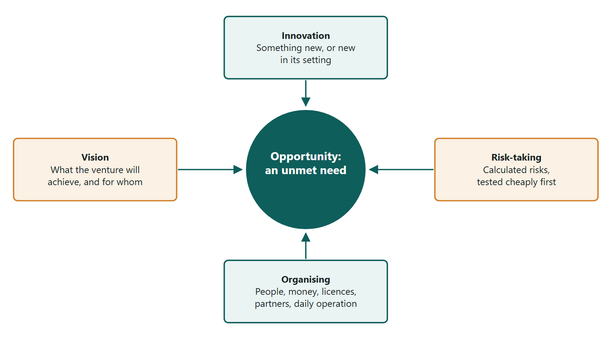
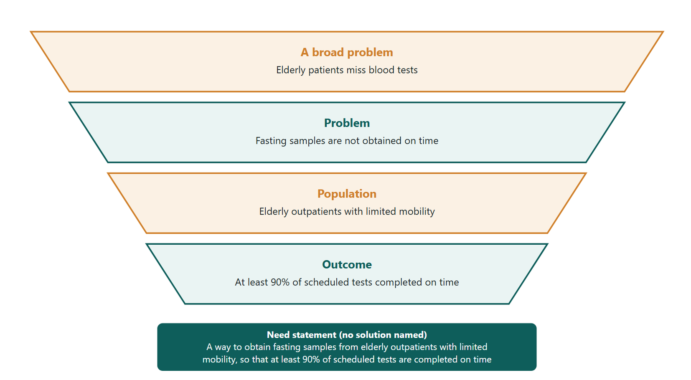
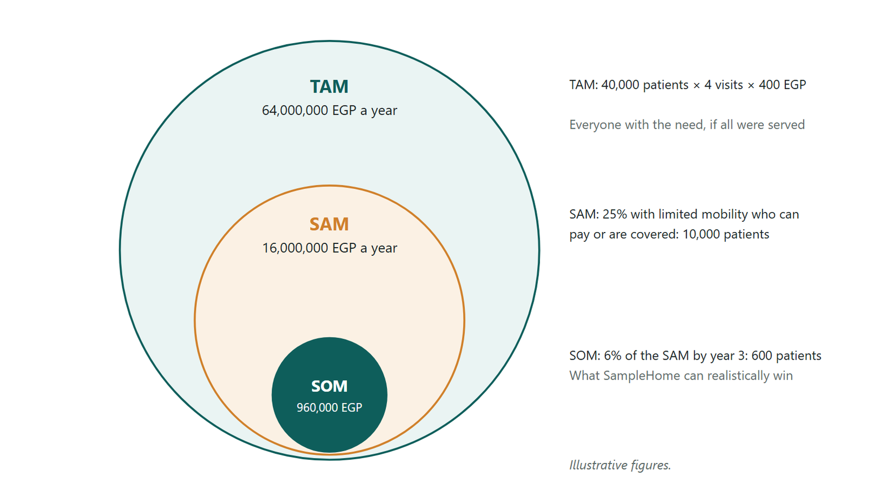
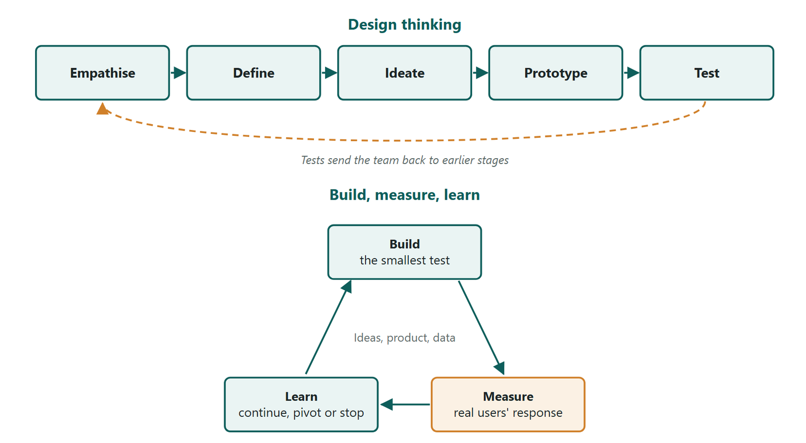

# Entrepreneurship in Healthcare

**From a Health Need to a Sustainable Venture** · 2026–2027

Assoc. Prof. Mohamed Yasser Hamdy

Faculty of Applied Health Sciences, East Port Said National University

This book is for teaching. Company facts, funding figures, regulations and fees change; the examples are dated and sourced, and should be checked against current official sources before they are relied on.

## About This Book

This book is written for third-year students of the Faculty of Applied Health Sciences. Most of you will work in medical laboratories, imaging centres or other health services. Some of you will found a venture of your own. Most of you will work inside an organisation, where the same skills let you improve a service or start something new.

Entrepreneurship in health care is not only about profit. It starts from a real need of patients, and it works within strict professional, legal and ethical limits. A venture that is fast and cheap but unsafe is not a success.

The book has four parts. Part I explains what entrepreneurship is, who entrepreneurs are and why a country needs them. Part II looks at the world a health venture works in: its task and general environment, competition, culture and globalisation. Part III follows the first steps of a venture: finding a need, generating ideas, understanding patients and payers, and testing a minimum version safely. Part IV builds the venture: its business model, its costs and funding, its licences and quality systems, its intellectual property and brand, and its launch and growth.

One invented venture, SampleHome, runs through Parts III and IV. It is a home sample-collection service founded by two graduates of this faculty. Each tool in the book is applied to it, so you can see how the steps fit together. Every chapter also has a real Egyptian example. These cover laboratory and imaging groups, digital health startups, a pharmaceutical company and charitable hospitals, and every fact in them is taken from a dated, named source.

## Contents

- [Chapter 1: Entrepreneurship and the Health Entrepreneur](#chapter-1-entrepreneurship-and-the-health-entrepreneur)
- [Chapter 2: Kinds of Entrepreneurs and the Entrepreneurial Journey](#chapter-2-kinds-of-entrepreneurs-and-the-entrepreneurial-journey)
- [Chapter 3: Why Entrepreneurship Matters and How Egypt Supports It](#chapter-3-why-entrepreneurship-matters-and-how-egypt-supports-it)
- [Chapter 4: The Environment of a Health Venture](#chapter-4-the-environment-of-a-health-venture)
- [Chapter 5: Culture, Globalisation and Health Teams](#chapter-5-culture-globalisation-and-health-teams)
- [Chapter 6: Unmet Health Needs and the Need Statement](#chapter-6-unmet-health-needs-and-the-need-statement)
- [Chapter 7: Ideas, Empathy and Personas](#chapter-7-ideas-empathy-and-personas)
- [Chapter 8: Customer Discovery: Patients, Payers and Competitors](#chapter-8-customer-discovery-patients-payers-and-competitors)
- [Chapter 9: Design Thinking, the Minimum Viable Product and Prototyping](#chapter-9-design-thinking-the-minimum-viable-product-and-prototyping)
- [Chapter 10: Business Models and the Business Plan](#chapter-10-business-models-and-the-business-plan)
- [Chapter 11: Start-up Costs, Break-even and Funding](#chapter-11-start-up-costs-break-even-and-funding)
- [Chapter 12: Regulation, Quality and Ethics for Health Ventures](#chapter-12-regulation-quality-and-ethics-for-health-ventures)
- [Chapter 13: Intellectual Property and the Brand of a Health Venture](#chapter-13-intellectual-property-and-the-brand-of-a-health-venture)
- [Chapter 14: Launching, Growing and Sustaining a Health Venture](#chapter-14-launching-growing-and-sustaining-a-health-venture)
- [Glossary](#glossary)
- [References](#references)

## How to Use This Book

Each chapter opens with learning objectives. Read them first; they tell you what you should be able to do by the end.

Four boxes appear in every chapter. *Egyptian Entrepreneur* tells the story of a real Egyptian founder or venture and the lesson it teaches. **Through Two Lenses** applies the chapter's main idea to the medical laboratory and to radiology and medical imaging. *In Practice* shows the idea at work. *Ethics Check* sets out where the idea meets a professional or legal limit. Read the Ethics Check with particular care: it is what most distinguishes health ventures from other businesses.

Other boxes appear where they help. *Key Formula* gives an equation with its symbols. *Worked Example* works a calculation step by step. *Common Mistake* names an error students often make. *Egyptian Context* links the topic to Egyptian rules or institutions.

Each chapter ends with key takeaways, ten multiple-choice questions and three essay questions. Answer the questions before reading the answers. Every multiple-choice answer has a short rationale, and every essay question has model answer points. Use the points to check your own answer, not to memorise.

Work the calculations in Chapters 6, 8, 9 and 11 with a pen. All figures in worked examples are illustrative, not real market data, and prices are in Egyptian pounds.

Terms printed in bold are defined in the glossary at the end of the book. The consolidated reference list follows the glossary.

---

# Chapter 1: Entrepreneurship and the Health Entrepreneur

## Learning Objectives
By the end of this chapter you will be able to:
1. [LO1] Define entrepreneurship as the pursuit of an opportunity and trace the origin of the word.
2. [LO2] Describe the four elements of entrepreneurship and apply them to a health venture.
3. [LO3] Distinguish the entrepreneur from the small-business owner, the manager and the intrapreneur.
4. [LO4] Explain the main characteristics of entrepreneurs as behaviours that can be learned.

## 1.1 Why a Health Student Should Study Entrepreneurship

You are training to run tests, take images and care for patients. Why study entrepreneurship as well?

The answer starts with the services you will work in. Many laboratories, imaging centres, pharmacies and clinics in Egypt began as one person's idea. A doctor opened one small laboratory. A radiologist bought a first scanner. A pharmacist built an app. Each saw a need that was not being met and built a service to meet it.

You will meet such needs every day. A patient travels for hours to reach a test. A report arrives too late to change treatment. A device breaks, and no one nearby can repair it. Some of you will found a venture to solve one of these problems. Most of you will work inside an organisation. There, the same skills let you improve a service, start a new unit or test a better way of working.

This book teaches those skills. It follows one path, from a health need to a venture that is safe, lawful and able to pay its way. This first chapter asks what entrepreneurship is and who entrepreneurs are.

## 1.2 Where the Word Comes From

The English word **entrepreneur** was borrowed from the French verb *entreprendre*, "to undertake". The French verb itself comes from Latin roots meaning "to take in hand". An entrepreneur is therefore someone who undertakes a task and takes its risks.

Economists have used the word for about three centuries (Kuratko, 2020). Richard Cantillon, writing in the eighteenth century, described the entrepreneur as someone who buys at a known price and sells at an uncertain one. The risk lies in that gap. Jean-Baptiste Say added that the entrepreneur brings together land, labour and capital to produce something of value.

Joseph Schumpeter changed the idea in the twentieth century (Schumpeter, 1934). For him, the entrepreneur is an innovator. Entrepreneurs introduce a new product, a new method, a new market, a new source of supply or a new way of organising an industry. In doing so they disturb the existing order. Schumpeter called this process **creative destruction**: new ways of working replace old ones.

## 1.3 What Entrepreneurship Is

Older textbooks define the entrepreneur as someone who combines factors of production, turns raw materials into finished products and sells them for profit. That definition fits a factory owner. It does not fit most health ventures, which sell services: a blood test, a scan, a consultation, a home visit. It also fits any business owner, whether or not they do anything new.

Modern research defines the field through opportunity. Shane and Venkataraman (2000) describe entrepreneurship as the study of how opportunities to create future goods and services are discovered, evaluated and exploited, and by whom. Three ideas follow from this view.

1. **An opportunity comes first.** An **opportunity** is a situation in which a new product, service or way of working could create value for someone who needs it.
2. **Entrepreneurship is a process.** It runs from noticing a need, through testing an idea, to building and growing a venture.
3. **The result can be a product or a service.** A new home-sampling service is as entrepreneurial as a new device.

In this book, **entrepreneurship** means identifying an unmet need, creating a new product or service to meet it, and organising the resources and risks of a venture to deliver it. A **venture** is the new organisation, or new unit inside an organisation, built for that purpose. Profit matters, because a venture that loses money cannot last. In health care, however, profit is never the only aim. A health venture must also be safe for patients and fair to them.

> **In Practice:** Two graduates of a laboratory programme notice that elderly patients in their town miss routine blood tests because travel is hard. They do not invent a new test. They design a new service: trained staff visit homes, draw samples and carry them to an accredited laboratory. The innovation is in the service, not the chemistry. By the definition above, this is entrepreneurship.

## 1.4 The Four Elements of Entrepreneurship

Most textbooks name four elements that every entrepreneurial venture needs (Kuratko, 2020). Figure 1.1 shows them around the opportunity they serve.

*Figure 1.1 — The four elements of entrepreneurship. Innovation, calculated risk-taking, vision and organising all serve one opportunity: an unmet need that a new product or service could meet.*  
Original diagram (original)

**Innovation** is doing something new or doing something in a new way. It may be a new product, a new service, a new process or a new business model. In health care, much innovation is in process: shorter waiting times, faster reports, safer sample transport.

**Risk-taking** is acting when the result is uncertain. Founders risk money, time, reputation and career. Good entrepreneurs do not seek risk for its own sake. They take **calculated risks**: they estimate what could go wrong, test their ideas cheaply first, and limit what they could lose.

**Vision** is a clear picture of what the venture will achieve and for whom. A vision gives direction when plans change. A laboratory founder's vision might be "accurate results, within a day, for every patient in the governorate".

**Organising** is bringing together people, money, equipment, licences and partners, and managing them so the venture works. A brilliant idea fails if no one can run it day after day.

> **Common Mistake:** Students often treat innovation as invention. Innovation does not require a patent or a new machine. Applying an existing method in a new place, for a new group of patients, is also innovation. The first teleradiology service in a governorate is innovative there, even if the technology exists elsewhere.

## 1.5 The Entrepreneur and Similar Roles

The word *entrepreneur* is often used loosely. Four roles are worth separating.

| Role | Main aim | Relation to innovation | Example in health care |
|---|---|---|---|
| Entrepreneur | Pursue an opportunity and build a new venture | Creates something new, or new in its setting | Founds a home-sampling laboratory service |
| Small-business owner | Run a stable business that supports the owner | May or may not innovate | Owns one neighbourhood pharmacy run in the usual way |
| Manager | Run an existing organisation efficiently | Improves within existing goals | Manages a hospital laboratory's daily work |
| Intrapreneur | Pursue an opportunity inside an existing organisation | Creates something new for the employer | Starts a new molecular-testing unit in an existing laboratory chain |

*Table 1.1. The entrepreneur and three related roles.*

The lines between the roles are not sharp. A small-business owner becomes entrepreneurial when they introduce something new. A manager becomes an **intrapreneur** when they champion a new service inside the organisation, with its resources and its risks (Kuratko, 2020). Many of you will be intrapreneurs before you are founders, and some of you will stay intrapreneurs for your whole career.

A **startup** is a special kind of new venture. It is built to search for a business model that can be repeated and grown quickly (Blank, 2013). A new pharmacy that copies the usual model is a new small business. A digital pharmacy platform that hopes to serve a whole country is a startup.

> **Egyptian Entrepreneur:** Moamena Kamel and Al Mokhtabar
>
> In 1979 Dr Moamena Kamel, a lecturer at Cairo University who had studied immunology in France, opened a laboratory in Cairo. According to the case study by the International Finance Corporation (2022), it was the first laboratory for immunological testing in Egypt, used mainly for transplants. Before then, patients needing a kidney transplant had to travel abroad for these tests. Her laboratory later became part of Al Mokhtabar, which merged with Al Borg Laboratories in 2012 to form Integrated Diagnostics Holdings (IDH). The group is now run by her daughter, Dr Hend El Sherbini (International Finance Corporation, 2022).
>
> The story shows all four elements. The innovation was a test service new to Egypt. The risk was opening a specialised laboratory before demand was proven. The vision was to spare patients a journey abroad. The organising came later, as one laboratory grew into a network. Facts are as reported in 2022 by the sources named.

## 1.6 Characteristics of Entrepreneurs

Research has tried for decades to find a single entrepreneurial personality. It has not found one (Hisrich et al., 2020; Neck et al., 2021). Entrepreneurs differ widely. What they share is a set of behaviours, and behaviours can be learned and practised. The list below gathers the characteristics most often named.

- **Risk tolerance.** They act under uncertainty, after limiting the downside.
- **Perceptiveness and curiosity.** They notice problems others accept, and ask why things are done as they are.
- **Imagination.** They picture solutions that do not yet exist.
- **Persistence.** They keep going after rejection and failure, and learn from both.
- **Goal-setting.** They set clear, measurable targets and track progress.
- **Self-confidence.** They believe they can succeed, while staying open to evidence that they are wrong.
- **Flexibility.** They change the plan when the evidence changes.
- **Independence.** They are willing to decide and to take responsibility for the decision.
- **Hard work.** They accept long hours, especially in the early years.

Two cautions apply. First, these traits help in many careers, not only in founding ventures. Second, some can harm patients if they are not balanced. Over-confidence can lead a founder to launch a service before it is safe. Persistence can turn into refusing to stop a project that is not working. A health entrepreneur needs a further trait: respect for evidence and for the patient.

> **Ethics Check:** In health care, a "move fast" culture can kill. A founder who launches a test before its accuracy is checked, or a home service before staff are trained, puts patients at risk to win market share. The entrepreneurial habits in this chapter must work inside professional duties: patient safety, honest results and respect for privacy. A venture that cannot be safe should not be launched, however large the opportunity.

## 1.7 A Brief Foreign Case: Apple

The source lectures used foreign technology founders as examples. Apple is the best known. It was founded in California in 1976 by Steve Jobs, Steve Wozniak and Ronald Wayne; Wayne left within days (Isaacson, 2011). Its early success came from an innovation in organising as much as in technology. It packaged a computer as a finished product for ordinary users rather than as a kit for hobbyists.

The lesson for health ventures is the same. Patients rarely buy technology for its own sake. They buy a result that is easy to obtain and to understand: a clear report, a short wait, a test at home.

> **Through Two Lenses**
> - **Medical Laboratory:** A laboratory technologist sees opportunities at the bench every day: samples rejected for poor labelling, tests repeated because transport was slow, results that doctors cannot interpret. Each is a possible venture. Examples include a sample-transport service, a training course for collection staff, or an interpretation note for complex panels. Innovation here is mostly in process and service, not in new chemistry.
> - **Radiology and Medical Imaging:** An imaging technologist sees a different set of gaps: long waits for MRI, scanners idle at night, reports delayed by a shortage of radiologists, patients anxious before a scan. Each is a possible venture. Examples include an evening booking service, a teleradiology partnership, or a preparation guide that cuts repeat scans. Innovation here often joins equipment, staff and scheduling in a new way.

## Key Takeaways
- The word *entrepreneur* was borrowed from French *entreprendre*, "to undertake"; Schumpeter made innovation central to it.
- Entrepreneurship is the discovery, evaluation and pursuit of opportunities to create new products or services; it covers services, which are most of health care.
- Every venture needs innovation, calculated risk-taking, vision and organising.
- The entrepreneur differs from the small-business owner, the manager and the intrapreneur by pursuing something new.
- Entrepreneurial characteristics are behaviours that can be learned, and in health care they must be balanced by respect for evidence and for patients.
- Profit keeps a venture alive, but a health venture must also be safe and fair.

## Check Your Understanding

**Q1.** [LO1] English borrowed the word *entrepreneur* from:
A) German *unternehmen*
B) Latin *mercator*
C) French *entreprendre*
D) Italian *impresa*

**Q2.** [LO1] In the opportunity-based view of Shane and Venkataraman, entrepreneurship is mainly about:
A) Discovering, evaluating and exploiting opportunities to create future goods and services
B) Owning a business that produces finished goods from raw materials
C) Managing a large company efficiently
D) Investing savings in the stock market

**Q3.** [LO1] Which economist made innovation and "creative destruction" central to entrepreneurship?
A) Richard Cantillon
B) Jean-Baptiste Say
C) Adam Smith
D) Joseph Schumpeter

**Q4.** [LO2] Two graduates start a service that collects blood samples at patients' homes and carries them to an accredited laboratory. The test methods are standard. The service is best described as:
A) Not entrepreneurial, because no new test was invented
B) Entrepreneurial, because it is a new service that meets an unmet need
C) Not entrepreneurial, because it sells a service rather than a product
D) Entrepreneurial only if it is protected by a patent

**Q5.** [LO2] A founder estimates what could go wrong, tests the idea on a small scale first and limits possible losses. This shows:
A) Calculated risk-taking
B) Risk avoidance
C) Organising only
D) A lack of vision

**Q6.** [LO2] "Accurate results within a day for every patient in the governorate" is an example of a venture's:
A) Organising
B) Barrier to entry
C) Vision
D) Risk

**Q7.** [LO3] A laboratory chain employee persuades her employer to open and lead a new molecular-testing unit. She is acting as:
A) A small-business owner
B) A passive investor
C) An intrapreneur
D) A distributor

**Q8.** [LO3] Which is the clearest example of a startup rather than a new small business?
A) A new neighbourhood pharmacy run in the usual way
B) A digital pharmacy platform designed to grow quickly across the country
C) A family clinic that keeps the same model for decades
D) A franchise branch that copies an existing model exactly

**Q9.** [LO4] Which statement about entrepreneurial characteristics is best supported by research?
A) Entrepreneurs share one fixed personality type
B) The characteristics are inherited and cannot be learned
C) Only risk-seeking people can become entrepreneurs
D) The characteristics are behaviours that can be learned and practised

**Q10.** [LO4] A founder is so confident in a new home test that she plans to launch before its accuracy has been checked. The main problem is:
A) Too little persistence
B) Over-confidence that puts patients at risk
C) Too much respect for evidence
D) A lack of independence

### Essay Questions

**E1.** [LO1] Explain why the older definition of an entrepreneur as someone who turns raw materials into finished products does not suit health care, and give the definition used in this book.

**E2.** [LO2] Choose a problem you have seen in a laboratory or imaging department. Describe a venture that could solve it, and show how each of the four elements of entrepreneurship would apply.

**E3.** [LO3] Compare the entrepreneur, the manager and the intrapreneur, using one health-care example for each.

## Answers and Worked Solutions

**Q1. C** — English took the word from the French verb *entreprendre*, "to undertake". The French verb has Latin roots, but English borrowed it from French.

**Q2. A** — Shane and Venkataraman define the field through opportunities that are discovered, evaluated and exploited. Option B is the older manufacturing definition.

**Q3. D** — Schumpeter described the entrepreneur as an innovator whose new combinations replace old ones. Cantillon stressed risk, and Say stressed the combining of resources.

**Q4. B** — A new service that meets an unmet need is entrepreneurial. Innovation need not be a new test, and services count as fully as products.

**Q5. A** — Estimating the downside, testing small and limiting losses is calculated risk-taking, not avoidance of risk.

**Q6. C** — A clear statement of what the venture will achieve and for whom is its vision.

**Q7. C** — She is pursuing a new opportunity inside an existing organisation, using its resources: that is intrapreneurship.

**Q8. B** — A startup is built to search for a model that can be repeated and grown quickly. The other options keep an existing model.

**Q9. D** — Research has found no single entrepreneurial personality; the characteristics are behaviours that can be developed.

**Q10. B** — Launching before accuracy is checked is over-confidence that endangers patients. A health entrepreneur must respect evidence.

**E1 — model answer points.** The older definition describes manufacturing; most health ventures sell services such as tests, scans and visits. It also fits any business owner, whether or not they innovate. This book defines entrepreneurship as identifying an unmet need, creating a new product or service to meet it, and organising the resources and risks of a venture to deliver it. Profit sustains the venture, but safety and fairness are also aims.

**E2 — model answer points.** A clearly stated problem, such as delayed MRI reports. A venture, such as a teleradiology partnership. Innovation: a new way of matching scans to radiologists. Risk: cost of the platform, uncertain demand, data security; how to test small. Vision: a stated target, such as reports within 12 hours. Organising: radiologists, IT, licences, contracts with centres.

**E3 — model answer points.** Entrepreneur: builds a new venture around an opportunity, such as a home-sampling service. Manager: runs an existing unit efficiently, such as a hospital laboratory manager. Intrapreneur: champions a new venture inside an employer, such as a new molecular unit in a laboratory chain. The roles overlap; a manager can act as an intrapreneur.

## References
Blank, S. (2013). Why the lean start-up changes everything. *Harvard Business Review, 91*(5), 63–72. https://hbr.org/2013/05/why-the-lean-start-up-changes-everything
Hisrich, R. D., Peters, M. P., & Shepherd, D. A. (2020). *Entrepreneurship* (11th ed.). McGraw-Hill Education.
International Finance Corporation. (2022). *Integrated Diagnostics Holdings (IDH): Case study*. World Bank Group. https://www.ifc.org/en/insights-reports/2022/integrated-diagnostics-holdings-cases-study
Isaacson, W. (2011). *Steve Jobs*. Simon & Schuster.
Kuratko, D. F. (2020). *Entrepreneurship: Theory, process, and practice* (11th ed.). Cengage Learning.
Neck, H. M., Neck, C. P., & Murray, E. L. (2021). *Entrepreneurship: The practice and mindset* (2nd ed.). SAGE Publications.
Schumpeter, J. A. (1934). *The theory of economic development*. Harvard University Press.
Shane, S., & Venkataraman, S. (2000). The promise of entrepreneurship as a field of research. *Academy of Management Review, 25*(1), 217–226. https://doi.org/10.5465/amr.2000.2791611

---

# Chapter 2: Kinds of Entrepreneurs and the Entrepreneurial Journey

## Learning Objectives
By the end of this chapter you will be able to:
1. [LO1] Use the four Ds as an informal self-check of commitment to an idea.
2. [LO2] Classify entrepreneurs by Danhof's four types and by motive, including necessity, opportunity and social entrepreneurs.
3. [LO3] Describe the informal four-stage model of the entrepreneurial journey and the venture-creation path this book follows.
4. [LO4] Explain why accurate, sourced facts about founders matter when a case is used to teach.

## 2.1 Many Kinds of Entrepreneur

Chapter 1 defined entrepreneurship and its four elements. This chapter asks a different question: what kinds of entrepreneur are there, and how does a venture grow from an idea?

There is no single answer. Researchers sort entrepreneurs in several ways: by how committed they are, by how they treat new ideas, by why they start, and by what they want to achieve. Each way of sorting is a lens. None of them is the whole truth about a person, and one founder can fit several categories over a career.

## 2.2 The Four Ds: an Informal Self-Check

Teaching notes on entrepreneurship often sort would-be founders into four groups, sometimes called the four Ds. They are not a research typology. They come from popular writing on business. They are useful, however, as a mirror in which students can check their own commitment to an idea.

- **Doers** act on their ideas. They test them, learn from the results and keep going.
- **Dreamers** have ideas but do not act on them. The idea stays a wish.
- **Dawdlers** begin but delay. They wait for the perfect moment, the perfect plan or more money, and the moment passes.
- **Duds** give up at the first difficulty.

> **Common Mistake:** The four Ds describe behaviour at one moment, not fixed types of people. A student who has been a dreamer about an idea for a year can become a doer next week by taking one small step, such as interviewing five patients about the problem. Do not label yourself or others permanently.

## 2.3 Danhof's Four Types

A classic research typology comes from Clarence Danhof (1949). He studied how farmers responded to new methods and identified four types, which are still used to describe entrepreneurs in any field.

1. **Innovative entrepreneurs** introduce new products, methods or markets. They accept the risk of being first.
2. **Imitative entrepreneurs** copy innovations that have succeeded elsewhere and adapt them to a new place. Some textbooks also call them adoptive entrepreneurs. Much entrepreneurship in developing economies is of this kind, and it creates real value.
3. **Fabian entrepreneurs** are cautious. They adopt a change only when failing to do so would clearly cause loss. The name comes from the Roman general Fabius, famous for avoiding battle.
4. **Drone entrepreneurs** refuse to change even when change is needed, and may lose their business as a result.

The revision notes for this course list further labels: prime movers, managers, artists and visionaries. These labels come from popular writing and are not research categories. They can be used to describe a person's style, but they should not be learned as a classification.

> **In Practice:** Three laboratories in one town respond to home sample collection. The first designs the service before anyone else in the governorate: an innovative response. The second copies the service a year later, once it has proved popular, and adapts it to its own staff: an imitative response. The third adds home visits only after it loses many elderly patients to the others: a Fabian response. A fourth refuses to change and slowly loses patients: a drone response.

## 2.4 Classifying by Motive and Aim

### Necessity and opportunity

The Global Entrepreneurship Monitor, a long-running international survey, distinguishes two motives (Global Entrepreneurship Monitor, 2024). A **necessity entrepreneur** starts a business because there are no better options for work. An **opportunity entrepreneur** starts a business to pursue a promising chance. Both exist in every country. Necessity entrepreneurship is more common where jobs are scarce. Many necessity ventures are small and stable, and many opportunity ventures fail, so neither motive guarantees success.

### Social entrepreneurs

A **social entrepreneur** uses entrepreneurial methods mainly to solve a social problem, such as lack of access to care, rather than mainly to earn profit for owners (Saebi et al., 2019). The venture may be a charity, a non-profit company or a business that reinvests its surplus in its mission. What matters is the main aim and how success is measured: in health gained and people served, not only in money. Chapter 14 returns to social entrepreneurship in health care, with Egyptian examples.

### Intrapreneurs and founders

Chapter 1 introduced the intrapreneur, who pursues an opportunity inside an existing organisation. This is the most common route for health professionals, because most work in hospitals, laboratories and centres they do not own.

## 2.5 Stages of the Entrepreneurial Journey

### An informal four-stage model

The revision notes describe four stages, each named after a role.

| Stage | Role | What happens |
|---|---|---|
| 1 | The Dreamer | An idea is born from a need the founder notices |
| 2 | The Architect | The founder designs how the venture will work and earn money |
| 3 | The Builder | The founder turns the design into a working service |
| 4 | The Cultivator | The founder grows and sustains the venture |

*Table 2.1. The informal four-stage model of the entrepreneurial journey.*

This model is easy to remember, but it has no research source, and real ventures rarely move in a straight line. Founders go back to the design stage when patients do not use a service as expected. The model is best read as a reminder that the skills needed change as a venture grows.

### The venture-creation path in this book

This book follows a more detailed path, drawn from the healthcare entrepreneurship literature (Chanda & Gupta, 2025) and from lean startup practice (Blank, 2013). Figure 2.1 shows it. Each step has its own chapter.

*Figure 2.1 — The venture-creation path followed in this book, with the chapter for each step. The dashed arrow shows that evidence at a later step, such as launch, can send a founder back to an earlier one.*  
Original diagram (original)

1. *Need* — find and state an unmet health need (Chapter 6).
2. *Idea* — generate solutions and understand the people affected (Chapter 7).
3. *Customer* — test whether patients and payers want the solution (Chapter 8).
4. *Design* — build a minimum version and test it safely (Chapter 9).
5. *Model* — describe how the venture creates value and earns money (Chapter 10).
6. *Finance* — cost the venture, find its break-even point and fund it (Chapter 11).
7. *Rules* — meet licensing, quality and ethical duties (Chapter 12), and protect what is yours (Chapter 13).
8. *Launch and growth* — launch, learn and grow (Chapter 14).

The arrows loop back. Evidence at any step can send a founder back to an earlier one. A founder who learns in customer interviews that patients do not trust home sampling may return to the design step and add a pharmacist-supervised collection point.

> **Egyptian Entrepreneur:** Ahmed Abu Elhaz and Shezlong
>
> Ahmed Abu Elhaz founded Shezlong in Cairo in 2014, as an online platform for psychotherapy. According to an interview in *The National* (Kamel, 2021), the idea came after he was diagnosed with depression and struggled to find affordable professional therapy in Egypt. The platform was designed to reduce the stigma of seeking help, since clients can attend sessions privately online. Therapists on the platform must be licensed and experienced; the report lists a master's degree and several years of practice among its requirements. It grew from 3 therapists in 2015 to more than 300 counsellors by 2021 (Kamel, 2021).
>
> The story shows the journey from dreamer to builder. A personal experience revealed a need, the founder designed a service around it, and the service grew. It also shows that social stigma can be as real a barrier to care as cost or distance. Facts are as reported in 2021 by the source named.

## 2.6 Foreign Cases and the Accuracy of Founder Stories

Famous founders are used to teach entrepreneurship because their stories are memorable. Their stories are also often told wrongly. Tesla is an example. Tesla Motors was incorporated in 2003 by Martin Eberhard and Marc Tarpenning (Vance, 2015). Elon Musk joined in 2004 as the lead investor in its first funding round and became chairman. A legal settlement in 2009 allowed Musk and two early engineers to call themselves co-founders as well. The company was renamed Tesla, Inc. in 2017. A student who says "Musk founded Tesla" has learned a simplified story, not the record.

Two lessons follow for anyone who uses cases to teach or to learn.

- **Check the facts.** Use dated, named sources for founders, years and figures. This book does so in every Egyptian Entrepreneur box.
- **Beware survivorship bias.** We hear about the founders who succeeded, not the many who tried the same thing and failed. A famous case shows what is possible, not what is likely.

> **Ethics Check:** A founder story used in marketing or teaching must be true. Inflating a founder's role, inventing a dramatic origin or hiding a failed first attempt misleads students, patients and investors. In health care, where trust is the main asset, a venture that misrepresents its own history invites doubt about its results too.

> **Through Two Lenses**
> - **Medical Laboratory:** Laboratories show every one of Danhof's types. Some introduce new tests first. Many adopt tests proven elsewhere. Some wait until doctors insist, and a few refuse automation until they lose contracts. An imitative laboratory that brings a proven test to an underserved governorate is entrepreneurial. For patients there, the test is new.
> - **Radiology and Medical Imaging:** Imaging ventures often begin as imitative ventures, because scanners and methods come from abroad. The innovation lies in where and how they are offered: a centre in a town with none, evening sessions, or a mobile unit. Because equipment costs so much, imaging founders move through the builder stage slowly and must plan funding early.

## Key Takeaways
- The four Ds (doers, dreamers, dawdlers, duds) are an informal self-check of commitment, not a research typology.
- Danhof's types are innovative, imitative, Fabian and drone; imitative ventures that adapt proven ideas create real value.
- Necessity entrepreneurs start because they lack other work; opportunity entrepreneurs pursue a chance; social entrepreneurs aim mainly at a social problem.
- The Dreamer–Architect–Builder–Cultivator model is informal; this book follows an eight-step venture-creation path with loops back.
- Founder stories must be checked against dated sources, and famous cases suffer from survivorship bias.

## Check Your Understanding

**Q1.** [LO1] A student has talked about a health app idea for two years but has never spoken to a single patient about it. In the four Ds, this behaviour is that of a:
A) Doer
B) Dreamer
C) Drone
D) Fabian

**Q2.** [LO1] Which statement about the four Ds is correct?
A) They are a research typology based on large surveys
B) They describe fixed personality types that cannot change
C) They are an informal self-check of behaviour at a given moment
D) They classify ventures by their legal form

**Q3.** [LO2] A laboratory brings a test proven abroad to a governorate where no laboratory offers it, and adapts it to local needs. In Danhof's typology this is:
A) An imitative entrepreneur
B) A drone entrepreneur
C) A Fabian entrepreneur
D) A necessity entrepreneur

**Q4.** [LO2] An imaging centre adds evening sessions only after losing many patients to competitors who already offer them. This is closest to:
A) An innovative entrepreneur
B) An imitative entrepreneur
C) A drone entrepreneur
D) A Fabian entrepreneur

**Q5.** [LO2] A graduate opens a small sample-collection point mainly because she could not find a job. She is best described as:
A) A social entrepreneur
B) A necessity entrepreneur
C) An intrapreneur
D) A drone entrepreneur

**Q6.** [LO2] What most distinguishes a social entrepreneur?
A) Working without any income
B) Working only in government
C) A main aim of solving a social problem, with success measured in social results
D) Refusing all forms of innovation

**Q7.** [LO3] In the informal four-stage model, designing how the venture will work and earn money is the stage of:
A) The Dreamer
B) The Cultivator
C) The Builder
D) The Architect

**Q8.** [LO3] Why does the venture-creation path in this book include loops back to earlier steps?
A) Because evidence at a later step can show that an earlier decision was wrong
B) Because the law requires every step to be repeated
C) Because the steps have no order
D) Because funding always comes before the need is found

**Q9.** [LO4] Which statement about the founding of Tesla is accurate?
A) Elon Musk founded Tesla alone in 2003
B) Tesla was founded by Steve Jobs and Steve Wozniak
C) Tesla was incorporated in 2003 by Martin Eberhard and Marc Tarpenning; Musk joined in 2004 as lead investor
D) Tesla was founded in 2017 under the name Tesla, Inc.

**Q10.** [LO4] Survivorship bias in founder cases means that:
A) Successful founders are always more talented
B) We see the successes and not the many similar attempts that failed
C) Only ventures that survive five years are counted as startups
D) Failed ventures are illegal to study

### Essay Questions

**E1.** [LO2] Using one laboratory or imaging example, describe how innovative, imitative, Fabian and drone entrepreneurs would each respond to a new technology.

**E2.** [LO3] Compare the informal four-stage model with the venture-creation path in this book. Which is more useful to a founder, and why?

**E3.** [LO4] Explain why the facts in a founder case must be checked, using the Tesla example and the idea of survivorship bias.

## Answers and Worked Solutions

**Q1. B** — Having an idea without acting on it is the behaviour of a dreamer. Drone and Fabian are Danhof's types, not part of the four Ds.

**Q2. C** — The four Ds come from popular writing; they describe behaviour at a moment and can change.

**Q3. A** — Adopting and adapting a proven innovation for a new place is imitative, or adoptive, entrepreneurship.

**Q4. D** — Adopting a change only when failing to do so causes clear loss is the Fabian response.

**Q5. B** — Starting a business because better work is not available is necessity entrepreneurship.

**Q6. C** — Social entrepreneurs aim mainly at a social problem and measure success in social results; many earn income.

**Q7. D** — The Architect designs the business model. The Dreamer has the idea, the Builder realises it and the Cultivator grows it.

**Q8. A** — New evidence can reveal that an earlier step was wrong, so the founder returns to it.

**Q9. C** — Eberhard and Tarpenning incorporated Tesla Motors in 2003. Musk led the 2004 funding round and later gained the right to be called a co-founder.

**Q10. B** — We hear about the survivors, which makes success look more likely than it is.

**E1 — model answer points.** A new automated analyser, or a teleradiology service. Innovative: adopts first, accepts the risk. Imitative: adopts once proven and adapts locally. Fabian: adopts only when losing patients or contracts. Drone: refuses and declines. Note that imitative adoption creates value where the service is new.

**E2 — model answer points.** The four stages are simple and show that skills change as a venture grows, but they are unsourced and linear. The eight-step path names concrete tasks (need, idea, customer, design, model, finance, rules, launch) and allows loops back when evidence changes. The path is more useful for planning; the stages are a memory aid.

**E3 — model answer points.** Cases teach through facts; wrong facts teach wrong lessons. Tesla was incorporated by Eberhard and Tarpenning, and Musk joined as an investor. Survivorship bias hides the failures, so cases overstate the chance of success. Use dated, named sources and look for failure cases too.

## References
Blank, S. (2013). Why the lean start-up changes everything. *Harvard Business Review, 91*(5), 63–72. https://hbr.org/2013/05/why-the-lean-start-up-changes-everything
Chanda, A., & Gupta, S. (2025). *Healthcare entrepreneurship and management: A comprehensive guide for biomedical engineers and entrepreneurs*. Routledge. https://doi.org/10.4324/9781003475309
Danhof, C. H. (1949). Observations on entrepreneurship in agriculture. In A. H. Cole (Ed.), *Change and the entrepreneur* (pp. 20–24). Harvard University Press.
Global Entrepreneurship Monitor. (2024). *Global Entrepreneurship Monitor 2023/2024 global report: 25 years and growing*. GEM.
Kamel, D. (2021). Generation start-up: Shezlong seeks to remove mental health stigma through online counselling. *The National*, 26 June. https://www.thenationalnews.com/business/technology/generation-start-up-shezlong-seeks-to-remove-mental-health-stigma-through-online-counselling-1.1249075
Saebi, T., Foss, N. J., & Linder, S. (2019). Social entrepreneurship research: Past achievements and future promises. *Journal of Management, 45*(1), 70–95. https://doi.org/10.1177/0149206318793196
Vance, A. (2015). *Elon Musk: Tesla, SpaceX, and the quest for a fantastic future*. Ecco.

---

# Chapter 3: Why Entrepreneurship Matters and How Egypt Supports It

## Learning Objectives
By the end of this chapter you will be able to:
1. [LO1] Explain the economic and social reasons a country needs entrepreneurs, with health-care examples.
2. [LO2] Describe entrepreneurship development programmes and analyse the common problems that weaken them.
3. [LO3] Identify the measures a country can take to promote entrepreneurship.
4. [LO4] Describe the main parts of the Egyptian entrepreneurship ecosystem, including the national Startup Charter.

## 3.1 Why a Country Needs Entrepreneurs

Governments spend money and effort to encourage entrepreneurship. The reasons are economic and social. The revision notes for this course list five; each is explained below with a health-care example.

1. **Increasing national production.** New ventures produce goods and services that did not exist before, or that were imported. A company that makes medical consumables in Egypt adds to national output and saves foreign currency.
2. **Balanced regional development.** Ventures can bring services and jobs to regions the large cities have left behind. A laboratory network that opens collection points in small towns spreads both care and employment.
3. **Dispersal of economic power.** Many small and medium ventures spread ownership and income more widely than a few large firms do. This makes the economy more competitive and more resilient.
4. **Reinvestment of profit.** Successful founders tend to reinvest in new branches, equipment and staff, which creates further growth.
5. **Entrepreneurial awareness.** Each visible success shows others that starting a venture is possible, and encourages more people to try.

Health care adds a sixth reason. Entrepreneurs can close gaps in access and quality that public systems cannot close alone. Teleradiology, home sampling and digital pharmacies have all reached patients whom existing services did not reach well.

Entrepreneurship also creates jobs, and in a young country this matters greatly. Research links a healthy rate of new ventures with economic growth, although the strength of the link depends on the quality of a country's institutions (Acs et al., 2018).

> **Common Mistake:** It is tempting to think that more startups always mean more growth. The research does not say so. Growth comes mainly from ventures that innovate and scale, and from institutions that let good ventures grow and failed ones close quickly. A country with many tiny businesses that never grow may gain little.

## 3.2 Entrepreneurship Development Programmes

An **entrepreneurship development programme** (EDP) is a structured course that aims to build the motivation, knowledge and skills needed to start and run a venture. It usually includes training in business planning, finance and marketing, and may add mentoring, visits to ventures and help with finance. University courses, incubator programmes and government training schemes are all forms of EDP.

### How well do they work?

Evidence on entrepreneurship education is mixed. A systematic review found that such courses often raise students' interest in entrepreneurship. Evidence that they lead to more and better ventures is weaker, partly because few studies follow students long enough (Nabi et al., 2017). Effects also fade unless the training is practical and followed by real action (Fayolle & Gailly, 2015).

### Common problems

Six problems are commonly listed. Each is explained below.

| Problem | What it means | A health-care example |
|---|---|---|
| Lack of a national policy | Programmes are run by many bodies with no shared goals, so they overlap or leave gaps | Three agencies train pharmacists in business skills while no one trains imaging technologists |
| Weak pre-training phase | Trainees are chosen poorly and their needs are not assessed before the course begins | A course on funding rounds is given to people who have not yet found a need |
| Over-estimation of trainees | Organisers expect every trainee to start a venture quickly | A programme is judged a failure because only a few of its students found a venture in a year |
| Short duration | Courses are too short to build real skills or a real plan | A two-day workshop on the whole venture path |
| Lack of infrastructure | Trainees have no access to space, equipment, mentors or finance after the course | Graduates have a plan but no affordable place to test a laboratory service |
| Improper methodology | Teaching is by lecture only, with no practice | Students memorise the parts of a business plan but never interview a patient |

*Table 3.1. Common problems of entrepreneurship development programmes.*

This book tries to avoid the last of these. Every chapter from Chapter 6 onward asks you to apply a tool to a real or realistic health venture, not only to learn its name.

## 3.3 How a Country Promotes Entrepreneurship

The measures governments use can be grouped as follows. The grouping is this book's own; it draws on the wider literature on entrepreneurial ecosystems.

- **Institutions for development.** Agencies, incubators and accelerators that train founders, give them space and connect them with mentors and investors.
- **Recognition.** Prizes, media coverage and public role models that make entrepreneurship respected.
- **Access to finance.** Grants, loans, guarantees and co-investment funds, especially for early-stage ventures that banks consider too risky.
- **Simpler procedures.** Less time and cost to register a company, obtain licences and pay taxes. Reducing the time needed to start a business is one of the cheapest measures a government can take.
- **Inclusion.** Programmes for women, young people and people in poorer regions, who face extra barriers to starting a venture.

> **In Practice:** A faculty wants more of its graduates to found health ventures. It could simply add a lecture course. Instead it combines several measures. Students take a semester-long project course and interview patients and staff in teaching hospitals. The best teams enter a competition judged by clinicians and investors, and winners get six months of space in the university incubator. A local bank offers small loans to graduates whose prototypes pass a safety review. Each measure is modest on its own. Together they address recognition, practice, infrastructure and finance at once.

These measures work best together, as an **entrepreneurial ecosystem**: a set of connected people and organisations that support new ventures in a place. Isenberg (2010) describes such an ecosystem as several domains acting together: policy, finance, culture, support, human capital and markets. An ecosystem includes founders, universities, investors, support organisations, large companies, regulators and customers. Figure 3.1 shows the main parts of the ecosystem around a health venture in Egypt.

*Figure 3.1 — The main parts of the entrepreneurial ecosystem around a health venture in Egypt. No part works alone: founders draw on universities, support bodies and investors, and must meet regulators and serve customers.*  
Original diagram (original)

## 3.4 The Egyptian Ecosystem

Egypt's ecosystem has grown quickly. Its parts include:

- *Universities*, many of which now run entrepreneurship courses, competitions and incubators for students and staff.
- *Incubators and accelerators*, which offer training, mentors, workspace and sometimes seed investment in return for a small share of a venture.
- *Investors*: angel investor networks, local and regional venture capital funds, and international development-finance institutions.
- *Government bodies*, which fund innovation, set rules and run national initiatives.
- *Regulators* of health care, medicines, devices and data, whose rules every health venture must meet (Chapter 12).

In February 2026 the government launched the **Startup Charter**, Egypt's first national framework dedicated to startups (Ahram Online, 2026). The charter defines startups as newly established companies with rapid growth and flexibility that offer or develop innovative products, services or business models. It separates them from ordinary small and medium enterprises using criteria such as growth potential, company age, use of technology and intellectual property. An early-stage startup can obtain a classification certificate that gives access to incentives and a digital platform for dealing with the tax authority, labour offices and social insurance. The charter aims to support 5,000 startups and create about 500,000 direct and indirect jobs. The same report states that Egyptian startups attracted 614 million US dollars of funding in 2025, 51% more than in the previous year (Ahram Online, 2026).

> **Egyptian Context:** A new national framework does not remove the need for sector rules. A health startup that holds a classification certificate must still be licensed as a medical establishment if it offers clinical services, and must register any medicine or device it sells. Chapter 12 explains these duties. Check the current text of the charter and its procedures with the responsible ministry before relying on any incentive.

> **Egyptian Entrepreneur:** Doaa Aref, Rasha Rady and Chefaa
>
> Chefaa is a digital pharmacy platform founded in 2017 by Doaa Aref and Dr Rasha Rady, according to Wamda (2022a). The founders are two friends, and the company is often cited as a leading women-led startup in Egyptian health technology. A 2020 profile in *StartupScene* reports that the app launched in 2018 and was tested repeatedly with older and less technical users and their carers. By that time the platform had more than 960 partner pharmacies across 26 governorates (StartupScene, 2020). In 2022 it raised a venture round from Newtown Partners, Global Brain and GMS Capital Partners. For all three investors it was their first venture investment in Egypt (Wamda, 2022a).
>
> The story shows the ecosystem at work: founders with a need, early investors, and later international investors who came because the venture had proved itself. Facts are as reported in 2020 and 2022 by the sources named.

## 3.5 Using the Ecosystem as a Student

You do not need to wait until graduation to use the ecosystem. Four steps are open to you now.

First, find the need. Keep a notebook during your clinical training. Write down every delay, error and complaint you see, and who it affects. Chapter 6 shows how to turn these notes into need statements.

Second, find people. Ventures are built by teams, and the best health teams mix skills. A laboratory student, an imaging student, a computing student and a business student see the same problem in four different ways. University competitions and clubs are good places to meet them.

Third, find support. Ask your faculty which incubators, competitions and mentors are open to students. Mentors are often senior professionals who will give an hour of advice to a serious student.

Fourth, find evidence before money. Investors and grant panels ask the same first question: what proof is there that patients or payers want this? Ten careful interviews and a small, safe test are worth more than a long plan. Chapters 8 and 9 show how to gather that proof.

> **Ethics Check:** Ecosystem support brings obligations. A founder who receives public grants, a classification certificate or development finance should report honestly on what the money achieved. Exaggerating user numbers or impact to win the next round of support is dishonest. It also harms the founders who compete fairly for the same funds.

> **Through Two Lenses**
> - **Medical Laboratory:** Laboratory ventures in Egypt can draw on the ecosystem at several points. Universities offer bench space and expertise for developing tests. Accelerators help digital services such as result portals and home-sampling apps. Accreditation bodies help a new laboratory prove quality to doctors and insurers. The main gap is often finance for equipment, which accelerators rarely cover.
> - **Radiology and Medical Imaging:** Imaging ventures need more capital than most, so investors and lenders matter early. Digital imaging ventures, such as teleradiology and AI reading tools, fit the startup definition well and attract venture investors. Centres that only add scanners look more like ordinary small and medium enterprises. Radiation licensing is a sector rule that no national framework replaces.

## Key Takeaways
- Entrepreneurs raise national production, spread development and economic power, reinvest profit and inspire others; in health care they also close gaps in access.
- Entrepreneurship development programmes raise interest more reliably than they create ventures; practical, longer and well-targeted programmes work better.
- Common problems of EDPs are weak policy, poor selection, unrealistic expectations, short courses, missing infrastructure and lecture-only teaching.
- Countries promote entrepreneurship through institutions, recognition, finance, simpler procedures and inclusion, working together as an ecosystem.
- Egypt's Startup Charter (February 2026) gives startups a national definition, a classification certificate and targets for growth and jobs.

## Check Your Understanding

**Q1.** [LO1] A laboratory network opens collection points in small towns, bringing tests and jobs outside the big cities. This best illustrates entrepreneurship's role in:
A) Balanced regional development
B) Centralising economic power
C) Reducing national production
D) Increasing imports

**Q2.** [LO1] Which statement about entrepreneurship and economic growth is best supported by research?
A) Any increase in the number of tiny businesses raises growth
B) Growth depends on ventures that innovate and scale, within good institutions
C) Entrepreneurship has no link with growth
D) Only government companies create growth

**Q3.** [LO2] What is the main aim of an entrepreneurship development programme?
A) To replace university degrees
B) To license medical establishments
C) To build the motivation, knowledge and skills to start and run a venture
D) To set prices for health services

**Q4.** [LO2] A programme accepts anyone who applies and teaches funding rounds to people who have not yet identified a need. This is mainly a problem of:
A) Short duration
B) A weak pre-training phase
C) Lack of infrastructure
D) Too much practice

**Q5.** [LO2] Students memorise the parts of a business plan but never interview a patient. This is a problem of:
A) Over-estimation of trainees
B) A national policy
C) Long duration
D) Improper methodology

**Q6.** [LO3] Which measure is among the cheapest a government can take to promote entrepreneurship?
A) Building a new hospital
B) Buying scanners for every startup
C) Reducing the time and cost of registering a company
D) Banning foreign investors

**Q7.** [LO3] A connected set of founders, universities, investors, support bodies, regulators and customers in one place is called:
A) A barrier to entry
B) An entrepreneurial ecosystem
C) A value chain only
D) A monopoly

**Q8.** [LO4] Egypt's Startup Charter, launched in February 2026, separates startups from ordinary small and medium enterprises mainly by:
A) The founder's age
B) The number of employees only
C) Whether the company is foreign-owned
D) Criteria such as growth potential, company age, use of technology and intellectual property

**Q9.** [LO4] A health startup receives a Startup Classification Certificate. Which statement is correct?
A) It must still meet health-sector licensing and registration rules
B) It no longer needs a medical establishment licence
C) Its devices no longer need registration
D) It is exempt from data protection law

**Q10.** [LO4] Which target does the Startup Charter state?
A) Closing all small enterprises
B) Licensing all laboratories within one year
C) Supporting 5,000 startups and creating about 500,000 jobs
D) Replacing venture capital with government ownership

### Essay Questions

**E1.** [LO1] Explain four reasons a country needs entrepreneurs, giving a health-care example for each.

**E2.** [LO2] Choose three common problems of entrepreneurship development programmes. For each, propose a change that would make a programme for Applied Health Sciences students more effective.

**E3.** [LO4] Describe the parts of the ecosystem a graduate would use to start a teleradiology venture in Egypt, from the idea to the first contract.

## Answers and Worked Solutions

**Q1. A** — Spreading services and jobs outside the big cities is balanced regional development.

**Q2. B** — Research links growth to ventures that innovate and scale, and to institutions that support them; numbers alone are not enough.

**Q3. C** — An EDP builds motivation, knowledge and skills for starting and running a venture.

**Q4. B** — Poor selection and no assessment of trainees' needs before the course are problems of the pre-training phase.

**Q5. D** — Lecture-only teaching with no practice is improper methodology.

**Q6. C** — Simplifying registration costs the state little and removes a barrier for every founder.

**Q7. B** — That connected set of actors is an entrepreneurial ecosystem.

**Q8. D** — The charter uses growth potential, company age, technology and intellectual property, among other criteria.

**Q9. A** — The charter does not replace sector rules: licensing, product registration and data protection still apply.

**Q10. C** — The charter aims to support 5,000 startups and create about 500,000 direct and indirect jobs.

**E1 — model answer points.** Any four of: national production (local manufacture of consumables); balanced regional development (collection points in small towns); dispersal of economic power (many independent centres); reinvestment of profit (new branches); entrepreneurial awareness (visible founders inspire students); access to care (teleradiology for rural hospitals).

**E2 — model answer points.** Weak pre-training: select trainees by need and stage, assess them first. Short duration: a semester-long course with a project. Lack of infrastructure: link to university labs, mentors and an incubator. Improper methodology: require interviews with patients and a tested prototype. Over-estimation: measure skills and intentions, not only ventures founded in a year.

**E3 — model answer points.** University: idea, technical advice, competitions. Incubator or accelerator: training, mentors, seed money. Investors: angels or venture funds for the platform. Government: Startup Charter certificate and incentives. Regulators: licensing, data protection, radiation rules where scanning is involved. Customers: hospitals and imaging centres for the first contract.

## References
Acs, Z. J., Estrin, S., Mickiewicz, T., & Szerb, L. (2018). Entrepreneurship, institutional economics, and economic growth: An ecosystem perspective. *Small Business Economics, 51*(2), 501–514. https://doi.org/10.1007/s11187-018-0013-9
Ahram Online. (2026). Egypt launches Startup Charter to boost entrepreneurship. *Ahram Online*, 9 February. https://english.ahram.org.eg/NewsContentP/3/562024/Business/Egypt-launches-Startup-Charter-to-boost-entreprene.aspx
Fayolle, A., & Gailly, B. (2015). The impact of entrepreneurship education on entrepreneurial attitudes and intention: Hysteresis and persistence. *Journal of Small Business Management, 53*(1), 75–93. https://doi.org/10.1111/jsbm.12065
Isenberg, D. J. (2010). How to start an entrepreneurial revolution. *Harvard Business Review, 88*(6), 40–50. https://hbr.org/2010/06/the-big-idea-how-to-start-an-entrepreneurial-revolution
Nabi, G., Liñán, F., Fayolle, A., Krueger, N., & Walmsley, A. (2017). The impact of entrepreneurship education in higher education: A systematic review and research agenda. *Academy of Management Learning & Education, 16*(2), 277–299. https://doi.org/10.5465/amle.2015.0026
StartupScene. (2020). Chefaa: How two best friends created Egypt's foremost pharmacy app. *StartupScene*. https://thestartupscene.me/BehindTheStartup/Chefaa-How-Two-Best-Friends-Created-Egypt-s-Foremost-Pharmacy-App
Wamda. (2022a). Chefaa secures undisclosed venture round. *Wamda*, 6 March. https://www.wamda.com/2022/03/chefaa-secures-undisclosed-venture-round

---

# Chapter 4: The Environment of a Health Venture

## Learning Objectives
By the end of this chapter you will be able to:
1. [LO1] Explain why a health venture's environment is uncertain and why even local ventures depend on global forces.
2. [LO2] Analyse the task environment of a laboratory or imaging venture: suppliers, distributors, customers, competitors and potential competitors.
3. [LO3] Analyse the general environment with the PESTEL framework.
4. [LO4] Evaluate outsourcing, including global outsourcing, as a choice for a health venture.
5. [LO5] Identify barriers to entry and use Porter's five forces to judge how attractive a health market is.

## 4.1 No Venture Stands Alone

Part I looked at the entrepreneur. Part II looks at the world the entrepreneur works in. A venture's **environment** is the set of forces and conditions outside its boundaries that affect how it works (Jones & George, 2020). The revision notes for this course call it the global environment, because the forces now cross borders.

The environment is uncertain for two reasons. It is complex, because many forces act at once. It also changes constantly: a new regulation, a jump in exchange rates or a new competitor can change a venture's position within months.

Some organisations are **global organisations**: they operate and compete in more than one country. Most health ventures do not, at least at first. Licences are national, patients are local and trust is built face to face. Yet even a single laboratory in Port Said depends on the world. Its analysers, reagents and spare parts are mostly imported, so their prices follow exchange rates and global supply. Its software may come from abroad. Its best staff may be recruited by employers in other countries. Going global is one possible growth path; depending on global forces is unavoidable.

The environment has two layers, shown in Figure 4.1. The **task environment** contains the forces that affect a venture directly and daily. The **general environment** contains the wider forces that shape the task environment over time.

*Figure 4.1 — The two layers of a health venture's environment. The task environment of suppliers, customers, referral channels, competitors and potential competitors acts directly and daily; the general environment, scanned with PESTEL, shapes it over time.*  
Original diagram (original)

## 4.2 The Task Environment

The task environment is made up of the forces and conditions that affect a venture's ability to obtain inputs and deliver its outputs (Jones & George, 2020). Managers deal with it every day. It has five parts.

**Suppliers** provide the inputs a venture needs: equipment, reagents, contrast media, films, software, energy and skilled staff. In diagnostics, a few global manufacturers dominate many kinds of analyser and scanner. A laboratory that buys an analyser often must buy that maker's reagents for years. The supplier therefore has power over the laboratory's costs.

**Distributors** help a venture deliver its service to customers. In pharmacy, distributors move medicines from manufacturers to pharmacies. In diagnostics, the "distributors" are often referral channels and partners: doctors who refer, insurers who list a provider, and collection points that send samples onward.

**Customers** are the people and organisations who use or pay for the service. In health care they are not always the same. The patient uses a scan; a doctor decides that it is needed; an insurer, employer or the state may pay. Chapter 8 returns to this.

**Competitors** are organisations that offer the same or similar services to the same customers. For an imaging centre they include other private centres, hospital departments and, increasingly, centres that offer reading services from a distance.

**Potential competitors** are organisations not yet in the market that could enter it. They include laboratory chains planning a new branch in your town, hospitals planning their own scanner, and digital platforms that could connect patients to cheaper providers.

> **In Practice:** A new imaging centre in a governorate capital maps its task environment. Its suppliers are two scanner makers, one contrast-media importer, the electricity company and the local pool of technologists. Its referral channels are thirty doctors, two insurers and a hospital that lacks MRI. Its customers are patients, mostly with insurance or syndicate cover. Its competitors are one private centre and the university hospital. Its potential competitors are a national chain that has bought land nearby. The map shows its greatest risks: dependence on one importer, and the chain's arrival.

## 4.3 The General Environment: PESTEL

The general environment holds the broad forces that shape every task environment. A common way to scan it is the **PESTEL** framework, which groups forces under six headings. The revision notes list economic, technological, sociocultural, demographic, political and legal forces; PESTEL keeps demographic forces under the social heading and adds environmental forces.

| Force | Questions for a health venture | Example |
|---|---|---|
| Political | What are government priorities and policies for health? | Expansion of universal health insurance changes who pays for tests |
| Economic | How do incomes, inflation and exchange rates affect costs and demand? | A fall in the currency raises the cost of imported reagents |
| Social and demographic | How are the population's size, age, habits and beliefs changing? | An ageing population needs more chronic-disease monitoring |
| Technological | What new technologies change how care is delivered? | AI tools that pre-read X-rays; online booking |
| Environmental | What environmental duties and risks apply? | Safe disposal of clinical waste and chemicals |
| Legal | What laws and regulators apply? | Licensing of medical establishments; data protection |

*Table 4.1. The PESTEL framework applied to a health venture.*

A PESTEL scan is not a list to fill once. Its value lies in asking, for each force, "what would change for us if this moved?" A founder who has asked that question in advance is less surprised when it happens.

> **Common Mistake:** Students often list forces that affect every business equally, such as "inflation exists". A useful PESTEL entry names the force and its specific effect on this venture: "Imported reagents make up most of our variable cost, so a 20% fall in the currency would raise our cost per test by about the same share."

## 4.4 Outsourcing

**Outsourcing** means contracting another organisation to perform an activity that the venture could do itself. **Global outsourcing** means contracting with suppliers in other countries, usually to reduce costs or to improve quality or reliability (Jones & George, 2020).

Health ventures outsource more than they often realise.

- **Reference laboratory send-outs.** A small laboratory sends rare or complex tests to a larger laboratory, sometimes abroad, instead of buying equipment it would rarely use.
- **Teleradiology.** An imaging centre sends images electronically to radiologists elsewhere for reporting, at night or for subspecialty cases. Egyptian platforms such as Rology offer this service and plan to expand it across the Middle East and Africa (Wamda, 2022b).
- **Support services.** Maintenance of equipment, cleaning, waste disposal, IT and accounting are commonly outsourced.

Outsourcing has clear benefits: lower fixed costs, access to skills the venture lacks, and the ability to grow without large investment. It also has risks. The venture remains responsible to the patient for the quality of what it outsources. It may lose control of turnaround times. Patient data may leave the venture, and perhaps the country. A good outsourcing contract therefore states quality standards, turnaround times, data protection duties and what happens if the partner fails.

> **Ethics Check:** Outsourcing a task does not outsource responsibility. If a laboratory sends a sample to a partner that reports it wrongly, the patient was still harmed by the laboratory they trusted. Before outsourcing, check the partner's accreditation and licences. Make sure patient data is protected as the law requires, especially if it crosses borders. Tell patients when their sample or images will be read elsewhere.

## 4.5 Barriers to Entry and the Five Forces

### Barriers to entry

**Barriers to entry** are factors that make it difficult and costly for a new organisation to enter a market. The revision notes name three, and health markets add more.

- **Economies of scale.** Large providers have lower costs per test or scan, because they spread fixed costs over more patients and buy supplies in bulk.
- **Brand loyalty.** Patients and doctors keep using providers they trust. A new laboratory must win that trust one patient at a time.
- **Government regulation.** Licences, accreditation and radiation permits take time and money to obtain. Chapter 12 describes them.
- **Capital requirements.** An MRI scanner and its shielded room cost far more than most founders can raise. This is often the highest barrier in imaging.
- **Access to referral channels and contracts.** Insurers and large employers prefer providers with wide networks, which favours existing chains.

Barriers protect existing providers, but they also protect patients when they reflect quality requirements. A founder should not try to escape a safety rule. The aim is to find an entry point where the barriers can be crossed: a niche, a new region, a new model such as home sampling, or a partnership with an existing provider.

### Porter's five forces

Michael Porter's **five forces** framework judges how attractive a market is by looking at five sources of competitive pressure (Porter, 2008). Figure 4.2 applies it to a private laboratory market in a large city.

*Figure 4.2 — Porter's five forces applied to the private laboratory market in a large city. The ratings are illustrative. Strong rivalry, supplier power and buyer power, and rising substitutes, make the market hard to profit in without a clear advantage.*  
Original diagram (original)

1. *Rivalry among existing competitors* — high where many laboratories offer the same routine tests.
2. *Threat of new entrants* — lowered by the barriers above.
3. *Bargaining power of suppliers* — high where one maker controls an analyser and its reagents.
4. *Bargaining power of buyers* — high where large insurers negotiate prices for many patients.
5. *Threat of substitutes* — rising, as point-of-care tests and home devices replace some laboratory visits.

A market where all five forces are strong is hard to profit in. A founder can still enter it, but needs a clear advantage, such as a service others do not offer or a far lower cost.

> **Egyptian Entrepreneur:** Cairo Scan
>
> Cairo Scan was founded in 1983 as a provider of diagnostic and interventional imaging in Cairo and Giza. According to a 2023 company profile by its investor, Mediterrania Capital Partners, it added laboratory testing in 2012 (Mediterrania Capital Partners, 2023). The same profile reports 20 centres in 2023, the largest branch network in Giza and Cairo. Mediterrania Capital invested in January 2018. The profile reports new branches after that date, an online booking system and home services for radiology and laboratory tests. All laboratory samples from the network go to one central laboratory.
>
> The story shows a venture reading its task environment. Adding laboratory services let an imaging provider serve the same patients and referring doctors twice. Home services answered a substitute threat, and a central laboratory captured economies of scale. Facts are as reported in 2023 by the source named.

> **Through Two Lenses**
> - **Medical Laboratory:** For a laboratory, supplier power is the force to watch most closely. Analysers are often sold or placed on condition that the laboratory buys the maker's reagents, which locks in variable costs for years. Buyer power comes from insurers and from doctors who choose where to refer. A small laboratory can reduce both by joining a purchasing group, sending rare tests to a reference laboratory, and offering a service the chains do not, such as fast home collection.
> - **Radiology and Medical Imaging:** For an imaging centre, capital requirements are the highest barrier, and scale matters greatly, because a scanner costs the same whether it runs four hours or twenty. Teleradiology changes the competitive map. A centre can buy reports from radiologists far away, and distant providers can compete for its reading work. Radiation licensing protects patients and staff, and it raises the cost of entry for everyone.

## Key Takeaways
- A venture's environment is the set of outside forces that affect it; it is uncertain because it is complex and changing.
- Most health ventures are local, but all depend on global forces through equipment, supplies, technology and staff.
- The task environment comprises suppliers, distributors (referral channels), customers, competitors and potential competitors.
- The general environment can be scanned with PESTEL: political, economic, social and demographic, technological, environmental and legal forces.
- Outsourcing lowers fixed costs and adds skills, but the venture remains responsible for quality and data.
- Barriers to entry include scale, loyalty, regulation, capital and access to contracts; Porter's five forces judge a market's attractiveness.

## Check Your Understanding

**Q1.** [LO1] A laboratory in a single Egyptian city buys imported analysers and reagents. Which statement is correct?
A) It is a global organisation because it buys imports
B) Its costs are unaffected by exchange rates
C) It is a local venture that still depends on global forces
D) It has no general environment

**Q2.** [LO2] For an imaging centre, a national chain that has bought land nearby to open a branch is best classified as:
A) A potential competitor
B) A supplier
C) A distributor
D) A general-environment force

**Q3.** [LO2] An insurer that lists a laboratory as a provider for its members acts mainly as part of the laboratory's:
A) General environment
B) Referral channels and customers in the task environment
C) Suppliers
D) Substitutes

**Q4.** [LO3] A fall in the value of the currency that raises the cost of imported reagents is a force under which PESTEL heading?
A) Political
B) Technological
C) Environmental
D) Economic

**Q5.** [LO3] Safe disposal of clinical waste and chemicals falls under which PESTEL heading?
A) Social
B) Environmental
C) Economic
D) Political

**Q6.** [LO4] A small laboratory sends rare genetic tests to a large reference laboratory abroad. This is:
A) Global outsourcing
B) A barrier to entry
C) Brand loyalty
D) Vertical integration

**Q7.** [LO4] A centre outsources night reporting to a teleradiology partner, and a report is wrong. Who remains responsible to the patient?
A) Only the partner
B) No one, because the work was outsourced
C) Only the patient's doctor
D) The centre the patient trusted, which chose the partner

**Q8.** [LO5] Which is usually the highest barrier to entry for a new MRI centre?
A) Brand loyalty to a single doctor
B) Capital requirements for the scanner and shielded room
C) The cost of printing reports
D) The number of competitors' websites

**Q9.** [LO5] In Porter's framework, point-of-care tests that let patients test themselves at home are an example of:
A) Bargaining power of suppliers
B) Rivalry among existing competitors
C) The threat of substitutes
D) Bargaining power of buyers

**Q10.** [LO5] An analyser maker requires the laboratory to buy only its reagents for five years. This increases:
A) The threat of substitutes
B) The bargaining power of buyers
C) The threat of new entrants
D) The bargaining power of suppliers

### Essay Questions

**E1.** [LO2] Map the task environment of a laboratory or imaging centre you know, naming at least one example in each of the five parts, and identify its greatest risk.

**E2.** [LO4] A small imaging centre is deciding whether to outsource night reporting to a teleradiology provider. Discuss the benefits and risks, and list four clauses its contract should contain.

**E3.** [LO5] Apply Porter's five forces to the market for routine laboratory tests in a large Egyptian city, and suggest how a new entrant could still succeed.

## Answers and Worked Solutions

**Q1. C** — Buying imports does not make a venture global; it is local but exposed to global forces through prices and supply.

**Q2. A** — An organisation not yet in the market that could enter it is a potential competitor.

**Q3. B** — The insurer is a referral channel and a paying customer: both are task-environment forces.

**Q4. D** — Exchange rates and their effect on costs are economic forces.

**Q5. B** — Waste disposal is an environmental duty.

**Q6. A** — Contracting a supplier in another country to perform the test is global outsourcing.

**Q7. D** — Outsourcing does not transfer responsibility to the patient; the centre chose the partner and must check its quality.

**Q8. B** — The capital needed for an MRI and its room is usually the largest barrier for a new imaging centre.

**Q9. C** — Home and point-of-care tests can replace some laboratory visits, so they are substitutes.

**Q10. D** — Reagent lock-in gives the supplier power over the laboratory's costs.

**E1 — model answer points.** Suppliers (analyser maker, reagent importer, staff pool). Distributors and referral channels (doctors, insurers, collection points). Customers (patients, payers). Competitors (named types). Potential competitors (chains, hospitals, platforms). The greatest risk, with a reason, such as dependence on one importer.

**E2 — model answer points.** Benefits: no night radiologist salary, subspecialty access, faster reports. Risks: quality, turnaround, data leaving the centre, dependence on one partner. Clauses: accreditation and licensing of readers; turnaround times; data protection and storage; liability and remedies; exit terms.

**E3 — model answer points.** Rivalry high (many laboratories, routine tests); entry threat moderate (licensing, scale, contracts); supplier power high (analyser and reagent lock-in); buyer power high (insurers); substitutes rising (home and point-of-care tests). A new entrant could focus on a niche, a new model such as home sampling, or an underserved district.

## References
Jones, G. R., & George, J. M. (2020). *Contemporary management* (11th ed.). McGraw-Hill Education.
Mediterrania Capital Partners. (2023). *Cairo Scan (Ray Lab): Portfolio company profile*. https://www.mcapitalp.com/wp-content/uploads/2023/07/2023-Company-Profile_Cairo-Scan-Ray-Lab.pdf
Porter, M. E. (2008). The five competitive forces that shape strategy. *Harvard Business Review, 86*(1), 78–93. https://hbr.org/2008/01/the-five-competitive-forces-that-shape-strategy
Wamda. (2022b). Egyptian healthtech Rology closes pre-Series A round. *Wamda*, 13 April. https://www.wamda.com/2022/04/egyptian-healthtech-rology-closes-pre-series-round

---

# Chapter 5: Culture, Globalisation and Health Teams

## Learning Objectives
By the end of this chapter you will be able to:
1. [LO1] Explain how national culture, through values and norms, shapes behaviour in organisations.
2. [LO2] Describe Hofstede's six dimensions of national culture, including the direction of each scale.
3. [LO3] Evaluate the limits of national culture scores and apply cultural awareness to patients and teams.
4. [LO4] Explain globalisation, its drivers and its effects on health ventures.
5. [LO5] Analyse what a health venture must change to enter another country.

## 5.1 What National Culture Is

Every venture works inside a culture. **National culture** is the set of values, norms and attitudes that people in a country tend to share (Jones & George, 2020). **Values** are ideas about what is good, right and desirable, such as respect for elders or personal achievement. **Norms** are unwritten rules about how to behave in particular situations, such as how to address a senior doctor or how much a patient is told about a diagnosis.

Culture shapes how organisations work. It affects how decisions are made, how openly staff speak to managers, how patients expect to be treated and how quickly people accept new ways of doing things. A health venture that ignores culture may design a sound service that patients do not use.

## 5.2 Hofstede's Six Dimensions

The best-known model of national culture comes from Geert Hofstede. It began with surveys of employees of one multinational company in many countries. It now has six dimensions (Hofstede et al., 2010; Hofstede, 2011). Older textbooks and the revision notes for this course list five. The sixth, indulgence versus restraint, was added in 2010. Each dimension is a scale. Knowing which end means what is part of knowing the dimension, so Figure 5.1 shows the direction of each.

*Figure 5.1 — Hofstede's six dimensions of national culture, with what a low and a high score mean on each scale. Uncertainty avoidance is highlighted because its direction is often reversed: a high score means people feel threatened by ambiguity. Scores describe national averages, not individuals.*  
Original diagram (original)

1. **Power distance** — the extent to which the less powerful members of a society accept that power is distributed unequally. In a high power-distance culture, junior staff rarely question a senior doctor.
2. **Individualism versus collectivism** — the extent to which people are expected to look after themselves and their immediate family, or to belong to strong, loyal groups. In collectivist cultures, families often take part in a patient's decisions.
3. **Masculinity versus femininity** — the extent to which a society values competition, achievement and material success, or cooperation, modesty, caring and quality of life. Some textbooks, including the source of the revision notes, call this dimension *achievement versus nurturing orientation*. The idea is the same.
4. **Uncertainty avoidance** — the extent to which members of a culture feel threatened by ambiguous or unknown situations (Hofstede, 2011). A *high* score means *low* tolerance for ambiguity: people prefer clear rules, procedures and expert reassurance. A low score means people are comfortable with ambiguity and change.
5. **Long-term versus short-term orientation** — the extent to which a society values persistence, saving and adapting to the future, or respect for tradition and quick results.
6. **Indulgence versus restraint** — the extent to which a society allows free gratification of desires and enjoyment of life, or controls them through strict social norms.

> **Common Mistake:** Students often reverse uncertainty avoidance. It does not measure how much a society *likes* uncertainty. It measures how much people are *threatened* by it. A culture high in uncertainty avoidance is one where a patient wants a clear diagnosis, a written plan and an expert's firm advice, and may distrust a service that says "we are not sure yet".

## 5.3 The Limits of Culture Scores

Hofstede's model is useful, but it must be used with care.

- **Scores describe averages, not people.** A country score is a central tendency of many people. It cannot tell you how one patient or one colleague thinks. Treating an individual as the average of their nation is stereotyping.
- **Countries are not uniform.** Cities and villages, generations, regions and professions differ within one country.
- **The model has critics.** McSweeney (2002) argued that the original surveys from one company cannot represent whole nations, and that culture is more varied and changeable than fixed scores suggest.
- **Cultures change.** Education, migration and the internet change values over time.

The safe use of the model is as a set of questions, not answers. When you design a service for a new group, ask: how do these patients expect authority to work? How much do families decide? How much reassurance do they need? Then check the answers with real people.

> **In Practice:** A teleradiology venture hires radiologists from three countries to report for Egyptian centres. Early complaints come from referring doctors, who find some reports too brief and others too full of uncertain findings. The venture does not blame nationality. Instead, it writes a shared reporting standard with the referring doctors: a fixed structure, a clear conclusion and a stated level of confidence. Reports become consistent, and complaints fall. The culture that mattered most was a professional one, and it could be agreed.

## 5.4 Culture in Health Teams and Patient Care

Health care is delivered by teams, and teams are increasingly diverse in background. A meta-analysis of research on multicultural teams found that cultural diversity tends to increase creativity and the range of ideas, but can reduce cohesion and raise conflict if it is not managed (Stahl et al., 2010). The revision notes say that culturally diverse management teams are beneficial. That is often true, but only when the team has a shared goal, clear roles and a habit of speaking openly.

Two practices help.

- **Speak-up culture.** In high power-distance settings, junior staff may not report an error they see a senior make. Patient safety depends on making it normal, and safe, for anyone to say "stop".
- **Cultural competence with patients.** Health professionals who understand patients' beliefs, language and family roles communicate better and are trusted more. Education in cultural competence is now common in health curricula (Brottman et al., 2020).

> **Ethics Check:** Cultural awareness must never become an excuse for unequal care. Assuming that a patient from a certain background "will not understand" a result, or "does not want" to be told, denies them information they have a right to. Ask the patient what they want to know and who they want involved. Do not decide for them on the basis of their nationality, religion or region.

## 5.5 Globalisation

**Globalisation** is the process by which economies, societies and cultures across the world become more connected and interdependent. The revision notes describe it as being shaped by flows of four kinds of capital (Jones & George, 2020):

- **human capital**: people, such as doctors and technologists who move between countries;
- **financial capital**: money, such as foreign investment in Egyptian health ventures;
- **resource capital**: natural resources, parts and finished goods, such as imported scanners and reagents;
- **political capital**: the power and influence used to make agreements and shape rules.

Two drivers have sped globalisation up. **Declining barriers to trade and investment** allowed goods and capital to cross borders more cheaply. The main changes were lower tariffs, free-trade agreements and rules that allow foreign investment. **Advances in communication and transport technology** reduced the barriers of distance. Images can be sent across the world in seconds, and video consultations need only a phone. The two drivers reinforce each other: falling barriers make technology spread faster, and technology makes trade easier.

Globalisation brings health ventures both opportunities and threats. A small Egyptian company can now sell a digital service across the region, raise money from investors abroad and use cloud tools that were once affordable only for large firms. The same forces bring foreign competitors into Egyptian markets, expose costs to exchange rates and let skilled staff leave for jobs abroad.

## 5.6 Taking a Health Venture Abroad

A venture that enters another country must decide what to keep the same and what to adapt. Health ventures must adapt more than most, because health care is governed by national law.

| Area | What usually must be adapted |
|---|---|
| Licences and registration | New licences from the other country's regulators; local registration of medicines and devices |
| Professional staff | Locally licensed doctors, pharmacists and technologists |
| Payers | Different insurers, public schemes and prices |
| Data | Local data protection rules, which may limit where patient data is stored |
| Language and culture | Communication, consent forms and service design suited to local patients |
| Partners | Local hospitals, laboratories, pharmacies or distributors |

*Table 5.1. What a health venture must adapt when entering another country.*

The Chinese company Alibaba is the revision notes' example of adapting to a local market. It was founded in Hangzhou in 1999 by Jack Ma with a group of colleagues (Clark, 2016). In its early years it faced a market where buyers did not trust online sellers. Its answer, a payment service that held the buyer's money until the goods arrived, addressed a local problem of trust rather than copying a foreign model. Clark also records that the American company Yahoo bought a large stake in Alibaba in 2005: local insight and foreign capital worked together.

> **Egyptian Entrepreneur:** Amir Barsoum, Ahmed Badr and Vezeeta
>
> Vezeeta was founded in Egypt in 2012 by Ahmed Badr and Amir Barsoum, as a platform for finding and booking doctors (Wamda, 2022c). In 2018 it raised a 12-million-dollar round led by STV Capital of Saudi Arabia. It was then operating in Egypt, Jordan and Saudi Arabia, and planned further expansion in Saudi Arabia (Daily News Egypt, 2018). By October 2022, according to Wamda, its services had widened to medicine orders, home sample collection, a digital pharmacy and software for doctors. It reported more than 10 million patients, and its investors that year included Gulf Capital and VNV Global (Wamda, 2022c).
>
> The story shows a health venture using globalisation's flows: financial capital from regional investors, technology that crosses borders easily, and expansion into neighbouring markets. Each new country also required local doctors, local partners and local rules. Facts are as reported in 2018 and 2022 by the sources named.

> **Through Two Lenses**
> - **Medical Laboratory:** Globalisation reaches the laboratory through supplies and standards. Reagents and analysers are imported, and international standards such as ISO 15189 shape quality systems. Culture matters at the collection desk. Patients differ in how much they want explained, whether a family member decides, and how they feel about a sample collected at home. A laboratory that expands abroad must meet the new country's licensing rules and recruit locally licensed staff.
> - **Radiology and Medical Imaging:** Imaging is the most globalised diagnostic service, because images travel instantly. Teleradiology lets radiologists in one country report for centres in another. That brings opportunity and also questions of licensing, data protection and reporting style. In a high power-distance department, a technologist may hesitate to question a protocol a senior radiologist chose. A speak-up culture protects patients from avoidable radiation and repeat scans.

## Key Takeaways
- National culture is the shared values and norms of a country; it shapes decisions, communication and patients' expectations.
- Hofstede's model has six dimensions: power distance, individualism–collectivism, masculinity–femininity (also called achievement–nurturing), uncertainty avoidance, long- versus short-term orientation, and indulgence–restraint.
- High uncertainty avoidance means low tolerance for ambiguity: people feel threatened by uncertain situations.
- Culture scores describe national averages, not individuals; use them as questions, never as stereotypes.
- Diverse teams bring more ideas but need shared goals and a speak-up culture to avoid conflict and protect patients.
- Globalisation, driven by falling trade barriers and new technology, brings health ventures investors and markets abroad, along with foreign competition and exposure to exchange rates.

## Check Your Understanding

**Q1.** [LO1] Unwritten rules about how to behave in a particular situation, such as how to address a senior doctor, are:
A) Norms
B) Values
C) Tariffs
D) Barriers to entry

**Q2.** [LO2] How many dimensions does Hofstede's model of national culture have in its current form?
A) Four
B) Five
C) Six
D) Seven

**Q3.** [LO2] In a culture with a high score on uncertainty avoidance, people tend to:
A) Enjoy ambiguity and welcome unclear situations
B) Ignore rules and procedures
C) Prefer short-term results over tradition
D) Feel threatened by ambiguous situations and prefer clear rules and reassurance

**Q4.** [LO2] Junior staff in a department rarely question a senior consultant, and everyone accepts large differences in authority. This reflects high:
A) Individualism
B) Power distance
C) Indulgence
D) Long-term orientation

**Q5.** [LO2] The dimension that some textbooks call achievement versus nurturing orientation is Hofstede's:
A) Masculinity versus femininity
B) Individualism versus collectivism
C) Indulgence versus restraint
D) Power distance

**Q6.** [LO3] Which is the correct use of a country's culture scores when serving an individual patient?
A) Assume the patient holds the average values of their country
B) Ignore culture completely in health care
C) Use the scores as questions to explore, and ask the patient directly
D) Decide what to tell the patient from their nationality

**Q7.** [LO3] Research on multicultural teams suggests that cultural diversity:
A) Always lowers performance
B) Has no effects at all
C) Always raises cohesion
D) Tends to increase creativity but can raise conflict if not managed

**Q8.** [LO4] Doctors and technologists moving between countries for work are an example of the flow of:
A) Human capital
B) Resource capital
C) Political capital
D) Financial capital

**Q9.** [LO4] Which pair is most often named as the main drivers of recent globalisation?
A) Rising tariffs and slower transport
B) Declining barriers to trade and investment, and advances in communication and transport technology
C) Higher trade barriers and closed capital markets
D) Fewer international agreements and less technology

**Q10.** [LO5] An Egyptian laboratory chain plans to open branches in another country. Which must it almost always obtain there?
A) Nothing new, because its Egyptian licence applies everywhere
B) Only a new logo
C) Approval from the Egyptian startup charter alone
D) New licences and locally licensed professional staff

### Essay Questions

**E1.** [LO2] Describe Hofstede's six dimensions, giving the direction of each scale and one health-care example for each.

**E2.** [LO3] Explain why national culture scores should not be applied to individual patients, and describe how a laboratory or imaging service can be culturally aware without stereotyping.

**E3.** [LO5] A digital health venture that succeeded in Egypt plans to enter a neighbouring country. Using Table 5.1, set out what it must adapt and why.

## Answers and Worked Solutions

**Q1. A** — Norms are unwritten rules of behaviour; values are ideas of what is good and desirable.

**Q2. C** — Since 2010 the model has six dimensions, with indulgence versus restraint added to the original five.

**Q3. D** — High uncertainty avoidance means people feel threatened by ambiguity and prefer rules and reassurance. Option A describes the opposite end of the scale.

**Q4. B** — Acceptance of unequal authority is high power distance.

**Q5. A** — Achievement versus nurturing is a textbook name for masculinity versus femininity.

**Q6. C** — Scores describe averages; use them to prompt questions and ask the patient what they want.

**Q7. D** — Diversity tends to add ideas and creativity, but can reduce cohesion unless managed.

**Q8. A** — The movement of people and their skills is a flow of human capital.

**Q9. B** — Falling trade and investment barriers and better communication and transport technology are the two main drivers.

**Q10. D** — Health care is regulated nationally, so new licences and locally licensed staff are needed.

**E1 — model answer points.** Power distance (acceptance of unequal power; questioning seniors). Individualism–collectivism (self versus group; family in decisions). Masculinity–femininity, also called achievement–nurturing (competition versus caring). Uncertainty avoidance (high = threatened by ambiguity; need for clear plans). Long- versus short-term orientation (persistence versus quick results; preventive care). Indulgence–restraint (gratification versus control; lifestyle advice).

**E2 — model answer points.** Scores are national averages; individuals vary; countries are not uniform; the model is criticised and cultures change. Applying scores to a person is stereotyping and can deny information. Good practice: ask patients what they want to know and who should be involved; offer language support; train staff; check designs with real patients.

**E3 — model answer points.** Licences and registration; locally licensed staff; payers and prices; data protection and data location; language, consent and service design; local partners. For each, a reason tied to national regulation or to patients' expectations.

## References
Brottman, M. R., Char, D. M., Hattori, R. A., Heeb, R., & Taff, S. D. (2020). Toward cultural competency in health care: A scoping review of the diversity and inclusion education literature. *Academic Medicine, 95*(5), 803–813. https://doi.org/10.1097/ACM.0000000000002995
Clark, D. (2016). *Alibaba: The house that Jack Ma built*. Ecco.
Daily News Egypt. (2018). Vezeeta collects $12m in funding from STV Capital. *Daily News Egypt*, 19 September. https://www.dailynewsegypt.com/2018/09/19/vezeeta-collects-12m-in-funding-from-stv-capital/
Hofstede, G. (2011). Dimensionalizing cultures: The Hofstede model in context. *Online Readings in Psychology and Culture, 2*(1). https://doi.org/10.9707/2307-0919.1014
Hofstede, G., Hofstede, G. J., & Minkov, M. (2010). *Cultures and organizations: Software of the mind* (3rd ed.). McGraw-Hill.
Jones, G. R., & George, J. M. (2020). *Contemporary management* (11th ed.). McGraw-Hill Education.
McSweeney, B. (2002). Hofstede's model of national cultural differences and their consequences: A triumph of faith – a failure of analysis. *Human Relations, 55*(1), 89–118. https://doi.org/10.1177/0018726702551004
Stahl, G. K., Maznevski, M. L., Voigt, A., & Jonsen, K. (2010). Unraveling the effects of cultural diversity in teams: A meta-analysis of research on multicultural work groups. *Journal of International Business Studies, 41*(4), 690–709. https://doi.org/10.1057/jibs.2009.85
Wamda. (2022c). Vezeeta raises undisclosed growth funding. *Wamda*, October. https://www.wamda.com/index.php/2022/10/vezeeta-raises-undisclosed-growth-funding

---

# Chapter 6: Unmet Health Needs and the Need Statement

## Learning Objectives
By the end of this chapter you will be able to:
1. [LO1] Define an unmet health need and describe the barriers that create one.
2. [LO2] Use observation, records and complaints to find needs in your own service.
3. [LO3] Write a need statement that names the problem, the population and the outcome, without naming a solution.
4. [LO4] Rank need statements by market size and severity, technology gap, who will pay and fit, using a weighted score.

## 6.1 Start With the Need, Not the Idea

Parts I and II described the entrepreneur and the environment. Part III follows the venture-creation path, and its first step is the need.

Many founders start with a solution they like: an app, a device, a new kind of centre. They then look for a problem it could solve. This is risky. The solution may be clever and still unwanted. Experienced health innovators reverse the order. They begin by finding and describing a real need, and only then look for solutions (Yock et al., 2015; Chanda & Gupta, 2025).

An **unmet health need** exists when a person needs health care but cannot obtain it, does not obtain it in time, or obtains it at a quality too low to help (Rosenberg et al., 2023). Unmet needs lead to worse health, higher costs later and lost work. Monitoring of universal health coverage now tracks such gaps in access and financial protection across countries (World Health Organization & World Bank, 2023). They are also where health ventures find their purpose.

## 6.2 Why Needs Go Unmet

Needs go unmet for several reasons. Each is a barrier, and each barrier is a possible starting point for a venture.

| Barrier | What it looks like | A venture that might address it |
|---|---|---|
| Cost | Patients delay a test or scan because they cannot pay | A lower-cost model, a payment plan or a contract with an insurer |
| Distance | No laboratory or scanner within reach | Collection points, home sampling, mobile units, teleradiology |
| Time and waiting | Long waits for an appointment or a report | Better scheduling, evening sessions, faster reporting |
| Information | Patients do not know a service exists or what a result means | Clear reports, reminders, patient education |
| Stigma and privacy | Patients avoid care they fear others will see | Private or online services |
| Quality | A service exists but its results are unreliable | Accreditation, training, quality-control services |

*Table 6.1. Barriers that create unmet health needs.*

## 6.3 Finding Needs in Your Own Service

You do not need a market survey to find your first needs. You work, or will soon work, where they appear. Four sources are especially rich.

- **Observation.** Watch a patient's whole journey, from booking to receiving a result. Note every delay, repeated step and moment of confusion.
- **Records.** Sample-rejection logs, repeat-scan rates, turnaround times and equipment downtime show where a process fails.
- **Complaints and questions.** What patients ask at the desk, and what doctors complain about, show what they need.
- **Workarounds.** When staff invent an informal fix, such as a handwritten list or a phone call to chase a result, a formal solution is missing.

Write each observation down the same day, with who was affected and how often it happens. A single dramatic case is less useful than a small problem that happens fifty times a week.

> **In Practice:** A student on placement in a hospital laboratory keeps a notebook for two weeks. She records 31 rejected samples. Most were haemolysed, and most came from one ward at night. She also notes that elderly outpatients often miss morning appointments for fasting tests because transport is hard. Neither observation names a solution yet. Both are candidate needs, with evidence of how often they occur.

## 6.4 Writing a Need Statement

A **need statement** is a short sentence that describes a need precisely enough to guide the search for solutions. A good need statement has three parts (Yock et al., 2015):

1. *The problem* — what goes wrong, stated as specifically as possible;
2. *The population* — who is affected;
3. *The outcome* — what change would show that the need had been met, preferably something measurable.

It also has one thing missing: the solution. A need statement that names a solution closes off better ones.

Compare three statements about the elderly outpatients in the In Practice box.

- *Weak:* "An app for elderly patients." This is a solution, not a need.
- *Better:* "A way to help elderly patients get blood tests." The population is clear, but the problem and the outcome are vague.
- *Good:* "A way to obtain fasting blood samples from elderly outpatients with limited mobility, so that at least 90% of scheduled tests are completed on time." The problem, population and outcome are all clear, and many solutions remain possible: home visits, a collection point near home, transport, or a rescheduled clinic.

Figure 6.1 shows how a broad problem narrows into a useful need statement.

*Figure 6.1 — From a broad problem to a need statement. Each layer narrows the problem by naming what goes wrong, who is affected and what outcome would show the need is met; no solution is named.*  
Original diagram (original)

> **Common Mistake:** Students often make need statements too broad ("a cure for cancer") or too narrow ("a blue tablet case with an alarm"). The first gives no direction. The second has already chosen the solution. Aim for a statement narrow enough to act on and open enough to allow several solutions.

## 6.5 Ranking Needs

You will find more needs than you can pursue. Founders rank them before choosing one. Three criteria are widely used in medical innovation (Chanda & Gupta, 2025):

- **Market size and severity.** How many people have the need, and how badly does it affect them? A common and serious need is worth more effort than a rare and mild one.
- **Technology gap.** How well do existing solutions meet the need? If good solutions already exist, a new one has less room to add value.
- **Who will pay.** Can the solution's cost be recovered from patients, insurers, employers or the state? A need that no one will pay to solve may still matter, but it may suit a charity or public programme better than a business.

A fourth criterion is often added: **fit**, meaning whether the team has the skills, contacts and resources to address the need.

A simple way to combine the criteria is a **weighted scoring matrix**. Each need is scored from 1 (poor) to 5 (strong) on each criterion. Each score is multiplied by the criterion's weight, and the products are added.

> **Worked Example:** Ranking three needs
>
> A team of four graduates scores three needs. The weights reflect their judgement: market size and severity 0.35, technology gap 0.25, who will pay 0.25 and fit 0.15. The weights add up to 1.
>
> | Need | Market and severity | Technology gap | Who will pay | Fit |
> |---|---|---|---|---|
> | N1: fasting samples for elderly outpatients | 4 | 4 | 3 | 5 |
> | N2: haemolysed night samples from one ward | 2 | 3 | 2 | 4 |
> | N3: delayed MRI reports in rural hospitals | 5 | 3 | 4 | 2 |
>
> *Step 1 — N1.* 0.35 × 4 + 0.25 × 4 + 0.25 × 3 + 0.15 × 5 = 1.40 + 1.00 + 0.75 + 0.75 = 3.90.
>
> *Step 2 — N2.* 0.35 × 2 + 0.25 × 3 + 0.25 × 2 + 0.15 × 4 = 0.70 + 0.75 + 0.50 + 0.60 = 2.55.
>
> *Step 3 — N3.* 0.35 × 5 + 0.25 × 3 + 0.25 × 4 + 0.15 × 2 = 1.75 + 0.75 + 1.00 + 0.30 = 3.80.
>
> *Interpretation.* N1 ranks first (3.90), closely followed by N3 (3.80). N2 is better solved inside the hospital as a quality project than as a venture. The scores are close for N1 and N3, so the team should check the inputs. A different weight on fit would reverse the order. The matrix structures a judgement; it does not replace it.

The team in the example chooses N1. It becomes the starting point for the book's running example, **SampleHome**. SampleHome is an invented venture, founded by two graduates of the faculty, that collects samples at home for an accredited laboratory and later adds a teleradiology partner. Later chapters build its personas, its customer evidence, its business model and its finances.

## 6.6 From Need Statement to Need Specification

Once a need is chosen, founders write a **need specification**: the list of requirements any solution must meet (Chanda & Gupta, 2025). For a health need it covers:

- *clinical requirements* — what results the solution must achieve, and how safety will be shown;
- *users and stakeholders* — patients, staff, doctors, families and payers, and what each needs;
- *regulatory requirements* — licences, registrations and standards that will apply;
- *payment* — who will pay, and on what terms;
- *practical limits* — cost, time, space, staff and equipment.

For SampleHome, the specification includes these requirements. Samples must reach the laboratory within the stability time for each test. Collectors must be trained and supervised. Patient data must be protected. The price for a self-paying patient must stay within what a pensioner can afford.

> **Egyptian Entrepreneur:** The Baheya Foundation
>
> The Baheya hospital in Cairo was founded by the family of Baheya Wahby, an Egyptian woman who died of breast cancer. After her death, her family decided to build a hospital providing free care for women with breast cancer. In May 2015 *Egyptian Streets* reported that it had held a soft opening two months earlier, as the first hospital in the Middle East designed for the early detection of breast cancer (Egyptian Streets, 2015). Its services included diagnostic imaging, chemotherapy, radiotherapy and psychological support, and it had already seen more than 1,500 patients. The report stated that treatment costs were covered by the Egyptian charity Resala.
>
> In this book's reading, the story shows a venture built on a clearly stated need. Its design addresses two barriers at once: cost, by offering care free with charitable funding, and detection, by building the hospital around early diagnosis. A charitable model suited a need whose patients often could not pay. Facts are as reported in 2015 by the source named.

> **Ethics Check:** Looking for needs means looking closely at patients' problems, often at vulnerable moments. Observation in a clinical setting needs permission from the service, respect for privacy and care not to disrupt care. Never record names or identifying details in your notebook. When you talk to patients, explain who you are and why you are asking, and accept a refusal.

> **Through Two Lenses**
> - **Medical Laboratory:** Laboratory records are a mine of needs. Rejection logs, delta checks, turnaround reports and repeat-test rates all show where the process fails. A good laboratory need statement often concerns the pre-analytical phase, where most errors occur: collection, labelling, transport and storage. The outcome is usually measurable, such as the share of samples rejected or the time to a reported result.
> - **Radiology and Medical Imaging:** Imaging needs often concern access and timing: waiting lists, idle scanners at night, reports that arrive after the clinic, and repeat scans caused by poor preparation or motion. A good imaging need statement names the patient group and a measurable outcome, such as report turnaround or repeat rate. It leaves open whether the answer is scheduling, teleradiology or patient preparation.

## Key Takeaways
- Start with a well-described need, not with a solution in search of a problem.
- An unmet health need exists when care is needed but not obtained, not obtained in time or of too low quality; barriers include cost, distance, waiting, information, stigma and quality.
- Observation, records, complaints and workarounds in your own service reveal needs.
- A need statement names the problem, the population and a measurable outcome, and leaves the solution open.
- Needs can be ranked by market size and severity, technology gap, who will pay and fit, using a weighted scoring matrix.
- A need specification lists the clinical, stakeholder, regulatory, payment and practical requirements any solution must meet.

## Check Your Understanding

**Q1.** [LO1] Which situation is an unmet health need?
A) A patient chooses a more expensive laboratory for convenience
B) A patient needs a test but cannot reach a laboratory in time
C) A laboratory buys a new analyser
D) A doctor refers a patient to a nearby centre that performs the test promptly

**Q2.** [LO1] Patients avoid an available mental-health service because they fear others will find out. The main barrier is:
A) Distance
B) Cost
C) Stigma and privacy
D) Equipment downtime

**Q3.** [LO2] Staff in a laboratory keep a handwritten list to chase delayed results by phone. For a founder, this is best read as:
A) A workaround that shows a missing formal solution
B) Proof that no need exists
C) A barrier to entry
D) A licensing requirement

**Q4.** [LO2] Which is the most useful observation for finding a need?
A) One dramatic case seen once
B) A general feeling that the service is slow
C) A competitor's advertisement
D) A small problem recorded fifty times a week, with who was affected

**Q5.** [LO3] Which is the best need statement?
A) An app for elderly patients
B) A way to help elderly patients get tests
C) A way to obtain fasting samples from elderly outpatients with limited mobility so that at least 90% of scheduled tests are completed on time
D) A blue tablet case with an alarm

**Q6.** [LO3] Why should a need statement not name a solution?
A) Because naming a solution closes off other, possibly better, solutions
B) Because solutions are illegal to describe
C) Because investors dislike solutions
D) Because a need statement should be as broad as possible

**Q7.** [LO4] A need affects few people, mildly, and good solutions already exist. On the ranking criteria it scores:
A) High on market and severity, high on technology gap
B) High on fit only
C) Low on market and severity, low on technology gap
D) It cannot be scored

**Q8.** [LO4] With weights of 0.35, 0.25, 0.25 and 0.15, a need scores 4, 2, 4 and 2. Its weighted score is:
A) 3.00
B) 3.20
C) 2.80
D) 12.00

**Q9.** [LO4] A serious need affects many people, but neither patients nor any payer can fund a solution. The ranking suggests that it:
A) Should be ignored entirely
B) May suit a charity or public programme better than a business
C) Is certain to make a profitable venture
D) Has no technology gap

**Q10.** [LO3] Which item belongs in a need specification rather than a need statement?
A) The name of the venture
B) The founders' ages
C) A competitor's price list
D) The regulatory requirements a solution must meet

### Essay Questions

**E1.** [LO2] Describe four sources of needs in a laboratory or imaging department, and give an example of a need each could reveal.

**E2.** [LO3] Write a weak, a better and a good need statement for a problem you have observed, and explain what improves at each step.

**E3.** [LO4] Score two needs of your own on the four ranking criteria, using the weights in the worked example, and discuss whether you trust the result.

## Answers and Worked Solutions

**Q1. B** — The patient needs care but cannot obtain it in time. Choosing a convenient provider, or receiving prompt care, is not an unmet need.

**Q2. C** — Fear of being seen is the barrier of stigma and privacy; online and private services address it.

**Q3. A** — A workaround shows that staff need something the formal process does not provide.

**Q4. D** — A frequent problem, recorded with who it affects, is better evidence than a single case or a feeling.

**Q5. C** — It names the problem, the population and a measurable outcome, and leaves the solution open.

**Q6. A** — Naming a solution narrows the search too early.

**Q7. C** — Few people with a mild need score low on market and severity; good existing solutions leave a small technology gap.

**Q8. B** — 0.35 × 4 + 0.25 × 2 + 0.25 × 4 + 0.15 × 2 = 1.40 + 0.50 + 1.00 + 0.30 = 3.20. Option D adds the raw scores without weights.

**Q9. B** — A need no one can pay to solve may still matter; a charitable or public model may suit it.

**Q10. D** — Regulatory requirements are part of the need specification, which lists what any solution must meet.

**E1 — model answer points.** Observation (patient journey delays); records (rejection logs, repeat-scan rates, turnaround); complaints and questions (patients asking what results mean); workarounds (handwritten chase lists). Each with a specific need.

**E2 — model answer points.** Weak: names a solution or is vague. Better: names the population but not a measurable outcome. Good: problem, population and measurable outcome, with no solution. Explain the gain in precision at each step.

**E3 — model answer points.** Two needs scored 1–5 on each criterion; weighted sums computed correctly (weights 0.35, 0.25, 0.25, 0.15). Discussion of how sensitive the ranking is to the scores and weights, and what evidence would make the scores more reliable.

## References
Chanda, A., & Gupta, S. (2025). *Healthcare entrepreneurship and management: A comprehensive guide for biomedical engineers and entrepreneurs*. Routledge. https://doi.org/10.4324/9781003475309
Egyptian Streets. (2015). Egypt's first free breast cancer hospital. *Egyptian Streets*, 18 May. https://egyptianstreets.com/2015/05/18/egypts-first-free-breast-cancer-hospital/
Rosenberg, M., Kowal, P., Rahman, M. M., Okamoto, S., Barber, S. L., & Tangcharoensathien, V. (2023). Better data on unmet healthcare need can strengthen global monitoring of universal health coverage. *BMJ, 382*, e075476. https://doi.org/10.1136/bmj-2023-075476
World Health Organization & World Bank. (2023). *Tracking universal health coverage: 2023 global monitoring report*. World Health Organization.
Yock, P. G., Zenios, S., Makower, J., Brinton, T. J., Kumar, U. N., Watkins, F. T. J., Denend, L., Krummel, T. M., & Kurihara, C. Q. (2015). *Biodesign: The process of innovating medical technologies* (2nd ed.). Cambridge University Press.

---

# Chapter 7: Ideas, Empathy and Personas

## Learning Objectives
By the end of this chapter you will be able to:
1. [LO1] Identify the main sources of ideas for health ventures.
2. [LO2] Apply idea-generation methods, including brainstorming and SCAMPER, to a need statement.
3. [LO3] Build an empathy map for a person affected by a health need.
4. [LO4] Create personas for patients, carers, clinicians and payers, and explain how they differ from empathy maps.

## 7.1 From Need to Ideas

Chapter 6 ended with a chosen need and its specification. The next step is to generate ideas for meeting it, and to understand the people the ideas must serve. This chapter covers both. They belong together. An idea that ignores how patients feel and behave will fail however clever it is, and close understanding of people is itself one of the best sources of ideas (Altman et al., 2018).

## 7.2 Where Ideas Come From

Ideas for health ventures come from several sources.

- **Personal experience.** Many founders begin with a problem they or their family faced. Chapter 2 described how Shezlong began with its founder's own search for therapy.
- **Professional observation.** Health workers see gaps in care daily. Your clinical training is a source of ideas that outsiders do not have.
- **Users.** Patients, carers and staff often know what they need, even when they cannot design it. Involving users early, sometimes called user integration, improves new products (Chanda & Gupta, 2025).
- **New technology.** A new tool, such as cheaper sensors or AI image analysis, may make a long-standing need solvable for the first time.
- **Transfer from elsewhere.** A model that works in another country, sector or specialty can be adapted. Food delivery logistics, for example, inspired medicine delivery.
- **Analogy.** Founders look at how a similar problem is solved in nature or in another industry and borrow the principle.

## 7.3 Generating Ideas

Good idea generation separates two activities: creating many ideas, and judging them. Mixing them kills ideas before they are fully formed.

### Brainstorming

**Brainstorming** is a group method for producing many ideas quickly. It works best with a few rules: state the need statement clearly at the start, aim for many ideas, defer judgement, build on others' ideas and welcome unusual ones. A useful opening question turns the need into an invitation: "How might we obtain fasting samples from elderly outpatients so that nine in ten tests are done on time?"

### SCAMPER

**SCAMPER** is a checklist of seven prompts for changing an existing product or service. Each letter suggests a question, shown here for a hospital's outpatient blood-collection service.

| Prompt | Question | An idea for sample collection |
|---|---|---|
| Substitute | What could replace a part of it? | Replace the hospital visit with a home visit |
| Combine | What could be joined? | Combine collection with a pharmacy delivery round |
| Adapt | What could be borrowed from elsewhere? | Borrow route-planning from delivery firms |
| Modify | What could be enlarged, reduced or changed? | Collect at a fixed weekly slot in each village |
| Put to other uses | What else could it serve? | Use the same visit for blood-pressure checks |
| Eliminate | What could be removed? | Remove the paper request form with an online booking |
| Reverse | What could be done in the opposite order? | Bring the patient's results to the home with a short explanation |

*Table 7.1. SCAMPER prompts applied to sample collection.*

### Choosing among ideas

After generating ideas, the team judges them against the need specification from Chapter 6. Ideas that fail a firm requirement, such as safety or sample stability, are dropped. The remaining ideas are compared for value to users, feasibility and cost, often with a scoring matrix like the one used for needs.

> **In Practice:** The SampleHome team brainstorms for an hour and records 46 ideas. They discard 19 that fail the need specification, including drones carrying blood tubes, which breaks the rules on sample transport. Many of the remaining 27 overlap, so they group all 27 into four concepts and score the four concepts. The best concept is a home visit by a trained collector, booked by phone or app. A cooled transport box with a temperature logger carries samples to an accredited partner laboratory within two hours. The concept is not new technology. Its value lies in how the parts are combined.

## 7.4 Empathy Maps

To design for people, you must understand them as well as their need. An **empathy map** is a simple chart that records what a person says, thinks, does and feels about a situation (Gray et al., 2010). Many versions add two further boxes, for the person's **pains**, which are fears and frustrations, and **gains**, which are hopes and the results they want. Figure 7.1 shows an empathy map for an elderly patient who needs regular fasting blood tests.

*Figure 7.1 — An empathy map for Hagga Samira, a SampleHome persona: an elderly patient who needs regular fasting blood tests. The contradiction between what she says and what she does is the most useful insight. The notes are illustrative.*  
Original diagram (original)

An empathy map is built from evidence: interviews, observation and conversations with carers and staff. Each note should come from something seen or heard, not from guesswork. The most useful insights are often the contradictions. Our patient *says* "it is no trouble", but she *does* miss one appointment in three, and she *feels* embarrassed to ask her son for another day off work.

> **Common Mistake:** Teams often fill an empathy map with their own assumptions in ten minutes, without speaking to anyone. The result looks complete but repeats what the team already believed. An empathy map is only as good as the interviews and observations behind it. Mark each note with its source, and treat unmarked notes as questions to check.

## 7.5 Personas

A **persona** is a short, realistic profile of a typical user, written to guide design decisions (Cooper, 1999). It is a composite of many real people, not a portrait of one, and it is given a name, an age, a situation, goals, frustrations and habits. A venture usually needs several personas, one for each important type of user or decider.

For SampleHome, the team writes four.

| Persona | Situation | Goals | Frustrations |
|---|---|---|---|
| Hagga Samira, 72, patient | Diabetic, lives alone on the third floor, no car | Stay well, keep her independence, avoid burdening her family | Stairs, transport, waiting rooms, forgetting to fast |
| Mona, 44, carer | Samira's daughter-in-law, works full time | Know that tests are done and results understood | Taking time off, chasing results, worry |
| Dr Hany, 50, referring doctor | Runs a busy diabetes clinic | Receive reliable results before the patient's visit | Missing results, haemolysed samples, unclear reports |
| Mr Adel, 38, insurer's account manager | Manages a contract for retired members | Keep members healthy at a predictable cost | Unnecessary tests, fraud, complaints |

*Table 7.2. Four personas for SampleHome.*

Personas keep a team honest. In a design meeting, the question "would Hagga Samira manage this?" stops a feature that only a young, confident phone user could use. Each persona also shows a different decision. Samira uses the service, Mona often books it, Dr Hany decides that the test is needed, and Mr Adel may pay for it.

### Empathy maps and personas compared

The two tools are related but not the same.

- An **empathy map** captures what one person, or one group, experiences in one situation. It is a research tool, made early, to discover insights.
- A **persona** summarises a type of user across many situations. It is a design tool, made after research, to keep decisions focused on real users.

In practice, teams build empathy maps from interviews and then use them to write personas.

> **Egyptian Entrepreneur:** Chefaa and its older users
>
> Chefaa, the digital pharmacy platform introduced in Chapter 3, chose a hard group of users to design for: older and less technical patients, and the carers who order for them. According to a 2020 profile in *StartupScene*, the founders, Doaa Aref and Dr Rasha Rady, tested the app repeatedly with these users and changed it across several versions. When the app launched in 2018, about fourteen or fifteen similar medicine-delivery apps already existed, so the founders had to find what would make theirs different (StartupScene, 2020).
>
> The story shows empathy as a competitive strategy. Designing for the user who finds technology hardest made the service easier for everyone. It also gave the venture an edge in a crowded market. Facts are as reported in 2020 by the source named.

> **Ethics Check:** Empathy research involves people who may be ill, old or anxious. Explain the purpose of an interview, ask for consent and allow refusal. Keep notes anonymous, and never record health details that are not needed. Personas must not become stereotypes. Do not give a persona traits drawn from prejudice about age, gender, religion or region. Base every trait on what you heard and saw.

> **Through Two Lenses**
> - **Medical Laboratory:** For a laboratory, empathy work often reveals pre-analytical needs that patients never mention. Fasting is confusing, collection appointments are early, and results arrive with no explanation. Personas should include the referring doctor and the collector as well as the patient. Each has different frustrations, and a service that pleases the patient but sends poor samples will fail the doctor.
> - **Radiology and Medical Imaging:** For imaging, empathy work often uncovers fear: of enclosed scanners, of radiation, of contrast injections and of what the scan will show. An empathy map of a patient before an MRI can point to simple ideas, such as a preparation video, a visit to the room or clear timing. Personas should include the referring doctor and the reporting radiologist, whose needs for history and image quality shape the service.

## Key Takeaways
- Ideas for health ventures come from personal experience, professional observation, users, new technology, transfer from elsewhere and analogy.
- Generate many ideas before judging them; brainstorming and SCAMPER help.
- Judge ideas against the need specification first, then on value, feasibility and cost.
- An empathy map records what a person says, thinks, does and feels, plus pains and gains, and must be built from evidence.
- A persona is a realistic composite of a type of user; ventures need personas for patients, carers, clinicians and payers.
- Empathy maps are research tools made early; personas are design tools made after research.

## Check Your Understanding

**Q1.** [LO1] A laboratory technologist notices during placement that night samples from one ward are often haemolysed. As a source of ideas, this is:
A) New technology
B) Professional observation
C) Transfer from another country
D) An investor's suggestion

**Q2.** [LO1] Medicine delivery services borrowed route-planning methods from food delivery. This source of ideas is:
A) Personal experience
B) User integration
C) Transfer from elsewhere
D) A barrier to entry

**Q3.** [LO2] Which rule belongs to effective brainstorming?
A) Criticise each idea as soon as it is said
B) Stop once the first good idea appears
C) Allow only the most senior person to speak
D) Defer judgement and aim for many ideas

**Q4.** [LO2] Replacing a hospital visit with a home visit is an example of which SCAMPER prompt?
A) Substitute
B) Reverse
C) Eliminate
D) Combine

**Q5.** [LO2] Using the same home visit to take blood pressure as well as samples is an example of:
A) Eliminate
B) Put to other uses
C) Reverse
D) Substitute

**Q6.** [LO3] In an empathy map, a patient's fear that a needle will hurt belongs mainly under:
A) Gains
B) Does
C) Pains
D) Says

**Q7.** [LO3] What makes an empathy map trustworthy?
A) Being filled in quickly by the team
B) Containing many assumptions
C) Using as many colours as possible
D) Being built from interviews and observation, with each note's source marked

**Q8.** [LO4] A persona is best described as:
A) A realistic composite profile of a type of user, used to guide design
B) A photograph of one real patient
C) A list of competitors
D) A legal contract with a user

**Q9.** [LO4] For SampleHome, which persona is most likely to pay for the service under a contract?
A) The patient's carer
B) The insurer's account manager
C) The referring doctor
D) The sample collector

**Q10.** [LO4] Which statement correctly compares the two tools?
A) An empathy map is a design tool made at the end; a persona is made before any research
B) They are identical
C) An empathy map is an early research tool; a persona summarises a user type to guide design
D) Personas should be based on the team's assumptions alone

### Essay Questions

**E1.** [LO2] Apply all seven SCAMPER prompts to an imaging service of your choice, giving one idea for each.

**E2.** [LO3] Build an empathy map for a patient waiting for an MRI, and explain one insight that could lead to a better service.

**E3.** [LO4] Write two personas for a venture of your choice, one user and one payer, and explain how each would change a design decision.

## Answers and Worked Solutions

**Q1. B** — A health worker noticing a problem at work is professional observation.

**Q2. C** — Borrowing a working method from another sector is transfer from elsewhere.

**Q3. D** — Deferring judgement and aiming for many ideas are core rules of brainstorming.

**Q4. A** — Replacing one part with another, the hospital visit with a home visit, is substitution.

**Q5. B** — Using the same visit for another purpose is "put to other uses".

**Q6. C** — Fears and frustrations are pains; hoped-for results are gains.

**Q7. D** — An empathy map is only as good as the evidence behind it; marking sources separates evidence from assumption.

**Q8. A** — A persona is a composite of many users, made realistic to guide design.

**Q9. B** — The insurer pays under a contract; the carer may book, the doctor decides and the patient uses.

**Q10. C** — Empathy maps come early from research; personas summarise user types for design.

**E1 — model answer points.** Seven ideas, one per prompt, for a named imaging service. Examples: substitute paper requests with online booking; combine scan and report review; adapt hotel check-in methods; modify session times; put idle night time to teleradiology use; eliminate repeat preparation calls; reverse by sending a preparation guide before booking.

**E2 — model answer points.** Says, thinks, does, feels, pains and gains, each with a plausible note (fear of enclosed space, worry about the result, arriving early, asking about noise). One insight, such as fear of the enclosed space, and a resulting idea, such as a preparation video and a visit to the room.

**E3 — model answer points.** Two personas with name, situation, goals and frustrations. A design decision each would change: the user persona might require phone booking as well as an app; the payer persona might require clear evidence that tests were ordered appropriately.

## References
Altman, M., Huang, T. T. K., & Breland, J. Y. (2018). Design thinking in health care. *Preventing Chronic Disease, 15*, E117. https://doi.org/10.5888/pcd15.180128
Chanda, A., & Gupta, S. (2025). *Healthcare entrepreneurship and management: A comprehensive guide for biomedical engineers and entrepreneurs*. Routledge. https://doi.org/10.4324/9781003475309
Cooper, A. (1999). *The inmates are running the asylum*. Sams.
Gray, D., Brown, S., & Macanufo, J. (2010). *Gamestorming: A playbook for innovators, rulebreakers, and changemakers*. O'Reilly Media.
StartupScene. (2020). Chefaa: How two best friends created Egypt's foremost pharmacy app. *StartupScene*. https://thestartupscene.me/BehindTheStartup/Chefaa-How-Two-Best-Friends-Created-Egypt-s-Foremost-Pharmacy-App

---

# Chapter 8: Customer Discovery: Patients, Payers and Competitors

## Learning Objectives
By the end of this chapter you will be able to:
1. [LO1] Identify the user, the decider, the payer and the influencer of a health service, and name its business model type (B2C, B2B or B2B2C).
2. [LO2] Plan customer-discovery interviews and surveys that give reliable and ethical evidence.
3. [LO3] Estimate a venture's market with TAM, SAM and SOM.
4. [LO4] Build a competitor grid and use it to find a position a venture can win.

## 8.1 Who Is the Customer?

In most markets the customer is simple to find: the person who chooses, pays for and uses a product. In health care these roles are often split between different people.

- The **user** receives the service: the patient whose blood is drawn.
- The **decider** chooses that the service is needed and often where: usually a doctor.
- The **payer** funds it: the patient, a family member, an insurer, an employer or the state.
- The **influencer** shapes the decision without making it: a carer, a pharmacist, a friend or an online review.

A venture must satisfy all four, but it sells to the one who decides to buy. This gives three broad models.

| Model | Who buys | Health example |
|---|---|---|
| B2C (business to consumer) | The patient or family pays directly | A self-paying patient books a home blood test |
| B2B (business to business) | An organisation pays for a service it uses | A hospital pays for teleradiology reports |
| B2B2C (business to business to consumer) | An organisation pays for, or arranges, a service delivered to individuals | An insurer pays for medicines delivered to its members' homes |

*Table 8.1. Three business model types in health care.*

The choice matters, because each model needs different evidence. A B2C venture must prove that patients will pay. A B2B venture must prove that an organisation saves money or improves quality. A B2B2C venture must prove both.

> **Egyptian Entrepreneur:** Karim Khashaba, Yasser Abdel Gawad, Sherief El-Feky and Yodawy
>
> Yodawy was founded in Egypt in 2018 by Karim Khashaba, Yasser Abdel Gawad and Sherief El-Feky. TechCrunch describes it as a B2B2C platform for managing pharmacy benefits (Kene-Okafor, 2023). Insurers, hospitals and employers fund the service. Pharmacies gain an online channel, and patients, many with chronic diseases, receive their medicines at home. In February 2023 it raised a 16-million-dollar round co-led by Global Ventures and Delivery Hero Ventures, bringing its total funding to 24.5 million dollars. The report states that it worked with about 20 insurance companies and 3,000 pharmacies, and processed about 200,000 prescriptions a month (Kene-Okafor, 2023).
>
> The story shows why identifying the payer matters. Many chronic patients could not easily pay for delivery themselves, but their insurers had a reason to: reliable refills keep members healthier and costs more predictable. By selling to the payer, the venture reached the user. Facts are as reported in 2023 by the source named.

## 8.2 Customer Discovery

**Customer discovery** is the process of testing, with real people, the assumptions a venture is built on, before much money is spent (Blank & Dorf, 2012; Blank, 2020). A founder writes down the key assumptions, such as "elderly patients find travel to the laboratory hard" or "insurers will pay for home collection". The founder then goes out and tests each one. The aim is not to sell but to learn.

### Interviews

Interviews are the main tool of early discovery. Good discovery interviews follow a few rules (Fitzpatrick, 2013).

- **Ask about the past, not the future.** "When did you last miss a blood test, and why?" gives facts. "Would you use a home service?" gives polite guesses.
- **Talk about their life, not your idea.** Describe your solution late, if at all.
- **Listen for what they already do.** People who have already tried to solve a problem, by paying a neighbour to drive them for example, have a real need.
- **Ask for a commitment.** A request for a follow-up meeting, a trial or a letter of intent separates real interest from courtesy.

Aim for many short interviews with each type of customer, not a few long ones with friends. Ten to twenty interviews per customer type usually reveal the main patterns.

### Surveys

A **survey** asks many people the same questions, so its results can be counted. Surveys are useful after interviews, to measure how common something is. They are weak for discovering what you do not yet know. A good survey has a clear purpose, short and neutral questions, and a sample that represents the people the venture will serve (Saunders et al., 2019).

> **Common Mistake:** The most common error is the leading question. "Wouldn't it be helpful to have your blood test at home?" invites the answer yes. A neutral version is: "How do you usually get to your blood tests? What, if anything, makes that difficult?" A second common error is surveying only people the founders know. Friends and classmates are not elderly patients with diabetes.

> **Ethics Check:** Discovery research with patients is research with people, and often with their health information. Explain who you are and why you are asking. Make taking part voluntary and anonymous. Collect only what you need, and do not ask for diagnoses unless they are essential and the person agrees. Never use a clinical placement to recruit patients without the service's permission. Personal health information is sensitive data under Egypt's data protection law (Chapter 12).

## 8.3 Sizing the Market

Investors and founders need to know how large the opportunity is. Three nested measures are used, shown in Figure 8.1.

- **Total addressable market** (TAM) — the total yearly spending on the need if every person with it were served.
- **Serviceable available market** (SAM) — the part of the TAM that the venture's model and region can actually reach.
- **Serviceable obtainable market** (SOM) — the part of the SAM the venture can realistically win within a stated period, given competitors and its own capacity.

*Figure 8.1 — Total, serviceable available and serviceable obtainable market for SampleHome, with the illustrative figures of the worked example. A venture plans on the SOM, not on the much larger TAM.*  
Original diagram (original)

> **Key Formula:** Market size in money
>
> $$\text{Market} = N \times f \times p$$
>
> where $N$ is the number of people with the need, $f$ is the number of purchases per person per year and $p$ is the average price per purchase. The SAM and SOM apply further shares to $N$.

> **Worked Example:** Sizing SampleHome's market
>
> The figures are illustrative, not real market data.
>
> *Step 1 — TAM.* In SampleHome's city, about 40,000 adults with chronic conditions need regular blood tests. Each has about 4 test visits a year, and the average spend per visit is 400 EGP. TAM = 40,000 × 4 × 400 = 64,000,000 EGP a year.
>
> *Step 2 — SAM.* Home collection suits people with limited mobility who can pay the home-visit fee or are covered by a contract. The team estimates this at 25% of the patients: 40,000 × 0.25 = 10,000 patients. SAM = 10,000 × 4 × 400 = 16,000,000 EGP a year.
>
> *Step 3 — SOM.* With two collectors and one competitor offering a similar service, the team aims to win 6% of the SAM by the end of its third year: 10,000 × 0.06 = 600 patients. SOM = 600 × 4 × 400 = 960,000 EGP a year. That is 2,400 visits a year, or 200 a month; Chapter 11 uses this target.
>
> *Interpretation.* The headline TAM is large, but the venture can plan only on the SOM. Its first-year budget must be built on a few hundred patients, not forty thousand. Each estimate also rests on assumptions, such as the 25% share and the 6% target, that customer discovery must test.

## 8.4 Understanding Competitors

A venture always has competitors, even when no one offers the same service. For SampleHome, competitors include hospital outpatient laboratories, laboratory chains with home services, independent laboratories and the patient's own solution: a relative who drives them. Ignoring the last kind is a common mistake.

A **competitor grid** compares the venture with its competitors on the features customers value. It helps a founder see where competitors are strong, where they are weak and what position is open.

| Feature valued by customers | Hospital laboratory | Chain with home service | Independent laboratory | A relative drives the patient | SampleHome (planned) |
|---|---|---|---|---|---|
| No travel for the patient | No | Yes | No | No | Yes |
| Booking for a fixed time slot | No | Partly | Partly | Yes | Yes |
| Price for a self-paying patient | Low | High | Medium | Low money cost, high time cost | Medium |
| Results explained to patient or carer | Rarely | Partly | Rarely | No | Yes |
| Accepted by insurers | Yes | Yes | Partly | Not applicable | To be negotiated |

*Table 8.2. A competitor grid for SampleHome. Entries are illustrative.*

The grid suggests a position: a home service at a medium price that explains results. Its weak point is also visible: insurer contracts, which competitors already have. Customer discovery must now test whether that position matters enough to patients and payers.

> **In Practice:** The SampleHome team interviews 14 patients, 6 carers, 5 doctors and 2 insurers. Patients confirm the travel problem, and several already pay a neighbour to drive them. Carers say the main value is not having to take time off work. Doctors care most about sample quality and receiving results before the clinic. One insurer is interested in a pilot for retired members if SampleHome can show lower missed-test rates. The team changes its plan. It will lead with insurer pilots (B2B2C) and offer self-paid visits as a second channel.

> **Through Two Lenses**
> - **Medical Laboratory:** For a laboratory venture, the decider is usually the doctor who orders the test. The payer may be the patient or an insurer. Discovery interviews with doctors should ask about sample quality, turnaround and how results reach them, not only price. Competitor grids should include hospital laboratories and chains, and also the patient's own ways of coping. For many patients those are the real alternative.
> - **Radiology and Medical Imaging:** For an imaging venture, the customer is often an organisation: a hospital that buys reports, or an insurer that lists the centre. Discovery should include radiologists, technologists and administrators as well as patients. Market sizing should count scans, not people, because one patient may need several. A useful grid compares waiting time, report time, equipment and accreditation.

## Key Takeaways
- In health care the user, decider, payer and influencer are often different people; the venture sells to whoever decides to buy.
- B2C ventures sell to patients, B2B ventures to organisations, and B2B2C ventures to organisations that serve individuals.
- Customer discovery tests a venture's assumptions with real people before money is spent; interviews ask about past behaviour, not hypothetical futures.
- Surveys measure how common something is; they need neutral questions and a representative sample.
- TAM, SAM and SOM size the market from total need to what the venture can realistically win; plans rest on the SOM.
- A competitor grid compares the venture with all alternatives on what customers value, including patients' own solutions.

## Check Your Understanding

**Q1.** [LO1] A doctor orders an MRI, the patient has the scan and the patient's employer pays. Who is the decider?
A) The employer
B) The patient
C) The doctor
D) The technologist

**Q2.** [LO1] An insurer pays a platform to deliver medicines to its members' homes. This is a:
A) B2C model
B) B2B2C model
C) Barrier to entry
D) Supplier relationship only

**Q3.** [LO2] Which is the best discovery-interview question?
A) "When did you last miss a blood test, and why?"
B) "Would you use a home blood-test service?"
C) "Don't you agree that home tests are better?"
D) "How much would you pay for my app?"

**Q4.** [LO2] What is the main purpose of customer discovery?
A) To sell as much as possible in the first month
B) To test the venture's key assumptions with real people before much money is spent
C) To obtain a medical establishment licence
D) To copy competitors' prices

**Q5.** [LO2] A team surveys 200 classmates about a home-sampling service for elderly diabetics. The main problem is:
A) The sample is too large
B) The questions are too neutral
C) Surveys can never be used in health care
D) The sample does not represent the people the venture will serve

**Q6.** [LO3] 20,000 people each make 3 purchases a year at 500 EGP. The market is:
A) 30,000,000 EGP a year
B) 10,000,000 EGP a year
C) 60,000,000 EGP a year
D) 3,000,000 EGP a year

**Q7.** [LO3] Which measure should a founder use to build the first-year budget?
A) The total addressable market
B) The serviceable available market
C) The national health budget
D) The serviceable obtainable market

**Q8.** [LO3] In the SampleHome example, the SAM is 10,000 patients. If the team aims for 8% of the SAM instead of 6%, with 4 visits a year at 400 EGP, the SOM is:
A) 800,000 EGP a year
B) 1,280,000 EGP a year
C) 3,200,000 EGP a year
D) 1,600,000 EGP a year

**Q9.** [LO4] Why should a competitor grid for a home-sampling service include "a relative drives the patient"?
A) Because relatives are licensed laboratories
B) Because the grid must have five columns
C) Because the patient's own solution is a real alternative the venture competes with
D) Because relatives set laboratory prices

**Q10.** [LO4] A competitor grid shows that all rivals already have insurer contracts and the venture has none. This is:
A) A weak point the venture must address or plan around
B) Proof the venture should close
C) Irrelevant to positioning
D) A strength of the venture

### Essay Questions

**E1.** [LO1] For a teleradiology venture, identify the user, decider, payer and influencer, and explain which business model type fits it.

**E2.** [LO2] Write six discovery-interview questions for carers of elderly patients, and explain how each avoids leading the answer.

**E3.** [LO3] Estimate TAM, SAM and SOM for a venture of your choice, stating every assumption, and explain which assumption you would test first.

## Answers and Worked Solutions

**Q1. C** — The doctor decides the scan is needed; the patient uses it and the employer pays.

**Q2. B** — A business pays for a service delivered to individuals: business to business to consumer.

**Q3. A** — It asks about real past behaviour. Option B invites a polite guess, C leads, and D pitches the idea.

**Q4. B** — Discovery tests assumptions cheaply before large spending; selling comes later.

**Q5. D** — Classmates are not elderly diabetic patients, so the results do not describe the market.

**Q6. A** — 20,000 × 3 × 500 = 30,000,000 EGP a year.

**Q7. D** — The SOM is what the venture can realistically win; the TAM and SAM are far larger than its first-year reach.

**Q8. B** — 10,000 × 0.08 = 800 patients; 800 × 4 × 400 = 1,280,000 EGP a year. Option A would be the figure for 5%.

**Q9. C** — Patients' own ways of coping are often the real alternative, so they belong in the grid.

**Q10. A** — Missing contracts are a weak point; the venture must win them, start with a pilot or lead with another channel.

**E1 — model answer points.** User: the patient being scanned (and the referring doctor who receives the report). Decider: the centre or hospital that chooses to outsource reporting. Payer: the centre or hospital. Influencers: radiologists, referring doctors, regulators. Model: B2B. Some answers may note B2B2C where an insurer arranges it.

**E2 — model answer points.** Questions about past events and current coping, such as "Tell me about the last time your mother had a blood test," "What did you have to arrange?" and "What did that cost you in time or money?" No mention of the solution in early questions; neutral wording; a closing question asking for a follow-up.

**E3 — model answer points.** TAM = people × purchases × price, with sources for each; SAM as a stated share reachable by the model and region; SOM as a realistic share by a stated year. The weakest assumption, usually a share, named as the first to test, with the method.

## References
Blank, S. (2020). *The four steps to the epiphany: Successful strategies for products that win* (2nd ed.). Wiley.
Blank, S., & Dorf, B. (2012). *The startup owner's manual: The step-by-step guide for building a great company*. K&S Ranch.
Fitzpatrick, R. (2013). *The mom test: How to talk to customers and learn if your business is a good idea when everyone is lying to you*. CreateSpace.
Kene-Okafor, T. (2023). Egyptian health tech Yodawy raises $16M, backed by Delivery Hero Ventures. *TechCrunch*, 8 February. https://techcrunch.com/2023/02/08/egyptian-health-tech-yodawy-raises-16m-backed-by-delivery-hero-ventures/
Saunders, M., Lewis, P., & Thornhill, A. (2019). *Research methods for business students* (8th ed.). Pearson.

---

# Chapter 9: Design Thinking, the Minimum Viable Product and Prototyping

## Learning Objectives
By the end of this chapter you will be able to:
1. [LO1] Explain the main reasons new health products and services fail.
2. [LO2] Describe the stages of design thinking and the build–measure–learn loop.
3. [LO3] Design a minimum viable product for a health service and choose measures for testing it.
4. [LO4] Select suitable prototypes for a device, an app and a service, including a service blueprint.
5. [LO5] Plan a test with patients that keeps them safe.

## 9.1 Why New Products and Services Fail

Most new products and services fail. In health care the common reasons are well known (Chanda & Gupta, 2025):

- **No real need.** The product solves a problem users do not have, or do not feel strongly enough to change their habits.
- **Poor fit with practice.** The product works in a test but does not fit how doctors, technologists or patients actually work.
- **Too costly for the payer.** No one is willing to pay what it costs.
- **Regulatory surprises.** The founders discover late that the product needs approval, accreditation or a licence they cannot obtain quickly.
- **Building too much too soon.** The team spends its money building a complete product before testing the core idea.

The last reason is the one founders control most directly. This chapter is about avoiding it: learning what works before building everything.

## 9.2 Design Thinking

**Design thinking** is a human-centred approach to innovation that starts from people's needs and develops solutions through rapid cycles of making and testing (Brown, 2008). It is now used widely in health care to redesign services around patients (Altman et al., 2018). Its value lies largely in reducing the biases that lead teams to build what they assume users want (Liedtka, 2018). It is usually described in five stages, shown in Figure 9.1.

1. *Empathise* — understand the people involved through observation and interviews (Chapter 7).
2. *Define* — state the need precisely (Chapter 6).
3. *Ideate* — generate many possible solutions (Chapter 7).
4. *Prototype* — make quick, cheap versions of the most promising ideas.
5. *Test* — try the prototypes with real users and learn from what happens.

*Figure 9.1 — The five stages of design thinking, with loops back after testing, and the lean build–measure–learn cycle. Both aim to turn an idea into evidence as quickly and cheaply as possible, and safely in health care.*  
Original diagram (original)

The stages are not a straight line. A test often sends the team back to define the need more precisely or to generate new ideas. Design thinking expects this and makes each loop fast and cheap.

### Build, measure, learn

The lean startup method describes the same cycle in business terms (Ries, 2011). A team *builds* the smallest thing that can test an assumption, *measures* how real users respond and *learns* whether to continue, change or stop. A change of strategy based on what was learned is called a **pivot**. The goal is to shorten the time between an idea and evidence about it.

## 9.3 The Minimum Viable Product

A **minimum viable product** (MVP) is the simplest version of a product or service that delivers real value to early users and lets the team learn from their response (Ries, 2011). "Minimum" means that everything not needed for the test is left out. "Viable" means that what remains must truly work for the user. In health care, it must also be safe.

Health ventures use several kinds of MVP.

| Kind of MVP | What it is | Health example |
|---|---|---|
| Concierge MVP | The founders deliver the service by hand to a few users | Founders book home visits by phone and collect samples themselves, under a partner laboratory's supervision |
| Wizard-of-Oz MVP | Users see an automated front, but people do the work behind it | A booking app whose bookings are handled manually by staff |
| Landing-page MVP | A web page describes the service and invites sign-ups | A page that measures how many carers register interest |
| Pilot | A small, time-limited trial with one partner | Three months of home collection for one insurer's retired members |

*Table 9.1. Kinds of minimum viable product for a health venture.*

Each MVP is a test, and a test needs measures decided in advance. A team that chooses its measures after the results are in will always find something that looks like success.

> **Worked Example:** Measuring SampleHome's pilot
>
> SampleHome runs a concierge pilot for one month with a partner laboratory. Before it starts, the team sets two targets: at least 90% of scheduled tests completed on time, as in the need statement of Chapter 6, and a sample rejection rate no higher than 2%. The figures are illustrative.
>
> *Step 1 — completion rate.* 60 home visits were scheduled and 54 were completed on time. Completion rate = 54 ÷ 60 = 0.90 = 90%. The target is met.
>
> *Step 2 — rejection rate.* Of the 54 samples received, 3 were rejected by the laboratory as haemolysed. Rejection rate = 3 ÷ 54 = 0.056, about 5.6%. The target of 2% is not met.
>
> *Interpretation.* The service solves the access problem but not yet the quality problem. The team examines the three rejected samples. All were drawn by the same collector on hot afternoons and carried for over 90 minutes. The team adds a cooled box with a temperature logger, retrains the collector and sets a 60-minute transport limit. It then runs the pilot for another month. This is learning, not failure.

> **Common Mistake:** Founders often build an MVP that is minimum but not viable, such as an app full of errors that no patient can use. Others build one that is viable but not minimum, such as a complete platform with every feature, a year late. Both waste the chance to learn. In health care a third error is worse. An MVP that cuts safety corners to save time is never acceptable, however small the test.

## 9.4 Prototypes

A **prototype** is an early model of a product or service, built to explore or test an idea. Prototypes range from rough sketches to near-final versions. The right prototype depends on what is being tested and on the kind of product.

### Devices

Device prototypes start with sketches and simple models in card or foam. They move to 3D-printed parts and, for electronic devices, circuit boards with sensors and microcontrollers (Chanda & Gupta, 2025). Early prototypes test shape, handling and basic function. Later ones test performance and safety. A device that will be used on patients must eventually pass formal testing and registration (Chapter 12), so early prototypes are tested on the bench or with healthy volunteers under supervision, never in care.

### Apps and digital services

Digital prototypes start with **wireframes**: simple screen layouts showing what each screen contains and how screens link, without colours or final design. Wireframes can be drawn on paper or made with free online tools and tested with users in minutes. Clickable prototypes come next. Working software is built only after the main screens have been tested with real users, including the least confident ones.

### Services and the service blueprint

A service cannot be held, but it can be mapped. A **service blueprint** is a diagram of a service from the patient's point of view. It shows each step the patient takes, the staff actions they see, the actions behind the scenes and the support systems that make each step possible. Blueprints show where the service can fail and where waiting occurs. A team can also prototype a service by role-play: one member plays the patient, others play staff, and the team walks through the service to find gaps.

> **In Practice:** Before the pilot, the SampleHome team draws a blueprint of a home visit. The patient's steps are booking, receiving a reminder the evening before, opening the door, having blood drawn, and receiving the result with an explanation. Behind each step are the actions the patient does not see. Someone confirms the order with the doctor, labels the tubes at the bedside and logs the temperature during transport. The laboratory receives the sample and a staff member calls with the explanation. The blueprint shows one gap: no step checks that the patient has fasted. The team adds a fasting question to the reminder call.

## 9.5 Testing Safely With Patients

Testing with real users is the heart of design thinking. In health care it carries special duties.

- **Separate usability from clinical use.** Test whether people can use a device or app with simulated tasks before it is used for any clinical decision.
- **Work under an accredited partner.** A pilot service that handles samples or images should run under a licensed, accredited laboratory or centre, which remains responsible for results.
- **Get consent.** Tell participants that the service is being tested, what that means for them, and how to withdraw.
- **Plan for things going wrong.** Decide in advance what happens if a sample is lost, a result is delayed or a device fails, and who will tell the patient.
- **Know when testing becomes research.** A study that tests a new clinical method on patients, or collects data for publication, may need ethics committee approval.

> **Ethics Check:** "Move fast and break things" is a famous startup slogan. In health care the things that break can be people. An MVP may be small, but it must be safe. Never test an unvalidated test, device or algorithm by using its results to treat a patient. Do not hide from participants that a service is new. And do not continue a pilot that is harming patients in order to collect more data.

> **Egyptian Entrepreneur:** Rology
>
> Rology was founded in Egypt in 2017 by Amr AboDraiaa, Mahmoud Eldefrawy, Moaaz Hossam and Bassam Khallaf. It offers on-demand teleradiology to hospitals and radiology centres (Wamda, 2022b). The platform matches each scan to a radiologist with the right subspecialty. It uses AI radiology tools to help radiologists work faster. Wamda reports that it aims to deliver standard reports within 12 hours and emergency reports within 60 minutes. Its chief executive said the aim was to serve hospitals and centres in cities and rural areas "with zero setup hassle". In 2022 it raised a pre-Series A round to expand across the Middle East and Africa (Wamda, 2022b).
>
> Read as a business design, the story shows an asset-light model. The hospitals and centres own the scanners; the platform supplies the reporting. In this book's reading, a service of that kind can begin with a few partner centres and grow as evidence of report quality and speed builds up. Facts are as reported in 2022 by the source named.

> **Through Two Lenses**
> - **Medical Laboratory:** A laboratory MVP is usually a service pilot, not a new assay. Examples are a new collection route, a result-explanation call or a courier link with a clinic. It should run under the laboratory's existing accreditation. Its measures should be the laboratory's own quality indicators: rejection rate, turnaround time and the number of critical results reported on time. Prototyping a new test itself requires method validation before any patient result is released.
> - **Radiology and Medical Imaging:** Imaging MVPs often test scheduling, preparation or reporting rather than equipment. Examples are an evening session, a preparation video or a teleradiology link for night cases. Measures include waiting time, report turnaround, repeat-scan rate and patient anxiety scores. Any AI reading tool must be tested on images whose diagnosis is already known before it supports real reports. A radiologist must remain responsible for the report.

## Key Takeaways
- New health products fail for lack of need, poor fit with practice, cost, regulatory surprises and building too much too soon.
- Design thinking moves through empathise, define, ideate, prototype and test, with loops back.
- The lean build–measure–learn loop tests assumptions quickly; a change of strategy based on evidence is a pivot.
- An MVP is the simplest version that delivers real value and allows learning; in health care it must be safe as well as viable.
- Set an MVP's measures before the test; then learn from shortfalls rather than hiding them.
- Prototype devices with models and boards, apps with wireframes and services with blueprints and role-play; test with patients only under consent, supervision and an accredited partner.

## Check Your Understanding

**Q1.** [LO1] A team builds a complete diagnostic platform over two years before showing it to any doctor, and no one uses it. The main cause is:
A) A regulatory surprise only
B) Building too much too soon without testing the core idea
C) Too much design thinking
D) Excessive customer discovery

**Q2.** [LO2] Which is the correct order of the five stages of design thinking?
A) Prototype, test, define, empathise, ideate
B) Ideate, empathise, test, define, prototype
C) Define, prototype, empathise, test, ideate
D) Empathise, define, ideate, prototype, test

**Q3.** [LO2] After a pilot shows that patients do not use an app but welcome phone booking, a venture switches to phone-first booking. This change is called:
A) A pivot
B) A barrier to entry
C) A wireframe
D) Outsourcing

**Q4.** [LO3] Founders book home visits by phone and collect samples themselves for twenty patients, under a partner laboratory's supervision. This is a:
A) Landing-page MVP
B) Wizard-of-Oz MVP
C) Concierge MVP
D) Final product launch

**Q5.** [LO3] In a pilot, 72 visits were scheduled and 63 were completed on time. The completion rate is:
A) 63%
B) 87.5%
C) 90%
D) 114%

**Q6.** [LO3] Why should an MVP's measures be set before the test begins?
A) Because regulators set them
B) Because measures cannot change
C) Because investors forbid changes
D) Because measures chosen after the results will tend to make any result look like success

**Q7.** [LO4] Simple screen layouts showing what each screen of an app contains and how screens link are called:
A) Wireframes
B) Service blueprints
C) Need statements
D) Personas

**Q8.** [LO4] A diagram showing a patient's steps, the staff actions they see, the actions behind the scenes and the supporting systems is a:
A) Competitor grid
B) Service blueprint
C) Empathy map
D) Break-even chart

**Q9.** [LO5] A team wants to test a new AI tool that flags fractures on X-rays. The safest first step is to:
A) Use its results to treat patients in an emergency department
B) Hide the tool's use from radiologists
C) Test it on images whose diagnosis is already known, before it supports real reports
D) Skip testing because the tool was trained abroad

**Q10.** [LO5] A pilot of home sampling is found to be causing frequent lost samples. What should the venture do?
A) Continue to collect more data
B) Hide the losses from participants
C) Blame the partner laboratory publicly
D) Stop or change the pilot to protect patients, and inform those affected

### Essay Questions

**E1.** [LO2] Explain how the five stages of design thinking relate to the build–measure–learn loop, using a health-service example.

**E2.** [LO3] Design an MVP for a teleradiology service for rural hospitals. State its kind, what it includes and leaves out, and three measures with targets.

**E3.** [LO5] Write a short safety plan for testing a home-sampling MVP with patients.

## Answers and Worked Solutions

**Q1. B** — Building a complete product before testing the core idea is the failure an MVP is meant to prevent.

**Q2. D** — Empathise, define, ideate, prototype, test, with loops back where evidence requires.

**Q3. A** — A change of strategy based on what was learned is a pivot.

**Q4. C** — Delivering the service by hand to a few users is a concierge MVP.

**Q5. B** — 63 ÷ 72 = 0.875 = 87.5%. Option D divides the wrong way.

**Q6. D** — Measures chosen after the results invite self-deception; setting them in advance makes the test honest.

**Q7. A** — Wireframes are simple layouts of screens and links.

**Q8. B** — A service blueprint maps the patient's steps and everything behind them.

**Q9. C** — Testing on images with a known diagnosis shows accuracy without risk to patients.

**Q10. D** — Patient safety comes before data; the pilot must stop or change, and affected patients must be told.

**E1 — model answer points.** Empathise and define correspond to finding the assumption to test. Ideate and prototype correspond to build. Test corresponds to measure and learn. The example should show a loop back, such as redefining the need after a test.

**E2 — model answer points.** Kind: concierge or pilot with two or three hospitals. Includes: secure image transfer, a small radiologist panel, structured reports. Leaves out: AI tools, a full app, many specialties. Measures with targets, such as report turnaround within 12 hours for 95% of cases, discrepancy rate on second reading below a set level, and user satisfaction.

**E3 — model answer points.** An accredited partner laboratory responsible for results; trained, supervised collectors; consent and the right to withdraw; temperature and time limits for transport; a plan for lost or rejected samples, including repeat visits and informing the patient; data protection; and a rule to stop the pilot if harm occurs.

## References
Altman, M., Huang, T. T. K., & Breland, J. Y. (2018). Design thinking in health care. *Preventing Chronic Disease, 15*, E117. https://doi.org/10.5888/pcd15.180128
Brown, T. (2008). Design thinking. *Harvard Business Review, 86*(6), 84–92. https://hbr.org/2008/06/design-thinking
Chanda, A., & Gupta, S. (2025). *Healthcare entrepreneurship and management: A comprehensive guide for biomedical engineers and entrepreneurs*. Routledge. https://doi.org/10.4324/9781003475309
Liedtka, J. (2018). Why design thinking works. *Harvard Business Review, 96*(5), 72–79. https://hbr.org/2018/09/why-design-thinking-works
Ries, E. (2011). *The lean startup: How today's entrepreneurs use continuous innovation to create radically successful businesses*. Crown Business.
Wamda. (2022b). Egyptian healthtech Rology closes pre-Series A round. *Wamda*, 13 April. https://www.wamda.com/2022/04/egyptian-healthtech-rology-closes-pre-series-round

---

# Chapter 10: Business Models and the Business Plan

## Learning Objectives
By the end of this chapter you will be able to:
1. [LO1] Write a value proposition that links a venture's offer to its customers' jobs, pains and gains.
2. [LO2] Complete the nine blocks of the Business Model Canvas for a health venture.
3. [LO3] Compare the revenue models used by health ventures and judge which suits a given venture.
4. [LO4] Describe the sections of a business plan and of a short investor pitch.

## 10.1 What a Business Model Is

By the end of Part III, a founder knows the need, the people affected, the competitors and what an early version of the service can do. The next question is how the venture will work as an organisation that lasts. A **business model** describes how an organisation creates, delivers and captures value (Osterwalder & Pigneur, 2010). Creating value means solving a real problem. Delivering it means reaching the people who have the problem. Capturing it means earning enough to keep going.

A business model is also something a venture can redesign as it learns, which is part of what keeps it competitive (Teece, 2018). Two ventures can offer the same service with different business models. One laboratory charges each patient per test. Another signs yearly contracts with employers for their staff. The tests are the same; the models, and the risks, are not.

## 10.2 The Value Proposition

The **value proposition** is the bundle of benefits a venture offers a specific customer segment (Osterwalder & Pigneur, 2010). A good value proposition answers three questions: what job is the customer trying to get done, what pains do they face in doing it, and what gains do they want? The answers come from the empathy maps and interviews of Chapters 7 and 8 (Osterwalder et al., 2014).

For SampleHome, the team writes a separate value proposition for each segment.

- For *elderly patients*: "Your blood test at home, at a time you choose, with your result explained in plain words."
- For *carers*: "No more days off work for routine tests; you will know when the sample was taken and what the result means."
- For *insurers*: "Fewer missed tests among your retired members, with every visit logged and every sample from an accredited laboratory."

A value proposition is a promise. It must be one the venture can keep, and in health care it must never claim clinical benefits the venture cannot show.

## 10.3 The Business Model Canvas

The **Business Model Canvas** is a one-page chart that sets out a business model in nine blocks (Osterwalder & Pigneur, 2010). Figure 10.1 shows the canvas for SampleHome.

*Figure 10.1 — The Business Model Canvas for SampleHome. The right side describes the market (segments, value, relationships, channels, revenue); the left side describes the operation (partners, activities, resources, costs). Each block is an assumption to be tested.*  
Original diagram (original)

| Block | Question | SampleHome |
|---|---|---|
| Customer segments | For whom do we create value? | Elderly and less mobile patients with chronic conditions; their carers; insurers covering retired members |
| Value propositions | What value do we deliver? | Tests at home at a chosen time, results explained, fewer missed tests |
| Channels | How do we reach customers? | Referring doctors, insurer member services, pharmacies, phone line and app |
| Customer relationships | What relationship does each segment expect? | Personal and trusted: the same collector where possible, a call with each result |
| Revenue streams | What will customers pay for, and how? | Home-visit fee from self-paying patients; per-visit fee under insurer contracts |
| Key resources | What do we need to deliver the value? | Trained collectors, cooled transport boxes with temperature loggers, booking system |
| Key activities | What must we do well? | Scheduling, safe collection and transport, data protection, result communication |
| Key partnerships | Who helps us? | Partner laboratory, insurers, referring doctors, a teleradiology partner later |
| Cost structure | What are the main costs? | Collector salaries, transport, consumables, software, insurance, partner laboratory fees |

*Table 10.1. The Business Model Canvas for SampleHome.*

The right side of the canvas (segments, value, channels, relationships, revenue) describes the market. The left side (resources, activities, partners, costs) describes the operation. A model is sound when the two sides fit: the operation can deliver what the market side promises, at a cost lower than the revenue.

A related tool, the **Lean Canvas**, replaces some blocks with problem, solution, key metrics and unfair advantage. It suits very early ventures that are still testing the problem (Maurya, 2012).

> **Common Mistake:** Teams often fill the canvas once and frame it on the wall. The canvas is a set of assumptions, and each block should be tested. "Insurers will pay a per-visit fee" is a guess until an insurer signs. Mark each block as tested or untested, and change the canvas as evidence arrives.

## 10.4 Revenue Models in Health Care

A **revenue model** is the way a venture earns money from the value it delivers. Health ventures use several.

| Revenue model | How money comes in | Example | Watch out for |
|---|---|---|---|
| Fee for service | A price for each test, scan or visit | A self-paying patient pays per home visit | Income falls when volume falls; pressure to do more than needed |
| Contract or capitation | A fixed sum per period, or per member, from an organisation | An employer pays a yearly fee for staff testing | The venture bears the risk if use is higher than expected |
| Subscription | A recurring fee for continuing access | A monthly plan for a chronic patient's routine tests | Patients cancel if they do not see value |
| Commission or marketplace fee | A share of each transaction between others | A platform takes a fee on each pharmacy order | Must attract both sides of the market |
| Software licence | A fee for using software | A laboratory pays for a result-reporting system | Long sales cycles to organisations |
| Grants and donations | Funds given for a mission | A charity funds free screening | Depends on donors; must report impact |

*Table 10.2. Revenue models used by health ventures.*

Many ventures combine models. SampleHome plans fee for service for self-paying patients and contracts for insurers. Its later teleradiology partnership would add a B2B fee per report.

> **Ethics Check:** Some revenue models create pressures that can harm patients. Fee for service rewards volume, which can encourage unnecessary tests. Commission models can reward pushing particular products. Choose models whose incentives point toward good care. Make prices transparent before the service, and never pay or accept fees for referrals. A model that profits only when patients receive care they do not need is not a sound health business.

## 10.5 The Business Plan

A **business plan** is a document that sets out what a venture will do, how it will do it, and what it needs to succeed. It is written for founders, partners, lenders and investors. A canvas fits on one page. A business plan expands it with evidence and numbers, usually in 15 to 30 pages. The usual sections are listed below.

1. *Executive summary* — the whole plan in one or two pages, written last.
2. *The need and the solution* — the need statement, the evidence for it, and the service.
3. *Market* — customers, market size (TAM, SAM, SOM) and the results of customer discovery.
4. *Competition* — the competitor grid and the venture's position.
5. *Business model* — value propositions, channels, revenue models.
6. *Operations* — how the service will be delivered, by whom, with what equipment and partners.
7. *Regulation and quality* — licences, accreditation, data protection and how safety will be assured.
8. *Team* — the founders and key staff, their skills and the gaps to be filled.
9. *Financial plan* — start-up costs, break-even, cash-flow forecast and funding needed (Chapter 11).
10. *Risks* — the main risks and how each will be reduced.

A plan is useful mainly for the thinking it forces. Its numbers will be wrong, but writing them shows which assumptions matter most.

### The pitch

Investors rarely read a full plan first. They hear a **pitch**: a short presentation, often ten to fifteen slides and a few minutes, that tells the venture's story. A strong health pitch covers the need, the solution, the evidence that customers want it, the market, the business model, the team, the regulatory path and the money asked for. It is honest about risks.

> **In Practice:** The SampleHome founders enter a university competition with a five-minute pitch. Their first draft spends three minutes on the app. A mentor asks them to move the evidence forward. The new version opens with Hagga Samira's story and the pilot's 90% completion rate. It then states honestly that the rejection rate is 5.6% and explains the fix. The judges' questions are about the insurer pilot and the partner laboratory's accreditation, not the app. The team learns what investors look for: evidence, partnerships and a credible path through regulation.

> **Egyptian Entrepreneur:** Al Borg, Al Mokhtabar and the hub, spoke and spike model
>
> Integrated Diagnostics Holdings (IDH) was formed in 2012 by the merger of two Egyptian laboratory groups, Al Mokhtabar and Al Borg. According to the International Finance Corporation (2022), it runs an "asset-light" model called "hub, spoke, and spike". One fully equipped hub, its Mega Lab in Cairo, performs the full range of tests and holds most of the expensive equipment and trained staff. "Spokes" are small collection centres that process some routine tests on site. "Spikes" complete some rapid, basic tests and send the rest to the hub or the spokes for analysis; they need little capital and can be set up in a few months. The chief executive told the IFC that the group did not invent the model but has refined it continually (International Finance Corporation, 2022).
>
> The story shows a business model in which the operation fits the market. Patients want a collection point near home. Accurate testing of many kinds needs costly equipment in one place. The model gives each side what it needs. Facts are as reported in 2022 by the source named.

> **Through Two Lenses**
> - **Medical Laboratory:** Laboratory business models differ mainly in where testing happens and who pays. One central laboratory may serve many collection points, as in the hub model. Contracts with insurers, employers and clinics may carry most of the volume. In the canvas, key partners often include reference laboratories for rare tests and the analyser supplier. Revenue usually mixes walk-in fees with contracts. Contracts give steady volume but lower prices.
> - **Radiology and Medical Imaging:** Imaging models are shaped by high fixed costs. The canvas must show how each scanner will be kept busy: through referral channels, insurer contracts and extended hours. Teleradiology adds a different model, selling reports to other centres for a fee per study. A centre can therefore be both a buyer and a seller of reading services. Key resources include radiologists and radiation-safety staff as well as machines.

## Key Takeaways
- A business model describes how a venture creates, delivers and captures value.
- A value proposition answers the customer's job, pains and gains, segment by segment, and must be a promise the venture can keep.
- The Business Model Canvas sets out nine blocks; the market side and the operation side must fit, and each block is an assumption to test.
- Health revenue models include fee for service, contracts, subscriptions, commissions, software licences and grants; each creates incentives that must point toward good care.
- A business plan expands the canvas with evidence, operations, regulation, team, finance and risks; a pitch tells the story briefly and honestly.

## Check Your Understanding

**Q1.** [LO1] A value proposition is best described as:
A) The bundle of benefits a venture offers a specific customer segment
B) The venture's total costs
C) A list of competitors
D) The founders' personal goals

**Q2.** [LO1] Which value proposition is most appropriate for a health venture?
A) "Guaranteed cure for diabetes with every test"
B) "The cheapest tests, whatever the quality"
C) "Your blood test at home, at a time you choose, with your result explained in plain words"
D) "Tests for everything, every month"

**Q3.** [LO2] In the Business Model Canvas, trained collectors and cooled transport boxes belong in:
A) Customer segments
B) Revenue streams
C) Channels
D) Key resources

**Q4.** [LO2] In the canvas, referring doctors, insurer member services and pharmacies through which patients hear of a service are:
A) Cost structure
B) Channels
C) Key activities
D) Value propositions

**Q5.** [LO2] When is a business model on the canvas sound?
A) When every block has been filled once
B) When the canvas is printed
C) When the operation side can deliver the market side's promise at a cost below revenue
D) When it has more partners than customers

**Q6.** [LO3] An employer pays a laboratory a fixed yearly fee to test all its staff as needed. This revenue model is:
A) A contract or capitation model
B) Fee for service
C) Commission
D) Donations

**Q7.** [LO3] Which revenue model most directly rewards volume and can encourage unnecessary tests?
A) Grants
B) Software licence
C) Subscription with no limit
D) Fee for service

**Q8.** [LO3] A platform takes a fee on each order between patients and pharmacies. Its revenue model is:
A) Capitation
B) Commission or marketplace fee
C) Grant
D) Software licence

**Q9.** [LO4] Which section of a business plan is usually written last?
A) The risks
B) The team
C) The market
D) The executive summary

**Q10.** [LO4] Judges at a pitch ask mainly about the insurer pilot and the partner laboratory's accreditation. This shows that investors in health ventures look especially for:
A) Evidence, partnerships and a credible regulatory path
B) The colour of the app
C) The length of the plan
D) Promises of guaranteed returns

### Essay Questions

**E1.** [LO2] Complete a Business Model Canvas for a teleradiology venture, and identify the two blocks you consider least tested.

**E2.** [LO3] Compare fee for service and contract models for a new imaging centre, including the incentives each creates for patient care.

**E3.** [LO4] Outline a ten-slide pitch for a health venture of your choice, stating what evidence each slide would show.

## Answers and Worked Solutions

**Q1. A** — A value proposition is the set of benefits offered to a defined segment.

**Q2. C** — It is specific and keepable; A makes a false clinical claim, B ignores quality and D encourages unnecessary testing.

**Q3. D** — What the venture needs to deliver its value belongs in key resources.

**Q4. B** — The routes by which customers learn of and reach the service are channels.

**Q5. C** — The model is sound when the operation delivers the promise at a cost lower than revenue.

**Q6. A** — A fixed fee for a period or group is a contract, or capitation, model.

**Q7. D** — Fee for service pays for each unit, so it rewards volume.

**Q8. B** — Taking a share of each transaction between others is a commission or marketplace fee.

**Q9. D** — The executive summary summarises the whole plan, so it is written last.

**Q10. A** — In health care, investors look for evidence of demand, strong partners and a credible path through regulation.

**E1 — model answer points.** Segments (hospitals and centres without enough radiologists); value (fast, subspecialty reports); channels (direct sales, health networks); relationships (account managers, service levels); revenue (fee per study, monthly contracts); resources (radiologists, platform, secure storage); activities (matching, quality review, support); partners (centres, radiologists, cloud provider); costs (radiologist fees, software, security). Least tested blocks, with reasons.

**E2 — model answer points.** Fee for service: income follows volume; risk of overuse; simple for self-payers. Contract: steady income; risk if use exceeds forecast; incentive to manage demand, with a risk of under-service. A balanced choice with safeguards, such as appropriateness criteria and transparent prices.

**E3 — model answer points.** Ten slides: need, solution, evidence of demand, market size, business model, competition, regulation and quality, team, financials, the request. Each with the evidence named, such as interview counts, pilot results or partner letters.

## References
International Finance Corporation. (2022). *Integrated Diagnostics Holdings (IDH): Case study*. World Bank Group. https://www.ifc.org/en/insights-reports/2022/integrated-diagnostics-holdings-cases-study
Maurya, A. (2012). *Running lean: Iterate from plan A to a plan that works* (2nd ed.). O'Reilly Media.
Osterwalder, A., & Pigneur, Y. (2010). *Business model generation: A handbook for visionaries, game changers, and challengers*. Wiley.
Osterwalder, A., Pigneur, Y., Bernarda, G., & Smith, A. (2014). *Value proposition design: How to create products and services customers want*. Wiley.
Teece, D. J. (2018). Business models and dynamic capabilities. *Long Range Planning, 51*(1), 40–49. https://doi.org/10.1016/j.lrp.2017.06.007

---

# Chapter 11: Start-up Costs, Break-even and Funding

## Learning Objectives
By the end of this chapter you will be able to:
1. [LO1] Classify a health venture's costs as fixed or variable, direct or indirect, and one-time or recurring.
2. [LO2] Calculate the contribution margin, break-even volume and margin of safety of a health service.
3. [LO3] Estimate start-up costs and cash runway.
4. [LO4] Compare sources of finance, from bootstrapping to venture capital, and what each costs the founder.
5. [LO5] Calculate ownership and dilution in a funding round.

## 11.1 Why the Numbers Matter

Chapter 10 described how a venture creates and captures value. This chapter asks whether the numbers work. A health venture with a real need, happy patients and no way to cover its costs will close, and its patients will lose the service. Founders need four answers: what the venture costs to start, what it costs to run, how many patients it needs to break even, and where the money will come from until it does.

All figures in this chapter are illustrative. They use Egyptian pounds (EGP) and are chosen to make the arithmetic clear, not to describe real prices.

## 11.2 Kinds of Cost

Costs can be classified in three ways, and each answers a different question.

**Fixed costs** do not change with the number of patients served in the short run: rent, salaries of permanent staff, software subscriptions and insurance. **Variable costs** rise with each unit of service: consumables, transport per visit and fees paid per sample to a partner laboratory.

**Direct costs** can be traced to one service: the tubes and needles used for a home visit. **Indirect costs**, or overheads, support many services and cannot be traced to one: the office, the manager's salary and accounting.

**One-time start-up costs** are spent before the venture opens, such as equipment, setting up software, training and licensing. **Recurring operating costs** are spent every month once it runs.

Interest on a loan is a different kind of cost again: a **financing cost**, the price of borrowed money. It depends on how the venture is funded, not on how it operates.

> **Common Mistake:** Students often call every cost "overhead". Wages of the collectors who perform each home visit are a direct cost of the service, even though they are paid monthly. Rent is an indirect fixed cost. Interest is a financing cost. Mixing them up gives a wrong unit cost and a wrong break-even point.

## 11.3 Contribution Margin and Break-even

The **contribution margin** per unit is the price minus the variable cost per unit (Garrison et al., 2021). It is the amount each visit, test or scan contributes toward fixed costs and, after they are covered, toward profit.

The **break-even volume** is the number of units at which total revenue equals total cost, so the venture makes neither profit nor loss.

> **Key Formula:** Contribution margin and break-even volume
>
> $$CM = P - V \qquad Q_{BE} = \frac{F}{P - V}$$
>
> where $P$ is the price per unit, $V$ is the variable cost per unit and $F$ is total fixed cost for the period.

The **margin of safety** shows how far actual or expected volume can fall before the venture makes a loss.

> **Key Formula:** Margin of safety
>
> $$MS = \frac{Q - Q_{BE}}{Q}$$
>
> where $Q$ is the actual or expected volume.

> **Worked Example:** SampleHome's break-even point
>
> SampleHome charges self-paying patients a home-visit fee of 250 EGP. The test itself is billed by the partner laboratory. The variable cost of each visit is 100 EGP: 40 EGP for transport, 25 EGP for consumables and 35 EGP as a handling fee to the partner laboratory. Monthly fixed costs are 24,000 EGP: two collectors' salaries of 9,000 EGP each, 1,500 EGP for booking software, 1,500 EGP for insurance and licence fees, and 3,000 EGP for a small office and storage.
>
> *Step 1 — contribution margin.* CM = 250 − 100 = 150 EGP per visit.
>
> *Step 2 — break-even volume.* Q = 24,000 ÷ 150 = 160 visits a month.
>
> *Step 3 — profit at the target volume.* The team's target comes from its SOM in Chapter 8: 600 patients making 4 visits a year, or 2,400 visits a year, which is 200 visits a month by the end of the third year. Profit = 200 × 150 − 24,000 = 30,000 − 24,000 = 6,000 EGP a month.
>
> *Step 4 — margin of safety.* MS = (200 − 160) ÷ 200 = 40 ÷ 200 = 0.20, or 20%. Volume can fall by a fifth before SampleHome makes a loss.
>
> *Interpretation.* Two collectors can make about 10 visits a day each on 22 working days, or 440 visits a month. Break-even at 160 is therefore well within capacity. The risk is demand, not capacity, and customer discovery must show that 160 paid visits a month are realistic. Figure 11.1 shows the calculation as a chart.

*Figure 11.1 — Break-even chart for SampleHome, with the illustrative figures of the worked example. Revenue rises by 250 EGP a visit and total cost by 100 EGP a visit from fixed costs of 24,000 EGP, so the lines cross at 160 visits a month.*  
Original diagram (original)

## 11.4 Start-up Costs and Cash Runway

Before the first visit, SampleHome must spend money. A **start-up budget** lists these one-time costs and adds **working capital**: cash to pay operating costs while revenue builds up.

| Item | EGP |
|---|---|
| Cooled transport boxes and temperature loggers (4 × 3,000) | 12,000 |
| Booking software setup | 20,000 |
| Collector training and certification | 8,000 |
| Company registration, licensing and legal fees | 15,000 |
| Working capital: three months of fixed costs (3 × 24,000) | 72,000 |
| Total start-up need | 127,000 |

*Table 11.1. SampleHome's start-up budget (illustrative).*

**Cash runway** is how many months a venture can keep operating before it runs out of cash, at its current rate of loss.

> **Key Formula:** Cash runway
>
> $$\text{Runway (months)} = \frac{\text{Cash available}}{\text{Monthly net cash outflow}}$$

> **Worked Example:** How long can SampleHome last?
>
> SampleHome opens with the 72,000 EGP of working capital in Table 11.1. In each of its first two months it makes 40 visits. Contribution = 40 × 150 = 6,000 EGP, so it loses 24,000 − 6,000 = 18,000 EGP a month. After two months it has 72,000 − 2 × 18,000 = 36,000 EGP left. In its third month it makes 80 visits. Contribution = 80 × 150 = 12,000 EGP, so the loss falls to 24,000 − 12,000 = 12,000 EGP a month. Runway = 36,000 ÷ 12,000 = 3 months.
>
> *Interpretation.* Unless volume rises toward 160 visits a month within three months, the founders must raise more money, cut fixed costs or close. Every additional 10 visits a month adds 1,500 EGP of contribution and lengthens the runway. Founders should track runway monthly. Raising money takes months, so it should start well before the cash ends.

## 11.5 Sources of Finance

Ventures are financed in two basic ways. **Debt** is borrowed money that must be repaid with interest; the lender does not own part of the venture. **Equity** is money invested in exchange for a share of ownership; the investor is repaid only if the venture succeeds, through a share of profits or of the sale price.

| Source | Type | What it costs the founder | Suits |
|---|---|---|---|
| Bootstrapping | Founders' own money and early revenue | Personal risk; slower growth | Small, early ventures that can earn quickly |
| Family and friends | Gift, loan or equity | Personal relationships at risk | Very early stages |
| Grants and competitions | Non-repayable funds | Time to apply; reporting duties | Innovation and social ventures |
| Bank or microfinance loans | Debt | Interest and repayment, often with security | Ventures with steady revenue and assets |
| Angel investors | Equity | A share of ownership; advice and contacts | Early ventures with growth potential |
| Venture capital | Equity | A larger share; pressure for fast growth; board seats | Startups that can scale quickly |
| Private equity | Equity, often a large or majority stake | Shared control; plans for later sale | Established companies expanding |

*Table 11.2. Sources of finance for health ventures.*

**Bootstrapping** means funding a venture from the founders' own savings and the venture's early revenue, without outside investors. It keeps full control, but it limits how fast the venture can grow. An **angel investor** is a person who invests their own money in an early venture, usually in exchange for equity. **Venture capital** is professional investment, by funds that pool money from others, in young companies with high growth potential and high risk.

> **In Practice:** The SampleHome founders need 127,000 EGP to start. They do not go to investors first. They put in 30,000 EGP of their own savings, which is bootstrapping. They win 50,000 EGP in a university competition, a non-repayable grant. They borrow 47,000 EGP from a microfinance lender against the cooled boxes and loggers. This mix lets them run the pilot, prove demand and keep 100% ownership. Only when the insurer pilot succeeds do they approach an angel investor, now with evidence that raises their valuation.

Startups often raise equity in rounds named by stage: pre-seed and seed for the earliest stages, then Series A, B, C and so on as the venture grows. The Egyptian health ventures in this book show the pattern. Vezeeta raised a 40-million-dollar Series D in 2020, eight years after it was founded (Wamda, 2022c).

> **Egyptian Entrepreneur:** Alfa Medical Group and a private-equity partner
>
> Alfa Medical Group is an Egyptian healthcare group that includes Alfa Laboratories, the Alfa Scan radiology centres and a hospital business. In February 2021 CDC Group, the United Kingdom's development finance institution, announced a minority equity investment of 100 million US dollars in the group, together with the healthcare investor Africa Platform Capital (Hospital Management, 2021). According to the announcement, the funds were to expand the laboratory business into underserved regions of Egypt, grow the Alfa Scan centres, add hospital beds, and develop the Alfa Academy for training staff.
>
> The story shows a late-stage source of finance. An established group sold a minority stake to an investor with a development mission. It raised capital for growth that loans alone could not provide. Facts are as reported in 2021 by the source named.

## 11.6 Equity, Valuation and Dilution

When investors buy equity, the price depends on the venture's **valuation**: what the whole company is agreed to be worth (Metrick & Yasuda, 2021). The **pre-money valuation** is the value before the new investment. The **post-money valuation** is the pre-money valuation plus the new money.

> **Key Formula:** Investor's share after a round
>
> $$\text{Post-money} = \text{Pre-money} + I \qquad s = \frac{I}{\text{Post-money}}$$
>
> where $I$ is the amount invested and $s$ is the new investor's share. Every existing holder's share is multiplied by $1 - s$.

The reduction in existing owners' percentage is called **dilution**. Dilution is not necessarily bad: a smaller share of a larger, better-funded company can be worth more than a large share of a company without the cash to grow.

> **Worked Example:** Two funding rounds for SampleHome
>
> The two founders own 50% each.
>
> *Round 1 — angel investment.* An angel investor agrees a pre-money valuation of 4,000,000 EGP and invests 1,000,000 EGP. Post-money = 4,000,000 + 1,000,000 = 5,000,000 EGP. The angel's share = 1,000,000 ÷ 5,000,000 = 20%. The founders' shares are multiplied by 0.8, so each founder now owns 50% × 0.8 = 40%.
>
> *Round 2 — venture capital.* Two years later, a fund invests 3,000,000 EGP at a pre-money valuation of 12,000,000 EGP. Post-money = 15,000,000 EGP. The fund's share = 3,000,000 ÷ 15,000,000 = 20%. Existing shares are multiplied by 0.8: each founder now owns 40% × 0.8 = 32%, and the angel owns 20% × 0.8 = 16%.
>
> *Interpretation.* Each founder's share fell from 50% to 32%. The value of that share rose, however. Before the first round, 50% of a 4,000,000 EGP company was worth 2,000,000 EGP. After the second round, 32% of a 15,000,000 EGP company is worth 4,800,000 EGP. The check is that shares add up to 100%: 32 + 32 + 16 + 20 = 100.

> **Ethics Check:** Financial pressure is one of the main ways a health venture's values can slip. Investors may push for growth that the quality system cannot yet support. A venture short of cash may be tempted to cut training, delay maintenance or promote unnecessary tests. Agree with investors at the start that patient safety and quality standards are not negotiable. Write it into the investment terms where possible. Never misstate figures to win funding.

> **Through Two Lenses**
> - **Medical Laboratory:** A laboratory's variable costs are dominated by reagents and consumables. Its fixed costs are dominated by staff, analyser leases and accreditation. Reagent-rental agreements, in which a supplier places an analyser in return for a reagent contract, turn a large start-up cost into a variable one. They lower the capital needed to start but bind the laboratory to one supplier (Chapter 4). Break-even analysis per test shows which tests subsidise others.
> - **Radiology and Medical Imaging:** Imaging is dominated by fixed costs. The scanner, shielding, maintenance contracts and radiologists cost about the same whether the machine performs five scans or fifty. Contribution per scan is therefore high and break-even depends on volume, which is why centres extend hours. Start-up budgets are large, so imaging founders usually need debt, equipment leasing or equity investors earlier than laboratory founders.

## Key Takeaways
- Costs are fixed or variable, direct or indirect, one-time or recurring; interest is a financing cost.
- Contribution margin = price − variable cost; break-even volume = fixed cost ÷ contribution margin; margin of safety = (volume − break-even) ÷ volume.
- A start-up budget lists one-time costs plus working capital; cash runway = cash ÷ monthly net outflow, and should be tracked monthly.
- Bootstrapping uses the founders' own money and early revenue; loans add debt and interest; angels, venture capital and private equity buy equity.
- Post-money = pre-money + investment; the investor's share = investment ÷ post-money; existing holders are diluted by (1 − that share).
- A smaller share of a well-funded venture can be worth more, but financial pressure must never compromise patient safety.

## Check Your Understanding

**Q1.** [LO1] Which is a variable cost for a home-sampling service?
A) Monthly office rent
B) Consumables used at each visit
C) Booking software subscription
D) The manager's salary

**Q2.** [LO1] Interest paid on a bank loan used to buy equipment is best classified as:
A) A direct variable cost
B) An indirect cost of each test
C) A one-time start-up cost
D) A financing cost

**Q3.** [LO2] A scan is priced at 900 EGP, its variable cost is 300 EGP and fixed costs are 90,000 EGP a month. The break-even volume is:
A) 100 scans a month
B) 300 scans a month
C) 150 scans a month
D) 75 scans a month

**Q4.** [LO2] A service breaks even at 150 visits a month and expects 250. Its margin of safety is:
A) 40%
B) 67%
C) 60%
D) 25%

**Q5.** [LO2] If SampleHome's variable cost per visit rose from 100 to 130 EGP, with the same price and fixed costs, its break-even volume would:
A) Fall to 120 visits
B) Stay at 160 visits
C) Rise to 200 visits
D) Rise to 240 visits

**Q6.** [LO3] A venture has 60,000 EGP of cash and loses 15,000 EGP a month. Its cash runway is:
A) 2 months
B) 4 months
C) 6 months
D) 9 months

**Q7.** [LO4] Funding a venture from the founders' own savings and its early revenue, without outside investors, is:
A) Venture capital
B) A bank loan
C) Bootstrapping
D) Private equity

**Q8.** [LO4] Which source of finance gives the provider a share of ownership?
A) An angel investment in exchange for equity
B) A bank loan
C) A grant
D) Supplier credit

**Q9.** [LO5] An investor puts 2,000,000 EGP into a venture at a pre-money valuation of 6,000,000 EGP. The investor's share is:
A) 33%
B) 20%
C) 30%
D) 25%

**Q10.** [LO5] A founder owns 60% before a round in which a new investor takes 25%. After the round the founder owns:
A) 35%
B) 45%
C) 60%
D) 75%

### Essay Questions

**E1.** [LO2] An imaging centre's new scan has variable costs of 400 EGP and fixed costs of 120,000 EGP a month. Calculate the break-even volume at prices of 1,000 EGP and 1,200 EGP, and discuss which price the centre should choose.

**E2.** [LO3] Prepare a start-up budget for a small collection point, with at least five items and three months of working capital, and calculate its runway if it loses 10,000 EGP a month.

**E3.** [LO4] Compare bootstrapping, a bank loan and an angel investment for a new laboratory venture, considering cost, control and risk.

## Answers and Worked Solutions

**Q1. B** — Consumables rise with each visit, so they are variable; the others are fixed.

**Q2. D** — Interest is the price of borrowed money, a financing cost.

**Q3. C** — 90,000 ÷ (900 − 300) = 90,000 ÷ 600 = 150 scans a month. Option A divides by the price alone.

**Q4. A** — (250 − 150) ÷ 250 = 100 ÷ 250 = 0.40 = 40%. Option B divides by the break-even volume instead.

**Q5. C** — The contribution margin falls to 250 − 130 = 120 EGP, so 24,000 ÷ 120 = 200 visits. A higher variable cost always raises the break-even volume.

**Q6. B** — 60,000 ÷ 15,000 = 4 months.

**Q7. C** — Using the founders' own money and early revenue without outside investors is bootstrapping.

**Q8. A** — An angel who buys equity receives a share of ownership; lenders and grant-givers do not.

**Q9. D** — Post-money = 6,000,000 + 2,000,000 = 8,000,000; share = 2,000,000 ÷ 8,000,000 = 25%. Option A divides by the pre-money valuation.

**Q10. B** — 60% × (1 − 0.25) = 45%.

**E1 — model answer points.** At 1,000 EGP: 120,000 ÷ 600 = 200 scans a month. At 1,200 EGP: 120,000 ÷ 800 = 150 scans a month. The higher price breaks even sooner, but fewer patients may afford it and competitors' prices matter. The choice depends on forecast demand at each price and on the centre's access aims.

**E2 — model answer points.** Items such as fit-out, a refrigerator, a centrifuge, furniture, IT, licensing and training, each with a cost; working capital of three months of fixed costs; a correct total. Runway = cash available ÷ 10,000, with a comment on what must happen before it ends.

**E3 — model answer points.** Bootstrapping: no interest or dilution, full control, slow growth, personal risk. Loan: keeps ownership, but needs repayment and interest, often with security; suits steady revenue. Angel: no repayment, adds advice and contacts, but gives up part of ownership and some control. A justified choice for a laboratory with high equipment costs.

## References
Garrison, R. H., Noreen, E. W., & Brewer, P. C. (2021). *Managerial accounting* (17th ed.). McGraw-Hill Education.
Hospital Management. (2021). Egyptian healthcare company AMG secures $100m boost from CDC Group. *Hospital Management*, 4 February. https://www.hospitalmanagement.net/news/egyptian-healthcare-amg-100m-cdc-group/
Metrick, A., & Yasuda, A. (2021). *Venture capital and the finance of innovation* (3rd ed.). Wiley.
Wamda. (2022c). Vezeeta raises undisclosed growth funding. *Wamda*, October. https://www.wamda.com/index.php/2022/10/vezeeta-raises-undisclosed-growth-funding

---

# Chapter 12: Regulation, Quality and Ethics for Health Ventures

## Learning Objectives
By the end of this chapter you will be able to:
1. [LO1] Describe the licensing a private laboratory or imaging centre needs in Egypt, including radiation licensing.
2. [LO2] Explain the role of the Egyptian Drug Authority for medicines and medical devices.
3. [LO3] Apply the main duties of Egypt's personal data protection law to health data.
4. [LO4] Distinguish licensing, certification and accreditation, and name the main quality standards for laboratories and device makers.
5. [LO5] Analyse an ethical issue in a health venture using the four principles of biomedical ethics.

## 12.1 Rules Are Part of the Product

Chapter 9 listed regulatory surprises among the main reasons health ventures fail. Founders from other sectors often treat rules as a hurdle to clear at the end. In health care the rules are part of the product. A test that is not performed by a licensed laboratory, a scan without a radiation licence or an app that leaks patient data is not a service with a paperwork problem. It is an unsafe service.

This chapter gives an overview of the main Egyptian rules and quality standards a health venture meets. It is not legal advice. Laws, decrees and procedures change, and a founder must check the current requirements with the responsible authority, and usually with a lawyer, before launch.

## 12.2 Licensing Medical Establishments

Private health facilities in Egypt are governed mainly by Law 51 of 1981 on private medical establishments (Arab Republic of Egypt, 1981). The law defines five broad categories: the private medical clinic, which includes laboratories and radiology clinics; the specialised clinic; the specialised medical centre; the private hospital; and the convalescence home (World Health Organization Regional Office for the Eastern Mediterranean, 2014).

According to the same review, a private medical facility is licensed by the governorate after registration with the Medical Syndicate, and the Ministry of Health and Population records it in a central registry. Licensing requires several conditions. The facility must meet the required standards and have an approved, clear price list. Its director must be a licensed doctor, or a dentist where relevant, registered with the syndicate. All its health-care staff must be licensed and registered with their syndicates. The licence also requires an approved, clear price list. The same review found, however, that prices themselves were largely unregulated, so providers set their own lists (World Health Organization Regional Office for the Eastern Mediterranean, 2014).

Laboratories have a law of their own as well. Law 367 of 1954 governs licensing for practice in medical chemistry, bacteriology and pathology and the organisation of diagnostic laboratories (Arab Republic of Egypt, 1954). It sets which qualified professionals may practise in and direct a laboratory. A laboratory founder must therefore check both laws, and the current Ministry of Health and Population requirements, before choosing a model.

For a founder, three consequences follow.

- **The founder may not be the licensed director.** A venture founded by technologists or business graduates needs a director with the qualification the law requires. For a medical centre that is a licensed doctor; for a laboratory it is a professional qualified under Law 367 of 1954.
- **A service model may change the category.** A collection point, a laboratory and a medical centre are licensed differently. SampleHome avoids running its own laboratory by working under a licensed, accredited partner. It must still check what licence its collection staff and premises need.
- **A price list is a licensing condition.** A licensed facility needs an approved, clear price list, so its prices must be set and published before it opens.

### Radiation licensing

Any use of ionising radiation, including X-ray, CT and nuclear medicine, also needs a licence from the **Egyptian Nuclear and Radiological Regulatory Authority** (ENRRA). Law 7 of 2010 created this independent regulator and gave it oversight of all nuclear and radiation facilities, activities and practices (Arab Republic of Egypt, 2010). It was amended in 2026 by Law 10 of 2026 (Arab Republic of Egypt, 2026). The licence covers the equipment, the room shielding, the radiation-protection officer, staff dosimetry and safety procedures. An imaging venture must budget the time and cost of this licence from the start, and must renew it.

Figure 12.1 summarises the path from a plan to a licensed, accredited imaging centre.

*Figure 12.1 — The main steps from plan to a licensed, accredited imaging centre in Egypt. The radiation licence is highlighted because imaging founders often underestimate it. Requirements change, so each step must be checked with the responsible authority.*  
Original diagram (original)

> **In Practice:** A group of graduates plans a small X-ray and ultrasound centre. Their first plan puts the X-ray room in a rented flat. Their consultant points out three problems. The floor and walls must be assessed and shielded for radiation. The centre needs a licensed doctor as director. And the radiation licence must be granted before any patient is examined. The team moves to a ground-floor unit designed for medical use, signs a radiologist as director, and builds the licensing timeline into its plan. The opening date moves back four months, but the centre opens legally and safely.

## 12.3 Medicines and Medical Devices

The **Egyptian Drug Authority** (EDA) was established by Law 151 of 2019. It is the regulator for medicines, biological products, cosmetics and medical devices (Arab Republic of Egypt, 2019). For a health venture this matters in two ways.

First, any medicine or medical device the venture makes, imports or sells must be registered with the EDA before it reaches the market. This includes in vitro diagnostic devices, such as test kits and analysers. A venture that develops a new device, such as a home testing kit, faces registration as a major step. It must show evidence of safety and performance and prove good manufacturing practice.

Second, digital services can become regulated products. Software that only books appointments is not a medical device. Software that analyses images or results to support a diagnosis may be treated as one. A founder building such a tool should ask the regulator early how it will be classified.

## 12.4 Protecting Patient Data

Egypt's **Personal Data Protection Law**, Law 151 of 2020, applies to any venture that collects or processes personal data (Arab Republic of Egypt, 2020). Its executive regulations were issued in November 2025, bringing the law fully into operation (Ahmad, 2026). Health data is **sensitive personal data**, which the regulations protect more strictly.

The main duties for a health venture, as summarised by Ahmad (2026), include:

- *explicit written consent* for processing sensitive data such as health information, unless another legal basis applies;
- *security safeguards* suited to the sensitivity of the data;
- *a data protection officer* registered with the regulator, where the law requires one;
- *authorisation before transferring data abroad*, granted by the Personal Data Protection Centre after it assesses the destination;
- *breach notification* to the Centre within 72 hours of becoming aware of a breach, and then to the people affected.

For SampleHome, these duties shape the design. Its booking system must store results securely and allow only the patient, the carer the patient names and the ordering doctor to see them. A future teleradiology partner abroad would need authorisation for the transfer of images.

> **Common Mistake:** Founders often think that data protection is only about hackers. Most breaches in health care are ordinary: a result sent to the wrong phone number, a shared password or a list of patients posted in a group chat. Design processes that make the safe action the easy one, and train every staff member, not only the IT team.

## 12.5 Quality: Licensing, Certification and Accreditation

Three words are often confused.

- **Licensing** is permission by the state to operate. It is compulsory, and it sets minimum conditions.
- **Certification** confirms that an organisation's management system meets a standard. An example is ISO 9001 for quality management, or ISO 13485 for makers of medical devices (International Organization for Standardization, 2016).
- **Accreditation** is formal recognition, by an authoritative body, that an organisation is *competent* to perform specific tasks. For medical laboratories the international standard is **ISO 15189**, which sets requirements for quality and competence (International Organization for Standardization, 2022).

In Egypt, the Egyptian Accreditation Council (EGAC) accredits medical laboratories to ISO 15189. The General Authority for Healthcare Accreditation and Regulation (GAHAR), created under the universal health insurance system (Arab Republic of Egypt, 2018), sets national accreditation standards for health facilities. These include a handbook for clinical laboratories (General Authority for Healthcare Accreditation and Regulation, 2025). Accreditation is increasingly what insurers and doctors look for when they choose a provider.

> **Egyptian Context:** In August 2025 the laboratory of the El Shifa Medical Complex in Port Said became the first facility in the governorate to gain accreditation to ISO 15189:2022 from EGAC (Egyptian Accreditation Council, 2025). The accreditation covers the whole sample journey, from patient reception and collection to the final report. Accreditation is not reserved for large private chains; public laboratories near this faculty have achieved it.

## 12.6 Ethics in Health Ventures

Rules set the minimum. Ethics asks what is right when the rules do not say. Many health ventures use the four principles of biomedical ethics (Beauchamp & Childress, 2019).

| Principle | Meaning | A question for a health venture |
|---|---|---|
| Respect for autonomy | Respect patients' right to decide, with full and honest information | Do patients understand what a home test includes and costs before they agree? |
| Beneficence | Act for the patient's good | Does the service improve care, or only add sales? |
| Non-maleficence | Do no harm | Could a fast, cheap process lead to wrong results? |
| Justice | Be fair in how benefits and burdens are shared | Can poorer patients and remote areas use the service, or only the wealthy? |

*Table 12.1. The four principles of biomedical ethics applied to health ventures.*

Common ethical issues in health ventures include conflicts of interest, such as paying doctors for referrals. Others are pressure to sell unnecessary tests, exaggerated advertising, use of patient data for marketing without consent, and cutting quality to meet investors' targets. Industry initiatives also set expectations. One is the Ethical Principles in Health Care, an initiative of the IFC and the World Bank that Integrated Diagnostics Holdings has joined (International Finance Corporation, 2022).

> **Ethics Check:** When a decision is unclear, ask four questions. Would I be comfortable if the patient saw exactly what I am doing and why? Does this help the patient, or only the venture? What is the worst thing that could happen to a patient, and have I prevented it? Would I offer the same service to a patient who cannot pay me extra? If the honest answer to any question is uncomfortable, change the plan.

> **Egyptian Entrepreneur:** Hend El Sherbini and quality at IDH
>
> Dr Hend El Sherbini is the chief executive of Integrated Diagnostics Holdings (IDH), the group formed in 2012 when Al Mokhtabar, founded by her mother, merged with Al Borg. The group listed on the London Stock Exchange in 2015 under her leadership (International Finance Corporation, 2022). The IFC case study presents quality as the core of the group's strategy. It reports that, as of 2021, IDH was the only diagnostics provider in Egypt accredited by the College of American Pathologists. Its first engagement with the IFC was through quality advisory services, before it expanded into radiology. Dr El Sherbini summed up her view in the company's 2020 annual report: "The patient has to be the center of the focus, and everything else comes after that" (International Finance Corporation, 2022).
>
> The story shows quality used as a strategy for growth, not only as a duty. Investors, insurers and doctors trusted a network whose standards were checked by outside bodies. Facts are as reported in 2022 by the source named.

> **Through Two Lenses**
> - **Medical Laboratory:** A laboratory venture meets the medical establishment law, the professional rules for laboratory practice and, for its reagents and analysers, the EDA's device registration. Its strongest quality signal is accreditation to ISO 15189, through EGAC or the national GAHAR standards. Laboratory results are sensitive personal data, so results portals, couriers and phone calls must all follow the data protection law. Collectors working in patients' homes need clear rules on consent, identification and privacy.
> - **Radiology and Medical Imaging:** An imaging venture adds radiation licensing from ENRRA to medical establishment licensing. It needs a radiation-protection programme, staff dosimetry and room shielding before the first patient. Images and reports are sensitive data, and teleradiology across borders needs authorisation for the transfer. AI reading tools may be regulated as medical devices. Ethically, the main duty is to avoid unnecessary radiation, which means justifying each examination and optimising the dose.

## Key Takeaways
- In health care, rules are part of the product; check current requirements with the authorities before launch.
- Law 51 of 1981 governs private medical establishments; licensing needs standards, an approved price list, a qualified licensed director and licensed staff. Laboratories are also governed by Law 367 of 1954.
- Any use of ionising radiation needs a licence from ENRRA under Law 7 of 2010.
- The Egyptian Drug Authority, established by Law 151 of 2019, registers medicines and medical devices, including diagnostic kits; some software may be a device.
- Law 151 of 2020 protects personal data; health data is sensitive and needs explicit consent, safeguards, authorisation for transfers abroad and breach notification.
- Licensing permits operation, certification confirms a management system and accreditation recognises competence; ISO 15189 is the laboratory standard.
- The four principles of biomedical ethics (autonomy, beneficence, non-maleficence and justice) guide decisions that rules do not cover.

## Check Your Understanding

**Q1.** [LO1] Under Law 51 of 1981, laboratories and radiology clinics fall within which category of medical establishment?
A) Convalescence homes
B) Private hospitals
C) Private medical clinics
D) Pharmaceutical factories

**Q2.** [LO1] Two business graduates found a venture that will run a specialised medical centre, not a laboratory. What does the licensing framework require?
A) A licensed doctor as the centre's director
B) That one founder is a pharmacist
C) No licence, because the founders are not doctors
D) Only a company registration

**Q3.** [LO1] Which body licenses the use of X-ray and CT equipment in Egypt?
A) The Egyptian Drug Authority
B) The Egyptian Accreditation Council
C) The Personal Data Protection Centre
D) The Egyptian Nuclear and Radiological Regulatory Authority

**Q4.** [LO2] A venture imports a new home test kit for blood glucose. Before selling it, the venture must:
A) Advertise it to doctors
B) Register it with the Egyptian Drug Authority
C) Obtain a radiation licence
D) Accredit it to ISO 15189

**Q5.** [LO2] Which software is most likely to be regulated as a medical device?
A) Software that only books appointments
B) A payroll system
C) Software that analyses X-ray images to support a diagnosis
D) A website listing opening hours

**Q6.** [LO3] Under Egypt's data protection framework, processing a patient's test results normally requires:
A) Explicit written consent, unless another legal basis applies
B) No consent, because health data is public
C) Only verbal agreement from a relative
D) Permission from the Egyptian Drug Authority

**Q7.** [LO3] A teleradiology venture wants to send images to radiologists in another country. Under the executive regulations it must:
A) Do nothing special, because images are not personal data
B) Delete the images after one day
C) Obtain a radiation licence for the other country
D) Obtain authorisation from the Personal Data Protection Centre before the transfer

**Q8.** [LO4] Formal recognition that a laboratory is competent to perform specific tests is called:
A) Licensing
B) Accreditation
C) Registration
D) Branding

**Q9.** [LO4] The international standard for quality and competence of medical laboratories is:
A) ISO 15189
B) ISO 13485
C) ISO 9001 only
D) ISO 14001

**Q10.** [LO5] A home-sampling venture is offered a fee by a clinic for every patient it refers there. Which principle is most directly at stake?
A) Indulgence
B) Uncertainty avoidance
C) Beneficence, because referrals would serve the venture rather than the patient
D) Economies of scale

### Essay Questions

**E1.** [LO1] Set out the licensing steps a new X-ray and ultrasound centre must complete before examining its first patient.

**E2.** [LO3] Design the data protection measures for a home-sampling service's booking and results system.

**E3.** [LO5] Apply the four principles of biomedical ethics to a proposal that a laboratory venture offer "full-body check-up" packages at a discount on social media.

## Answers and Worked Solutions

**Q1. C** — Law 51 of 1981 places laboratories and radiology clinics within the category of private medical clinics.

**Q2. A** — The director of a licensed medical centre must be a licensed doctor registered with the syndicate. A laboratory's director must hold the qualification Law 367 of 1954 requires.

**Q3. D** — ENRRA, created by Law 7 of 2010, oversees all radiation practices, including medical imaging.

**Q4. B** — Medical devices, including in vitro diagnostic kits, must be registered with the EDA before sale.

**Q5. C** — Software that supports a diagnosis may be treated as a medical device; booking software is not.

**Q6. A** — Health data is sensitive personal data; the regulations require explicit written consent unless another legal basis applies.

**Q7. D** — Transfers abroad need authorisation from the Personal Data Protection Centre, which assesses the destination.

**Q8. B** — Accreditation recognises competence; licensing is permission to operate.

**Q9. A** — ISO 15189 covers medical laboratories; ISO 13485 covers quality management for device makers.

**Q10. C** — Payment for referrals creates a conflict of interest; referrals would serve the venture's income rather than the patient's good.

**E1 — model answer points.** Company or entity registration; suitable premises; a licensed doctor (a radiologist) as director; licensed, syndicate-registered staff; an approved price list; licensing as a medical establishment by the governorate with Ministry of Health registration; radiation licence from ENRRA covering equipment, shielding, a radiation-protection officer and dosimetry; registered equipment; inspection before opening.

**E2 — model answer points.** Explicit written consent at booking; collect only necessary data; secure storage with role-based access (patient, named carer, ordering doctor); identity checks before releasing results; staff training; a breach procedure with 72-hour notification; a data protection officer where required; authorisation before any transfer abroad.

**E3 — model answer points.** Autonomy: patients need honest information on what the package includes and whether it is needed. Beneficence: untargeted packages may not improve health. Non-maleficence: false positives cause anxiety and further tests. Justice: discounts on social media may reach only some groups. Conclusion: offer evidence-based, targeted testing with clear information, not mass discounting.

## References
Ahmad, A. (2026). A first look at Egypt's personal data protection executive regulations. *Chambers and Partners*, 19 January. https://chambers.com/articles/a-first-look-at-egypt-s-personal-data-protection-executive-regulations
Arab Republic of Egypt. (1954). *Law No. 367 of 1954 on the practice of medical chemistry, bacteriology and pathology and the organisation of diagnostic laboratories*. Official Gazette.
Arab Republic of Egypt. (1981). *Law No. 51 of 1981 regulating private medical establishments*. Official Gazette.
Arab Republic of Egypt. (2010). *Law No. 7 of 2010 regulating nuclear and radiation activities*. Official Gazette.
Arab Republic of Egypt. (2018). *Law No. 2 of 2018 promulgating the Universal Health Insurance System law*. Official Gazette.
Arab Republic of Egypt. (2019). *Law No. 151 of 2019 establishing the Egyptian Drug Authority*. Official Gazette.
Arab Republic of Egypt. (2020). *Law No. 151 of 2020 promulgating the Personal Data Protection Law*. Official Gazette.
Arab Republic of Egypt. (2026). *Law No. 10 of 2026 amending Law No. 7 of 2010 regulating nuclear and radiation activities*. Official Gazette.
Beauchamp, T. L., & Childress, J. F. (2019). *Principles of biomedical ethics* (8th ed.). Oxford University Press.
Egyptian Accreditation Council. (2025). For the first time in Port Said: El Shifa Medical Complex laboratory achieves international accreditation ISO 15189:2022 from EGAC. *EGAC News*, 13 August. https://egac.gov.eg/en/egac_news/for-the-first-time-in-port-said-el-shifa-medical-complex-laboratory-achieves-international-accreditation-iso-151892022-from-egac/
General Authority for Healthcare Accreditation and Regulation. (2025). *GAHAR handbook for clinical laboratories accreditation standards*. GAHAR. https://www.gahar.gov.eg/upload/gahar-handbook-for-clinical-laboratories-accreditation-standards-v-2025.pdf
International Finance Corporation. (2022). *Integrated Diagnostics Holdings (IDH): Case study*. World Bank Group. https://www.ifc.org/en/insights-reports/2022/integrated-diagnostics-holdings-cases-study
International Organization for Standardization. (2016). *ISO 13485:2016 Medical devices — Quality management systems — Requirements for regulatory purposes*. ISO. https://www.iso.org/standard/59752.html
International Organization for Standardization. (2022). *ISO 15189:2022 Medical laboratories — Requirements for quality and competence*. ISO. https://www.iso.org/standard/76677.html
World Health Organization Regional Office for the Eastern Mediterranean. (2014). *Assessing the regulation of the private health sector in the Eastern Mediterranean Region: Egypt*. WHO EMRO. https://applications.emro.who.int/dsaf/EMROPUB_2014_EN_1757.pdf

---

# Chapter 13: Intellectual Property and the Brand of a Health Venture

## Learning Objectives
By the end of this chapter you will be able to:
1. [LO1] Explain what intellectual property is and why it matters to a health venture.
2. [LO2] Describe the main types of intellectual property under Egyptian law and the protection each gives.
3. [LO3] Decide what a service venture can protect and how, including trade secrets and software.
4. [LO4] Explain how a health venture builds a brand on trust, and the limits on promoting health services.

## 13.1 Why Ideas Need Protection

A venture's most valuable assets are often not its equipment but its ideas: a new device design, a method, software, a name that patients trust. **Intellectual property** (IP) is the set of legal rights that protect creations of the mind, such as inventions, designs, brands, written works and software. IP rights let their owner stop others from copying, using or selling the protected creation without permission, for a limited time or as long as the right is maintained.

IP matters to a health venture for three reasons.

1. **It protects investment.** Developing a device or software takes years and money. Without protection, a competitor could copy it once it succeeds.
2. **It attracts investors.** Investors value ventures that own protected assets, because those assets make the venture harder to copy. They are a barrier to entry of the kind described in Chapter 4.
3. **It can be sold or licensed.** A venture can earn money by licensing its patent or software to others.

In Egypt, the main law is Law 82 of 2002 on the protection of intellectual property rights (Arab Republic of Egypt, 2002). In 2023, Law 163 of 2023 created a single **Egyptian Authority for Intellectual Property**. It brought together the work of the separate offices that had handled patents, trademarks, industrial designs and copyright (Abdallah, 2023).

## 13.2 Types of Intellectual Property

Figure 13.1 shows the main types and what each protects.

*Figure 13.1 — The main types of intellectual property and their protection in Egypt under Law 82 of 2002. Service ventures rely mostly on trademarks, copyright and trade secrets; technical creations can be protected by patents, utility models and industrial designs.*  
Original diagram (original)

| Type | What it protects | Protection in Egypt under Law 82 of 2002 | Health example |
|---|---|---|---|
| Patent | A new invention that involves an inventive step and can be applied in industry | 20 years from the filing date | A new sample-stabilising tube |
| Utility model | A new technical improvement that does not reach the level of a patent | 7 years from the filing date, not renewable | An improved clip that holds tubes in a transport box |
| Trademark | A sign that distinguishes one venture's goods or services from others: a name, logo or slogan | 10 years from filing, renewable for further 10-year periods | The name and logo of a laboratory chain |
| Industrial design | The appearance of a product: its shape, lines or colours | 10 years from filing, renewable once for 5 years | The look of a home testing device |
| Copyright | Original works such as texts, images, databases and computer programs | The author's life plus 50 years | Booking software, patient leaflets, training videos |
| Undisclosed information (trade secrets) | Valuable confidential information kept secret by reasonable measures | As long as it stays secret | A scheduling method or a supplier price list |

*Table 13.1. Main types of intellectual property and their protection in Egypt.*

A few points are worth stressing.

- **A patent requires disclosure.** In return for 20 years of protection, the inventor publishes how the invention works. After the patent expires, anyone may use it.
- **Novelty can be lost.** An invention that is shown publicly, at a competition or in a published paper, before the patent application is filed may no longer count as new. Apply first, then present.
- **Protection is national.** An Egyptian patent or trademark protects in Egypt. Protection abroad needs applications in each country, or the international systems for patents and trademarks.
- **Methods of treatment are a special case.** Many countries, including Egypt, exclude methods of diagnosis, therapy and surgery on humans from patent protection. Always check eligibility with a patent attorney.

> **Common Mistake:** Founders often believe that an idea can be patented. Ideas cannot be patented; specific inventions can. "A home blood-collection service" is not patentable. A new tube design that keeps samples stable for longer at room temperature might be. Most service ventures protect themselves through trademarks, copyright and trade secrets, and through speed and quality.

## 13.3 What a Service Venture Can Protect

SampleHome invents no device. What can it protect?

- *Its name and logo*, by registering them as trademarks. A trademark protects the reputation the venture builds. It is often the most valuable IP a service venture owns.
- *Its software and content*, through copyright. The booking app's code, training videos and patient leaflets are protected as original works. Copyright arises automatically, but registration helps prove ownership.
- *Its know-how*, as trade secrets. Its route-planning method, its supplier terms and its quality procedures are kept confidential. Staff contracts and confidentiality agreements protect them.
- *A device, if it designs one*. If SampleHome later designs a new cooled transport box, the design or the technical improvement may be protected as an industrial design or a utility model.

Ownership must also be clear inside the team. Founders should agree in writing that IP created for the venture belongs to the venture, not to individual founders. Contracts with staff, freelancers and university partners should say the same. Disputes over who owns the code or the brand have broken up many young ventures.

> **In Practice:** Two founders build a booking app with a freelance programmer. They pay him but sign nothing about ownership. A year later, when an investor asks who owns the code, the programmer claims that he does. The investment is delayed for three months while lawyers settle the matter. A second venture, advised by its incubator, signs an agreement on its first day: all code, designs and content created for the venture belong to the company. Its due diligence takes a week.

## 13.4 Building a Brand on Trust

A **brand** is the set of ideas, feelings and expectations that people associate with a venture's name and identity. It includes much more than a logo (Keller & Swaminathan, 2020). In most markets, a brand is built partly through advertising. In health care, a brand is built mainly through experience. Patients and doctors trust a laboratory that gives accurate results, keeps promises on time and treats people with respect. They distrust one that gets these wrong, whatever its advertising says.

Three elements of a health brand matter most.

1. **Reliability.** Accurate results and a service that works the same way every time.
2. **Care.** Respect, clear explanation and attention to the patient's comfort and privacy.
3. **Credibility.** Evidence that others have checked the service, such as accreditation, licensed staff and honest information.

The brand also needs a clear **positioning**: the place the venture wants to hold in customers' minds compared with competitors. SampleHome's chosen position, from Chapter 8, is "the home laboratory service that explains your results". Every part of the service should support that position, from the collector's manner to the wording of the result message.

## 13.5 Honest Promotion of Health Services

Promoting a health service is not the same as promoting a consumer product. Health advertising in Egypt is regulated, and Law 206 of 2017 governs the advertisement of health-related products and services (Arab Republic of Egypt, 2017). Professional rules and medical ethics add further limits. A founder should check the current rules before any campaign. The general principles are clear.

- **Be accurate.** Never claim results the service cannot show, such as "100% accurate" or "cures".
- **Do not create fear or false need.** Promoting tests by frightening healthy people encourages unnecessary testing.
- **Respect privacy.** Never use a patient's image, story or data in promotion without explicit consent.
- **No inducements.** Do not pay or reward doctors for referrals.
- **Show prices and conditions clearly.** Patients must know what they will pay before the service.

> **Ethics Check:** Social media makes promotion cheap and fast, and it tempts ventures to cross these lines. A "package of 40 tests at half price this week" may fill appointments. It also encourages healthy people to have tests they do not need, and some will receive false-positive results that cause anxiety and further tests. A health brand built on trust gains more from a clear explanation of who needs which test than from a discount campaign.

> **Egyptian Entrepreneur:** Riad Armanious and EVA Pharma
>
> EVA Pharma is an Egyptian pharmaceutical company founded in 1997. Riad Armanious has been its chief executive since 2009, after serving as deputy chief executive (Forbes Middle East, 2023). Forbes Middle East reported in 2023 that the company employed 5,000 people across the Middle East and Africa, exported to 41 countries and ran its own research centre. In December 2022, EVA Pharma and the American company Lilly announced a collaboration aimed at improving sustainable access to affordable insulin in Africa (Forbes Middle East, 2023).
>
> In this book's reading, the story shows how capability and reputation open partnerships. A company with its own research and manufacturing can become a partner of a global pharmaceutical company, here in a collaboration announced with the aim of improving access to insulin. Facts are as reported in 2023 by the source named.

> **Through Two Lenses**
> - **Medical Laboratory:** A laboratory's most valuable IP is usually its brand and its know-how, not patents. Its name, its quality procedures and its software are what competitors cannot easily copy. A laboratory that develops a new method or kit may protect it by patent or utility model, but must file before presenting it at a conference. Its brand rests on accuracy and turnaround. Promotion must never encourage unnecessary testing.
> - **Radiology and Medical Imaging:** Imaging centres rarely own patents on scanners. Their protectable assets are their brand, their protocols, their reporting templates and any software or AI tools they develop, which copyright and trade secrets can protect. A centre's reputation depends heavily on its radiologists' reports and on radiation safety. Advertising that promises "the most advanced scanner" says less to a careful patient than evidence of accreditation and clear, timely reports.

## Key Takeaways
- Intellectual property is the set of legal rights that protect creations of the mind; it protects investment, attracts investors and can be licensed.
- Egypt's main IP law is Law 82 of 2002; a single Egyptian Authority for Intellectual Property was created by Law 163 of 2023.
- Patents last 20 years, utility models 7 years, trademarks 10 years with renewals, industrial designs 10 years plus one 5-year renewal, and copyright the author's life plus 50 years; trade secrets last while kept secret.
- File before presenting an invention; protection is national; methods of treatment are generally not patentable.
- Service ventures protect themselves mainly through trademarks, copyright, trade secrets and written agreements on ownership.
- A health brand is built on reliability, care and credibility; promotion must be accurate, respect privacy, avoid fear and inducements and show prices clearly.

## Check Your Understanding

**Q1.** [LO1] Which statement about intellectual property is correct?
A) It protects only physical equipment
B) It is a set of legal rights over creations of the mind, such as inventions, brands and software
C) It applies only to large companies
D) It lasts forever for every type

**Q2.** [LO1] Why do investors often value ventures with protected IP?
A) Because IP removes all regulation
B) Because IP guarantees profit
C) Because protected assets make the venture harder to copy
D) Because IP replaces the need for customers

**Q3.** [LO2] Under Law 82 of 2002, a patent in Egypt lasts:
A) 7 years
B) 10 years
C) The author's life plus 50 years
D) 20 years from the filing date

**Q4.** [LO2] A laboratory chain wants to stop others from using its name and logo. It should register:
A) A trademark
B) A patent
C) A utility model
D) A copyright on its premises

**Q5.** [LO2] A small technical improvement to a transport-box clip, not inventive enough for a patent, may be protected as:
A) A trade secret only
B) A trademark
C) A utility model
D) A geographical indication

**Q6.** [LO3] A founder plans to present a new tube design at a public competition next week and to apply for a patent next year. The main risk is:
A) The design will automatically become a trademark
B) Public disclosure before filing may destroy the invention's novelty
C) Competitions own all presented designs
D) There is no risk

**Q7.** [LO3] Which is usually the most valuable IP of a home-sampling service with no devices of its own?
A) A patent on home visits
B) A patent on a method of diagnosis
C) An industrial design for its office
D) Its registered trademark and the reputation it protects

**Q8.** [LO3] A venture's software was written by a freelancer with no written agreement. What should the founders have done?
A) Signed an agreement that IP created for the venture belongs to the company
B) Nothing, because payment transfers ownership automatically in all cases
C) Patented the software idea
D) Kept the code on paper

**Q9.** [LO4] In health care, a brand is built mainly through:
A) The size of the logo
B) The number of advertisements
C) Patients' and doctors' experience of reliability, care and credibility
D) Discount campaigns

**Q10.** [LO4] Which promotion of a laboratory service is acceptable?
A) "Our results are 100% accurate"
B) A clear notice of which test is recommended for whom, with prices shown
C) Paying doctors for every referral
D) Using a patient's photograph without consent

### Essay Questions

**E1.** [LO2] Compare patents, utility models, trademarks, industrial designs, copyright and trade secrets, giving a health example for each and the protection each gives in Egypt.

**E2.** [LO3] Prepare an IP plan for a teleradiology venture that develops its own reporting software.

**E3.** [LO4] Design a brand and promotion plan for a new laboratory that is accurate, ethical and lawful.

## Answers and Worked Solutions

**Q1. B** — IP is the set of legal rights over creations of the mind; durations differ by type.

**Q2. C** — Protected assets are hard to copy, so they act as a barrier to entry; they do not guarantee profit.

**Q3. D** — A patent lasts 20 years from the filing date. Seven years is the term of a utility model.

**Q4. A** — Names and logos that distinguish a venture's services are protected as trademarks.

**Q5. C** — A technical improvement below the patent threshold may be protected as a utility model for 7 years.

**Q6. B** — Disclosing an invention before filing can mean it is no longer new; file first, then present.

**Q7. D** — For a service venture, the registered trademark protects the reputation it builds, often its most valuable asset; services and diagnostic methods are not patentable.

**Q8. A** — Ownership of IP should be agreed in writing from the start, with staff, freelancers and partners.

**Q9. C** — Patients and doctors trust what they experience: reliable results, care and checked credibility.

**Q10. B** — Accurate information on who needs which test, with prices, respects the rules; the others breach accuracy, inducement or privacy rules.

**E1 — model answer points.** Patent (new tube; 20 years); utility model (clip; 7 years, not renewable); trademark (laboratory name; 10 years, renewable); industrial design (look of a home device; 10 years plus 5); copyright (software, leaflets; life plus 50 years); trade secrets (scheduling method; while secret). Note national scope and disclosure.

**E2 — model answer points.** Trademark for name and logo; copyright for the software, with agreements assigning code from staff and freelancers; trade secrets for algorithms and processes, with confidentiality agreements; check whether any AI tool is patentable or a regulated device; consider international protection before expansion; avoid disclosing inventions before filing.

**E3 — model answer points.** Positioning statement; brand elements built on reliability, care and credibility (accreditation shown, licensed staff); channels such as doctors, community events and clear online information; promotion rules (accuracy, no fear, privacy, no inducements, clear prices); compliance with health advertising law; measures of trust such as complaints and repeat use.

## References
Abdallah, H. (2023). Egypt's Authority for Intellectual Property: A new dawn. *Rouse*, 16 August. https://rouse.com/insights/news/2023/egypt-s-authority-for-intellectual-property-a-new-dawn
Arab Republic of Egypt. (2002). *Law No. 82 of 2002 on the protection of intellectual property rights*. Official Gazette.
Arab Republic of Egypt. (2017). *Law No. 206 of 2017 regulating the advertisement of health-related products and services*. Official Gazette.
Forbes Middle East. (2023). Riad Armanious: Top 100 healthcare leaders 2023. *Forbes Middle East*, 13 March. https://www.forbesmiddleeast.com/lists/top-100-healthcare-leaders-2023/riad-armanious/
Keller, K. L., & Swaminathan, V. (2020). *Strategic brand management: Building, measuring, and managing brand equity* (5th ed.). Pearson.

---

# Chapter 14: Launching, Growing and Sustaining a Health Venture

## Learning Objectives
By the end of this chapter you will be able to:
1. [LO1] Prepare a launch checklist for a health venture.
2. [LO2] Explain how to build a founding team and avoid common team failures.
3. [LO3] Analyse why health startups fail, using failure and pivot cases.
4. [LO4] Compare paths of growth, partnership and exit for a health venture.
5. [LO5] Explain social entrepreneurship in health care and how social ventures sustain themselves.

## 14.1 From Plan to Launch

The venture-creation path of Chapter 2 ends with launch and growth. By this point a founder has a need, evidence from customers, a tested MVP, a business model, a financial plan, licences and protected IP. Launch is the moment the service opens to its first paying customers at scale. It is not the end of testing. After launch, the venture keeps learning from every patient and every month's numbers.

A **launch checklist** keeps the many tasks of the last weeks in one place. For a health service it usually covers the following.

| Area | Questions to answer before launch |
|---|---|
| Legal and licences | Is the company registered? Are the medical establishment licence, any radiation licence and product registrations granted? |
| Quality | Are standard operating procedures written, staff trained and quality controls in place? Is the partner laboratory or centre accredited? |
| Safety | Is there a plan for incidents, complaints and critical results? Who is called at night? |
| Data | Are consent forms, access controls and the breach procedure ready? |
| People | Are roles clear, contracts signed and IP ownership agreed? |
| Money | Is there enough cash for the planned runway? Are prices approved and displayed? |
| Customers | Are referral partners informed, insurer contracts signed and booking channels tested? |
| Measures | Which indicators will be tracked weekly from day one? |

*Table 14.1. A launch checklist for a health venture.*

Many health ventures choose a **soft launch**: a limited opening, for one district or one partner, before full launch. A soft launch catches problems while the numbers are small. The Baheya hospital described in Chapter 6 had a soft opening before it was reported in the press.

> **In Practice:** SampleHome soft-launches in one district with one insurer and 20 referring doctors. In the first fortnight, the weekly dashboard shows that 12% of bookings are cancelled on the morning of the visit. Calls reveal the cause. Patients were told to fast but not reminded the evening before, so many ate breakfast. An evening reminder call is added, and cancellations fall to 4% within a month. Only then does SampleHome open in a second district.

## 14.2 The Founding Team

Investors often say they invest in teams more than in ideas. A good health founding team usually combines three kinds of skill:

- *clinical or technical skill*, such as a laboratory, imaging or medical professional who understands the service and its risks;
- *business and operating skill*, such as finance, sales, operations and people management;
- *technology skill*, where the venture depends on software or devices.

Teams fail for predictable reasons (Wasserman, 2012). Founders choose friends with the same skills, leaving gaps. They split ownership equally on the first day without agreeing roles or what happens if one leaves. And they avoid hard conversations until a crisis forces them. Three simple practices help. Write a founders' agreement covering roles, decisions, ownership and exit. Use **vesting**, so that each founder earns their shares over several years of work. And agree on values, especially on patient safety, before money is at stake.

## 14.3 Why Health Startups Fail

Most startups fail. Research on failed startups finds no single cause. Failure usually comes from several weaknesses together: in the product, the market, the business model, the team and the money (Cantamessa et al., 2018). In health care, three causes appear often (Chanda & Gupta, 2025).

1. **Failure to meet industry norms.** The venture underestimates licensing, accreditation or clinical evidence, and cannot operate or sell.
2. **Poor communication between the target users and medical experts.** The product suits patients but not doctors, or doctors but not patients, so one side does not adopt it.
3. **Development risks.** A device or software takes longer and costs more to develop than planned, and the money runs out.

To these can be added the general causes already met in this book: no real need (Chapter 6), no customer willing to pay (Chapter 8), and no cash runway when growth is slower than planned (Chapter 11).

### Pivots and failure as learning

Not every change is a failure. Chapter 9 introduced the pivot, a change of strategy based on evidence. Many successful health ventures began with a different customer or model from the one they finally used. SampleHome is a small example. It planned to sell mainly to self-paying patients, learned that insurers were the stronger customers, and led with insurer pilots instead (Chapter 8).

A venture that closes can still succeed as an experience. Founders who close a failed venture honestly, repay what they can and explain what happened often find investors willing to back them again. A founder who hides failure loses that trust.

> **Common Mistake:** Students often study only success stories, such as the famous founders in Chapter 2. This creates survivorship bias: the many ventures that tried the same things and failed are invisible. When you study a case, ask what would have happened if one key assumption had been wrong. Look for honest accounts of failure as well as success.

## 14.4 Growing the Venture

A venture that has found a working model can grow in several ways. Each has different needs and risks.

- **More of the same, in new places.** Opening new branches or collection points, as laboratory chains do. This needs capital, managers and a quality system that works at scale.
- **New services for the same customers.** Adding services that existing patients and doctors need, such as laboratory testing alongside imaging, as Cairo Scan did (Chapter 4).
- **Partnerships.** Working with hospitals, insurers, pharmacies or larger companies instead of building everything alone.
- **New countries.** Entering markets abroad, which requires the adaptations described in Chapter 5.

Growth must not outrun quality. A laboratory that opens branches faster than it can train staff, or an app that adds users faster than it can answer complaints, damages the trust on which its brand rests.

Growth usually needs new money, and the source changes as a venture matures (Chapter 11). Figure 14.1 shows the usual sequence. Few ventures pass through every stage, and many health ventures never seek venture capital at all.

*Figure 14.1 — Typical sources of finance over a venture's life. Early on, cash flow is negative and founders rely on their own money, grants and angels; venture capital funds fast growth; established ventures can use private equity, loans or a stock-market listing. Not every venture follows every stage.*  
Original diagram (original)

### Exits

An **exit** is the way founders and investors turn their ownership into money. The main exits are:

- *acquisition*, when a larger company buys the venture;
- *merger* with another company, as when Al Mokhtabar and Al Borg merged in 2012 (Chapter 10);
- *listing on a stock exchange* through an initial public offering (IPO), as IDH did in London in 2015 (Chapter 12);
- *sale of shares* to a new investor, such as a private-equity fund.

Not every founder wants an exit. Many health ventures, especially family laboratories and social ventures, are built to last under their founders' control. That is a legitimate choice, and it affects which investors suit the venture.

## 14.5 Social Entrepreneurship in Health Care

Chapter 2 defined the social entrepreneur as someone who uses entrepreneurial methods mainly to solve a social problem, measuring success in social results (Saebi et al., 2019). Health care is one of the most important fields for social entrepreneurship, because many of the people with the greatest needs cannot pay for care.

Social health ventures sustain themselves in several ways.

| Model | How it is funded | Example |
|---|---|---|
| Charity or foundation | Donations, grants, endowments | A charitable hospital offering free care |
| Cross-subsidy | Paying patients or services subsidise free or low-cost care for others | A laboratory that charges full price in a city branch to fund free testing in villages |
| Social business | Earns revenue from its service and reinvests surplus in its mission | A low-cost screening service that keeps prices affordable |
| Partnership with the state | Contracts or grants from the health system | A non-profit providing screening under a public programme |

*Table 14.2. Ways social health ventures sustain themselves.*

Social ventures use every tool in this book: need statements, personas, MVPs, business models and financial plans. They also need two further skills. They must *measure impact*, showing donors and partners what health has been gained, not only what money has been spent. And they must *govern well*, with transparent accounts and boards, because they hold public trust and donated money.

> **Egyptian Entrepreneur:** Magdi Yacoub and the Aswan Heart Centre
>
> The Magdi Yacoub Heart Foundation was founded in 2008 by the heart surgeon Sir Magdi Yacoub, the Nobel laureate Dr Ahmed Zewail and Ambassador Mohamed Shaker (Egyptian Streets, 2019). Its flagship, the Aswan Heart Centre, opened in 2009. It provides free cardiac care to people across Egypt who cannot afford it, especially children and others in vulnerable groups. In 2019 the foundation was preparing a second centre in Cairo, planned with 300 beds and an estimated budget of 150 million US dollars (Egyptian Streets, 2019).
>
> The story shows social entrepreneurship at scale. The need was severe and widespread, and the people with it could not pay. The founders therefore built a charitable model, and they combined free care with high standards. A centre far from the capital became a national reference, and its success became the basis for growth. Facts are as reported in 2019 by the source named.

> **Ethics Check:** Social ventures face their own ethical risks. A charity must not use patients' suffering in fundraising without their consent or in ways that remove their dignity. It must spend donations on the purposes promised and report honestly. And it must not lower quality because care is free. Patients who cannot pay deserve the same safety and respect as patients who can.

## 14.6 Closing the Path

The revision notes for this course end with three foreign cases: Apple, Alibaba and Tesla. This book has used each briefly. Apple showed that a product sells when it is easy for ordinary users (Isaacson, 2011). Alibaba showed the value of solving a local problem of trust (Clark, 2016). Tesla showed why founder stories must be checked (Vance, 2015). Read together with the Egyptian cases, they suggest three lessons for a health founder.

First, the need comes before the technology. Every successful venture in this book began with a problem that real people had. Second, the system around the service matters as much as the service. Licences, partners, payers and quality systems decided which ventures could grow. Third, trust is the main asset of a health venture. It is built slowly through accurate results, honest communication and care, and it can be lost in a day.

Your own path can start this week, with a notebook and the first observed need.

> **Through Two Lenses**
> - **Medical Laboratory:** A laboratory venture grows by adding collection points, tests and contracts, and its quality system must grow with it. Sample transport, staff training and accreditation must keep pace with new branches. Social models suit laboratories well: screening programmes, free testing days funded by paying branches, and partnerships with charities. In each, accurate results and confidential reporting matter as much as in a paid service.
> - **Radiology and Medical Imaging:** Imaging ventures grow more slowly, because each new site needs a scanner, shielding, licences and radiologists. Teleradiology lets an imaging venture grow by connecting sites rather than building them. Social imaging models include charitable screening centres and mobile units for underserved areas. Free or subsidised imaging must still keep radiation doses justified and as low as reasonably achievable.

## Key Takeaways
- Launch opens the service at scale but does not end learning; a launch checklist covers licences, quality, safety, data, people, money, customers and measures.
- A soft launch catches problems while numbers are small.
- Strong founding teams combine clinical, business and technology skills, and agree roles, ownership, vesting and values in writing.
- Health startups fail through combined weaknesses; common causes include unmet industry norms, poor communication between users and experts, development risks, no need, no payer and no runway.
- Growth comes from new places, new services, partnerships or new countries, and must not outrun quality; exits include acquisition, merger, IPO and share sales.
- Social health ventures sustain themselves through donations, cross-subsidy, social business or partnership with the state, and must measure impact and govern well.

## Check Your Understanding

**Q1.** [LO1] What is the main purpose of a soft launch?
A) To avoid licensing
B) To catch problems while numbers are small, before full launch
C) To raise prices quickly
D) To replace the MVP stage entirely

**Q2.** [LO1] Which item belongs on a launch checklist for a health service?
A) The founders' favourite colours
B) The number of social media followers
C) Whether the medical establishment licence and any radiation licence have been granted
D) The competitors' staff names

**Q3.** [LO2] Each founder earns their shares gradually over several years of work. This practice is called:
A) Dilution
B) Bootstrapping
C) Capitation
D) Vesting

**Q4.** [LO2] A team of three laboratory graduates with no business or technology skills is planning an app-based service. The main team risk is:
A) Gaps in skills needed for the venture
B) Too much diversity
C) Too many founders' agreements
D) Excessive vesting

**Q5.** [LO3] A venture's device takes twice as long to develop as planned, and the money runs out before launch. This failure cause is:
A) Too much customer discovery
B) Survivorship bias
C) Development risk combined with too short a cash runway
D) An unregistered trademark

**Q6.** [LO3] A service is popular with patients but doctors do not trust its results, so they do not refer. This reflects:
A) Failure to meet industry norms only
B) Poor communication between the target users and medical experts
C) A strong value proposition for all segments
D) Successful positioning

**Q7.** [LO4] When Al Mokhtabar and Al Borg combined into one group in 2012, this was a:
A) Merger
B) Patent licence
C) Soft launch
D) Bankruptcy

**Q8.** [LO4] Which growth risk is most specific to health ventures?
A) Growing too slowly to need new staff
B) Having too few competitors
C) Paying too little tax
D) Growing faster than the quality system and staff training can support

**Q9.** [LO5] A laboratory charges full prices in its city branches and uses part of the surplus to fund free testing in villages. This model is:
A) A pure charity funded only by donations
B) Cross-subsidy
C) Venture capital
D) Capitation

**Q10.** [LO5] Which statement about social health ventures is correct?
A) They need not measure impact because their aims are good
B) They may lower quality when care is free
C) They must measure impact and govern transparently because they hold public trust
D) They cannot use business tools

### Essay Questions

**E1.** [LO1] Prepare a launch checklist for a small imaging centre, with at least two items under each heading of Table 14.1.

**E2.** [LO3] Using the causes in this chapter, explain how a home-sampling venture could fail, and what it could do at each stage to reduce the risk.

**E3.** [LO5] Design a social venture that addresses an unmet need in your governorate, stating its need statement, model of sustainability and impact measures.

## Answers and Worked Solutions

**Q1. B** — A soft launch opens on a small scale so problems are found and fixed before full launch.

**Q2. C** — Licences must be granted before patients are served; the other items do not determine whether the service can open safely and legally.

**Q3. D** — Earning shares over time is vesting; it protects the venture if a founder leaves early.

**Q4. A** — The team lacks the business and technology skills the venture needs.

**Q5. C** — Development took longer than planned and the runway was too short to cover the delay.

**Q6. B** — Patients and doctors are not both convinced, so one side does not adopt the service.

**Q7. A** — Two companies combining into one group is a merger.

**Q8. D** — Growth that outruns quality and training damages patient safety and trust.

**Q9. B** — Paying services subsidising free care for others is cross-subsidy.

**Q10. C** — Social ventures hold donations and public trust, so impact measurement and transparent governance are essential.

**E1 — model answer points.** Legal: registration, establishment licence, radiation licence. Quality: procedures, staff training, protocols. Safety: incident plan, critical-result calls, radiation protection. Data: consent, access controls, breach plan. People: radiologist director, contracts, IP agreement. Money: runway, approved price list. Customers: referral doctors, insurer contracts. Measures: waiting time, report time, repeat-scan rate.

**E2 — model answer points.** No need (test with interviews); no payer (insurer pilots); poor fit with doctors (involve them in design); development risk (MVP before software); norms (licensing and accreditation early); runway (track monthly, raise early); growth outrunning quality (soft launch, staged expansion).

**E3 — model answer points.** A precise need statement for a local problem; a sustainability model (charity, cross-subsidy, social business or state partnership) with reasons; impact measures such as people served and health outcomes; governance and reporting; ethical safeguards.

## References
Cantamessa, M., Gatteschi, V., Perboli, G., & Rosano, M. (2018). Startups' roads to failure. *Sustainability, 10*(7), 2346. https://doi.org/10.3390/su10072346
Chanda, A., & Gupta, S. (2025). *Healthcare entrepreneurship and management: A comprehensive guide for biomedical engineers and entrepreneurs*. Routledge. https://doi.org/10.4324/9781003475309
Clark, D. (2016). *Alibaba: The house that Jack Ma built*. Ecco.
Egyptian Streets. (2019). Magdy Yacoub Foundation to inaugurate Cairo heart center in 2020. *Egyptian Streets*, 25 September. https://egyptianstreets.com/2019/09/25/magdy-yacoub-foundation-to-inaugurate-cairo-heart-center-in-2020/
Isaacson, W. (2011). *Steve Jobs*. Simon & Schuster.
Saebi, T., Foss, N. J., & Linder, S. (2019). Social entrepreneurship research: Past achievements and future promises. *Journal of Management, 45*(1), 70–95. https://doi.org/10.1177/0149206318793196
Vance, A. (2015). *Elon Musk: Tesla, SpaceX, and the quest for a fantastic future*. Ecco.
Wasserman, N. (2012). *The founder's dilemmas: Anticipating and avoiding the pitfalls that can sink a startup*. Princeton University Press.

---

# Glossary

Terms printed in bold in the chapters, with the chapter where each is defined.

**Accreditation** — Formal recognition by an authoritative body that an organisation is competent to perform specific tasks. (Chapter 12).

**Advances in communication and transport technology** — Technologies that reduce the barriers of distance: a driver of globalisation. (Chapter 5).

**angel investor** — A person who invests their own money in an early venture, usually for equity. (Chapter 11).

**Barriers to entry** — Factors that make it difficult and costly for a new organisation to enter a market. (Chapter 4).

**Bootstrapping** — Funding a venture from the founders' own savings and its early revenue, without outside investors. (Chapter 11).

**Brainstorming** — A group method for producing many ideas quickly, with judgement deferred until later. (Chapter 7).

**brand** — The set of ideas, feelings and expectations people associate with a venture's name and identity. (Chapter 13).

**break-even volume** — The number of units at which total revenue equals total cost: fixed cost divided by contribution margin. (Chapter 11).

**business model** — A description of how an organisation creates, delivers and captures value. (Chapter 10).

**Business Model Canvas** — A one-page chart setting out a business model in nine blocks, from customer segments to cost structure. (Chapter 10).

**business plan** — A document setting out what a venture will do, how, and what it needs, with evidence and financial forecasts. (Chapter 10).

**calculated risks** — Risks taken after estimating what could go wrong, testing cheaply first and limiting possible losses. (Chapter 1).

**Cash runway** — How many months a venture can operate before its cash runs out: cash available divided by monthly net outflow. (Chapter 11).

**Certification** — Confirmation that an organisation's management system meets a standard, such as ISO 9001 or ISO 13485. (Chapter 12).

**competitor grid** — A table comparing a venture with all its alternatives on the features customers value. (Chapter 8).

**Competitors** — Organisations offering the same or similar services to the same customers. (Chapter 4).

**contribution margin** — Price minus variable cost per unit: what each unit contributes toward fixed costs and profit. (Chapter 11).

**creative destruction** — Schumpeter's term for the process by which new products, methods and ways of working replace old ones. (Chapter 1).

**Customer discovery** — Testing, with real people, the assumptions a venture is built on before much money is spent. (Chapter 8).

**Customers** — The people and organisations who use or pay for a venture's service; in health care, users, deciders and payers may differ. (Chapter 4).

**Dawdlers** — In the informal four Ds, people who begin but keep delaying, waiting for a perfect moment. (Chapter 2).

**Debt** — Borrowed money that must be repaid with interest; the lender does not own part of the venture. (Chapter 11).

**decider** — The person who decides that a health service is needed, and often where; usually a doctor. (Chapter 8).

**Declining barriers to trade and investment** — Lower tariffs, free-trade agreements and rules allowing foreign investment: a driver of globalisation. (Chapter 5).

**Design thinking** — A human-centred approach to innovation that moves through empathise, define, ideate, prototype and test, with rapid loops back. (Chapter 9).

**dilution** — The reduction in existing owners' percentage when new shares are issued to investors. (Chapter 11).

**Direct costs** — Costs that can be traced to one service. (Chapter 11).

**Distributors** — Organisations that help a venture deliver its service; in diagnostics, mainly referral channels and partners. (Chapter 4).

**Doers** — In the informal four Ds, would-be founders who act on their ideas, test them and keep going. (Chapter 2).

**Dreamers** — In the informal four Ds, people who have ideas but do not act on them. (Chapter 2).

**Drone entrepreneurs** — In Danhof's typology, entrepreneurs who refuse to change even when change is needed. (Chapter 2).

**Duds** — In the informal four Ds, people who give up at the first difficulty. (Chapter 2).

**Egyptian Authority for Intellectual Property** — The single IP authority created by Law 163 of 2023 to register and protect patents, trademarks, designs and copyright. (Chapter 13).

**Egyptian Drug Authority** — EDA: the regulator established by Law 151 of 2019 for medicines, biological products, cosmetics and medical devices. (Chapter 12).

**Egyptian Nuclear and Radiological Regulatory Authority** — ENRRA: the independent regulator created by Law 7 of 2010 that licenses all nuclear and radiation practices, including medical imaging. (Chapter 12).

**empathy map** — A chart recording what a person says, thinks, does and feels about a situation, often with their pains and gains; an early research tool. (Chapter 7).

**entrepreneur** — A person who identifies an unmet need and builds a new venture to meet it, accepting its risks. (Chapter 1).

**entrepreneurial ecosystem** — A set of connected people and organisations in one place that support new ventures: founders, universities, investors, support bodies, regulators and customers. (Chapter 3).

**entrepreneurship** — Identifying an unmet need, creating a new product or service to meet it, and organising the resources and risks of a venture to deliver it. (Chapter 1).

**entrepreneurship development programme** — A structured course that builds the motivation, knowledge and skills needed to start and run a venture (EDP). (Chapter 3).

**environment** — The set of forces and conditions outside a venture's boundaries that affect how it works. (Chapter 4).

**Equity** — Money invested in exchange for a share of ownership. (Chapter 11).

**exit** — The way founders and investors turn their ownership into money, such as acquisition, merger, listing or a share sale. (Chapter 14).

**Fabian entrepreneurs** — In Danhof's typology, cautious entrepreneurs who change only when not changing would clearly cause loss. (Chapter 2).

**financial capital** — Money, such as foreign investment, as a flow of globalisation. (Chapter 5).

**financing cost** — The price of borrowed money, such as interest on a loan. (Chapter 11).

**fit** — In ranking needs, whether the team has the skills, contacts and resources to address the need. (Chapter 6).

**five forces** — Porter's framework for judging a market's attractiveness: rivalry, threat of entrants, supplier power, buyer power and threat of substitutes. (Chapter 4).

**Fixed costs** — Costs that do not change with the number of patients served in the short run, such as rent and salaries. (Chapter 11).

**gains** — In an empathy map, a person's hopes and the results they want. (Chapter 7).

**general environment** — The wide political, economic, social, technological, environmental and legal forces that shape every task environment. (Chapter 4).

**global organisations** — Organisations that operate and compete in more than one country. (Chapter 4).

**Global outsourcing** — Contracting with suppliers in other countries, usually to reduce costs or improve quality or reliability. (Chapter 4).

**Globalisation** — The process by which economies, societies and cultures become more connected and interdependent. (Chapter 5).

**human capital** — People and their skills, as a flow of globalisation. (Chapter 5).

**Imitative entrepreneurs** — In Danhof's typology, entrepreneurs who copy and adapt innovations proven elsewhere; also called adoptive. (Chapter 2).

**Indirect costs** — Overheads that support many services and cannot be traced to one. (Chapter 11).

**Individualism versus collectivism** — Hofstede's dimension: whether people are expected to look after themselves or to belong to strong, loyal groups. (Chapter 5).

**Indulgence versus restraint** — Hofstede's sixth dimension, added in 2010: whether a society allows free gratification of desires or controls it through strict norms. (Chapter 5).

**influencer** — A person who shapes a purchase decision without making it, such as a carer or pharmacist. (Chapter 8).

**Innovation** — Doing something new, or doing something in a new way: a new product, service, process or business model. (Chapter 1).

**Innovative entrepreneurs** — In Danhof's typology, entrepreneurs who introduce new products, methods or markets first. (Chapter 2).

**Intellectual property** — IP: the set of legal rights that protect creations of the mind, such as inventions, designs, brands, written works and software. (Chapter 13).

**intrapreneur** — An employee who pursues a new opportunity inside an existing organisation, using its resources. (Chapter 1).

**ISO 15189** — The international standard for quality and competence of medical laboratories. (Chapter 12).

**launch checklist** — A list of the legal, quality, safety, data, people, money, customer and measurement tasks to complete before a venture opens. (Chapter 14).

**Lean Canvas** — A variant of the Business Model Canvas for very early ventures, with blocks for problem, solution, key metrics and unfair advantage. (Chapter 10).

**Licensing** — Compulsory permission by the state to operate, setting minimum conditions. (Chapter 12).

**Long-term versus short-term orientation** — Hofstede's dimension: whether a society values persistence and adapting to the future, or tradition and quick results. (Chapter 5).

**margin of safety** — How far volume can fall before a venture makes a loss: (volume minus break-even volume) divided by volume. (Chapter 11).

**Masculinity versus femininity** — Hofstede's dimension: whether a society values competition and achievement or cooperation and caring; some textbooks call it achievement versus nurturing. (Chapter 5).

**minimum viable product** — MVP: the simplest version of a product or service that delivers real value to early users and lets the team learn; in health care it must also be safe. (Chapter 9).

**National culture** — The set of values, norms and attitudes that people in a country tend to share. (Chapter 5).

**necessity entrepreneur** — A person who starts a business because no better options for work are available. (Chapter 2).

**need specification** — The list of clinical, stakeholder, regulatory, payment and practical requirements any solution to a need must meet. (Chapter 6).

**need statement** — A short sentence naming a problem, the population affected and a measurable outcome, without naming a solution. (Chapter 6).

**Norms** — Unwritten rules about how to behave in particular situations. (Chapter 5).

**One-time start-up costs** — Costs spent before a venture opens, such as equipment, software setup, training and licensing. (Chapter 11).

**opportunity** — A situation in which a new product, service or way of working could create value for someone who needs it. (Chapter 1).

**opportunity entrepreneur** — A person who starts a business to pursue a promising chance. (Chapter 2).

**Organising** — Bringing together people, money, equipment, licences and partners, and managing them so a venture works. (Chapter 1).

**Outsourcing** — Contracting another organisation to perform an activity the venture could do itself. (Chapter 4).

**pains** — In an empathy map, a person's fears and frustrations. (Chapter 7).

**payer** — Whoever funds a health service: the patient, a family member, an insurer, an employer or the state. (Chapter 8).

**persona** — A short, realistic composite profile of a type of user, written after research to guide design decisions. (Chapter 7).

**Personal Data Protection Law** — Egypt's Law 151 of 2020 on the protection of personal data; its executive regulations were issued in November 2025. (Chapter 12).

**PESTEL** — A framework for scanning the general environment under political, economic, social, technological, environmental and legal headings. (Chapter 4).

**pitch** — A short presentation of a venture's story to investors or judges. (Chapter 10).

**pivot** — A change of a venture's strategy based on what it has learned from testing. (Chapter 9).

**political capital** — The power and influence used to make agreements and shape rules, as a flow of globalisation. (Chapter 5).

**positioning** — The place a venture wants to hold in customers' minds compared with competitors. (Chapter 13).

**post-money valuation** — A company's value after a new investment: the pre-money valuation plus the new money. (Chapter 11).

**Potential competitors** — Organisations not yet in a market that could enter it. (Chapter 4).

**Power distance** — Hofstede's dimension: the extent to which less powerful members of a society accept that power is distributed unequally. (Chapter 5).

**pre-money valuation** — A company's value before a new investment. (Chapter 11).

**prototype** — An early model of a product or service built to explore or test an idea. (Chapter 9).

**Recurring operating costs** — Costs spent every month once a venture runs. (Chapter 11).

**resource capital** — Natural resources, parts and finished goods, as a flow of globalisation. (Chapter 5).

**revenue model** — The way a venture earns money from the value it delivers, such as fee for service or contracts. (Chapter 10).

**Risk-taking** — Acting when the result is uncertain; one of the four elements of entrepreneurship. (Chapter 1).

**SampleHome** — The book's invented running example: a home sample-collection venture founded by two graduates, later adding a teleradiology partner. (Chapter 6).

**SCAMPER** — A checklist for changing a product or service: substitute, combine, adapt, modify, put to other uses, eliminate, reverse. (Chapter 7).

**sensitive personal data** — Personal data that needs stronger protection, including health data. (Chapter 12).

**service blueprint** — A diagram of a service showing the patient's steps, the staff actions they see, the actions behind the scenes and the support systems. (Chapter 9).

**Serviceable available market** — SAM: the part of the TAM that a venture's model and region can reach. (Chapter 8).

**Serviceable obtainable market** — SOM: the part of the SAM a venture can realistically win within a stated period. (Chapter 8).

**social entrepreneur** — A person who uses entrepreneurial methods mainly to solve a social problem, measuring success in social results. (Chapter 2).

**soft launch** — A limited opening, for one district or partner, before full launch. (Chapter 14).

**start-up budget** — A list of a venture's one-time costs before opening, plus working capital. (Chapter 11).

**startup** — A new venture built to search for a business model that can be repeated and grown quickly. (Chapter 1).

**Startup Charter** — Egypt's national framework for startups, launched in February 2026, with a startup definition, a classification certificate and growth targets. (Chapter 3).

**Suppliers** — Organisations and people that provide a venture's inputs: equipment, reagents, software, energy and staff. (Chapter 4).

**survey** — A set of the same questions asked of many people so the answers can be counted. (Chapter 8).

**task environment** — The forces that affect a venture directly and daily: suppliers, distributors, customers, competitors and potential competitors. (Chapter 4).

**Through Two Lenses** — The box in every chapter that applies the chapter's idea to the medical laboratory and to radiology and medical imaging. (Chapter 1).

**Total addressable market** — TAM: the total yearly spending on a need if every person with it were served. (Chapter 8).

**Uncertainty avoidance** — Hofstede's dimension: the extent to which members of a culture feel threatened by ambiguous or unknown situations; a high score means low tolerance for ambiguity. (Chapter 5).

**unmet health need** — A situation in which a person needs health care but cannot obtain it, does not obtain it in time, or obtains it at too low a quality to help. (Chapter 6).

**user** — The person who receives a health service, usually the patient. (Chapter 8).

**valuation** — What a whole company is agreed to be worth when equity is bought. (Chapter 11).

**value proposition** — The bundle of benefits a venture offers a specific customer segment, answering their jobs, pains and gains. (Chapter 10).

**Values** — Ideas about what is good, right and desirable. (Chapter 5).

**Variable costs** — Costs that rise with each unit of service, such as consumables and transport per visit. (Chapter 11).

**venture** — A new organisation, or a new unit inside an organisation, built to pursue an opportunity. (Chapter 1).

**Venture capital** — Professional investment by funds in young companies with high growth potential and high risk. (Chapter 11).

**vesting** — An arrangement under which founders or staff earn their shares gradually over a period of work. (Chapter 14).

**Vision** — A clear picture of what a venture will achieve and for whom. (Chapter 1).

**weighted scoring matrix** — A table in which options are scored on several criteria and each score is multiplied by the criterion's weight before the products are added. (Chapter 6).

**wireframes** — Simple screen layouts showing what each screen of an app contains and how screens link. (Chapter 9).

**working capital** — Cash held to pay operating costs while revenue builds up. (Chapter 11).

---

# References

Every work cited in this book, in one list, in APA style. Each chapter also lists the works it cites. The chapters citing each work are named at the end of its entry.

Abdallah, H. (2023). Egypt's Authority for Intellectual Property: A new dawn. *Rouse*, 16 August. https://rouse.com/insights/news/2023/egypt-s-authority-for-intellectual-property-a-new-dawn (Chapter 13.)

Acs, Z. J., Estrin, S., Mickiewicz, T., & Szerb, L. (2018). Entrepreneurship, institutional economics, and economic growth: An ecosystem perspective. *Small Business Economics, 51*(2), 501–514. https://doi.org/10.1007/s11187-018-0013-9 (Chapter 3.)

Ahmad, A. (2026). A first look at Egypt's personal data protection executive regulations. *Chambers and Partners*, 19 January. https://chambers.com/articles/a-first-look-at-egypt-s-personal-data-protection-executive-regulations (Chapter 12.)

Ahram Online. (2026). Egypt launches Startup Charter to boost entrepreneurship. *Ahram Online*, 9 February. https://english.ahram.org.eg/NewsContentP/3/562024/Business/Egypt-launches-Startup-Charter-to-boost-entreprene.aspx (Chapter 3.)

Altman, M., Huang, T. T. K., & Breland, J. Y. (2018). Design thinking in health care. *Preventing Chronic Disease, 15*, E117. https://doi.org/10.5888/pcd15.180128 (Chapters 7 and 9.)

Arab Republic of Egypt. (1954). *Law No. 367 of 1954 on the practice of medical chemistry, bacteriology and pathology and the organisation of diagnostic laboratories*. Official Gazette. (Chapter 12.)

Arab Republic of Egypt. (1981). *Law No. 51 of 1981 regulating private medical establishments*. Official Gazette. (Chapter 12.)

Arab Republic of Egypt. (2002). *Law No. 82 of 2002 on the protection of intellectual property rights*. Official Gazette. (Chapter 13.)

Arab Republic of Egypt. (2010). *Law No. 7 of 2010 regulating nuclear and radiation activities*. Official Gazette. (Chapter 12.)

Arab Republic of Egypt. (2017). *Law No. 206 of 2017 regulating the advertisement of health-related products and services*. Official Gazette. (Chapter 13.)

Arab Republic of Egypt. (2018). *Law No. 2 of 2018 promulgating the Universal Health Insurance System law*. Official Gazette. (Chapter 12.)

Arab Republic of Egypt. (2019). *Law No. 151 of 2019 establishing the Egyptian Drug Authority*. Official Gazette. (Chapter 12.)

Arab Republic of Egypt. (2020). *Law No. 151 of 2020 promulgating the Personal Data Protection Law*. Official Gazette. (Chapter 12.)

Arab Republic of Egypt. (2026). *Law No. 10 of 2026 amending Law No. 7 of 2010 regulating nuclear and radiation activities*. Official Gazette. (Chapter 12.)

Beauchamp, T. L., & Childress, J. F. (2019). *Principles of biomedical ethics* (8th ed.). Oxford University Press. (Chapter 12.)

Blank, S., & Dorf, B. (2012). *The startup owner's manual: The step-by-step guide for building a great company*. K&S Ranch. (Chapter 8.)

Blank, S. (2013). Why the lean start-up changes everything. *Harvard Business Review, 91*(5), 63–72. https://hbr.org/2013/05/why-the-lean-start-up-changes-everything (Chapters 1 and 2.)

Blank, S. (2020). *The four steps to the epiphany: Successful strategies for products that win* (2nd ed.). Wiley. (Chapter 8.)

Brottman, M. R., Char, D. M., Hattori, R. A., Heeb, R., & Taff, S. D. (2020). Toward cultural competency in health care: A scoping review of the diversity and inclusion education literature. *Academic Medicine, 95*(5), 803–813. https://doi.org/10.1097/ACM.0000000000002995 (Chapter 5.)

Brown, T. (2008). Design thinking. *Harvard Business Review, 86*(6), 84–92. https://hbr.org/2008/06/design-thinking (Chapter 9.)

Cantamessa, M., Gatteschi, V., Perboli, G., & Rosano, M. (2018). Startups' roads to failure. *Sustainability, 10*(7), 2346. https://doi.org/10.3390/su10072346 (Chapter 14.)

Chanda, A., & Gupta, S. (2025). *Healthcare entrepreneurship and management: A comprehensive guide for biomedical engineers and entrepreneurs*. Routledge. https://doi.org/10.4324/9781003475309 (Chapters 2, 6, 7, 9 and 14.)

Clark, D. (2016). *Alibaba: The house that Jack Ma built*. Ecco. (Chapters 5 and 14.)

Cooper, A. (1999). *The inmates are running the asylum*. Sams. (Chapter 7.)

Daily News Egypt. (2018). Vezeeta collects $12m in funding from STV Capital. *Daily News Egypt*, 19 September. https://www.dailynewsegypt.com/2018/09/19/vezeeta-collects-12m-in-funding-from-stv-capital/ (Chapter 5.)

Danhof, C. H. (1949). Observations on entrepreneurship in agriculture. In A. H. Cole (Ed.), *Change and the entrepreneur* (pp. 20–24). Harvard University Press. (Chapter 2.)

Egyptian Accreditation Council. (2025). For the first time in Port Said: El Shifa Medical Complex laboratory achieves international accreditation ISO 15189:2022 from EGAC. *EGAC News*, 13 August. https://egac.gov.eg/en/egac_news/for-the-first-time-in-port-said-el-shifa-medical-complex-laboratory-achieves-international-accreditation-iso-151892022-from-egac/ (Chapter 12.)

Egyptian Streets. (2015). Egypt's first free breast cancer hospital. *Egyptian Streets*, 18 May. https://egyptianstreets.com/2015/05/18/egypts-first-free-breast-cancer-hospital/ (Chapter 6.)

Egyptian Streets. (2019). Magdy Yacoub Foundation to inaugurate Cairo heart center in 2020. *Egyptian Streets*, 25 September. https://egyptianstreets.com/2019/09/25/magdy-yacoub-foundation-to-inaugurate-cairo-heart-center-in-2020/ (Chapter 14.)

Fayolle, A., & Gailly, B. (2015). The impact of entrepreneurship education on entrepreneurial attitudes and intention: Hysteresis and persistence. *Journal of Small Business Management, 53*(1), 75–93. https://doi.org/10.1111/jsbm.12065 (Chapter 3.)

Fitzpatrick, R. (2013). *The mom test: How to talk to customers and learn if your business is a good idea when everyone is lying to you*. CreateSpace. (Chapter 8.)

Forbes Middle East. (2023). Riad Armanious: Top 100 healthcare leaders 2023. *Forbes Middle East*, 13 March. https://www.forbesmiddleeast.com/lists/top-100-healthcare-leaders-2023/riad-armanious/ (Chapter 13.)

Garrison, R. H., Noreen, E. W., & Brewer, P. C. (2021). *Managerial accounting* (17th ed.). McGraw-Hill Education. (Chapter 11.)

General Authority for Healthcare Accreditation and Regulation. (2025). *GAHAR handbook for clinical laboratories accreditation standards*. GAHAR. https://www.gahar.gov.eg/upload/gahar-handbook-for-clinical-laboratories-accreditation-standards-v-2025.pdf (Chapter 12.)

Global Entrepreneurship Monitor. (2024). *Global Entrepreneurship Monitor 2023/2024 global report: 25 years and growing*. GEM. (Chapter 2.)

Gray, D., Brown, S., & Macanufo, J. (2010). *Gamestorming: A playbook for innovators, rulebreakers, and changemakers*. O'Reilly Media. (Chapter 7.)

Hisrich, R. D., Peters, M. P., & Shepherd, D. A. (2020). *Entrepreneurship* (11th ed.). McGraw-Hill Education. (Chapter 1.)

Hofstede, G. (2011). Dimensionalizing cultures: The Hofstede model in context. *Online Readings in Psychology and Culture, 2*(1). https://doi.org/10.9707/2307-0919.1014 (Chapter 5.)

Hofstede, G., Hofstede, G. J., & Minkov, M. (2010). *Cultures and organizations: Software of the mind* (3rd ed.). McGraw-Hill. (Chapter 5.)

Hospital Management. (2021). Egyptian healthcare company AMG secures $100m boost from CDC Group. *Hospital Management*, 4 February. https://www.hospitalmanagement.net/news/egyptian-healthcare-amg-100m-cdc-group/ (Chapter 11.)

International Finance Corporation. (2022). *Integrated Diagnostics Holdings (IDH): Case study*. World Bank Group. https://www.ifc.org/en/insights-reports/2022/integrated-diagnostics-holdings-cases-study (Chapters 1, 10 and 12.)

International Organization for Standardization. (2016). *ISO 13485:2016 Medical devices — Quality management systems — Requirements for regulatory purposes*. ISO. https://www.iso.org/standard/59752.html (Chapter 12.)

International Organization for Standardization. (2022). *ISO 15189:2022 Medical laboratories — Requirements for quality and competence*. ISO. https://www.iso.org/standard/76677.html (Chapter 12.)

Isaacson, W. (2011). *Steve Jobs*. Simon & Schuster. (Chapters 1 and 14.)

Isenberg, D. J. (2010). How to start an entrepreneurial revolution. *Harvard Business Review, 88*(6), 40–50. https://hbr.org/2010/06/the-big-idea-how-to-start-an-entrepreneurial-revolution (Chapter 3.)

Jones, G. R., & George, J. M. (2020). *Contemporary management* (11th ed.). McGraw-Hill Education. (Chapters 4 and 5.)

Kamel, D. (2021). Generation start-up: Shezlong seeks to remove mental health stigma through online counselling. *The National*, 26 June. https://www.thenationalnews.com/business/technology/generation-start-up-shezlong-seeks-to-remove-mental-health-stigma-through-online-counselling-1.1249075 (Chapter 2.)

Keller, K. L., & Swaminathan, V. (2020). *Strategic brand management: Building, measuring, and managing brand equity* (5th ed.). Pearson. (Chapter 13.)

Kene-Okafor, T. (2023). Egyptian health tech Yodawy raises $16M, backed by Delivery Hero Ventures. *TechCrunch*, 8 February. https://techcrunch.com/2023/02/08/egyptian-health-tech-yodawy-raises-16m-backed-by-delivery-hero-ventures/ (Chapter 8.)

Kuratko, D. F. (2020). *Entrepreneurship: Theory, process, and practice* (11th ed.). Cengage Learning. (Chapter 1.)

Liedtka, J. (2018). Why design thinking works. *Harvard Business Review, 96*(5), 72–79. https://hbr.org/2018/09/why-design-thinking-works (Chapter 9.)

Maurya, A. (2012). *Running lean: Iterate from plan A to a plan that works* (2nd ed.). O'Reilly Media. (Chapter 10.)

McSweeney, B. (2002). Hofstede's model of national cultural differences and their consequences: A triumph of faith – a failure of analysis. *Human Relations, 55*(1), 89–118. https://doi.org/10.1177/0018726702551004 (Chapter 5.)

Mediterrania Capital Partners. (2023). *Cairo Scan (Ray Lab): Portfolio company profile*. https://www.mcapitalp.com/wp-content/uploads/2023/07/2023-Company-Profile_Cairo-Scan-Ray-Lab.pdf (Chapter 4.)

Metrick, A., & Yasuda, A. (2021). *Venture capital and the finance of innovation* (3rd ed.). Wiley. (Chapter 11.)

Nabi, G., Liñán, F., Fayolle, A., Krueger, N., & Walmsley, A. (2017). The impact of entrepreneurship education in higher education: A systematic review and research agenda. *Academy of Management Learning & Education, 16*(2), 277–299. https://doi.org/10.5465/amle.2015.0026 (Chapter 3.)

Neck, H. M., Neck, C. P., & Murray, E. L. (2021). *Entrepreneurship: The practice and mindset* (2nd ed.). SAGE Publications. (Chapter 1.)

Osterwalder, A., & Pigneur, Y. (2010). *Business model generation: A handbook for visionaries, game changers, and challengers*. Wiley. (Chapter 10.)

Osterwalder, A., Pigneur, Y., Bernarda, G., & Smith, A. (2014). *Value proposition design: How to create products and services customers want*. Wiley. (Chapter 10.)

Porter, M. E. (2008). The five competitive forces that shape strategy. *Harvard Business Review, 86*(1), 78–93. https://hbr.org/2008/01/the-five-competitive-forces-that-shape-strategy (Chapter 4.)

Ries, E. (2011). *The lean startup: How today's entrepreneurs use continuous innovation to create radically successful businesses*. Crown Business. (Chapter 9.)

Rosenberg, M., Kowal, P., Rahman, M. M., Okamoto, S., Barber, S. L., & Tangcharoensathien, V. (2023). Better data on unmet healthcare need can strengthen global monitoring of universal health coverage. *BMJ, 382*, e075476. https://doi.org/10.1136/bmj-2023-075476 (Chapter 6.)

Saebi, T., Foss, N. J., & Linder, S. (2019). Social entrepreneurship research: Past achievements and future promises. *Journal of Management, 45*(1), 70–95. https://doi.org/10.1177/0149206318793196 (Chapters 2 and 14.)

Saunders, M., Lewis, P., & Thornhill, A. (2019). *Research methods for business students* (8th ed.). Pearson. (Chapter 8.)

Schumpeter, J. A. (1934). *The theory of economic development*. Harvard University Press. (Chapter 1.)

Shane, S., & Venkataraman, S. (2000). The promise of entrepreneurship as a field of research. *Academy of Management Review, 25*(1), 217–226. https://doi.org/10.5465/amr.2000.2791611 (Chapter 1.)

Stahl, G. K., Maznevski, M. L., Voigt, A., & Jonsen, K. (2010). Unraveling the effects of cultural diversity in teams: A meta-analysis of research on multicultural work groups. *Journal of International Business Studies, 41*(4), 690–709. https://doi.org/10.1057/jibs.2009.85 (Chapter 5.)

StartupScene. (2020). Chefaa: How two best friends created Egypt's foremost pharmacy app. *StartupScene*. https://thestartupscene.me/BehindTheStartup/Chefaa-How-Two-Best-Friends-Created-Egypt-s-Foremost-Pharmacy-App (Chapters 3 and 7.)

Teece, D. J. (2018). Business models and dynamic capabilities. *Long Range Planning, 51*(1), 40–49. https://doi.org/10.1016/j.lrp.2017.06.007 (Chapter 10.)

Vance, A. (2015). *Elon Musk: Tesla, SpaceX, and the quest for a fantastic future*. Ecco. (Chapters 2 and 14.)

Wamda. (2022a). Chefaa secures undisclosed venture round. *Wamda*, 6 March. https://www.wamda.com/2022/03/chefaa-secures-undisclosed-venture-round (Chapter 3.)

Wamda. (2022b). Egyptian healthtech Rology closes pre-Series A round. *Wamda*, 13 April. https://www.wamda.com/2022/04/egyptian-healthtech-rology-closes-pre-series-round (Chapters 4 and 9.)

Wamda. (2022c). Vezeeta raises undisclosed growth funding. *Wamda*, October. https://www.wamda.com/index.php/2022/10/vezeeta-raises-undisclosed-growth-funding (Chapters 5 and 11.)

Wasserman, N. (2012). *The founder's dilemmas: Anticipating and avoiding the pitfalls that can sink a startup*. Princeton University Press. (Chapter 14.)

World Health Organization & World Bank. (2023). *Tracking universal health coverage: 2023 global monitoring report*. World Health Organization. (Chapter 6.)

World Health Organization Regional Office for the Eastern Mediterranean. (2014). *Assessing the regulation of the private health sector in the Eastern Mediterranean Region: Egypt*. WHO EMRO. https://applications.emro.who.int/dsaf/EMROPUB_2014_EN_1757.pdf (Chapter 12.)

Yock, P. G., Zenios, S., Makower, J., Brinton, T. J., Kumar, U. N., Watkins, F. T. J., Denend, L., Krummel, T. M., & Kurihara, C. Q. (2015). *Biodesign: The process of innovating medical technologies* (2nd ed.). Cambridge University Press. (Chapter 6.)
